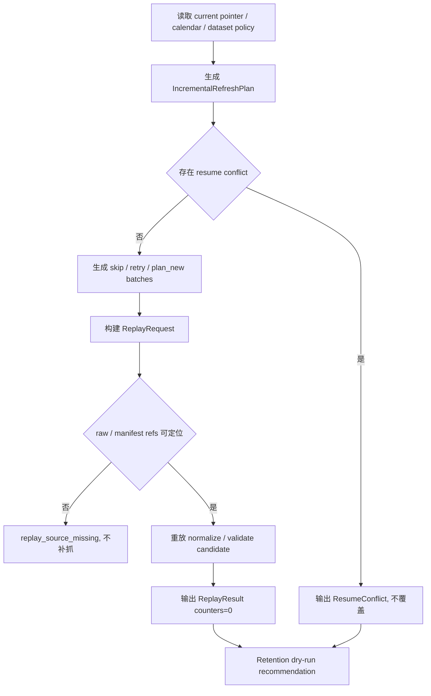

# LLD: CR014-S06 - incremental refresh / replay / retention 合同

> 本文档仅覆盖 `CR014-S06-incremental-refresh-replay-retention-contract` 的 Story 级低层设计。CP5 已由用户按推荐全部允许，当前 `confirmed=true`、`implementation_allowed=true`；实现仍受 Story DAG、文件所有权、CP6/CP7 和禁止真实 provider / lake / credential / DuckDB 依赖边界约束，retention execute 仍需独立授权。
>
> 本 LLD 不创建或修改任何代码、测试、真实 lake、旧 `data/**`、旧 reports、README 或 docs。CP5 前门控固定为：`provider_fetch=0`、`lake_write=0`、`credential_read=0`、`duckdb_dependency_change=0`。

## 1. Goal

创建未来实现阶段的 incremental refresh、最近 N 个交易日回补、replay、resume_conflict、candidate retention 和 current pointer 不污染策略蓝图，范围限定为 `market_data/incremental.py`、`market_data/replay.py`、`market_data/retention.py` 和 `tests/test_cr014_incremental_replay_retention.py`。完成后，replay 不触发 provider、不读凭据、不写 raw、不更新 current pointer；retention 默认只输出 dry-run recommendation，不删除、迁移或覆盖旧数据。

## 2. Requirements（Functional / Non-Functional）

### 2.1 Functional

- 覆盖 AC-01：replay 四类禁止计数均为 0：`provider_fetches=0`、`credential_reads=0`、`raw_writes=0`、`current_pointer_changes=0`。
- 覆盖 AC-02：resume_conflict 必须有结构化输出，不允许 silent overwrite。
- 覆盖 AC-03：candidate retention 不自动删除旧数据或 published truth；默认输出 recommendation。
- 覆盖 AC-04：CP5 前 `lake_write=0`、`credential_read=0`、`provider_fetch=0`。
- Incremental planner 必须读取 published current pointer、trading calendar、dataset policy，输出 affected partitions、skip/retry batches、recent N trade days refresh plan。
- Replay runner 必须只从 raw / manifest refs、run_id / batch_id 和 candidate config 重放 normalize / validate 派生链路；raw 缺失时返回 `replay_source_missing`，不得自动补抓。
- Retention policy 必须区分 candidate、published current truth、audit evidence、archive candidate；未显式 execute 授权时只输出 retain / archive / delete recommendation。
- Resume conflict 必须表达 conflict type、existing run / manifest refs、requested params、resolution options 和 blocked side effects。

### 2.2 Non-Functional

- 安全：不读取 `.env`、凭据、provider SDK、旧 `data/**`、旧 reports 内容；不执行真实 provider fetch、真实 lake write、真实删除或迁移。
- 可恢复：增量刷新计划必须支持 skip 已成功批次、retry 失败批次、resume_conflict 参数冲突。
- 可追溯：计划、replay 和 retention recommendation 必须包含 run_id / batch_id / manifest ref / catalog pointer ref / reason code。
- 可验证：测试必须使用 fixture manifest、fixture catalog pointer 和 temporary path sentinel，不访问真实 lake。
- 幂等：相同 plan input 生成稳定 idempotency key；resume_conflict 不覆盖已有 candidate。
- 可维护：S06 只消费 S02 catalog / manifest 合同和 S03 runtime / validation 合同；不修改 shared files。

## 3. 模块拆分与职责

| 模块 / 文件组 | 职责 | 说明 |
|---|---|---|
| `market_data/incremental.py` / IncrementalPlanner | 根据 catalog current pointer、calendar 和 dataset policy 生成 affected partitions、recent N backfill、skip / retry plan | 未来实现阶段创建；plan 阶段不抓 provider |
| `market_data/replay.py` / ReplayRunner | 从 raw / manifest refs 重放 normalize / validate candidate，输出 replay evidence 与 permission counters | replay 不触发 provider、不读凭据、不写 raw、不改 current pointer |
| `market_data/replay.py` / ResumeConflictDetector | 对 run_id、manifest refs、partition lock、参数 hash 做冲突检测并输出结构化 conflict | 禁止 silent overwrite |
| `market_data/retention.py` / CandidateRetentionPolicy | 根据 candidate age、publish status、audit refs 生成 retain / archive / delete recommendation | 默认 dry-run；不删除、不迁移旧数据 |
| `market_data/catalog.py` / Catalog Input | 作为 S02 published current pointer 只读输入合同 | S06 不修改 shared catalog 文件 |
| `market_data/runtime.py` / Runtime Input | 作为 S03 run / normalize / validate 状态机只读输入合同 | S06 不修改 shared runtime 文件 |
| `tests/test_cr014_incremental_replay_retention.py` | 验证 incremental、replay、resume_conflict、retention dry-run 和 CP5 counters | 未来实现阶段创建；本 LLD 仅定义测试入口 |

## 4. 代码结构与文件影响范围

| 动作 | 文件路径 | 变更内容 |
|---|---|---|
| 创建 | `market_data/incremental.py` | 未来实现 incremental refresh planner、recent N trade days backfill plan、affected partition contract |
| 创建 | `market_data/replay.py` | 未来实现 replay request / result、resume conflict detector、permission counter enforcement |
| 创建 | `market_data/retention.py` | 未来实现 candidate retention dry-run recommendation、published truth protection、audit ref protection |
| 创建 | `tests/test_cr014_incremental_replay_retention.py` | 未来实现 replay no provider、resume_conflict、retention dry-run、incremental affected partitions 测试 |
| 不修改 | `market_data/runtime.py` | 仅消费 S03 runtime-contract；如需共享状态机改动，停止并交回 meta-po |
| 不修改 | `market_data/catalog.py` | 仅消费 S02 catalog current pointer；S06 不更新 current pointer |
| 禁止修改 | `data/**`、`reports/**`、`.env`、`pyproject.toml`、`uv.lock` | 不操作旧数据、不覆盖旧报告、不改依赖、不读凭据 |

## 5. 数据模型与持久化设计

本 Story 默认不新增持久化写入。以下对象为未来代码内结构化合同；若后续执行真实 run 或 retention execute，必须另行用户授权，且不属于 CP5 前或本 LLD 范围。

| 对象 / 字段 | 类型 | 约束 | 说明 |
|---|---|---|---|
| `IncrementalRefreshPlan.dataset` | string | 必填 | P0 dataset 或后续明确 dataset |
| `IncrementalRefreshPlan.as_of_trade_date` | date | 必填 | 最近已闭市交易日口径 |
| `IncrementalRefreshPlan.current_pointer_ref` | string | 必填 | 只读 S02 catalog current pointer |
| `IncrementalRefreshPlan.affected_partitions` | list[object] | 必填 | dataset / schema_version / date / exchange / board 等分区键 |
| `IncrementalRefreshPlan.batch_actions` | list[enum] | `skip` / `retry` / `plan_new` / `blocked` | 支持幂等 resume |
| `IncrementalRefreshPlan.permission_counters` | object | CP5 前全 0 | plan 不触发 provider / lake / credential |
| `ReplayRequest.run_id` | string | 必填 | 指向既有 raw / manifest refs |
| `ReplayRequest.manifest_refs` | list[string] | 必填 | 缺失时返回 `replay_source_missing` |
| `ReplayResult.provider_fetches` | int | 必须为 0 | replay 不抓 provider |
| `ReplayResult.credential_reads` | int | 必须为 0 | replay 不读凭据 |
| `ReplayResult.raw_writes` | int | 必须为 0 | replay 不写 raw |
| `ReplayResult.current_pointer_changes` | int | 必须为 0 | replay 不更新 catalog pointer |
| `ResumeConflict` | object | conflict 时必填 | 包含 conflict_type、existing_ref、requested_ref、resolution_options |
| `RetentionRecommendation` | object | dry-run 默认 | 包含 action、target_ref、reason、protected_by_publish、requires_execute_authorization |

## 6. API / Interface 设计

| 接口 / 入口 | 输入 | 输出 | 调用方 | 说明 |
|---|---|---|---|---|
| `plan_incremental_refresh(current_pointer, calendar, dataset_policy, recent_n)` | catalog current pointer、trading calendar、dataset policy、最近 N 交易日参数 | `IncrementalRefreshPlan` | future CLI / ops / QA tests | 只生成 plan；provider_fetch=0、lake_write=0 |
| `plan_recent_backfill(plan, failed_batches, success_batches)` | refresh plan、已成功批次、失败批次 | batch action list | future CLI / ops | 已成功 skip，失败 retry，冲突 blocked |
| `detect_resume_conflict(run_id, manifest_refs, requested_params, lock_state)` | run id、manifest refs、请求参数、partition lock | `ResumeConflict` 或 no-conflict | replay runner / tests | 不 silent overwrite |
| `run_replay_from_manifest(request)` | raw / manifest refs、candidate config、schema version | `ReplayResult` 或 `ReplayBoundaryError` | future replay CLI / validation | replay 只生成 candidate / evidence，不写 raw、不 publish |
| `evaluate_candidate_retention(candidates, publish_status, audit_refs, policy, dry_run=true)` | candidate age、publish status、audit refs、policy | `RetentionRecommendation` list | ops / QA tests | dry-run 默认；不删除、不迁移 |
| `assert_no_replay_side_effects(result)` | replay result / counters | pass / structured failure | tests / CP6 自检 | 四类 replay 禁止计数必须为 0 |

## 7. 核心处理流程

1. Incremental planner 读取 catalog current pointer、trading calendar、dataset policy 和 recent N 参数，计算 affected partitions、已成功批次、失败批次和计划批次。
2. 若参数或 lock 与已有 run / manifest refs 冲突，`detect_resume_conflict` 输出结构化 conflict，阻断 silent overwrite。
3. Replay request 必须显式传入 run_id、batch_id、raw / manifest refs 和 candidate config；缺 raw / manifest 时返回 `replay_source_missing`，不得触发 provider 补抓。
4. Replay 只重放 normalize / validate 派生链路，输出 candidate / audit evidence 和四类 0 counters；不更新 catalog current pointer。
5. Retention policy 读取 candidate age、publish status 和 audit refs，默认生成 dry-run recommendation；published truth 和仍被 audit refs 引用的 candidate 受到保护。
6. 所有输出回显 permission counters，并供 S05 claim boundary / S07 docs 后续消费。



异常路径：

- `authorization_required`：真实 run / lake write / retention execute 未授权时，只输出 plan 或 dry-run recommendation。
- `resume_conflict`：参数 hash、manifest refs、partition lock 或 run state 冲突时输出结构化 conflict，不覆盖 candidate。
- `replay_source_missing`：raw / manifest refs 缺失时 replay fail，不触发 provider fetch。
- `retention_execute_not_authorized`：请求删除 / 迁移但无 execute 授权时返回 blocked recommendation。
- `published_truth_protected`：target 已被 catalog current pointer 引用时禁止 delete / archive action。

## 8. 技术设计细节

- Incremental idempotency：plan 根据 dataset、as_of_trade_date、recent_n、current_pointer_ref、dataset_policy_hash 生成稳定 idempotency key。
- Recent N 回补：计划层只计算最近 N 个已闭市交易日 affected partitions，不在 CP5 前抓取或写入。
- Replay 边界：replay 从 raw / manifest 派生 candidate；`provider_fetches=0`、`credential_reads=0`、`raw_writes=0`、`current_pointer_changes=0` 是硬约束。
- Resume conflict：冲突输出必须包含 `conflict_type`、`existing_manifest_ref`、`requested_manifest_ref`、`resolution_options`，调用方只能显式选择新 run 或人工处理。
- Retention dry-run：默认 `dry_run=true`，输出 recommendation；任何 delete / archive execute 必须有用户显式授权，不属于本 Story 默认 dev_gate。
- Published protection：catalog current pointer 指向的 published truth、published gold 和 still-referenced audit evidence 不进入 delete action。
- 偏差记录：未来实现若必须修改 `market_data/runtime.py`、`market_data/catalog.py` 或执行真实 lake 操作，立即停止并交回 meta-po 修订范围。
- 图示类型选择：第 7 节使用流程图，因为存在 incremental、resume_conflict、replay、retention 多分支与异常路径。

## 9. 安全与性能设计

| 维度 | 设计措施 | 验证方式 |
|---|---|---|
| 安全 | Plan / replay / retention 默认不读取 `.env`、provider、旧 `data/**` 或旧 reports | monkeypatch sentinels；permission counters 单测 |
| 安全 | Replay 四类禁止计数固定为 0 | `assert_no_replay_side_effects` 单测 |
| 安全 | Retention 默认 dry-run，不删除、不迁移 published truth 或旧数据 | temp path sentinel；recommendation-only 测试 |
| 可恢复 | skip / retry / resume_conflict 明确 | batch action 和 conflict schema 单测 |
| 性能 | incremental plan 只计算 affected partitions，不加载真实全历史数据 | fixture calendar / catalog tests |
| 并发 | partition lock 冲突输出 `resume_conflict` | lock_state fixture 单测 |

## 10. 测试设计

| 测试场景 | 前置条件 | 操作 | 预期结果 | 验证方式 |
|---|---|---|---|---|
| Incremental plan affected partitions | fixture current pointer + calendar + recent_n | 调用 `plan_incremental_refresh` | 输出 affected partitions、skip / retry / plan_new；permission counters=0 | 单元测试 |
| Replay no provider / credential / raw / pointer side effect | fixture manifest refs | 调用 `run_replay_from_manifest` | 四类禁止计数均为 0；不调用 provider / credential / publish sentinel | 单元测试 |
| Replay source missing | manifest refs 缺失 | 调用 replay | 返回 `replay_source_missing`；provider_fetches=0 | 单元测试 |
| Resume conflict structured output | requested params 与 existing manifest hash 冲突 | 调用 `detect_resume_conflict` | 输出 conflict_type、existing_ref、requested_ref、resolution_options | 单元测试 |
| Retention dry-run recommendation | candidates + publish status | 调用 `evaluate_candidate_retention(dry_run=true)` | 只输出 retain/archive/delete recommendation；无删除 | contract test |
| Published truth protected | candidate 被 current pointer 引用 | retention evaluate | 输出 `published_truth_protected`，不建议 delete | 单元测试 |
| Unauthorized execute blocked | dry_run=false 但无 authorization | retention evaluate | 返回 `retention_execute_not_authorized` | 单元测试 |
| CP5 pre-gate counters | 当前 LLD / CP5 阶段 | 静态检查 frontmatter 与 CP5 | `implementation_allowed=false`、四类计数为 0 | CP5 自动预检 |

## 11. 实施步骤

| TASK-ID | 动作 | 目标文件 | 详细描述 | 对应测试 |
|---|---|---|---|---|
| TASK-CR014-S06-01 | 创建 | `market_data/incremental.py` | 定义 `IncrementalRefreshPlan`、affected partitions、recent N plan、skip / retry batch action 和 idempotency key | Incremental plan tests |
| TASK-CR014-S06-02 | 创建 | `market_data/replay.py` | 定义 `ReplayRequest`、`ReplayResult`、`ResumeConflict`、replay source missing 和 side-effect counters | Replay / resume conflict tests |
| TASK-CR014-S06-03 | 创建 | `market_data/retention.py` | 定义 `RetentionRecommendation`、published truth protection、dry-run recommendation 和 execute authorization guard | Retention tests |
| TASK-CR014-S06-04 | 创建 | `tests/test_cr014_incremental_replay_retention.py` | 添加 fixture catalog、manifest、calendar、lock_state、permission sentinels 和 CP5 pre-gate 静态断言 | 全部 S06 测试 |
| TASK-CR014-S06-05 | 不修改 | `market_data/runtime.py`、`market_data/catalog.py` | 只消费 S02/S03 合同；需要共享文件修改时停止并回到 meta-po | shared ownership review |
| TASK-CR014-S06-06 | 禁止 | `data/**`、`reports/**`、`.env`、`pyproject.toml`、`uv.lock` | 不操作旧数据、不覆盖旧报告、不改依赖、不读凭据 | CP5 / CP6 guardrail |

## 12. 风险、难点与预研建议

| 风险 / 难点 | 影响 | 缓解措施 / 预研建议 |
|---|---|---|
| Replay 被误写为重新抓取 | 触发越权 provider 和凭据读取 | replay 合同固定从 raw / manifest refs 重放，缺失返回 `replay_source_missing` |
| Resume conflict 被 silent overwrite | 污染 candidate 或破坏可恢复性 | 参数 hash / manifest refs / lock_state 冲突必须结构化输出 |
| Retention 默认删除 candidate | 丢失审计证据或 published truth | dry-run 默认，published truth / audit refs protected |
| Incremental plan 分区口径与 S02 不一致 | affected partitions 不可发布或不可 replay | 强制消费 S02 partition / catalog pointer 合同；不自行推断目录 |
| S03 runtime-contract 未 confirmed | implementation dev_gate 不满足 | CP5 批次确认前保持 `implementation_allowed=false` |

### OPEN / Spike 跟踪

| ID | 类型（OPEN / Spike） | 问题 | 下一动作 | 责任方 |
|---|---|---|---|---|
| O-CR014-S06-01 | OPEN | CR014 全量 8 张 LLD 尚需由 meta-po 汇总到 `checkpoints/CP5-ALL-STORIES-LLD-BATCH.md` 并统一人工确认 | 等待其他 meta-dev 完成 S01/S02/S03/S07/S08 LLD 与 CP5；meta-po 发起 CP5 批次审查 | meta-po |
| O-CR014-S06-02 | OPEN | S02 catalog / manifest 合同与 S03 runtime-contract 需在同一 CP5 批次确认后才能作为实现强输入 | CP5 批次 approved 后，将上游 LLD confirmed 状态作为 dev_gate 输入 | meta-po / meta-dev |

## 13. 回滚与发布策略

- 发布方式：本阶段只发布 LLD 与 CP5 自动预检；未来实现发布前必须满足全量 CP5 approved、当前 LLD `confirmed=true`、Wave / dev_gate 可执行。
- 回滚触发条件：CP5 人工审查要求修改、replay 合同与 ADR-052 冲突、retention 需要真实 delete / archive、需要修改 shared `runtime.py` / `catalog.py`。
- 回滚动作：将 Story 保持或退回 `lld-ready` / `changes_requested`，修订本 LLD 和 CP5；replay 回退为 `replay_source_missing` / dry-run plan，不执行 provider fetch、lake write、credential read 或 pointer update。

## 14. Definition of Done

- [x] 14 个章节全部填写完成。
- [x] 文件影响范围、接口、测试与 TASK-ID 实施步骤可直接指导后续编码。
- [x] CP5 已确认，`confirmed=true` 后才进入受控实现；本批仍不授权真实 provider / lake / credential / DuckDB 依赖操作或 retention execute。
- [x] CP5 前门控显式保留：`provider_fetch=0`、`lake_write=0`、`credential_read=0`、`duckdb_dependency_change=0`。
- [x] Replay 四类禁止计数明确为 0：`provider_fetches=0`、`credential_reads=0`、`raw_writes=0`、`current_pointer_changes=0`。
- [x] retention 默认 dry-run recommendation，不删除旧数据或 published truth。
- [x] OPEN / Spike 已清点：2 项，均不阻断 Story 级 LLD 可实现性，阻断实现直到 CP5 全量确认。

## 人工确认区

> **CP5 - Story LLD 可实现性门**
> meta-dev 先写入 `process/checks/CP5-CR014-S06-incremental-refresh-replay-retention-contract-LLD-IMPLEMENTABILITY.md` 自动预检结果。
> meta-po 收齐 CR014-FULL-HISTORY-LAKE-BATCH-A 全部 8 张 Story 的 LLD、CP4 自动预检摘要和 CP5 自动预检后，再生成并提示用户审查 `checkpoints/CP5-ALL-STORIES-LLD-BATCH.md`。
> 用户统一确认全部目标 Story 的 LLD 后，仍需满足当前 Wave、依赖门控与文件所有权门控方可进入实现。

**CP5 checklist 摘要**：

| # | 检查项 | 状态 | 证据 |
|---|---|---|---|
| 1 | LLD 覆盖 AC | 待检查 | 第 2 / 10 / 14 节 |
| 2 | 与 HLD / ADR 一致 | 待检查 | 第 3 / 8 / 12 节 |
| 3 | 文件影响范围明确 | 待检查 | 第 4 / 11 节 |
| 4 | 接口契约完整 | 待检查 | 第 6 节 |
| 5 | 测试与 dev_gate 可计算 | 待检查 | 第 10 / 14 节 |

**人工确认回复**：

```text
approve
修改: <具体修改点>
reject
```

**人工审查结果回填**：

- 结论：`approved | changes_requested | rejected`
- 审查人：
- 审查时间：
- 修改意见：
- 风险接受项：
