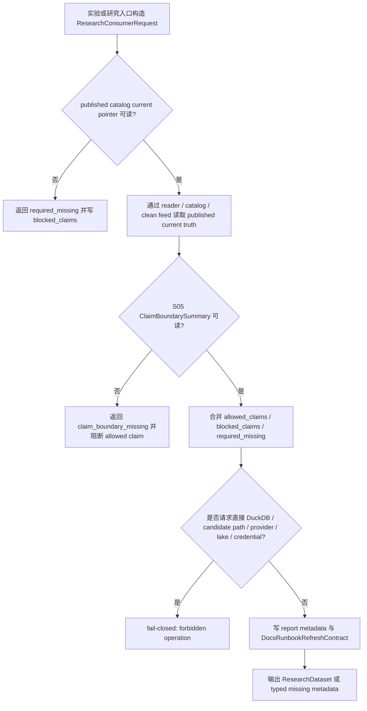

# LLD: CR014-S07 - research consumer read-only contract 与 docs/runbook 后续边界

> 本文档是 CR014-S07 的低层设计，纳入 `CR014-FULL-HISTORY-LAKE-BATCH-A` 全量 LLD 统一确认。CP5 已由用户按推荐全部允许，当前 `confirmed=true`、`implementation_allowed=true`；实现仍受 Story DAG、文件所有权、CP6/CP7 和研究消费只读边界约束，不得直接 provider fetch、lake write、DuckDB 写入、publish 或扫未发布 lake。
> 本 Story 只冻结研究消费层只读 published current truth、blocked claims、required_missing 和 docs/runbook 后续刷新输入边界；研究消费层不得 provider fetch、真实 lake write、credential read、直接 DuckDB 写入 / 发布 / 扫描未发布 lake、旧 `data/**` 操作或旧报告覆盖。

## 1. Goal

冻结 CR-014 研究消费层只读合同和 docs/runbook 后续刷新边界：未来实现阶段 `engine/research_dataset.py` 与 `experiments/reporting.py` 只能消费已 publish 的 catalog current truth、结构化 `blocked_claims` / `required_missing` 和数据湖侧 DuckDB audit/parity evidence 引用，不得绕过 catalog、不得直接打开 DuckDB 扫未发布 lake、不得写入或发布数据；README / USER-MANUAL 只作为后续刷新消费面，本 LLD 阶段不修改。

## 2. Requirements（Functional / Non-Functional）

### 2.1 Functional

- 覆盖 AC-01：研究消费层 provider fetch、lake write、credential read、旧 `data/**` 读 / 列 / 复制 / 删除次数均为 0。
- 覆盖 AC-02：实验入口直接 DuckDB 写入、创建事实源 view、触发 publish 或更新 catalog current pointer 的次数均为 0。
- 覆盖 AC-03：未发布 candidate path、DuckDB 临时 SQL view、parity pass 和 audit evidence 不作为 research current truth。
- 覆盖 AC-04：本 LLD / Story Plan 阶段 README 与 `docs/USER-MANUAL.md` 修改次数为 0；后续刷新只能消费结构化 claim boundary。
- 消费 S04 的 DuckDB read-only audit/parity 边界：研究层只引用 evidence path / run_id，不直接连接 DuckDB 执行查询。
- 消费 S05 的 full-history readiness / gap / claim boundary：报告 metadata 必须写 `allowed_claims`、`blocked_claims`、`required_missing` 和 `evidence_paths`。
- 消费 S06 的 incremental / replay / retention 合同：docs/runbook 后续说明必须区分 `candidate_unpublished`、`published_current_truth`、`duckdb_audit_only`、`authorization_needed`。

### 2.2 Non-Functional

- 安全：默认 `implementation_allowed=false`、`provider_fetch=0`、`lake_write=0`、`credential_read=0`、`duckdb_dependency_change=0`；不读取 `.env`、token 或真实私有路径。
- 可追溯：每个 allowed / blocked / missing 声明必须指向 catalog pointer、readiness / claim summary、permission counters 或 DuckDB evidence path。
- 可验证：第 6 节每个接口在第 10 节至少有 1 个测试入口；直接 DuckDB、candidate scan、provider / lake / credential 操作均有 fail-closed 测试。
- 可维护：主 HLD 研究消费职责与 companion 数据湖生产职责保持分离；生产写入、publish、DuckDB query runtime 均不进入研究消费层。
- 性能：研究层只消费 reader 已裁剪输出和结构化 metadata，不发起全湖扫描；大范围 audit 由数据湖侧 S04/S05 负责。

## 3. 模块拆分与职责

| 模块 / 文件组 | 职责 | 说明 |
|---|---|---|
| Research Dataset Consumer Gate | 在 `engine/research_dataset.py` 中约束研究输入只能来自 published reader / catalog / clean feed | 缺 current truth 时返回 typed `required_missing`，不触发补数 |
| Reporting Claim Boundary Adapter | 在 `experiments/reporting.py` 中把 S05 claim summary 写入研究报告 metadata | 不把 DuckDB audit/parity pass 升级为 allowed claim |
| DuckDB Evidence Reference Adapter | 只消费数据湖侧生成的 `run_id`、`evidence_path`、`parity_status` | 不在研究入口创建 DuckDB connection、view 或 scan |
| Docs / Runbook Refresh Contract | 产出 README / USER-MANUAL 后续刷新所需的结构化输入边界 | 本 Story LLD 阶段和当前分片不修改 README/docs |
| Forbidden Operation Guard | 静态扫描和测试 forbidden import / operation counters | 覆盖 provider、lake、credential、legacy data、direct DuckDB、publish |
| Test Contract | `tests/test_cr014_research_consumer_boundary.py` 验证只读、blocked claims、docs 修改为 0 | 只使用 fixture / monkeypatch，不访问真实 lake |

## 4. 代码结构与文件影响范围

| 动作 | 文件路径 | 变更内容 |
|---|---|---|
| 修改（未来实现） | `engine/research_dataset.py` | 增加 CR-014 consumer gate：只读 published current truth 或返回 `required_missing` / `blocked_claims`；禁止直接 DuckDB connection、provider、lake、credential、legacy data 操作 |
| 修改（未来实现） | `experiments/reporting.py` | 将 `universe_scope`、`as_of_trade_date`、P0 gate status、allowed / blocked / required_missing、DuckDB evidence refs 写入 report metadata |
| 创建（未来实现） | `tests/test_cr014_research_consumer_boundary.py` | 覆盖只读边界、direct DuckDB 禁止、candidate path 禁止、docs 修改次数为 0 和 forbidden operation counters |
| 不修改（本 Story LLD / 当前阶段） | `README.md` | 仅登记后续 docs/runbook 刷新输入边界；本阶段和本 Story 当前分片修改次数为 0 |
| 不修改（本 Story LLD / 当前阶段） | `docs/USER-MANUAL.md` | 仅登记后续 docs/runbook 刷新输入边界；实际刷新需 CP5 后由 meta-po 按授权路由 |
| 禁止修改 / 访问 | `.env`、`data/**`、`reports/**`、`pyproject.toml`、`uv.lock`、未发布 lake candidate、`*.duckdb` 事实源文件 | 本 Story 不读取凭据、不操作旧数据、不覆盖旧报告、不引入 DuckDB 依赖、不写真实 lake |

## 5. 数据模型与持久化设计

| 对象 / 字段 | 类型 | 约束 | 说明 |
|---|---|---|---|
| `ResearchConsumerRequest.universe_scope` | enum/string | 必填；CR-014 全 A 场景使用 `all_a_share` 或更窄研究范围 | 用于报告声明，不重算 universe denominator |
| `ResearchConsumerRequest.as_of_trade_date` | date | 必填；来自最近已闭市交易日口径 | 不使用盘中或未闭市数据声明 current truth |
| `PublishedTruthRef.catalog_pointer` | string/object | 必须来自 published catalog current pointer | candidate path 不可替代 |
| `ClaimBoundarySummary.allowed_claims` | list[string] | 只能由 S05 claim boundary 生成 | 研究层不得自由文本生成 allowed claim |
| `ClaimBoundarySummary.blocked_claims` | list[string] | 缺 P0 gate、lifecycle、catalog、permission evidence 时必填 | 用于 report metadata 和 docs/runbook 后续刷新 |
| `ClaimBoundarySummary.required_missing` | list[object] | 每项必须有 `reason`、`release_condition`、`evidence_path` | 缺证据时 fail-closed |
| `DuckDbEvidenceRef` | object | 仅含 `run_id`、`evidence_path`、`parity_status`、`audit_scope` | 不包含 SQL、connection string 或 candidate scan path |
| `PermissionCounters` | object | provider_fetch、lake_write、credential_read、duckdb_dependency_change、legacy_data_ops 均为 0 | CP5 前门控字段 |
| `DocsRunbookRefreshContract` | object | 只描述后续 README / USER-MANUAL 需要刷新的结构化输入 | 本 Story 不直接写文档 |

无新增数据库、无真实 lake 持久化、无 DuckDB 持久文件。未来实现阶段的持久化只限 report metadata / structured docs refresh contract 等轻量输出，且必须在 CP5 批次确认后重新按文件所有权执行。

## 6. API / Interface 设计

| 接口 / 入口 | 输入 | 输出 | 调用方 | 说明 |
|---|---|---|---|---|
| `build_research_dataset_from_published_truth` | `ResearchConsumerRequest`、published reader result、`ClaimBoundarySummary` | `ResearchDataset` 或 typed `required_missing` | experiments / tests | 只读 reader / catalog；不得触发 provider fetch、backfill、lake write |
| `attach_cr014_claim_boundary_metadata` | report metadata、`ClaimBoundarySummary`、`PermissionCounters` | updated report metadata | `experiments/reporting.py` | allowed / blocked / required_missing 必须结构化写入 |
| `consume_duckdb_audit_evidence_ref` | `DuckDbEvidenceRef` | metadata evidence reference | reporting / docs refresh contract | 只引用数据湖侧 evidence path 和 run_id；不打开 DuckDB |
| `emit_docs_runbook_refresh_contract` | `ClaimBoundarySummary`、S06 ops boundary、permission counters | `DocsRunbookRefreshContract` | 后续 README / USER-MANUAL 刷新 Story | 输出刷新输入，不直接修改 docs |
| `assert_research_consumer_forbidden_operations` | import graph、operation counters、touched files | pass/fail | tests / CP6 自检 | 断言 provider/lake/credential/legacy data/direct DuckDB/docs 修改违规 |

错误模型：`published_current_truth_missing`、`claim_boundary_missing`、`direct_duckdb_access_attempt`、`candidate_lake_scan_attempt`、`provider_fetch_attempt`、`credential_read_attempt`、`lake_write_attempt`、`legacy_data_access_attempt`、`docs_refresh_out_of_scope`。

限制：接口只能消费结构化输入；不得读取真实 provider、`.env`、旧 `data/**` 或未发布 lake 路径；不得把 DuckDB audit/parity evidence 升级为 source of truth。

## 7. 核心处理流程

1. 研究入口只接收显式 `ResearchConsumerRequest`，不得从 `.env`、旧 `data/**` 或 provider 推断输入。
2. 当前 truth 只能来自 published catalog current pointer 或 clean feed；缺失时返回 `required_missing`。
3. 读取 S05 claim summary，缺证据时默认 blocked，不输出 allowed production claim。
4. 若输入包含 direct DuckDB connection、未发布 candidate path、provider fetch、lake write、credential read 或 docs direct write 请求，立即 fail-closed。
5. 报告 metadata 写入 claim boundary；docs/runbook 只收到结构化刷新 contract。

## 8. 技术设计细节

- CP5 前门控固定：`implementation_allowed=false`、`provider_fetch=0`、`lake_write=0`、`credential_read=0`、`duckdb_dependency_change=0`。
- 研究消费层禁止导入或调用 `market_data.connectors`、`market_data.runtime`、`market_data.storage`、真实 provider SDK、网络抓取入口、凭据读取入口和直接 DuckDB connection。
- DuckDB 在本 Story 中只表现为数据湖侧 evidence reference：`run_id`、`evidence_path`、`parity_status`；研究层不得维护 SQL 模板、view registry 或 `.duckdb` 文件。
- `candidate_unpublished`、`published_current_truth`、`duckdb_audit_only`、`authorization_needed` 四类状态必须可被 docs/runbook 后续刷新消费。
- `DocsRunbookRefreshContract` 不包含可执行命令、token、真实 lake root 写入路径或 provider 参数；真实操作说明必须另起授权 Story。
- README 与 USER-MANUAL 的具体文案不在本 Story 当前输出中实现；本 LLD 只冻结后续刷新字段和禁止边界。
- 图示类型选择：流程图；原因是跨 research builder、reader/catalog、claim summary、reporting、docs refresh contract 和 forbidden operation guard，且异常分支需要一眼可见。

## 9. 安全与性能设计

| 维度 | 设计措施 | 验证方式 |
|---|---|---|
| 安全 | provider/lake/credential/legacy data/direct DuckDB 操作计数均为 0 | import scan、monkeypatch counters、forbidden path sentinel |
| 安全 | README / USER-MANUAL 本阶段修改次数为 0 | git diff / touched files 检查 |
| 安全 | DuckDB evidence 只作为 metadata 引用，不反向成为 current truth | metadata 字段断言、direct connection monkeypatch |
| 性能 | 研究层只消费 reader 输出和 claim summary，不扫描全湖 | 单测验证不接收 raw/candidate path；大范围 audit 由 S04/S05 |
| 一致性 | report metadata 与 docs refresh contract 使用同一 claim summary | snapshot / 字段集断言 |

## 10. 测试设计

| 测试场景 | 前置条件 | 操作 | 预期结果 | 验证方式 |
|---|---|---|---|---|
| published current truth 只读消费 | reader fixture 返回 catalog pointer 与 DataFrame bundle | 调用 `build_research_dataset_from_published_truth` | 输出 dataset metadata，provider/lake/credential/legacy data counters 均为 0 | pytest / monkeypatch |
| current truth 缺失 | reader fixture 返回 missing pointer | 构建研究数据 | 返回 `required_missing`，allowed production claim 为 0 | 字段断言 |
| blocked claims 入报告 | S05 claim summary 包含 blocked / required_missing | 调用 `attach_cr014_claim_boundary_metadata` | report metadata 保留 blocked_claims、required_missing、evidence_paths | snapshot |
| direct DuckDB 禁止 | 输入包含 DuckDB connection 或 SQL view 请求 | 调用 evidence adapter | 返回 `direct_duckdb_access_attempt` | pytest |
| candidate path 禁止 | 输入包含未发布 lake candidate path | 构建研究数据 | 返回 `candidate_lake_scan_attempt`，不读取路径 | monkeypatch path sentinel |
| docs/runbook 不直接修改 | 默认实现路径 | 检查 touched files | README 与 `docs/USER-MANUAL.md` 修改次数为 0 | git diff / touched file assertion |
| forbidden imports | 导入图包含 connector/runtime/storage/provider SDK | 执行 guard | fail 并指出 forbidden import | static import scan |
| DuckDB evidence 只引用 | 提供 `DuckDbEvidenceRef` | 生成 metadata | 只写 run_id/evidence_path，不打开 DuckDB | monkeypatch duckdb module |

## 11. 实施步骤

| TASK-ID | 动作 | 目标文件 | 详细描述 | 对应测试 |
|---|---|---|---|---|
| CR014-S07-T1 | 修改 | `engine/research_dataset.py` | 增加 published current truth consumer gate、typed `required_missing` 返回和 forbidden operation 检查 | published current truth 只读消费、current truth 缺失、candidate path 禁止 |
| CR014-S07-T2 | 修改 | `experiments/reporting.py` | 将 S05 claim summary、permission counters 和 DuckDB evidence refs 写入 report metadata | blocked claims 入报告、DuckDB evidence 只引用 |
| CR014-S07-T3 | 创建 | `tests/test_cr014_research_consumer_boundary.py` | 覆盖 direct DuckDB、provider/lake/credential/legacy data、README/docs touched files、forbidden imports | direct DuckDB 禁止、docs/runbook 不直接修改、forbidden imports |
| CR014-S07-T4 | 修改 | `experiments/reporting.py` | 输出 `DocsRunbookRefreshContract` 字段模型，供后续 README / USER-MANUAL 刷新消费 | report metadata 与 docs refresh contract 一致性 |

## 12. 风险、难点与预研建议

| 风险 / 难点 | 影响 | 缓解措施 / 预研建议 |
|---|---|---|
| S04/S05/S06 LLD 接口命名与本 Story 预期不一致 | 实现时 claim summary、DuckDB evidence 或 ops boundary 对接失败 | CP5 批次统一审查时对齐字段；本 Story 只依赖 HLD/ADR 冻结的语义 |
| DuckDB audit evidence 被研究层误当成 current truth | 报告可能输出错误 allowed claim | 接口只接受 evidence ref，不接受 SQL/view/candidate path；测试 direct DuckDB fail-closed |
| docs/runbook 后续刷新被误解为当前 Story 修改 README/docs | 违反本阶段写入边界 | LLD 和 CP5 明确 README/docs 修改次数为 0，后续刷新由 meta-po 单独路由 |
| `blocked_claims` 自由文本化 | 文档和报告声明漂移 | 使用结构化 `ClaimBoundarySummary`，缺字段 fail-closed |

### OPEN / Spike 跟踪

| ID | 类型（OPEN / Spike） | 问题 | 下一动作 | 责任方 |
|---|---|---|---|---|
| O-S07-01 | OPEN | S04/S05/S06 的最终 LLD 接口名称和字段路径需在 CR014 全量 CP5 中统一对齐 | meta-po 收齐 8 张 LLD 后在 CP5 批次审查中核对 shared fragments；若字段名变更则同步修订本 LLD | meta-po / 对应 meta-dev |
| O-S07-02 | OPEN | README / USER-MANUAL / runbook 的实际刷新责任方和时点不由本 Story 当前分片执行 | CP5 后由 meta-po 决定是否路由给后续 docs refresh Story 或 meta-doc；本 Story 只交付结构化刷新 contract | meta-po / meta-doc |

## 13. 回滚与发布策略

- 发布方式：当前仅发布 LLD 与 CP5 自动预检，等待 `checkpoints/CP5-ALL-STORIES-LLD-BATCH.md` 全量人工确认；CP5 approved 前不实现。
- 回滚触发条件：CP5 批次审查要求修改、发现研究层直接 DuckDB / candidate scan 边界不清、README/docs 被误列为当前修改目标、或 S04/S05/S06 合同字段冲突。
- 回滚动作：仅修订本 LLD 与对应 CP5 自动预检；若未来已实现，则撤销 `engine/research_dataset.py`、`experiments/reporting.py` 和 `tests/test_cr014_research_consumer_boundary.py` 的 S07 改动，不回滚旧数据、旧报告或 docs。

## 14. Definition of Done

- [ ] 14 个章节全部填写完成。
- [x] frontmatter 已更新为 `confirmed=true`、`status=approved`、`implementation_allowed=true`，后续仍受 Story DAG 和只读消费边界约束。
- [ ] CP5 前 `provider_fetch=0`、`lake_write=0`、`credential_read=0`、`duckdb_dependency_change=0`。
- [ ] 文件影响范围覆盖 `engine/research_dataset.py`、`experiments/reporting.py`、测试和 README/docs 后续边界。
- [ ] 第 6 节每个接口均在第 10 节有对应测试场景。
- [ ] 第 7 节 current truth missing、claim missing、direct DuckDB、candidate scan、forbidden operation 异常路径均有测试入口。
- [ ] README / `docs/USER-MANUAL.md` 当前阶段修改次数为 0。
- [ ] provider/lake/credential/legacy data/direct DuckDB 操作计数均为 0。
- [ ] OPEN 项已清点，且均为 CP5 批次对齐或后续路由问题，不授权当前实现。

## 人工确认区

> CP5 自动预检结果：`process/checks/CP5-CR014-S07-research-consumer-readonly-docs-runbook-boundary-LLD-IMPLEMENTABILITY.md`
> CP5 批次人工审查稿由 meta-po 后续创建：`checkpoints/CP5-ALL-STORIES-LLD-BATCH.md`

**人工审查结果回填**：

- 结论：`pending`
- 审查人：
- 审查时间：
- 修改意见：
- 风险接受项：
