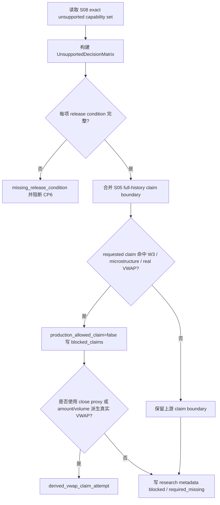

# LLD: CR014-S08 - W3 / minute / tick / Level2 / VWAP blocked 决策边界

> 本文档是 CR014-S08 的低层设计，纳入 `CR014-FULL-HISTORY-LAKE-BATCH-A` 全量 LLD 统一确认。CP5 已由用户按推荐全部允许，当前 `confirmed=true`、`implementation_allowed=true`；实现仍受 Story DAG、文件所有权、CP6/CP7 和 unsupported / blocked claim 边界约束，不得解除 W3 / minute / tick / Level2 / real VWAP blocked 声明。
> 本 Story 固化 W3、minute、tick、Level2、order book、order match、execution VWAP、VWAP fill 和真实撮合执行价的 blocked / unsupported 决策边界；不得接入、构造或伪造微观结构数据，不得用 close proxy 或 `amount/volume` 派生真实 VWAP claim。

## 1. Goal

创建 W3 / minute / tick / Level2 / VWAP blocked 决策边界的实现蓝图：未来实现阶段通过 `market_data/unsupported.py` 与 claim boundary 合同，将 W3 source/interface 未确认、分钟线、逐笔、Level2、order match、真实 VWAP、VWAP fill 和真实撮合执行价全部保持 production allowed claim 输出次数为 0，并要求解除条件 100% 指向后续 source/interface、Story、CP5 和用户显式授权。

## 2. Requirements（Functional / Non-Functional）

### 2.1 Functional

- 覆盖 AC-01：W3、minute、tick、Level2、order book、order match、execution VWAP、VWAP fill、真实撮合执行价的 production allowed claim 输出次数为 0。
- 覆盖 AC-02：每个 blocked / unsupported 项必须有 release condition，且 100% 指向后续 source/interface + Story + CP5 + 用户授权；真实 VWAP 还必须包含 `vwap`、`vwap_status=available` 和 execution audit pass。
- 覆盖 AC-03：close proxy、`amount/volume` 或任何日频派生字段形成真实 VWAP claim 的次数为 0。
- 覆盖 AC-04：不接入、不构造、不伪造 minute / tick / Level2 / order book / order match / microstructure 数据；不新增 provider、lake、credential 或 DuckDB 依赖。
- 消费 S05 full-history readiness / claim boundary：unsupported / blocked matrix 必须合并到 `blocked_claims` 与 `required_missing`，不得被 allowed claim 覆盖。

### 2.2 Non-Functional

- 安全：CP5 前 `implementation_allowed=false`、`provider_fetch=0`、`lake_write=0`、`credential_read=0`、`duckdb_dependency_change=0`；不读取 `.env`、旧 `data/**`、真实 lake 或旧报告。
- 可验证：unsupported decision matrix 的每一行均可被 contract test 精确断言；禁止使用模糊匹配判断 capability。
- 可追溯：每个 blocked / unsupported decision 必须回链 HLD-DATA-LAKE §17.2、HLD §30.1、ADR-045、ADR-046、ADR-050、ADR-051。
- 可维护：blocked capability exact set 与 release condition 在单一模块定义，`engine/research_dataset.py` 和 `market_data/claims.py` 只消费结构化结果。
- 性能：矩阵为小型静态合同，O(n) 构建；不扫描 lake、不读取 provider、不打开 DuckDB。

## 3. 模块拆分与职责

| 模块 / 文件组 | 职责 | 说明 |
|---|---|---|
| Unsupported Decision Matrix | 在 `market_data/unsupported.py` 定义 W3 / microstructure / VWAP blocked exact set 和 release conditions | 每行 production allowed claim 必须为 false |
| Claim Boundary Merger | 将 S05 claim boundary 与 unsupported matrix 合并 | 对应未来 `market_data/claims.py` 共享修改，需与 S05 合同对齐 |
| Research Metadata Consumer | 在 `engine/research_dataset.py` 中消费 unsupported / blocked claims | close proxy 只能写 research degradation，不写 real VWAP |
| Derived VWAP Guard | 阻断 close proxy 或 `amount/volume` 派生真实 VWAP claim | 命中时返回 `derived_vwap_claim_attempt` 或 blocked |
| Test Contract | `tests/test_cr014_unsupported_boundary.py` 覆盖 matrix、release conditions、no microstructure construction | 只使用 fixture，不接入真实数据源 |

## 4. 代码结构与文件影响范围

| 动作 | 文件路径 | 变更内容 |
|---|---|---|
| 创建 / 修改（未来实现） | `market_data/unsupported.py` | 定义 `UnsupportedCapabilityDecision`、`UnsupportedDecisionMatrix`、exact capability set、release condition 和 blocked reason |
| 修改（未来实现，共享） | `market_data/claims.py` | 合并 S05 readiness / claim boundary 与 S08 unsupported matrix，输出结构化 blocked / required_missing |
| 修改（未来实现，共享） | `engine/research_dataset.py` | 消费 unsupported claims，阻断真实 VWAP / microstructure production claim；close proxy 仅作为 research degradation |
| 创建（未来实现） | `tests/test_cr014_unsupported_boundary.py` | 覆盖 W3 / minute / tick / Level2 / VWAP blocked、release condition 完整性、derived VWAP 禁止、no microstructure construction |
| 禁止修改 / 访问 | `.env`、`data/**`、`reports/**`、`pyproject.toml`、`uv.lock`、minute/tick/Level2/order book 构造、真实 VWAP 伪造、provider fetch | 本 Story 不接入真实数据，不改依赖，不写真实 lake，不读取凭据 |

## 5. 数据模型与持久化设计

| 对象 / 字段 | 类型 | 约束 | 说明 |
|---|---|---|---|
| `UnsupportedCapabilityDecision.capability` | enum | exact set，禁止模糊匹配 | 如 `w3_source_interface`、`minute_bar`、`tick_trade`、`level2_order_book`、`order_match_execution`、`real_vwap_execution` |
| `status` | enum | `blocked` / `unsupported` / `research_degradation_only` | 不允许 `available` |
| `production_allowed_claim` | boolean | 必须为 `false` | AC-01 核心字段 |
| `blocked_claims` | list[string] | 每项非空，至少包含 capability 对应 claim | 写入 S05/S07 消费面 |
| `required_missing` | list[object] | 缺 source/interface 时必填 | W3 和真实 VWAP release 前置 |
| `release_condition` | list[string] | 必含 source/interface、Story、CP5、用户授权；真实 VWAP 另需 `vwap`、`vwap_status=available`、execution audit pass | AC-02 核心字段 |
| `denied_substitutes` | list[string] | 必含 close proxy、`amount/volume` 派生等适用项 | 防止伪真实 VWAP |
| `evidence_refs` | list[string] | 指向 HLD/ADR/S05 claim boundary | 不读取旧报告或真实数据 |
| `permission_counters` | object | provider_fetch、lake_write、credential_read、duckdb_dependency_change 均为 0 | CP5 前门控 |

无新增数据库、无真实 lake 持久化、无 DuckDB 持久文件。未来实现只定义静态 / 结构化合同与测试 fixture；不得创建 minute/tick/Level2 样本数据来模拟可用性。

## 6. API / Interface 设计

| 接口 / 入口 | 输入 | 输出 | 调用方 | 说明 |
|---|---|---|---|---|
| `get_cr014_unsupported_decision_matrix` | `as_of_trade_date`、可选 S05 claim summary | `UnsupportedDecisionMatrix` | claims / research dataset / tests | 返回 exact blocked / unsupported set；不访问 provider 或 lake |
| `resolve_microstructure_claim_boundary` | requested claims、`UnsupportedDecisionMatrix`、S05 claim boundary | `UnsupportedClaimBoundary` | `market_data/claims.py` | W3/minute/tick/Level2/VWAP production allowed claim 必须为 0 |
| `assert_no_derived_real_vwap_claim` | execution policy、available fields、requested claim | pass/fail 或 blocked reason | research dataset / tests | close proxy 与 `amount/volume` 不得产生真实 VWAP claim |
| `attach_unsupported_claims_to_research_metadata` | research metadata、`UnsupportedClaimBoundary` | updated metadata | `engine/research_dataset.py` | 将 blocked / required_missing 写入 metadata，不改变价格数据 |
| `validate_release_conditions_complete` | `UnsupportedDecisionMatrix` | pass/fail | tests / CP6 自检 | 解除条件必须 100% 指向后续 source/interface + Story + CP5 + 用户授权 |

错误模型：`w3_source_unresolved`、`microstructure_claim_unsupported`、`real_vwap_claim_blocked`、`derived_vwap_claim_attempt`、`close_proxy_real_execution_claim_attempt`、`missing_release_condition`、`forbidden_microstructure_data_construction`、`forbidden_provider_fetch_attempt`。

限制：接口只做合同决策，不接入微观结构数据源、不构造伪数据、不读取旧 evidence report、不打开 DuckDB、不更新 catalog / publish。

## 7. 核心处理流程

1. 定义 exact capability set，不根据名称模糊扩展。
2. 为每个 capability 生成 blocked / unsupported decision 和 release condition。
3. 合并 S05 的 readiness / gap / claim boundary；上游缺证据时默认 blocked。
4. requested claim 命中 W3、minute、tick、Level2、order match、真实 VWAP 或 VWAP fill 时，强制 `production_allowed_claim=false`。
5. 任意 close proxy 或 `amount/volume` 派生真实 VWAP 请求返回 blocked/error。
6. 将结果写入 research metadata，供 S07 / reporting / docs refresh 消费。

## 8. 技术设计细节

- CP5 前门控固定：`implementation_allowed=false`、`provider_fetch=0`、`lake_write=0`、`credential_read=0`、`duckdb_dependency_change=0`。
- exact capability set 初始包含：`w3_source_interface`、`minute_bar`、`tick_trade`、`level2_order_book`、`order_match_execution`、`execution_detail`、`real_vwap_execution`、`vwap_fill_claim`、`microstructure_impact_cost`。
- `close_proxy` 只能进入 `research_degradation_only`；不得映射为 `real_vwap_execution`、`vwap_fill_claim` 或真实撮合执行价。
- `amount/volume` 在本 Story 中只能作为 denied substitute；即使未来数据包含 amount / volume，也不能解除真实 VWAP blocked。
- release condition 统一格式：`source_interface_confirmed`、`new_story_defined`、`cp5_approved`、`user_authorized`；真实 VWAP 追加 `vwap_field_present`、`vwap_status_available`、`execution_audit_passed`。
- 与 S05 的接口关系：S08 提供 unsupported matrix，S05 claim boundary 作为上游 evidence；若 S05 没有提供 claim summary，S08 默认 fail-closed，不输出 allowed claim。
- 图示类型选择：流程图；原因是存在 capability matrix、S05 合并、requested claim 阻断、derived VWAP 异常分支。

## 9. 安全与性能设计

| 维度 | 设计措施 | 验证方式 |
|---|---|---|
| 安全 | 不接入、不构造 minute/tick/Level2/order book/order match/real VWAP 数据 | import scan、fixture scan、forbidden object sentinel |
| 安全 | provider/lake/credential/legacy data/DuckDB dependency counters 全为 0 | monkeypatch counters、git diff 检查 |
| 安全 | close proxy 与 amount/volume 派生真实 VWAP fail-closed | contract tests |
| 性能 | 静态矩阵 O(n)，不扫描 lake、不读取 Parquet 或 DuckDB | 单测只使用内存 fixture |
| 一致性 | unsupported matrix 与 S05/S07 claim boundary 使用结构化字段 | schema / snapshot 断言 |

## 10. 测试设计

| 测试场景 | 前置条件 | 操作 | 预期结果 | 验证方式 |
|---|---|---|---|---|
| W3 未确认 blocked | S05 claim summary 缺 W3 source/interface | 调用 `get_cr014_unsupported_decision_matrix` | `w3_source_interface.production_allowed_claim=false` | pytest |
| minute/tick/Level2 unsupported | requested claims 包含 microstructure claims | 调用 resolver | blocked / unsupported claims 写入 metadata，allowed claim 为 0 | contract test |
| release condition 完整 | matrix 全量 capability | 调用 `validate_release_conditions_complete` | 每项含 source/interface + Story + CP5 + 用户授权 | 字段断言 |
| 真实 VWAP blocked | requested claim 为 `real_vwap_execution` | 调用 resolver | blocked 包含真实 `vwap`、`vwap_status=available`、audit pass 解除条件 | snapshot |
| amount/volume 派生禁止 | available fields 包含 amount / volume，请求真实 VWAP | 调用 `assert_no_derived_real_vwap_claim` | 返回 `derived_vwap_claim_attempt` | pytest |
| close proxy 不是真实执行价 | execution policy 为 `close_proxy` | 合并 research metadata | 输出 `research_degradation_only`，真实 VWAP allowed claim 为 0 | snapshot |
| 不构造微观结构数据 | 默认测试 fixture | 扫描 fixture / imports | 无 minute/tick/Level2/order book 构造数据 | static scan |
| 禁止真实操作 | 默认验证路径 | 读取 counters | provider_fetch/lake_write/credential_read/duckdb_dependency_change 均为 0 | monkeypatch |

## 11. 实施步骤

| TASK-ID | 动作 | 目标文件 | 详细描述 | 对应测试 |
|---|---|---|---|---|
| CR014-S08-T1 | 创建 / 修改 | `market_data/unsupported.py` | 定义 unsupported capability exact set、`UnsupportedCapabilityDecision`、release condition 和 denied substitutes | W3 未确认 blocked、minute/tick/Level2 unsupported、release condition 完整 |
| CR014-S08-T2 | 修改 | `market_data/claims.py` | 合并 S05 claim boundary 与 S08 unsupported matrix，输出 blocked / required_missing | 真实 VWAP blocked、release condition 完整 |
| CR014-S08-T3 | 修改 | `engine/research_dataset.py` | 消费 unsupported claims，阻断 close proxy / amount / volume 形成真实 VWAP claim | amount/volume 派生禁止、close proxy 不是真实执行价 |
| CR014-S08-T4 | 创建 | `tests/test_cr014_unsupported_boundary.py` | 覆盖 exact matrix、release conditions、derived VWAP、forbidden microstructure data 和安全计数 | 全部 S08 测试场景 |

## 12. 风险、难点与预研建议

| 风险 / 难点 | 影响 | 缓解措施 / 预研建议 |
|---|---|---|
| capability 名称模糊匹配导致漏挡 | W3 或微观结构 claim 可能被误放行 | 使用 exact enum 和 contract test，不用 substring / regex 判断默认行为 |
| close proxy 被写成真实执行价 | 报告真实性被高估 | `research_degradation_only` 与 blocked claims 同时写入 metadata |
| amount/volume 被用作真实 VWAP 替代 | 违反 ADR-045 / ADR-050 | `denied_substitutes` 固化，命中即 `derived_vwap_claim_attempt` |
| S05 claim boundary 字段尚未最终确认 | 与 upstream claim summary 对接可能变更 | CP5 全量审查时对齐 S05/S08 shared fragments，必要时修订本 LLD |
| release condition 被误读为执行授权 | 触发越权 provider/lake/credential 操作 | release condition 只描述解除条件，真实执行必须另起 Story / CP5 / 用户授权 |

### OPEN / Spike 跟踪

| ID | 类型（OPEN / Spike） | 问题 | 下一动作 | 责任方 |
|---|---|---|---|---|
| O-S08-01 | OPEN | S05 `ClaimBoundarySummary` 的最终字段名和 merge 入口需在 CR014 全量 CP5 中统一确认 | meta-po 收齐 8 张 LLD 后核对 S05/S08 接口；若 S05 字段变化则同步修订 S08 §6 / §11 | meta-po / S05-S08 meta-dev |

## 13. 回滚与发布策略

- 发布方式：当前仅发布 LLD 与 CP5 自动预检，等待 `checkpoints/CP5-ALL-STORIES-LLD-BATCH.md` 全量人工确认；CP5 approved 前不实现。
- 回滚触发条件：CP5 批次审查要求修改、capability set 缺项、release condition 不完整、derived VWAP 未被阻断、或 S05 claim boundary 接口冲突。
- 回滚动作：仅修订本 LLD 与对应 CP5 自动预检；若未来已实现，则撤销 `market_data/unsupported.py`、`market_data/claims.py`、`engine/research_dataset.py` 和 `tests/test_cr014_unsupported_boundary.py` 的 S08 改动，不修改旧数据、旧报告、provider、lake 或依赖文件。

## 14. Definition of Done

- [ ] 14 个章节全部填写完成。
- [x] frontmatter 已更新为 `confirmed=true`、`status=approved`、`implementation_allowed=true`，后续仍受 Story DAG 和 unsupported / blocked claim 边界约束。
- [ ] CP5 前 `provider_fetch=0`、`lake_write=0`、`credential_read=0`、`duckdb_dependency_change=0`。
- [ ] W3、minute、tick、Level2、order book、order match、real VWAP、VWAP fill production allowed claim 输出次数为 0。
- [ ] 解除条件 100% 指向后续 source/interface + Story + CP5 + 用户授权；真实 VWAP 追加 `vwap`、`vwap_status=available`、execution audit pass。
- [ ] close proxy 或 `amount/volume` 派生真实 VWAP 次数为 0。
- [ ] 第 6 节每个接口均在第 10 节有对应测试场景。
- [ ] 第 7 节 missing release condition、requested unsupported claim、derived VWAP、forbidden operation 异常路径均有测试入口。
- [ ] OPEN 项已清点，且为 CP5 批次接口对齐问题，不授权当前实现。

## 人工确认区

> CP5 自动预检结果：`process/checks/CP5-CR014-S08-w3-minute-tick-level2-vwap-blocked-decision-boundary-LLD-IMPLEMENTABILITY.md`
> CP5 批次人工审查稿由 meta-po 后续创建：`checkpoints/CP5-ALL-STORIES-LLD-BATCH.md`

**人工审查结果回填**：

- 结论：`pending`
- 审查人：
- 审查时间：
- 修改意见：
- 风险接受项：
