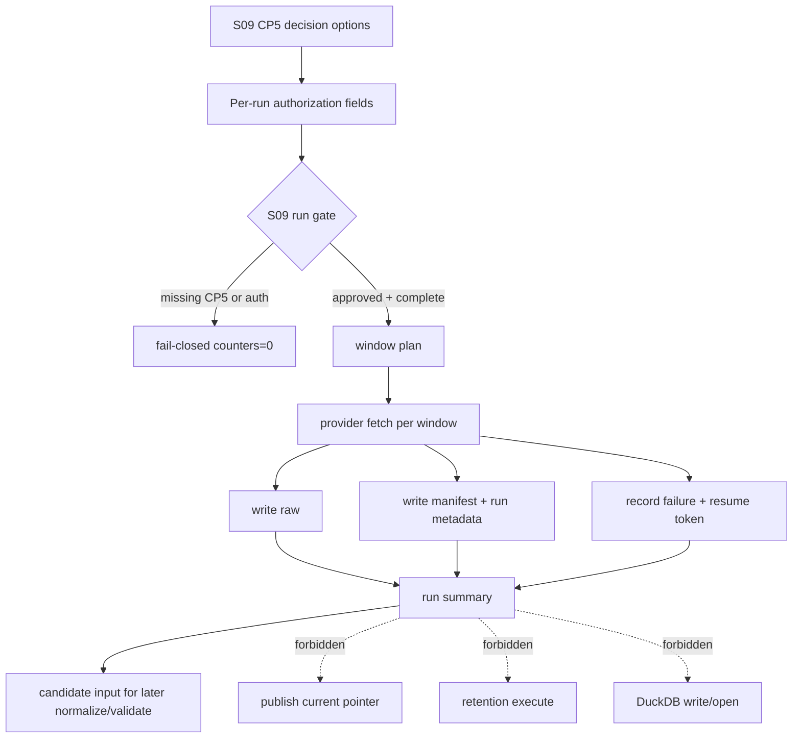

# LLD: CR014-S09 - 分时段真实抓取与 raw/manifest 写湖执行

> 本文档是 `CR014-S09-windowed-real-fetch-lake-write-run` 的低层设计，复用 Story 卡片中的 `story_slug=windowed-real-fetch-lake-write-run`，纳入 `CR014-REAL-RUN-BATCH-B` 独立 CP5 确认。
>
> 用户最新提出的“2026 年第一天至今的数据测试”在本 LLD 中登记为 S09 CP5 待确认选项，不是已经授权执行。当前日期为 2026-05-27，按最近已闭市交易日口径，默认 pilot window 更新为 `2026-01-01..2026-05-26`。真实 provider fetch 与 raw / manifest / run metadata 写湖只有在 S09 CP5 approved，且 per-run `authorization_id`、`dataset`、`date range`、`source/interface allowlist`、`lake root`、`window policy`、`resume policy`、`rollback policy`、`credential source policy` 全部明确后才可执行。
>
> 当前 `confirmed=true`、`implementation_allowed=true`、`real_run_authorized=false`。CP5 approve 只允许进入 S09 代码实现与 fake provider / `tmp_path` 验证；仍不允许真实抓取、写湖、读凭据、publish、retention execute、DuckDB 打开或写入，也不允许读写旧 `data/**`、旧 `reports/**` 或任何 `.env` 内容。

## 1. Goal

设计 S09 的分时段真实 provider 抓取与 raw / manifest / run metadata 写湖执行边界：在 CR014-S01..S08 全部 verified 后，按用户在 S09 CP5 和 per-run 授权中确认的 dataset、日期窗口、source/interface、lake root 与窗口策略，生成可审计、可恢复、可回滚的 windowed run；每个 window 独立记录 run_id、manifest、checksum、attempt、resume token、failure metadata 和 permission counters。

S09 只负责真实 provider fetch 以及 `raw`、`manifest`、run metadata、run-scoped audit、failure/resume metadata 的写入合同。S09 不自动 normalize，不自动 validate，不自动 publish current pointer，不运行 retention execute，不读写 DuckDB，不引入 DuckDB 依赖，不读取或覆盖旧 `data/**` / `reports/**` / README / docs。

## 2. Requirements（Functional / Non-Functional）

### 2.1 Functional

- F-01：在 S09 CP5 approved 前，`implementation_allowed=false`，真实 provider fetch、lake write、credential read、DuckDB dependency change、DuckDB write、catalog current pointer publish、retention execute 均为 0。
- F-02：真实 run 必须绑定 per-run `authorization_id`，并记录授权的 dataset、date range、source/interface allowlist、lake root、window policy、resume policy、rollback policy、credential source policy。
- F-03：用户“2026 年第一天至今的数据测试”必须进入 S09 CP5 决策选项：推荐 `2026-01-01..2026-05-26`，备选 A `2025-05-27..2026-05-26`，备选 B `2026-04-27..2026-05-26`。
- F-04：分时段计划必须把授权 date range 切成可审计 windows，默认支持 `year`、`quarter`、`month`、`trading-day chunk`，具体窗口粒度由 S09 CP5 / per-run window policy 决定。
- F-05：每个 window 必须有独立 `run_id`、`window_id`、request fingerprint、raw checksum、manifest record、attempt metadata、resume token 和 status。
- F-06：单窗口成功只允许写 `raw`、`manifest`、run metadata 和 run-scoped audit；`current_pointer_changes=0`、`publish_count=0`、`retention_execute_count=0`。
- F-07：单窗口失败必须记录 failed window、error enum、attempt、retryable 标记和 resume token；失败窗口不得覆盖成功窗口，不得触发 publish，不得触发 retention execute。
- F-08：resume 必须按 `authorization_id`、dataset、window、source/interface、lake root、request fingerprint 精确匹配；冲突时输出 `resume_conflict` 并 fail-closed。
- F-09：S09 输出的 run summary 只能作为后续 normalize / validate / publish 的 candidate input，不得自动调用后续阶段。

### 2.2 Non-Functional

- 安全：缺任一授权字段时 fail-closed；日志与 manifest 只能记录凭据来源策略或 env var 名称，不记录 token、密码、`.env` 内容、cookie、session 或未脱敏 provider payload。
- 可恢复：window 级 idempotency、manifest checksum、attempt 记录和 resume token 必须足以定位已成功、待重试、失败和冲突窗口。
- 可审计：run metadata 必须串联 `authorization_id`、dataset、date range、source/interface、lake root label、window policy、permission counters 和后续 candidate refs。
- 性能：窗口大小必须可配置，默认避免一次性全历史抓取；provider rate limit、backoff 和 chunk size 必须进入 window policy。
- 可验证：实现前测试以 fake provider 和 `tmp_path` 为主；真实 2026 YTD smoke 只能在 S09 CP5 approved 和 per-run 授权完整后作为单独验证入口执行。
- 兼容性：保持 Parquet / manifest / catalog source-of-truth 和 Explicit Publish Gate 边界；不改变 S02/S03/S06 的 publish、normalize、replay、retention 合同。

## 3. 模块拆分与职责

| 模块 / 文件组 | 职责 | 说明 |
|---|---|---|
| `market_data/windowed_run.py` | 创建 S09 windowed run 核心模型与流程编排 | primary；新增 `RunAuthorization`、`WindowPlan`、`WindowRunRecord`、`ResumeToken`、`WindowedRunSummary` |
| `market_data/runtime.py` | 修改真实 run gate，校验 S09 dev_gate、CP5、per-run 授权和 source/interface allowlist | shared；必须 fail-closed，未授权 connector call count 为 0 |
| `market_data/manifest.py` | 修改 raw manifest / run metadata 记录合同 | shared；仅允许记录 raw/manifest/run metadata，不更新 catalog pointer |
| `market_data/lake_layout.py` | 修改 raw / manifest / run metadata 路径解析与 lake root 禁区校验 | shared；必须显式 lake root，不使用旧 `data/**` |
| `market_data/cli.py` | 修改 CLI plan/run 入口，输出窗口计划、授权缺口和 run summary | shared；真实 run 入口默认 fail-closed |
| `tests/test_cr014_windowed_real_run_contract.py` | 创建 fake provider / tmp_path 合同测试 | primary；覆盖授权、窗口、写入、失败、resume、no publish 和禁区 |
| S01 lifecycle / S02 manifest-catalog / S03 run gate / S06 replay-retention 合同 | 作为上游强输入 | S09 不重定义 lifecycle denominator、catalog current pointer、normalize/replay 或 retention |

## 4. 代码结构与文件影响范围

| 动作 | 文件路径 | 变更内容 |
|---|---|---|
| 创建 | `market_data/windowed_run.py` | 新增 S09 windowed run 数据模型、窗口拆分、授权校验、fake-provider 适配点、failure/resume metadata 和 run summary 生成 |
| 修改 | `market_data/runtime.py` | 在现有 run gate 中增加 S09 dev_gate、CP5 approved、per-run 授权字段、source/interface allowlist 和 fail-closed counters |
| 修改 | `market_data/manifest.py` | 增加 raw manifest / run metadata 的 window 字段、checksum、attempt、resume token、authorization_id 和 failure metadata |
| 修改 | `market_data/lake_layout.py` | 增加 raw / manifest / run metadata 的 lake root 显式解析、路径占用 / 禁区检查和 run-scoped path 构造 |
| 修改 | `market_data/cli.py` | 增加或扩展 S09 `plan` / `run` CLI 合同，未授权时只输出 authorization_needed 和 window plan |
| 创建 | `tests/test_cr014_windowed_real_run_contract.py` | 覆盖 S09 fake provider / tmp_path 单测与集成合同测试 |

禁止修改：`pyproject.toml`、`uv.lock`、`.env`、`data/**`、`reports/**`、`README.md`、`docs/**`、依赖文件、DuckDB 文件、catalog current pointer 真实文件、retention execute 相关真实数据。

## 5. 数据模型与持久化设计

| 对象 / 字段 | 类型 | 约束 | 说明 |
|---|---|---|---|
| `RunAuthorization.authorization_id` | `str` | 真实 run 必填，唯一 | per-run 审计主键；无值时 fail-closed |
| `RunAuthorization.datasets` | `tuple[str, ...]` | 必须 exact 且非空 | 只能执行授权 dataset |
| `RunAuthorization.date_range` | `DateRange` | 起止日期必填 | 必须匹配 S09 CP5 或用户显式修改后的范围 |
| `RunAuthorization.source_interface_allowlist` | `tuple[SourceInterface, ...]` | 必须 exact | provider/source/interface 双字段白名单 |
| `RunAuthorization.lake_root` | `Path` 或安全 root label | 必须显式 | 不得默认为旧 `data/**`；日志使用脱敏 label |
| `RunAuthorization.window_policy` | `WindowPolicy` | 必填 | `year` / `quarter` / `month` / `trading-day chunk`、chunk size、rate limit |
| `RunAuthorization.resume_policy` | `ResumePolicy` | 必填 | `retry_failed` / `skip_success` / `resume_conflict` 行为 |
| `RunAuthorization.rollback_policy` | `RollbackPolicy` | 必填 | 已写 raw/manifest 的隔离、标记或删除策略；删除需额外授权 |
| `RunAuthorization.credential_source_policy` | `CredentialSourcePolicy` | 必填 | 只记录来源策略和 env var 名称，不记录 secret 值 |
| `WindowPlan.window_id` | `str` | dataset + date range + policy 派生 | window 级 idempotency key 输入 |
| `WindowPlan.start_date/end_date` | `str` | 闭区间 | 必须落入授权 date range |
| `WindowRunRecord.status` | `str` | `planned/running/succeeded/failed/skipped/conflict` | 每个 window 独立状态 |
| `WindowRunRecord.run_id` | `str` | 每次 run 唯一 | 可与 `authorization_id` 串联追溯 |
| `WindowRunRecord.raw_refs` | `tuple[str, ...]` | 成功时非空 | 指向 run-scoped raw 写入引用 |
| `WindowRunRecord.manifest_ref` | `str` | 成功或失败均应有记录 | 指向 run-scoped manifest / metadata |
| `WindowRunRecord.raw_checksum` | `str` | 成功时必填 | provider payload checksum |
| `WindowRunRecord.resume_token` | `str` | 必填 | 重试、跳过、冲突判断依据 |
| `WindowRunRecord.permission_counters` | `dict[str, int]` | 必填 | provider_fetch、lake_write、credential_read、publish、retention、duckdb 等计数 |
| `WindowedRunSummary.current_pointer_changes` | `int` | 必须为 0 | S09 不 publish |
| `WindowedRunSummary.publish_count` | `int` | 必须为 0 | S09 不 publish |
| `WindowedRunSummary.retention_execute_count` | `int` | 必须为 0 | S09 不执行 retention |

持久化范围：S09 真实执行获批后只写 run-scoped `raw`、`manifest`、run metadata、run-scoped audit、failure/resume metadata。测试阶段只写 `tmp_path`。本 Story 不写 canonical、gold、quality、catalog current pointer、DuckDB、旧 `data/**`、旧 `reports/**`。

## 6. API / Interface 设计

| 接口 / 入口 | 输入 | 输出 | 调用方 | 说明 |
|---|---|---|---|---|
| `build_s09_authorization(raw_input)` | authorization_id、datasets、date_range、allowlist、lake_root、window/resume/rollback/credential policies | `RunAuthorization` 或 typed errors | CLI / tests | 缺字段输出 `authorization_required` 或字段级错误 |
| `plan_windowed_run(authorization, calendar, existing_manifest_index)` | `RunAuthorization`、交易日历、既有 manifest index | `WindowPlan[]` + `authorization_needed` | CLI plan / runtime | plan 可 dry-run，不抓 provider、不写 lake |
| `evaluate_s09_run_gate(dev_gate, authorization, cp5_state)` | Story dev_gate、authorization、CP5 状态 | `RunGateResult` | CLI run / runtime | S09 CP5 未 approved 或 `implementation_allowed=false` 时 fail-closed |
| `execute_windowed_run(plan, provider, lake_writer, manifest_writer)` | window plan、provider adapter、writer | `WindowedRunSummary` | CLI run / runtime | 只有 run gate 通过后才可调用真实 provider / writer |
| `write_raw_manifest_window(window, provider_payload, authorization)` | window、payload、authorization | `WindowRunRecord` | windowed_run -> manifest/layout | 写 raw、manifest、run metadata；不 publish |
| `record_window_failure(window, error, authorization)` | window、typed error、authorization | `WindowRunRecord` | windowed_run | 记录 failure/resume metadata，不覆盖成功窗口 |
| `resume_windowed_run(previous_summary, authorization, resume_policy)` | previous summary、authorization、policy | `WindowPlan[]` 或 `resume_conflict` | CLI resume / runtime | request fingerprint 不一致时 fail-closed |
| `rollback_windowed_run(summary, rollback_policy)` | run summary、rollback policy | `RollbackPlan` 或 blocked | CLI rollback preview | 默认只生成计划；真实删除/归档需额外授权 |

结构化错误码：`s09_cp5_not_approved`、`implementation_not_allowed`、`authorization_required`、`dataset_not_allowed`、`date_range_not_allowed`、`source_interface_not_allowed`、`lake_root_required`、`window_policy_required`、`resume_policy_required`、`rollback_policy_required`、`credential_source_policy_required`、`provider_rate_limited`、`provider_schema_mismatch`、`raw_write_failed`、`manifest_write_failed`、`resume_conflict`、`rollback_requires_authorization`。

第 6 节每个接口在第 10 节均有对应测试或验证入口。

## 7. 核心处理流程

1. CP5 阶段仅登记运行窗口选项和授权字段，不执行真实 run。
2. `build_s09_authorization` 校验 per-run 字段；缺任一字段时返回 typed error，provider/lake/credential counters 全 0。
3. `plan_windowed_run` 将授权 date range 按 window policy 切分，生成 `WindowPlan[]`、request fingerprint 和 dry-run summary。
4. `evaluate_s09_run_gate` 校验 S09 LLD confirmed、S09 CP5 approved、`implementation_allowed=true`、S01..S08 verified、file_conflict_free、authorization 完整。
5. run gate 通过后，`execute_windowed_run` 对每个 window 调 provider，写 raw、manifest、run metadata，并记录 checksum、attempt、resume token。
6. 任一 window 失败时，记录 failed record 和 resume token；成功窗口保持 immutable，不触发 publish，不触发 retention execute。
7. 全部授权窗口完成后，输出 `WindowedRunSummary`，其中 `current_pointer_changes=0`、`publish_count=0`、`retention_execute_count=0`。
8. 后续 normalize / validate / publish 必须由独立授权和对应 Story / gate 触发，S09 不自动调用。



## 8. 技术设计细节

- 关键规则：`implementation_allowed=false`、S09 CP5 未 approved 或 per-run 授权字段缺失时，任何真实执行入口必须返回 blocked result，且 `provider_fetch=0`、`lake_write=0`、`credential_read=0`。
- CP5 窗口选项：推荐 `2026-01-01..2026-05-26`；备选 A `2025-05-27..2026-05-26`；备选 B `2026-04-27..2026-05-26`。这些是 CP5 决策选项，不是执行授权。
- request fingerprint：由 `authorization_id`、dataset、window start/end、source/interface、lake root label、window policy、credential source policy、schema version 组成，用于 resume 精确匹配。
- idempotency：已成功 window 默认 `skip_success`；失败 window 按 resume policy 重试；fingerprint 不一致输出 `resume_conflict`。
- raw / manifest 写入：写入路径必须 run-scoped，不覆盖旧 window；manifest 必须先记录 planned/running，再记录 succeeded/failed 终态。
- rollback：默认只输出 rollback plan；删除、归档、覆盖或清理 raw/manifest 需要 rollback policy 和额外执行授权。无授权时 `rollback_requires_authorization`。
- provider 限速：window policy 必须包含 chunk size、rate limit/backoff、max retries 和 stop-on-error 行为。
- source-of-truth 边界：S09 的 raw/manifest/run metadata 是后续 normalize/replay 的输入，不是 published current truth；Explicit Publish Gate 仍由 S02/S03 后续授权控制。
- DuckDB 边界：S09 不打开 DuckDB，不写 `.duckdb`，不引入 DuckDB 依赖；DuckDB 只读审计仍属于 S04/S07 既定边界或后续独立授权。

## 9. 安全与性能设计

| 维度 | 设计措施 | 验证方式 |
|---|---|---|
| 授权安全 | per-run 9 类字段缺一 fail-closed；CP5 approved 不等于真实 run authorization | fake provider 测试断言 connector call count 和 counters 为 0 |
| 凭据安全 | 只接受 credential source policy；日志 / manifest 不记录 token、密码、`.env` 内容、cookie、session | 静态扫描和负向 fixture 检查敏感字段不落盘 |
| 路径安全 | lake root 必须显式；禁止旧 `data/**`、旧 `reports/**`、README/docs、`.env`、DuckDB 文件 | tmp_path 测试 + path guard 负向测试 |
| 发布安全 | S09 强制 `current_pointer_changes=0`、`publish_count=0` | run summary 测试 |
| 保留安全 | S09 强制 `retention_execute_count=0`；rollback 默认 dry-run plan | rollback 测试 |
| 审计 | manifest 记录 authorization_id、window、checksum、attempt、resume token、permission counters | manifest schema / run summary 测试 |
| 性能 | window policy 控制 chunk、rate limit、retry/backoff；避免单次全历史请求 | window split 单测覆盖年 / 月 / trading-day chunk |
| 可恢复 | 成功窗口 skip，失败窗口 retry，fingerprint 冲突 blocked | partial failure / resume conflict 测试 |

## 10. 测试设计

| 测试场景 | 前置条件 | 操作 | 预期结果 | 验证方式 |
|---|---|---|---|---|
| CP5 选项登记 | 仅生成 LLD/CP5 | 检查 recommended / alternative windows | 三个窗口作为决策选项存在，不标记授权 | CP5 文档检查 |
| 缺 S09 CP5 approved | fake provider、tmp_path | 调 `evaluate_s09_run_gate` | `s09_cp5_not_approved`，provider/lake/credential counters 0 | 单元测试 |
| 缺 `authorization_id` | S09 CP5 approved fixture，但无 auth id | build authorization / run gate | `authorization_required`，connector call count 0 | 单元测试 |
| 缺 dataset / date range / allowlist / lake root | 字段逐项为空 | build authorization | 字段级错误，真实计数 0 | 参数化单元测试 |
| 缺 window/resume/rollback/credential policy | 字段逐项为空 | build authorization | 字段级错误，真实计数 0 | 参数化单元测试 |
| window split | 授权 `2026-01-01..2026-05-26` | 按 month / quarter / trading-day chunk 生成 plan | window 覆盖完整且不越界 | 单元测试 |
| fake provider 成功窗口 | CP5 + per-run auth fixture，tmp_path writer | 执行 1 个 fake window | 写 raw、manifest、run metadata；pointer/publish/retention 为 0 | tmp_path 集成测试 |
| 单窗口失败 | fake provider 第 N 个 window 抛 typed error | 执行 run | 成功窗口不覆盖；失败窗口记录 error/resume token；不 publish | tmp_path 集成测试 |
| resume success | previous summary 有 failed window | resume | 只重试 failed window，成功窗口 skip | 单元测试 |
| resume conflict | authorization 或 source/interface 改变 | resume | `resume_conflict`，不抓 provider、不写 lake | 单元测试 |
| rollback preview | run summary 存在 raw/manifest refs | rollback dry-run | 输出 rollback plan；无真实删除/归档 | 单元测试 |
| no old data/reports | fake run | 扫描 path guard 和 writer calls | 不读取、不列出、不覆盖旧 `data/**` / `reports/**` | 静态扫描 + mock assertion |
| no DuckDB | fake run | 扫描依赖和 import | 无 `duckdb` import、无 `.duckdb`、无 SQL write | 静态扫描 |
| 真实 2026 YTD smoke 候选 | S09 CP5 approved 且 per-run 授权完整 | 用户另行触发真实 smoke | 只执行授权窗口；输出 run summary；不 publish | 手工/QA 验证入口，当前不执行 |

## 11. 实施步骤

| TASK-ID | 动作 | 目标文件 | 详细描述 | 对应测试 |
|---|---|---|---|---|
| TASK-S09-01 | 创建 | `market_data/windowed_run.py` | 定义 S09 数据模型、window split、authorization builder、run gate facade、failure/resume/rollback plan 纯函数 | CP5 选项、授权缺字段、window split、resume conflict |
| TASK-S09-02 | 修改 | `market_data/runtime.py` | 接入 S09 run gate，保证 CP5 / dev_gate / auth 缺失时 connector call count 为 0 | 缺 CP5、缺 auth、fake connector call count |
| TASK-S09-03 | 修改 | `market_data/manifest.py` | 增加 windowed raw manifest / run metadata record builder，记录 checksum、attempt、resume token、failure metadata | fake provider 成功、单窗口失败、manifest schema |
| TASK-S09-04 | 修改 | `market_data/lake_layout.py` | 增加 S09 run-scoped raw / manifest / metadata path builder 和 lake root / 禁区校验 | path guard、no old data/reports、tmp_path write |
| TASK-S09-05 | 修改 | `market_data/cli.py` | 增加 S09 plan/run/resume/rollback preview CLI 输出；未授权时只输出 authorization_needed | CLI fail-closed smoke、rollback preview |
| TASK-S09-06 | 创建 | `tests/test_cr014_windowed_real_run_contract.py` | 创建 fake provider / tmp_path 覆盖 S09 设计中的接口、错误和安全边界 | 本文件全部测试场景 |

每个 TASK-ID 与第 4 节文件影响范围一一对应。若实现必须扩大文件所有权、修改依赖、读凭据、写真实 lake、执行真实 run、引入 DuckDB 或修改 README/docs，必须停止并交回 meta-po 重新发起 CP5 / CR。

## 12. 风险、难点与预研建议

| 风险 / 难点 | 影响 | 缓解措施 / 预研建议 |
|---|---|---|
| 2026 YTD 测试被误解为已授权 | 越权真实抓取 / 写湖 | 在 CP5 中列为决策选项；真实 run 仍需 per-run 授权字段完整 |
| provider schema 或限速变化 | 部分窗口失败 | window policy 记录 rate limit/backoff；失败窗口记录 resume token |
| raw 写入成功但 manifest 失败 | 审计链断裂 | 设计 run-scoped attempt metadata；失败记录必须包含 raw ref 或 cleanup/rollback plan |
| manifest 成功但后续 publish 被误触发 | candidate 污染 current truth | S09 强制 `current_pointer_changes=0`；publish 需独立 Explicit Publish Gate |
| resume 参数漂移 | 重复抓取或覆盖成功窗口 | request fingerprint 精确匹配，冲突 fail-closed |
| lake root 指向旧 repo `data/**` | 污染旧数据或违反禁区 | lake root 必须显式并通过禁区校验 |
| credential source 记录过多 | 泄露凭据或私有路径 | 只记录 policy 与 env var 名称，禁止 secret 值和 `.env` 内容 |
| rollback 被当作删除授权 | 误删 raw/manifest | 默认只生成 rollback plan，真实删除/归档需额外授权 |
| DuckDB 被拉入 S09 | 扩大依赖和写入风险 | S09 不打开、不写入、不引入 DuckDB；只保留 Parquet/manifest/catalog source-of-truth |

### OPEN / Spike 跟踪

| ID | 类型（OPEN / Spike） | 问题 | 下一动作 | 责任方 |
|---|---|---|---|---|
| S09-O-01 | OPEN | CP5 是否选择 2026 年初至最近已闭市交易日 `2026-01-01..2026-05-26` | meta-po 在 S09 CP5 人工确认稿中发起决策 | user / meta-po |
| S09-O-02 | OPEN | 是否改选最近完整一年 `2025-05-27..2026-05-26` | CP5 中作为备选 A | user |
| S09-O-03 | OPEN | 是否先做一月 smoke `2026-04-27..2026-05-26` | CP5 中作为备选 B | user |
| S09-O-04 | OPEN | per-run `authorization_id` 未提供 | CP5 approved 后、真实 run 前填写 | user |
| S09-O-05 | OPEN | dataset 清单未提供 | CP5 approved 后、真实 run 前填写 exact list | user |
| S09-O-06 | OPEN | source/interface allowlist 未提供 | CP5 approved 后、真实 run 前填写 exact allowlist | user |
| S09-O-07 | OPEN | lake root 未提供 | CP5 approved 后、真实 run 前填写并通过路径护栏 | user |
| S09-O-08 | OPEN | window/resume/rollback policy 未提供 | CP5 approved 后、真实 run 前选择 | user / meta-po |
| S09-O-09 | OPEN | credential source policy 未提供 | CP5 approved 后、真实 run 前明确凭据来源和脱敏规则 | user |

## 13. 回滚与发布策略

- 发布方式：本 LLD 只发布设计与 CP5 自动预检，不发布数据。未来 S09 实现后，真实 run 只生成 raw、manifest、run metadata、audit 和 failure/resume metadata；不更新 catalog current pointer。
- 回滚触发条件：CP5 人工确认未通过；用户修改窗口 / dataset / source / lake / policy；实现发现需扩大文件所有权；fake provider / tmp_path 测试无法证明 fail-closed；真实 smoke 前 per-run 授权字段缺失。
- 回滚动作：LLD 阶段回滚为修改 S09 LLD / CP5 自动预检；实现阶段回滚到上一个 manifest/run metadata 版本或删除本 Story 新增代码；真实 run 阶段默认只生成 rollback plan，真实删除、归档或清理 raw/manifest 必须获得额外 rollback authorization。
- 数据发布：S09 run summary 可作为后续 normalize/validate/publish 的候选输入；Explicit Publish Gate 仍需独立授权，S09 不自动 publish。

## 14. Definition of Done

- [x] LLD 保持 14 个可见章节，并显式写明 `confirmed=false`、`implementation_allowed=false`、`real_run_authorized=false`。
- [x] 文件影响范围、接口、测试与实施步骤可直接指导后续编码。
- [x] “2026 年第一天至今的数据测试”已写成 S09 CP5 选项：推荐 `2026-01-01..2026-05-26`，备选 `2025-05-27..2026-05-26` 和 `2026-04-27..2026-05-26`。
- [x] 明确真实 provider fetch / raw manifest run metadata 写湖必须等待 S09 CP5 approved 和 per-run 9 类授权字段完整。
- [x] 明确 S09 只写 raw、manifest、run metadata、run-scoped audit、failure/resume metadata。
- [x] 明确 S09 不自动 normalize、validate、publish，不更新 current pointer，不执行 retention，不打开 / 写 DuckDB，不引入 DuckDB 依赖。
- [x] 测试设计先使用 fake provider / tmp_path；真实 2026 YTD smoke 仅作为 CP5 + per-run 授权后的候选验证入口。
- [x] CP5 人工确认 approved。
- [ ] per-run 授权字段完整。
- [ ] Story `implementation_allowed=true` 由 meta-po 在 CP5 approved 后回填。

## 人工确认区

> **CP5 - S09 Story LLD 可实现性门**
> meta-dev 已写入 `process/checks/CP5-CR014-S09-windowed-real-fetch-lake-write-run-LLD-IMPLEMENTABILITY.md` 自动预检结果。
> meta-po 需要基于本 LLD 生成 S09 CP5 人工确认稿。CP5 approved 只表示允许进入 S09 实现；真实 provider fetch / raw manifest run metadata 写湖仍需要单独 per-run 授权字段完整。

**S09 CP5 推荐决策**：

| 决策项 | 推荐值 | 备选 | 说明 |
|---|---|---|---|
| pilot window | `2026-01-01..2026-05-26` | `2025-05-27..2026-05-26`；`2026-04-27..2026-05-26` | 推荐使用 2026 年初至最近已闭市交易日；一月 smoke 适合先压低副作用 |
| 执行授权 | 不在 CP5 自动授予 | CP5 后另填 per-run authorization | CP5 不等于真实 run 授权 |
| publish | 不授权 | 后续 Explicit Publish Gate | raw/manifest 写湖后 current pointer 仍为 0 |
| retention execute | 不授权 | 后续独立授权 | 防止真实删除 / 归档混入 S09 run |

**CP5 checklist 摘要**：

| # | 检查项 | 状态 | 证据 |
|---|---|---|---|
| 1 | LLD 覆盖 AC | 已预检 | 第 2 / 10 / 14 节 |
| 2 | 与 HLD / ADR 一致 | 已预检 | 第 1 / 7 / 8 / 13 节 |
| 3 | 文件影响范围明确 | 已预检 | 第 4 / 11 节 |
| 4 | 接口契约完整 | 已预检 | 第 5 / 6 / 10 节 |
| 5 | 测试与 dev_gate 可计算 | 已预检 | 第 10 / 12 / 14 节 |

**人工确认回复**：

请直接回复以下任一整行：

```text
approve
修改: <具体修改点>
reject
```

**人工审查结果回填**：

- 结论：`approved`
- 审查人：user
- 审查时间：2026-05-27T11:10:21+08:00
- 修改意见：无；默认 pilot window 为 `2026-01-01..2026-05-26`。
- 风险接受项：CP5 approve 不授权真实 run，真实 provider fetch / lake write / credential read / publish 仍需 CP6/CP7 后 per-run authorization。
