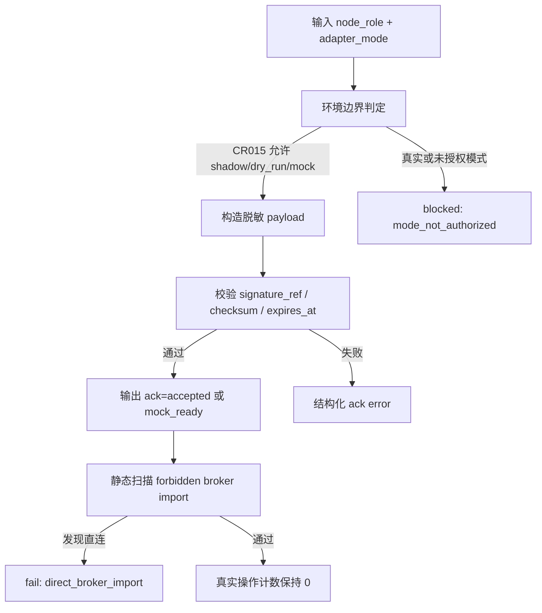

# LLD: CR015-S01 — QMT 环境与接口边界 spike

> 本文档是 `CR015-S01-qmt-environment-and-interface-spike` 的低层设计，纳入 `CR015-QMT-FOUNDATION-BATCH-A` 统一 CP5 确认。当前 `confirmed=false`、`implementation_allowed=false`；本批次只设计 shadow / dry-run / mock foundation，不授权真实 QMT API、发单、撤单、账户查询、账户写操作、凭据读取或真实 broker lake 写入。

## 1. Goal

创建 QMT foundation 的环境边界、节点角色、adapter mode、signed file drop transport 合同、ack/error enum 和 forbidden boundary，使 Linux 研究节点与 Windows QMT / MiniQMT 节点在 CR-015 阶段只通过脱敏 payload 与 mock/dry-run 合同衔接，策略层直接 broker import / call 次数保持 0。

## 2. Requirements（Functional / Non-Functional）

### 2.1 Functional

- 定义 `node_role=research|trading`、`adapter_mode=shadow|dry_run|mock|simulation|live_readonly|small_live`、`environment_status=unsupported|research_only|trading_node_required|mock_ready|blocked`。
- 定义 transport payload metadata：`run_id`、`strategy_id`、`payload_id`、`payload_checksum`、`signature_ref`、`created_at`、`expires_at`、`node_role`、`adapter_mode`，不得包含账户号、token、session、cookie、交易密码或 `.env` 值。
- 定义 ack/error enum：`accepted`、`rejected`、`timeout`、`unknown`、`invalid_signature`、`expired_payload`、`mode_not_authorized`、`credential_access_blocked`、`real_qmt_blocked`。
- 定义 forbidden import scan hook，覆盖策略层、研究入口、engine 和 experiments 目录的 QMT / XtQuant direct import / direct call 禁止规则。
- 明确 S01 不安装依赖、不运行 GUI、不启动真实 QMT、不读取凭据、不执行真实探测；真实 adapter API 细节仅作为后续 CR016 或单独授权 spike 的输入。

### 2.2 Non-Functional

- 安全：`qmt_api_call=0`、`credential_read=0`、`real_order_call=0`、`real_cancel_call=0`、`account_query_call=0`、`account_write_call=0`。
- 可移植：研究节点与交易节点职责以枚举和 payload contract 表达，不依赖本机是否安装 QMT。
- 可测试：所有检查通过 fixture、静态扫描和 monkeypatch 计数完成，不需要 Windows QMT 客户端。
- 兼容：后续 S02/S03/S06 只消费本 Story 的 enum 与 payload contract，不反向要求 S01 触达 broker。

## 3. 模块拆分与职责

| 模块 / 文件组 | 职责 | 说明 |
|---|---|---|
| `trading/qmt_environment.py` | 创建节点角色、adapter mode、环境状态、能力判定和 forbidden operation counter | primary；不读取 OS 凭据、不启动 QMT 进程 |
| `trading/qmt_transport.py` | 创建 signed file drop payload、ack/error enum、payload 校验结果和脱敏序列化合同 | primary；S02 共享使用 payload 与 ack enum |
| `tests/test_cr015_qmt_environment_boundary.py` | 创建离线边界测试，验证 no real API、no credential read、no direct broker import | primary；仅 fixture / static test |
| `docs/QMT-TRADING-RUNBOOK.md` | 后续 S07 汇总 foundation runbook 时引用 S01 环境边界 | shared；S01 不独占最终文档段落 |

## 4. 代码结构与文件影响范围

| 动作 | 文件路径 | 变更内容 |
|---|---|---|
| 创建 | `trading/qmt_environment.py` | 定义 `NodeRole`、`AdapterMode`、`EnvironmentStatus`、`EnvironmentProbeResult`、`ForbiddenOperationCounters` 和不触达真实 QMT 的 `evaluate_environment_boundary` |
| 创建 | `trading/qmt_transport.py` | 定义 `TransportPayload`、`TransportAck`、`TransportErrorCode`、`validate_payload_metadata`、`sanitize_payload_for_audit` |
| 创建 | `tests/test_cr015_qmt_environment_boundary.py` | 覆盖枚举完整性、payload 脱敏、direct import scan、真实操作计数为 0、credential read 为 0 |
| 修改 | `docs/QMT-TRADING-RUNBOOK.md` | 仅在 S07 实现时追加环境边界章节；本 Story LLD 不直接写该业务文档 |

禁止修改：`pyproject.toml`、`uv.lock`、`.env`、凭据文件、真实 QMT 进程、业务交易代码和 CR016 / CR017 文件。

## 5. 数据模型与持久化设计

| 对象 / 字段 | 类型 | 约束 | 说明 |
|---|---|---|---|
| `NodeRole` | enum | `research`、`trading` | Linux 研究节点不得直接调用 QMT；Windows 交易节点才可承载 adapter |
| `AdapterMode` | enum | `shadow`、`dry_run`、`mock`、`simulation`、`live_readonly`、`small_live` | CR-015 只允许前三类进入可执行 foundation |
| `EnvironmentProbeResult.status` | enum | `research_only`、`mock_ready`、`blocked` 等 | 不做真实 QMT 探测，只返回合同态 |
| `TransportPayload.signature_ref` | str | 只允许签名引用或摘要，不含私钥 / token | signed file drop 的审计字段 |
| `TransportPayload.payload_checksum` | str | 必填 | 用于幂等和审计 |
| `TransportAck.status` | enum | `accepted`、`rejected`、`timeout`、`unknown` | S02 adapter 继续消费 |
| `TransportAck.error_code` | enum / None | 失败时必填 | 结构化暴露失败 |
| `ForbiddenOperationCounters` | mapping | 真实操作计数必须为 0 | CP5 前和 CR-015 foundation 默认值 |

无新增持久化写入。payload 与 ack 是内存 / 文件投递合同；本 Story 不创建真实 drop 目录、不写真实 broker lake。

## 6. API / Interface 设计

| 接口 / 入口 | 输入 | 输出 | 调用方 | 说明 |
|---|---|---|---|---|
| `evaluate_environment_boundary(node_role, adapter_mode, qmt_available=False)` | 节点角色、adapter mode、可选能力布尔值 | `EnvironmentProbeResult` | S02、S07、测试 | 不启动 QMT；研究节点真实模式返回 blocked |
| `build_transport_payload(metadata)` | 脱敏 metadata | `TransportPayload` 或 validation error | S02、S06 | 输入字段白名单，禁止敏感值 |
| `validate_payload_metadata(payload, now)` | payload、当前时间 | `TransportAck` | S02 adapter boundary | 过期、签名缺失、mode 未授权返回结构化错误 |
| `sanitize_payload_for_audit(payload)` | payload | 脱敏 dict | broker lake dry-run / runbook | 不输出凭据或私有路径 |
| `scan_forbidden_broker_imports(paths)` | source path list | `ForbiddenImportScanResult` | 测试 / guardrail | 扫描策略层 direct import；不读取凭据 |

错误暴露：所有接口返回结构化 enum，不抛出包含账户、token、session、cookie、私有路径或 `.env` 内容的异常。

## 7. 核心处理流程

1. 调用方传入 `node_role` 和 `adapter_mode`。
2. `evaluate_environment_boundary` 判断当前模式是否属于 CR-015 允许范围。
3. 若 `node_role=research` 且 `adapter_mode` 属于 simulation / live_readonly / small_live，返回 `blocked` 和 `mode_not_authorized`。
4. 调用方构造脱敏 transport payload；校验字段白名单、签名引用、过期时间和 checksum。
5. `sanitize_payload_for_audit` 生成可记录的脱敏摘要。
6. `scan_forbidden_broker_imports` 对策略 / 研究入口进行静态扫描，发现 QMT / XtQuant 直连即 fail。
7. 所有路径保持真实 QMT、真实发单、账户查询和凭据读取计数为 0。



## 8. 技术设计细节

- 关键算法 / 规则：
  - CR-015 允许模式固定为 `shadow`、`dry_run`、`mock`；`simulation`、`live_readonly`、`small_live` 只能被枚举识别，不能在 CR-015 中放行。
  - payload 字段采用白名单序列化；未知字段默认 `rejected`，敏感字段命中 `credential_access_blocked`。
  - forbidden import scan 采用 exact token / module 名称规则，目标包括 `xtquant`、`xttrader`、`order_stock`、`cancel_order_stock` 等 broker direct access 标识。
- 依赖选择与复用点：
  - 只使用 Python 标准库 `dataclasses` / `enum` / `typing` / `pathlib`；不新增依赖。
  - S02 复用 `AdapterMode`、`TransportPayload`、`TransportAck` 和 `TransportErrorCode`。
- 兼容性处理：
  - 不假设本地存在 `trading/` 包；实现阶段创建新包时需补 `__init__.py` 或采用项目现有包约定。
  - 不改变现有 engine / experiments 逻辑，只提供后续测试扫描入口。
- 图示类型选择：流程图，因为存在节点角色、payload 校验和 forbidden scan 三类异常分支。

## 9. 安全与性能设计

| 维度 | 设计措施 | 验证方式 |
|---|---|---|
| 安全 | 不启动 QMT、MiniQMT、GUI 或外部进程；不读取 `.env`、token、session、cookie、账户号 | monkeypatch / fixture 断言真实操作计数为 0 |
| 安全 | payload 字段白名单和脱敏审计；敏感字段命中时 blocked | 单元测试构造敏感字段 payload |
| 安全 | 策略层 direct broker import / call 失败 | 静态扫描测试 |
| 性能 | 枚举和 payload 校验为 O(字段数)，扫描按文件行线性处理 | fixture 目录测试即可 |
| 一致性 | ack/error enum 被 S02 adapter 和 S06 shadow pipeline 共用 | contract test 校验枚举稳定 |

## 10. 测试设计

| 测试场景 | 前置条件 | 操作 | 预期结果 | 验证方式 |
|---|---|---|---|---|
| 枚举覆盖 HLD | 无 | 读取 `NodeRole`、`AdapterMode`、`TransportErrorCode` | 覆盖 Story AC 与 HLD §6 / §7.1 | `tests/test_cr015_qmt_environment_boundary.py::test_qmt_environment_enums_cover_hld_contract` |
| 研究节点禁止真实模式 | `node_role=research` | 调用 `evaluate_environment_boundary(..., live_readonly)` | `status=blocked`、`error_code=mode_not_authorized` | 单元测试 |
| payload 脱敏 | payload 含 token/account/session 字段 | 调用 `build_transport_payload` | 返回 `credential_access_blocked`；敏感原值输出次数为 0 | 单元测试 |
| ack/error enum 完整 | 构造过期、签名缺失、未知 mode | 调用 `validate_payload_metadata` | 输出结构化错误，不抛 traceback | 单元测试 |
| forbidden import scan | fixture 源码含 `xtquant` / `order_stock` | 调用 `scan_forbidden_broker_imports` | 发现 direct broker import，测试 fail | 静态 fixture |
| 真实操作计数 | 无实现授权 | 调用全部公开入口 | `qmt_api_call=0`、`real_order_call=0`、`account_query_call=0`、`credential_read=0` | monkeypatch counter |

## 11. 实施步骤

| TASK-ID | 动作 | 目标文件 | 详细描述 | 对应测试 |
|---|---|---|---|---|
| CR015-S01-T1 | 创建 | `trading/qmt_environment.py` | 定义节点角色、adapter mode、环境状态、边界判定和 forbidden operation counter | 枚举覆盖、研究节点禁止真实模式、真实操作计数 |
| CR015-S01-T2 | 创建 | `trading/qmt_transport.py` | 定义 signed file drop payload、ack/error enum、metadata 校验和审计脱敏 | payload 脱敏、ack/error enum 完整 |
| CR015-S01-T3 | 创建 | `tests/test_cr015_qmt_environment_boundary.py` | 编写离线静态 / fixture 测试；断言 direct broker import、credential_read 和 real QMT 调用为 0 | 全部 S01 测试场景 |

每个 TASK 均对应 Story 卡片文件影响范围；不修改 `pyproject.toml`、`uv.lock`、凭据文件、真实 QMT 环境或业务交易代码。

## 12. 风险、难点与预研建议

| 风险 / 难点 | 影响 | 缓解措施 / 预研建议 |
|---|---|---|
| 本地环境不存在 QMT / Windows 节点 | 无法真实探测接口 | CR-015 只定义合同和 mock；真实探测后置到 CR016 或单独授权 spike |
| payload 误携带敏感值 | 凭据泄露风险 | 白名单序列化 + redaction test；任何未知敏感字段 blocked |
| forbidden import scan 误报或漏报 | 影响策略层安全边界 | 使用 exact module / call token；后续实现偏离需在 CP6 记录 |
| HLD / ADR frontmatter 未回填 CR015 confirmed | 过程追溯不一致 | 本 LLD 以 CP3 人工审查 approved 和 CP4 PASS 为门控证据；frontmatter 回填由 meta-po 处理，不在本 handoff 写入范围 |

### OPEN / Spike 跟踪

| ID | 类型（OPEN / Spike） | 问题 | 下一动作 | 责任方 |
|---|---|---|---|---|
| 无 | N/A | 无阻塞 OPEN/Spike；真实 QMT API exact signature 和真实环境探测不属于 CR015 LLD 实现授权 | CP5 后仍需用户按阶段单独授权 | meta-po / user |

## 13. 回滚与发布策略

- 发布方式：CP5 前仅发布 LLD 与 CP5 自动预检；代码实现必须等待全量 CP5 人工确认、当前 Story `confirmed=true`、`implementation_allowed=true` 和 dev_gate 满足。
- 回滚触发条件：CP5 人工审查要求修改、enum 与 ADR-055 / ADR-061 冲突、payload 脱敏不能证明敏感字段不输出、或 direct broker import scan 无法验证。
- 回滚动作：撤回 S01 LLD 草案或回到 `lld-ready` 重新设计；实现阶段若已创建文件，则删除 `trading/qmt_environment.py` / `trading/qmt_transport.py` 的本 Story 新增内容和对应测试，不触碰其他 Story 文件。

## 14. Definition of Done

- [x] 14 个章节全部填写完成
- [x] 文件影响范围、接口、测试与实施步骤可直接指导编码
- [x] `confirmed=false` 且 `implementation_allowed=false`，不进入实现
- [x] `tier`、`shared_fragments`、`open_items` 已填写
- [x] OPEN / Spike 已清点并明确无阻塞项
- [x] shadow / dry-run / mock foundation 边界已写入
- [x] QMT API、真实发单、撤单、账户查询、账户写操作、凭据读取和真实 broker lake 写入计数均设计为 0
- [x] 第 6 节接口在第 10 节均有测试入口
- [x] 第 7 节异常路径在第 10 节均有错误路径验证

## 人工确认区

> **CP5 — Story LLD 可实现性门**
> meta-dev 先写入 `process/checks/CP5-CR015-S01-qmt-environment-and-interface-spike-LLD-IMPLEMENTABILITY.md` 自动预检结果。meta-po 收齐全部目标 Story 的 LLD、CP4 自动预检摘要和 CP5 自动预检后，再生成并提示用户审查 `checkpoints/CP5-ALL-STORIES-LLD-BATCH.md`。

**CP5 checklist 摘要**：

| # | 检查项 | 状态 | 证据 |
|---|---|---|---|
| 1 | LLD 覆盖 AC | 待检查 | 第 2 / 10 / 14 节 |
| 2 | 与 HLD / ADR 一致 | 待检查 | 第 3 / 8 / 12 节 |
| 3 | 文件影响范围明确 | 待检查 | 第 4 / 11 节 |
| 4 | 接口契约完整 | 待检查 | 第 6 节 |
| 5 | 测试与 dev_gate 可计算 | 待检查 | 第 10 / 14 节 |

**人工确认回复**：

```text
approve
修改: <具体修改点>
reject
```

**人工审查结果回填**：

- 结论：`approved | changes_requested | rejected`
- 审查人：
- 审查时间：
- 修改意见：
- 风险接受项：
