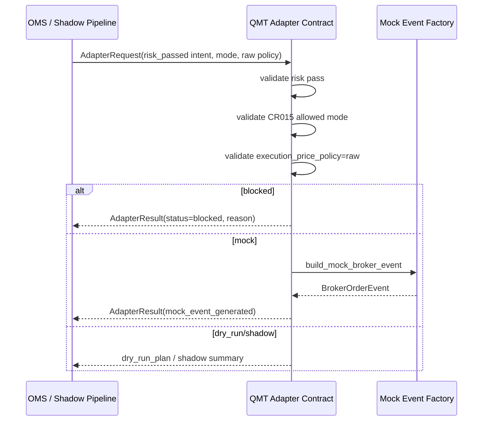

# LLD: CR015-S02 — QMT broker adapter 合同

> 本文档是 `CR015-S02-qmt-broker-adapter-contract` 的低层设计，纳入 `CR015-QMT-FOUNDATION-BATCH-A` 统一 CP5 确认。当前 `confirmed=false`、`implementation_allowed=false`；S02 只冻结 adapter 合同与 mock event，不实现真实 QMT adapter，不授权真实 order / cancel / account write。

## 1. Goal

创建唯一 broker 触达边界的 adapter 合同，定义 submit / cancel 输入输出、mode gate、mock broker event、blocked reason 和安全计数，使任何策略或 OMS 只能通过 risk-passed intent 与 adapter 交互，并且 CR-015 阶段所有真实 broker 操作计数保持 0。

## 2. Requirements（Functional / Non-Functional）

### 2.1 Functional

- 定义 adapter mode gate：`shadow`、`dry_run`、`mock` 为 CR-015 allowed；`simulation`、`live_readonly`、`small_live` 必须返回 `mode_not_authorized`。
- 定义 `submit_intent` 合同：输入 risk-passed order intent、transport payload、adapter mode 和 stage authorization summary；输出 broker order event、dry-run plan 或 blocked result。
- 定义 `cancel_order` 合同：输入 cancel request、current OMS state、stage gate status；CR-015 默认输出 blocked / dry-run cancel plan，不触达真实 cancel。
- 定义 mock event factory 覆盖 `accepted`、`partial`、`filled`、`rejected`、`timeout`、`unknown` 六类事件。
- 定义非 raw execution policy hard block：`execution_price_policy != raw` 时 adapter 通过次数为 0。
- 复用 S01 的 `TransportPayload`、`TransportAck` 和 `AdapterMode`，不重复定义跨节点 transport。

### 2.2 Non-Functional

- 安全：adapter 不读取凭据、不导入 XtQuant 真实模块、不连接真实 QMT、不写真实 broker lake。
- 可审计：所有 blocked result 必含 `blocked_reason`、`adapter_mode`、`intent_id`、`safety_counters`。
- 可测试：使用 mock fixtures 验证 mode gate、mock event、非 raw 执行价阻断和真实操作计数。
- 可扩展：后续 CR016 可在同一接口后补真实 adapter，但必须通过 stage gate 和 per-run authorization。

## 3. 模块拆分与职责

| 模块 / 文件组 | 职责 | 说明 |
|---|---|---|
| `trading/qmt_adapter.py` | 创建 adapter contract、mode gate、submit/cancel result、mock event factory 和 safety counters | primary；不导入真实 broker API |
| `trading/qmt_transport.py` | 共享 S01 transport payload / ack enum；按 S02 需要补 adapter-facing metadata 字段 | shared；merge_owner 为 S02 |
| `tests/test_cr015_qmt_adapter_contract.py` | 创建 mode gate、mock event、blocked reason、非 raw policy 和真实操作计数测试 | primary；全部离线 |

## 4. 代码结构与文件影响范围

| 动作 | 文件路径 | 变更内容 |
|---|---|---|
| 创建 | `trading/qmt_adapter.py` | 定义 `AdapterRequest`、`AdapterResult`、`BrokerOrderEvent`、`MockBrokerScenario`、`AdapterBlockedReason`、`submit_intent`、`cancel_order`、`build_mock_broker_event` |
| 修改 | `trading/qmt_transport.py` | 追加 adapter 消费的 payload metadata 白名单和 ack/error enum 引用，不改变 S01 语义 |
| 创建 | `tests/test_cr015_qmt_adapter_contract.py` | 覆盖 6 类 mode、6 类 mock event、非 raw execution policy blocked、真实操作计数为 0 |

禁止修改：`pyproject.toml`、`uv.lock`、凭据文件、真实 broker API、CR016 activation 文件和真实 broker lake。

## 5. 数据模型与持久化设计

| 对象 / 字段 | 类型 | 约束 | 说明 |
|---|---|---|---|
| `AdapterRequest.intent_id` | str | 必填 | 来自 OMS 的 order intent |
| `AdapterRequest.adapter_mode` | enum | CR-015 allowed 仅 `shadow/dry_run/mock` | 其他模式 blocked |
| `AdapterRequest.execution_price_policy` | enum | 必须为 `raw` | qfq/hfq execution hard block |
| `AdapterRequest.risk_status` | enum | 必须为 `pass` | risk 未通过不得触达 adapter |
| `AdapterResult.status` | enum | `blocked`、`dry_run_planned`、`mock_event_generated` | 不含真实 submitted |
| `AdapterResult.blocked_reason` | enum / None | blocked 时必填 | mode、risk、price policy、authorization 等原因 |
| `BrokerOrderEvent.event_type` | enum | `accepted`、`partial`、`filled`、`rejected`、`timeout`、`unknown` | 输入 S03 状态机 |
| `BrokerOrderEvent.broker_order_ref` | str | mock 值或脱敏 ref | 不是真实券商委托号 |
| `SafetyCounters` | mapping | 所有真实操作为 0 | CP5 与 CR-015 默认边界 |

无新增持久化写入。S02 只定义内存合同和 mock event；真实 broker lake 记录由 S05 dry-run writer 设计。

## 6. API / Interface 设计

| 接口 / 入口 | 输入 | 输出 | 调用方 | 说明 |
|---|---|---|---|---|
| `submit_intent(request)` | `AdapterRequest` | `AdapterResult` | S03/S06 OMS / shadow pipeline | 仅 risk pass + CR015 allowed mode 才生成 dry-run / mock event |
| `cancel_order(cancel_request)` | cancel intent、OMS state、mode | `AdapterResult` | S03 / CR016 后续 | CR-015 默认不真实 cancel，输出 dry-run plan 或 blocked |
| `build_mock_broker_event(scenario, intent)` | scenario id、intent metadata | `BrokerOrderEvent` | S03 状态机测试 | 覆盖 accepted/partial/filled/rejected/timeout/unknown |
| `validate_adapter_mode(adapter_mode, authorization)` | mode、授权摘要 | `AdapterBlockedReason | None` | adapter 内部 / tests | CR-015 下 simulation/live/small_live blocked |
| `assert_raw_execution_policy(intent)` | order intent | pass / blocked reason | adapter / risk 双重检查 | 防止复权价进入执行价 |

错误暴露：blocked result 返回 `blocked_reason`、`detail_code`、`intent_id`、`adapter_mode` 和脱敏 `evidence_ref`；不暴露账户、token、session、cookie 或真实 broker response。

## 7. 核心处理流程

1. OMS 或 shadow pipeline 传入 `AdapterRequest`。
2. adapter 校验 `risk_status=pass`；失败返回 `risk_not_passed`，`adapter_calls=0`。
3. 校验 `adapter_mode` 是否属于 CR-015 allowed mode；真实 / 后续阶段模式返回 `mode_not_authorized`。
4. 校验 `execution_price_policy=raw`；否则返回 `non_raw_execution_price_blocked`。
5. `shadow` 输出 intent accepted summary，不生成 broker event。
6. `dry_run` 输出 dry-run order plan，不执行 broker call。
7. `mock` 调用 `build_mock_broker_event` 生成 fixture event，交给 S03 状态机。



## 8. 技术设计细节

- 关键算法 / 规则：
  - `validate_adapter_mode` 使用 allowlist，不使用模糊匹配；CR-015 allowed set 固定为 `{"shadow", "dry_run", "mock"}`。
  - `submit_intent` 按 risk -> mode -> execution price -> transport payload 顺序 fail-fast，任一失败不生成 mock event。
  - mock event 的 `broker_order_ref` 使用 `mock-{intent_id}-{scenario}` 格式，明确不是券商真实委托号。
- 依赖选择与复用点：
  - 复用 S01 的 transport enum；只使用标准库 dataclasses / enum。
  - S03 消费 `BrokerOrderEvent.event_type` 和 `AdapterResult`。
- 兼容性处理：
  - 不引入 XtQuant import；真实 adapter 类名可后续扩展为 `XtQuantAdapter`，但 CR-015 不创建。
  - `cancel_order` 先提供合同与 dry-run plan，CR016 可在同一接口后接 stage gate。
- 图示类型选择：时序图，因为 adapter 位于 OMS 与 mock event factory 之间。

## 9. 安全与性能设计

| 维度 | 设计措施 | 验证方式 |
|---|---|---|
| 安全 | adapter 文件不导入 `xtquant` 或任何真实 broker API | 静态测试扫描 import |
| 安全 | 非 raw execution policy hard block | 单元测试 qfq/hfq intent 通过次数为 0 |
| 安全 | 未授权真实模式 blocked；真实 order/cancel/account write 计数为 0 | mode gate 测试和 safety counter 测试 |
| 性能 | 合同校验为常数级枚举 / 字段检查 | fixture 单元测试 |
| 一致性 | mock event enum 与 S03 状态机保持同一集合 | S02/S03 contract test |

## 10. 测试设计

| 测试场景 | 前置条件 | 操作 | 预期结果 | 验证方式 |
|---|---|---|---|---|
| allowed mode | mode 为 shadow/dry_run/mock | 调用 `submit_intent` | 不触达真实 API，返回 shadow summary / dry-run plan / mock event | `tests/test_cr015_qmt_adapter_contract.py::test_cr015_allowed_modes_do_not_touch_real_api` |
| unauthorized mode | mode 为 simulation/live_readonly/small_live | 调用 `submit_intent` | `status=blocked`、`blocked_reason=mode_not_authorized` | 单元测试 |
| risk 未通过 | `risk_status=blocked` | 调用 `submit_intent` | `adapter_calls=0`、不生成 broker event | 单元测试 |
| 非 raw execution | policy 为 qfq/hfq | 调用 `submit_intent` | blocked，通过次数为 0 | 单元测试 |
| mock event 覆盖 | 6 类 scenario | 调用 `build_mock_broker_event` | event_type 覆盖 accepted/partial/filled/rejected/timeout/unknown | 单元测试 |
| cancel contract | cancel request in CR015 | 调用 `cancel_order` | 输出 dry-run cancel plan 或 blocked；real_cancel_call=0 | 单元测试 |
| no credential read | 无授权 | 调用全部接口 | `credential_read=0` | monkeypatch counter |

## 11. 实施步骤

| TASK-ID | 动作 | 目标文件 | 详细描述 | 对应测试 |
|---|---|---|---|---|
| CR015-S02-T1 | 创建 | `trading/qmt_adapter.py` | 定义 adapter request/result、mode gate、submit/cancel contract、mock event factory 和 safety counters | allowed mode、unauthorized mode、risk 未通过、非 raw execution、mock event |
| CR015-S02-T2 | 创建 | `tests/test_cr015_qmt_adapter_contract.py` | 编写 adapter contract 离线测试，断言真实 API、真实 order/cancel/account write 和 credential read 为 0 | 全部 S02 测试场景 |
| CR015-S02-T3 | 修改 | `trading/qmt_transport.py` | 对齐 adapter payload metadata 与 S01 ack/error enum，保持字段白名单 | payload / mode gate 集成测试 |

## 12. 风险、难点与预研建议

| 风险 / 难点 | 影响 | 缓解措施 / 预研建议 |
|---|---|---|
| 真实 XtQuant API 签名未复核 | 后续 CR016 真实 adapter 可能需要调整接口 | S02 只定义 adapter 边界和 mock event；真实签名作为后续授权 spike |
| mock event 与真实 broker event 字段差异 | S03 状态机未来映射需调整 | 使用最小公共字段和 `raw_event_ref` 脱敏引用；偏离 LLD 时 CP6 记录 |
| 非 raw price 从上游绕过 risk 进入 adapter | 下单价格风险 | adapter 二次 hard block，不只依赖 S04 risk |
| shared `qmt_transport.py` 与 S01 并发修改 | 文件冲突 | Development Plan 指定 S02 为 shared merge_owner；实现阶段串行合并 |

### OPEN / Spike 跟踪

| ID | 类型（OPEN / Spike） | 问题 | 下一动作 | 责任方 |
|---|---|---|---|---|
| 无 | N/A | 无阻塞 OPEN/Spike；真实 adapter API exact signature 后置到 CR016 / 单独授权 | CP5 后仍需按阶段授权 | meta-po / user |

## 13. 回滚与发布策略

- 发布方式：CP5 前仅发布 LLD 和 CP5 自动预检；实现需等待全量 CP5 人工确认与 dev_gate。
- 回滚触发条件：CP5 人工审查要求修改、adapter 接口无法满足 S03/S06、非 raw execution hard block 无法测试、或发现真实 API import。
- 回滚动作：撤回 `trading/qmt_adapter.py` 本 Story 新增合同、回退 `trading/qmt_transport.py` 的 S02 共享字段和对应测试；不触碰 S01 primary 或 CR016 文件。

## 14. Definition of Done

- [x] 14 个章节全部填写完成
- [x] 文件影响范围、接口、测试与实施步骤可直接指导编码
- [x] `confirmed=false` 且 `implementation_allowed=false`，不进入实现
- [x] `tier`、`shared_fragments`、`open_items` 已填写
- [x] adapter mode gate 覆盖 6 类状态
- [x] mock event 覆盖 accepted、partial、filled、rejected、timeout、unknown
- [x] 非 raw execution policy 通过次数设计为 0
- [x] QMT API、真实发单、撤单、账户查询、账户写操作、凭据读取和真实 broker lake 写入计数均设计为 0
- [x] 第 6 节接口在第 10 节均有测试入口
- [x] 第 7 节异常路径在第 10 节均有错误路径验证

## 人工确认区

> **CP5 — Story LLD 可实现性门**
> meta-dev 先写入 `process/checks/CP5-CR015-S02-qmt-broker-adapter-contract-LLD-IMPLEMENTABILITY.md` 自动预检结果。meta-po 收齐全部目标 Story 的 LLD、CP4 自动预检摘要和 CP5 自动预检后，再生成并提示用户审查 `checkpoints/CP5-ALL-STORIES-LLD-BATCH.md`。

**CP5 checklist 摘要**：

| # | 检查项 | 状态 | 证据 |
|---|---|---|---|
| 1 | LLD 覆盖 AC | 待检查 | 第 2 / 10 / 14 节 |
| 2 | 与 HLD / ADR 一致 | 待检查 | 第 3 / 8 / 12 节 |
| 3 | 文件影响范围明确 | 待检查 | 第 4 / 11 节 |
| 4 | 接口契约完整 | 待检查 | 第 6 节 |
| 5 | 测试与 dev_gate 可计算 | 待检查 | 第 10 / 14 节 |

**人工确认回复**：

```text
approve
修改: <具体修改点>
reject
```

**人工审查结果回填**：

- 结论：`approved | changes_requested | rejected`
- 审查人：
- 审查时间：
- 修改意见：
- 风险接受项：
