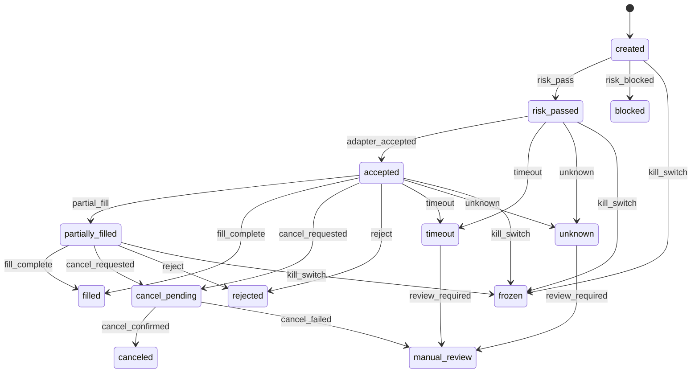

# LLD: CR015-S03 — OMS order intent 与订单状态机

> 本文档是 `CR015-S03-oms-order-state-machine` 的低层设计，纳入 `CR015-QMT-FOUNDATION-BATCH-A` 统一 CP5 确认。当前 `confirmed=false`、`implementation_allowed=false`；S03 只设计本地 order intent、幂等 key、状态迁移和 mock event 消费，不写真实 broker facts，不把 unknown / timeout 静默成功。

## 1. Goal

创建本地 OMS order intent 与订单状态机合同，使目标组合可被转换为可审计、可幂等、可冻结的 intent，并能消费 S02 mock broker event 推进状态；CR-015 阶段不触达真实 broker，不写真实 broker lake。

## 2. Requirements（Functional / Non-Functional）

### 2.1 Functional

- 定义 `OrderIntent`，字段至少包含 `order_intent_id`、`strategy_id`、`run_id`、`symbol`、`side`、`target_qty`、`target_trade_date`、`research_adjustment_policy`、`execution_price_policy=raw`、`idempotency_key`、`risk_profile_id`。
- 定义 OMS 状态集合：`created`、`risk_passed`、`blocked`、`accepted`、`partially_filled`、`filled`、`cancel_pending`、`canceled`、`rejected`、`failed`、`timeout`、`unknown`、`manual_review`、`frozen`。
- 定义状态迁移表，覆盖 HLD-QMT-TRADING §7.3；非法迁移返回 structured error，不修改状态。
- `unknown`、`timeout`、`cancel_failed` 必须进入 `manual_review` 或保持非成功状态；被标记为成功次数为 0。
- `create_order_intent` 必须要求 `research_adjustment_policy` 和 `execution_price_policy=raw`；缺失或非 raw 时 blocked。
- `freeze_orders` 只更新本地状态 / 输出 incident ref，不执行真实撤单。

### 2.2 Non-Functional

- 幂等：同一 `strategy_id/run_id/symbol/side/target_trade_date/target_qty` 生成稳定 `idempotency_key`。
- 可追溯：每次状态迁移输出 `StateTransitionEvent`，包含 from/to/event/reason/timestamp。
- 安全：不读取账户、不查询真实持仓、不调用 adapter 真实模式、不写真实 broker lake。
- 可测试：以 S02 mock event fixture 覆盖所有状态与错误迁移。

## 3. 模块拆分与职责

| 模块 / 文件组 | 职责 | 说明 |
|---|---|---|
| `trading/oms.py` | 创建 `OrderIntent`、状态枚举、状态迁移函数、幂等 key、freeze/manual_review 合同 | primary |
| `trading/qmt_adapter.py` | 共享 `BrokerOrderEvent` 和 adapter event enum | shared；S03 只消费 S02 合同 |
| `tests/test_cr015_oms_state_machine.py` | 创建状态覆盖、非法迁移、unknown/timeout/manual_review、policy 必填和真实操作计数测试 | primary |

## 4. 代码结构与文件影响范围

| 动作 | 文件路径 | 变更内容 |
|---|---|---|
| 创建 | `trading/oms.py` | 定义 order intent schema、OMS 状态 / 事件枚举、`create_order_intent`、`apply_broker_event`、`apply_risk_result`、`freeze_orders`、`build_idempotency_key` |
| 修改 | `trading/qmt_adapter.py` | 对齐 `BrokerOrderEvent.event_type` 与 OMS 事件映射；不增加真实 adapter 行为 |
| 创建 | `tests/test_cr015_oms_state_machine.py` | 覆盖 HLD 状态和事件 100%、非法迁移、policy 缺失、timeout/unknown、kill switch frozen |

禁止修改：`pyproject.toml`、`uv.lock`、凭据文件、真实 broker facts、真实 broker lake、CR016 对账 / kill switch 实现文件。

## 5. 数据模型与持久化设计

| 对象 / 字段 | 类型 | 约束 | 说明 |
|---|---|---|---|
| `OrderIntent.order_intent_id` | str | 必填，稳定生成或调用方传入 | 本地意图主键 |
| `OrderIntent.idempotency_key` | str | 必填，同一输入稳定 | duplicate guard 输入 |
| `OrderIntent.research_adjustment_policy` | enum | 必填 | 研究口径 metadata，不用于执行价 |
| `OrderIntent.execution_price_policy` | enum | 必须为 `raw` | qfq/hfq 执行价 blocked |
| `OrderIntent.state` | enum | 初始 `created` | 状态机主状态 |
| `OrderIntent.manual_review_required` | bool | unknown/timeout/cancel_failed 时 true | 人工复核门控 |
| `OrderIntent.retry_count` | int | 非负 | CR-015 不做真实重试 |
| `StateTransitionEvent` | object | from_state/to_state/event/reason 必填 | dry-run / broker lake 未来写入输入 |
| `OmsError` | object | `error_code`、`message`、`intent_id` | 不含敏感值 |

无新增持久化写入。OMS 对象和事件在 CR-015 中为内存合同；S05 只基于这些对象生成 dry-run write plan。

## 6. API / Interface 设计

| 接口 / 入口 | 输入 | 输出 | 调用方 | 说明 |
|---|---|---|---|---|
| `create_order_intent(target_row, policy_metadata, run_context)` | target portfolio 行、研究 policy、run context | `OrderIntent` 或 blocked error | S06 shadow pipeline | 缺 policy 或非 raw execution blocked |
| `build_idempotency_key(intent_fields)` | intent 关键字段 | str | OMS / risk duplicate guard | 稳定 key |
| `apply_risk_result(intent, risk_result)` | current intent、S04 risk result | updated intent、transition event | S04/S06 | risk fail -> `blocked`，不触达 adapter |
| `apply_broker_event(intent, broker_event)` | current intent、S02 mock event | next intent、transition event | S02/S06 | illegal transition fail |
| `freeze_orders(intents, trigger_reason)` | intent 列表、触发原因 | frozen intents、incident ref | CR016/S07 后续 | 不真实撤单，只输出本地冻结 |

错误暴露：所有接口返回结构化 `OmsError` / blocked result；非法迁移不抛未处理异常，不泄露路径或 broker payload。

## 7. 核心处理流程

1. S06 或调用方传入 target portfolio 行和 policy metadata。
2. `create_order_intent` 校验 `research_adjustment_policy` 与 `execution_price_policy=raw`，生成 `idempotency_key`。
3. S04 风控返回 risk result 后，`apply_risk_result` 将 `created` 推进到 `risk_passed` 或 `blocked`。
4. 只有 `risk_passed` 状态可交给 S02 adapter mock / dry-run。
5. `apply_broker_event` 按状态表推进 accepted / partially_filled / filled / canceled / rejected 等状态。
6. `timeout`、`unknown`、`cancel_failed` 不进入成功终态，必须保留 manual review 信息。
7. kill switch 或人工冻结调用 `freeze_orders`，所有非终态进入 `frozen`。



## 8. 技术设计细节

- 关键算法 / 规则：
  - 状态迁移使用显式 `(current_state, event) -> next_state` 表，不使用自由 if/else 推断未知状态。
  - 终态集合为 `filled`、`canceled`、`rejected`、`failed`、`blocked`；`unknown` 和 `timeout` 不是成功终态。
  - `idempotency_key` 使用稳定字段拼接后哈希，避免相同目标组合重复下单。
  - `execution_price_policy` 非 `raw` 在 intent 创建阶段 blocked，并在 S02 adapter 阶段二次 blocked。
- 依赖选择与复用点：
  - 复用 S02 `BrokerOrderEvent` 事件名；不导入 QMT。
  - S04 risk result 与 S05 broker lake schema 以本 Story 的 `OrderIntent` / `StateTransitionEvent` 为输入。
- 兼容性处理：
  - 状态机新增字段全部在 `trading/oms.py` 内聚；不改变现有 engine / portfolio 模块。
  - 后续 CR016 对账可读取状态对象，但 CR-015 不实现对账。
- 图示类型选择：状态图，因为本 Story 核心是状态迁移。

## 9. 安全与性能设计

| 维度 | 设计措施 | 验证方式 |
|---|---|---|
| 安全 | OMS 不导入 QMT、不读取账户、不写真实 broker lake | 静态扫描和 monkeypatch 计数 |
| 安全 | policy 缺失或非 raw execution blocked | 单元测试 |
| 安全 | unknown/timeout 不标记成功 | 状态机测试 |
| 性能 | 状态迁移为 dict 查表，单事件 O(1) | 单元测试覆盖 |
| 一致性 | 幂等 key 稳定，duplicate 由 S04 risk 使用 | key 稳定性测试 |

## 10. 测试设计

| 测试场景 | 前置条件 | 操作 | 预期结果 | 验证方式 |
|---|---|---|---|---|
| 创建 intent 成功 | policy 完整且 execution raw | 调用 `create_order_intent` | state=`created`，idempotency_key 非空 | `tests/test_cr015_oms_state_machine.py::test_create_order_intent_requires_policy_and_raw_execution` |
| 缺 policy blocked | 缺 `research_adjustment_policy` | 调用 `create_order_intent` | 返回 blocked，不生成可提交 intent | 单元测试 |
| 状态覆盖 | 构造 HLD §7.3 事件 | 调用 `apply_broker_event` | 状态覆盖率 100% | 单元测试 |
| illegal transition | `filled` 后再 `partial_fill` | 调用 `apply_broker_event` | 返回 illegal transition，不改状态 | 单元测试 |
| timeout / unknown | adapter 返回 timeout/unknown | 调用 `apply_broker_event` | 不进入 filled；manual_review_required=true | 单元测试 |
| kill switch | 非终态 intent | 调用 `freeze_orders` | state=`frozen`，real_cancel_call=0 | 单元测试 |
| 真实操作计数 | 无授权 | 调用全部接口 | real_order/cancel/account/credential 计数均为 0 | monkeypatch counter |

## 11. 实施步骤

| TASK-ID | 动作 | 目标文件 | 详细描述 | 对应测试 |
|---|---|---|---|---|
| CR015-S03-T1 | 创建 | `trading/oms.py` | 定义 order intent schema、状态 / 事件枚举、幂等 key 和状态迁移表 | intent 创建、状态覆盖、illegal transition |
| CR015-S03-T2 | 创建 | `tests/test_cr015_oms_state_machine.py` | 编写状态机 fixture 测试，覆盖 unknown / timeout / manual_review / frozen 和真实操作计数 | 全部 S03 测试场景 |
| CR015-S03-T3 | 修改 | `trading/qmt_adapter.py` | 对齐 broker event enum 和 OMS event 映射，不改变真实 adapter 禁止边界 | mock event 到状态机映射 |

## 12. 风险、难点与预研建议

| 风险 / 难点 | 影响 | 缓解措施 / 预研建议 |
|---|---|---|
| 状态数较多导致遗漏迁移 | 订单异常被错误处理 | 显式状态表 + 测试覆盖率 100% |
| unknown / timeout 被当作失败后重复创建订单 | 重复下单风险 | 状态保持 manual_review，不自动生成新 intent |
| 与 S04 duplicate guard 边界混淆 | 幂等规则漂移 | S03 只生成 key，S04 判定重复和风险 blocked |
| shared `qmt_adapter.py` 与 S02 实现冲突 | 文件冲突 | 实现阶段按 merge_owner 串行，S03 只消费 event enum |

### OPEN / Spike 跟踪

| ID | 类型（OPEN / Spike） | 问题 | 下一动作 | 责任方 |
|---|---|---|---|---|
| 无 | N/A | 无阻塞 OPEN/Spike；真实 broker event 到 OMS 的字段映射后置到授权模拟 / CR016 | 后续阶段按 CP gate 验证 | meta-po / user |

## 13. 回滚与发布策略

- 发布方式：CP5 前仅发布 LLD 与 CP5 自动预检；实现需等待全量 CP5 人工确认与 dev_gate。
- 回滚触发条件：状态机与 ADR-057 冲突、unknown/timeout 测试失败、非 raw policy 未阻断、或 S04/S06 无法消费 intent。
- 回滚动作：撤回 `trading/oms.py` 的本 Story 新增状态机和对应测试；若已修改 `trading/qmt_adapter.py`，仅回退 S03 event 映射增量，不回退 S02 合同。

## 14. Definition of Done

- [x] 14 个章节全部填写完成
- [x] 文件影响范围、接口、测试与实施步骤可直接指导编码
- [x] `confirmed=false` 且 `implementation_allowed=false`，不进入实现
- [x] HLD §7.3 状态和事件覆盖率设计为 100%
- [x] unknown / timeout 被标记成功次数设计为 0
- [x] order intent 100% 包含 research policy 和 `execution_price_policy=raw`
- [x] 真实 QMT / order / cancel / account / credential / broker lake 操作计数均设计为 0
- [x] 第 6 节接口在第 10 节均有测试入口
- [x] 第 7 节异常路径在第 10 节均有错误路径验证

## 人工确认区

> **CP5 — Story LLD 可实现性门**
> meta-dev 先写入 `process/checks/CP5-CR015-S03-oms-order-state-machine-LLD-IMPLEMENTABILITY.md` 自动预检结果。meta-po 收齐全部目标 Story 的 LLD、CP4 自动预检摘要和 CP5 自动预检后，再生成并提示用户审查 `checkpoints/CP5-ALL-STORIES-LLD-BATCH.md`。

**CP5 checklist 摘要**：

| # | 检查项 | 状态 | 证据 |
|---|---|---|---|
| 1 | LLD 覆盖 AC | 待检查 | 第 2 / 10 / 14 节 |
| 2 | 与 HLD / ADR 一致 | 待检查 | 第 3 / 8 / 12 节 |
| 3 | 文件影响范围明确 | 待检查 | 第 4 / 11 节 |
| 4 | 接口契约完整 | 待检查 | 第 6 节 |
| 5 | 测试与 dev_gate 可计算 | 待检查 | 第 10 / 14 节 |

**人工确认回复**：

```text
approve
修改: <具体修改点>
reject
```

**人工审查结果回填**：

- 结论：`approved | changes_requested | rejected`
- 审查人：
- 审查时间：
- 修改意见：
- 风险接受项：
