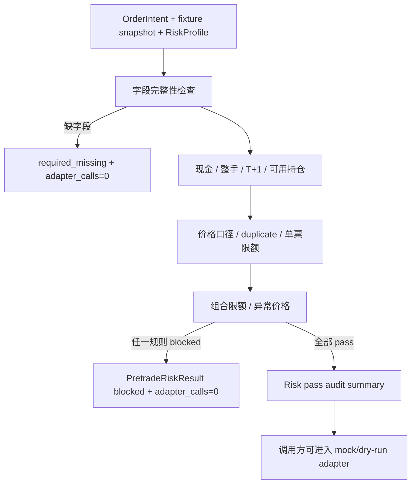

# LLD: CR015-S04 — pre-trade hard risk gate

> 本文档是 `CR015-S04-pretrade-risk-gate` 的低层设计，纳入 `CR015-QMT-FOUNDATION-BATCH-A` 统一 CP5 确认。当前 `confirmed=false`、`implementation_allowed=false`；S04 只设计 fixture / 脱敏 snapshot 上的 hard risk gate，不查询真实账户，任一风控失败时 adapter_calls 必须为 0。

## 1. Goal

创建 OMS adapter 前置的 pre-trade hard risk gate 合同，覆盖现金、100 股整手、T+1 可卖、可用持仓、价格口径、重复 intent、单票限额、组合限额和异常价格九类规则，并以结构化 blocked result 阻断任何失败 intent。

## 2. Requirements（Functional / Non-Functional）

### 2.1 Functional

- 定义 `RiskProfile`、`RiskInputSnapshot`、`RiskRuleResult`、`PretradeRiskResult` 和 `RiskBlockedReason`。
- ADR-058 九类规则必须全部可配置、可审计、可测试：现金、整手、T+1、可用持仓、价格口径、重复 intent、单票限额、组合限额、异常价格。
- `evaluate_intent` 输入仅允许 fixture 或脱敏 snapshot contract；不得读取真实账户、真实持仓或 QMT 客户端。
- 任一规则失败时输出 `passed=false`、`adapter_calls=0`、`blocked_rules` 和 `risk_profile_id`。
- 非 raw execution policy 或 qfq/hfq execution price 必须 hard block。
- duplicate guard 使用 S03 `idempotency_key` 和 `run_id`，重复通过次数为 0。

### 2.2 Non-Functional

- 安全：风控失败不触达 adapter，不读取凭据，不查询账户。
- 可审计：每条 blocked result 包含 rule_id、reason、intent_id、risk_profile_id、evidence_ref。
- 可测试：九类规则均有正向和失败 fixture。
- 可维护：规则枚举和默认阈值在 `trading/pretrade_risk.py` 内聚，后续真实配置路径由 CR016 / per-run 授权补齐。

## 3. 模块拆分与职责

| 模块 / 文件组 | 职责 | 说明 |
|---|---|---|
| `trading/pretrade_risk.py` | 创建风险规则枚举、输入 snapshot、risk profile、evaluate_intent、duplicate guard 和 price policy guard | primary |
| `trading/oms.py` | 共享 `OrderIntent`、`idempotency_key` 和 risk result 接入点 | shared；S04 不反向改状态机核心语义 |
| `tests/test_cr015_pretrade_risk_gate.py` | 创建九类规则、adapter_calls=0、非 raw policy、真实账户查询计数测试 | primary |

## 4. 代码结构与文件影响范围

| 动作 | 文件路径 | 变更内容 |
|---|---|---|
| 创建 | `trading/pretrade_risk.py` | 定义 `RiskRuleId`、`RiskProfile`、`RiskInputSnapshot`、`PretradeRiskResult`、`evaluate_intent`、`evaluate_many`、`detect_duplicate_intent` |
| 修改 | `trading/oms.py` | 增加 risk result 接入类型引用和状态流接入点；不改变 S03 状态迁移表 |
| 创建 | `tests/test_cr015_pretrade_risk_gate.py` | 覆盖九类 ADR-058 规则、blocked result 字段、adapter_calls=0 和真实账户查询计数为 0 |

禁止修改：`pyproject.toml`、`uv.lock`、凭据文件、真实账户查询、真实 broker adapter、CR016 stage gate 文件。

## 5. 数据模型与持久化设计

| 对象 / 字段 | 类型 | 约束 | 说明 |
|---|---|---|---|
| `RiskProfile.risk_profile_id` | str | 必填 | run profile / trading config 的脱敏标识 |
| `RiskProfile.max_single_symbol_notional` | decimal / int | 非负 | 单票限额 |
| `RiskProfile.max_portfolio_notional` | decimal / int | 非负 | 组合限额 |
| `RiskProfile.price_deviation_limit_pct` | decimal | 0 到 1 | 异常价格阈值 |
| `RiskInputSnapshot.cash_available` | decimal | fixture / 脱敏 snapshot | 不来自真实账户查询 |
| `RiskInputSnapshot.positions_available` | mapping | symbol -> qty | T+1 / 可用持仓检查 |
| `RiskInputSnapshot.raw_price_ref` | object | 必须 raw / broker ref | 非 raw blocked |
| `RiskRuleResult.rule_id` | enum | 九类规则之一 | 每条规则输出 pass / blocked |
| `PretradeRiskResult.adapter_calls` | int | 任一失败时等于 0 | 验收关键字段 |

无新增持久化写入。risk result 可作为 S05 dry-run broker lake schema 输入，但本 Story 不写真实 broker lake。

## 6. API / Interface 设计

| 接口 / 入口 | 输入 | 输出 | 调用方 | 说明 |
|---|---|---|---|---|
| `evaluate_intent(intent, snapshot, risk_profile)` | S03 intent、脱敏 cash/position/raw price snapshot、risk profile | `PretradeRiskResult` | S06 shadow pipeline / S03 | 九类规则全部执行 |
| `evaluate_many(intents, snapshot, risk_profile)` | intent 列表 | 每条 result + portfolio level result | S06 | 组合限额和 duplicate guard |
| `detect_duplicate_intent(intent, existing_keys)` | intent、已见 key 集 | `RiskRuleResult` | risk 内部 / tests | 重复 blocked |
| `validate_execution_price_policy(intent, raw_price_ref)` | intent、raw price ref | `RiskRuleResult` | adapter 前二次检查 | qfq/hfq blocked |
| `build_blocked_result(intent, rule_results)` | intent、规则结果 | `PretradeRiskResult` | risk 内部 | 标准化 blocked reason |

错误暴露：缺 snapshot 字段返回 `required_missing`；不读取真实账户，不输出账户号、token、私有路径或真实持仓明细。

## 7. 核心处理流程

1. 调用方传入 S03 `OrderIntent`、fixture / 脱敏 snapshot 和 `RiskProfile`。
2. risk gate 检查 snapshot 必需字段，缺失返回 `required_missing` 且 adapter_calls=0。
3. 顺序执行现金、整手、T+1、可用持仓、价格口径、重复 intent、单票限额、组合限额、异常价格规则。
4. 汇总所有 `RiskRuleResult`；任一 blocked 时输出 `PretradeRiskResult(passed=false, adapter_calls=0)`。
5. 所有规则通过时输出 `passed=true` 和脱敏 audit summary；仍不调用 adapter。
6. S03 / S06 根据 risk result 决定是否进入 S02 mock/dry-run adapter。



## 8. 技术设计细节

- 关键算法 / 规则：
  - 买入：`cash_available >= target_qty * raw_price * (1 + fee_buffer)`；不足 blocked。
  - 卖出：`positions_available[symbol] >= sell_qty` 且符合 T+1 可卖 snapshot；不足 blocked。
  - 整手：A 股默认 `target_qty % 100 == 0`，例外必须由后续授权配置显式声明；CR-015 默认无例外。
  - 重复：同一 `run_id/idempotency_key` 已存在则 blocked。
  - 价格：`execution_price_policy` 必须 raw，`raw_price_ref.status=available`；qfq/hfq 或异常价格 blocked。
  - 限额：单票和组合 notional 均使用 raw price ref 计算。
- 依赖选择与复用点：
  - 复用 S03 `OrderIntent` 与 `idempotency_key`；复用 CR017 raw price / reader policy gate 输出的 metadata。
  - 不依赖真实 QMT、provider 或 broker snapshot。
- 兼容性处理：
  - 风控 profile path 只以 `risk_profile_id` 表达；真实配置文件路径后置。
  - 规则结果可被 S05 broker lake dry-run schema 消费。
- 图示类型选择：流程图，因为九类规则有 fail-fast / 汇总分支。

## 9. 安全与性能设计

| 维度 | 设计措施 | 验证方式 |
|---|---|---|
| 安全 | fixture / 脱敏 snapshot 输入；不查询真实账户 | monkeypatch 账户查询计数为 0 |
| 安全 | 任一规则失败 `adapter_calls=0` | 单元测试逐规则失败 |
| 安全 | qfq/hfq execution hard block | 非 raw policy 测试 |
| 性能 | 单 intent 规则常数级；组合限额按 intent 列表线性汇总 | fixture 列表测试 |
| 一致性 | blocked result 字段统一，便于 OMS 和 broker lake dry-run 消费 | schema assertion |

## 10. 测试设计

| 测试场景 | 前置条件 | 操作 | 预期结果 | 验证方式 |
|---|---|---|---|---|
| 全部规则 pass | cash/position/raw price 足够 | `evaluate_intent` | `passed=true`，adapter_calls 仍由调用方保持 0 | `tests/test_cr015_pretrade_risk_gate.py::test_risk_pass_uses_fixture_snapshot_only` |
| 现金不足 | cash 低于 notional | `evaluate_intent` | blocked: `cash_insufficient`，adapter_calls=0 | 单元测试 |
| 非 100 股 | target_qty=99 | `evaluate_intent` | blocked: `lot_size_invalid` | 单元测试 |
| T+1 不可卖 | sell_qty 超过 available | `evaluate_intent` | blocked: `t1_not_sellable` | 单元测试 |
| 重复 intent | existing_keys 包含 key | `detect_duplicate_intent` | blocked: `duplicate_intent` | 单元测试 |
| 非 raw execution | policy=qfq/hfq | `validate_execution_price_policy` | blocked，通过次数为 0 | 单元测试 |
| 单票 / 组合限额 | notional 超阈值 | `evaluate_many` | 对应 rule blocked | 单元测试 |
| 异常价格 | raw_price <= 0 或偏离阈值 | `evaluate_intent` | blocked: `abnormal_price` | 单元测试 |
| 真实账户查询计数 | 无授权 | 调用全部接口 | account_query_call=0，credential_read=0 | monkeypatch counter |

## 11. 实施步骤

| TASK-ID | 动作 | 目标文件 | 详细描述 | 对应测试 |
|---|---|---|---|---|
| CR015-S04-T1 | 创建 | `trading/pretrade_risk.py` | 定义九类 risk rule、profile、snapshot、evaluate_intent/evaluate_many 和 blocked result | 全部风险规则测试 |
| CR015-S04-T2 | 创建 | `tests/test_cr015_pretrade_risk_gate.py` | 编写现金、整手、T+1、重复、限额、非 raw、异常价格、真实账户查询计数测试 | 全部 S04 测试场景 |
| CR015-S04-T3 | 修改 | `trading/oms.py` | 接入 risk result 类型和状态流接口，不改变 S03 状态迁移核心 | risk result -> OMS blocked |

## 12. 风险、难点与预研建议

| 风险 / 难点 | 影响 | 缓解措施 / 预研建议 |
|---|---|---|
| 真实账户 snapshot 未授权 | 不能证明实盘现金 / 持仓 | CR-015 只用 fixture / 脱敏 snapshot contract；真实查询由 CR016 per-run 授权 |
| 风控阈值过严或过松 | 后续成交率或风险受影响 | S04 固化字段和默认 fail-safe；真实阈值由后续 run profile 审批 |
| portfolio level 与 single intent 顺序混淆 | 组合限额漏判 | `evaluate_many` 统一计算组合 notional |
| 与 CR017 raw price contract 未冻结时实现风险 | 复权价误入执行 | S04 LLD 只消费 CR017 合同；实现 dev_gate 等待 CP5 / 依赖满足 |

### OPEN / Spike 跟踪

| ID | 类型（OPEN / Spike） | 问题 | 下一动作 | 责任方 |
|---|---|---|---|---|
| 无 | N/A | 无阻塞 OPEN/Spike；真实账户 snapshot 获取、真实价格源和阈值审批后置 | CR016 / per-run authorization | meta-po / user |

## 13. 回滚与发布策略

- 发布方式：CP5 前仅发布 LLD 与 CP5 自动预检；实现需等待全量 CP5 人工确认与 dev_gate。
- 回滚触发条件：九类 ADR-058 规则缺失、adapter_calls=0 无法证明、非 raw policy 未阻断、或实现需要真实账户查询。
- 回滚动作：撤回 `trading/pretrade_risk.py` 和对应测试；若已修改 `trading/oms.py`，仅回退 S04 risk 接入点，不回退 S03 状态机。

## 14. Definition of Done

- [x] 14 个章节全部填写完成
- [x] 文件影响范围、接口、测试与实施步骤可直接指导编码
- [x] `confirmed=false` 且 `implementation_allowed=false`，不进入实现
- [x] ADR-058 九类规则覆盖率设计为 100%
- [x] 任一风控失败时 adapter_calls 等于 0
- [x] blocked result 必含 rule_id、reason、intent id 和 risk profile
- [x] 真实 QMT / order / cancel / account / credential / broker lake 操作计数均设计为 0
- [x] 第 6 节接口在第 10 节均有测试入口
- [x] 第 7 节异常路径在第 10 节均有错误路径验证

## 人工确认区

> **CP5 — Story LLD 可实现性门**
> meta-dev 先写入 `process/checks/CP5-CR015-S04-pretrade-risk-gate-LLD-IMPLEMENTABILITY.md` 自动预检结果。meta-po 收齐全部目标 Story 的 LLD、CP4 自动预检摘要和 CP5 自动预检后，再生成并提示用户审查 `checkpoints/CP5-ALL-STORIES-LLD-BATCH.md`。

**CP5 checklist 摘要**：

| # | 检查项 | 状态 | 证据 |
|---|---|---|---|
| 1 | LLD 覆盖 AC | 待检查 | 第 2 / 10 / 14 节 |
| 2 | 与 HLD / ADR 一致 | 待检查 | 第 3 / 8 / 12 节 |
| 3 | 文件影响范围明确 | 待检查 | 第 4 / 11 节 |
| 4 | 接口契约完整 | 待检查 | 第 6 节 |
| 5 | 测试与 dev_gate 可计算 | 待检查 | 第 10 / 14 节 |

**人工确认回复**：

```text
approve
修改: <具体修改点>
reject
```

**人工审查结果回填**：

- 结论：`approved | changes_requested | rejected`
- 审查人：
- 审查时间：
- 修改意见：
- 风险接受项：
