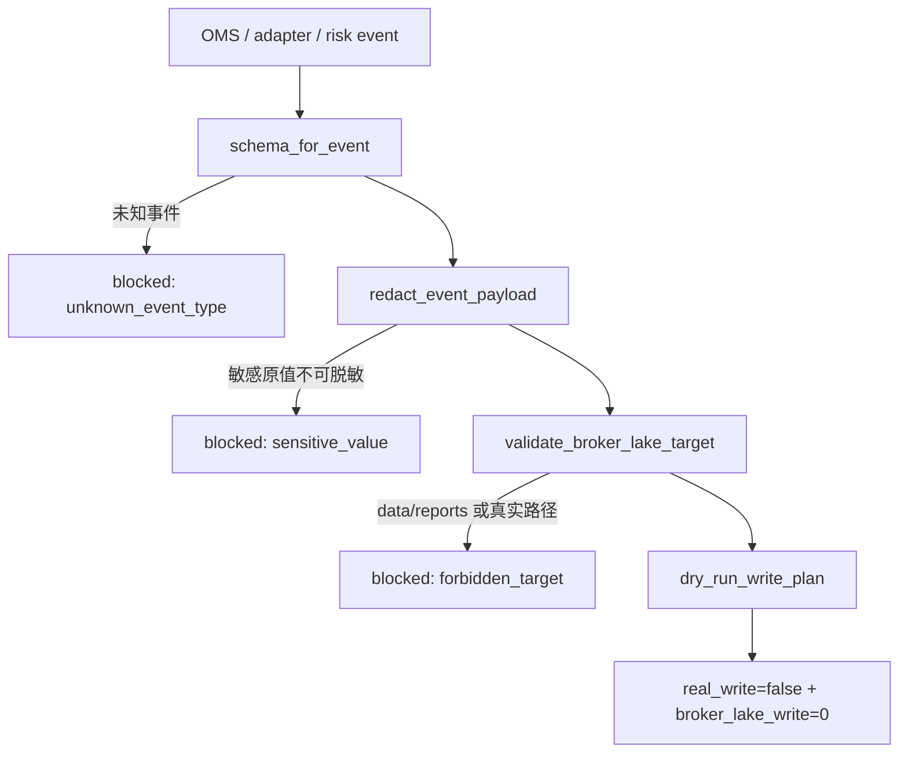

# LLD: CR015-S05 — broker lake schema 与 dry-run writer

> 本文档是 `CR015-S05-broker-lake-schema-and-writer` 的低层设计，纳入 `CR015-QMT-FOUNDATION-BATCH-A` 统一 CP5 确认。当前 `confirmed=false`、`implementation_allowed=false`；S05 只定义外置 broker lake schema、redaction gate 和 dry-run writer，不写真实 broker lake，不写仓库 `data/**` / `reports/**`。

## 1. Goal

创建 broker lake 的八类 schema、retention / redaction 合同和 dry-run write plan，使 OMS / adapter / risk / incident 事件后续可以被脱敏审计，同时保持 CR-015 阶段真实写入次数为 0。

## 2. Requirements（Functional / Non-Functional）

### 2.1 Functional

- 定义 broker lake schema registry，覆盖 `order_intent`、`broker_order`、`fill`、`position`、`asset`、`error`、`reconciliation`、`incident` 八类对象。
- 定义每类 schema 的 `schema_version`、必需字段、partition key、retention_policy 和 redaction_status。
- 定义 `dry_run_write_plan(event, root_label, retention_policy)`，只输出写入计划，不打开真实路径、不写文件。
- 定义 redaction gate：token、账户号、session、cookie、交易密码、`.env` 值、真实私有路径命中时 blocked 或脱敏；敏感原值输出次数为 0。
- 禁止写入仓库 `data/**` / `reports/**`，禁止真实 `BROKER_LAKE_ROOT` 写入。

### 2.2 Non-Functional

- 安全：只保留 env var 名称、脱敏账户标签、root label、run_id、strategy_id 和 schema_version。
- 可追溯：dry-run plan 输出 `event_type`、`schema_version`、`partition`、`redaction_status`、`retention_policy`。
- 可测试：schema 覆盖、禁写路径、redaction 和 real_broker_lake_write=0 均可离线验证。
- 可维护：schema registry 与 writer 分层，后续 CR016 真实写入可复用 schema 但必须新增授权 gate。

## 3. 模块拆分与职责

| 模块 / 文件组 | 职责 | 说明 |
|---|---|---|
| `trading/broker_lake.py` | 创建 broker lake schema registry、dry-run writer、redaction gate、forbidden path check | primary |
| `trading/oms.py` | 共享 `OrderIntent` 和 `StateTransitionEvent` 输入合同 | shared；S05 只消费 OMS event |
| `tests/test_cr015_broker_lake_schema_writer.py` | 创建 schema 覆盖、dry-run plan、forbidden local write、redaction 测试 | primary |

## 4. 代码结构与文件影响范围

| 动作 | 文件路径 | 变更内容 |
|---|---|---|
| 创建 | `trading/broker_lake.py` | 定义 `BrokerLakeEventType`、`BrokerLakeSchema`、`BrokerLakeWritePlan`、`RedactionResult`、`schema_for_event`、`dry_run_write_plan`、`redact_event_payload`、`validate_broker_lake_target` |
| 修改 | `trading/oms.py` | 输出可被 schema registry 消费的 intent / transition event dict，不写真实 broker facts |
| 创建 | `tests/test_cr015_broker_lake_schema_writer.py` | 覆盖八类 schema、dry-run plan、禁止 `data/**` / `reports/**`、敏感字段脱敏和真实写入计数为 0 |

禁止修改：`data/**`、`reports/**`、`pyproject.toml`、`uv.lock`、凭据文件、真实 broker lake root、真实交易事实。

## 5. 数据模型与持久化设计

| 对象 / 字段 | 类型 | 约束 | 说明 |
|---|---|---|---|
| `BrokerLakeSchema.event_type` | enum | 八类对象之一 | schema registry key |
| `BrokerLakeSchema.schema_version` | str | 必填，默认 `broker_lake_v1` | 后续迁移字段 |
| `BrokerLakeSchema.required_fields` | tuple[str] | 非空 | 每类对象必需字段 |
| `BrokerLakeSchema.partition_keys` | tuple[str] | 至少含 `trade_date` 或 `run_id` | dry-run plan 使用 |
| `BrokerLakeWritePlan.root_label` | str | 必填，不是真实路径 | 如 `BROKER_LAKE_ROOT` |
| `BrokerLakeWritePlan.target_path_preview` | str | 脱敏预览 | 不包含真实私有路径 |
| `BrokerLakeWritePlan.real_write` | bool | CR-015 固定 false | 验收字段 |
| `RedactionResult.redaction_status` | enum | `pass`、`redacted`、`blocked` | 敏感字段处理结果 |
| `RetentionPolicy` | str | 默认 `3y` 或用户配置标签 | 只记录标签，不执行清理 |

无真实持久化写入。所有写入设计均为 dry-run plan；真实写入需 CR016 / 后续 per-run 授权。

## 6. API / Interface 设计

| 接口 / 入口 | 输入 | 输出 | 调用方 | 说明 |
|---|---|---|---|---|
| `schema_for_event(event_type)` | event type | `BrokerLakeSchema` | S06 / tests | 未知 event fail |
| `redact_event_payload(event_payload)` | event payload dict | `RedactionResult` | dry-run writer | 敏感值 blocked / redacted |
| `validate_broker_lake_target(root_label, target_path)` | root label、可选路径预览 | pass / blocked | dry-run writer | 仓库 `data/**` / `reports/**` blocked |
| `dry_run_write_plan(event_payload, root_label, retention_policy)` | 脱敏 event、root label、retention | `BrokerLakeWritePlan` | S06 shadow pipeline | 不打开文件、不写真实 root |
| `build_schema_audit_summary()` | 无 | schema coverage summary | S07 docs/tests | 证明八类 schema 覆盖 |

错误暴露：返回 `BrokerLakeError`，含 `error_code`、`event_type`、`field`、`blocked_reason`；不包含敏感原值或真实路径。

## 7. 核心处理流程

1. 调用方传入 OMS / adapter / risk event payload。
2. `schema_for_event` 获取八类之一的 schema；未知 event 返回 `unknown_event_type`。
3. `redact_event_payload` 执行敏感字段扫描和脱敏。
4. `validate_broker_lake_target` 确认目标不是仓库 `data/**` / `reports/**`，且只使用 root label。
5. `dry_run_write_plan` 生成 partition、schema_version、retention 和 target preview。
6. 返回 `real_write=false`、`real_broker_lake_write=0` 的计划。



## 8. 技术设计细节

- 关键算法 / 规则：
  - schema registry 使用静态 dict，八类 event type 必须全部存在。
  - redaction 采用字段名黑名单 + 值模式保守检查：`token`、`password`、`account`、`session`、`cookie`、`.env`、绝对私有路径等命中时 blocked 或替换为 `<redacted>`。
  - `validate_broker_lake_target` 只接受 root label，不接受真实 path；任何以 `data/`、`reports/` 或仓库相对路径开头的目标 blocked。
  - dry-run plan 只构造字符串预览，不调用 open/write/mkdir。
- 依赖选择与复用点：
  - 复用 S03 OMS event；后续 CR016 reconciliation / incident 可复用 schema。
  - 只使用标准库。
- 兼容性处理：
  - 不改变 market data lake；broker lake 与研究数据湖隔离。
  - 不写 README/USER-MANUAL；文档由 S07 消费 schema audit summary。
- 图示类型选择：流程图，因为包含 schema、redaction、target validation 三类异常分支。

## 9. 安全与性能设计

| 维度 | 设计措施 | 验证方式 |
|---|---|---|
| 安全 | 不写 `data/**`、`reports/**`、真实 broker lake root | forbidden path test |
| 安全 | redaction gate 拦截 token/account/session/cookie/password/.env | 敏感字段测试 |
| 安全 | dry-run plan `real_write=false` | monkeypatch open/write 计数为 0 |
| 性能 | schema lookup O(1)，redaction 按字段线性扫描 | fixture 测试 |
| 一致性 | schema_version 和 retention_policy 必填 | schema assertion |

## 10. 测试设计

| 测试场景 | 前置条件 | 操作 | 预期结果 | 验证方式 |
|---|---|---|---|---|
| 八类 schema 覆盖 | 无 | `build_schema_audit_summary` | order_intent/broker_order/fill/position/asset/error/reconciliation/incident 均存在 | `tests/test_cr015_broker_lake_schema_writer.py::test_broker_lake_schema_covers_eight_event_types` |
| dry-run plan | mock event | `dry_run_write_plan` | `real_write=false`，schema_version / partition / retention 完整 | 单元测试 |
| 禁止 data/reports | root / target 指向仓库路径 | `validate_broker_lake_target` | blocked | 单元测试 |
| redaction | payload 含 token/account/session | `redact_event_payload` | 敏感原值输出次数为 0 | 单元测试 |
| 未知 event | event_type 不在 registry | `schema_for_event` | `unknown_event_type` | 单元测试 |
| 真实写入计数 | 无授权 | 调用 dry-run writer | real_broker_lake_write=0，open/write 计数为 0 | monkeypatch counter |

## 11. 实施步骤

| TASK-ID | 动作 | 目标文件 | 详细描述 | 对应测试 |
|---|---|---|---|---|
| CR015-S05-T1 | 创建 | `trading/broker_lake.py` | 定义八类 schema registry、dry-run writer、redaction gate、forbidden path check | schema 覆盖、dry-run plan、forbidden path、redaction |
| CR015-S05-T2 | 创建 | `tests/test_cr015_broker_lake_schema_writer.py` | 编写 broker lake contract 测试，断言真实写入和敏感原值输出为 0 | 全部 S05 测试场景 |
| CR015-S05-T3 | 修改 | `trading/oms.py` | 输出 broker lake dry-run 可消费的 intent / transition event dict | schema event 输入测试 |

## 12. 风险、难点与预研建议

| 风险 / 难点 | 影响 | 缓解措施 / 预研建议 |
|---|---|---|
| broker lake root 未授权 | 无法真实写入 | CR-015 只输出 root label 和 dry-run plan |
| schema 过早绑定真实 broker 字段 | 后续真实 QMT 字段变化需迁移 | v1 使用最小公共字段，保留 `raw_event_ref` 脱敏引用 |
| 敏感字段规则漏判 | 凭据 / 账户信息泄露 | 字段名和常见值模式双重扫描，默认 unknown sensitive blocked |
| 与研究数据湖混写 | 权限与 retention 错乱 | 明确禁止 `data/**` / `reports/**`，broker lake 外置 |

### OPEN / Spike 跟踪

| ID | 类型（OPEN / Spike） | 问题 | 下一动作 | 责任方 |
|---|---|---|---|---|
| 无 | N/A | 无阻塞 OPEN/Spike；真实 broker lake root、真实写入权限和 retention 执行后置 | CR016 / per-run authorization | meta-po / user |

## 13. 回滚与发布策略

- 发布方式：CP5 前仅发布 LLD 与 CP5 自动预检；实现需等待全量 CP5 人工确认与 dev_gate。
- 回滚触发条件：八类 schema 缺失、redaction 不充分、dry-run writer 发生真实写入、或目标路径可落到仓库 `data/**` / `reports/**`。
- 回滚动作：撤回 `trading/broker_lake.py` 和对应测试；若已修改 `trading/oms.py`，仅回退 S05 event dict 输出增量，不回退 S03 状态机。

## 14. Definition of Done

- [x] 14 个章节全部填写完成
- [x] 文件影响范围、接口、测试与实施步骤可直接指导编码
- [x] `confirmed=false` 且 `implementation_allowed=false`，不进入实现
- [x] broker lake schema 覆盖 8 类对象
- [x] 未授权真实写入时 `real_broker_lake_write=0`
- [x] 仓库 `data/**` / `reports/**` 写入尝试 blocked
- [x] redaction_status 必填，敏感字段原值输出次数设计为 0
- [x] 第 6 节接口在第 10 节均有测试入口
- [x] 第 7 节异常路径在第 10 节均有错误路径验证

## 人工确认区

> **CP5 — Story LLD 可实现性门**
> meta-dev 先写入 `process/checks/CP5-CR015-S05-broker-lake-schema-and-writer-LLD-IMPLEMENTABILITY.md` 自动预检结果。meta-po 收齐全部目标 Story 的 LLD、CP4 自动预检摘要和 CP5 自动预检后，再生成并提示用户审查 `checkpoints/CP5-ALL-STORIES-LLD-BATCH.md`。

**CP5 checklist 摘要**：

| # | 检查项 | 状态 | 证据 |
|---|---|---|---|
| 1 | LLD 覆盖 AC | 待检查 | 第 2 / 10 / 14 节 |
| 2 | 与 HLD / ADR 一致 | 待检查 | 第 3 / 8 / 12 节 |
| 3 | 文件影响范围明确 | 待检查 | 第 4 / 11 节 |
| 4 | 接口契约完整 | 待检查 | 第 6 节 |
| 5 | 测试与 dev_gate 可计算 | 待检查 | 第 10 / 14 节 |

**人工确认回复**：

```text
approve
修改: <具体修改点>
reject
```

**人工审查结果回填**：

- 结论：`approved | changes_requested | rejected`
- 审查人：
- 审查时间：
- 修改意见：
- 风险接受项：
