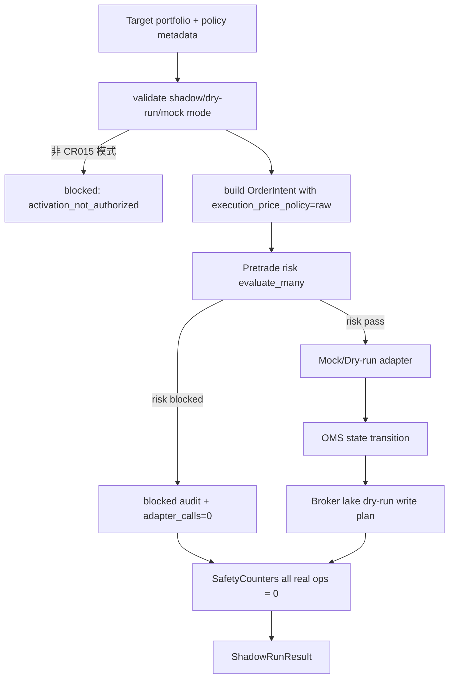

# LLD: CR015-S06 — 目标组合到 order intent 的 shadow 流程

> 本文档是 `CR015-S06-target-portfolio-to-order-intent-shadow-mode` 的低层设计，纳入 `CR015-QMT-FOUNDATION-BATCH-A` 统一 CP5 确认。当前 `confirmed=false`、`implementation_allowed=false`；S06 只串联 target portfolio、OMS、risk、mock adapter 和 broker lake dry-run plan，证明 foundation 离线闭环，不启用 simulation / live。

## 1. Goal

创建 CR-015 foundation 的 shadow pipeline 合同，把研究目标组合和研究复权 metadata 转换为 raw 执行价 order intent，执行 pre-trade risk，生成 mock broker event 和 broker lake dry-run plan，并输出 safety counters，所有真实操作计数保持 0。

## 2. Requirements（Functional / Non-Functional）

### 2.1 Functional

- 定义 `shadow_run(target_portfolio, policy_metadata, fixture_snapshots, run_context)`，输出 intent、risk result、state transition、dry-run plan 四类结果。
- 输入 target portfolio 必须包含 `strategy_id`、`run_id`、`signal_date`、`target_trade_date`、`symbol`、`target_weight` 或 `target_qty`。
- policy metadata 必须包含 `research_adjustment_policy`、`view_id`、`source_run_id`、`quality_status` 和 `execution_price_policy=raw`。
- cash / position / raw price 只能来自 fixture 或脱敏 snapshot contract，不查询真实账户。
- 任一 risk fail 时 `adapter_calls=0`，仍输出 blocked audit summary，不生成 mock broker event。
- 非 raw execution policy 通过次数为 0。
- broker lake 只输出 dry-run write plan，`real_broker_lake_write=0`。

### 2.2 Non-Functional

- 安全：不读取凭据、不调用 QMT、不发单、不撤单、不账户查询、不真实写 broker lake。
- 可追溯：每个 shadow run 输出 `shadow_run_id`、`safety_counters`、blocked reasons 和 dry-run plan summary。
- 可测试：pipeline 使用纯 fixture，可覆盖全通过、risk blocked、非 raw policy、mock event 推进状态机和 dry-run plan。
- 可维护：S06 只编排 S03/S04/S05 合同，不复制其规则。

## 3. 模块拆分与职责

| 模块 / 文件组 | 职责 | 说明 |
|---|---|---|
| `trading/shadow_pipeline.py` | 创建 shadow_run 编排、target sizing、pipeline result、safety counters 和 audit summary | primary |
| `trading/oms.py` | 共享 order intent、state transition、risk result 接入 | shared |
| `trading/pretrade_risk.py` | 共享 risk evaluate 合同 | shared |
| `trading/broker_lake.py` | 共享 dry-run write plan 和 redaction gate | shared |
| `tests/test_cr015_shadow_order_intent_pipeline.py` | 创建 shadow pipeline 端到端 fixture 测试 | primary |

## 4. 代码结构与文件影响范围

| 动作 | 文件路径 | 变更内容 |
|---|---|---|
| 创建 | `trading/shadow_pipeline.py` | 定义 `ShadowRunInput`、`ShadowRunResult`、`SafetyCounters`、`shadow_run`、`build_target_order_intents`、`build_audit_summary` |
| 修改 | `trading/oms.py` | 对齐 pipeline result 所需返回类型，不改变状态机核心 |
| 修改 | `trading/pretrade_risk.py` | 对齐批量 evaluate 结果和 adapter_calls 字段，不新增真实 snapshot |
| 修改 | `trading/broker_lake.py` | 对齐 dry-run plan summary 输入，不新增真实写入 |
| 创建 | `tests/test_cr015_shadow_order_intent_pipeline.py` | 覆盖全通过、risk blocked、非 raw policy、mock event、dry-run plan 和 safety counters |

禁止修改：`pyproject.toml`、`uv.lock`、凭据文件、真实 QMT API、真实 broker order/cancel、真实账户、真实 broker lake、CR016 activation 文件。

## 5. 数据模型与持久化设计

| 对象 / 字段 | 类型 | 约束 | 说明 |
|---|---|---|---|
| `ShadowRunInput.shadow_run_id` | str | 必填 | pipeline run 标识 |
| `ShadowRunInput.target_portfolio` | sequence | 非空 | 研究输出的目标组合 |
| `ShadowRunInput.policy_metadata` | object | 必含 research policy 和 execution raw | 来自 CR017 reader / main HLD contract |
| `FixtureSnapshots.cash` | object | 脱敏 / fixture | 不查询真实账户 |
| `FixtureSnapshots.positions` | object | 脱敏 / fixture | T+1 / 可用持仓输入 |
| `FixtureSnapshots.raw_prices` | object | raw / broker ref | qfq/hfq 不可作为执行价 |
| `ShadowRunResult.intents` | list | 每个 target 一条或 blocked | S03 输出 |
| `ShadowRunResult.risk_results` | list | 与 intents 对齐 | S04 输出 |
| `ShadowRunResult.dry_run_plans` | list | S05 dry-run plan | 不真实写入 |
| `SafetyCounters` | mapping | 真实操作均为 0 | CP5 / CR015 验收字段 |

无新增持久化写入。S06 只返回内存 result 和 dry-run plan；不写报告、data、broker lake 或 QMT 节点文件。

## 6. API / Interface 设计

| 接口 / 入口 | 输入 | 输出 | 调用方 | 说明 |
|---|---|---|---|---|
| `shadow_run(input)` | `ShadowRunInput` | `ShadowRunResult` | foundation smoke / tests | 串联 intent -> risk -> mock event -> dry-run plan |
| `build_target_order_intents(target_portfolio, policy_metadata, run_context)` | target rows、policy、run context | `list[OrderIntent]` | shadow_run | 调用 S03 create intent |
| `build_safety_counters()` | 无 | counters | shadow_run / tests | CR-015 固定真实操作为 0 |
| `build_audit_summary(result)` | pipeline result | summary dict | S07 runbook / tests | 脱敏 summary |
| `validate_shadow_mode(input)` | run input | pass / blocked | shadow_run | 阻断 simulation/live mode |

错误暴露：pipeline result 使用 `blocked_reasons`、`required_missing`、`safety_counters`；不抛含凭据、账户、session、真实路径的异常。

## 7. 核心处理流程

1. `validate_shadow_mode` 校验 mode 仅为 shadow / dry_run / mock。
2. `build_target_order_intents` 将目标组合转为 S03 `OrderIntent`，要求 research policy 和 `execution_price_policy=raw`。
3. S04 `evaluate_many` 使用 fixture cash / position / raw price snapshot 执行九类 risk rules。
4. 对 risk blocked intent，记录 blocked result，`adapter_calls=0`，不调用 S02 adapter。
5. 对 risk pass intent，在 mock / dry-run 模式调用 S02 adapter 生成 mock event 或 dry-run plan。
6. S03 `apply_broker_event` 推进本地状态机。
7. S05 `dry_run_write_plan` 为 intent、risk、event、transition 输出 broker lake dry-run plan。
8. 汇总 `SafetyCounters`，断言真实操作全部为 0。



## 8. 技术设计细节

- 关键算法 / 规则：
  - target sizing 默认把 target_qty 直接传入；若只有 target_weight，则使用 fixture cash / position / raw price 计算理论数量，非整手交给 S04 risk blocked。
  - `validate_shadow_mode` 使用 allowlist；任何 CR016 stage 名称都 blocked。
  - pipeline 不捕获并吞掉 S03/S04/S05 structured errors，而是汇总到 `ShadowRunResult.blocked_reasons`。
  - safety counters 固定包含 `qmt_api_call`、`real_order_call`、`real_cancel_call`、`account_query_call`、`account_write_call`、`credential_read`、`real_broker_lake_write`。
- 依赖选择与复用点：
  - S06 复用 S03/S04/S05/S02 合同，不复制状态机、risk rules 或 broker lake schema。
  - CR017-S04 reader policy gate 作为 policy_metadata 上游合同；本 LLD 不实现 CR017 reader。
- 兼容性处理：
  - 不修改 strategy / engine 入口；只新增 shadow pipeline 可被后续 runbook 引用。
  - 后续 CR016 simulation gate 必须读取 S06/S07 evidence，但 S06 不主动进入 CR016。
- 图示类型选择：流程图，因为跨 OMS、risk、adapter、broker lake 四个模块并有 blocked 分支。

## 9. 安全与性能设计

| 维度 | 设计措施 | 验证方式 |
|---|---|---|
| 安全 | 输入 snapshot 均为 fixture / 脱敏 contract；不读取真实账户 | monkeypatch 账户 / 凭据计数 |
| 安全 | 非 raw execution policy blocked | pipeline 测试 |
| 安全 | risk fail 不调用 adapter；真实操作 counters 全为 0 | risk blocked 测试 |
| 性能 | pipeline 对 target rows 线性处理 | fixture 多行 target 测试 |
| 一致性 | 只编排共享合同，不复制规则 | contract import / result shape 测试 |

## 10. 测试设计

| 测试场景 | 前置条件 | 操作 | 预期结果 | 验证方式 |
|---|---|---|---|---|
| shadow run 全通过 | fixture target、cash、position、raw price 完整 | 调用 `shadow_run` | 输出 intent/risk/state/dry-run plan 四类结果 | `tests/test_cr015_shadow_order_intent_pipeline.py::test_shadow_run_outputs_four_foundation_artifacts` |
| risk blocked | 现金不足或非整手 | 调用 `shadow_run` | adapter_calls=0，不生成 mock broker event | 单元测试 |
| 非 raw policy | `execution_price_policy=qfq` | 调用 `shadow_run` | blocked，通过次数为 0 | 单元测试 |
| mock event 推进状态 | mock scenario accepted/filled | 调用 `shadow_run` | OMS 状态推进符合 S03 合同 | 单元测试 |
| dry-run plan | risk pass event | 调用 `shadow_run` | dry-run broker lake plan，real_broker_lake_write=0 | 单元测试 |
| activation mode blocked | mode=simulation/live_readonly | 调用 `validate_shadow_mode` | blocked: activation_not_authorized | 单元测试 |
| safety counters | 无授权 | 调用全部流程 | qmt/order/cancel/account/credential/broker_lake 均为 0 | monkeypatch counter |

## 11. 实施步骤

| TASK-ID | 动作 | 目标文件 | 详细描述 | 对应测试 |
|---|---|---|---|---|
| CR015-S06-T1 | 创建 | `trading/shadow_pipeline.py` | 定义 shadow run input/result、target sizing、pipeline 编排、safety counters 和 audit summary | 全通过、risk blocked、非 raw policy、activation blocked |
| CR015-S06-T2 | 创建 | `tests/test_cr015_shadow_order_intent_pipeline.py` | 编写端到端 fixture 测试，覆盖四类输出和真实操作计数为 0 | 全部 S06 测试场景 |
| CR015-S06-T3 | 修改 | `trading/oms.py` / `trading/pretrade_risk.py` | 对齐 pipeline 返回类型和批量 risk result；不改变 S03/S04 核心规则 | OMS / risk result shape |
| CR015-S06-T4 | 修改 | `trading/broker_lake.py` | 对齐 dry-run plan summary 输入；不新增真实写入 | dry-run plan 测试 |

## 12. 风险、难点与预研建议

| 风险 / 难点 | 影响 | 缓解措施 / 预研建议 |
|---|---|---|
| pipeline 过度实现到 simulation | 越过 CR016 gate | 明确 `validate_shadow_mode` block CR016 阶段；测试覆盖 |
| target sizing 与真实账户差异 | shadow 结果不能代表真实成交能力 | 文档和 result 标记 fixture / dry-run；真实账户由 CR016 授权 |
| 上游 CR017 policy 未实现 | 非 raw / policy 缺失易混淆 | S06 只消费 policy metadata contract；缺失 blocked |
| 多个 shared trading 文件冲突 | 并行实现风险 | CR015 foundation 开发默认串行，S06 作为 W3 收敛 |

### OPEN / Spike 跟踪

| ID | 类型（OPEN / Spike） | 问题 | 下一动作 | 责任方 |
|---|---|---|---|---|
| 无 | N/A | 无阻塞 OPEN/Spike；simulation / live activation 明确不属于 S06 | CR016 stage gate 单独处理 | meta-po / user |

## 13. 回滚与发布策略

- 发布方式：CP5 前仅发布 LLD 与 CP5 自动预检；实现需等待全量 CP5 人工确认、CR015 W1/W2 合同满足和文件冲突清除。
- 回滚触发条件：pipeline 触达真实 QMT、risk fail 仍生成 adapter event、dry-run plan 发生真实写入、或文档误称 simulation/live 支持。
- 回滚动作：撤回 `trading/shadow_pipeline.py` 和对应测试；仅回退 S06 对共享文件的 result shape 增量，不回退 S03/S04/S05 核心合同。

## 14. Definition of Done

- [x] 14 个章节全部填写完成
- [x] 文件影响范围、接口、测试与实施步骤可直接指导编码
- [x] `confirmed=false` 且 `implementation_allowed=false`，不进入实现
- [x] shadow run 输出 intent、risk result、state transition、dry-run plan 四类结果
- [x] 任一 risk fail 时 adapter_calls=0
- [x] 非 raw execution policy 通过次数设计为 0
- [x] real_order_call、real_cancel_call、account_write_call、credential_read、real_broker_lake_write 均设计为 0
- [x] 第 6 节接口在第 10 节均有测试入口
- [x] 第 7 节异常路径在第 10 节均有错误路径验证

## 人工确认区

> **CP5 — Story LLD 可实现性门**
> meta-dev 先写入 `process/checks/CP5-CR015-S06-target-portfolio-to-order-intent-shadow-mode-LLD-IMPLEMENTABILITY.md` 自动预检结果。meta-po 收齐全部目标 Story 的 LLD、CP4 自动预检摘要和 CP5 自动预检后，再生成并提示用户审查 `checkpoints/CP5-ALL-STORIES-LLD-BATCH.md`。

**CP5 checklist 摘要**：

| # | 检查项 | 状态 | 证据 |
|---|---|---|---|
| 1 | LLD 覆盖 AC | 待检查 | 第 2 / 10 / 14 节 |
| 2 | 与 HLD / ADR 一致 | 待检查 | 第 3 / 8 / 12 节 |
| 3 | 文件影响范围明确 | 待检查 | 第 4 / 11 节 |
| 4 | 接口契约完整 | 待检查 | 第 6 节 |
| 5 | 测试与 dev_gate 可计算 | 待检查 | 第 10 / 14 节 |

**人工确认回复**：

```text
approve
修改: <具体修改点>
reject
```

**人工审查结果回填**：

- 结论：`approved | changes_requested | rejected`
- 审查人：
- 审查时间：
- 修改意见：
- 风险接受项：
