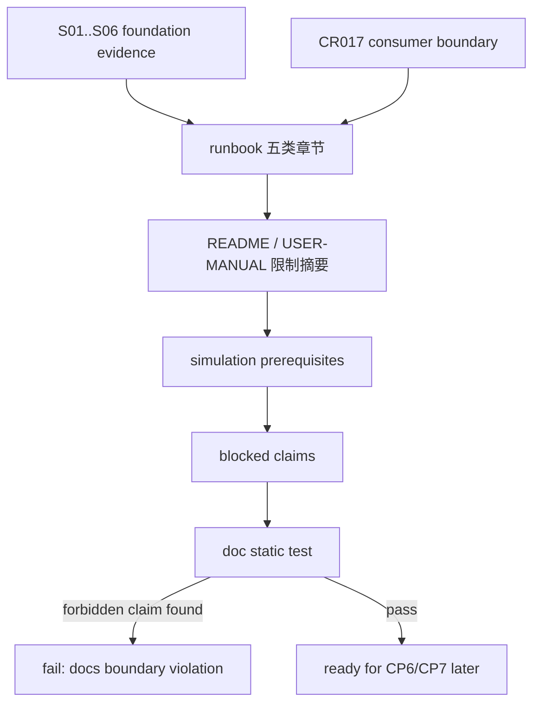

# LLD: CR015-S07 — foundation 文档与 runbook 边界

> 本文档是 `CR015-S07-docs-and-foundation-runbook-boundary` 的低层设计，纳入 `CR015-QMT-FOUNDATION-BATCH-A` 统一 CP5 确认。当前 `confirmed=false`、`implementation_allowed=false`；S07 只设计 foundation 文档和 runbook 边界，不把 CR-015 写成 simulation/live 授权，不解除真实 VWAP / minute / tick / Level2 / order-match blocked claim。

## 1. Goal

创建 QMT foundation runbook 和用户文档边界，明确 CR-015 只覆盖 setup、shadow、dry-run、mock、handoff to CR016 五类章节；真实模拟盘、live_readonly、small_live、scale_up、真实交易和真实账户操作均由 CR016 及后续 per-run authorization 管理。

## 2. Requirements（Functional / Non-Functional）

### 2.1 Functional

- 创建 `docs/QMT-TRADING-RUNBOOK.md` 的 foundation 章节：setup boundary、shadow run、dry-run plan、mock event、handoff to CR016。
- 修改 `README.md` / `docs/USER-MANUAL.md` 时仅追加 CR015 foundation 限制、CR016 后续关系和 blocked claims；不得声明真实交易已支持。
- 定义 runbook checklist 输入：S01 environment boundary、S02 adapter contract、S03 OMS、S04 risk、S05 broker lake dry-run、S06 shadow result、CR017 consumer migration。
- 定义 simulation prerequisites：CR015 foundation verified、CR017 相关 consumer boundary、CP5/CP6/CP7 evidence、per-run authorization；缺任一项时 simulation gate blocked。
- 文档不得输出 token、账户号、session、cookie、交易密码、`.env` 内容或真实私有路径。
- 文档中真实交易支持声明次数为 0；真实 VWAP / minute / tick / Level2 / order-match allowed claim 次数为 0。

### 2.2 Non-Functional

- 可读性：用户能从 runbook 判断当前能做 shadow/dry-run/mock，不能做真实交易。
- 可验证：文档通过静态 contract test 检查 forbidden claims 和章节覆盖。
- 安全：文档只允许脱敏账户标签、env var 名称和 root label，不允许凭据值。
- 可维护：CR016 的 simulation/live runbook 只能在后续 Story 中扩展，S07 不抢占其实现范围。

## 3. 模块拆分与职责

| 模块 / 文件组 | 职责 | 说明 |
|---|---|---|
| `docs/QMT-TRADING-RUNBOOK.md` | 创建 CR015 foundation runbook，覆盖 setup/shadow/dry-run/mock/handoff | primary |
| `README.md` | 追加 QMT foundation 限制摘要和 CR016 后续关系 | shared；实现阶段需与 CR017/CR016 文档 Story 串行 |
| `docs/USER-MANUAL.md` | 追加用户操作边界、禁止范围和 blocked claims | shared |
| `tests/test_cr015_foundation_runbook_boundary.py` | 创建文档静态测试，检查章节覆盖、真实交易声明为 0、blocked claims 未解除 | primary |

## 4. 代码结构与文件影响范围

| 动作 | 文件路径 | 变更内容 |
|---|---|---|
| 创建 | `docs/QMT-TRADING-RUNBOOK.md` | 写 CR015 foundation runbook：环境边界、shadow/dry-run/mock 步骤、证据清单、CR016 handoff prerequisites |
| 修改 | `README.md` | 追加 QMT foundation 入口说明、当前禁止范围和 CR016 后续门控 |
| 修改 | `docs/USER-MANUAL.md` | 追加用户侧 shadow/dry-run/mock 使用边界、失败处理和 blocked claims |
| 创建 | `tests/test_cr015_foundation_runbook_boundary.py` | 检查 5 类章节覆盖、真实交易支持声明次数为 0、微观结构执行价 allowed claim 次数为 0 |

禁止修改：`pyproject.toml`、`uv.lock`、凭据文件、真实 broker 操作、CR016 simulation/live 代码。

## 5. 数据模型与持久化设计

| 对象 / 字段 | 类型 | 约束 | 说明 |
|---|---|---|---|
| `RunbookChecklistItem` | doc row | `id`、`name`、`required_evidence`、`status`、`blocked_reason` | 文档合同，不新增运行时数据 |
| `FoundationMode` | enum | `shadow`、`dry_run`、`mock` | CR015 allowed modes |
| `SimulationPrerequisite` | doc row | CR015 verified、CR017 boundary、authorization 等 | 缺项时 blocked |
| `BlockedClaim` | doc row | `claim`、`reason`、`unblock_condition` | 真实交易和微观结构 claim |
| `SafetyCounterSummary` | doc row | qmt/order/cancel/account/credential/broker lake 计数 | 均为 0 |

无新增持久化数据模型。S07 只创建 / 修改 Markdown 文档和静态测试，不写真实运行记录。

## 6. API / Interface 设计

| 接口 / 入口 | 输入 | 输出 | 调用方 | 说明 |
|---|---|---|---|---|
| `runbook checklist` | S01..S06 evidence path / CP result | setup/shadow/dry-run/mock checklist | 用户 / CR016 gate | 缺项时 simulation gate blocked |
| `boundary docs` | Story 输出、blocked claims、HLD constraints | allowed / forbidden scope | README / USER-MANUAL | 不展示敏感值 |
| `handoff summary` | CR015 foundation result、CR017 boundary、CP state | CR016 prerequisites | meta-po / CR016 | 不自动进入 CR016 |
| `doc static test` | Markdown files | pass / fail | QA / CP6 | forbidden claims 检查 |

错误暴露：文档中的失败处理必须使用 blocked reason / next action，不输出 Python traceback、凭据值或真实账户信息。

## 7. 核心处理流程

1. 读取 S01..S06 LLD / 后续实现证据和 CR017-S06 consumer boundary。
2. 生成 foundation runbook 五类章节：setup、shadow、dry-run、mock、handoff to CR016。
3. 在 README / USER-MANUAL 写入 CR015 allowed modes 和 forbidden operations。
4. 写入 simulation prerequisites：CR015 verified、CR017 relevant gates、CP5/CP6/CP7 evidence、per-run authorization。
5. 写入 blocked claims：真实交易、真实账户查询、真实 broker lake 写入、真实 VWAP、minute、tick、Level2、order-match 均未授权 / unsupported。
6. 静态测试扫描文档，真实交易支持声明和 blocked claim allowed 次数必须为 0。



## 8. 技术设计细节

- 关键算法 / 规则：
  - 文档 static test 使用 exact phrase / section marker 检查，不使用模糊判断放行真实交易支持声明。
  - forbidden claim 字典包含 `real trading supported`、`live order supported`、`real VWAP execution allowed`、`minute/tick/Level2/order-match supported` 等中英文关键表达。
  - allowed modes 字段只列 shadow / dry-run / mock；simulation/live_readonly/small_live/scale_up 仅出现在 “CR016 后续门控 / 未授权” 上下文。
- 依赖选择与复用点：
  - 消费 S01..S06 的 safety counters 和 CR017-S06 migration/boundary 文档。
  - 不新增文档生成依赖。
- 兼容性处理：
  - 若 README / USER-MANUAL 已有相关章节，按最小增量追加，不重排旧文档。
  - S07 不创建 `docs/QMT-SIMULATION-LIVE-RUNBOOK.md` 或 incident playbook，避免侵入 CR016。
- 图示类型选择：流程图，因为文档从 evidence 汇总到 static test 有明确失败路径。

## 9. 安全与性能设计

| 维度 | 设计措施 | 验证方式 |
|---|---|---|
| 安全 | 文档不包含凭据值、账户号、session、cookie、交易密码或真实私有路径 | 静态测试扫描敏感模式 |
| 安全 | 不声明真实交易、真实账户或真实 broker lake 已支持 | forbidden claim 测试 |
| 安全 | 不解除真实 VWAP / minute / tick / Level2 / order-match blocked claim | blocked claim 测试 |
| 性能 | 文档测试按文件大小线性扫描 | 静态测试 |
| 可维护 | CR016 后续内容只以 prerequisites 引用 | 文档段落检查 |

## 10. 测试设计

| 测试场景 | 前置条件 | 操作 | 预期结果 | 验证方式 |
|---|---|---|---|---|
| runbook 五类章节覆盖 | 文档存在 | 扫描 heading | setup、shadow、dry-run、mock、handoff to CR016 均存在 | `tests/test_cr015_foundation_runbook_boundary.py::test_foundation_runbook_has_required_sections` |
| 真实交易声明为 0 | README / USER-MANUAL / runbook | 扫描 forbidden phrase | 支持真实交易声明次数为 0 | 静态测试 |
| 微观结构 claim 未解除 | 文档存在 | 扫描 VWAP/minute/tick/Level2/order-match allowed claim | allowed claim 次数为 0 | 静态测试 |
| 凭据不输出 | 文档存在 | 扫描 token/account/session/cookie/password/.env value 模式 | 敏感原值输出次数为 0 | 静态测试 |
| CR016 prerequisites | runbook 存在 | 扫描 simulation prerequisites | 缺 CR015 verified / per-run authorization 时 blocked | 静态测试 |
| safety counters | 文档存在 | 扫描 counters table | qmt/order/cancel/account/credential/broker lake 均为 0 | 静态测试 |

## 11. 实施步骤

| TASK-ID | 动作 | 目标文件 | 详细描述 | 对应测试 |
|---|---|---|---|---|
| CR015-S07-T1 | 创建 | `docs/QMT-TRADING-RUNBOOK.md` | 写 foundation setup、shadow、dry-run、mock、handoff to CR016 章节和 safety counters | runbook 五类章节、CR016 prerequisites、safety counters |
| CR015-S07-T2 | 修改 | `README.md` / `docs/USER-MANUAL.md` | 追加 QMT foundation 限制、CR016 后续关系和 blocked claims，不声明真实交易支持 | 真实交易声明为 0、微观结构 claim 未解除 |
| CR015-S07-T3 | 创建 | `tests/test_cr015_foundation_runbook_boundary.py` | 编写文档静态测试，扫描 forbidden claims、凭据模式和章节覆盖 | 全部 S07 测试场景 |

## 12. 风险、难点与预研建议

| 风险 / 难点 | 影响 | 缓解措施 / 预研建议 |
|---|---|---|
| 文档误导用户认为可真实交易 | 真实资金风险 | forbidden claim 静态测试；明确 CR016 / per-run authorization |
| README / USER-MANUAL 与 CR017 / CR016 文档冲突 | 文档边界不一致 | 实现阶段按 shared file 串行合并；S07 只写 CR015 foundation 段落 |
| blocked microstructure claim 被误解除 | 研究/交易声明越界 | 保留 CR013 / ADR-045 blocked claim，S07 不改 claim gate |
| runbook 暴露敏感路径或凭据 | 安全风险 | 只写 env var 名称和 root label，不写值 |

### OPEN / Spike 跟踪

| ID | 类型（OPEN / Spike） | 问题 | 下一动作 | 责任方 |
|---|---|---|---|---|
| 无 | N/A | 无阻塞 OPEN/Spike；simulation/live runbook、incident playbook 和真实授权归 CR016 | CR016 LLD / CP5 单独确认 | meta-po / user |

## 13. 回滚与发布策略

- 发布方式：CP5 前仅发布 LLD 与 CP5 自动预检；实现需等待全量 CP5 人工确认与 CR015 S01..S06 合同满足。
- 回滚触发条件：文档测试发现真实交易支持声明、blocked claim 被解除、凭据模式输出、或 README / USER-MANUAL 与 CR016 / CR017 ownership 冲突。
- 回滚动作：撤回 `docs/QMT-TRADING-RUNBOOK.md` 的 CR015 foundation 段落、README / USER-MANUAL 的 S07 增量和对应测试；不修改 HLD/ADR/需求。

## 14. Definition of Done

- [x] 14 个章节全部填写完成
- [x] 文件影响范围、接口、测试与实施步骤可直接指导编码
- [x] `confirmed=false` 且 `implementation_allowed=false`，不进入实现
- [x] runbook 覆盖 setup、shadow、dry-run、mock、handoff to CR016 五类章节
- [x] 文档中真实交易支持声明次数设计为 0
- [x] 真实 VWAP / minute / tick / Level2 / order-match allowed claim 次数设计为 0
- [x] 真实 QMT / order / cancel / account / credential / broker lake 操作计数均设计为 0
- [x] 第 6 节接口在第 10 节均有测试入口
- [x] 第 7 节异常路径在第 10 节均有错误路径验证

## 人工确认区

> **CP5 — Story LLD 可实现性门**
> meta-dev 先写入 `process/checks/CP5-CR015-S07-docs-and-foundation-runbook-boundary-LLD-IMPLEMENTABILITY.md` 自动预检结果。meta-po 收齐全部目标 Story 的 LLD、CP4 自动预检摘要和 CP5 自动预检后，再生成并提示用户审查 `checkpoints/CP5-ALL-STORIES-LLD-BATCH.md`。

**CP5 checklist 摘要**：

| # | 检查项 | 状态 | 证据 |
|---|---|---|---|
| 1 | LLD 覆盖 AC | 待检查 | 第 2 / 10 / 14 节 |
| 2 | 与 HLD / ADR 一致 | 待检查 | 第 3 / 8 / 12 节 |
| 3 | 文件影响范围明确 | 待检查 | 第 4 / 11 节 |
| 4 | 接口契约完整 | 待检查 | 第 6 节 |
| 5 | 测试与 dev_gate 可计算 | 待检查 | 第 10 / 14 节 |

**人工确认回复**：

```text
approve
修改: <具体修改点>
reject
```

**人工审查结果回填**：

- 结论：`approved | changes_requested | rejected`
- 审查人：
- 审查时间：
- 修改意见：
- 风险接受项：
