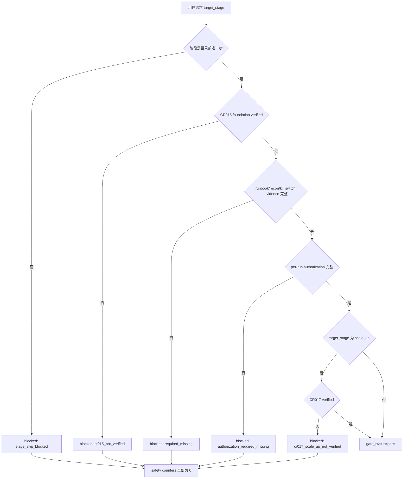

# LLD: CR016-S01 — simulation 阶段 order enable gate

本文档只定义 `shadow -> simulation` 的 stage gate、order enable 条件和安全计数器。`confirmed=false` 且 `implementation_allowed=false` 时不得进入实现；本文不授权真实 QMT / MiniQMT 操作、模拟盘发单、实盘发单、撤单、账户查询、账户写操作或凭据读取。

## 1. Goal

创建 `trading/stage_gate.py` 的 simulation order enable gate 合同，确保只有在 CR015 foundation verified、runbook / 对账规则 / per-run 授权齐备且阶段未跳跃时，才返回 `gate_status=pass`；否则返回结构化 blocked reason，并保证真实操作计数为 0。

## 2. Requirements（Functional / Non-Functional）

### 2.1 Functional

- 枚举固定阶段序列：`shadow -> simulation -> live_readonly -> small_live -> scale_up`，跳阶段请求 100% 返回 blocked。
- 校验 simulation 前置证据：CR015 foundation verified、CR015 runbook ref、CR017 consumer boundary ref、reconciliation policy ref、kill switch readiness ref、per-run authorization summary。
- 定义 per-run authorization 必需字段：`authorization_id`、`mode`、`strategy_id`、`run_id`、`target_stage`、`target_trade_date`、`capital_limit`、`order_scope`、`approver`、`approved_at`、`expires_at`、`rollback_plan_ref`。
- 输出 `gate_status=pass|blocked|manual_review`、`missing_fields`、`blocked_reason`、`safety_counters` 和 `next_required_action`。
- 无完整授权、CR015 未 verified、runbook 缺失、对账规则缺失或 CR017 scale_up 前置缺失时，`real_order_call`、`real_cancel_call`、`account_write_call`、`credential_read` 均为 0。

### 2.2 Non-Functional

- 安全：不得读取 `.env`、token、QMT 账号、session、cookie、交易密码或任何凭据；日志只允许脱敏引用和 evidence ref。
- 可审计：blocked reason 必须稳定、可枚举，便于 runbook 和 CP7 断言。
- 可测试：所有判断通过纯 Python fixture 完成，不触达真实 broker、真实 QMT API 或真实账户。
- 兼容：只在 LLD 中定义 `trading/qmt_adapter.py` 的 mode / counter 消费契约，不修改 adapter 真实行为。

## 3. 模块拆分与职责

| 模块 / 文件组 | 职责 | 说明 |
|---|---|---|
| `trading/stage_gate.py` | 创建阶段枚举、授权摘要校验、证据校验和 simulation order enable gate | 本 Story primary owner |
| `trading/qmt_adapter.py` | 消费 gate result，只有 `gate_status=pass` 且 adapter mode 允许时才可进入后续 adapter 合同 | shared；本 LLD 只声明调用前置，不实现真实 broker 操作 |
| `docs/QMT-TRADING-RUNBOOK.md` | 补充 simulation 准入清单和 per-run 授权字段说明 | shared；开发需与 CR015-S07 文档串行合并 |
| `tests/test_cr016_simulation_order_enable_gate.py` | 验证阶段顺序、缺证据 blocked、缺授权 blocked、真实操作计数为 0 | primary test |

## 4. 代码结构与文件影响范围

| 动作 | 文件路径 | 变更内容 |
|---|---|---|
| 创建 | `trading/stage_gate.py` | 定义 `Stage`、`StageGateRequest`、`AuthorizationSummary`、`StageGateResult`、`evaluate_stage_gate()`、`simulation_order_enable()` |
| 创建 | `tests/test_cr016_simulation_order_enable_gate.py` | 覆盖 shadow -> simulation 合法、跳阶段 blocked、缺 runbook blocked、缺 per-run authorization blocked、CR015 未 verified blocked |
| 修改 | `docs/QMT-TRADING-RUNBOOK.md` | 写入 simulation 准入 checklist、授权摘要字段和“runbook 不等于授权”说明 |
| 修改 | `trading/qmt_adapter.py` | 仅增加可测试的 gate result / adapter mode 前置检查入口；不得加入真实 QMT 调用 |

## 5. 数据模型与持久化设计

本 Story 无新增持久化表和无真实 broker lake 写入。所有对象为内存结构或测试 fixture。

| 对象 / 字段 | 类型 | 约束 | 说明 |
|---|---|---|---|
| `Stage` | Enum / Literal | `shadow`、`simulation`、`live_readonly`、`small_live`、`scale_up` | 固定顺序，不允许跳跃 |
| `AuthorizationSummary` | dataclass / TypedDict | 必需字段覆盖率 100%；不得包含账号、密码、session | 只保存脱敏摘要和审批引用 |
| `StageEvidence` | dataclass / TypedDict | `cr015_verified`、`runbook_ref`、`reconciliation_policy_ref`、`kill_switch_readiness_ref`、`cr017_consumer_boundary_ref` | 缺 P0 字段返回 `required_missing` |
| `SafetyCounters` | dataclass / TypedDict | 默认全部为 0；未授权时必须保持 0 | 字段含 `real_order_call`、`real_cancel_call`、`account_write_call`、`credential_read` |
| `StageGateResult` | dataclass / TypedDict | `gate_status`、`missing_fields`、`blocked_reason`、`safety_counters` | CP7 和 runbook 共同消费 |

## 6. API / Interface 设计

| 接口 / 入口 | 输入 | 输出 | 调用方 | 说明 |
|---|---|---|---|---|
| `evaluate_stage_gate(request, evidence)` | `current_stage`、`target_stage`、`StageEvidence`、`AuthorizationSummary` | `StageGateResult` | runbook checker、simulation enable gate | 测试场景 T-S01-01 至 T-S01-05 覆盖 |
| `simulation_order_enable(gate_result, adapter_mode)` | gate result、`adapter_mode=mock|dry_run|simulation` | `enable|blocked` 和 blocked reason | QMT adapter 前置 | 测试场景 T-S01-06 覆盖；无授权时不触达 adapter |
| `validate_authorization_summary(summary, target_stage)` | per-run authorization summary | `missing_fields`、`redaction_status` | stage gate | 测试场景 T-S01-03 覆盖 |
| `assert_real_operation_counters_zero(counters)` | safety counters | pass / fail | tests、runbook guard | 测试场景 T-S01-07 覆盖 |

错误暴露使用稳定枚举：`stage_skip_blocked`、`cr015_not_verified`、`runbook_required_missing`、`authorization_required_missing`、`reconciliation_policy_missing`、`kill_switch_readiness_missing`、`cr017_scale_up_not_verified`、`real_operation_not_authorized`。

## 7. 核心处理流程

1. 构造 `StageGateRequest`，读取当前 stage、目标 stage、evidence refs 和授权摘要。
2. 先执行阶段顺序校验；任何跳阶段请求直接 blocked。
3. 校验 CR015 foundation verified、runbook、对账策略、kill switch readiness 和 CR017 consumer boundary。
4. 校验 per-run authorization 字段和脱敏状态。
5. 若目标为 `scale_up`，额外要求 CR017 verified；技术 simulation 不因 CR017 未 verified 被阻断，但不能声明资金放大。
6. 返回 `StageGateResult`；所有 blocked / manual_review 结果必须携带 `SafetyCounters` 且真实操作计数为 0。

## 8. 技术设计细节

- 关键规则：阶段顺序使用不可变 tuple `("shadow", "simulation", "live_readonly", "small_live", "scale_up")`；`target_index - current_index == 1` 才允许进入下一阶段。
- 依赖选择与复用点：消费 CR015-S07 runbook boundary 和 CR017-S06 consumer boundary 的 evidence ref，不读取真实文件系统中的凭据或真实交易材料。
- 兼容性处理：`adapter_mode` 中 `shadow|dry_run|mock` 继续可离线验证；`simulation` 只在 gate pass 且后续实现阶段另获授权时可被 adapter 消费。
- 偏差记录：实现若变更字段、枚举或 blocked reason，必须在 CP6 写明偏离 LLD 的原因和影响。
- 图示类型选择：使用流程图，因为 stage gate 跨 runbook、授权、对账和 adapter 前置四类模块。

## 9. 安全与性能设计

| 维度 | 设计措施 | 验证方式 |
|---|---|---|
| 安全 | 不读取凭据；不导入 QMT / XtQuant；blocked 时真实操作计数为 0；授权只保存脱敏摘要 | 单测断言 `credential_read=0`、`real_order_call=0`、`real_cancel_call=0`、`account_write_call=0` |
| 性能 | gate 只做内存字段检查和枚举比较，单次执行 O(字段数) | 单测 fixture 在本地快速执行，不依赖网络或 broker |
| 审计 | 每个 blocked reason 枚举稳定，输出 missing fields 和 evidence refs | 快照式测试断言输出字段 |

## 10. 测试设计

| 测试场景 | 前置条件 | 操作 | 预期结果 | 验证方式 |
|---|---|---|---|---|
| T-S01-01 shadow -> simulation 合法 | CR015 verified、runbook、授权、对账、kill switch readiness 齐备 | 调用 `evaluate_stage_gate()` | `gate_status=pass` | pytest |
| T-S01-02 跳阶段 blocked | current=`shadow`，target=`small_live` | 调用 gate | `blocked_reason=stage_skip_blocked` | pytest |
| T-S01-03 缺 per-run authorization blocked | 授权缺 approver 或 expires_at | 调用 gate | `authorization_required_missing`，真实操作计数 0 | pytest |
| T-S01-04 缺 CR015 verified blocked | `cr015_verified=false` | 调用 gate | `cr015_not_verified` | pytest |
| T-S01-05 缺 runbook / recon / kill switch evidence blocked | 任一 P0 evidence 缺失 | 调用 gate | `required_missing` | pytest |
| T-S01-06 adapter 前置不通过 | gate blocked，adapter_mode=simulation | 调用 `simulation_order_enable()` | 返回 blocked，不触发 adapter | mock counter |
| T-S01-07 CR017 未 verified 时 scale_up blocked | target=`scale_up`，CR017 false | 调用 gate | `scale_up allowed=0` | pytest |

## 11. 实施步骤

| TASK-ID | 动作 | 目标文件 | 详细描述 | 对应测试 |
|---|---|---|---|---|
| CR016-S01-T1 | 创建 | `trading/stage_gate.py` | 定义阶段枚举、请求 / evidence / result 数据结构、授权摘要校验和 stage order 校验 | T-S01-01 至 T-S01-05 |
| CR016-S01-T2 | 修改 | `trading/qmt_adapter.py` | 增加 gate result 前置消费点和真实操作 counter 注入点；不得加入真实 broker 调用 | T-S01-06 |
| CR016-S01-T3 | 创建 | `tests/test_cr016_simulation_order_enable_gate.py` | 写入全部 gate、授权、CR015/CR017 和 counter 断言 | T-S01-01 至 T-S01-07 |
| CR016-S01-T4 | 修改 | `docs/QMT-TRADING-RUNBOOK.md` | 增加 simulation 准入 checklist 和 per-run authorization 字段说明 | T-S01-05 |

## 12. 风险、难点与预研建议

| 风险 / 难点 | 影响 | 缓解措施 / 预研建议 |
|---|---|---|
| runbook 被误认为自动授权 | 用户可能绕过 per-run authorization | 文档和 gate 同时声明 runbook 不等于授权；测试扫描禁止默认授权声明 |
| simulation 与 shadow / dry-run 概念混用 | 可能误触真实 QMT API | adapter mode 枚举与 gate result 分离，未授权真实操作计数为 0 |
| CR017 未 verified 的边界被误用 | 可能错误允许 scale_up | `target_stage=scale_up` 强制检查 CR017 verified |

### OPEN / Spike 跟踪

| ID | 类型（OPEN / Spike） | 问题 | 下一动作 | 责任方 |
|---|---|---|---|---|
| 无 | N/A | 无未决项；真实 simulation 运行授权不属于本 LLD | CP5 统一确认后仍需 dev_gate 和 per-run 授权 | meta-po / user |

## 13. 回滚与发布策略

- 发布方式：CP5 全量人工确认后，按 CR016-W1 串行实现；未确认前不得实现。
- 回滚触发条件：实现时发现 gate 字段与 CR015/CR017 已确认合同冲突，或任何测试显示真实操作计数非 0。
- 回滚动作：停止实现，恢复到 LLD 评审态，更新 Story blocked reason，由 meta-po 决定是否发起 CR 或重提 CP5。

## 14. Definition of Done

- [ ] 14 个章节全部填写完成。
- [ ] 文件影响范围、接口、测试与 TASK-ID 一一对应。
- [ ] `confirmed=false` 且 `implementation_allowed=false` 时不进入实现。
- [ ] CP5 自动预检确认 per-run authorization、stage gate、reconciliation、kill switch 和真实操作计数均有验证入口。
- [ ] 无凭据读取、无 QMT API 调用、无真实发单、无撤单、无账户查询或写操作。
- [ ] OPEN / Spike 已清点为无。

## 人工确认区

> **CP5 — Story LLD 可实现性门**
> meta-dev 先写入 `process/checks/CP5-CR016-S01-simulation-account-order-enable-gate-LLD-IMPLEMENTABILITY.md` 自动预检结果。
> meta-po 收齐全部目标 Story 的 LLD、CP4 自动预检摘要和 CP5 自动预检后，再生成并提示用户审查 `checkpoints/CP5-CR015-CR016-CR017-ALL-STORIES-LLD-BATCH.md`。
> 用户统一确认全部目标 Story 的 LLD 后，仍需满足当前 Wave、依赖门控、文件所有权门控和 per-run authorization 方可进入实现或运行。

**CP5 checklist 摘要**：

| # | 检查项 | 状态 | 证据 |
|---|---|---|---|
| 1 | LLD 覆盖 AC | 待检查 | 第 2 / 10 / 14 节 |
| 2 | 与 HLD / ADR 一致 | 待检查 | 第 3 / 8 / 12 节 |
| 3 | 文件影响范围明确 | 待检查 | 第 4 / 11 节 |
| 4 | 接口契约完整 | 待检查 | 第 6 节 |
| 5 | 测试与 dev_gate 可计算 | 待检查 | 第 10 / 14 节 |

**人工审查结果回填**：

- 结论：`approved | changes_requested | rejected`
- 审查人：
- 审查时间：
- 修改意见：
- 风险接受项：
