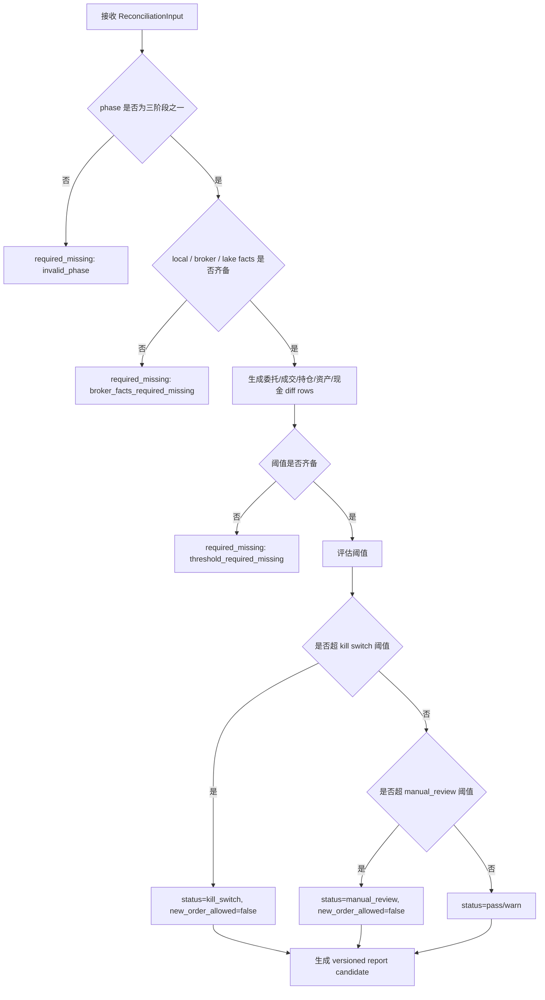

# LLD: CR016-S02 — 盘前 / 盘中 / 盘后 reconciliation 服务与报告

本文档只定义对账服务和报告合同。`confirmed=false` 且 `implementation_allowed=false` 时不得进入实现；本文不授权真实账户查询、真实 broker snapshot 拉取、真实 broker lake 写入、旧报告覆盖或任何交易操作。

## 1. Goal

创建 `trading/reconciliation.py` 的对账服务合同，比较本地 OMS state、broker lake facts 和授权输入的脱敏 broker snapshot，输出盘前 / 盘中 / 盘后 reconciliation report；超阈值必须进入 `manual_review` 或 `kill_switch`，并保证继续下单 allowed 次数为 0。

## 2. Requirements（Functional / Non-Functional）

### 2.1 Functional

- 支持 `recon_phase=pre_market|intraday|post_market` 三个阶段。
- 对账维度覆盖委托、成交、持仓、资产、现金和 broker lake facts。
- 输出 report 字段：`report_id`、`schema_version`、`phase`、`broker_snapshot_ref`、`local_state_ref`、`broker_lake_ref`、`diff_rows`、`thresholds`、`owner`、`action`、`status`、`redaction_status`。
- 阈值结果必须映射为 `pass|warn|manual_review|kill_switch|required_missing`。
- broker facts 缺失时返回 `required_missing`，不得主动查询真实账户。
- 超阈值后 `new_order_allowed=false`，并向 CR016-S03 提供 kill switch trigger candidate。

### 2.2 Non-Functional

- 安全：不读取凭据；不记录账号、交易密码、session 或未脱敏资产明细。
- 可审计：报告候选必须 versioned，不覆盖旧报告和旧基线。
- 可测试：全部测试使用 fixture local state / broker facts，不触达真实 broker。
- 可维护：对账阈值和 diff 类型采用稳定枚举，便于 runbook 和 incident playbook 引用。

## 3. 模块拆分与职责

| 模块 / 文件组 | 职责 | 说明 |
|---|---|---|
| `trading/reconciliation.py` | 创建对账输入、阈值评估、diff row、report candidate 和状态映射 | 本 Story primary owner |
| `trading/broker_lake.py` | 暴露 broker lake facts 的只读输入 contract 和 reconciliation event schema | shared；不得真实写外置 broker lake |
| `trading/oms.py` | 提供本地 order state / position intent 的只读快照 contract | shared；不改变 OMS 状态机 |
| `tests/test_cr016_reconciliation_service_reports.py` | 验证三阶段、阈值、缺 facts、manual_review / kill_switch 和报告不覆盖 | primary test |

## 4. 代码结构与文件影响范围

| 动作 | 文件路径 | 变更内容 |
|---|---|---|
| 创建 | `trading/reconciliation.py` | 定义 `ReconciliationInput`、`DiffRow`、`ThresholdConfig`、`ReconciliationReport`、`reconcile()`、`evaluate_thresholds()` |
| 创建 | `tests/test_cr016_reconciliation_service_reports.py` | 覆盖三阶段、阈值、缺 broker facts、敏感字段脱敏和真实操作计数为 0 |
| 修改 | `trading/broker_lake.py` | 暴露对账 facts / event schema 的纯结构化 contract；不得执行真实写入 |
| 修改 | `trading/oms.py` | 暴露本地状态 snapshot 的只读接口或 adapter contract；不得改变状态流转 |

## 5. 数据模型与持久化设计

本 Story 不新增真实持久化写入。报告为 versioned candidate，可由后续授权的 writer 消费；本 LLD 禁止覆盖 `reports/**` 旧基线。

| 对象 / 字段 | 类型 | 约束 | 说明 |
|---|---|---|---|
| `ReconciliationInput` | dataclass / TypedDict | `phase`、`local_state_ref`、`broker_snapshot_ref`、`broker_lake_ref`、`threshold_config` | snapshot 必须作为输入提供 |
| `DiffRow` | dataclass / TypedDict | `diff_type`、`symbol`、`local_value_ref`、`broker_value_ref`、`diff_value`、`threshold`、`status` | 不保存敏感原值；使用 ref 或脱敏摘要 |
| `ThresholdConfig` | dataclass / TypedDict | 委托、成交、持仓、资产、现金阈值可配置 | 缺阈值返回 `required_missing` |
| `ReconciliationReport` | dataclass / TypedDict | versioned candidate；字段覆盖率 100% | `status=pass|warn|manual_review|kill_switch|required_missing` |
| `SafetyCounters` | dataclass / TypedDict | `real_order_call=0`、`account_query_call=0`、`account_write_call=0`、`credential_read=0` | 单测硬断言 |

## 6. API / Interface 设计

| 接口 / 入口 | 输入 | 输出 | 调用方 | 说明 |
|---|---|---|---|---|
| `reconcile(recon_input)` | phase、local state、broker facts、thresholds | `ReconciliationReport` | stage gate、runbook、monitoring | 测试 T-S02-01 至 T-S02-04 覆盖 |
| `evaluate_thresholds(diff_rows, thresholds)` | diff rows、threshold config | `pass|warn|manual_review|kill_switch` | `reconcile()`、kill switch | 测试 T-S02-05 覆盖 |
| `build_report_candidate(result)` | reconciliation result | versioned report candidate | docs / later writer | 测试 T-S02-06 覆盖；不覆盖旧报告 |
| `to_kill_switch_candidate(report)` | report with超阈值 | trigger reason / owner / action | CR016-S03 | 测试 T-S02-07 覆盖 |

错误暴露使用稳定枚举：`broker_facts_required_missing`、`threshold_required_missing`、`diff_over_threshold`、`redaction_failed`、`report_overwrite_forbidden`、`real_account_query_not_authorized`。

## 7. 核心处理流程

1. 调用方传入 `ReconciliationInput`；输入必须来自 fixture、mock facts 或后续授权的脱敏 snapshot。
2. 验证 phase、facts、threshold config 和 redaction status。
3. 生成 `DiffRow` 列表，不记录敏感原值，只记录 ref / hash / 脱敏摘要。
4. 按阈值评估 `pass|warn|manual_review|kill_switch|required_missing`。
5. 返回 versioned report candidate；不覆盖旧报告，不写真实 lake。
6. 若 `manual_review` 或 `kill_switch`，输出 `new_order_allowed=false` 和 CR016-S03 trigger candidate。

## 8. 技术设计细节

- 关键规则：任何 `required_missing` 或 `manual_review|kill_switch` 都将 `new_order_allowed` 固定为 false。
- 阈值模型：支持金额、数量、持仓、委托状态、现金差异的独立阈值；默认值只能来自显式 config，LLD 不内置真实资金阈值。
- 依赖复用：CR015-S03 提供 OMS state contract，CR015-S05 提供 broker lake facts contract，CR016-S01 消费对账 readiness。
- 兼容性处理：报告 writer 后置；本 Story 只生成 candidate，避免覆盖旧 `reports/**`。
- 图示类型选择：使用流程图，因为对账跨 OMS、broker lake、threshold 和 kill switch candidate。

## 9. 安全与性能设计

| 维度 | 设计措施 | 验证方式 |
|---|---|---|
| 安全 | 禁止真实账户查询；输入只接受外部提供的脱敏 snapshot ref；敏感原值不入 report | 单测断言 `account_query_call=0`、`credential_read=0`、敏感字段扫描通过 |
| 性能 | 对账按 diff rows 线性扫描，复杂度 O(n) | fixture 大小 smoke；不要求 broker I/O |
| 一致性 | versioned report candidate，不覆盖旧报告；同一输入重复运行输出 deterministic | report id / checksum 测试 |

## 10. 测试设计

| 测试场景 | 前置条件 | 操作 | 预期结果 | 验证方式 |
|---|---|---|---|---|
| T-S02-01 盘前对账 pass | local / broker / lake facts 一致 | 调用 `reconcile()` | `phase=pre_market`，`status=pass` | pytest |
| T-S02-02 盘中对账 manual_review | 持仓或委托差异超 manual 阈值 | 调用 `reconcile()` | `status=manual_review`，继续下单 allowed=0 | pytest |
| T-S02-03 盘后对账 kill_switch | 资产 / 现金差异超 kill 阈值 | 调用 `reconcile()` | `status=kill_switch`，输出 trigger candidate | pytest |
| T-S02-04 缺 broker facts | broker snapshot ref 缺失 | 调用 `reconcile()` | `broker_facts_required_missing` | pytest |
| T-S02-05 阈值缺失 | threshold config 缺 P0 字段 | 调用 threshold evaluator | `threshold_required_missing` | pytest |
| T-S02-06 报告不覆盖旧基线 | 已存在旧 report ref | build report candidate | 新 versioned candidate，不覆盖旧路径 | pytest |
| T-S02-07 安全计数为 0 | 任意测试 fixture | 检查 counters | 真实订单、撤单、账户查询、凭据读取均为 0 | pytest |

## 11. 实施步骤

| TASK-ID | 动作 | 目标文件 | 详细描述 | 对应测试 |
|---|---|---|---|---|
| CR016-S02-T1 | 创建 | `trading/reconciliation.py` | 定义输入、diff、threshold、report 和 `reconcile()` 主流程 | T-S02-01 至 T-S02-05 |
| CR016-S02-T2 | 修改 | `trading/broker_lake.py` | 增加 broker facts / reconciliation event schema contract；禁止真实写入 | T-S02-04 / T-S02-07 |
| CR016-S02-T3 | 修改 | `trading/oms.py` | 增加本地状态 snapshot contract，供对账读取 fixture state | T-S02-01 至 T-S02-03 |
| CR016-S02-T4 | 创建 | `tests/test_cr016_reconciliation_service_reports.py` | 覆盖三阶段、阈值、报告、敏感字段和真实操作计数 | T-S02-01 至 T-S02-07 |

## 12. 风险、难点与预研建议

| 风险 / 难点 | 影响 | 缓解措施 / 预研建议 |
|---|---|---|
| 对账被误实现为真实账户查询 | 可能读取敏感账户数据 | API 只接受 snapshot ref；测试断言 account query 计数为 0 |
| 阈值默认值不明确 | 可能误放行异常差异 | 缺显式 threshold config 时 `required_missing` |
| 报告覆盖旧基线 | 破坏追溯 | 只生成 versioned candidate；writer 后置且需单独授权 |

### OPEN / Spike 跟踪

| ID | 类型（OPEN / Spike） | 问题 | 下一动作 | 责任方 |
|---|---|---|---|---|
| 无 | N/A | 无未决项；真实 snapshot 获取不属于本 Story | 后续 per-run 授权输入脱敏 snapshot | meta-po / user |

## 13. 回滚与发布策略

- 发布方式：CP5 全量人工确认后，等待 CR015-S03/S05 verified 和 CR016-S01 合同可用，再按 Wave 串行实现。
- 回滚触发条件：实现出现真实账户查询、旧报告覆盖、敏感字段入 report 或超阈值仍允许下单。
- 回滚动作：停止实现，撤回 Story 到 LLD 修订；必要时将阈值 / report writer 设计交回 meta-po 发起 CR。

## 14. Definition of Done

- [ ] 14 个章节全部填写完成。
- [ ] 三阶段对账、阈值、报告字段和错误枚举均有接口与测试。
- [ ] `confirmed=false` 且 `implementation_allowed=false` 时不进入实现。
- [ ] 无真实账户查询、无凭据读取、无真实 broker lake 写入、无旧报告覆盖。
- [ ] 超阈值后继续下单 allowed 次数为 0。
- [ ] OPEN / Spike 已清点为无。

## 人工确认区

> **CP5 — Story LLD 可实现性门**
> meta-dev 先写入 `process/checks/CP5-CR016-S02-reconciliation-service-and-reports-LLD-IMPLEMENTABILITY.md` 自动预检结果。
> meta-po 收齐全部目标 Story 的 LLD、CP4 自动预检摘要和 CP5 自动预检后，再生成并提示用户审查 `checkpoints/CP5-CR015-CR016-CR017-ALL-STORIES-LLD-BATCH.md`。
> 用户统一确认全部目标 Story 的 LLD 后，仍需满足当前 Wave、依赖门控、文件所有权门控和 per-run authorization 方可进入实现或运行。

**CP5 checklist 摘要**：

| # | 检查项 | 状态 | 证据 |
|---|---|---|---|
| 1 | LLD 覆盖 AC | 待检查 | 第 2 / 10 / 14 节 |
| 2 | 与 HLD / ADR 一致 | 待检查 | 第 3 / 8 / 12 节 |
| 3 | 文件影响范围明确 | 待检查 | 第 4 / 11 节 |
| 4 | 接口契约完整 | 待检查 | 第 6 节 |
| 5 | 测试与 dev_gate 可计算 | 待检查 | 第 10 / 14 节 |

**人工审查结果回填**：

- 结论：`approved | changes_requested | rejected`
- 审查人：
- 审查时间：
- 修改意见：
- 风险接受项：
