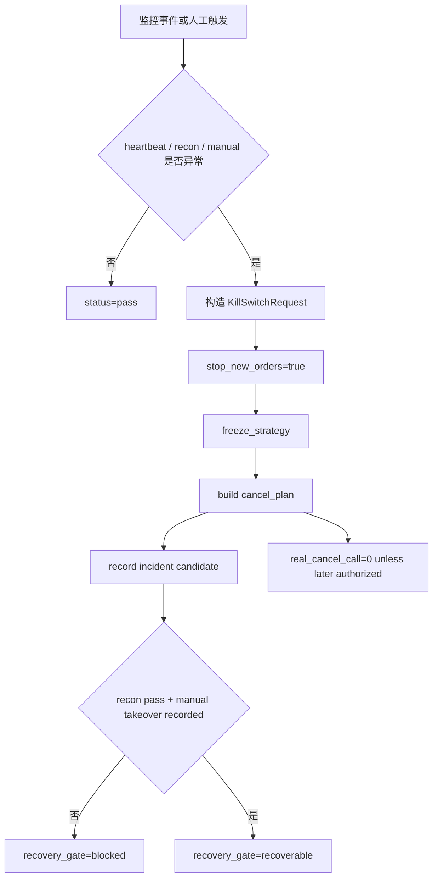

# LLD: CR016-S03 — monitoring heartbeat 与 kill switch

本文档只定义 monitoring heartbeat、kill switch、cancel plan、incident 和 recovery gate 合同。`confirmed=false` 且 `implementation_allowed=false` 时不得进入实现；本文不授权真实撤单、真实发单、账户查询、账户写操作或真实 broker 操作。

## 1. Goal

创建 `trading/monitoring.py` 和 `trading/kill_switch.py` 的运行安全合同，使 heartbeat 失败、risk blocked、reconciliation diff、人工触发都能冻结新单、生成撤单计划、记录 incident，并在恢复前要求 reconciliation pass 与人工接管记录。

## 2. Requirements（Functional / Non-Functional）

### 2.1 Functional

- heartbeat 检查输出 `pass|fail|required_missing`，超时或缺 heartbeat 时生成 incident candidate。
- kill switch 触发原因覆盖 `heartbeat_fail`、`risk_blocked`、`recon_diff`、`manual_trigger`、`recovery_required`。
- kill switch 输出覆盖 `stop_new_orders`、`cancel_plan`、`freeze_strategy`、`incident`、`recovery_gate` 5 类结果。
- 撤单只生成 `cancel_plan`，不等于真实撤单；无后续 per-run 授权时 `real_cancel_call=0`。
- recovery gate 必须同时满足 `reconciliation_status=pass` 和 `manual_takeover_status=recorded`。

### 2.2 Non-Functional

- 安全：不导入真实 QMT / XtQuant；不执行 broker order/cancel；incident event 不包含敏感值。
- 可审计：每次 kill switch 输出 reason、owner、action、recovery requirement 和 evidence refs。
- 可测试：通过 fixture event 和 mock counters 验证所有异常路径。
- 可维护：原因枚举与 CR016-S07 incident playbook 保持一致。

## 3. 模块拆分与职责

| 模块 / 文件组 | 职责 | 说明 |
|---|---|---|
| `trading/monitoring.py` | 创建 heartbeat event、deadline check、monitoring status | 本 Story primary owner |
| `trading/kill_switch.py` | 创建 kill switch trigger、freeze result、cancel plan、incident、recovery gate | 本 Story primary owner |
| `trading/oms.py` | 提供 open intents / non-terminal order state 的只读输入 | shared；不得修改 OMS 状态机语义 |
| `trading/qmt_adapter.py` | 后续消费 cancel plan；本 LLD 不触发真实 cancel | shared；真实 broker 操作仍需授权 |
| `tests/test_cr016_monitoring_kill_switch.py` | 验证 heartbeat fail、manual trigger、recon diff、recovery 和真实操作计数 | primary test |

## 4. 代码结构与文件影响范围

| 动作 | 文件路径 | 变更内容 |
|---|---|---|
| 创建 | `trading/monitoring.py` | 定义 `HeartbeatEvent`、`HeartbeatStatus`、`heartbeat_check()` 和 incident candidate 输出 |
| 创建 | `trading/kill_switch.py` | 定义 `KillSwitchRequest`、`CancelPlan`、`KillSwitchResult`、`kill_switch_trigger()`、`recovery_gate()` |
| 创建 | `tests/test_cr016_monitoring_kill_switch.py` | 覆盖 kill switch 5 类输出、恢复门、无真实撤单和敏感字段扫描 |
| 修改 | `trading/oms.py` | 增加 open intent / non-terminal state 的只读 contract |
| 修改 | `trading/qmt_adapter.py` | 增加 cancel plan 消费前置 contract；不得执行真实撤单 |

## 5. 数据模型与持久化设计

本 Story 无新增持久化写入。incident 为结构化 event candidate，可由后续授权的 broker lake writer 或文档报告消费。

| 对象 / 字段 | 类型 | 约束 | 说明 |
|---|---|---|---|
| `HeartbeatEvent` | dataclass / TypedDict | `source`、`observed_at`、`deadline_at`、`stage`、`status_ref` | 不包含账户或 session |
| `KillSwitchRequest` | dataclass / TypedDict | `reason`、`stage`、`open_intents_ref`、`recon_report_ref`、`manual_trigger_ref` | reason 使用稳定枚举 |
| `CancelPlan` | dataclass / TypedDict | `cancelable_order_refs`、`plan_status`、`requires_authorization=true` | plan 不执行真实撤单 |
| `KillSwitchResult` | dataclass / TypedDict | `stop_new_orders`、`freeze_status`、`cancel_plan`、`incident`、`recovery_gate_status` | 五类输出必填 |
| `SafetyCounters` | dataclass / TypedDict | `real_order_call=0`、`real_cancel_call=0`、`account_write_call=0`、`credential_read=0` | 单测硬断言 |

## 6. API / Interface 设计

| 接口 / 入口 | 输入 | 输出 | 调用方 | 说明 |
|---|---|---|---|---|
| `heartbeat_check(event, deadline_policy)` | heartbeat event、deadline | `pass|fail|required_missing` | monitoring loop / tests | 测试 T-S03-01 覆盖 |
| `kill_switch_trigger(request, open_state)` | reason、open intents、stage、recon report ref | `KillSwitchResult` | reconciliation、manual ops、runbook | 测试 T-S03-02 至 T-S03-05 覆盖 |
| `build_cancel_plan(open_state, stage)` | non-terminal orders / intents | `CancelPlan` | kill switch | 测试 T-S03-03 覆盖；不执行真实 cancel |
| `recovery_gate(recon_status, manual_takeover_record)` | recon status、manual takeover | `recoverable|blocked` | runbook、stage gate | 测试 T-S03-06 覆盖 |

错误暴露使用稳定枚举：`heartbeat_timeout`、`heartbeat_missing`、`recon_diff_over_threshold`、`manual_triggered`、`manual_takeover_required`、`recovery_recon_required`、`real_cancel_not_authorized`。

## 7. 核心处理流程

1. `heartbeat_check()` 对 event 时间和 deadline policy 做纯内存判断。
2. heartbeat fail、reconciliation `manual_review|kill_switch` 或 manual trigger 进入 `kill_switch_trigger()`。
3. kill switch 固定输出 `stop_new_orders=true`、`freeze_strategy` 和 `incident`。
4. 对 non-terminal state 只生成 `CancelPlan`，不执行撤单。
5. recovery 前要求对账 pass 和人工接管记录；缺任一项保持 blocked。

## 8. 技术设计细节

- 关键规则：kill switch 触发后所有新单入口必须读取 `freeze_status=frozen`，返回 `new_order_allowed=false`。
- cancel plan：只列出可撤单引用和 owner，不包含真实账户或 broker session。
- 依赖复用：CR016-S02 输出 recon status；CR015-S03 提供 OMS open state；CR015-S02 adapter 只消费后续授权的 plan。
- 兼容性处理：当前阶段 `cancel_plan_status=planned_only`，真实撤单动作必须后续 per-run 授权。
- 图示类型选择：使用流程图，因为异常分支和恢复条件需要显式展示。

## 9. 安全与性能设计

| 维度 | 设计措施 | 验证方式 |
|---|---|---|
| 安全 | 只生成 cancel plan，不执行真实撤单；incident 脱敏；冻结后新单 allowed=0 | mock counters 和敏感字段扫描 |
| 性能 | heartbeat check 为 O(1)，cancel plan 对 open state O(n) | fixture smoke |
| 一致性 | kill switch 输出同一 reason / evidence refs 时 deterministic | 快照式单测 |

## 10. 测试设计

| 测试场景 | 前置条件 | 操作 | 预期结果 | 验证方式 |
|---|---|---|---|---|
| T-S03-01 heartbeat fail | heartbeat 超 deadline | 调用 `heartbeat_check()` | `fail`，incident candidate | pytest |
| T-S03-02 recon diff 触发 kill switch | CR016-S02 report status=kill_switch | 调用 `kill_switch_trigger()` | stop new orders、freeze、incident | pytest |
| T-S03-03 cancel plan 不等于真实撤单 | open orders 存在 | build cancel plan | `cancel_plan_status=planned_only`，`real_cancel_call=0` | mock counter |
| T-S03-04 manual trigger | manual trigger ref 存在 | 调用 trigger | reason=`manual_triggered` | pytest |
| T-S03-05 触发后新单 blocked | freeze_status=frozen | 调用新单 gate fixture | new_order_allowed=0 | pytest |
| T-S03-06 recovery 缺人工接管 blocked | recon pass，但无 takeover record | 调用 `recovery_gate()` | `blocked` | pytest |
| T-S03-07 incident 无敏感值 | 任意 incident | 扫描 event | 无账号、密码、session、cookie | static check |

## 11. 实施步骤

| TASK-ID | 动作 | 目标文件 | 详细描述 | 对应测试 |
|---|---|---|---|---|
| CR016-S03-T1 | 创建 | `trading/monitoring.py` | 定义 heartbeat event、deadline policy 和 `heartbeat_check()` | T-S03-01 |
| CR016-S03-T2 | 创建 | `trading/kill_switch.py` | 定义 kill switch request/result、cancel plan 和 recovery gate | T-S03-02 至 T-S03-06 |
| CR016-S03-T3 | 修改 | `trading/oms.py` | 暴露 open intent / non-terminal order state 只读 contract | T-S03-03 |
| CR016-S03-T4 | 修改 | `trading/qmt_adapter.py` | 增加 cancel plan 消费前置；真实撤单仍禁止 | T-S03-03 / T-S03-07 |
| CR016-S03-T5 | 创建 | `tests/test_cr016_monitoring_kill_switch.py` | 覆盖 heartbeat、kill switch、recovery、敏感字段和 counters | T-S03-01 至 T-S03-07 |

## 12. 风险、难点与预研建议

| 风险 / 难点 | 影响 | 缓解措施 / 预研建议 |
|---|---|---|
| cancel plan 被误执行为真实撤单 | 可能触发真实 broker 操作 | plan 字段固定 `requires_authorization=true`；测试断言真实撤单为 0 |
| kill switch 无恢复条件 | 可能永久冻结或错误恢复 | recovery gate 明确 recon pass + manual takeover record |
| incident 泄露敏感值 | 合规和凭据风险 | event 只保存 refs 和脱敏标签；测试扫描 |

### OPEN / Spike 跟踪

| ID | 类型（OPEN / Spike） | 问题 | 下一动作 | 责任方 |
|---|---|---|---|---|
| 无 | N/A | 无未决项；真实 cancel 执行不属于本 Story | 后续 per-run 授权和 adapter LLD / 实现门控 | meta-po / user |

## 13. 回滚与发布策略

- 发布方式：CP5 全量人工确认后，等待 CR016-S02 合同稳定和 CR015 adapter / OMS verified，再按 Wave 串行实现。
- 回滚触发条件：kill switch 后仍允许新单、cancel plan 执行真实撤单、incident 泄露敏感值或 recovery 缺人工接管仍可恢复。
- 回滚动作：停止实现，回退 Story 到 LLD 修订；必要时把真实撤单语义交回 meta-po 独立 CR。

## 14. Definition of Done

- [ ] 14 个章节全部填写完成。
- [ ] heartbeat、kill switch、cancel plan、incident、recovery gate 均有接口与测试。
- [ ] `confirmed=false` 且 `implementation_allowed=false` 时不进入实现。
- [ ] kill switch 触发后新单 allowed 次数为 0。
- [ ] 无真实撤单、无真实发单、无账户写操作、无凭据读取。
- [ ] OPEN / Spike 已清点为无。

## 人工确认区

> **CP5 — Story LLD 可实现性门**
> meta-dev 先写入 `process/checks/CP5-CR016-S03-monitoring-heartbeat-and-kill-switch-LLD-IMPLEMENTABILITY.md` 自动预检结果。
> meta-po 收齐全部目标 Story 的 LLD、CP4 自动预检摘要和 CP5 自动预检后，再生成并提示用户审查 `checkpoints/CP5-CR015-CR016-CR017-ALL-STORIES-LLD-BATCH.md`。
> 用户统一确认全部目标 Story 的 LLD 后，仍需满足当前 Wave、依赖门控、文件所有权门控和 per-run authorization 方可进入实现或运行。

**CP5 checklist 摘要**：

| # | 检查项 | 状态 | 证据 |
|---|---|---|---|
| 1 | LLD 覆盖 AC | 待检查 | 第 2 / 10 / 14 节 |
| 2 | 与 HLD / ADR 一致 | 待检查 | 第 3 / 8 / 12 节 |
| 3 | 文件影响范围明确 | 待检查 | 第 4 / 11 节 |
| 4 | 接口契约完整 | 待检查 | 第 6 节 |
| 5 | 测试与 dev_gate 可计算 | 待检查 | 第 10 / 14 节 |

**人工审查结果回填**：

- 结论：`approved | changes_requested | rejected`
- 审查人：
- 审查时间：
- 修改意见：
- 风险接受项：
