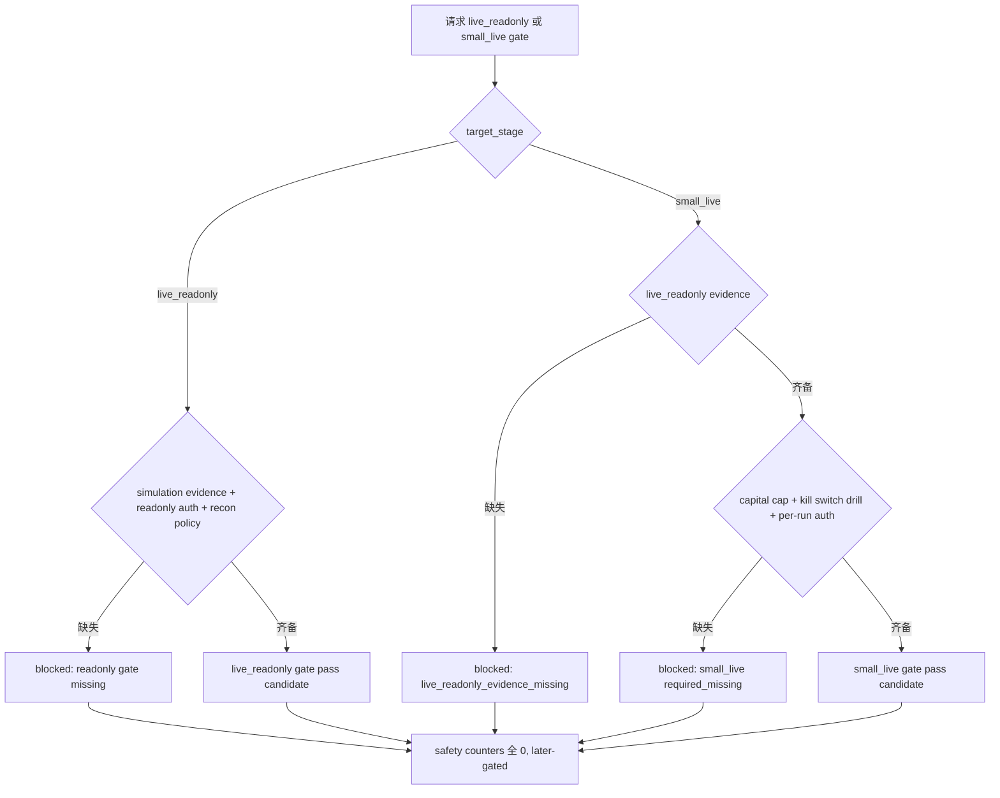

# LLD: CR016-S05 — live_readonly 与 small_live 准入门

本文档为 **later-gated** LLD，只定义 `live_readonly` 与 `small_live` 的 gate、退出、回退、观察窗口、资金上限和失败阈值。`confirmed=false`、`implementation_allowed=false`、`real_operation_authorized=false`；本文不授权真实模拟盘、真实只读账户查询、真实实盘发单、撤单、账户写操作或资金放大。

## 1. Goal

创建 `trading/live_admission.py` 的 live stage admission gate 合同，确保 simulation 通过后仍必须先进入 live_readonly 核对门，再在资金上限、kill switch 演练、对账和 per-run 授权全部满足后才允许 small_live gate 返回 pass；当前 LLD 不授权任何真实操作。

## 2. Requirements（Functional / Non-Functional）

### 2.1 Functional

- `live_readonly_gate` 必须校验 simulation evidence、只读授权摘要、对账 policy、runbook readiness 和 account write 禁止声明。
- `small_live_gate` 必须校验 live_readonly evidence、per-run authorization、capital cap、kill switch drill、observation window、failure thresholds 和 rollback plan。
- live_readonly 和 small_live 均定义准入、退出、回退、观察窗口、失败阈值。
- 缺 per-run authorization、资金上限、kill switch drill 或对账 pass 时，`gate_status=blocked`。
- 任何 blocked / 未授权状态下 `real_order_call`、`real_cancel_call`、`account_query_call`、`account_write_call`、`credential_read` 均为 0。

### 2.2 Non-Functional

- later-gated：CP5 通过也不自动进入真实 live_readonly 或 small_live；仍需 meta-po 后续调度、依赖 verified、文件无冲突和用户逐 run 授权。
- 安全：不读取凭据，不触达真实账户，不调用 QMT API。
- 可审计：每个 gate result 输出 missing fields、blocked reason、evidence refs、rollback target。
- 可测试：通过 fixture gate 验证所有缺失和阻断路径。

## 3. 模块拆分与职责

| 模块 / 文件组 | 职责 | 说明 |
|---|---|---|
| `trading/live_admission.py` | 创建 live_readonly / small_live gate、rollback evaluator 和 failure threshold contract | 本 Story primary owner |
| `trading/stage_gate.py` | 提供阶段顺序、authorization summary 和 prior stage evidence | shared；由 CR016-S01 owner 维护 |
| `docs/QMT-SIMULATION-LIVE-RUNBOOK.md` | 写入 live_readonly / small_live 准入与回退矩阵 | shared；由 CR016-S04/S05 串行合并 |
| `tests/test_cr016_live_readonly_small_live_admission.py` | 验证 later-gated、缺授权、缺资金上限、缺 kill switch drill 和真实操作计数为 0 | primary test |

## 4. 代码结构与文件影响范围

| 动作 | 文件路径 | 变更内容 |
|---|---|---|
| 创建 | `trading/live_admission.py` | 定义 `LiveReadonlyGateRequest`、`SmallLiveGateRequest`、`LiveAdmissionResult`、`live_readonly_gate()`、`small_live_gate()`、`rollback_evaluator()` |
| 创建 | `tests/test_cr016_live_readonly_small_live_admission.py` | 覆盖 simulation 未通过、缺只读授权、缺资金上限、缺 kill switch drill、无授权真实操作计数为 0 |
| 修改 | `trading/stage_gate.py` | 增加 live stage 对阶段顺序和 prior evidence 的消费 contract；不得改变 S01 基础语义 |
| 修改 | `docs/QMT-SIMULATION-LIVE-RUNBOOK.md` | 增加 live_readonly / small_live gate 矩阵和 later-gated 禁止事项 |

## 5. 数据模型与持久化设计

本 Story 无新增持久化写入，不查询真实账户，不写真实运行报告。

| 对象 / 字段 | 类型 | 约束 | 说明 |
|---|---|---|---|
| `LiveReadonlyGateRequest` | dataclass / TypedDict | simulation evidence、read-only authorization summary、recon policy、runbook ref | 只读授权也是脱敏摘要，不触发账户查询 |
| `SmallLiveGateRequest` | dataclass / TypedDict | live_readonly evidence、capital cap、kill switch drill ref、observation window、failure thresholds、rollback plan | 缺任一 P0 字段 blocked |
| `LiveAdmissionResult` | dataclass / TypedDict | `gate_status`、`missing_fields`、`blocked_reason`、`rollback_target`、`allowed_operations`、`safety_counters` | `allowed_operations` 在本 LLD 中默认空 |
| `CapitalCapPolicy` | dataclass / TypedDict | cap amount ref、currency、scope、approver、expires_at | 不保存真实账户余额 |
| `SafetyCounters` | dataclass / TypedDict | real/order/cancel/query/write/credential 全 0 | 单测硬断言 |

## 6. API / Interface 设计

| 接口 / 入口 | 输入 | 输出 | 调用方 | 说明 |
|---|---|---|---|---|
| `live_readonly_gate(request)` | simulation evidence、readonly authorization、recon policy | `LiveAdmissionResult` | runbook、stage gate | 测试 T-S05-01 至 T-S05-03 覆盖 |
| `small_live_gate(request)` | live_readonly evidence、capital cap、kill switch drill、per-run auth | `LiveAdmissionResult` | stage gate、runbook | 测试 T-S05-04 至 T-S05-06 覆盖 |
| `rollback_evaluator(stage_result)` | live stage result、failure thresholds | rollback target、reason | runbook、incident playbook | 测试 T-S05-07 覆盖 |
| `assert_later_gated(result)` | gate result | pass / fail | tests、CP5 guard | 测试 T-S05-08 覆盖 |

错误暴露使用稳定枚举：`later_gated_real_operation`、`simulation_evidence_missing`、`readonly_authorization_missing`、`capital_cap_missing`、`kill_switch_drill_missing`、`observation_window_missing`、`per_run_authorization_missing`、`real_account_query_not_authorized`。

## 7. 核心处理流程

1. 调用方构造 target stage 请求；本 LLD 只接受 `live_readonly` 或 `small_live`。
2. live_readonly 校验 simulation evidence、只读授权摘要、对账 policy 和 runbook readiness。
3. small_live 在 live_readonly evidence 基础上校验资金上限、kill switch 演练、观察窗口、失败阈值和 rollback plan。
4. 所有结果都标记 `later_gated=true`，表示 LLD 只定义门控，不授权真实操作。
5. blocked 或未获后续授权时安全计数器保持 0。

## 8. 技术设计细节

- 关键规则：`live_readonly` 不允许账户写操作；当前 LLD 也不授权真实只读账户查询，只接受后续授权输入的脱敏 evidence。
- small_live：必须显式 `capital_cap`、`kill_switch_drill_status=pass` 和 `observation_window`，缺任一项 blocked。
- 依赖复用：CR016-S04 runbook / approval gates、CR015-S07 foundation evidence 和 CR016-S01 stage order。
- 兼容性处理：本 Story 与 S01 共享 `stage_gate.py`，开发时由 S05 merge_owner 串行补充 live stage 消费 contract。
- 图示类型选择：使用流程图，因为 live_readonly 与 small_live 分支和 later-gated 阻断必须显式展示。

## 9. 安全与性能设计

| 维度 | 设计措施 | 验证方式 |
|---|---|---|
| 安全 | later-gated 标记强制真实操作不授权；账户查询、订单、撤单、写操作、凭据读取计数全为 0 | pytest counters |
| 性能 | gate 只处理内存字段和 evidence refs，O(字段数) | fixture smoke |
| 审计 | 输出 missing fields、blocked reason、rollback target 和 evidence refs | 快照式测试 |

## 10. 测试设计

| 测试场景 | 前置条件 | 操作 | 预期结果 | 验证方式 |
|---|---|---|---|---|
| T-S05-01 simulation 未通过 blocked | simulation evidence 缺失 | 调用 `live_readonly_gate()` | `simulation_evidence_missing` | pytest |
| T-S05-02 live_readonly 缺只读授权 blocked | authorization 缺失 | 调用 gate | `readonly_authorization_missing` | pytest |
| T-S05-03 live_readonly 不允许账户写 | gate fixture | 检查 counters | `account_write_call=0` | pytest |
| T-S05-04 small_live 缺资金上限 blocked | capital cap 缺失 | 调用 `small_live_gate()` | `capital_cap_missing` | pytest |
| T-S05-05 small_live 缺 kill switch drill blocked | drill 缺失 | 调用 gate | `kill_switch_drill_missing` | pytest |
| T-S05-06 缺 per-run 授权真实调用为 0 | authorization 缺失 | 调用 gate | order/cancel/query/write/credential 全 0 | pytest |
| T-S05-07 rollback evaluator | failure threshold 触发 | 调用 rollback | 输出 rollback target 和 reason | pytest |
| T-S05-08 later-gated 标记 | 任意 pass candidate | assert | `later_gated=true`，不授权真实操作 | pytest |

## 11. 实施步骤

| TASK-ID | 动作 | 目标文件 | 详细描述 | 对应测试 |
|---|---|---|---|---|
| CR016-S05-T1 | 创建 | `trading/live_admission.py` | 定义 live_readonly / small_live gate 数据结构、校验和 rollback evaluator | T-S05-01 至 T-S05-07 |
| CR016-S05-T2 | 修改 | `trading/stage_gate.py` | 增加 live stage prior evidence 消费 contract，保持 S01 语义兼容 | T-S05-01 / T-S05-08 |
| CR016-S05-T3 | 修改 | `docs/QMT-SIMULATION-LIVE-RUNBOOK.md` | 写 live_readonly / small_live 准入、退出、回退、观察窗口、失败阈值和 later-gated 声明 | T-S05-08 |
| CR016-S05-T4 | 创建 | `tests/test_cr016_live_readonly_small_live_admission.py` | 覆盖缺授权、缺资金上限、缺演练、rollback、真实操作计数为 0 | T-S05-01 至 T-S05-08 |

## 12. 风险、难点与预研建议

| 风险 / 难点 | 影响 | 缓解措施 / 预研建议 |
|---|---|---|
| live_readonly 被误解为可真实查询账户 | 可能读取真实账户敏感信息 | LLD 明确不授权账户查询；只消费后续授权 evidence |
| small_live 未设资金上限 | 资金风险不可控 | 缺 capital cap 直接 blocked |
| CP5 通过被误认为实盘授权 | 绕过 later gate | frontmatter、接口输出和测试均保留 `later_gated=true` |

### OPEN / Spike 跟踪

| ID | 类型（OPEN / Spike） | 问题 | 下一动作 | 责任方 |
|---|---|---|---|---|
| 无 | N/A | 无 LLD 未决项；真实 live_readonly / small_live 启动授权不属于本批 | 后续由 meta-po 按 later-gated 流程单独审批 | meta-po / user |

## 13. 回滚与发布策略

- 发布方式：CP5 全量人工确认后，本 Story 仍保持 later-gated；实现和真实运行都必须等待 CR015 verified、CR016-S04 合同稳定、用户后续授权和文件无冲突。
- 回滚触发条件：实现允许无授权账户查询 / 发单 / 撤单，或缺资金上限仍 small_live pass。
- 回滚动作：停止实现，回退到 LLD 修订；若用户要改变 later-gated 边界，交回 meta-po 发起 CR。

## 14. Definition of Done

- [ ] 14 个章节全部填写完成。
- [ ] live_readonly 与 small_live 均定义准入、退出、回退、观察窗口和失败阈值。
- [ ] `confirmed=false`、`implementation_allowed=false`、`gating=later-gated` 时不进入实现或真实运行。
- [ ] 无 per-run authorization 时真实调用次数为 0。
- [ ] small_live 缺资金上限或 kill switch 演练时 allowed 次数为 0。
- [ ] OPEN / Spike 已清点为无。

## 人工确认区

> **CP5 — Story LLD 可实现性门**
> meta-dev 先写入 `process/checks/CP5-CR016-S05-live-readonly-and-small-live-admission-LLD-IMPLEMENTABILITY.md` 自动预检结果。
> meta-po 收齐全部目标 Story 的 LLD、CP4 自动预检摘要和 CP5 自动预检后，再生成并提示用户审查 `checkpoints/CP5-CR015-CR016-CR017-ALL-STORIES-LLD-BATCH.md`。
> 用户统一确认全部目标 Story 的 LLD 后，CR016-S05 仍必须 later-gated；真实 live_readonly / small_live 需要后续独立授权。

**CP5 checklist 摘要**：

| # | 检查项 | 状态 | 证据 |
|---|---|---|---|
| 1 | LLD 覆盖 AC | 待检查 | 第 2 / 10 / 14 节 |
| 2 | 与 HLD / ADR 一致 | 待检查 | 第 3 / 8 / 12 节 |
| 3 | 文件影响范围明确 | 待检查 | 第 4 / 11 节 |
| 4 | 接口契约完整 | 待检查 | 第 6 节 |
| 5 | 测试与 dev_gate 可计算 | 待检查 | 第 10 / 14 节 |

**人工审查结果回填**：

- 结论：`approved | changes_requested | rejected`
- 审查人：
- 审查时间：
- 修改意见：
- 风险接受项：
