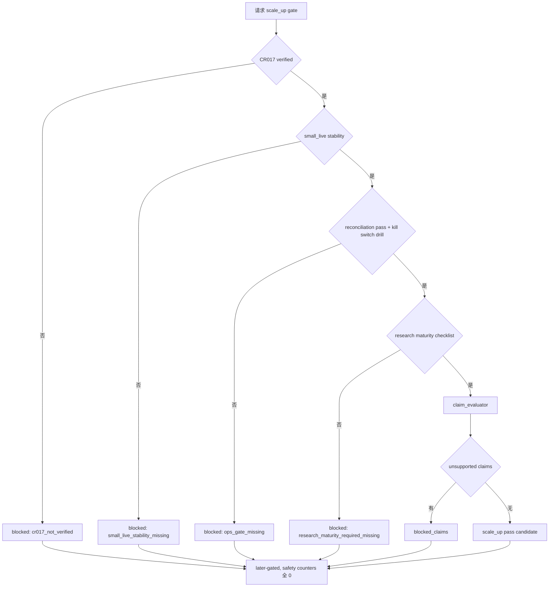

# LLD: CR016-S06 — scale_up 与研究成熟度 gate

本文档为 **later-gated** LLD，只定义 `scale_up` 和研究成熟度 gate，不授权真实模拟盘、实盘、资金放大、真实执行价声明、VWAP / minute / tick / Level2 / order-match 声明或任何 QMT 操作。`confirmed=false`、`implementation_allowed=false`、`real_operation_authorized=false`。

## 1. Goal

创建 `trading/scale_up_gate.py` 的 scale_up admission 合同，确保 CR017 未 verified、小资金阶段未稳定、对账未 pass、kill switch drill 未通过或研究成熟度不足时，`scale_up_gate_status=blocked`；同时阻断 unsupported execution claims。

## 2. Requirements（Functional / Non-Functional）

### 2.1 Functional

- scale_up gate 至少检查 5 类前置：CR017 verified、small_live stability、reconciliation pass、kill switch drill、research maturity。
- research maturity 至少包含 strategy version、parameter freeze、experiment registry、PIT policy、benchmark policy、exposure / capacity / cost summary、success / failure criteria。
- CR017 未 verified 时，`scale_up allowed` 次数为 0，且生产策略复权治理完成声明 blocked。
- unsupported VWAP / minute / tick / Level2 / order-match claim 被计入 allowed 的次数为 0。
- gate 输出 `blocked_claims`、`required_missing`、`maturity_status`、`rollback_target` 和 `safety_counters`。

### 2.2 Non-Functional

- later-gated：CP5 通过不授权 scale_up 实现或运行；必须后续独立审批。
- 安全：不调用 QMT、不读取账户、不读取凭据、不写真实 broker lake。
- 可审计：blocked claims 必须可追溯到 CR017、CR013 和研究成熟度输入。
- 可测试：全部检查通过 fixture summary 和 mock counters 完成。

## 3. 模块拆分与职责

| 模块 / 文件组 | 职责 | 说明 |
|---|---|---|
| `trading/scale_up_gate.py` | 创建 scale_up gate、research maturity checklist、claim evaluator | 本 Story primary owner |
| `trading/live_admission.py` | 提供 small_live evidence 和 stability summary contract | shared；由 CR016-S05 owner 维护 |
| `engine/research_dataset.py` | 提供研究成熟度 summary 的只读输出 contract | shared；不得改变研究数据源语义 |
| `tests/test_cr016_scale_up_research_maturity_gates.py` | 验证 CR017 未 verified blocked、研究成熟度缺失、unsupported claims 和真实操作计数为 0 | primary test |

## 4. 代码结构与文件影响范围

| 动作 | 文件路径 | 变更内容 |
|---|---|---|
| 创建 | `trading/scale_up_gate.py` | 定义 `ScaleUpGateRequest`、`ResearchMaturitySummary`、`BlockedClaim`、`scale_up_gate()`、`claim_evaluator()`、`maturity_checklist()` |
| 创建 | `tests/test_cr016_scale_up_research_maturity_gates.py` | 覆盖 CR017 未 verified、PIT / benchmark / capacity 缺失、unsupported claims、真实操作计数为 0 |
| 修改 | `trading/live_admission.py` | 暴露 small_live stability summary contract；不得解除 S05 later-gated |
| 修改 | `engine/research_dataset.py` | 输出可供 gate 消费的 maturity summary contract；不得读取凭据或真实 broker 数据 |

## 5. 数据模型与持久化设计

本 Story 无新增持久化写入；所有对象为 gate 输入 / 输出或测试 fixture。

| 对象 / 字段 | 类型 | 约束 | 说明 |
|---|---|---|---|
| `ScaleUpGateRequest` | dataclass / TypedDict | small_live evidence、CR017 status、research maturity summary、recon status、kill switch drill、claim request | 缺任一 P0 字段 blocked |
| `ResearchMaturitySummary` | dataclass / TypedDict | strategy version、params frozen、experiment registry、PIT、benchmark、exposure、capacity、cost、success/failure criteria | 只读 summary，不触发数据生产 |
| `BlockedClaim` | dataclass / TypedDict | claim_name、reason、required_gate、source_ref | unsupported claims 必须显式列出 |
| `ScaleUpGateResult` | dataclass / TypedDict | `scale_up_gate_status`、`research_maturity_status`、`blocked_claims`、`required_missing`、`rollback_target`、`safety_counters` | CP7 和报告 guard 消费 |
| `SafetyCounters` | dataclass / TypedDict | real/order/cancel/query/write/credential 全 0 | 单测硬断言 |

## 6. API / Interface 设计

| 接口 / 入口 | 输入 | 输出 | 调用方 | 说明 |
|---|---|---|---|---|
| `scale_up_gate(request)` | small_live evidence、CR017 status、maturity summary、claims | `ScaleUpGateResult` | runbook、report guard | 测试 T-S06-01 至 T-S06-05 覆盖 |
| `claim_evaluator(claims, gate_context)` | requested claims、CR017 / CR013 status | allowed / blocked claims | reports、docs guard | 测试 T-S06-04 覆盖 |
| `maturity_checklist(summary)` | research maturity summary | `pass|blocked|required_missing` | scale_up gate | 测试 T-S06-02 / T-S06-03 覆盖 |
| `assert_scale_up_later_gated(result)` | gate result | pass / fail | tests、CP5 guard | 测试 T-S06-06 覆盖 |

错误暴露使用稳定枚举：`cr017_not_verified`、`small_live_stability_missing`、`reconciliation_not_pass`、`kill_switch_drill_missing`、`research_maturity_required_missing`、`unsupported_execution_claim`、`later_gated_real_operation`。

## 7. 核心处理流程

1. `scale_up_gate()` 先检查 CR017 verified；未 verified 直接 blocked。
2. 检查 small_live stability、对账 pass 和 kill switch drill。
3. 调用 `maturity_checklist()` 验证研究成熟度字段。
4. 调用 `claim_evaluator()` 阻断 VWAP / minute / tick / Level2 / order-match 等 unsupported claims。
5. 所有结果都标记 later-gated；即使 pass candidate 也不授权真实资金放大。

## 8. 技术设计细节

- 关键规则：CR017 未 verified 时不阻断技术 simulation 设计，但必须阻断 scale_up 和生产策略复权治理完成声明。
- blocked claims：`vwap_execution`、`minute_execution`、`tick_execution`、`level2_execution`、`order_match_claim` 默认 blocked，除非后续 CR 明确解除。
- 依赖复用：CR016-S05 提供 small_live evidence；CR017-S06 提供复权消费边界；CR011-S08 提供 robust validation baseline。
- 兼容性处理：`engine/research_dataset.py` 只增加 summary contract，不改变数据读取和训练逻辑。
- 图示类型选择：使用流程图，因为 scale_up 涉及运行、研究和声明三类 gate。

## 9. 安全与性能设计

| 维度 | 设计措施 | 验证方式 |
|---|---|---|
| 安全 | later-gated；真实操作、账户查询、凭据读取计数全 0；unsupported claims blocked | pytest counters 和 claim tests |
| 性能 | gate 只消费 summary，避免全量研究数据扫描 | fixture smoke |
| 审计 | blocked_claims 每项记录 source_ref 和 required_gate | 快照式测试 |

## 10. 测试设计

| 测试场景 | 前置条件 | 操作 | 预期结果 | 验证方式 |
|---|---|---|---|---|
| T-S06-01 CR017 未 verified blocked | `cr017_adjustment_verified=false` | 调用 `scale_up_gate()` | `cr017_not_verified`，allowed=0 | pytest |
| T-S06-02 缺 PIT / benchmark blocked | maturity summary 缺字段 | 调用 checklist | `research_maturity_required_missing` | pytest |
| T-S06-03 缺 capacity / cost blocked | maturity summary 缺 capacity/cost | 调用 checklist | blocked | pytest |
| T-S06-04 unsupported claims blocked | 请求 VWAP/minute/tick/Level2/order-match | 调用 claim evaluator | blocked count 等于请求数 | pytest |
| T-S06-05 small_live stability 缺失 blocked | no stability evidence | 调用 gate | `small_live_stability_missing` | pytest |
| T-S06-06 later-gated 和 counters | 任意 pass candidate | assert | `later_gated=true`，真实调用全 0 | pytest |

## 11. 实施步骤

| TASK-ID | 动作 | 目标文件 | 详细描述 | 对应测试 |
|---|---|---|---|---|
| CR016-S06-T1 | 创建 | `trading/scale_up_gate.py` | 定义 scale_up gate、research maturity checklist、claim evaluator 和 blocked claims | T-S06-01 至 T-S06-06 |
| CR016-S06-T2 | 修改 | `trading/live_admission.py` | 增加 small_live stability summary contract，保持 later-gated 语义 | T-S06-05 / T-S06-06 |
| CR016-S06-T3 | 修改 | `engine/research_dataset.py` | 输出 research maturity summary contract，不触发真实数据生产 | T-S06-02 / T-S06-03 |
| CR016-S06-T4 | 创建 | `tests/test_cr016_scale_up_research_maturity_gates.py` | 覆盖 CR017、研究成熟度、unsupported claims、counters 和 later-gated | T-S06-01 至 T-S06-06 |

## 12. 风险、难点与预研建议

| 风险 / 难点 | 影响 | 缓解措施 / 预研建议 |
|---|---|---|
| scale_up 被 CP5 误放行 | 可能扩大真实资金风险 | frontmatter、接口输出、测试均强制 later-gated |
| 研究成熟度字段过宽或过窄 | 可能误阻断或误放行 | 使用 CR011/CR017 confirmed contract；字段缺失返回 required_missing |
| unsupported execution claim 被包装成可用 | 用户误信真实执行能力 | claim evaluator 显式 blocked；文档 guard 复用 blocked claims |

### OPEN / Spike 跟踪

| ID | 类型（OPEN / Spike） | 问题 | 下一动作 | 责任方 |
|---|---|---|---|---|
| 无 | N/A | 无 LLD 未决项；解除 scale_up later gate 需要后续独立审批 | 后续 CR 或 meta-po gate 决策 | meta-po / user |

## 13. 回滚与发布策略

- 发布方式：CP5 全量人工确认后，本 Story 仍保持 later-gated；实现和运行必须等待 CR017 verified、小资金阶段稳定、用户后续授权和文件无冲突。
- 回滚触发条件：CR017 未 verified 时 scale_up pass、unsupported claims allowed、或真实操作计数非 0。
- 回滚动作：停止实现，回退 LLD；若需要解除 blocked claims，交回 meta-po 发起 CR。

## 14. Definition of Done

- [ ] 14 个章节全部填写完成。
- [ ] scale_up gate 至少检查 CR017 verified、small_live stability、reconciliation pass、kill switch drill、research maturity 5 类前置。
- [ ] `confirmed=false`、`implementation_allowed=false`、`gating=later-gated` 时不进入实现或真实运行。
- [ ] CR017 未 verified 时 scale_up allowed 次数为 0。
- [ ] unsupported VWAP / minute / tick / Level2 / order-match claim allowed 次数为 0。
- [ ] OPEN / Spike 已清点为无。

## 人工确认区

> **CP5 — Story LLD 可实现性门**
> meta-dev 先写入 `process/checks/CP5-CR016-S06-scale-up-and-research-maturity-gates-LLD-IMPLEMENTABILITY.md` 自动预检结果。
> meta-po 收齐全部目标 Story 的 LLD、CP4 自动预检摘要和 CP5 自动预检后，再生成并提示用户审查 `checkpoints/CP5-CR015-CR016-CR017-ALL-STORIES-LLD-BATCH.md`。
> 用户统一确认全部目标 Story 的 LLD 后，CR016-S06 仍必须 later-gated；scale_up 和资金放大需要后续独立授权。

**CP5 checklist 摘要**：

| # | 检查项 | 状态 | 证据 |
|---|---|---|---|
| 1 | LLD 覆盖 AC | 待检查 | 第 2 / 10 / 14 节 |
| 2 | 与 HLD / ADR 一致 | 待检查 | 第 3 / 8 / 12 节 |
| 3 | 文件影响范围明确 | 待检查 | 第 4 / 11 节 |
| 4 | 接口契约完整 | 待检查 | 第 6 节 |
| 5 | 测试与 dev_gate 可计算 | 待检查 | 第 10 / 14 节 |

**人工审查结果回填**：

- 结论：`approved | changes_requested | rejected`
- 审查人：
- 审查时间：
- 修改意见：
- 风险接受项：
