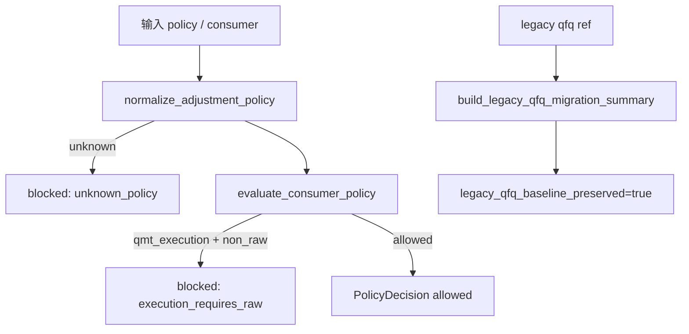

# LLD: CR017-S01 — 复权口径合同与迁移声明冻结

本文档只定义 CR017-S01 的可实现设计，等待全部目标 Story 的 CP5 统一确认；在 `confirmed=false` 且 `implementation_allowed=false` 时不得实现。

## 1. Goal

创建 `market_data/adjustment_policy.py`、`docs/ADJUSTMENT-POLICY-MIGRATION.md` 和 `tests/test_cr017_adjustment_policy_contract.py` 的实现蓝图，冻结 `raw/qfq/hfq/returns_adjusted` policy、consumer matrix、旧 qfq 只读保留声明和 QMT raw-only 口径边界。

## 2. Requirements（Functional / Non-Functional）

### 2.1 Functional

- 覆盖 REQ-098、REQ-099、REQ-101、REQ-103、REQ-104，policy id 固定为 `raw`、`qfq`、`hfq`、`returns_adjusted`。
- QMT execution consumer 对 `qfq/hfq/returns_adjusted` 必须返回 blocked，允许次数为 0。
- migration summary 必须输出 `legacy_qfq_baseline_preserved=true`、旧基线引用、兼容入口和禁止覆盖说明。

### 2.2 Non-Functional

- 离线、确定性、无外部 I/O；provider fetch、lake write、credential read、current pointer publish、dependency change、legacy overwrite 计数均为 0。
- 不修改 `process/REQUIREMENTS.md`、HLD、ADR 或任何 CR015 / CR016 文件。
- 枚举和 blocked reason 必须稳定，供 CR017-S02..S06、CR015 和 CR016 消费。

## 3. 模块拆分与职责

| 模块 / 文件组 | 职责 | 说明 |
|---|---|---|
| `market_data/adjustment_policy.py` | 定义 policy enum、consumer category、decision result 和 blocked reason | CR017-S01 primary owner |
| `docs/ADJUSTMENT-POLICY-MIGRATION.md` | 记录旧 qfq 只读保留、新 view、兼容入口和禁止覆盖声明 | S01 创建，S06 后续补充消费矩阵 |
| `tests/test_cr017_adjustment_policy_contract.py` | 验证枚举完整性、未知 policy fail-fast、QMT raw-only matrix 和迁移声明 | 离线 fixture |
| `market_data/contracts.py` | 暴露稳定 policy id 常量或导出入口 | shared；只在 CP5 后按 LLD 串行改动 |
| `README.md`、`docs/USER-MANUAL.md` | 后续写用户可见口径说明 | shared；S06 为主要文档收敛者 |

## 4. 代码结构与文件影响范围

| 动作 | 文件路径 | 变更内容 |
|---|---|---|
| 创建 | `market_data/adjustment_policy.py` | 增加 `AdjustmentPolicy`、`ConsumerCategory`、`PolicyDecision`、`normalize_adjustment_policy()`、`evaluate_consumer_policy()`、`build_legacy_qfq_migration_summary()` |
| 创建 | `docs/ADJUSTMENT-POLICY-MIGRATION.md` | 写 legacy qfq baseline preserved、new views、compatibility entry、forbidden overwrite 和 CP5 后续条件 |
| 创建 | `tests/test_cr017_adjustment_policy_contract.py` | 覆盖 4 类 policy、未知 policy、QMT raw-only、迁移声明关键字段 |
| 修改 | `market_data/contracts.py` | 仅导出 policy 常量或类型别名，不改变既有 prices / catalog contract |
| 修改 | `README.md`、`docs/USER-MANUAL.md` | 仅在 S06 收敛用户说明；S01 不直接拥有最终文档合并 |

## 5. 数据模型与持久化设计

| 对象 / 字段 | 类型 | 约束 | 说明 |
|---|---|---|---|
| `AdjustmentPolicy.policy_id` | str enum | `raw/qfq/hfq/returns_adjusted` 四选一 | 稳定外部合同 |
| `ConsumerCategory` | str enum | 覆盖 chart、long_horizon_research、factor_research、qmt_execution、migration | 消费矩阵输入 |
| `PolicyDecision` | dataclass / typed dict | `allowed`、`policy_id`、`blocked_reason`、`consumer_category` 必填 | blocked reason 结构化 |
| `MigrationSummary` | dataclass / typed dict | `legacy_qfq_baseline_preserved=true` 必填 | 不保存真实私有路径，只保存逻辑引用 |

无新增持久化写入；文档只记录迁移声明，不读写真实 lake 或旧报告内容。

## 6. API / Interface 设计

| 接口 / 入口 | 输入 | 输出 | 调用方 | 说明 |
|---|---|---|---|---|
| `normalize_adjustment_policy(policy: str)` | policy 字符串 | `AdjustmentPolicy` 或 structured blocked reason | reader、validation、测试 | 未知 policy fail-fast |
| `evaluate_consumer_policy(consumer, policy)` | consumer category、policy | `PolicyDecision` | reader、QMT handoff、docs tests | QMT execution 只允许 raw |
| `build_legacy_qfq_migration_summary(ref)` | 旧 qfq 逻辑引用 | `MigrationSummary` | 文档渲染、迁移检查 | 不读取真实路径内容 |
| `render_policy_matrix()` | 无或 consumer 列表 | policy matrix | S06 文档 | 为用户文档复用 |

## 7. 核心处理流程

异常路径：未知 policy 返回 blocked；QMT execution 非 raw 返回 blocked；旧 qfq ref 缺失时返回 `required_missing` 但不得尝试扫描真实目录；任何实现偏离 LLD 必须在 CP6 记录。

## 8. 技术设计细节

- 关键规则：policy id 不做别名模糊匹配；旧 `qfq` 兼容入口只读保留，不覆盖旧报告。
- 依赖复用：复用既有 `market_data/contracts.py` 作为导出边界，避免新增依赖。
- 兼容性处理：旧 qfq 入口继续可读，但新消费必须显式声明 `research_adjustment_policy`。
- 图示类型选择：流程图，因本 Story 跨 policy、consumer、migration 三类合同。

## 9. 安全与性能设计

| 维度 | 设计措施 | 验证方式 |
|---|---|---|
| 安全 | 不读取 `.env`、token、账户、session、cookie、交易密码或真实私有路径；QMT execution 非 raw hard block | 测试断言 `credential_read=0`、非 raw execution allowed=0 |
| 性能 | 枚举和矩阵为常量级计算，无外部 I/O | 单测覆盖纯函数，默认运行时间不依赖数据规模 |
| 可追溯 | migration summary 必含旧基线逻辑引用和禁止覆盖声明 | 文档片段和 dataclass 字段测试 |

## 10. 测试设计

| 测试场景 | 前置条件 | 操作 | 预期结果 | 验证方式 |
|---|---|---|---|---|
| policy 枚举完整 | 无 | 调用 `render_policy_matrix()` | 4 类 policy 全覆盖 | `test_policy_ids_cover_four_classes` |
| 未知 policy blocked | 输入 `foo` | 调用 normalize | 返回 structured blocked reason | `test_unknown_policy_blocks` |
| QMT raw-only | consumer=`qmt_execution` | 遍历 4 类 policy | 仅 raw allowed，其余 blocked | `test_qmt_execution_requires_raw` |
| 迁移声明完整 | legacy ref fixture | build summary | `legacy_qfq_baseline_preserved=true` 且含禁止覆盖 | `test_migration_summary_preserves_legacy_qfq` |
| CP5 前真实操作为 0 | 默认 fixture | 检查 counters | 全部为 0 | `test_pre_cp5_operation_counts_are_zero` |

## 11. 实施步骤

| TASK-ID | 动作 | 目标文件 | 详细描述 | 对应测试 |
|---|---|---|---|---|
| CR017-S01-T1 | 创建 | `market_data/adjustment_policy.py` | 定义 enum、decision result、policy normalize 与 consumer gate | policy / QMT raw-only tests |
| CR017-S01-T2 | 创建 | `docs/ADJUSTMENT-POLICY-MIGRATION.md` | 写旧 qfq 保留、新 view、兼容入口和禁止覆盖声明 | migration summary tests |
| CR017-S01-T3 | 创建 | `tests/test_cr017_adjustment_policy_contract.py` | 固化 policy、迁移声明和权限计数测试 | 全部 S01 tests |
| CR017-S01-T4 | 修改 | `market_data/contracts.py` | 只导出稳定 policy 常量，避免破坏旧入口 | import / compatibility tests |

## 12. 风险、难点与预研建议

| 风险 / 难点 | 影响 | 缓解措施 / 预研建议 |
|---|---|---|
| policy 别名导致模糊匹配 | 消费方误用旧口径 | exact policy id；未知值 blocked |
| 迁移文档被误解为已完成真实迁移 | 用户误判旧 qfq 已重算 | 文档写明 summary only、无真实写湖和无覆盖 |
| 与 S06 共享文档冲突 | 后续文档重复或覆盖 | S01 创建基础迁移声明，S06 作为 consumer docs merge owner 补充矩阵 |

### OPEN / Spike 跟踪

| ID | 类型（OPEN / Spike） | 问题 | 下一动作 | 责任方 |
|---|---|---|---|---|
| 无 | N/A | 无阻断 OPEN；CP5 人工确认前不得实现 | 等待 meta-po 汇总统一 CP5 | meta-po |

## 13. 回滚与发布策略

- 发布方式：CP5 approved 后按 Story 开发实现，默认只发布代码合同和文档声明，不发布真实数据指针。
- 回滚触发条件：policy enum 破坏旧入口、QMT raw-only gate 失败、迁移声明缺少禁止覆盖。
- 回滚动作：撤回 `market_data/adjustment_policy.py` 导出和文档增量；保留旧 qfq 只读基线不变。

## 14. Definition of Done

- [x] 14 个章节全部填写完成。
- [x] 文件影响范围、接口、测试与实施步骤可直接指导编码。
- [x] `confirmed=false`、`implementation_allowed=false` 时不进入实现。
- [x] CP5 前真实操作计数均为 0。
- [x] frontmatter 已填写 `tier=M`。
- [x] OPEN / Spike 已清点，当前无阻断项。
- [ ] 等待全部目标 Story 的 LLD 与 CP5 自动预检汇总后统一人工确认。

## 人工确认区

本 LLD 等待 `checkpoints/CP5-CR015-CR016-CR017-ALL-STORIES-LLD-BATCH.md` 统一确认；确认前不得实现。

**CP5 checklist 摘要**：

| # | 检查项 | 状态 | 证据 |
|---|---|---|---|
| 1 | LLD 覆盖 AC | 待检查 | 第 2 / 10 / 14 节 |
| 2 | 与 HLD / ADR 一致 | 待检查 | 第 3 / 8 / 12 节 |
| 3 | 文件影响范围明确 | 待检查 | 第 4 / 11 节 |
| 4 | 接口契约完整 | 待检查 | 第 6 节 |
| 5 | 测试与 dev_gate 可计算 | 待检查 | 第 10 / 14 节 |
