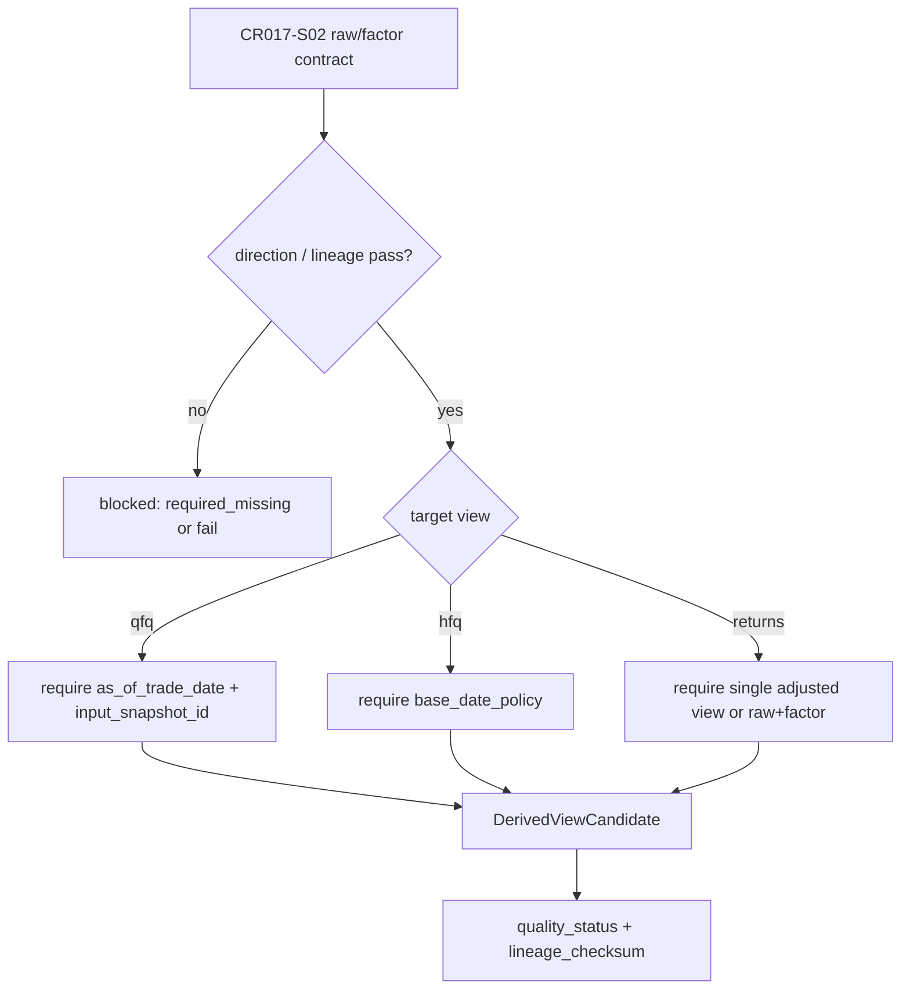

# LLD: CR017-S03 — qfq / hfq 派生 view normalization

本文档只定义 CR017-S03 的派生候选设计；CP5 统一确认前不得实现、不得真实全量派生、不得写湖或发布 current pointer。

## 1. Goal

创建 `market_data/adjustment_derivation.py` 和 `tests/test_cr017_qfq_hfq_derivation.py` 的实现蓝图，并限定 `market_data/normalization.py`、`market_data/contracts.py` 共享改动，定义 qfq、hfq、returns_adjusted 派生 view 的公式、as-of、base date、lineage 和 quality gate。

## 2. Requirements（Functional / Non-Functional）

### 2.1 Functional

- 覆盖 REQ-099、REQ-100、REQ-104；`prices_qfq`、`prices_hfq`、`returns_adjusted` 三类 view 均有独立 `view_id`、`schema_version`、`derivation_version`、`source_run_id` 和 `quality_status`。
- qfq 100% 记录 `as_of_trade_date` 与 `input_snapshot_id`。
- factor direction 未确认、as-of 缺失、base policy 不可追溯或输入混用时，派生成功次数为 0。

### 2.2 Non-Functional

- 派生只输出 candidate rows / in-memory fixture；publish gate 和真实 lake write 不属于本 Story。
- 计算必须 deterministic；同一 input snapshot 与 as-of 生成同一 lineage。
- 复权价不得进入 QMT 执行价字段。

## 3. 模块拆分与职责

| 模块 / 文件组 | 职责 | 说明 |
|---|---|---|
| `market_data/adjustment_derivation.py` | qfq/hfq/returns_adjusted 派生候选逻辑、lineage、quality result | S03 primary |
| `market_data/normalization.py` | 接入 candidate normalization 入口 | shared；不得触发真实写湖 |
| `market_data/contracts.py` | 导出 derived view id、schema version、字段集 | shared |
| `tests/test_cr017_qfq_hfq_derivation.py` | 数学 parity、as-of、base date、returns 和异常 factor fixture tests | 离线 |

## 4. 代码结构与文件影响范围

| 动作 | 文件路径 | 变更内容 |
|---|---|---|
| 创建 | `market_data/adjustment_derivation.py` | 增加 `derive_qfq()`、`derive_hfq()`、`derive_returns_adjusted()`、`DerivationInput`、`DerivedViewCandidate` |
| 修改 | `market_data/normalization.py` | 按 LLD 暴露 candidate normalization 入口，不发布 current pointer |
| 修改 | `market_data/contracts.py` | 增加 `prices_qfq`、`prices_hfq`、`returns_adjusted` schema 常量 |
| 创建 | `tests/test_cr017_qfq_hfq_derivation.py` | 覆盖 qfq as-of、hfq base、returns 和异常路径 |

## 5. 数据模型与持久化设计

| 对象 / 字段 | 类型 | 约束 | 说明 |
|---|---|---|---|
| `DerivationInput` | dataclass / typed dict | raw rows、factor rows、policy、as-of/base policy、input snapshot 必填 | 输入必须单一 policy |
| `DerivedViewCandidate` | dataclass / typed dict | `view_id`、adjusted OHLC、`derivation_version`、`source_run_id`、`lineage_checksum`、`quality_status` 必填 | 只代表候选输出 |
| `prices_qfq` | derived view | 必含 `as_of_trade_date`、`input_snapshot_id` | 解释前复权漂移 |
| `prices_hfq` | derived view | 必含 base date / base policy | 后复权锚点 |
| `returns_adjusted` | derived view | 必含 `return_type`、start/end price refs | 不混用 qfq/hfq |

无新增持久化写入；本 Story 不发布 Parquet 或 catalog pointer。

## 6. API / Interface 设计

| 接口 / 入口 | 输入 | 输出 | 调用方 | 说明 |
|---|---|---|---|---|
| `derive_qfq(input)` | raw、adj_factor、`as_of_trade_date`、snapshot | `DerivedViewCandidate` | normalization、tests | 公式为 raw * factor(date) / factor(as_of) 或按 explicit direction 映射 |
| `derive_hfq(input)` | raw、adj_factor、base policy | `DerivedViewCandidate` | normalization、tests | base date 必须可追溯 |
| `derive_returns_adjusted(input)` | 单一 adjusted view 或 raw+factor | `DerivedViewCandidate` | research reader、tests | 输入混用 fail |
| `explain_derivation_lineage(input)` | source ids、snapshot、version | lineage checksum / reason | validation、docs | deterministic lineage |

## 7. 核心处理流程

异常路径：direction 未确认、as-of 缺失、base policy 不可追溯、raw quality fail、qfq/hfq 收益率方向不一致或输入混用时返回 structured fail，不生成 candidate。

## 8. 技术设计细节

- 关键算法：qfq 推荐公式 `raw_price * adj_factor(trade_date) / adj_factor(as_of_trade_date)`；hfq 推荐公式 `raw_price * adj_factor(trade_date) / adj_factor(base_date)`；方向相反时只能通过 `provider_factor_direction` 显式映射。
- 依赖复用：依赖 S02 的 contract check result；不重新定义 raw/factor schema。
- 兼容性处理：旧 qfq 不被覆盖；新 qfq candidate 必须有 `as_of_trade_date`。
- 图示类型选择：流程图，因存在三类派生与多个异常分支。

## 9. 安全与性能设计

| 维度 | 设计措施 | 验证方式 |
|---|---|---|
| 安全 | 不读取凭据、不抓取 provider、不写湖、不发布 pointer；非 raw 不进入 execution field | operation counters 和 leakage tests |
| 一致性 | lineage 由 source ids、snapshot、policy、version 组成 | deterministic 重算测试 |
| 性能 | 按 symbol/date 分区可线性计算，LLD 不引入全量真实数据操作 | fixture parity smoke |

## 10. 测试设计

| 测试场景 | 前置条件 | 操作 | 预期结果 | 验证方式 |
|---|---|---|---|---|
| qfq as-of deterministic | raw/factor/as-of fixture | derive twice | 输出和 lineage 一致 | `test_qfq_same_asof_is_deterministic` |
| qfq 不同 as-of 可追溯 | 两个 as-of | derive qfq | lineage 不同且记录 as-of | `test_qfq_asof_changes_lineage` |
| hfq base 可追溯 | base policy fixture | derive hfq | 输出含 base metadata | `test_hfq_requires_traceable_base` |
| returns 不混用 | 混合 raw/qfq inputs | derive returns | FAIL `mixed_adjustment_policy` | `test_returns_mixed_policy_fails` |
| direction 缺失 blocked | factor 缺 direction | derive any | success count 0 | `test_missing_factor_direction_blocks_derivation` |

## 11. 实施步骤

| TASK-ID | 动作 | 目标文件 | 详细描述 | 对应测试 |
|---|---|---|---|---|
| CR017-S03-T1 | 创建 | `market_data/adjustment_derivation.py` | 实现输入对象、三类 derive 函数、lineage 与 fail result | derivation tests |
| CR017-S03-T2 | 修改 | `market_data/normalization.py` | 接入 candidate normalization，不写真实 lake | normalization smoke |
| CR017-S03-T3 | 修改 | `market_data/contracts.py` | 增加 derived view id / schema constants | schema tests |
| CR017-S03-T4 | 创建 | `tests/test_cr017_qfq_hfq_derivation.py` | 固化 qfq/hfq/returns/error tests | 全部 S03 tests |

## 12. 风险、难点与预研建议

| 风险 / 难点 | 影响 | 缓解措施 / 预研建议 |
|---|---|---|
| 公式方向写反 | 污染全部派生 view | direction explicit；样例 parity；缺失则 blocked |
| as-of 漂移不可解释 | qfq 历史价格不可审计 | qfq 必写 as-of 和 input snapshot |
| returns 输入混用 | 研究收益失真 | single-policy gate 与 structured fail |
| shared 文件冲突 | S03/S04/S05 并行开发风险 | CP5 后按 merge_owner 串行合并 |

### OPEN / Spike 跟踪

| ID | 类型（OPEN / Spike） | 问题 | 下一动作 | 责任方 |
|---|---|---|---|---|
| 无 | N/A | 无阻断 OPEN；真实 provider 样例 parity 不在本 LLD 阶段执行 | 后续如需真实样例，单独授权 | meta-po |

## 13. 回滚与发布策略

- 发布方式：CP5 approved 后离线实现 candidate derivation，不发布 current pointer。
- 回滚触发条件：direction 缺失仍可派生、qfq 缺 as-of、returns 混用通过、旧 qfq 被覆盖。
- 回滚动作：撤回 `adjustment_derivation.py` 导出和 normalization 接入，保留 raw/factor 合同。

## 14. Definition of Done

- [x] 14 个章节全部填写完成。
- [x] 文件影响范围、接口、测试与实施步骤可直接指导编码。
- [x] `confirmed=false`、`implementation_allowed=false` 时不进入实现。
- [x] CP5 前真实操作计数均为 0。
- [x] frontmatter 已填写 `tier=L`。
- [x] OPEN / Spike 已清点，当前无阻断项。
- [ ] 等待全部目标 Story 的 LLD 与 CP5 自动预检汇总后统一人工确认。

## 人工确认区

本 LLD 等待 `checkpoints/CP5-CR015-CR016-CR017-ALL-STORIES-LLD-BATCH.md` 统一确认；确认前不得实现。

**CP5 checklist 摘要**：

| # | 检查项 | 状态 | 证据 |
|---|---|---|---|
| 1 | LLD 覆盖 AC | 待检查 | 第 2 / 10 / 14 节 |
| 2 | 与 HLD / ADR 一致 | 待检查 | 第 3 / 8 / 12 节 |
| 3 | 文件影响范围明确 | 待检查 | 第 4 / 11 节 |
| 4 | 接口契约完整 | 待检查 | 第 6 节 |
| 5 | 测试与 dev_gate 可计算 | 待检查 | 第 10 / 14 节 |
