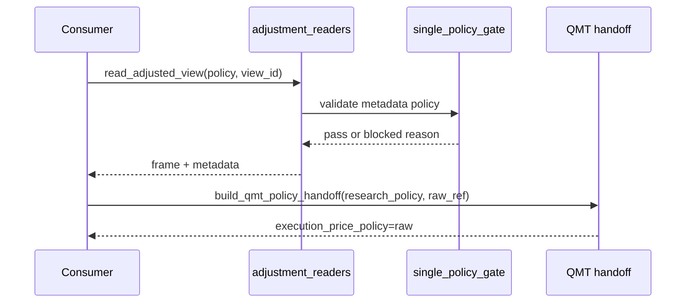

# LLD: CR017-S04 — reader API 与单口径 policy gates

本文档只定义 CR017-S04 的 reader / gate 设计；CP5 统一确认前不得实现、不得切换生产 reader、不得读取未授权候选数据。

## 1. Goal

创建 `market_data/adjustment_readers.py` 和 `tests/test_cr017_reader_policy_gates.py` 的实现蓝图，并限定 `market_data/readers.py`、`engine/research_dataset.py` 的共享修改，为研究消费层提供显式 `research_adjustment_policy` 和 single-policy gate。

## 2. Requirements（Functional / Non-Functional）

### 2.1 Functional

- 覆盖 REQ-101、REQ-102、REQ-104；同一研究 run 必须使用一个明确 `research_adjustment_policy`。
- reader metadata 必含 policy、view_id、source_run_id、quality_status、single_policy_gate_status。
- QMT handoff 只输出 research metadata；`execution_price_policy` 必须为 raw，复权价作为执行价通过次数为 0。

### 2.2 Non-Functional

- reader 不触发 backfill、provider fetch、lake write 或 current pointer publish。
- 对未指定 policy、混用 policy、quality fail、未发布 candidate 默认 fail-fast。
- 后续与 CR015/CR016 只通过 metadata / order intent 合同衔接，策略层不得直连 QMT。

## 3. 模块拆分与职责

| 模块 / 文件组 | 职责 | 说明 |
|---|---|---|
| `market_data/adjustment_readers.py` | 显式 policy reader、single-policy gate、QMT metadata handoff result | S04 primary |
| `market_data/readers.py` | 接入调整视图读取入口 | shared；不改变默认 current pointer 语义 |
| `engine/research_dataset.py` | 消费 reader metadata，阻断混用 policy | shared；S06/CR016 也会消费 |
| `tests/test_cr017_reader_policy_gates.py` | 覆盖未指定、混用、metadata、QMT raw handoff | 离线 fixture |

## 4. 代码结构与文件影响范围

| 动作 | 文件路径 | 变更内容 |
|---|---|---|
| 创建 | `market_data/adjustment_readers.py` | 增加 `read_adjusted_view()`、`single_policy_gate()`、`build_qmt_policy_handoff()` 和 result 类型 |
| 修改 | `market_data/readers.py` | 接入 policy 显式参数和 view metadata 输出 |
| 修改 | `engine/research_dataset.py` | 在 research dataset 构建时保留 policy / view metadata 并阻断混用 |
| 创建 | `tests/test_cr017_reader_policy_gates.py` | 创建 reader policy gate 离线测试 |

## 5. 数据模型与持久化设计

| 对象 / 字段 | 类型 | 约束 | 说明 |
|---|---|---|---|
| `AdjustedViewMetadata` | dataclass / typed dict | `research_adjustment_policy`、`view_id`、`source_run_id`、`quality_status`、`single_policy_gate_status` 必填 | reader 输出 |
| `SinglePolicyGateResult` | dataclass / typed dict | `status=pass/blocked`、`blocked_reason`、`policy` | 阻断混用 |
| `QmtPolicyHandoff` | dataclass / typed dict | `research_adjustment_policy`、`execution_price_policy=raw`、`view_id`、`source_run_id` | 只作为 QMT metadata |

无新增持久化写入；reader 输出可由调用方写报告，但本 Story 不写真实 lake。

## 6. API / Interface 设计

| 接口 / 入口 | 输入 | 输出 | 调用方 | 说明 |
|---|---|---|---|---|
| `read_adjusted_view(view_id, policy, date_range, symbols)` | view id、policy、日期、标的 | frame + `AdjustedViewMetadata` | research dataset、tests | policy 缺失 blocked |
| `single_policy_gate(metadata_or_frame, requested_policy)` | frame metadata、requested policy | `SinglePolicyGateResult` | reader、validation、research dataset | 多 policy blocked |
| `build_qmt_policy_handoff(research_policy, raw_price_ref)` | research policy、raw price ref | `QmtPolicyHandoff` | CR015 OMS/risk | 不输出复权执行价 |
| `assert_published_view_only(view_ref)` | view ref | pass / blocked | reader | 未发布 candidate 默认 blocked |

## 7. 核心处理流程

异常路径：未指定 policy、同一 frame 多 policy、quality fail、未发布 candidate、QMT handoff 缺 raw price ref 均返回 structured blocked reason。

## 8. 技术设计细节

- 关键规则：reader 默认要求 explicit policy；不使用默认 qfq 静默兼容作为新 run 的默认行为。
- 依赖复用：消费 S03 derived view schema；不自行定义 qfq/hfq 字段。
- 兼容性处理：旧入口可保留只读兼容，但新接口必须输出 `single_policy_gate_status`。
- 图示类型选择：时序图，因涉及 consumer、reader、gate、QMT handoff。

## 9. 安全与性能设计

| 维度 | 设计措施 | 验证方式 |
|---|---|---|
| 安全 | 不读取凭据；QMT handoff 只传 research metadata 和 raw execution policy | QMT raw-only tests |
| 一致性 | 单 run 单 policy；混用 fail-fast | single-policy tests |
| 性能 | gate 基于 metadata 检查；不强制扫描全量 frame | fixture metadata tests |

## 10. 测试设计

| 测试场景 | 前置条件 | 操作 | 预期结果 | 验证方式 |
|---|---|---|---|---|
| 未指定 policy blocked | view fixture | read without policy | blocked | `test_reader_requires_explicit_policy` |
| 混用 policy blocked | metadata 含 raw/qfq | single_policy_gate | blocked | `test_mixed_policy_blocks` |
| metadata 完整 | qfq fixture | read adjusted view | metadata 必填字段完整 | `test_reader_metadata_contains_required_fields` |
| 未发布 candidate blocked | candidate ref | read adjusted view | blocked | `test_unpublished_candidate_blocks` |
| QMT handoff raw-only | research qfq + raw ref | build handoff | execution raw，复权执行价 absent | `test_qmt_handoff_uses_raw_execution_policy` |

## 11. 实施步骤

| TASK-ID | 动作 | 目标文件 | 详细描述 | 对应测试 |
|---|---|---|---|---|
| CR017-S04-T1 | 创建 | `market_data/adjustment_readers.py` | 实现 reader API、gate result、QMT metadata handoff | reader / QMT tests |
| CR017-S04-T2 | 修改 | `market_data/readers.py` | 接入 explicit policy 和 metadata 输出 | reader metadata tests |
| CR017-S04-T3 | 修改 | `engine/research_dataset.py` | 保存 research policy 和阻断混用 | research dataset gate tests |
| CR017-S04-T4 | 创建 | `tests/test_cr017_reader_policy_gates.py` | 固化 reader/gate/handoff tests | 全部 S04 tests |

## 12. 风险、难点与预研建议

| 风险 / 难点 | 影响 | 缓解措施 / 预研建议 |
|---|---|---|
| 旧 reader 静默 qfq 默认 | 新 run 口径不透明 | 新接口 explicit policy；旧入口仅兼容 |
| QMT handoff 误传复权价 | 真实委托价格风险 | handoff 类型不包含 adjusted execution price；risk 二次校验 |
| 与 S06/CR016 共享 `engine/research_dataset.py` | 文件冲突 | CP5 后串行合并，S04 先冻结接口 |

### OPEN / Spike 跟踪

| ID | 类型（OPEN / Spike） | 问题 | 下一动作 | 责任方 |
|---|---|---|---|---|
| 无 | N/A | 无阻断 OPEN；生产 reader 切换不属于本 LLD 阶段 | CP5 后按 Story 实现验证 | meta-po |

## 13. 回滚与发布策略

- 发布方式：CP5 approved 后离线接入 reader API；生产默认入口切换需后续验证通过。
- 回滚触发条件：混用 policy 通过、metadata 缺必填字段、QMT handoff 输出非 raw execution。
- 回滚动作：撤回 adjustment reader 导出和 research dataset 接入，保留 S03 derived contract。

## 14. Definition of Done

- [x] 14 个章节全部填写完成。
- [x] 文件影响范围、接口、测试与实施步骤可直接指导编码。
- [x] `confirmed=false`、`implementation_allowed=false` 时不进入实现。
- [x] CP5 前真实操作计数均为 0。
- [x] frontmatter 已填写 `tier=M`。
- [x] OPEN / Spike 已清点，当前无阻断项。
- [ ] 等待全部目标 Story 的 LLD 与 CP5 自动预检汇总后统一人工确认。

## 人工确认区

本 LLD 等待 `checkpoints/CP5-CR015-CR016-CR017-ALL-STORIES-LLD-BATCH.md` 统一确认；确认前不得实现。

**CP5 checklist 摘要**：

| # | 检查项 | 状态 | 证据 |
|---|---|---|---|
| 1 | LLD 覆盖 AC | 待检查 | 第 2 / 10 / 14 节 |
| 2 | 与 HLD / ADR 一致 | 待检查 | 第 3 / 8 / 12 节 |
| 3 | 文件影响范围明确 | 待检查 | 第 4 / 11 节 |
| 4 | 接口契约完整 | 待检查 | 第 6 节 |
| 5 | 测试与 dev_gate 可计算 | 待检查 | 第 10 / 14 节 |
