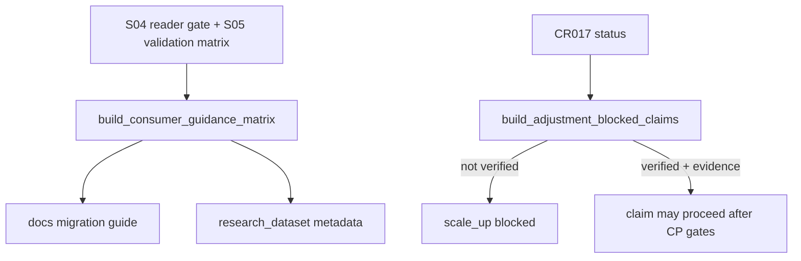

# LLD: CR017-S06 — 研究 / QMT 消费边界与迁移指南

本文档只定义 CR017-S06 的消费边界、文档迁移和 blocked claims 设计；CP5 统一确认前不得实现文档或代码改动，不授权真实运行。

## 1. Goal

修改 `docs/ADJUSTMENT-POLICY-MIGRATION.md`、`README.md`、`docs/USER-MANUAL.md`、`engine/research_dataset.py` 并创建 `tests/test_cr017_research_qmt_consumer_boundary.py` 的实现蓝图，使 chart、长期研究、因子研究、QMT order intent 的复权消费矩阵和 scale_up blocked claim 可验证。

## 2. Requirements（Functional / Non-Functional）

### 2.1 Functional

- 覆盖 REQ-101、REQ-102、REQ-103、REQ-118、REQ-119、REQ-120、REQ-121。
- consumer guidance 至少覆盖 chart、long-horizon research、factor research、QMT order intent 4 类消费方。
- QMT execution 非 raw allowed 次数为 0。
- CR017 未 verified 时 production adjustment governance claim 和 scale_up allowed 次数均为 0。

### 2.2 Non-Functional

- 不修改 CP3 过程文档、HLD、ADR、需求或场景。
- 文档不得声明真实 VWAP/minute/tick/level2/order-match/microstructure impact cost 已支持。
- 不读取凭据、不执行真实 QMT API、不发单、不写湖、不发布 pointer。

## 3. 模块拆分与职责

| 模块 / 文件组 | 职责 | 说明 |
|---|---|---|
| `docs/ADJUSTMENT-POLICY-MIGRATION.md` | 补充 consumer guidance、迁移步骤、旧 qfq 保留、QMT raw-only 边界 | S06 primary，S01 已创建基础 |
| `README.md`、`docs/USER-MANUAL.md` | 写用户可见的研究口径与 QMT 执行价边界 | shared；需与 CR015/CR016 文档串行 |
| `engine/research_dataset.py` | 输出 `adjustment_governance_status`、`blocked_claims` 或消费矩阵 helper | shared |
| `tests/test_cr017_research_qmt_consumer_boundary.py` | 验证 consumer matrix、blocked claims、raw-only 文档合同 | 离线 |

## 4. 代码结构与文件影响范围

| 动作 | 文件路径 | 变更内容 |
|---|---|---|
| 修改 | `docs/ADJUSTMENT-POLICY-MIGRATION.md` | 增加研究 / QMT 消费矩阵、迁移步骤、禁止覆盖和 scale_up blocked claim |
| 修改 | `README.md` | 增加用户入口层面的复权口径与 raw execution 说明 |
| 修改 | `docs/USER-MANUAL.md` | 增加操作手册中的 policy 选择、blocked claims 和故障排查 |
| 修改 | `engine/research_dataset.py` | 增加 consumer boundary metadata / blocked claims helper |
| 创建 | `tests/test_cr017_research_qmt_consumer_boundary.py` | 固化文档片段和 metadata contract tests |

## 5. 数据模型与持久化设计

| 对象 / 字段 | 类型 | 约束 | 说明 |
|---|---|---|---|
| `ConsumerGuidance` | dataclass / typed dict | `consumer_type`、`recommended_policy`、`allowed_policies`、`blocked_policies`、`reason` 必填 | 文档与测试共用 |
| `BlockedClaim` | dataclass / typed dict | `claim_id`、`blocked_reason`、`release_condition`、`evidence_required` 必填 | stage gate / docs |
| `AdjustmentGovernanceStatus` | dataclass / typed dict | `cr017_verified`、`allowed_claims`、`blocked_claims` | CR016 scale_up gate 输入 |

无新增持久化；只输出文档和 metadata contract。

## 6. API / Interface 设计

| 接口 / 入口 | 输入 | 输出 | 调用方 | 说明 |
|---|---|---|---|---|
| `build_consumer_guidance_matrix()` | 无或 policy config | consumer matrix | docs、tests | 覆盖 4 类消费方 |
| `build_adjustment_blocked_claims(cr017_status, stage)` | CR017 状态、stage | blocked claims | CR016 stage gate、docs | 未 verified 时 scale_up blocked |
| `render_migration_guide_sections()` | migration summary、consumer matrix | markdown sections | docs tests | 不输出敏感信息 |
| `research_dataset_policy_metadata()` | research dataset config | metadata | reports / QMT handoff | 包含 research 与 execution policy |

## 7. 核心处理流程

异常路径：CR017 未 verified、consumer unknown、QMT execution 非 raw、文档声明 unsupported feature 已支持时返回 blocked 或测试失败。

## 8. 技术设计细节

- 关键规则：chart 可用 qfq；long-horizon research 推荐 hfq 或 returns_adjusted；factor research 推荐 returns_adjusted；QMT order intent 只能 raw execution + research metadata。
- 依赖复用：消费 S04 reader metadata 和 S05 leakage/quality reason，不重新定义 raw/factor/derived schema。
- 兼容性处理：旧 qfq 保留，迁移指南只说明关系和步骤，不覆盖旧报告。
- 图示类型选择：流程图，因涉及文档、metadata 和 stage blocked claims。

## 9. 安全与性能设计

| 维度 | 设计措施 | 验证方式 |
|---|---|---|
| 安全 | 不读凭据、不真实 QMT、不发单；文档不暴露真实账户或私有路径 | docs tests 和 operation counters |
| 声明边界 | CR017 未 verified 时阻断 production adjustment governance 和 scale_up | blocked claim tests |
| 性能 | 文档和 metadata helper 常量级 | 单测 fixture |

## 10. 测试设计

| 测试场景 | 前置条件 | 操作 | 预期结果 | 验证方式 |
|---|---|---|---|---|
| consumer matrix 完整 | 无 | build matrix | 覆盖 4 类消费方 | `test_consumer_guidance_covers_four_consumers` |
| QMT raw-only | qmt order intent consumer | build matrix / metadata | 非 raw allowed=0 | `test_qmt_execution_non_raw_is_blocked` |
| CR017 未 verified scale_up blocked | status not verified | build blocked claims | scale_up blocked | `test_scale_up_blocked_until_cr017_verified` |
| 文档声明边界 | rendered docs fixture | scan snippets | 不声明 unsupported execution feature | `test_docs_do_not_claim_unsupported_execution_features` |
| 旧 qfq 保留 | migration guide sections | render | 包含 legacy preserved / no overwrite | `test_migration_guide_preserves_legacy_qfq` |

## 11. 实施步骤

| TASK-ID | 动作 | 目标文件 | 详细描述 | 对应测试 |
|---|---|---|---|---|
| CR017-S06-T1 | 修改 | `docs/ADJUSTMENT-POLICY-MIGRATION.md` | 补充 consumer matrix、迁移步骤和 blocked claims | migration / docs tests |
| CR017-S06-T2 | 修改 | `README.md` | 增加简明复权口径和 QMT raw execution 边界 | docs scan tests |
| CR017-S06-T3 | 修改 | `docs/USER-MANUAL.md` | 增加用户选择 policy、故障排查和禁止声明 | docs scan tests |
| CR017-S06-T4 | 修改 | `engine/research_dataset.py` | 增加 policy metadata / blocked claims helper | metadata tests |
| CR017-S06-T5 | 创建 | `tests/test_cr017_research_qmt_consumer_boundary.py` | 固化 consumer / docs / scale_up blocked tests | 全部 S06 tests |

## 12. 风险、难点与预研建议

| 风险 / 难点 | 影响 | 缓解措施 / 预研建议 |
|---|---|---|
| 文档过早声明生产治理完成 | 用户误判可资金放大 | CR017 未 verified 时 blocked claims 固定输出 |
| 与 CR015/CR016 文档共享冲突 | README / USER-MANUAL 覆盖 | CP5 后按 merge_owner 串行合并 |
| QMT 技术模拟盘与生产声明混淆 | 阶段 gate 失真 | 明确技术 simulation 可独立验证，scale_up 仍 blocked |

### OPEN / Spike 跟踪

| ID | 类型（OPEN / Spike） | 问题 | 下一动作 | 责任方 |
|---|---|---|---|---|
| 无 | N/A | 无阻断 OPEN；CR016 scale_up 仍需后续独立 gate | 等待 CR017 实现验证和 CR016 CP gates | meta-po |

## 13. 回滚与发布策略

- 发布方式：CP5 approved 后提交文档和 metadata helper；不改变真实交易状态。
- 回滚触发条件：QMT non-raw allowed、CR017 未 verified 仍允许 scale_up、文档声明 unsupported feature。
- 回滚动作：撤回 README / USER-MANUAL / migration guide 增量和 research_dataset helper，保留 S04/S05 合同。

## 14. Definition of Done

- [x] 14 个章节全部填写完成。
- [x] 文件影响范围、接口、测试与实施步骤可直接指导编码。
- [x] `confirmed=false`、`implementation_allowed=false` 时不进入实现。
- [x] CP5 前真实操作计数均为 0。
- [x] frontmatter 已填写 `tier=M`。
- [x] OPEN / Spike 已清点，当前无阻断项。
- [ ] 等待全部目标 Story 的 LLD 与 CP5 自动预检汇总后统一人工确认。

## 人工确认区

本 LLD 等待 `checkpoints/CP5-CR015-CR016-CR017-ALL-STORIES-LLD-BATCH.md` 统一确认；确认前不得实现。

**CP5 checklist 摘要**：

| # | 检查项 | 状态 | 证据 |
|---|---|---|---|
| 1 | LLD 覆盖 AC | 待检查 | 第 2 / 10 / 14 节 |
| 2 | 与 HLD / ADR 一致 | 待检查 | 第 3 / 8 / 12 节 |
| 3 | 文件影响范围明确 | 待检查 | 第 4 / 11 节 |
| 4 | 接口契约完整 | 待检查 | 第 6 节 |
| 5 | 测试与 dev_gate 可计算 | 待检查 | 第 10 / 14 节 |
