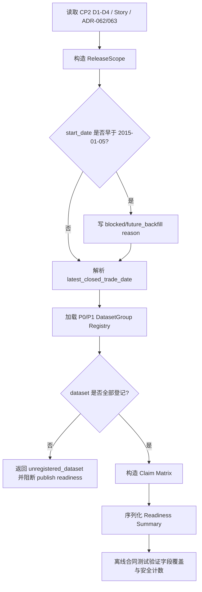

# LLD: CR018-S01 - production current truth 定义与 dataset group

> 本文档是 CR018-S01 的低层设计，已通过 CP5 全量 LLD 统一确认的实现蓝图。当前 `confirmed=true`，仅允许受控离线 / fixture / dry-run 实现；不得抓取 provider、写真实 lake、publish current pointer、读取凭据或执行 QMT 操作。

## 1. Goal

创建 production current truth scoped release 与 dataset group 合同的实现蓝图：未来实现阶段创建 `market_data/release_scope.py`、`market_data/dataset_groups.py`，并按明确范围更新 catalog / 文档入口，使 CR018 第一版 release 固定为 `2015-01-05..latest_closed_trade_date` scoped release，P0/P1 dataset group、allowed/blocked claims 和 readiness summary 字段可被后续 S02/S03/S05/S06/S08/S09 消费。

## 2. Requirements（Functional / Non-Functional）

### 2.1 Functional

- 覆盖 ADR-062：第一版 production current truth 只允许声明 `2015-01-05..latest_closed_trade_date` scoped release；2015 年前 since-inception 声明必须输出 `blocked/future_backfill`。
- 覆盖 ADR-063：定义 P0 dataset group、P1 auxiliary group、`required_for_publish`、claim impact 和 blocked claim reason code。
- 固化 release claim matrix：P0 缺失阻断 core release；P1 缺失不阻断 core release，但阻断行业中性、市值中性、纯 alpha、容量可交易、scale_up ready 和资金放大声明。
- 定义 readiness summary schema，必须覆盖 `release_id`、`release_scope`、`as_of_trade_date`、calendar source、dataset group matrix、allowed claims、blocked claims 和 permission counters。
- 未登记 dataset 进入 publish readiness 的通过次数必须为 0。

### 2.2 Non-Functional

- 安全：本 Story 和未来默认验证路径中 `provider_fetch`、`lake_write`、`credential_read`、`current_pointer_publish`、`qmt_operation` 计数均为 0。
- 可追溯：所有 release scope、dataset group、claim matrix 字段必须能追溯到 Story、HLD-DATA-LAKE §19、ADR-062/063。
- 可测试：离线合同测试必须覆盖 D1-D4 字段 100%，不依赖真实 provider、真实 lake 或 `.env`。
- 可维护：dataset id、claim id 和 reason code 使用 exact 常量，不使用模糊匹配。
- 向后兼容：catalog 集成只暴露注册 / 查询合同，不触发 publish，不改变现有 current pointer。

## 3. 模块拆分与职责

| 模块 / 文件组 | 职责 | 说明 |
|---|---|---|
| Release Scope Resolver / `market_data/release_scope.py` | 定义 `ReleaseScope`、scope 解析、latest closed trade date 输入校验和 2015 前 blocked reason | 消费 ADR-062；不读取真实 lake 或 provider |
| Dataset Group Registry / `market_data/dataset_groups.py` | 定义 P0/P1 dataset group、required layer、claim impact 和 blocked claims | 消费 ADR-063；为 S02/S03/S05/S06 提供合同 |
| Claim Matrix Builder / `market_data/dataset_groups.py` | 根据 readiness status 和 P1 availability 生成 allowed / blocked claims | P1 缺失必须结构化阻断对应声明 |
| Catalog Contract Hook / `market_data/catalog.py` | 未来实现阶段仅增加 release scope / dataset group 元数据注册入口或 typed metadata 字段 | 共享文件；不得更新 current pointer |
| Documentation Surface / `README.md`、`docs/USER-MANUAL.md` | 未来实现阶段说明 scoped release、P0/P1 group 与 blocked claims | 共享文件；只写合同说明，不写运行结果 |
| Test Contract / `tests/test_cr018_release_scope_dataset_groups.py` | 验证 release scope、dataset group、claim matrix 和安全计数 | fixture-only；不联网、不读凭据、不写 lake |

## 4. 代码结构与文件影响范围

| 动作 | 文件路径 | 变更内容 |
|---|---|---|
| 创建 | `market_data/release_scope.py` | 定义 scoped release 数据结构、resolver、pre-2015 blocked reason 和 permission counter 只读合同 |
| 创建 | `market_data/dataset_groups.py` | 定义 P0/P1 dataset registry、claim matrix、reason codes 和 readiness summary schema |
| 修改 | `market_data/catalog.py` | 增加 release scope / dataset group 元数据只读注册或序列化支持；不得 publish current pointer |
| 修改 | `README.md` | 增加 CR018 scoped release 与 dataset group 的用户可见限制说明 |
| 修改 | `docs/USER-MANUAL.md` | 增加 production current truth、2015 前 blocked 和 P1 blocked claims 的使用说明 |
| 创建 | `tests/test_cr018_release_scope_dataset_groups.py` | 新增离线合同测试，覆盖 D1-D4、未登记 dataset、安全计数 |

## 5. 数据模型与持久化设计

| 对象 / 字段 | 类型 | 约束 | 说明 |
|---|---|---|---|
| `ReleaseScope.release_id` | string | 必填；由后续 publish Story 传入或生成 | S01 只定义字段，不 publish |
| `ReleaseScope.start_date` | date string | 固定为 `2015-01-05` | ADR-062 scoped release 下限 |
| `ReleaseScope.end_date` | date string | 等于 `latest_closed_trade_date` | 由 trade calendar 输入计算或显式传入 |
| `ReleaseScope.as_of_trade_date` | date string | 必填；不得晚于 latest closed open trading day | readiness summary 输出字段 |
| `ReleaseScope.pre_2015_status` | enum | `blocked/future_backfill` | 2015 年前 since-inception claim 必须阻断 |
| `DatasetGroupEntry.dataset_id` | string | exact id；未登记不得进入 readiness | P0/P1 registry 主键 |
| `DatasetGroupEntry.priority` | enum | `P0` / `P1` | P0 阻断 release；P1 阻断指定 claims |
| `DatasetGroupEntry.required_for_publish` | boolean | P0 为 true；P1 为 false | 用于 publish readiness |
| `DatasetGroupEntry.required_layers` | list[string] | raw / manifest / canonical / gold_or_view / quality / catalog 的子集 | 允许 view 类数据用 `gold_or_view` 表示 |
| `ClaimMatrixEntry.claim_id` | string | exact id | 如 `production_current_truth`、`neutralized_alpha`、`capacity_scale_up_ready` |
| `ClaimMatrixEntry.blocked_reason_code` | string | 必填 | 如 `pre_2015_future_backfill`、`p1_auxiliary_missing`、`p0_required_missing` |
| `ReadinessSummary.permission_counters` | map[string,int] | 默认均为 0 | provider/lake/credential/publish/QMT 操作计数 |

持久化设计：本 Story 未来实现仅创建 Python 合同模块和测试，不新增数据库，不写真实 lake，不写 current pointer。catalog 文件只增加元数据结构支持或只读注册入口，实际 publish 由 CR018-S07 另行设计。

## 6. API / Interface 设计

| 接口 / 入口 | 输入 | 输出 | 调用方 | 说明 |
|---|---|---|---|---|
| `resolve_release_scope` | `release_id`、`start_date`、`end_date`、`latest_closed_trade_date`、`calendar_source` | `ReleaseScopeResult`，含 scope、blocked pre-2015 flag、coverage denominator policy | S01 tests、S06 readiness、S07 publish、S08 rerun | 输入包含 2015 前 since-inception claim 时输出 blocked reason，不抛裸异常 |
| `list_dataset_groups` | `priority: P0|P1|None` | `DatasetGroupEntry` 列表 | S02/S03/S04/S05/S06 | 未知 priority 返回 structured error 或空集，不自动推断 |
| `get_dataset_group_entry` | `dataset_id` | `DatasetGroupEntry` 或 `unregistered_dataset` error | publish readiness、tests | 未登记 dataset 不得进入 publish readiness |
| `build_release_claim_matrix` | P0/P1 readiness status、P1 availability | `ClaimMatrixResult`，含 `allowed_claims`、`blocked_claims`、reason codes | S06/S08/S09、docs | P1 缺失只阻断对应声明，P0 缺失阻断 core release |
| `serialize_release_readiness_summary` | `ReleaseScopeResult`、dataset matrix、claim matrix、permission counters | dict / JSON-ready metadata | catalog / docs / tests | 不写文件、不 publish，只返回结构化对象 |

错误模型：`invalid_release_scope`、`pre_2015_claim_blocked`、`calendar_source_missing`、`unregistered_dataset`、`p0_required_missing`、`claim_matrix_incomplete`。第 10 节必须覆盖每类错误路径。

## 7. 核心处理流程

1. 读取 Story 卡片、HLD-DATA-LAKE §19.1/§19.3、ADR-062/063 中的 scope 和 dataset group 决策。
2. 生成 `ReleaseScope`，固定 start date，下游传入 latest closed trade date，2015 前 claim 一律 blocked。
3. 加载 P0/P1 registry，使用 exact dataset id 校验；未登记 dataset 直接阻断 readiness。
4. 根据 P0/P1 readiness 构建 allowed / blocked claims。
5. 输出 JSON-ready readiness summary 结构供 S06/S07/S08 消费。
6. 执行 fixture-only 合同测试，确认真实操作计数均为 0。

## 8. 技术设计细节

- 关键规则：candidate、validate PASS、parity PASS 均不等于 published current truth；S01 只定义 release 和 dataset 合同。
- `latest_closed_trade_date` 不硬编码为 `2026-05-28`；该日期只是 CR014 S14 candidate 事实，未来实现必须从输入 trade calendar / release context 计算或显式传入。
- P0 registry 至少包含 `prices_raw`、`adj_factor`、`prices_qfq`、`prices_hfq`、`returns_adjusted`、`trade_calendar`、`pit_universe`、`lifecycle_code_change`、`trade_status`、`prices_limit_st_suspend`、`benchmark_group`。
- P1 registry 至少包含 `industry_classification`、`market_cap_total`、`market_cap_float`、`beta_style_factors`、`adv`、`turnover_rate`、`liquidity_capacity`、`market_impact_cost`。
- Benchmark group 的四类指数明细由 CR018-S03 冻结；S01 只把 benchmark group 作为 P0 聚合合同纳入 claim matrix。
- Catalog 集成不得调用 publish；允许增加纯数据结构、序列化 helper 或 metadata adapter。
- 依赖选择：优先使用标准库 `dataclasses` / `typing` / `datetime`；不得新增依赖，不改 `pyproject.toml` / `uv.lock`。
- 兼容性处理：若现有 catalog metadata 无 release scope 字段，新增字段必须默认缺失时返回 `catalog_not_published` 或 `required_missing`，不得默认为 current truth。
- 图示类型选择：流程图；原因是存在 scope、dataset registry、claim matrix 和错误分支。

## 9. 安全与性能设计

| 维度 | 设计措施 | 验证方式 |
|---|---|---|
| 安全 | 不读取 `.env`、不导入 provider connector、不访问真实 lake、不写 current pointer、不执行 QMT | 测试断言 permission counters 全为 0；import scan 不出现 connector/runtime 调用 |
| 安全 | 2015 前 since-inception claim 必须 blocked | 单测构造 2014 start date 或 since-inception claim，断言 `pre_2015_claim_blocked` |
| 安全 | 未登记 dataset 阻断 publish readiness | 单测传入未知 dataset，断言 `unregistered_dataset` |
| 性能 | registry 为常量级列表 / dict，O(n) 处理 dataset group | fixture-only 单测，目标运行小于 1 秒 |
| 可追溯 | readiness summary 输出 source refs、release_id、scope、claim reason | snapshot / 字段断言 |

## 10. 测试设计

| 测试场景 | 前置条件 | 操作 | 预期结果 | 验证方式 |
|---|---|---|---|---|
| release scope 覆盖 D1 | 输入 `release_id`、`2015-01-05`、latest closed trade date | 调用 `resolve_release_scope` | 输出 scope、as_of_trade_date、calendar source | `tests/test_cr018_release_scope_dataset_groups.py` |
| 2015 前声明 blocked | 输入 since-inception / 2014 起始声明 | 调用 `resolve_release_scope` | `pre_2015_status=blocked/future_backfill`，allowed 次数 0 | pytest 字段断言 |
| P0/P1 group 完整 | 加载 registry | 调用 `list_dataset_groups` | P0/P1 exact dataset id 覆盖 Story 和 ADR-063 | pytest set equality |
| P1 缺失只阻断指定 claims | 构造 P0 pass、P1 missing | 调用 `build_release_claim_matrix` | core release claim 可按 P0 状态判定；neutralized/capacity/scale_up claims blocked | pytest blocked claims 断言 |
| 未登记 dataset 阻断 | 传入未知 dataset | 调用 `get_dataset_group_entry` 或 readiness serializer | 返回 `unregistered_dataset`，publish readiness 通过次数 0 | pytest error assertion |
| 禁止真实操作 | 默认测试上下文 | 读取 counters / monkeypatch forbidden calls | provider/lake/credential/publish/QMT 计数均为 0 | pytest counters + monkeypatch |

## 11. 实施步骤

| TASK-ID | 动作 | 目标文件 | 详细描述 | 对应测试 |
|---|---|---|---|---|
| CR018-S01-T1 | 创建 | `market_data/release_scope.py` | 定义 `ReleaseScope`、resolver、pre-2015 blocked reason 和 permission counter snapshot | release scope 覆盖 D1；2015 前声明 blocked；禁止真实操作 |
| CR018-S01-T2 | 创建 | `market_data/dataset_groups.py` | 定义 P0/P1 dataset registry、claim matrix、reason code 和 summary serializer | P0/P1 group 完整；P1 缺失只阻断指定 claims；未登记 dataset 阻断 |
| CR018-S01-T3 | 创建 | `tests/test_cr018_release_scope_dataset_groups.py` | 编写 fixture-only 合同测试，覆盖 D1-D4 和安全计数 | 全部 S01 测试场景 |
| CR018-S01-T4 | 修改 | `market_data/catalog.py` | 增加 release scope / dataset group 元数据结构支持，不触发 publish | 未登记 dataset 阻断；禁止真实操作 |
| CR018-S01-T5 | 修改 | `README.md`、`docs/USER-MANUAL.md` | 说明 scoped release、P0/P1 group、2015 前 blocked 和 P1 blocked claims | 文档字段可由测试或 review 检查 |

## 12. 风险、难点与预研建议

### 12.1 实现灰区与取舍记录

| Clarification ID | 问题 | 选项与推荐 | 决策 / 答案 | 影响面 | 证据 | 重访条件 |
|---|---|---|---|---|---|---|
| 无 | 当前 S01 LLD 未发现阻断性实现灰区 | 推荐按 CP2 D1-D4、ADR-062/063 和 Story 合同实现；备选为后续 CR 调整 scope 或 P1 升 P0 | 默认决策已由 CP2/Story/HLD 固化，CP5 approve 即接受本 LLD | 接口 / 文件 owner / 测试 / 文档 / 跨 Story 契约 | `process/HLD-DATA-LAKE.md` §19.1-§19.4、ADR-062/063、Story 卡片 | 用户在 CP5 要求修改 scope、dataset group 或 claim boundary |

| 风险 / 难点 | 影响 | 缓解措施 / 预研建议 |
|---|---|---|
| 把 CR014 S14 candidate 误称 production current truth | 研究和 QMT 可能误用未发布数据 | `ReleaseScope` 与 summary 明确 candidate unpublished；publish 由 S07 处理 |
| `latest_closed_trade_date` 被硬编码 | 后续 release 日期漂移 | resolver 要求显式输入或从 trade calendar 计算，测试禁止固定成单一日期 |
| P1 缺失被忽略 | 中性化、容量、scale_up 声明失真 | Claim matrix 必须输出 blocked claims 和 reason code |
| Benchmark group 明细与 S03 重复定义 | 跨 Story 契约漂移 | S01 只定义 P0 聚合占位，四类 benchmark readiness 由 S03 拥有 |
| Catalog hook 被误实现为 publish | current pointer 被提前更新 | 文件影响范围和测试明确 `current_pointer_publish=0` |

### OPEN / Spike 跟踪

| ID | 类型（OPEN / Spike） | 问题 | 下一动作 | 责任方 |
|---|---|---|---|---|
| 无 | OPEN | 无阻断性 OPEN；CP5 全量确认前不得实现 | 等待 meta-po 汇总 CR018-S01..S09 LLD 和 CP5 自动预检 | meta-po / user |

## 13. 回滚与发布策略

- 发布方式：本 LLD 通过 CP5 全量人工确认后，S01 才可进入实现；实现只发布代码合同和文档说明，不 publish current pointer。
- 回滚触发条件：测试发现 2015 前 allowed claim 非 0、未登记 dataset 可进入 readiness、permission counter 非 0、catalog hook 触发 publish、P1 缺失未进入 blocked claims。
- 回滚动作：回退 S01 未来实现中 `market_data/release_scope.py`、`market_data/dataset_groups.py`、`market_data/catalog.py`、文档和测试变更；不得删除 raw、manifest、candidate、quality evidence 或历史 release summary。

## 14. Definition of Done

- [ ] 14 个章节全部填写完成。
- [ ] LLD frontmatter 保持 `confirmed=true`，CP5 已获批，仍需遵守 Story DAG、文件 owner 和真实操作授权边界。
- [ ] release scope 固定覆盖 `2015-01-05..latest_closed_trade_date`，2015 前 since-inception allowed claim 次数为 0。
- [ ] P0/P1 dataset group、claim matrix、readiness summary 字段覆盖 D1-D4 为 100%。
- [ ] 接口设计中的每个入口均在第 10 节有对应测试场景。
- [ ] 异常路径 `invalid_release_scope`、`pre_2015_claim_blocked`、`unregistered_dataset`、`p0_required_missing` 均有测试入口。
- [ ] `provider_fetch`、`lake_write`、`credential_read`、`current_pointer_publish`、`qmt_operation` 计数均为 0。
- [ ] OPEN / Spike 已清点；无阻断项；CP5 已 approved。

## 人工确认区

> CP5 自动预检结果：`process/checks/CP5-CR018-S01-production-current-truth-definition-and-dataset-groups-LLD-IMPLEMENTABILITY.md`
> CP5 批次人工审查稿：`checkpoints/CP5-CR018-PRODUCTION-DATA-LAKE-CLOSURE-BATCH-A-LLD-BATCH.md`

**人工审查结果回填**：

- 结论：`approved`
- 审查人：user
- 审查时间：2026-05-29T08:25:12+08:00
- 修改意见：无；用户已同意 CP5 批次。
- 风险接受项：只允许离线 / fixture / dry-run 实现；真实抓取、写湖、publish、凭据读取和 QMT 仍 blocked。
