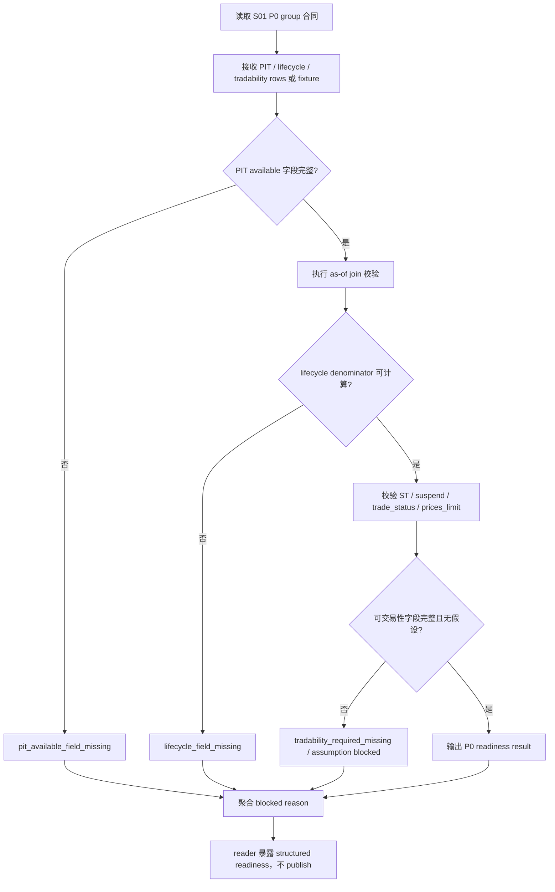

# LLD: CR018-S02 - PIT / lifecycle / ST / suspend / trade_status / prices_limit readiness

> 本文档是 CR018-S02 的低层设计，已通过 CP5 全量 LLD 统一确认的实现蓝图。当前 `confirmed=true`，仅允许受控离线 / fixture / dry-run 实现；不得抓取 provider、写真实 lake、publish current pointer、读取凭据或执行 QMT 操作。

## 1. Goal

修改 market data 合同、校验和 reader 暴露层的实现蓝图：未来实现阶段把 PIT universe、上市 / 退市生命周期、代码变更、ST、停牌、交易状态和涨跌停 readiness 纳入 production publish gate，缺 PIT 可得性字段、生命周期字段或可交易性字段时 fail closed，防止当前快照、幸存者偏差或假可交易假设进入 CR018 production current truth。

## 2. Requirements（Functional / Non-Functional）

### 2.1 Functional

- 覆盖 ADR-063：PIT universe / lifecycle / code-change、`trade_status`、`prices_limit` / ST / suspend 均属于 P0 dataset group，缺失时 release status 必须 blocked。
- `PIT readiness validator` 必须检查 `available_date`、`effective_date`、`available_at` 或等价字段；缺可得性字段时 publish allowed 次数为 0。
- `lifecycle validator` 必须检查 `list_date`、`delist_date`、code change mapping、as-of active universe denominator；不得包含当时不存在或已退市证券。
- `tradability readiness validator` 必须检查 ST、停牌、交易状态、涨跌停字段；不得假设涨停可买或跌停可卖。
- reader 层只能暴露 published / fixture readiness 的 structured blocked reason；不得扫描未发布 lake，不得触发 provider backfill。

### 2.2 Non-Functional

- 安全：默认实现和验证中 provider fetch、lake write、credential read、current pointer publish 计数均为 0。
- 可追溯：每个 blocked reason 必须带 dataset id、field、reason code、evidence path 或 fixture source。
- 可测试：测试只使用 fixture-only 合同数据，覆盖 PIT、lifecycle、ST、停牌、涨跌停和交易状态缺失场景。
- 可维护：validation 输出必须与 S01 dataset group / claim matrix 可组合，供 S06 聚合 readiness。
- 并发边界：本 Story 涉及 `market_data/contracts.py`、`market_data/validation.py`、`market_data/readers.py` 共享文件，CP5 后默认串行开发或由 meta-po 指定合并顺序。

## 3. 模块拆分与职责

| 模块 / 文件组 | 职责 | 说明 |
|---|---|---|
| Readiness Contracts / `market_data/contracts.py` | 增加 PIT、lifecycle、tradability readiness 数据结构、reason code 和 status enum | 共享文件；与 S03/S05/S06 需串行合并 |
| Validation Gate / `market_data/validation.py` | 实现 fail-closed PIT / lifecycle / tradability 校验函数 | 不读取 provider，不写 lake，只校验传入 rows / fixture |
| Reader Exposure / `market_data/readers.py` | 暴露 structured blocked reason 和 published-only readiness 查询入口 | 不扫描未发布 lake，不自动补数 |
| Test Contract / `tests/test_cr018_pit_tradability_readiness.py` | 覆盖 PIT available 字段、当前快照替代、ST/停牌/涨跌停和生命周期缺失 | fixture-only；不读凭据、不联网 |

## 4. 代码结构与文件影响范围

| 动作 | 文件路径 | 变更内容 |
|---|---|---|
| 修改 | `market_data/contracts.py` | 增加 `PitReadinessResult`、`LifecycleReadinessResult`、`TradabilityReadinessResult`、reason code 和 P0 readiness schema |
| 修改 | `market_data/validation.py` | 增加 PIT as-of、lifecycle active denominator、ST/suspend/trade_status/prices_limit fail-closed 校验 |
| 修改 | `market_data/readers.py` | 增加 readiness result 暴露入口和 blocked reason 输出；不扫描未发布 lake |
| 创建 | `tests/test_cr018_pit_tradability_readiness.py` | 新增 fixture-only 合同测试，覆盖 Story 验收标准 |

## 5. 数据模型与持久化设计

| 对象 / 字段 | 类型 | 约束 | 说明 |
|---|---|---|---|
| `PitReadinessResult.dataset_id` | string | 必填；P0 dataset exact id | 对应 S01 P0 group |
| `PitReadinessResult.pit_status` | enum | `pass` / `required_missing` / `failed` / `blocked` | 缺 available 字段必须非 pass |
| `PitReadinessResult.available_fields` | list[string] | 必须覆盖 `effective_date` 与 `available_at` 或等价字段 | 支撑 as-of join |
| `PitReadinessResult.as_of_join_violation_count` | int | 必须为 0 才能 pass | Story AC 要求 |
| `PitReadinessResult.current_snapshot_used` | bool | production_strict 必须为 false | 当前快照不得替代历史 PIT |
| `LifecycleReadinessResult.active_denominator` | int | 非负；由 list/delist/code-change as-of 计算 | 缺生命周期字段时 required_missing |
| `LifecycleReadinessResult.missing_lifecycle_fields` | list[string] | 缺失时不得 pass | 包含 list_date、delist_date、code_change 等 |
| `TradabilityReadinessResult.trade_status_ready` | bool | P0 required | 缺失阻断 publish |
| `TradabilityReadinessResult.prices_limit_ready` | bool | P0 required | 缺涨跌停信息阻断可交易声明 |
| `TradabilityReadinessResult.st_suspend_ready` | bool | P0 required | 缺 ST / suspend flag 阻断 |
| `ReadinessIssue.reason_code` | string | 必填 exact code | 如 `pit_available_field_missing`、`current_snapshot_not_pit`、`limit_trade_assumption_blocked` |

持久化设计：本 Story 不新增数据库、不写真实 lake。未来实现只修改 Python 合同 / 校验 / reader 模块和测试；reader 返回结构化结果，不写 publish current pointer。

## 6. API / Interface 设计

| 接口 / 入口 | 输入 | 输出 | 调用方 | 说明 |
|---|---|---|---|---|
| `validate_pit_universe_readiness` | universe rows、calendar rows、`available_field_policy` | `PitReadinessResult` | S02 tests、S06 readiness、S08 research rerun | 缺 `available_at` / `effective_date` / `available_date` 时 fail closed |
| `validate_lifecycle_readiness` | lifecycle rows、code-change rows、as-of trade dates | `LifecycleReadinessResult` | S02 tests、S06 readiness | 缺 list/delist/code-change 或 active denominator 不可算时 blocked |
| `validate_tradability_readiness` | trade_status rows、prices_limit rows、ST / suspend flags、policy | `TradabilityReadinessResult` | S02 tests、S06 readiness、research builder | 不得假设涨停可买或跌停可卖 |
| `read_pit_tradability_readiness` | release_id、dataset group、published_only flag | aggregate readiness + blocked reasons | readers / S06 / S08 | 默认 `published_only=true`；缺 publish 返回 structured missing，不扫描 candidate |
| `format_readiness_blocked_reason` | readiness result / issue list | serializable reason dict | docs / reports / tests | 输出 dataset、field、reason_code、severity、claim impact |

错误模型：`pit_available_field_missing`、`as_of_join_violation`、`current_snapshot_not_pit`、`lifecycle_field_missing`、`inactive_security_in_denominator`、`trade_status_required_missing`、`prices_limit_required_missing`、`st_suspend_required_missing`、`unpublished_readiness_source`。第 10 节必须覆盖错误路径。

## 7. 核心处理流程

1. 消费 S01 dataset group 合同，确认本 Story 校验对象均为 P0。
2. 对传入 PIT universe rows 检查 effective / available 字段，缺失时直接 required_missing。
3. 对 lifecycle rows 计算 as-of active universe denominator，缺 list/delist/code-change 时 blocked。
4. 对 ST、停牌、交易状态、涨跌停字段执行 fail-closed 校验。
5. reader 只返回 readiness result 和 blocked reasons，不扫描 candidate lake，不触发 backfill。
6. 测试断言 as-of join 违规计数为 0，真实操作计数为 0。

## 8. 技术设计细节

- 关键规则：`quality_status=pass` 不等于 PIT / tradability available；PIT 与 tradability 必须分别输出 status。
- 当前快照不能证明历史 PIT；若输入含 `snapshot_date` 但缺 as-of effective / available 字段，production_strict 必须 blocked。
- `index_weights` 不能替代完整 membership；若仅有权重数据而无 membership readiness，PIT universe status 必须 required_missing。
- 涨跌停规则必须 fail closed：缺 `upper_limit` / `lower_limit` 或 trade status 时，不得默认可买 / 可卖。
- ST / suspend 缺失时不得把价格存在解释为可交易。
- Reader 默认 `published_only=true`；测试可注入 fixture rows，但不得读取真实 lake 或未发布 candidate path。
- 依赖选择：复用现有 `contracts.py`、`validation.py`、`readers.py` 风格；不得新增依赖，不改 `pyproject.toml` / `uv.lock`。
- 兼容性处理：旧调用方若未请求 CR018 readiness，应保持原行为；生产口径调用必须显式检查 readiness status。
- 图示类型选择：流程图；原因是 PIT、lifecycle、tradability 三条校验分支和 blocked reason 汇聚。

## 9. 安全与性能设计

| 维度 | 设计措施 | 验证方式 |
|---|---|---|
| 安全 | 禁止导入 `market_data.connectors/**`、`market_data.runtime`，不读取 `.env`、不联网、不写 lake | import scan / monkeypatch / permission counter 断言 |
| 安全 | reader 不扫描未发布 lake；缺 publish 返回 `unpublished_readiness_source` | fixture 测试 `published_only=true` 缺 release |
| 安全 | 可交易性缺字段 fail closed | ST/suspend/trade_status/prices_limit 缺失测试 |
| 性能 | 校验函数按输入 rows 线性扫描，支持按 dataset/date 预过滤 | fixture 单测覆盖小样本；后续 CP7 可加大样本 smoke |
| 可追溯 | blocked reason 带 dataset、field、reason code、claim impact | snapshot / 字段断言 |

## 10. 测试设计

| 测试场景 | 前置条件 | 操作 | 预期结果 | 验证方式 |
|---|---|---|---|---|
| 缺 PIT available 字段 fail | universe fixture 缺 `available_at` / `available_date` | 调用 `validate_pit_universe_readiness` | `pit_status=required_missing`，publish allowed 次数为 0 | `tests/test_cr018_pit_tradability_readiness.py` |
| 当前快照不能替代 PIT | fixture 只有 `snapshot_date` | 调用 PIT validator | reason 为 `current_snapshot_not_pit` | pytest reason code |
| as-of join 违规计数为 0 | fixture 包含可得性晚于决策日记录 | 调用 PIT validator | violation count > 0 时 fail；pass case count 为 0 | pytest numeric assertion |
| 生命周期缺失阻断 | lifecycle fixture 缺 list/delist/code-change | 调用 `validate_lifecycle_readiness` | `lifecycle_field_missing`，active denominator 不可 pass | pytest blocked reason |
| ST / suspend 缺失阻断 | fixture 缺 ST 或 suspend flag | 调用 tradability validator | readiness blocked | pytest field assertion |
| 涨跌停不可假设 | fixture 缺 limit 字段或涨停买入场景 | 调用 tradability validator | reason `limit_trade_assumption_blocked` | pytest reason code |
| reader 不扫描未发布 lake | `published_only=true` 且无 release | 调用 reader readiness 入口 | 返回 `unpublished_readiness_source`，不触发 path scan | monkeypatch path / counter |
| 禁止真实操作 | 默认验证上下文 | 读取 counters / monkeypatch forbidden calls | provider/lake/credential/publish 计数均为 0 | pytest counters |

## 11. 实施步骤

| TASK-ID | 动作 | 目标文件 | 详细描述 | 对应测试 |
|---|---|---|---|---|
| CR018-S02-T1 | 修改 | `market_data/contracts.py` | 增加 PIT / lifecycle / tradability readiness dataclass / typed result / reason codes | 缺 PIT available 字段 fail；生命周期缺失阻断；ST / suspend 缺失阻断 |
| CR018-S02-T2 | 修改 | `market_data/validation.py` | 实现 fail-closed PIT as-of、lifecycle denominator 和 tradability readiness 校验 | as-of join 违规计数为 0；涨跌停不可假设 |
| CR018-S02-T3 | 修改 | `market_data/readers.py` | 暴露 readiness blocked reason，默认 published-only，不扫描未发布 lake | reader 不扫描未发布 lake；禁止真实操作 |
| CR018-S02-T4 | 创建 | `tests/test_cr018_pit_tradability_readiness.py` | 编写 fixture-only 合同测试，覆盖 PIT、ST、停牌、涨跌停和生命周期缺失场景 | 全部 S02 测试场景 |

## 12. 风险、难点与预研建议

### 12.1 实现灰区与取舍记录

| Clarification ID | 问题 | 选项与推荐 | 决策 / 答案 | 影响面 | 证据 | 重访条件 |
|---|---|---|---|---|---|---|
| 无 | 当前 S02 LLD 未发现阻断性实现灰区 | 推荐按 ADR-063 和 Story 接口约定实现 fail-closed readiness；备选为 provider source 未确认时全部输出 required_missing | 默认决策已由 HLD / ADR / Story 固化，CP5 approve 即接受本 LLD | 接口 / 文件 owner / 测试 / 安全 / 跨 Story 契约 | `process/HLD-DATA-LAKE.md` §19.4、§19.9，ADR-063，Story 卡片 | 用户在 CP5 要求放宽 PIT / tradability P0 要求或授权真实回补 |

| 风险 / 难点 | 影响 | 缓解措施 / 预研建议 |
|---|---|---|
| shared 文件与 S03/S05/S06 冲突 | 并行开发可能覆盖 readiness schema | CP5 后默认串行开发；contracts reason code 保持 additive |
| 当前快照被误认为 PIT | 幸存者偏差污染 publish | `current_snapshot_not_pit` reason code 和测试固定 |
| 价格存在被误认为可交易 | 停牌 / ST / 涨跌停导致假成交 | tradability validator 分离价格与可交易字段 |
| reader 为了补 readiness 扫未发布 lake | 越权读取 candidate 或真实 lake | reader 默认 `published_only=true`，缺 publish 返回 structured missing |
| provider 接口未确认 | 无法真实回补 | 本 Story 只实现合同和 fail-closed 校验；真实回补需 per-run authorization |

### OPEN / Spike 跟踪

| ID | 类型（OPEN / Spike） | 问题 | 下一动作 | 责任方 |
|---|---|---|---|---|
| 无 | OPEN | 无阻断性 OPEN；CP5 全量确认前不得实现 | 等待 meta-po 汇总 CR018-S01..S09 LLD 和 CP5 自动预检 | meta-po / user |

## 13. 回滚与发布策略

- 发布方式：本 LLD 通过 CP5 全量人工确认后，S02 才可进入实现；实现只发布合同 / 校验 / reader 暴露和测试，不执行真实回补。
- 回滚触发条件：PIT 缺失时 publish allowed 非 0、当前快照通过 PIT、涨跌停 / ST / 停牌缺失仍可交易、reader 扫描未发布 lake、provider/lake/credential/publish counter 非 0。
- 回滚动作：回退 S02 对 `market_data/contracts.py`、`market_data/validation.py`、`market_data/readers.py` 和测试文件的变更；不得删除 raw、manifest、candidate、quality evidence 或 current pointer。

## 14. Definition of Done

- [ ] 14 个章节全部填写完成。
- [ ] LLD frontmatter 保持 `confirmed=true`，CP5 已获批，仍需遵守 Story DAG、文件 owner 和真实操作授权边界。
- [ ] PIT / lifecycle / tradability P0 readiness 缺失时 production publish allowed 次数为 0。
- [ ] as-of join 违规计数必须为 0；当前快照替代 PIT 的通过次数为 0。
- [ ] 接口设计中的每个入口均在第 10 节有对应测试场景。
- [ ] 异常路径 `pit_available_field_missing`、`current_snapshot_not_pit`、`lifecycle_field_missing`、`trade_status_required_missing`、`prices_limit_required_missing` 均有测试入口。
- [ ] `provider_fetch`、`lake_write`、`credential_read`、`current_pointer_publish` 计数均为 0。
- [ ] OPEN / Spike 已清点；无阻断项；CP5 已 approved。

## 人工确认区

> CP5 自动预检结果：`process/checks/CP5-CR018-S02-pit-universe-lifecycle-st-trade-status-price-limit-backfill-LLD-IMPLEMENTABILITY.md`
> CP5 批次人工审查稿：`checkpoints/CP5-CR018-PRODUCTION-DATA-LAKE-CLOSURE-BATCH-A-LLD-BATCH.md`

**人工审查结果回填**：

- 结论：`approved`
- 审查人：user
- 审查时间：2026-05-29T08:25:12+08:00
- 修改意见：无；用户已同意 CP5 批次。
- 风险接受项：只允许离线 / fixture / dry-run 实现；真实抓取、写湖、publish、凭据读取和 QMT 仍 blocked。
