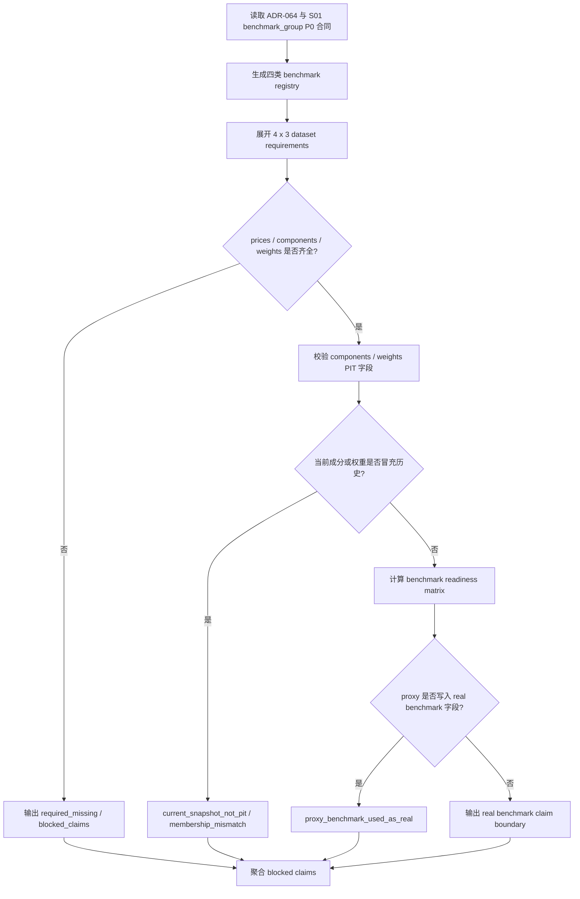

# LLD: CR018-S03 - 四类 benchmark 行情 / 成分 / 权重 readiness

> 本文档是 CR018-S03 的低层设计，已通过 CP5 全量 LLD 统一确认的实现蓝图。当前 `confirmed=true`，仅允许受控离线 / fixture / dry-run 实现；不得抓取 provider、写真实 lake、publish current pointer、读取凭据或执行 QMT 操作。

## 1. Goal

创建四类 benchmark 行情 / 历史成分 / 权重 readiness 合同的实现蓝图：未来实现阶段创建 `market_data/benchmarks.py`，并扩展 contracts / validation，使 HS300、ZZ500、ZZ1000、中证全指的 prices、components、weights 都作为 CR018 P0 readiness 被检查；缺任一类 benchmark 或任一 dataset type 时阻断真实超额收益、指数增强、tracking error 和大小盘暴露完整声明，禁止 proxy benchmark 冒充真实 benchmark。

## 2. Requirements（Functional / Non-Functional）

### 2.1 Functional

- 覆盖 ADR-064：HS300、ZZ500、ZZ1000、中证全指的行情、历史成分、权重均列为 P0 benchmark group。
- `benchmark registry` 必须列出四类 benchmark 和三类 dataset type：`prices`、`components`、`weights`。
- `component readiness` 必须检查 `effective_date`、`available_at`、symbol membership / weight 对齐，不得用当前成分回填历史。
- `benchmark claim boundary` 必须分离 proxy 与 real benchmark；proxy 字段写入 real benchmark 字段次数为 0。
- 缺任一 benchmark 或任一 dataset type 时，production excess-return / index-enhancement / tracking-error allowed claim 次数为 0。

### 2.2 Non-Functional

- 安全：默认实现和验证中 provider fetch、lake write、credential read、current pointer publish 计数均为 0。
- 可追溯：每个 benchmark readiness row 必须带 benchmark id、dataset type、coverage denominator、reason code 和 claim impact。
- 可测试：测试只使用 fixture-only 合同数据，覆盖 4 x 3 benchmark readiness matrix 和 proxy 隔离。
- 可维护：benchmark id 使用 exact symbolic id；provider-specific code 只作为字段值，不作为 LLD 阻断项。
- 并发边界：本 Story 共享 `market_data/contracts.py`、`market_data/validation.py`，CP5 后默认与 S02/S06 串行开发。

## 3. 模块拆分与职责

| 模块 / 文件组 | 职责 | 说明 |
|---|---|---|
| Benchmark Registry / `market_data/benchmarks.py` | 定义四类 benchmark、dataset type、required_for_publish 和 proxy / real boundary | 当前 Story primary 文件 |
| Benchmark Contracts / `market_data/contracts.py` | 增加 benchmark readiness row、matrix result、claim boundary 数据结构 | 共享文件；与 S02/S06 需合并顺序 |
| Benchmark Validation / `market_data/validation.py` | 校验 4 x 3 readiness matrix、coverage denominator、components / weights PIT 字段 | 不联网、不写 lake |
| Test Contract / `tests/test_cr018_benchmark_group_readiness.py` | 覆盖四类 benchmark、三类 dataset type、缺失阻断和 proxy 隔离 | fixture-only |

## 4. 代码结构与文件影响范围

| 动作 | 文件路径 | 变更内容 |
|---|---|---|
| 创建 | `market_data/benchmarks.py` | 定义 benchmark group registry、dataset type、readiness contract 和 proxy / real boundary helper |
| 修改 | `market_data/contracts.py` | 增加 benchmark readiness schema、matrix status 和 claim boundary result |
| 修改 | `market_data/validation.py` | 增加四类 benchmark 完整性、components / weights PIT 和 proxy 隔离校验 |
| 创建 | `tests/test_cr018_benchmark_group_readiness.py` | 新增 fixture-only 合同测试，覆盖 Story 验收标准 |

## 5. 数据模型与持久化设计

| 对象 / 字段 | 类型 | 约束 | 说明 |
|---|---|---|---|
| `BenchmarkDefinition.benchmark_id` | enum/string | 必须为 `HS300`、`ZZ500`、`ZZ1000`、`CSI_ALL_SHARE` 之一 | 四类宽基指数 symbolic id |
| `BenchmarkDefinition.index_code` | string | 必填；provider-specific 值由实现 registry 固化 | LLD 不触发 provider 查询 |
| `BenchmarkDatasetRequirement.dataset_type` | enum | `prices` / `components` / `weights` | 每个 benchmark 必须三类都 ready |
| `BenchmarkDatasetRequirement.required_for_publish` | boolean | 必须为 true | ADR-064 P0 |
| `BenchmarkReadinessRow.coverage_status` | enum | `pass` / `required_missing` / `quality_failed` / `blocked` | 缺任一行不得允许真实 benchmark claim |
| `BenchmarkReadinessRow.coverage_denominator` | string/int | 必填 | 通常由 trade calendar open dates 或 component effective dates 提供 |
| `BenchmarkReadinessRow.effective_date_field` | string | components / weights 必填 | 当前成分不得回填历史 |
| `BenchmarkReadinessRow.available_at_field` | string | components / weights 必填 | 支撑 PIT 可得性 |
| `BenchmarkClaimBoundary.real_benchmark_claim_allowed` | boolean | 缺任一 required row 时 false | 控制超额收益 / 指数增强声明 |
| `BenchmarkClaimBoundary.proxy_fields_used_as_real_count` | int | 必须为 0 | Story AC 要求 |

持久化设计：本 Story 不新增数据库、不写真实 lake。未来实现只创建 / 修改 Python 合同模块和测试；benchmark readiness result 为结构化对象，不 publish current pointer。

## 6. API / Interface 设计

| 接口 / 入口 | 输入 | 输出 | 调用方 | 说明 |
|---|---|---|---|---|
| `list_required_benchmarks` | 无或 optional group filter | `BenchmarkDefinition` 列表 | S03 tests、S06 readiness、S08 research rerun | 必须返回四类 benchmark |
| `list_benchmark_dataset_requirements` | benchmark id 或 None | 4 x 3 `BenchmarkDatasetRequirement` matrix | validation / tests | 缺任一 requirement 视为合同缺陷 |
| `validate_benchmark_group_readiness` | benchmark readiness rows、trade calendar coverage、policy | `BenchmarkGroupReadinessResult` | S03 tests、S06 readiness | 任一 benchmark 缺 prices/components/weights 时 required_missing |
| `validate_benchmark_components_weights_pit` | components rows、weights rows、as-of dates | PIT alignment result | S03 tests、S08 research rerun | 当前成分不得回填历史；weights 不替代 complete membership |
| `build_benchmark_claim_boundary` | readiness result、proxy usage metadata | `BenchmarkClaimBoundary` | reports / S08 / S09 | proxy 写入 real 字段次数必须为 0 |

错误模型：`benchmark_requirement_missing`、`benchmark_prices_missing`、`benchmark_components_missing`、`benchmark_weights_missing`、`benchmark_component_current_snapshot_not_pit`、`benchmark_weight_membership_mismatch`、`proxy_benchmark_used_as_real`、`trade_calendar_denominator_missing`。第 10 节必须覆盖错误路径。

## 7. 核心处理流程

1. 消费 S01 dataset group 合同和 ADR-064，固定四类 benchmark 均为 P0。
2. 展开每个 benchmark 的 prices、components、weights 三类 readiness requirement。
3. 校验 readiness rows 是否覆盖完整 4 x 3 matrix。
4. 对 components / weights 执行 PIT 字段和 membership / weight 对齐校验。
5. 检查 proxy metadata 是否写入 real benchmark 字段。
6. 输出 readiness matrix 和 blocked claims，供 S06 publish gate、S08 research rerun 和 S09 QMT admission 消费。

## 8. 技术设计细节

- 关键规则：真实 benchmark readiness 不是只有指数行情；必须同时具备行情、历史成分、权重。
- benchmark id 使用 symbolic exact id：`HS300`、`ZZ500`、`ZZ1000`、`CSI_ALL_SHARE`；具体 `index_code` 作为 registry 字段，未来实现可按项目既有 provider code 固化。
- `components` 必须能表达 membership 生效区间和 `available_at`；只有当前成分快照时返回 `benchmark_component_current_snapshot_not_pit`。
- `weights` 只能对齐 membership 和权重，不替代完整 components。
- proxy benchmark 只能写 `proxy_*` / `proxy_baseline`，不得填充 real benchmark readiness 或 `hs300_*` / broad-index real fields。
- 缺 ZZ500、ZZ1000 或中证全指时，即使 HS300 ready，也不得声明宽基暴露完整、真实 tracking error 完整或指数增强完整。
- 依赖选择：优先标准库 dataclass / enum；不得新增依赖，不改 `pyproject.toml` / `uv.lock`。
- 兼容性处理：旧 proxy 报告可保留为 legacy baseline，但 CR018 production report 必须读取 `BenchmarkClaimBoundary`。
- 图示类型选择：流程图；原因是 registry、matrix 校验、PIT 校验和 proxy 隔离存在多分支。

## 9. 安全与性能设计

| 维度 | 设计措施 | 验证方式 |
|---|---|---|
| 安全 | 不导入 provider connector，不读取 `.env`，不联网，不写 lake，不 publish | import scan / monkeypatch / permission counter 断言 |
| 安全 | proxy 与 real 字段强隔离 | 测试断言 `proxy_fields_used_as_real_count=0` |
| 安全 | 缺 benchmark readiness fail closed | 4 x 3 matrix 缺项测试 |
| 性能 | readiness matrix 固定 12 个 requirement，O(n) 校验 | fixture 单测小样本，运行目标小于 1 秒 |
| 可追溯 | 每个 row 带 benchmark id、dataset type、denominator、reason code | snapshot / 字段断言 |

## 10. 测试设计

| 测试场景 | 前置条件 | 操作 | 预期结果 | 验证方式 |
|---|---|---|---|---|
| 四类 benchmark registry 完整 | 默认 registry | 调用 `list_required_benchmarks` | 返回 HS300、ZZ500、ZZ1000、中证全指四类 symbolic id | `tests/test_cr018_benchmark_group_readiness.py` |
| 4 x 3 requirement 完整 | 默认 registry | 调用 `list_benchmark_dataset_requirements` | 12 个 requirements，均 required_for_publish | pytest set equality |
| 缺任一 benchmark 阻断 | fixture 缺 ZZ1000 或中证全指 | 调用 `validate_benchmark_group_readiness` | real benchmark claim allowed 为 false，reason required_missing | pytest reason code |
| 缺 components / weights 阻断 | fixture 只有 prices | 调用 group readiness validator | excess-return / index-enhancement / tracking-error claim blocked | pytest blocked claims |
| 当前成分不得回填历史 | components fixture 只有 snapshot | 调用 `validate_benchmark_components_weights_pit` | `benchmark_component_current_snapshot_not_pit` | pytest reason code |
| weights 不替代 membership | weights fixture 有权重但缺 components | 调用 PIT validator | `benchmark_components_missing` 或 membership mismatch | pytest reason code |
| proxy 不写 real 字段 | proxy metadata 含 proxy baseline | 调用 `build_benchmark_claim_boundary` | `proxy_fields_used_as_real_count=0`，real fields 未填充 | pytest field assertion |
| 禁止真实操作 | 默认验证上下文 | 读取 counters / monkeypatch forbidden calls | provider/lake/credential/publish 计数均为 0 | pytest counters |

## 11. 实施步骤

| TASK-ID | 动作 | 目标文件 | 详细描述 | 对应测试 |
|---|---|---|---|---|
| CR018-S03-T1 | 创建 | `market_data/benchmarks.py` | 定义四类 benchmark registry、dataset requirements、proxy / real boundary helper | 四类 benchmark registry 完整；4 x 3 requirement 完整；proxy 不写 real 字段 |
| CR018-S03-T2 | 修改 | `market_data/contracts.py` | 增加 benchmark readiness schema、matrix result、claim boundary dataclass / reason codes | 缺任一 benchmark 阻断；缺 components / weights 阻断 |
| CR018-S03-T3 | 修改 | `market_data/validation.py` | 增加四类 benchmark 完整性、components / weights PIT 和 proxy 隔离校验 | 当前成分不得回填历史；weights 不替代 membership |
| CR018-S03-T4 | 创建 | `tests/test_cr018_benchmark_group_readiness.py` | 编写 fixture-only 合同测试，覆盖四类 benchmark 与 proxy 隔离 | 全部 S03 测试场景 |

## 12. 风险、难点与预研建议

### 12.1 实现灰区与取舍记录

| Clarification ID | 问题 | 选项与推荐 | 决策 / 答案 | 影响面 | 证据 | 重访条件 |
|---|---|---|---|---|---|---|
| 无 | 当前 S03 LLD 未发现阻断性实现灰区 | 推荐按 ADR-064 固定四类 benchmark x 三类 dataset type；备选为 provider 不支持时输出 required_missing，不降低 P0 要求 | 默认决策已由 ADR-064 和 Story 固化，CP5 approve 即接受本 LLD | 接口 / 文件 owner / 测试 / 安全 / 跨 Story 契约 | `process/HLD-DATA-LAKE.md` §19.4、§19.8，ADR-064，Story 卡片 | 用户在 CP5 要求缩小 benchmark 范围或授权真实 benchmark 回补 |

| 风险 / 难点 | 影响 | 缓解措施 / 预研建议 |
|---|---|---|
| provider-specific index code 不一致 | registry 与真实源对不上 | LLD 使用 symbolic id；实现把 provider code 作为字段并用测试固定 |
| 只补行情却声明完整 benchmark | 指数增强 / tracking error 误导 | matrix 必须要求 prices/components/weights 三类同时 ready |
| 当前成分回填历史 | PIT benchmark 错误 | components 必须包含 effective / available 字段；snapshot 返回 blocked |
| weights 被当作 membership | PIT membership 不完整 | validation 明确 weights 不能替代 components |
| shared contracts / validation 与 S02 冲突 | 并行开发覆盖 reason code | CP5 后默认串行开发；schema additive 合并 |
| proxy 字段混入 real benchmark | 报告超额收益失真 | Claim boundary 和测试断言 real / proxy 字段隔离 |

### OPEN / Spike 跟踪

| ID | 类型（OPEN / Spike） | 问题 | 下一动作 | 责任方 |
|---|---|---|---|---|
| 无 | OPEN | 无阻断性 OPEN；CP5 全量确认前不得实现 | 等待 meta-po 汇总 CR018-S01..S09 LLD 和 CP5 自动预检 | meta-po / user |

## 13. 回滚与发布策略

- 发布方式：本 LLD 通过 CP5 全量人工确认后，S03 才可进入实现；实现只发布 benchmark 合同 / 校验和测试，不执行真实 benchmark 回补。
- 回滚触发条件：4 x 3 matrix 不完整仍 allowed、proxy 写入 real 字段、当前成分快照通过 PIT、provider/lake/credential/publish counter 非 0。
- 回滚动作：回退 S03 对 `market_data/benchmarks.py`、`market_data/contracts.py`、`market_data/validation.py` 和测试文件的变更；不得删除 raw、manifest、candidate、quality evidence 或 current pointer。

## 14. Definition of Done

- [ ] 14 个章节全部填写完成。
- [ ] LLD frontmatter 保持 `confirmed=true`，CP5 已获批，仍需遵守 Story DAG、文件 owner 和真实操作授权边界。
- [ ] HS300、ZZ500、ZZ1000、中证全指 4 类 benchmark 均输出 prices/components/weights readiness requirement。
- [ ] proxy benchmark 写入真实 benchmark 字段次数为 0。
- [ ] benchmark 缺失时 production excess-return / index-enhancement / tracking-error allowed claim 次数为 0。
- [ ] 接口设计中的每个入口均在第 10 节有对应测试场景。
- [ ] 异常路径 `benchmark_requirement_missing`、`benchmark_components_missing`、`benchmark_weights_missing`、`benchmark_component_current_snapshot_not_pit`、`proxy_benchmark_used_as_real` 均有测试入口。
- [ ] `provider_fetch`、`lake_write`、`credential_read`、`current_pointer_publish` 计数均为 0。
- [ ] OPEN / Spike 已清点；无阻断项；CP5 已 approved。

## 人工确认区

> CP5 自动预检结果：`process/checks/CP5-CR018-S03-real-benchmark-index-components-weights-backfill-LLD-IMPLEMENTABILITY.md`
> CP5 批次人工审查稿：`checkpoints/CP5-CR018-PRODUCTION-DATA-LAKE-CLOSURE-BATCH-A-LLD-BATCH.md`

**人工审查结果回填**：

- 结论：`approved`
- 审查人：user
- 审查时间：2026-05-29T08:25:12+08:00
- 修改意见：无；用户已同意 CP5 批次。
- 风险接受项：只允许离线 / fixture / dry-run 实现；真实抓取、写湖、publish、凭据读取和 QMT 仍 blocked。
