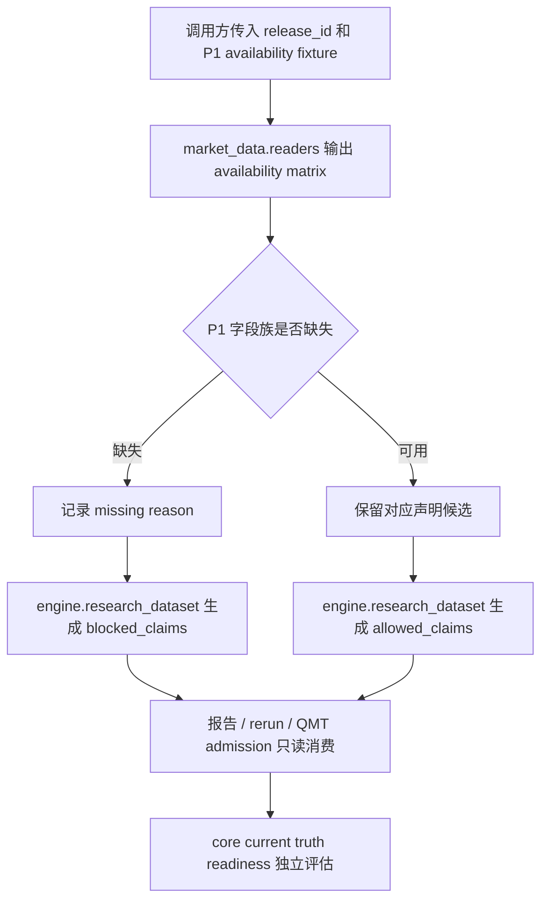

# LLD: CR018-S04 — P1 行业 / 市值 / 风格 / 流动性 / 容量合同

> 本文档是 `CR018-S04-industry-market-cap-liquidity-and-exposure-data` 的低层设计（Low-Level Design），需纳入 `CR018-PRODUCTION-DATA-LAKE-CLOSURE-BATCH-A` 全量 LLD 统一确认，并满足当前 Wave 的 `dev_gate` 后方可进入实现。

## 1. Goal

创建 P1 auxiliary availability 与 research claim boundary 合同，使行业、市值、风格、流动性、容量数据缺失时不阻断 P0 core current truth release，但必须阻断行业中性、市值中性、pure alpha、capacity、scale_up 和资金放大声明。

## 2. Requirements（Functional / Non-Functional）

### 2.1 Functional

- 修改 `market_data/readers.py`：输出 P1 auxiliary availability metadata，覆盖 `industry`、`market_cap`、`float_market_cap`、`beta`、`style`、`ADV`、`turnover_rate`、`liquidity`、`capacity`、`impact_cost` 等字段族，并为缺失项输出结构化 missing reason。
- 修改 `engine/research_dataset.py`：将 P1 availability matrix 映射为 allowed / blocked claims，P1 缺失时 core release readiness 继续可评估，但相关研究和资金放大声明必须 blocked。
- 创建 `tests/test_cr018_p1_auxiliary_claim_boundary.py`：以 fixture-only 合同测试验证 P1 缺失不阻断 P0 core readiness，同时中性化、pure alpha、capacity、scale_up allowed claim 输出次数为 0。
- reader 不得扫描未发布 lake；只能消费调用方传入的 release / dataset availability metadata。
- provider_fetch、real_lake_write、credential_read、QMT operation 计数必须保持 0。

### 2.2 Non-Functional

- 安全：不读取 `.env`、token、凭据文件、真实 provider、真实 lake 私有路径，不触发 QMT API。
- 可审计：blocked claims 必须包含触发字段、缺失原因、影响声明和 evidence reference。
- 可维护：P1 缺失语义与 ADR-063、`process/HLD-DATA-LAKE.md` §19.4 / §19.12 保持一致，后续若 P1 升级 P0 需另起 CR 或 CP5 修改。
- 性能：仅基于 metadata / fixture 计算 availability 和 claim boundary，不做全量数据扫描。

## 3. 模块拆分与职责

| 模块 / 文件组 | 职责 | 说明 |
|---|---|---|
| `market_data/readers.py` | 暴露 P1 auxiliary availability metadata | 不扫描未发布 lake；只对调用方提供的 release / dataset availability 做结构化解释 |
| `engine/research_dataset.py` | 将 P1 availability 映射为 research claim boundary | P1 缺失不改变 P0 core readiness，但阻断中性化、pure alpha、capacity、scale_up 等声明 |
| `tests/test_cr018_p1_auxiliary_claim_boundary.py` | fixture-only 合同测试 | 验证接口、异常路径和安全计数；不触发真实抓取、写湖或 QMT |

## 4. 代码结构与文件影响范围

| 动作 | 文件路径 | 变更内容 |
|---|---|---|
| 修改 | `market_data/readers.py` | 增加 P1 availability metadata 输出入口和 missing reason 映射；保持 published-reader 只读边界 |
| 修改 | `engine/research_dataset.py` | 增加 P1 availability 到 allowed / blocked claims 的映射规则 |
| 创建 | `tests/test_cr018_p1_auxiliary_claim_boundary.py` | 新增 fixture-only 合同测试，覆盖 P1 缺失、claim blocked 和安全计数 |

## 5. 数据模型与持久化设计

无新增持久化表、无真实 lake 写入、无 catalog current pointer 更新。本 Story 只定义运行时 metadata / 测试 fixture 合同。

| 对象 / 字段 | 类型 | 约束 | 说明 |
|---|---|---|---|
| `auxiliary_availability.release_id` | `str` | 必填；由调用方传入 | 标识被评估 release，不由 reader 自行 publish 或发现 |
| `auxiliary_availability.fields` | `dict[str, AvailabilityStatus]` | 每个 P1 字段族必须显式 `available` / `missing` / `unsupported` | 缺失不得静默填充 |
| `auxiliary_availability.missing_reasons` | `dict[str, str]` | 缺失字段必须有原因 | 用于 blocked claims 和报告声明 |
| `claim_boundary.allowed_claims` | `list[str]` | P1 缺失时不得包含中性化、pure alpha、capacity、scale_up 声明 | 允许 core release readiness 继续评估 |
| `claim_boundary.blocked_claims` | `list[BlockedClaim]` | 缺失 P1 对应声明必须 blocked | 记录 claim、reason、evidence |
| `permission_counters` | `dict[str, int]` | provider_fetch、lake_write、credential_read、qmt_operation 均为 0 | 测试中以 fixture / spy 验证 |

## 6. API / Interface 设计

| 接口 / 入口 | 输入 | 输出 | 调用方 | 说明 |
|---|---|---|---|---|
| auxiliary availability metadata | `release_id`、dataset availability、P1 字段族状态 | availability matrix、missing reason | research dataset builder / report gate | 对应测试：P1 缺失时字段状态和 missing reason 完整 |
| research claim boundary | requested claims、availability matrix | allowed / blocked claims | reports、research rerun、QMT admission 前置检查 | 对应测试：中性化、pure alpha、capacity、scale_up allowed 次数为 0 |
| reader metadata guard | release metadata、published/current 状态 | metadata flags 或 `catalog_not_published` / `required_missing` | production reader | 对应测试：未发布 lake 扫描次数为 0 |

## 7. 核心处理流程



1. 调用方传入 release metadata 和 P1 字段族 availability；reader 不自行扫描未发布 lake。
2. `market_data/readers.py` 将字段族转换为 availability matrix，缺失项必须附带 missing reason。
3. `engine/research_dataset.py` 根据 requested claim 和 availability matrix 计算 allowed / blocked claims。
4. P1 缺失时，core release readiness 继续评估；行业中性、市值中性、pure alpha、capacity、scale_up 和资金放大声明进入 blocked claims。
5. 任一 forbidden operation counter 大于 0 时测试失败；实现不得读取凭据、抓取 provider、写真实 lake 或触发 QMT。

异常路径：

| 异常 | 处理 |
|---|---|
| P1 availability 缺少字段族状态 | 返回 `missing_reason_required`，相关 claim blocked |
| requested claim 未登记 | 默认 blocked，并输出 `unsupported_claim` |
| release 未 publish 或 metadata 未提供 | reader 返回结构化不可用状态，不扫描 lake |
| 调用方试图把 P1 缺失解释为 capacity ready | fail-closed，allowed claim 输出次数为 0 |

## 8. 技术设计细节

- 关键算法 / 规则：使用字段族到声明的确定性映射表，例如 `industry -> industry_neutral`、`market_cap/float_market_cap -> market_cap_neutral`、`beta/style -> pure_alpha`、`ADV/turnover/liquidity/capacity/impact_cost -> capacity/scale_up/capital_amplification`。
- 依赖选择与复用点：复用 CR018-S01 的 dataset group / claim matrix 概念；复用 ADR-063 的 P0/P1 声明边界；不新增 provider、runtime 或 lake writer 依赖。
- 兼容性处理：旧报告可作为历史基线保留；新生产口径报告必须消费 blocked claims，不得把缺失 P1 数据写成 available。
- 图示类型选择：流程图；本 Story 跨 reader、research dataset、report/QMT admission 边界。

## 9. 安全与性能设计

| 维度 | 设计措施 | 验证方式 |
|---|---|---|
| 安全 | 不读取 `.env` / token / credential；不导入 provider SDK；不写真实 lake；不触发 QMT API | 测试 fixture 统计 provider_fetch、lake_write、credential_read、qmt_operation 均为 0 |
| 权限 | P1 availability 由调用方显式传入；reader 不自行发现未发布路径 | 测试未发布 lake 扫描次数为 0 |
| 性能 | 基于 metadata 字典和 claim 映射表 O(n) 计算，n 为字段族 / claim 数量 | fixture 中验证不触发全量 parquet / lake 扫描 |
| 可审计 | blocked claim 输出 reason、field、evidence ref | 测试断言 blocked claims 字段完整 |

## 10. 测试设计

| 测试场景 | 前置条件 | 操作 | 预期结果 | 验证方式 |
|---|---|---|---|---|
| P1 缺失不阻断 core readiness | fixture 中 P0 readiness 为 pass，P1 availability 全缺失 | 调用 availability + claim boundary | core readiness 不被错误标 fail | `uv run --python 3.11 pytest -q tests/test_cr018_p1_auxiliary_claim_boundary.py` |
| P1 缺失阻断中性化 / pure alpha | 缺 industry、market_cap、beta、style | 请求 industry neutral、market cap neutral、pure alpha claim | allowed 次数为 0；blocked claims 包含 missing reason | 同上 |
| P1 缺失阻断 capacity / scale_up | 缺 ADV、turnover、liquidity、capacity、impact_cost | 请求 capacity、scale_up、capital amplification claim | allowed 次数为 0 | 同上 |
| reader 不扫未发布 lake | release metadata 标记 unpublished | 调用 reader metadata guard | 返回结构化 unavailable；lake scan 次数为 0 | 同上 |
| 安全计数为 0 | fixture spy 计数器初始化为 0 | 执行全部 claim boundary 计算 | provider_fetch、lake_write、credential_read、QMT operation 均为 0 | 同上 |

## 11. 实施步骤

| TASK-ID | 动作 | 目标文件 | 详细描述 | 对应测试 |
|---|---|---|---|---|
| CR018-S04-T1 | 修改 | `market_data/readers.py` | 输出 P1 availability metadata、字段族状态和 missing reason；保持未发布 lake 不扫描 | reader 不扫未发布 lake；安全计数为 0 |
| CR018-S04-T2 | 修改 | `engine/research_dataset.py` | 增加 P1 缺失到 blocked claims 的确定性映射，保留 P0 core readiness 独立性 | P1 缺失不阻断 core readiness；P1 缺失阻断声明 |
| CR018-S04-T3 | 创建 | `tests/test_cr018_p1_auxiliary_claim_boundary.py` | 新增 fixture-only 合同测试，覆盖 availability、claim boundary、forbidden operation counters | 全部测试场景 |

## 12. 风险、难点与预研建议

### 12.1 实现灰区与取舍记录

| Clarification ID | 问题 | 选项与推荐 | 决策 / 答案 | 影响面 | 证据 | 重访条件 |
|---|---|---|---|---|---|---|
| N/A | 无新增需用户决策的实现灰区 | 推荐沿用 ADR-063：P1 不阻断 core release，只阻断相关 claims | 已按 Story / HLD / ADR 作为 LLD 输入 | 接口 / 测试 / 跨 Story 契约 | Story 卡、`process/HLD-DATA-LAKE.md` §19.4 / §19.12、ADR-063 | 用户要求行业中性、容量或 scale_up 变成准入条件时，另起 CR 或 CP5 修改 |

| 风险 / 难点 | 影响 | 缓解措施 / 预研建议 |
|---|---|---|
| P1 缺失被误读为“无影响” | 报告可能输出 pure alpha / capacity ready 等错误声明 | blocked claims 必须显式列出 claim、field、reason |
| P1 字段族命名与上游数据合同不一致 | claim boundary 无法精确映射 | 在实现时集中维护字段族映射表，并以 fixture 锁定 exact key |
| 与 CR018-S08 共享 `engine/research_dataset.py` | 开发阶段文件冲突 | CP5 后由 meta-po 按 Wave / merge_owner 串行调度 |

### OPEN / Spike 跟踪

| ID | 类型（OPEN / Spike） | 问题 | 下一动作 | 责任方 |
|---|---|---|---|---|
| N/A | OPEN | 无 | 无 | 无 |

## 13. 回滚与发布策略

- 发布方式：本 Story 只产生 LLD 与后续代码合同；实现后仍不得触发真实 publish。业务代码需等全量 CP5 人工确认和 dev_gate 满足后才可合入。
- 回滚触发条件：blocked claim 映射误伤 core readiness、P1 缺失未阻断相关 claim、或 forbidden operation counter 非 0。
- 回滚动作：回退 `market_data/readers.py`、`engine/research_dataset.py` 和对应测试变更；无数据回滚、无 catalog pointer 回滚、无真实 lake 清理。

## 14. Definition of Done

- [ ] 14 个章节全部填写完成。
- [ ] `market_data/readers.py` 的 P1 availability metadata 接口有对应测试。
- [ ] `engine/research_dataset.py` 的 claim boundary 规则有对应测试。
- [ ] P1 缺失时 core readiness 不被错误标 fail。
- [ ] P1 缺失时中性化、pure alpha、capacity、scale_up allowed claim 输出次数为 0。
- [ ] 未发布 lake 扫描次数为 0。
- [ ] provider_fetch、lake_write、credential_read、QMT operation 计数均为 0。
- [ ] 实现灰区与取舍记录显式写明无新增 LCQ。
- [ ] `confirmed=true` 后仍需遵守 Story DAG、文件 owner 和真实操作授权边界。
- [ ] frontmatter 已填写 `tier`。
- [ ] OPEN / Spike 已清点为无。

## 人工确认区

> **CP5 — Story LLD 可实现性门**
> meta-dev 先写入 `process/checks/CP5-CR018-S04-industry-market-cap-liquidity-and-exposure-data-LLD-IMPLEMENTABILITY.md` 自动预检结果。
> CP5 批次人工审查已完成：`checkpoints/CP5-CR018-PRODUCTION-DATA-LAKE-CLOSURE-BATCH-A-LLD-BATCH.md`，结论 approved。
> 用户统一确认全部目标 Story 的 LLD 后，仍需满足当前 Wave、依赖门控与文件所有权门控方可进入实现。

**CP5 checklist 摘要**：

| # | 检查项 | 状态 | 证据 |
|---|---|---|---|
| 1 | LLD 覆盖 AC | 待检查 | 第 2 / 10 / 14 节 |
| 2 | 与 HLD / ADR 一致 | 待检查 | 第 3 / 8 / 12 节 |
| 3 | 文件影响范围明确 | 待检查 | 第 4 / 11 节 |
| 4 | 接口契约完整 | 待检查 | 第 6 节 |
| 5 | 测试与 dev_gate 可计算 | 待检查 | 第 10 / 14 节 |
| 6 | clarification queue 已收敛 | 待检查 | 第 12.1 节 / `STATE.md.parallel_execution.lld_clarification_queue` |

**人工确认回复**：

请直接回复以下任一整行：

```text
approve
修改: <具体修改点>
reject
```

- `approve`：LLD 设计合理，允许进入实现。
- `修改: <具体修改点>`：指出具体修改点后由 meta-dev 更新重提。
- `reject`：设计方向有根本问题，需重新设计。
- Codex 历史别名 `1/通过`、`2/修改: ...`、`3/不通过` 仅作兼容解析；新提示不得把多个别名混排为主要选项。

**人工审查结果回填**：

- 结论：`approved`
- 审查人：user
- 审查时间：2026-05-29T08:25:12+08:00
- 修改意见：无；用户已同意 CP5 批次。
- 风险接受项：只允许离线 / fixture / dry-run 实现；真实抓取、写湖、publish、凭据读取和 QMT 仍 blocked。
