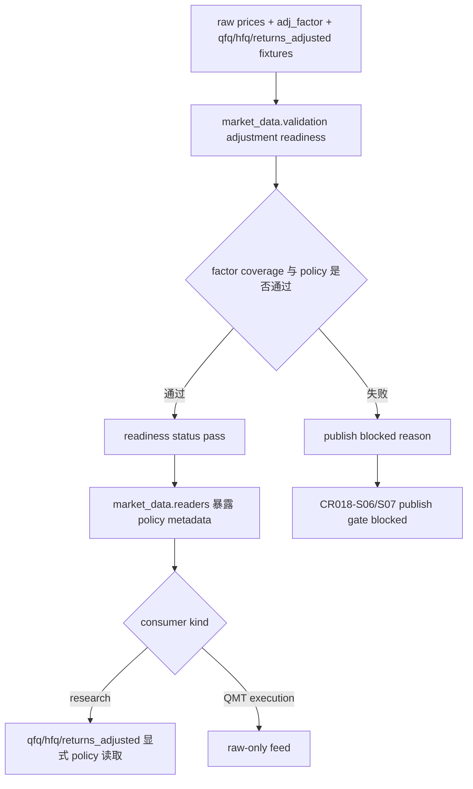

# LLD: CR018-S05 — raw / adj_factor / qfq / hfq / returns_adjusted publish readiness

> 本文档是 `CR018-S05-adjustment-dual-view-quality-and-qfq-hfq-publish-readiness` 的低层设计（Low-Level Design），需纳入 `CR018-PRODUCTION-DATA-LAKE-CLOSURE-BATCH-A` 全量 LLD 统一确认，并满足当前 Wave 的 `dev_gate` 后方可进入实现。

## 1. Goal

修改 adjustment readiness、reader policy metadata 与 publish quality hook，使 raw、`adj_factor`、qfq、hfq、`returns_adjusted` 五类 P0 复权合同可追溯，并确保 QMT execution consumer 只能使用 raw execution price，缺 factor 或 policy 混用时 publish fail-closed。

## 2. Requirements（Functional / Non-Functional）

### 2.1 Functional

- 修改 `market_data/validation.py`：增加 raw、`adj_factor`、qfq、hfq、`returns_adjusted` readiness 和 factor coverage 检查。
- 修改 `market_data/readers.py`：暴露 raw/qfq/hfq/`returns_adjusted` 读取 policy metadata，调用方必须显式选择研究复权口径。
- 修改 `market_data/adjustment_policy.py`：衔接 CR017 policy 与 publish readiness，保留 old qfq baseline readonly，不覆盖旧基线。
- 创建 `tests/test_cr018_adjustment_publish_readiness.py`：验证五类 readiness 字段覆盖率 100%、QMT raw-only、缺 factor 时 publish blocked、旧 qfq baseline overwrite 次数为 0。
- publish readiness 失败不得更新 catalog current pointer；本 Story 阶段不得执行真实 publish。

### 2.2 Non-Functional

- 安全：不读取凭据、不抓取 provider、不写真实 lake、不 publish current pointer。
- 一致性：同一研究数据 bundle 必须单一 `research_adjustment_policy`，QMT execution feed 必须 raw-only。
- 可追溯：readiness report 必须记录 factor coverage、derivation policy、view metadata、legacy qfq baseline preserved 标记。
- 兼容性：旧 qfq baseline 作为历史基线只读保留，新 readiness 不覆盖旧报告或旧基线。

## 3. 模块拆分与职责

| 模块 / 文件组 | 职责 | 说明 |
|---|---|---|
| `market_data/validation.py` | 计算 adjustment publish readiness | 覆盖 raw、adj_factor、qfq、hfq、returns_adjusted、factor coverage、policy consistency |
| `market_data/readers.py` | 暴露 adjusted view reader policy metadata | QMT execution consumer 只能 raw；研究 reader 必须显式选择 qfq / hfq / returns_adjusted |
| `market_data/adjustment_policy.py` | 复用 CR017 policy，冻结 single-policy 与 legacy qfq 兼容边界 | 不覆盖旧 qfq baseline；不把 adjusted price 用作 QMT 执行价 |
| `tests/test_cr018_adjustment_publish_readiness.py` | fixture-only 合同测试 | 验证 readiness、reader policy、publish fail-closed 和 forbidden counters |

## 4. 代码结构与文件影响范围

| 动作 | 文件路径 | 变更内容 |
|---|---|---|
| 修改 | `market_data/validation.py` | 增加 adjustment readiness、factor coverage、single-policy 和 publish blocked 判定 |
| 修改 | `market_data/readers.py` | 暴露 raw/qfq/hfq/returns_adjusted reader metadata，并对 QMT execution consumer enforced raw-only |
| 修改 | `market_data/adjustment_policy.py` | 连接 CR017 复权 policy、legacy qfq baseline preserved 和 publish readiness metadata |
| 创建 | `tests/test_cr018_adjustment_publish_readiness.py` | 新增 fixture-only 合同测试，覆盖五类 readiness、QMT raw-only、publish fail-closed 和旧 baseline 保护 |

## 5. 数据模型与持久化设计

无新增真实 lake 持久化写入、无 catalog current pointer 更新。本 Story 定义 release candidate readiness metadata 和测试 fixture 合同。

| 对象 / 字段 | 类型 | 约束 | 说明 |
|---|---|---|---|
| `AdjustmentReadiness.release_id` | `str` | 必填 | 标识待评估 release candidate |
| `AdjustmentReadiness.raw_ready` | `bool` | P0 必填 | QMT execution feed 的唯一价格口径 |
| `AdjustmentReadiness.adj_factor_ready` | `bool` | P0 必填 | qfq / hfq / returns_adjusted 派生前置 |
| `AdjustmentReadiness.qfq_ready` | `bool` | P0 必填 | 前复权 view readiness |
| `AdjustmentReadiness.hfq_ready` | `bool` | P0 必填 | 后复权 view readiness |
| `AdjustmentReadiness.returns_adjusted_ready` | `bool` | P0 必填 | 研究收益口径 readiness |
| `AdjustmentReadiness.factor_coverage_ratio` | `float` | publish readiness 要求 100% 或 fail-closed | 缺 factor 时 publish blocked |
| `AdjustmentReadiness.policy_metadata` | `dict` | 记录 derivation_version、research_adjustment_policy、legacy baseline | 防止混用 policy |
| `publish_blocked_reason` | `list[str]` | readiness fail 时必填 | 不更新 current pointer |

## 6. API / Interface 设计

| 接口 / 入口 | 输入 | 输出 | 调用方 | 说明 |
|---|---|---|---|---|
| adjustment readiness | raw prices、adj_factor、qfq/hfq views、returns_adjusted | readiness status、factor coverage、policy metadata、blocked reason | publish readiness gate / validation | 对应测试：五类 readiness 字段覆盖率 100%，缺 factor 时 publish blocked |
| adjusted view reader | policy、as_of_trade_date、consumer kind | qfq/hfq/returns_adjusted data 或 raw-only enforcement | research builder、QMT execution adapter 前置 | 对应测试：QMT execution consumer 使用 adjusted price 的 allowed 次数为 0 |
| publish quality hook | release_id、adjustment readiness | publish allowed / blocked | CR018-S06 / S07 publish gate | 对应测试：readiness fail 不得 publish，current_pointer_publish 计数为 0 |
| legacy qfq guard | old baseline ref、new readiness metadata | `legacy_qfq_baseline_preserved=true` | migration / report compatibility | 对应测试：旧 qfq baseline overwrite 次数为 0 |

## 7. 核心处理流程



1. validation 接收 raw、`adj_factor`、qfq、hfq、`returns_adjusted` fixture metadata。
2. validation 计算五类 readiness 字段、factor coverage 和 single-policy consistency。
3. 任一 P0 adjustment readiness fail 时输出 publish blocked reason，不允许 publish allowed。
4. readers 暴露 policy metadata；research consumer 必须显式选择 qfq / hfq / returns_adjusted，QMT execution consumer 被强制为 raw-only。
5. `adjustment_policy.py` 保留 legacy qfq baseline readonly 标记，禁止覆盖旧 qfq 基线。

异常路径：

| 异常 | 处理 |
|---|---|
| `adj_factor` 缺失或 coverage 不足 | readiness fail；publish blocked；blocked reason 记录缺失字段 |
| 同一 bundle 混用 qfq / hfq / returns_adjusted policy | readiness fail；报告 policy mismatch |
| QMT execution consumer 请求 adjusted view | 返回 raw-only violation / blocked；allowed 次数为 0 |
| 旧 qfq baseline 写入请求 | fail-closed；overwrite 次数为 0 |
| publish hook 被 readiness fail 调用 | current pointer 保持不变；current_pointer_publish 计数为 0 |

## 8. 技术设计细节

- 关键算法 / 规则：五类 readiness 字段必须全部显式输出；factor coverage 低于 publish threshold 时 fail-closed；consumer kind 为 QMT execution 时只允许 raw price metadata。
- 依赖选择与复用点：复用 CR017-S05 validation quality / parity / leakage 合同；复用 ADR-063 的 P0 group 和 ADR-065 的 publish 不自动触发约束。
- 兼容性处理：旧 qfq baseline 只读保留；新 qfq/hfq/returns_adjusted 作为独立 view readiness，不覆盖旧报告。
- 图示类型选择：流程图；本 Story 跨 validation、reader、policy、publish gate 四类边界。

## 9. 安全与性能设计

| 维度 | 设计措施 | 验证方式 |
|---|---|---|
| 安全 | 不读取凭据、不抓取 provider、不写真实 lake、不 publish current pointer | 测试断言 provider_fetch、lake_write、credential_read、current_pointer_publish 均为 0 |
| QMT 隔离 | QMT execution consumer raw-only；adjusted view 不进入执行价 | 测试断言 QMT adjusted allowed 次数为 0 |
| 性能 | readiness 只读 metadata / fixture 计算，避免全量真实 lake 扫描 | fixture-only 测试不访问真实路径 |
| 可追溯 | readiness 输出 factor coverage、policy metadata、legacy baseline preserved | 测试断言字段覆盖率 100% |

## 10. 测试设计

| 测试场景 | 前置条件 | 操作 | 预期结果 | 验证方式 |
|---|---|---|---|---|
| 五类 readiness 字段覆盖 | fixture 提供 raw、adj_factor、qfq、hfq、returns_adjusted metadata | 调用 adjustment readiness | 5 类 readiness 字段覆盖率为 100% | `uv run --python 3.11 pytest -q tests/test_cr018_adjustment_publish_readiness.py` |
| 缺 factor 时 publish blocked | fixture 缺少 adj_factor 或 coverage 不足 | 调用 publish quality hook | publish allowed=false；blocked reason 完整 | 同上 |
| QMT raw-only | QMT execution consumer 请求 qfq/hfq/returns_adjusted | 调用 adjusted view reader | adjusted price allowed 次数为 0；返回 raw-only violation | 同上 |
| 旧 qfq baseline 不覆盖 | fixture 带 legacy qfq baseline ref | 调用 policy readiness | `legacy_qfq_baseline_preserved=true`；overwrite 次数为 0 | 同上 |
| 安全计数为 0 | fixture spy 计数器初始化为 0 | 执行 readiness / reader / publish hook | provider_fetch、lake_write、credential_read、current_pointer_publish 均为 0 | 同上 |

## 11. 实施步骤

| TASK-ID | 动作 | 目标文件 | 详细描述 | 对应测试 |
|---|---|---|---|---|
| CR018-S05-T1 | 修改 | `market_data/validation.py` | 增加复权 readiness、factor coverage、single-policy 和 publish blocked 检查 | 五类 readiness 字段覆盖；缺 factor 时 publish blocked |
| CR018-S05-T2 | 修改 | `market_data/readers.py` | 暴露 raw/qfq/hfq/returns_adjusted 读取 policy metadata，并强制 QMT execution raw-only | QMT raw-only |
| CR018-S05-T3 | 修改 | `market_data/adjustment_policy.py` | 衔接 CR017 policy 与 publish readiness，保留 old qfq baseline readonly | 旧 qfq baseline 不覆盖 |
| CR018-S05-T4 | 创建 | `tests/test_cr018_adjustment_publish_readiness.py` | 新增 fixture-only 合同测试，覆盖 readiness、QMT raw-only、publish fail-closed 和安全计数 | 全部测试场景 |

## 12. 风险、难点与预研建议

### 12.1 实现灰区与取舍记录

| Clarification ID | 问题 | 选项与推荐 | 决策 / 答案 | 影响面 | 证据 | 重访条件 |
|---|---|---|---|---|---|---|
| N/A | 无新增需用户决策的实现灰区 | 推荐沿用 CR017 双视图与 ADR-065 release-level publish gate：复权视图可研究读取，QMT execution raw-only，readiness fail 不 publish | 已按 Story / HLD / ADR 作为 LLD 输入 | 接口 / 测试 / 安全 / 跨 Story 契约 | Story 卡、`process/HLD-DATA-LAKE.md` §19.4 / §19.9、`process/HLD.md` §32、ADR-063、ADR-065 | 用户要求 adjusted price 进入执行价、覆盖旧 qfq baseline 或 CP5 同步授权 publish 时，另起 CR 或 CP5 修改 |

| 风险 / 难点 | 影响 | 缓解措施 / 预研建议 |
|---|---|---|
| qfq/hfq/returns_adjusted 与 raw execution price 混用 | QMT admission 或报告产生错误价格口径 | consumer kind 强制 raw-only；测试断言 adjusted allowed 次数为 0 |
| factor coverage 不完整但 publish allowed | current truth 复权视图不可追溯 | readiness fail-closed，缺 factor 时 publish blocked |
| legacy qfq baseline 被覆盖 | 历史结果不可追溯 | 只读保留 legacy baseline ref，overwrite 次数测试为 0 |
| 与 CR018-S06 共享 `market_data/validation.py` | 开发阶段文件冲突 | CP5 后由 meta-po 按 Wave / merge_owner 串行调度 |

### OPEN / Spike 跟踪

| ID | 类型（OPEN / Spike） | 问题 | 下一动作 | 责任方 |
|---|---|---|---|---|
| N/A | OPEN | 无 | 无 | 无 |

## 13. 回滚与发布策略

- 发布方式：本 Story 不执行真实 publish；只定义 adjustment readiness 合同。全量 CP5 人工确认和 dev_gate 满足前不得实现。
- 回滚触发条件：QMT execution 可读取 adjusted price、缺 factor 仍 publish allowed、legacy qfq baseline 被覆盖、或 forbidden counter 非 0。
- 回滚动作：回退 `market_data/validation.py`、`market_data/readers.py`、`market_data/adjustment_policy.py` 和对应测试变更；无数据回滚、无 current pointer 回滚。

## 14. Definition of Done

- [ ] 14 个章节全部填写完成。
- [ ] raw、adj_factor、qfq、hfq、returns_adjusted 五类 readiness 字段覆盖率为 100%。
- [ ] 缺 factor 或 policy 混用时 publish blocked。
- [ ] QMT execution consumer 使用 qfq/hfq/returns_adjusted 的 allowed 次数为 0。
- [ ] 旧 qfq baseline overwrite 次数为 0。
- [ ] provider_fetch、lake_write、credential_read、current_pointer_publish 计数均为 0。
- [ ] 第 6 节接口均在第 10 节有测试入口。
- [ ] 实现灰区与取舍记录显式写明无新增 LCQ。
- [ ] `confirmed=true` 后仍需遵守 Story DAG、文件 owner 和真实操作授权边界。
- [ ] frontmatter 已填写 `tier`。
- [ ] OPEN / Spike 已清点为无。

## 人工确认区

> **CP5 — Story LLD 可实现性门**
> meta-dev 先写入 `process/checks/CP5-CR018-S05-adjustment-dual-view-quality-and-qfq-hfq-publish-readiness-LLD-IMPLEMENTABILITY.md` 自动预检结果。
> CP5 批次人工审查已完成：`checkpoints/CP5-CR018-PRODUCTION-DATA-LAKE-CLOSURE-BATCH-A-LLD-BATCH.md`，结论 approved。
> 用户统一确认全部目标 Story 的 LLD 后，仍需满足当前 Wave、依赖门控与文件所有权门控方可进入实现。

**CP5 checklist 摘要**：

| # | 检查项 | 状态 | 证据 |
|---|---|---|---|
| 1 | LLD 覆盖 AC | 待检查 | 第 2 / 10 / 14 节 |
| 2 | 与 HLD / ADR 一致 | 待检查 | 第 3 / 8 / 12 节 |
| 3 | 文件影响范围明确 | 待检查 | 第 4 / 11 节 |
| 4 | 接口契约完整 | 待检查 | 第 6 节 |
| 5 | 测试与 dev_gate 可计算 | 待检查 | 第 10 / 14 节 |
| 6 | clarification queue 已收敛 | 待检查 | 第 12.1 节 / `STATE.md.parallel_execution.lld_clarification_queue` |

**人工确认回复**：

请直接回复以下任一整行：

```text
approve
修改: <具体修改点>
reject
```

- `approve`：LLD 设计合理，允许进入实现。
- `修改: <具体修改点>`：指出具体修改点后由 meta-dev 更新重提。
- `reject`：设计方向有根本问题，需重新设计。
- Codex 历史别名 `1/通过`、`2/修改: ...`、`3/不通过` 仅作兼容解析；新提示不得把多个别名混排为主要选项。

**人工审查结果回填**：

- 结论：`approved`
- 审查人：user
- 审查时间：2026-05-29T08:25:12+08:00
- 修改意见：无；用户已同意 CP5 批次。
- 风险接受项：只允许离线 / fixture / dry-run 实现；真实抓取、写湖、publish、凭据读取和 QMT 仍 blocked。
