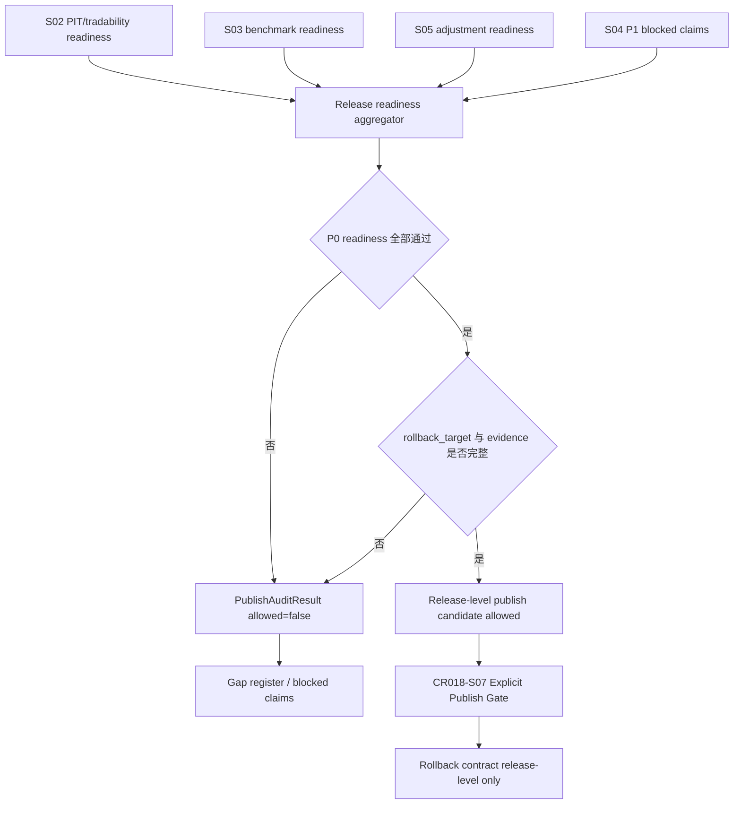

# LLD: CR018-S06 — production quality / readiness / rollback gate

> 本文档是 `CR018-S06-production-quality-readiness-audit-and-rollback-gate` 的低层设计（Low-Level Design），需纳入 `CR018-PRODUCTION-DATA-LAKE-CLOSURE-BATCH-A` 全量 LLD 统一确认，并满足当前 Wave 的 `dev_gate` 后方可进入实现。

## 1. Goal

修改 production quality / readiness 聚合、catalog rollback metadata 与 publish 前 readiness audit hook，形成 release-level production quality 总门：P0 fail 时 publish allowed=0，P1 缺失只进入 blocked claims，rollback 必须以 release 为单位且不得删除 raw / manifest / candidate / 历史 evidence。

## 2. Requirements（Functional / Non-Functional）

### 2.1 Functional

- 修改 `market_data/validation.py`：聚合 S02/S03/S05 的 P0 readiness、S04 的 P1 blocked claims、quality status 和 audit evidence，输出 release readiness report。
- 修改 `market_data/catalog.py`：增加 release-level rollback metadata，记录 `from_release`、`to_release`、reason、operator、time、smoke result、evidence ref。
- 修改 `market_data/publish.py`：增加 publish 前 readiness audit hook；P0 fail、rollback target 缺失或 evidence incomplete 时 publish blocked。
- 创建 `tests/test_cr018_readiness_rollback_gate.py`：验证 release readiness 字段覆盖、P0 fail publish allowed=0、dataset-only rollback blocked、历史 evidence 不删除、安全计数为 0。
- 本 Story 不执行真实 publish、不更新 current pointer、不写真实 lake。

### 2.2 Non-Functional

- 安全：real_lake_write、current_pointer_publish、credential_read 计数均为 0。
- 一致性：publish / rollback 以 release 为单位，禁止 dataset-only rollback。
- 可审计：release readiness report 必须覆盖 release、dataset、quality、blocked_claims、rollback_target 和 evidence refs。
- 可恢复：rollback 只切换 pointer 的候选合同，不删除 raw、manifest、candidate、quality evidence 或历史 release summary。

## 3. 模块拆分与职责

| 模块 / 文件组 | 职责 | 说明 |
|---|---|---|
| `market_data/validation.py` | readiness audit aggregator | 聚合 P0 readiness、P1 blocked claims、quality status 和 evidence completeness |
| `market_data/catalog.py` | release-level rollback metadata | 定义 release rollback target / event 合同；禁止 dataset-only rollback |
| `market_data/publish.py` | publish 前 readiness audit hook | P0 fail、rollback target 缺失、evidence incomplete 时 publish blocked；本 Story 不 publish |
| `tests/test_cr018_readiness_rollback_gate.py` | fixture-only 合同测试 | 验证聚合字段、fail-closed、rollback 粒度和安全计数 |

## 4. 代码结构与文件影响范围

| 动作 | 文件路径 | 变更内容 |
|---|---|---|
| 修改 | `market_data/validation.py` | 增加 release readiness report 聚合规则，覆盖 P0/P1、quality、blocked claims 和 evidence |
| 修改 | `market_data/catalog.py` | 增加 release-level rollback metadata / rollback event 合同，禁止 dataset-only rollback |
| 修改 | `market_data/publish.py` | 增加 publish 前 readiness audit hook，fail-closed 并保持 current pointer 不变 |
| 创建 | `tests/test_cr018_readiness_rollback_gate.py` | 新增 fixture-only 合同测试，覆盖 P0 fail、P1 blocked claims、rollback 粒度、evidence 保留 |

## 5. 数据模型与持久化设计

本 Story 定义 catalog / publish 层的 release metadata 合同；实现阶段仍不得写真实 lake 或更新 current pointer。测试以 fixture / in-memory 对象验证。

| 对象 / 字段 | 类型 | 约束 | 说明 |
|---|---|---|---|
| `ReleaseReadinessReport.release_id` | `str` | 必填 | release-level 总门主键 |
| `ReleaseReadinessReport.datasets` | `list[DatasetReadiness]` | P0 dataset 必须逐项列出 | 来源于 S02/S03/S05 readiness 合同 |
| `ReleaseReadinessReport.quality_summary` | `dict` | 必填 | 包含 pass / warn / fail 和 reason |
| `ReleaseReadinessReport.blocked_claims` | `list[BlockedClaim]` | 必填，可为空列表 | 来源于 S04 P1 claim boundary 和 P0 required_missing |
| `ReleaseReadinessReport.rollback_target` | `str` | publish 前必填 | 指向 previous_release_id 或等价 release-level rollback target |
| `ReleaseReadinessReport.evidence_refs` | `list[str]` | 必填且不可删除 | manifest、run metadata、quality report、release summary 等引用 |
| `RollbackEvent.from_release` | `str` | 必填 | 当前 release |
| `RollbackEvent.to_release` | `str` | 必填 | 目标 previous release |
| `RollbackEvent.scope` | `"release"` | 必须为 release | dataset-only rollback blocked |
| `PublishAuditResult.allowed` | `bool` | P0 fail 时必须 false | publish hook 输出 |

## 6. API / Interface 设计

| 接口 / 入口 | 输入 | 输出 | 调用方 | 说明 |
|---|---|---|---|---|
| readiness audit aggregator | dataset readiness、quality status、blocked claims、evidence refs | release readiness report | CR018-S07 publish gate、docs、research rerun | 对应测试：字段覆盖 release、dataset、quality、blocked_claims、rollback_target |
| rollback contract | release_id、previous_release_id、reason、operator、smoke policy | rollback target、rollback event、smoke result | catalog / ops runbook | 对应测试：dataset-only rollback blocked，release-level target 必填 |
| audit evidence registry | manifest、run metadata、quality report、release summary refs | evidence completeness status | publish hook、catalog audit | 对应测试：历史 evidence 不删除 |
| publish readiness hook | release readiness report、rollback target、approver metadata | publish allowed / blocked | `market_data/publish.py` / CR018-S07 | 对应测试：P0 fail 时 publish allowed=0，current_pointer_publish=0 |

## 7. 核心处理流程



1. aggregator 只读 S02/S03/S05 readiness 合同和 S04 blocked claims，不执行真实 backfill、publish 或 lake 写入。
2. aggregator 输出 release readiness report，字段覆盖 release、dataset、quality、blocked_claims、rollback_target、evidence_refs。
3. publish readiness hook 检查 P0 readiness、quality status、rollback target 和 evidence completeness；任一失败则 allowed=false。
4. rollback contract 要求 rollback scope 固定为 release；dataset-only rollback 返回 blocked。
5. evidence registry 只增加 / 引用 evidence refs，不删除 raw、manifest、candidate、quality evidence 或历史 release summary。

异常路径：

| 异常 | 处理 |
|---|---|
| 任一 P0 dataset readiness fail | publish allowed=false；release status blocked |
| P1 auxiliary 缺失 | core publish 可继续评估；blocked claims 进入 release report |
| rollback target 缺失 | publish blocked；输出 `rollback_target_required` |
| dataset-only rollback 请求 | fail-closed；dataset-level rollback-only 通过次数为 0 |
| evidence refs 缺失或删除请求 | publish blocked；historical evidence delete 次数为 0 |

## 8. 技术设计细节

- 关键算法 / 规则：release readiness 使用 fail-closed 聚合，P0 任一 required_missing / quality fail 使 publish allowed=false；P1 blocked claims 不阻断 core publish，但必须进入 release summary。
- 依赖选择与复用点：消费 S02/S03/S05 readiness 合同和 S04 claim boundary；复用 ADR-065 release-level publish / rollback 决策。
- 兼容性处理：不改变既有 candidate / manifest / quality evidence，只新增 release-level 元数据合同；真实 current pointer 更新留给 CR018-S07。
- 图示类型选择：流程图；本 Story 跨 validation、catalog、publish、上游 readiness 四类边界。

## 9. 安全与性能设计

| 维度 | 设计措施 | 验证方式 |
|---|---|---|
| 安全 | 不写真实 lake、不 publish current pointer、不读取凭据 | 测试断言 real_lake_write、current_pointer_publish、credential_read 均为 0 |
| 一致性 | release-level rollback；dataset-only rollback blocked | 测试断言 dataset-level rollback-only 通过次数为 0 |
| 可审计 | release readiness report 记录 readiness、quality、blocked claims、rollback target、evidence refs | 测试断言字段覆盖完整 |
| 性能 | 聚合基于 readiness metadata，避免全量数据扫描 | fixture-only 测试不访问真实 lake |

## 10. 测试设计

| 测试场景 | 前置条件 | 操作 | 预期结果 | 验证方式 |
|---|---|---|---|---|
| release readiness 字段覆盖 | fixture 提供 P0 readiness、P1 blocked claims、quality、rollback target | 调用 readiness audit aggregator | 字段覆盖 release、dataset、quality、blocked_claims、rollback_target | `uv run --python 3.11 pytest -q tests/test_cr018_readiness_rollback_gate.py` |
| P0 fail 阻断 publish | 任一 P0 readiness 为 fail / required_missing | 调用 publish readiness hook | publish allowed 次数为 0；blocked reason 完整 | 同上 |
| P1 blocked claims 不阻断 core publish | P0 pass，P1 缺失 | 聚合 release readiness | release 可继续评估；blocked_claims 包含 P1 声明 | 同上 |
| release-level rollback target 必填 | 缺 previous_release_id / rollback target | 调用 rollback contract | publish blocked 或 rollback blocked | 同上 |
| dataset-only rollback blocked | rollback scope 为 dataset | 调用 rollback contract | dataset-level rollback-only 通过次数为 0 | 同上 |
| 历史 evidence 不删除 | fixture 包含 raw/manifest/candidate/history evidence refs | 执行 publish audit / rollback contract | evidence delete 次数为 0 | 同上 |
| 安全计数为 0 | fixture spy 计数器初始化为 0 | 执行全部 aggregator / hook / rollback 流程 | real_lake_write、current_pointer_publish、credential_read 均为 0 | 同上 |

## 11. 实施步骤

| TASK-ID | 动作 | 目标文件 | 详细描述 | 对应测试 |
|---|---|---|---|---|
| CR018-S06-T1 | 修改 | `market_data/validation.py` | 汇总 P0/P1 readiness、quality status、blocked claims 和 evidence refs，输出 release readiness report | release readiness 字段覆盖；P0 fail 阻断 publish；P1 blocked claims 不阻断 core publish |
| CR018-S06-T2 | 修改 | `market_data/catalog.py` | 增加 release-level rollback metadata / event 合同，禁止 dataset-only rollback | release-level rollback target 必填；dataset-only rollback blocked；历史 evidence 不删除 |
| CR018-S06-T3 | 修改 | `market_data/publish.py` | 增加 publish 前 readiness audit hook，fail-closed 并保持 current pointer 不变 | P0 fail 阻断 publish；安全计数为 0 |
| CR018-S06-T4 | 创建 | `tests/test_cr018_readiness_rollback_gate.py` | 新增 fixture-only 合同测试，覆盖 readiness、publish blocked、rollback 粒度和 evidence 保留 | 全部测试场景 |

## 12. 风险、难点与预研建议

### 12.1 实现灰区与取舍记录

| Clarification ID | 问题 | 选项与推荐 | 决策 / 答案 | 影响面 | 证据 | 重访条件 |
|---|---|---|---|---|---|---|
| N/A | 无新增需用户决策的实现灰区 | 推荐沿用 ADR-065：release-level 总门 + release-level rollback，dataset-level 明细仅用于审计，不作为独立 rollback 单位 | 已按 Story / HLD / ADR 作为 LLD 输入 | 接口 / 文件 owner / 测试 / 安全 / 跨 Story 契约 | Story 卡、`process/HLD-DATA-LAKE.md` §19.9-§19.11、ADR-065 | 用户要求 dataset 独立 publish / rollback 或 CP5 同步授权 current pointer publish 时，另起 CR 或 CP5 修改 |

| 风险 / 难点 | 影响 | 缓解措施 / 预研建议 |
|---|---|---|
| dataset-level rollback 被误当成可接受 | current truth 可能跨 dataset 漂移 | rollback scope 固定为 release；dataset-only rollback 测试 blocked |
| P0 readiness 聚合遗漏某个上游合同 | publish gate 误放行 | release report 字段强制覆盖 dataset、quality、blocked claims、rollback target |
| P1 blocked claims 被 publish summary 遗漏 | 报告可能解除不应解除的声明 | aggregator 必须合并 S04 blocked claims |
| 与 S05/S07 共享 `market_data/validation.py` / `market_data/publish.py` | 开发阶段文件冲突 | CP5 后由 meta-po 按 S05 -> S06 -> S07 串行或 merge_owner 调度 |

### OPEN / Spike 跟踪

| ID | 类型（OPEN / Spike） | 问题 | 下一动作 | 责任方 |
|---|---|---|---|---|
| N/A | OPEN | 无 | 无 | 无 |

## 13. 回滚与发布策略

- 发布方式：本 Story 只定义 publish 前 readiness audit 和 rollback 合同，不执行真实 publish，不更新 catalog current pointer。
- 回滚触发条件：P0 fail 时 publish allowed 非 0、dataset-only rollback 通过、历史 evidence 被删除、或 forbidden counter 非 0。
- 回滚动作：回退 `market_data/validation.py`、`market_data/catalog.py`、`market_data/publish.py` 和对应测试变更；若后续真实 publish 已发生，必须由 CR018-S07 / ops gate 执行 release-level rollback，不在本 Story 内直接操作 current pointer。

## 14. Definition of Done

- [ ] 14 个章节全部填写完成。
- [ ] readiness audit 字段覆盖 release、dataset、quality、blocked_claims、rollback_target。
- [ ] P0 fail 时 publish allowed 次数为 0。
- [ ] P1 blocked claims 被纳入 release readiness report。
- [ ] release-level rollback target 必填。
- [ ] dataset-level rollback-only 通过次数为 0。
- [ ] historical evidence delete 次数为 0。
- [ ] real_lake_write、current_pointer_publish、credential_read 计数均为 0。
- [ ] 第 6 节接口均在第 10 节有测试入口。
- [ ] 实现灰区与取舍记录显式写明无新增 LCQ。
- [ ] `confirmed=true` 后仍需遵守 Story DAG、文件 owner 和真实操作授权边界。
- [ ] frontmatter 已填写 `tier`。
- [ ] OPEN / Spike 已清点为无。

## 人工确认区

> **CP5 — Story LLD 可实现性门**
> meta-dev 先写入 `process/checks/CP5-CR018-S06-production-quality-readiness-audit-and-rollback-gate-LLD-IMPLEMENTABILITY.md` 自动预检结果。
> CP5 批次人工审查已完成：`checkpoints/CP5-CR018-PRODUCTION-DATA-LAKE-CLOSURE-BATCH-A-LLD-BATCH.md`，结论 approved。
> 用户统一确认全部目标 Story 的 LLD 后，仍需满足当前 Wave、依赖门控与文件所有权门控方可进入实现。

**CP5 checklist 摘要**：

| # | 检查项 | 状态 | 证据 |
|---|---|---|---|
| 1 | LLD 覆盖 AC | 待检查 | 第 2 / 10 / 14 节 |
| 2 | 与 HLD / ADR 一致 | 待检查 | 第 3 / 8 / 12 节 |
| 3 | 文件影响范围明确 | 待检查 | 第 4 / 11 节 |
| 4 | 接口契约完整 | 待检查 | 第 6 节 |
| 5 | 测试与 dev_gate 可计算 | 待检查 | 第 10 / 14 节 |
| 6 | clarification queue 已收敛 | 待检查 | 第 12.1 节 / `STATE.md.parallel_execution.lld_clarification_queue` |

**人工确认回复**：

请直接回复以下任一整行：

```text
approve
修改: <具体修改点>
reject
```

- `approve`：LLD 设计合理，允许进入实现。
- `修改: <具体修改点>`：指出具体修改点后由 meta-dev 更新重提。
- `reject`：设计方向有根本问题，需重新设计。
- Codex 历史别名 `1/通过`、`2/修改: ...`、`3/不通过` 仅作兼容解析；新提示不得把多个别名混排为主要选项。

**人工审查结果回填**：

- 结论：`approved`
- 审查人：user
- 审查时间：2026-05-29T08:25:12+08:00
- 修改意见：无；用户已同意 CP5 批次。
- 风险接受项：只允许离线 / fixture / dry-run 实现；真实抓取、写湖、publish、凭据读取和 QMT 仍 blocked。
