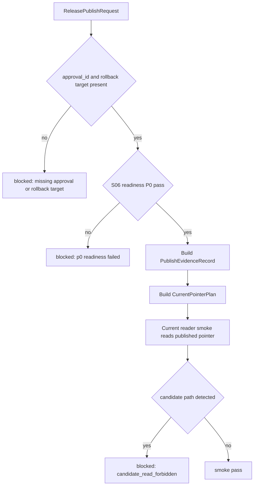

# LLD: CR018-S07 — Explicit Publish Gate 与 current reader smoke

本文档只定义 release-level Explicit Publish Gate、catalog current pointer 合同、current reader smoke 与 publish evidence 的实现蓝图。`confirmed=true`、S06 runtime 合同未冻结或缺少 per-run authorization 时，不得实现真实 current pointer publish。

## 1. Goal

修改 `market_data/publish.py`、`market_data/catalog.py`、`market_data/readers.py` 并创建 `tests/test_cr018_publish_current_reader_smoke.py`，使 current truth 只能由带 `approval_id` 的 Explicit Publish Gate 更新，并用 fixture-only current reader smoke 验证 reader 只读 published current pointer、不读取 candidate。

## 2. Requirements（Functional / Non-Functional）

### 2.1 Functional

- Explicit Publish Gate 必须要求 `release_id`、`approval_id`、readiness report、rollback target、operator / approver metadata。
- 缺 `approval_id`、缺 rollback target、S06 readiness P0 fail 或 release summary 不完整时，publish decision 必须为 `blocked`，current pointer update plan 为空。
- validate PASS、parity PASS、quality report PASS 和 DuckDB audit PASS 自动触发 publish 的次数必须为 0。
- current reader smoke 必须读取 catalog current pointer 指向的 published release；无 current pointer 时返回 `catalog_not_published`，不得回退读取 candidate。
- publish evidence 必须记录 release-level summary、dataset-level 明细、quality / readiness digest、rollback target、approval metadata 和 checksum。
- 本 Story 的测试必须保持 fixture-only；测试、LLD 和 CP5 不授权真实 catalog current pointer publish、真实 lake write、provider fetch 或凭据读取。

### 2.2 Non-Functional

- 安全：不读取 `.env`、token、credential files 或真实私有 lake 路径；`credential_read_count=0`。
- 可审计：publish decision、current pointer plan、evidence record 和 smoke result 使用稳定字段，支持 CP7 静态 / fixture 检查。
- 可维护：release-level publish 与 dataset-level 明细分离；shared 文件与 S06/S02/S05 合并时按 merge owner 串行。
- 可测试：所有门控行为均通过 in-memory / tmp fixture 覆盖，不执行真实 publish。

## 3. 模块拆分与职责

| 模块 / 文件组 | 职责 | 说明 |
|---|---|---|
| `market_data/publish.py` | 修改 Explicit Publish Gate、publish decision、approval_id 与 forbidden auto-publish guard | shared；当前 Story 定义 release-level 总门合同 |
| `market_data/catalog.py` | 修改 release-level current pointer evidence、pointer update plan、publish evidence record | shared；只定义合同和 fixture 写入，不授权真实 current pointer publish |
| `market_data/readers.py` | 修改 current reader smoke 的 fail-fast 读取合同 | shared；reader 缺 published pointer 时返回 `catalog_not_published` |
| `tests/test_cr018_publish_current_reader_smoke.py` | 创建 fixture-only 合同测试 | primary；验证显式发布、禁止自动发布、current reader smoke 和安全计数 |

## 4. 代码结构与文件影响范围

| 动作 | 文件路径 | 变更内容 |
|---|---|---|
| 修改 | `market_data/publish.py` | 增加 `approval_id` 必需校验、P0 readiness blocked path、validate/parity/quality/DuckDB audit 不自动 publish 的 guard |
| 修改 | `market_data/catalog.py` | 定义 release-level current pointer update plan、publish evidence record、checksum 和 published pointer metadata |
| 修改 | `market_data/readers.py` | 增加 current reader smoke 入口，强制只读 published current pointer，不读取 candidate |
| 创建 | `tests/test_cr018_publish_current_reader_smoke.py` | 覆盖缺 approval、P0 fail、自动 publish 禁止、current reader 不读 candidate、真实操作计数为 0 |

## 5. 数据模型与持久化设计

本 Story 不新增真实持久化写入授权。实现阶段只允许定义合同对象、fixture 文件或 in-memory 结构；真实 catalog current pointer publish 必须等待独立 per-run authorization。

| 对象 / 字段 | 类型 | 约束 | 说明 |
|---|---|---|---|
| `ReleasePublishRequest.release_id` | string | 必填、非空 | release-level 总门输入 |
| `ReleasePublishRequest.approval_id` | string | 必填、非空 | 缺失时 `publish_blocked_missing_approval` |
| `ReleasePublishRequest.readiness_report_ref` | string / path-like | 必填；测试使用 fixture ref | 指向 S06 readiness / rollback gate evidence |
| `ReleasePublishRequest.rollback_target` | string | 必填 | 缺失时 current pointer 保持旧值 |
| `PublishDecision.status` | enum | `allowed|blocked` | blocked 时不得产生 pointer write |
| `PublishDecision.blocked_reason` | enum list | 稳定枚举 | 包含 missing approval、P0 fail、incomplete evidence |
| `CurrentPointerPlan.release_id` | string | 仅在 allowed 时存在 | 代表更新计划，不代表本轮真实 publish 已执行 |
| `PublishEvidenceRecord` | mapping | 覆盖 release summary、dataset details、approval metadata、checksum | CP7 审计输入 |
| `CurrentReaderSmokeResult` | mapping | `status`、row count、policy metadata、source pointer | 不读取 candidate |

## 6. API / Interface 设计

| 接口 / 入口 | 输入 | 输出 | 调用方 | 说明 |
|---|---|---|---|---|
| `explicit_publish_gate` | `release_id`、`approval_id`、readiness report、rollback target、operator metadata | `PublishDecision`、`CurrentPointerPlan` 或 blocked reason | release workflow、tests | 测试 T-S07-01 至 T-S07-03 覆盖 |
| `forbid_auto_publish_guard` | producer kind：validate / parity / quality / duckdb_audit | `auto_publish_allowed=false`、reason | validate/parity/quality evidence pipeline | 测试 T-S07-04 覆盖 |
| `catalog_current_pointer_evidence` | publish decision、release summary、dataset details、checksum | `PublishEvidenceRecord` | publish gate、audit docs | 测试 T-S07-05 覆盖 |
| `current_reader_smoke` | `release_id`、P0 dataset list、catalog pointer fixture | smoke result、row count、policy metadata 或 `catalog_not_published` | readers、research rerun | 测试 T-S07-06 / T-S07-07 覆盖 |
| `safety_counter_probe` | fixture run metadata | operation counters | CP7 tests | 验证 `current_pointer_publish`、`real_lake_write`、`credential_read` 均为 0 |

错误暴露使用稳定枚举：`publish_blocked_missing_approval`、`publish_blocked_p0_readiness_failed`、`publish_blocked_incomplete_evidence`、`auto_publish_forbidden`、`catalog_not_published`、`candidate_read_forbidden`。

## 7. 核心处理流程

1. 调用方构造 `ReleasePublishRequest`，输入 release summary、S06 readiness report、rollback target 和 approval metadata。
2. `explicit_publish_gate` 先执行字段完整性检查；缺 `approval_id` 或 rollback target 时返回 blocked。
3. gate 读取 readiness digest；任一 P0 fail 或 release evidence 不完整时返回 blocked，current pointer update plan 为空。
4. validate / parity / quality / DuckDB audit 产物经过 `forbid_auto_publish_guard`，输出 `auto_publish_allowed=false`。
5. gate 仅在所有条件通过时生成 `CurrentPointerPlan` 和 `PublishEvidenceRecord`；真实 current pointer 写入仍需后续 per-run authorization。
6. `current_reader_smoke` 读取 catalog current pointer fixture；缺 pointer 返回 `catalog_not_published`。
7. smoke 对 P0 dataset list 逐项返回 row count、policy metadata、quality/readiness refs；检测到 candidate path 时返回 `candidate_read_forbidden`。



## 8. 技术设计细节

- 关键规则：`allowed` publish decision 必须同时满足 approval、readiness PASS、rollback target、release summary 和 dataset detail 完整；任一缺失输出 blocked。
- 自动发布防线：validate/parity/quality/DuckDB audit 入口只生成 evidence，不调用 catalog pointer update。
- current reader 边界：reader 默认只消费 published pointer；candidate 只能作为 audit evidence，不作为 current truth。
- 依赖选择与复用点：复用 S06 readiness / rollback digest 合同；复用 catalog pointer 现有读写抽象时必须增加 release-level evidence 字段。
- 兼容性处理：若现有 reader 支持 candidate 参数，current reader smoke 必须显式禁用 candidate fallback。
- 图示类型选择：存在 publish gate、catalog、reader 三个以上模块和 blocked 分支，本 LLD 使用流程图。

## 9. 安全与性能设计

| 维度 | 设计措施 | 验证方式 |
|---|---|---|
| 安全 | 禁止读取 `.env`、credential files、真实 lake 私有路径；禁止测试执行真实 current pointer publish | T-S07-08 安全计数测试 |
| 安全 | validate/parity/quality/DuckDB audit 不自动 publish | T-S07-04 forbidden auto-publish test |
| 性能 | current reader smoke 仅检查 P0 dataset list 和 pointer metadata，按 dataset 数线性执行 | fixture row count smoke |
| 可审计 | publish evidence 包含 release summary、dataset detail、approval、checksum、rollback target | T-S07-05 evidence schema test |

## 10. 测试设计

| 测试场景 | 前置条件 | 操作 | 预期结果 | 验证方式 |
|---|---|---|---|---|
| T-S07-01 缺 approval blocked | fixture request 无 `approval_id` | 调用 `explicit_publish_gate` | `allowed=false`，blocked reason 含 `publish_blocked_missing_approval` | `uv run --python 3.11 pytest -q tests/test_cr018_publish_current_reader_smoke.py` |
| T-S07-02 P0 fail blocked | readiness fixture 含 P0 fail | 调用 gate | current pointer update plan 为空 | pytest |
| T-S07-03 完整输入生成计划 | approval、readiness、rollback target 完整 | 调用 gate | 生成 `PublishDecision.allowed` 和 evidence；不执行真实 publish | pytest |
| T-S07-04 自动 publish 禁止 | validate/parity/quality/audit fixture PASS | 调用 auto publish guard | auto publish 次数为 0 | pytest |
| T-S07-05 publish evidence 字段完整 | allowed decision fixture | 构建 evidence | release_id、dataset details、quality/readiness digest、rollback target、approval、checksum 全覆盖 | pytest |
| T-S07-06 current reader 只读 published | catalog pointer fixture 存在 | 调用 smoke | 返回 row count 和 policy metadata | pytest |
| T-S07-07 candidate fallback 禁止 | catalog 无 pointer 且 candidate 存在 | 调用 smoke | 返回 `catalog_not_published` 或 `candidate_read_forbidden` | pytest |
| T-S07-08 真实操作计数为 0 | fixture-only 测试 | 统计 counters | `current_pointer_publish=0`、`real_lake_write=0`、`credential_read=0` | pytest |

## 11. 实施步骤

| TASK-ID | 动作 | 目标文件 | 详细描述 | 对应测试 |
|---|---|---|---|---|
| CR018-S07-T1 | 修改 | `market_data/publish.py` | 增加 Explicit Publish Gate、approval_id 必需校验、P0 fail blocked 和 auto-publish guard | T-S07-01 至 T-S07-04 |
| CR018-S07-T2 | 修改 | `market_data/catalog.py` | 定义 release-level current pointer plan、publish evidence record、checksum 与 rollback target 字段 | T-S07-03 / T-S07-05 |
| CR018-S07-T3 | 修改 | `market_data/readers.py` | 增加 current reader smoke fail-fast 合同，禁止 candidate fallback | T-S07-06 / T-S07-07 |
| CR018-S07-T4 | 创建 | `tests/test_cr018_publish_current_reader_smoke.py` | 编写 fixture-only 合同测试，覆盖显式发布、禁止自动发布、current reader smoke 和安全计数 | T-S07-01 至 T-S07-08 |

## 12. 风险、难点与预研建议

### 12.1 实现灰区与取舍记录

| Clarification ID | 问题 | 选项与推荐 | 决策 / 答案 | 影响面 | 证据 | 重访条件 |
|---|---|---|---|---|---|---|
| 无 | 无需新增 clarification queue item；Story、HLD、ADR 已规定 release-level 总门、approval_id、禁止自动 publish 和真实操作边界 | 推荐按 ADR-065 实现 release-level 总门 + dataset-level 明细 | 已按 handoff 与 Story 输入采用 | 接口 / 文件 owner / 测试 / 安全 / 跨 Story 契约 | `process/HLD-DATA-LAKE.md#19.7`、`process/ARCHITECTURE-DECISION.md#ADR-065`、Story dev_context | 若 CP5 用户要求 dataset-level 独立 publish，则回退到 CP3/CR 重新设计 |

| 风险 / 难点 | 影响 | 缓解措施 / 预研建议 |
|---|---|---|
| 将 validate/parity PASS 误接成 publish | candidate 污染 current truth | auto-publish guard 和测试强制自动 publish 次数为 0 |
| current reader fallback 到 candidate | 未发布数据被研究层消费 | reader smoke 对 candidate path 返回 `candidate_read_forbidden` |
| S06 readiness 合同变化 | S07 gate 输入不兼容 | CP5 后开发必须等待 S06 runtime 合同冻结 |
| shared 文件冲突 | 与 S06/S02/S05 修改 `publish.py`、`catalog.py`、`readers.py` 冲突 | 开发按 S06 -> S07 串行，当前只写 LLD |

### OPEN / Spike 跟踪

| ID | 类型（OPEN / Spike） | 问题 | 下一动作 | 责任方 |
|---|---|---|---|---|
| 无 | N/A | 无阻断项；真实 current pointer publish 仍需 per-run authorization，不由本 LLD 授权 | CP5 后由 meta-po 按运行授权单独处理 | meta-po / user |

## 13. 回滚与发布策略

- 发布方式：全量 CP5 人工确认后，等待 S06 runtime 合同冻结，再按 CR018-W3 串行实现 S07；实现和测试仍只使用 fixture / tmp catalog，不执行真实 publish。
- 回滚触发条件：实现中出现自动 publish、candidate fallback、缺 approval 仍 allowed、真实 lake write / credential read / current pointer publish 计数非 0，或与 ADR-065 冲突。
- 回滚动作：回退 S07 对 `market_data/publish.py`、`market_data/catalog.py`、`market_data/readers.py` 和测试的变更；保留 LLD / CP5 记录并交回 meta-po 重新确认。

## 14. Definition of Done

- [ ] 14 个章节全部填写完成。
- [ ] `market_data/publish.py`、`market_data/catalog.py`、`market_data/readers.py` 和测试影响范围明确。
- [ ] Explicit Publish Gate 覆盖 approval、P0 readiness、rollback target、evidence 和 auto-publish 禁止。
- [ ] current reader smoke 明确只读 published current pointer，candidate fallback 为 blocked。
- [ ] 测试设计覆盖缺 approval、P0 fail、禁止自动 publish、candidate forbidden 和真实操作计数为 0。
- [ ] 实现灰区记录为无新增 clarification item。
- [ ] `confirmed=true` 后仍需遵守 Story DAG、文件 owner 和真实操作授权边界；真实 current pointer publish 仍需后续 per-run authorization。

## 人工确认区

> **CP5 — Story LLD 可实现性门**
> meta-dev 先写入 `process/checks/CP5-CR018-S07-explicit-publish-gate-and-current-reader-smoke-LLD-IMPLEMENTABILITY.md` 自动预检结果。
> meta-po 收齐 CR018 全部目标 Story 的 LLD、CP4 自动预检摘要和 CP5 自动预检后，再生成并提示用户审查 `checkpoints/CP5-ALL-STORIES-LLD-BATCH.md`。
> 用户统一确认全部目标 Story 的 LLD 后，仍需满足当前 Wave、依赖门控、文件所有权门控和 per-run authorization 方可进入实现或真实运行。

**CP5 checklist 摘要**：

| # | 检查项 | 状态 | 证据 |
|---|---|---|---|
| 1 | LLD 覆盖 AC | 待检查 | 第 2 / 10 / 14 节 |
| 2 | 与 HLD / ADR 一致 | 待检查 | 第 3 / 8 / 12 节 |
| 3 | 文件影响范围明确 | 待检查 | 第 4 / 11 节 |
| 4 | 接口契约完整 | 待检查 | 第 6 节 |
| 5 | 测试与 dev_gate 可计算 | 待检查 | 第 10 / 14 节 |
| 6 | clarification queue 已收敛 | 待检查 | 第 12.1 节 / 无新增 LCQ |

**人工确认回复**：

请直接回复以下任一整行：

```text
approve
修改: <具体修改点>
reject
```

**人工审查结果回填**：

- 结论：`approved`
- 审查人：user
- 审查时间：2026-05-29T08:25:12+08:00
- 修改意见：无；用户已同意 CP5 批次。
- 风险接受项：只允许离线 / fixture / dry-run 实现；真实抓取、写湖、publish、凭据读取和 QMT 仍 blocked。
