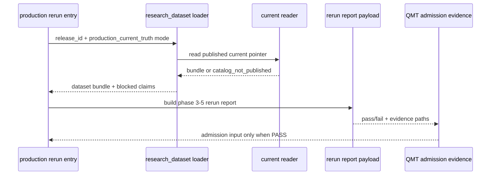

# LLD: CR018-S08 — published current truth 研究重跑

本文档定义 published current truth 下的阶段三到阶段五核心研究重跑入口、research dataset 读取门控、重跑报告结构与 QMT admission evidence 输入。`confirmed=true`、S07 current reader smoke 合同未冻结、无 published release 或未获后续运行授权时，不得执行真实长任务、provider fetch、真实 lake write 或 QMT 操作。

## 1. Goal

创建 `experiments/production_current_truth_rerun.py`、`reports/production_current_truth/README.md`、`tests/test_cr018_production_current_truth_rerun.py`，并修改 `engine/research_dataset.py`，使 production rerun 只能使用 published release current truth，输出 release-bound pass/fail、差异摘要、benchmark / PIT / tradability / adjustment / blocked claims 证据，作为 S09 QMT admission 的硬前置输入。

## 2. Requirements（Functional / Non-Functional）

### 2.1 Functional

- production rerun entry 必须要求 `release_id`、strategy set、research phase list、research adjustment policy 和 benchmark policy。
- 未 published release、catalog current pointer 缺失、P0 required_missing、candidate path 或 proxy input 均必须 blocked。
- research dataset loader 必须只读 S07 published current reader 输出；不得直接读 provider raw、未发布 candidate、proxy baseline 或真实私有 lake 路径。
- rerun report 必须记录 `release_id`、release scope、as_of_trade_date、benchmark、PIT universe、tradability、adjustment_policy、blocked claims、旧 proxy / fixed-snapshot 对比和 pass/fail。
- S08 未 PASS 时，输出给 QMT admission 的 allowed 次数必须为 0。
- 报告写入不得覆盖旧报告；必须使用 run / release scoped 输出约定或 README 中的结构说明。

### 2.2 Non-Functional

- 安全：`provider_fetch=0`、`lake_write=0`、`QMT operation=0`、`credential_read=0`。
- 可审计：报告字段与 evidence path 可被 CP7 静态 / fixture 检查，差异摘要保留旧 baseline 限制。
- 可维护：`engine/research_dataset.py` 只新增 production current truth loader gate，不接管数据湖 publish / rollback。
- 可测试：fixture-only 合同测试覆盖 blocked path 和报告字段，不运行真实长任务。

## 3. 模块拆分与职责

| 模块 / 文件组 | 职责 | 说明 |
|---|---|---|
| `experiments/production_current_truth_rerun.py` | 创建 production rerun 入口、参数合同、blocked path 和报告组装流程 | primary；不执行真实长任务，不启动 QMT |
| `engine/research_dataset.py` | 修改 research dataset loader，增加 production current truth 读取门控和 metadata | shared；只读 published current pointer |
| `reports/production_current_truth/README.md` | 创建报告结构说明、字段清单、旧报告不覆盖规则和 blocked claims 口径 | primary docs |
| `tests/test_cr018_production_current_truth_rerun.py` | 创建 fixture-only 合同测试 | primary test；覆盖未 published、candidate/proxy blocked、报告字段和安全计数 |

## 4. 代码结构与文件影响范围

| 动作 | 文件路径 | 变更内容 |
|---|---|---|
| 创建 | `experiments/production_current_truth_rerun.py` | 定义 release-bound research rerun entry、配置校验、blocked reasons、report payload 和 admission evidence 输出 |
| 修改 | `engine/research_dataset.py` | 增加 `production_current_truth` realism mode / loader gate，禁止 candidate/proxy/provider/raw fallback |
| 创建 | `reports/production_current_truth/README.md` | 定义 rerun report 目录、字段、旧 baseline 对比、blocked claims 和不覆盖旧报告规则 |
| 创建 | `tests/test_cr018_production_current_truth_rerun.py` | 验证未 published、candidate/proxy blocked、报告字段覆盖、S08 fail 阻断 QMT admission 和安全计数 |

## 5. 数据模型与持久化设计

本 Story 不写真实 lake、不覆盖旧报告、不执行真实 rerun。实现阶段只允许创建报告结构说明、fixture 输出和 dry-run / contract payload；真实 production rerun 需要 published release 和后续运行授权。

| 对象 / 字段 | 类型 | 约束 | 说明 |
|---|---|---|---|
| `ProductionRerunRequest.release_id` | string | 必填、必须指向 published current pointer | 缺失或未 publish 返回 `catalog_not_published` |
| `ProductionRerunRequest.strategy_set` | list[string] | 非空 | 阶段三到阶段五核心研究集合 |
| `ProductionRerunRequest.research_phases` | list[enum] | 覆盖 phase_3 / phase_4 / phase_5 | 缺 phase 返回 `research_phase_missing` |
| `CurrentTruthDatasetBundle` | mapping | 必须含 release metadata、lineage、quality/readiness、blocked claims | 由 `engine/research_dataset.py` 返回 |
| `ProductionRerunReport.status` | enum | `pass|fail|blocked` | S09 admission 只消费 PASS |
| `ProductionRerunReport.diff_summary` | mapping | 必须含 old proxy / fixed baseline 对比 | 不把旧 baseline 当生产结论 |
| `AdmissionEvidenceInput` | mapping | `release_id`、rerun status、blocked claims、evidence paths | S09 QMT gate 输入 |
| `SafetyCounters` | mapping | provider_fetch、lake_write、QMT operation、credential_read 均为 0 | CP7 证据 |

## 6. API / Interface 设计

| 接口 / 入口 | 输入 | 输出 | 调用方 | 说明 |
|---|---|---|---|---|
| `production_current_truth_rerun_entry` | `release_id`、strategy set、research phases、policies | `ProductionRerunReport` 或 blocked reason | CLI / experiment runner / tests | 测试 T-S08-01 至 T-S08-04 覆盖 |
| `load_research_dataset_current_truth` | `release_id`、realism mode、dataset group、quality policy | `CurrentTruthDatasetBundle` 或 `required_missing` | rerun entry、research builder | 测试 T-S08-02 / T-S08-03 覆盖 |
| `build_rerun_report_payload` | dataset bundle、research results fixture、old baseline fixture | report payload、diff summary、blocked claims | report writer | 测试 T-S08-04 / T-S08-05 覆盖 |
| `build_qmt_admission_evidence` | rerun report status、release_id、blocked claims | `AdmissionEvidenceInput` 或 blocked | S09 admission gate | 测试 T-S08-06 覆盖 |
| `old_report_overwrite_guard` | target report path / run id | overwrite allowed=false 或 unique output target | report docs / tests | 测试 T-S08-07 覆盖 |

错误暴露使用稳定枚举：`catalog_not_published`、`candidate_input_forbidden`、`proxy_input_forbidden`、`required_missing`、`research_phase_missing`、`rerun_failed`、`qmt_admission_blocked_by_rerun`、`old_report_overwrite_forbidden`、`provider_fetch_forbidden`、`lake_write_forbidden`。

## 7. 核心处理流程

1. 调用方传入 `ProductionRerunRequest`，必须包含 published `release_id`、strategy set、phase list 和 policies。
2. rerun entry 调用 research dataset loader，loader 通过 S07 current reader 合同读取 published current pointer。
3. loader 检查 release 是否 published；未 publish 返回 `catalog_not_published`。
4. loader 检查输入来源；candidate path、proxy baseline 或 provider raw 直接作为 production 输入时返回 forbidden。
5. loader 返回 release-bound dataset bundle、lineage、quality/readiness 和 blocked claims。
6. rerun entry 对阶段三到阶段五核心研究生成 fixture / dry-run report payload；真实长任务需后续授权。
7. report payload 写入 release_id、benchmark、PIT、tradability、adjustment、blocked claims、旧 baseline 对比和 pass/fail。
8. `build_qmt_admission_evidence` 只在 rerun report `status=pass` 时输出 admission input；fail / blocked 时 QMT admission allowed 次数为 0。



## 8. 技术设计细节

- 关键规则：`production_current_truth` realism mode 必须强制 `release_id` 绑定；缺 release 或未 publish 时 fail fast。
- 数据来源边界：candidate、proxy、provider raw 和真实私有 lake path 不能作为 production rerun 输入。
- 报告结构：README 定义 release-scoped report layout、字段清单和 old baseline comparison；不得覆盖旧实验报告。
- 依赖复用：复用 S07 current reader smoke / published pointer 合同；复用主 HLD §32 的 research builder -> data lake reader 契约。
- 兼容性处理：现有 `engine/research_dataset.py` 的 exploratory / proxy 路径保留，但在 production mode 下返回 forbidden。
- 图示类型选择：存在 rerun entry、research loader、reader、report、QMT evidence 五个模块，本 LLD 使用时序图。

## 9. 安全与性能设计

| 维度 | 设计措施 | 验证方式 |
|---|---|---|
| 安全 | production rerun 不读取 `.env`、credential、provider raw、未发布 candidate 或真实私有 lake path | T-S08-08 安全计数测试 |
| 安全 | S08 不启动 QMT，不生成真实 broker intent | T-S08-06 / T-S08-08 |
| 性能 | fixture-only 合同测试不运行阶段三到阶段五真实长任务；真实 rerun 另需运行授权 | 测试 runtime 和 safety counters |
| 可审计 | report payload 强制 release_id、benchmark、PIT、tradability、adjustment、blocked claims 和 evidence_paths | T-S08-04 / T-S08-05 |

## 10. 测试设计

| 测试场景 | 前置条件 | 操作 | 预期结果 | 验证方式 |
|---|---|---|---|---|
| T-S08-01 未 published release blocked | catalog fixture 无 published pointer | 调用 rerun entry | `status=blocked`，reason=`catalog_not_published` | `uv run --python 3.11 pytest -q tests/test_cr018_production_current_truth_rerun.py` |
| T-S08-02 candidate 输入 blocked | request 带 candidate path | 调用 loader | `candidate_input_forbidden`，allowed 次数为 0 | pytest |
| T-S08-03 proxy 输入 blocked | request 带 proxy baseline 作为 production input | 调用 loader | `proxy_input_forbidden` | pytest |
| T-S08-04 报告字段完整 | published bundle fixture | 构建 report payload | release_id、benchmark、PIT、tradability、adjustment、blocked claims 全覆盖 | pytest |
| T-S08-05 旧 baseline 只作对比 | old proxy/fixed fixture 存在 | 构建 diff summary | old baseline 不进入 production allowed claim | pytest |
| T-S08-06 S08 fail 阻断 QMT admission | rerun report fail | 构建 admission evidence | QMT admission allowed 次数为 0 | pytest |
| T-S08-07 不覆盖旧报告 | target report fixture 已存在 | 调用 overwrite guard | `old_report_overwrite_forbidden` 或 unique target | pytest |
| T-S08-08 真实操作计数为 0 | fixture-only run | 统计 counters | `provider_fetch=0`、`lake_write=0`、`QMT operation=0`、`credential_read=0` | pytest |

## 11. 实施步骤

| TASK-ID | 动作 | 目标文件 | 详细描述 | 对应测试 |
|---|---|---|---|---|
| CR018-S08-T1 | 创建 | `experiments/production_current_truth_rerun.py` | 定义 published release 研究重跑入口、参数校验、blocked reasons、report payload 和 admission evidence | T-S08-01 / T-S08-04 / T-S08-06 |
| CR018-S08-T2 | 修改 | `engine/research_dataset.py` | 增加 production current truth 读取门控、release metadata、candidate/proxy forbidden path | T-S08-02 / T-S08-03 |
| CR018-S08-T3 | 创建 | `reports/production_current_truth/README.md` | 定义重跑报告结构、字段、旧 baseline 对比和不覆盖旧报告规则 | T-S08-04 / T-S08-05 / T-S08-07 |
| CR018-S08-T4 | 创建 | `tests/test_cr018_production_current_truth_rerun.py` | 编写 fixture-only 合同测试，覆盖未 published、candidate/proxy blocked、报告字段、QMT blocked 和安全计数 | T-S08-01 至 T-S08-08 |

## 12. 风险、难点与预研建议

### 12.1 实现灰区与取舍记录

| Clarification ID | 问题 | 选项与推荐 | 决策 / 答案 | 影响面 | 证据 | 重访条件 |
|---|---|---|---|---|---|---|
| 无 | 无需新增 clarification queue item；Story、HLD、ADR 已规定 production rerun 必须后置于 published current truth，candidate/proxy 不得作为 production input | 推荐按 ADR-066 实现 release-bound rerun + QMT admission evidence | 已按 handoff 与 Story 输入采用 | 接口 / 文件 owner / 测试 / 安全 / 跨 Story 契约 | `process/HLD.md#32`、`process/HLD-DATA-LAKE.md#19.13`、`process/ARCHITECTURE-DECISION.md#ADR-066` | 若 CP5 用户允许 candidate 预重跑，只能作为独立 audit / Spike，不能命名 production rerun |

| 风险 / 难点 | 影响 | 缓解措施 / 预研建议 |
|---|---|---|
| candidate 或 proxy 混入 production rerun | current truth 与旧 baseline 混淆 | production mode 下 exact forbidden path 和测试覆盖 |
| 真实长任务被误触发 | 超出 Story 授权和运行成本 | LLD 和测试限定 fixture-only；真实 rerun 另需运行授权 |
| old report 被覆盖 | 丢失历史基线和审计链 | overwrite guard 与 README 目录规则 |
| S07 contract 未冻结 | loader 无法判定 published current pointer | 开发门控等待 S07 current reader smoke 合同稳定 |

### OPEN / Spike 跟踪

| ID | 类型（OPEN / Spike） | 问题 | 下一动作 | 责任方 |
|---|---|---|---|---|
| 无 | N/A | 无阻断项；真实 production rerun 运行授权不在本 LLD 范围内 | CP5 后由 meta-po 根据 published release 和运行授权处理 | meta-po / user |

## 13. 回滚与发布策略

- 发布方式：全量 CP5 人工确认后，等待 S07 runtime 合同冻结，再按 CR018-W4 实现 S08；实现阶段只交付离线合同、fixture 测试和报告结构。
- 回滚触发条件：candidate/proxy 被允许作为 production input、未 published release 仍运行、旧报告被覆盖、provider fetch / lake write / QMT operation / credential read 计数非 0，或与 ADR-066 冲突。
- 回滚动作：回退 S08 对 `experiments/production_current_truth_rerun.py`、`engine/research_dataset.py`、`reports/production_current_truth/README.md` 和测试的变更；保留 LLD / CP5 记录并交回 meta-po。

## 14. Definition of Done

- [ ] 14 个章节全部填写完成。
- [ ] production rerun entry、research dataset loader、report payload 和 admission evidence 接口明确。
- [ ] candidate/proxy/provider/raw/未发布 release 的 blocked path 可测试。
- [ ] report 字段覆盖 release_id、benchmark、PIT、tradability、adjustment、blocked claims、old baseline diff 和 pass/fail。
- [ ] S08 未 PASS 时 QMT admission allowed 次数为 0。
- [ ] provider_fetch、lake_write、QMT operation、credential_read 计数均为 0。
- [ ] `confirmed=true` 后仍需遵守 Story DAG、文件 owner 和真实操作授权边界；真实 production rerun 另需 published release 和运行授权。

## 人工确认区

> **CP5 — Story LLD 可实现性门**
> meta-dev 先写入 `process/checks/CP5-CR018-S08-production-current-truth-research-rerun-LLD-IMPLEMENTABILITY.md` 自动预检结果。
> meta-po 收齐 CR018 全部目标 Story 的 LLD、CP4 自动预检摘要和 CP5 自动预检后，再生成并提示用户审查 `checkpoints/CP5-ALL-STORIES-LLD-BATCH.md`。
> 用户统一确认全部目标 Story 的 LLD 后，仍需满足当前 Wave、依赖门控、文件所有权门控和运行授权方可进入实现或真实运行。

**CP5 checklist 摘要**：

| # | 检查项 | 状态 | 证据 |
|---|---|---|---|
| 1 | LLD 覆盖 AC | 待检查 | 第 2 / 10 / 14 节 |
| 2 | 与 HLD / ADR 一致 | 待检查 | 第 3 / 8 / 12 节 |
| 3 | 文件影响范围明确 | 待检查 | 第 4 / 11 节 |
| 4 | 接口契约完整 | 待检查 | 第 6 节 |
| 5 | 测试与 dev_gate 可计算 | 待检查 | 第 10 / 14 节 |
| 6 | clarification queue 已收敛 | 待检查 | 第 12.1 节 / 无新增 LCQ |

**人工确认回复**：

请直接回复以下任一整行：

```text
approve
修改: <具体修改点>
reject
```

**人工审查结果回填**：

- 结论：`approved`
- 审查人：user
- 审查时间：2026-05-29T08:25:12+08:00
- 修改意见：无；用户已同意 CP5 批次。
- 风险接受项：只允许离线 / fixture / dry-run 实现；真实抓取、写湖、publish、凭据读取和 QMT 仍 blocked。
