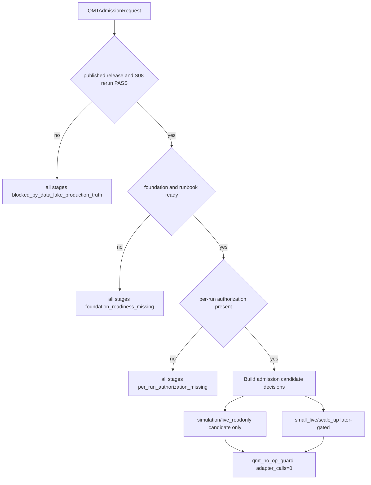

# LLD: CR018-S09 — QMT admission 后置边界

本文档定义 QMT simulation、live_readonly、small_live、scale_up 在数据湖 publish 与 S08 production rerun PASS 之后的 admission boundary、blocked reason、later-gated 口径和 no-op guard。S09 只输出 admission gate 合同和 blocked reason，不启动真实 QMT，不发单、不撤单、不查账户、不写账户，不解锁 small_live 或 scale_up。

## 1. Goal

修改 `trading/stage_gate.py`、`trading/live_admission.py`、`docs/QMT-SIMULATION-LIVE-RUNBOOK.md` 并创建 `tests/test_cr018_qmt_admission_after_data_lake.py`，使 QMT admission 明确消费 S08 rerun PASS、release readiness、CR015/CR016 foundation / runbook 和 per-run authorization，同时在 S08 未 PASS 或真实操作未授权时保持所有 QMT stage blocked；small_live 与 scale_up 保持 `later-gated`。

## 2. Requirements（Functional / Non-Functional）

### 2.1 Functional

- QMT admission gate 必须要求 `release_id`、S08 rerun status、release readiness status、foundation / runbook readiness 和 authorization summary。
- S08 未 PASS、release 未 publish、release readiness fail、foundation / runbook 缺失或 authorization 缺失时，simulation / live_readonly / small_live / scale_up 的 allowed 次数必须为 0。
- simulation 和 live_readonly 即便形成 admission candidate，也不得在本 Story 中触发真实 QMT startup、adapter call、broker order、cancel、account query 或 account write。
- small_live 和 scale_up 必须保持 `later-gated`，本 Story 不提供解锁路径。
- blocked reason 必须稳定输出，至少覆盖 `blocked_by_data_lake_production_truth`、`research_rerun_not_passed`、`release_readiness_not_passed`、`per_run_authorization_missing`、`later_gated_real_operation`。
- runbook 必须写明 CR015/CR016/CR017 foundation 不替代 S08 PASS，S09 不授权真实 QMT operation。

### 2.2 Non-Functional

- 安全：`real_qmt_startup=0`、`order=0`、`cancel=0`、`account_query=0`、`account_write=0`、`adapter_calls=0`。
- 可审计：每个 stage 输出 allowed/blocked、blocked reason、required evidence 和 next gate。
- 可维护：QMT 技术 foundation 与数据湖 production truth admission 分层，避免把 foundation pass 当 strategy admission。
- 可测试：fixture-only gate test，不需要 QMT 环境或 Windows 节点。

## 3. 模块拆分与职责

| 模块 / 文件组 | 职责 | 说明 |
|---|---|---|
| `trading/stage_gate.py` | 修改 stage gate，增加 S08 PASS、release readiness、authorization 和 later-gated 判断 | shared；当前 Story 不触发 adapter |
| `trading/live_admission.py` | 修改 admission decision，输出 simulation/live_readonly/small_live/scale_up blocked reason | shared；small_live / scale_up 保持 later-gated |
| `docs/QMT-SIMULATION-LIVE-RUNBOOK.md` | 修改 runbook，写入数据湖 publish + rerun PASS 前置和真实 QMT operation blocked | shared；与 CR016 文档合并需串行 |
| `tests/test_cr018_qmt_admission_after_data_lake.py` | 创建 fixture-only gate test | primary；验证所有 stage blocked、later-gated 和 adapter calls=0 |

## 4. 代码结构与文件影响范围

| 动作 | 文件路径 | 变更内容 |
|---|---|---|
| 修改 | `trading/stage_gate.py` | 增加 `data_lake_production_truth_gate` / equivalent gate，消费 S08 rerun PASS、release readiness 和 authorization |
| 修改 | `trading/live_admission.py` | 输出 stage-level allowed/blocked decision、blocked reason、later-gated 标记和 no-op evidence |
| 修改 | `docs/QMT-SIMULATION-LIVE-RUNBOOK.md` | 写入 publish + S08 rerun PASS 前置、foundation 不替代 admission、真实 QMT operation blocked 和 small_live / scale_up later-gated |
| 创建 | `tests/test_cr018_qmt_admission_after_data_lake.py` | 验证 S08 未 PASS 时四阶段均 blocked、small_live/scale_up later-gated、真实 QMT 操作计数为 0 |

## 5. 数据模型与持久化设计

本 Story 无新增持久化写入授权，不写 broker lake、不写账户、不写真实 QMT 状态。实现阶段只允许返回 admission decision / blocked reason 的 in-memory 或 fixture 结构。

| 对象 / 字段 | 类型 | 约束 | 说明 |
|---|---|---|---|
| `QMTAdmissionRequest.release_id` | string | 必填 | 关联 S08 report 和 release readiness |
| `QMTAdmissionRequest.rerun_status` | enum | 必须为 `pass` 才能进入下一 gate | fail / blocked 时所有 stage blocked |
| `QMTAdmissionRequest.release_readiness_status` | enum | `pass|fail|blocked` | 非 pass 时 blocked |
| `QMTAdmissionRequest.foundation_status` | mapping | CR015/CR016/CR017 foundation / runbook evidence | 只作为必要非充分条件 |
| `QMTAdmissionRequest.authorization` | mapping / null | per-run authorization summary | 缺失时 `per_run_authorization_missing` |
| `StageGateDecision.stage` | enum | `simulation|live_readonly|small_live|scale_up` | 四阶段逐项输出 |
| `StageGateDecision.allowed` | bool | 本 Story 在真实操作层保持 false | admission candidate 不等于 operation |
| `StageGateDecision.blocked_reason` | enum list | 稳定枚举 | CP7 和 runbook 消费 |
| `StageGateDecision.later_gated` | bool | small_live / scale_up 必须为 true | 保留 later-gated |
| `QMTForbiddenOperationEvidence` | counters | startup/order/cancel/account/adapter 均为 0 | 安全验收 |

## 6. API / Interface 设计

| 接口 / 入口 | 输入 | 输出 | 调用方 | 说明 |
|---|---|---|---|---|
| `qmt_admission_gate_after_data_lake` | release_id、S08 status、release readiness、foundation status、authorization | stage decisions、blocked reasons、no-op evidence | stage gate、tests | 测试 T-S09-01 至 T-S09-05 覆盖 |
| `stage_boundary_policy` | requested stage | `StageGateDecision`、`later_gated` | live_admission、runbook | small_live / scale_up 始终 later-gated，测试 T-S09-04 覆盖 |
| `qmt_no_op_guard` | adapter call intent | forbidden operation evidence | admission gate、tests | 保证 adapter calls=0，测试 T-S09-05 覆盖 |
| `runbook_data_lake_prerequisite_section` | markdown runbook | required headings / statements | docs test | 测试 T-S09-06 覆盖 |

错误暴露使用稳定枚举：`blocked_by_data_lake_production_truth`、`release_not_published`、`research_rerun_not_passed`、`release_readiness_not_passed`、`foundation_readiness_missing`、`per_run_authorization_missing`、`later_gated_real_operation`、`qmt_operation_forbidden`。

## 7. 核心处理流程

1. 调用方构造 `QMTAdmissionRequest`，输入 release_id、S08 rerun status、release readiness、foundation / runbook readiness 和 authorization summary。
2. gate 先检查 release 与 S08 rerun；未 publish、S08 非 PASS 或 release readiness 非 PASS 时，四个 stage 全部返回 blocked。
3. gate 检查 CR015/CR016/CR017 foundation / runbook；缺失时返回 `foundation_readiness_missing`，但 foundation pass 不会绕过 S08 PASS。
4. gate 检查 per-run authorization；缺失时返回 `per_run_authorization_missing`。
5. `stage_boundary_policy` 对 simulation、live_readonly、small_live、scale_up 逐项输出 decision；small_live 和 scale_up 始终包含 `later_gated_real_operation`。
6. `qmt_no_op_guard` 捕获任何 adapter call intent，输出 `qmt_operation_forbidden` 和 counters=0；本 Story 不调用 QMT API。
7. runbook 写入数据湖 publish + S08 PASS 前置、foundation 不替代 admission 和真实 QMT operation blocked。



## 8. 技术设计细节

- 关键规则：S08 PASS 是 QMT admission runtime 前置；CR015/CR016/CR017 foundation 只能作为必要条件，不能替代 S08 PASS。
- later-gated 规则：small_live 和 scale_up 在所有输入通过时仍保持 `later_gated=true`，需要后续独立 stage gate / CR 才能解除。
- no-op 规则：本 Story 的 stage decision 只输出 admission candidate 或 blocked reason，不调用 QMT / XtQuant / adapter / broker API。
- 依赖选择与复用点：复用 CR016 stage naming、runbook approval gate 和 CR015 foundation evidence；复用 S08 `AdmissionEvidenceInput`。
- 兼容性处理：若现有 `live_admission.py` 已有 live_readonly / small_live 判定，S09 在其前置门增加 data lake production truth check。
- 图示类型选择：存在 stage gate、live admission、runbook、no-op guard 和多 stage 分支，本 LLD 使用流程图。

## 9. 安全与性能设计

| 维度 | 设计措施 | 验证方式 |
|---|---|---|
| 安全 | S09 不启动 QMT、不发单、不撤单、不查账户、不写账户；adapter calls=0 | T-S09-05 安全计数测试 |
| 安全 | small_live / scale_up 保持 later-gated，不因 S08 PASS 自动解锁 | T-S09-04 stage boundary test |
| 性能 | gate 只处理小型 evidence payload 和 stage list，按 stage 数线性执行 | fixture gate test |
| 可审计 | blocked reason、later-gated、required evidence 和 next gate 稳定输出 | T-S09-01 至 T-S09-06 |

## 10. 测试设计

| 测试场景 | 前置条件 | 操作 | 预期结果 | 验证方式 |
|---|---|---|---|---|
| T-S09-01 S08 未 PASS 阻断四阶段 | rerun status=`fail` 或 `blocked` | 调用 admission gate | simulation/live_readonly/small_live/scale_up allowed 次数为 0 | `uv run --python 3.11 pytest -q tests/test_cr018_qmt_admission_after_data_lake.py` |
| T-S09-02 release readiness fail 阻断 | readiness status=`fail` | 调用 gate | blocked reason 含 `release_readiness_not_passed` | pytest |
| T-S09-03 foundation 不替代 S08 PASS | foundation PASS、S08 fail | 调用 gate | 仍 blocked by data lake truth | pytest |
| T-S09-04 small_live / scale_up later-gated | S08 PASS fixture、authorization fixture 存在 | 调用 stage boundary policy | small_live / scale_up `later_gated=true` 且 unlock 次数为 0 | pytest |
| T-S09-05 真实 QMT 操作计数为 0 | 任意 admission request | 调用 no-op guard | startup/order/cancel/account_query/account_write/adapter_calls 均为 0 | pytest |
| T-S09-06 runbook 写明前置和禁止事项 | runbook markdown fixture | 扫描 required statements | 包含 publish + S08 PASS 前置、foundation 不替代、真实操作 blocked | pytest |

## 11. 实施步骤

| TASK-ID | 动作 | 目标文件 | 详细描述 | 对应测试 |
|---|---|---|---|---|
| CR018-S09-T1 | 修改 | `trading/stage_gate.py` | 增加 S08 PASS、release readiness、foundation、authorization 和 no-op guard 的 admission gate | T-S09-01 至 T-S09-05 |
| CR018-S09-T2 | 修改 | `trading/live_admission.py` | 输出四阶段 blocked reason、later-gated 标记和 admission candidate / no-op evidence | T-S09-01 / T-S09-04 / T-S09-05 |
| CR018-S09-T3 | 修改 | `docs/QMT-SIMULATION-LIVE-RUNBOOK.md` | 写入数据湖 publish + rerun PASS 前置、foundation 不替代和真实 QMT operation blocked | T-S09-06 |
| CR018-S09-T4 | 创建 | `tests/test_cr018_qmt_admission_after_data_lake.py` | 编写 fixture-only gate test，覆盖 S08 未 PASS、later-gated 和真实操作计数为 0 | T-S09-01 至 T-S09-06 |

## 12. 风险、难点与预研建议

### 12.1 实现灰区与取舍记录

| Clarification ID | 问题 | 选项与推荐 | 决策 / 答案 | 影响面 | 证据 | 重访条件 |
|---|---|---|---|---|---|---|
| 无 | 无需新增 clarification queue item；Story、HLD、ADR 已规定 S09 只能输出 admission gate 和 blocked reason，不授权真实 QMT operation，small_live / scale_up later-gated | 推荐按 ADR-066 保持 QMT 后置和 no-op guard | 已按 handoff 与 Story 输入采用 | 接口 / 文件 owner / 测试 / 安全 / 跨 Story 契约 / 文档 | `process/HLD.md#32`、`process/HLD-DATA-LAKE.md#19.13`、`process/ARCHITECTURE-DECISION.md#ADR-066`、Story dev_gate | 若用户要求 QMT technical smoke 先行，必须另起 no-strategy Spike 或 per-run 授权，不在 S09 扩围 |

| 风险 / 难点 | 影响 | 缓解措施 / 预研建议 |
|---|---|---|
| QMT foundation pass 被误用为 simulation approve | 绕过 published truth 和 S08 rerun | gate 顺序强制先检查 S08 PASS，测试覆盖 foundation 不替代 |
| S08 PASS 被误解为真实操作授权 | 可能启动真实 QMT | no-op guard、authorization missing blocked、真实操作计数测试 |
| small_live / scale_up 被提前解锁 | 资金放大风险 | `later_gated=true` 强制输出，unlock 次数为 0 |
| shared 文件冲突 | 与 CR015/CR016 修改 `stage_gate.py`、`live_admission.py` 和 runbook 冲突 | CP5 后按文件 owner 串行合并 |

### OPEN / Spike 跟踪

| ID | 类型（OPEN / Spike） | 问题 | 下一动作 | 责任方 |
|---|---|---|---|---|
| 无 | N/A | 无阻断项；QMT technical smoke 或真实 operation 需要后续独立授权 / Spike | CP5 后仍保持 no-op，除非 meta-po 发起新授权流程 | meta-po / user |

## 13. 回滚与发布策略

- 发布方式：全量 CP5 人工确认后，等待 S08 PASS evidence 合同冻结，并确认 CR015/CR016 foundation / runbook 输入可读，再按 CR018-W4 串行实现 S09。
- 回滚触发条件：S08 未 PASS 时任何 stage allowed、small_live / scale_up `later_gated=false`、adapter calls 非 0、出现真实 QMT startup/order/cancel/account 操作、runbook 暗示自动授权，或与 ADR-066 冲突。
- 回滚动作：回退 S09 对 `trading/stage_gate.py`、`trading/live_admission.py`、`docs/QMT-SIMULATION-LIVE-RUNBOOK.md` 和测试的变更；保留 LLD / CP5 记录并交回 meta-po。

## 14. Definition of Done

- [ ] 14 个章节全部填写完成。
- [ ] QMT admission gate 明确消费 release_id、S08 PASS、release readiness、foundation status 和 authorization。
- [ ] S08 未 PASS 时 simulation/live_readonly/small_live/scale_up allowed 次数为 0。
- [ ] small_live / scale_up 保持 `later-gated`，解锁次数为 0。
- [ ] 真实 QMT startup、order、cancel、account_query、account_write、adapter_calls 均为 0。
- [ ] runbook 写明 publish + S08 rerun PASS 前置、foundation 不替代和真实操作 blocked。
- [ ] `confirmed=true` 后仍需遵守 Story DAG、文件 owner 和真实操作授权边界；真实 QMT operation 仍被 blocked。

## 人工确认区

> **CP5 — Story LLD 可实现性门**
> meta-dev 先写入 `process/checks/CP5-CR018-S09-qmt-simulation-admission-boundary-after-data-lake-LLD-IMPLEMENTABILITY.md` 自动预检结果。
> meta-po 收齐 CR018 全部目标 Story 的 LLD、CP4 自动预检摘要和 CP5 自动预检后，再生成并提示用户审查 `checkpoints/CP5-ALL-STORIES-LLD-BATCH.md`。
> 用户统一确认全部目标 Story 的 LLD 后，仍需满足当前 Wave、依赖门控、文件所有权门控、S08 PASS、per-run authorization 和 later-gated 规则；本 Story 不授权真实 QMT operation。

**CP5 checklist 摘要**：

| # | 检查项 | 状态 | 证据 |
|---|---|---|---|
| 1 | LLD 覆盖 AC | 待检查 | 第 2 / 10 / 14 节 |
| 2 | 与 HLD / ADR 一致 | 待检查 | 第 3 / 8 / 12 节 |
| 3 | 文件影响范围明确 | 待检查 | 第 4 / 11 节 |
| 4 | 接口契约完整 | 待检查 | 第 6 节 |
| 5 | 测试与 dev_gate 可计算 | 待检查 | 第 10 / 14 节 |
| 6 | clarification queue 已收敛 | 待检查 | 第 12.1 节 / 无新增 LCQ |
| 7 | later-gated 与 QMT blocked 保留 | 待检查 | 第 2 / 5 / 8 / 10 / 14 节 |

**人工确认回复**：

请直接回复以下任一整行：

```text
approve
修改: <具体修改点>
reject
```

**人工审查结果回填**：

- 结论：`approved`
- 审查人：user
- 审查时间：2026-05-29T08:25:12+08:00
- 修改意见：无；用户已同意 CP5 批次。
- 风险接受项：只允许离线 / fixture / dry-run 实现；真实抓取、写湖、publish、凭据读取和 QMT 仍 blocked。
