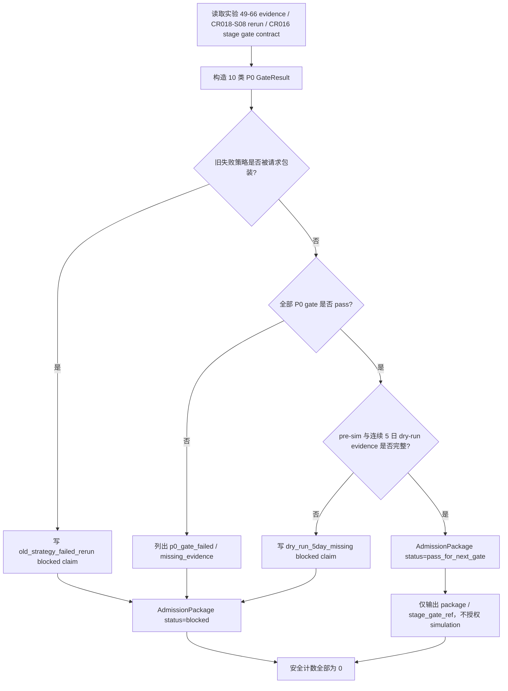

# LLD: CR019-S01 - 阶段六 admission gate 与 package 合同

> 本文档是 CR019-S01 的低层设计。当前 `confirmed=true`，已通过 CP5 全量 LLD 统一确认；实现仍需 Story 卡片 `implementation_allowed=true`、依赖和文件所有权门控满足；不得改依赖、启动服务、读取凭据、执行真实 QMT / provider / lake / broker / publish / simulation / live 操作。

## 1. Goal

创建阶段六多因子 admission gate 与 admission package 的实现蓝图：未来实现阶段创建 `engine/stage6_admission.py` 和 `tests/test_cr019_stage6_admission_gate.py`，按受控范围接入 `trading/stage_gate.py` 并生成 `reports/stage6_admission/**` schema 占位，使实验 49-66 的 P0 gate、旧失败策略 blocked evidence、解除条件、pre-sim 与连续 5 个真实交易日 dry-run evidence 可被后续 benchmark、endpoint gate 和文档 Story 消费。

## 2. Requirements（Functional / Non-Functional）

### 2.1 Functional

- 覆盖实验 49-66 的数据、因子、组合、交易现实性、成本、benchmark、稳健性、消融、冻结、pre-sim 和连续 5 个真实交易日 dry-run gate，gate 字段覆盖率为 100%。
- 任一 P0 gate 未通过时输出 `admission_status=blocked`，并列出 `blocked_claims`、`missing_evidence`、`unlock_conditions` 和 `next_review_trigger`。
- 既有 production current truth 研究重跑失败策略只能作为 blocked evidence；旧失败策略被标记为 `simulation_ready` 的次数必须为 0。
- `admission_package` 必须包含可供 S02 benchmark policy、S07 run gate 和 S10 docs 消费的稳定字段：`run_id`、`strategy_id`、`research_rerun_ref`、`gate_matrix`、`benchmark_ref`、`dry_run_5day_ref`、`pre_sim_ref`、`stage_gate_ref`、`permission_counters`。
- `reports/stage6_admission/**` 只生成 schema / README 占位，禁止写真实运行报告或覆盖历史证据。

### 2.2 Non-Functional

- 安全：`qmt_api_call`、`provider_fetch`、`lake_write`、`broker_lake_write`、`publish`、`simulation_or_live_run`、`credential_read` 均保持 0。
- 可追溯：每个 gate 字段必须追溯到 Story、HLD §33.1/§33.4/§33.12、ADR-067、CR018-S08 runtime evidence 或 CR016-S04 stage gate 合同。
- 可测试：离线单元测试覆盖 P0 gate fail、旧失败策略 blocked、5 日 dry-run evidence 缺失和安全计数。
- 可维护：gate id、blocked reason 和 unlock condition 使用 exact 常量，不使用模糊匹配。
- 兼容性：`trading/stage_gate.py` 仅增加 admission evidence reference，不改变 CR016 既有 stage gate 语义。

## 3. 模块拆分与职责

| 模块 / 文件组 | 职责 | 说明 |
|---|---|---|
| Admission Gate Contract / `engine/stage6_admission.py` | 定义 gate id、gate result、admission status、blocked claim 和 package schema | 当前 Story 独占 primary；不触发真实运行 |
| Gate Matrix Evaluator / `engine/stage6_admission.py` | 根据实验 49-66 evidence、CR018-S08 rerun result 和 dry-run evidence 计算 pass / blocked | 旧失败策略只能输出 blocked evidence |
| Stage Gate Bridge / `trading/stage_gate.py` | 增加 admission evidence ref 与 blocked reason 汇总入口 | 共享文件，merge owner 为 S01；不得改变既有 CR016 stage 语义 |
| Report Schema Surface / `reports/stage6_admission/**` | 写 admission package schema / README 占位，不写真实报告 | 后续 S02 可追加 benchmark dashboard schema |
| Test Contract / `tests/test_cr019_stage6_admission_gate.py` | 验证 gate 覆盖、blocked path、旧失败策略和安全计数 | fixture-only；不联网、不读凭据、不调用 QMT |

## 4. 代码结构与文件影响范围

| 动作 | 文件路径 | 变更内容 |
|---|---|---|
| 创建 | `engine/stage6_admission.py` | 定义 `Stage6GateId`、`AdmissionStatus`、`GateResult`、`BlockedClaim`、`AdmissionPackage`、gate matrix builder、admission evaluator 和 schema serializer |
| 创建 | `tests/test_cr019_stage6_admission_gate.py` | 新增离线合同测试，覆盖 100% gate 字段、P0 fail blocked、旧失败策略 blocked、5 日 dry-run 缺失和真实操作计数为 0 |
| 修改 | `trading/stage_gate.py` | 增加 admission evidence reference / blocked reason 汇总字段；不得改写既有 CR016 stage 状态机和审批语义 |
| 创建 | `reports/stage6_admission/README.md` | 说明 admission package schema 占位、禁止真实报告写入和 CP5/授权边界 |
| 创建 | `reports/stage6_admission/admission_package_schema.md` | 记录 JSON-ready schema 字段、reason code 和安全计数；不包含真实 run 数据 |

## 5. 数据模型与持久化设计

| 对象 / 字段 | 类型 | 约束 | 说明 |
|---|---|---|---|
| `Stage6GateId` | enum string | 固定 10 类 P0 gate | `data_quality`、`factor_quality`、`portfolio_construction`、`tradability`、`cost_model`、`benchmark_excess`、`robustness`、`ablation`、`freeze_integrity`、`presim_and_5day_dry_run` |
| `GateResult.gate_id` | string | 必须属于 `Stage6GateId` | exact 匹配，不允许未知 gate 默默通过 |
| `GateResult.status` | enum | `pass` / `blocked` / `not_evaluated` | 任一 P0 `blocked/not_evaluated` 使 admission blocked |
| `GateResult.evidence_ref` | string | 必填；脱敏路径或 evidence id | 可指向 CR018-S08 rerun report、实验 49-66 evidence 或 dry-run summary |
| `GateResult.unlock_condition` | string | blocked 时必填 | 写明解除条件，不写“待定” |
| `BlockedClaim.claim_id` | string | exact id | 如 `simulation_ready`、`primary_benchmark_pass`、`qmt_admission_allowed` |
| `BlockedClaim.reason_code` | string | 必填 | 如 `old_strategy_failed_rerun`、`p0_gate_failed`、`dry_run_5day_missing` |
| `AdmissionPackage.admission_status` | enum | `pass` / `blocked` | S01 不直接授权 simulation；pass 也只进入后续 stage gate |
| `AdmissionPackage.permission_counters` | map[string,int] | 默认全 0 | 覆盖 QMT、provider、lake、broker lake、publish、simulation/live |

持久化设计：本 Story 未来实现只创建 Python 合同模块、测试和 schema / README 占位，不新增数据库，不写真实 lake，不写 broker lake，不写真实 admission 运行报告。`reports/stage6_admission/**` 只用于 schema 文档，不作为运行输出目录。

## 6. API / Interface 设计

| 接口 / 入口 | 输入 | 输出 | 调用方 | 说明 |
|---|---|---|---|---|
| `build_stage6_gate_matrix` | `strategy_id`、实验 49-66 evidence dict、CR018-S08 rerun summary、benchmark evidence ref、dry-run evidence refs | `list[GateResult]` | S01 tests、S02 benchmark、S07 run gate | 缺字段返回 `not_evaluated` / blocked reason，不抛裸异常 |
| `evaluate_stage6_admission` | `gate_matrix`、`old_strategy_evidence`、`stage_gate_context` | `AdmissionPackage` | admission workflow、S07、S10 docs | 旧失败策略出现时必须 blocked，`simulation_ready` allowed count 为 0 |
| `serialize_admission_package` | `AdmissionPackage` | JSON-ready dict / schema sample | report schema、tests | 不写真实文件；真实报告写入不在本 Story |
| `attach_admission_ref_to_stage_gate` | `stage_gate_context`、`admission_package_ref`、`admission_status` | 更新后的 stage gate evidence view | `trading/stage_gate.py` 消费方 | 只追加 evidence ref，不改变 stage gate pass / fail 规则 |
| `collect_admission_safety_counters` | 可选 counters dict | normalized counters dict | tests、CP6/CP7 | 未传入时所有禁止操作计数为 0 |

错误模型：`missing_required_gate`、`unknown_gate_id`、`old_strategy_failed_rerun`、`dry_run_5day_missing`、`benchmark_evidence_missing`、`stage_gate_ref_missing`、`real_operation_forbidden`。第 10 节必须覆盖每类关键错误路径。

## 7. 核心处理流程

1. 从 Story / HLD / ADR 抽取固定 gate id 和 blocked claim id。
2. 读取脱敏 evidence 引用，不读取真实 provider、lake、broker、QMT 或凭据。
3. 为每个 P0 gate 生成 `GateResult`；缺字段、未知 gate 或 not evaluated 均 fail closed。
4. 检查旧失败策略是否被包装为 ready；命中时强制 `blocked`。
5. 检查 pre-sim 与连续 5 个真实交易日 dry-run evidence；缺失时 blocked。
6. 输出 `AdmissionPackage` 和 stage gate evidence ref；不执行 simulation，不触发 QMT client。

## 8. 技术设计细节

- 关键规则：`AdmissionPackage.admission_status=pass` 只表示“可进入下一层 stage / run gate 审查”，不表示 simulation ready 或 per-run authorization。
- 旧 production rerun fail 的策略必须进入 `BlockedClaim(reason_code="old_strategy_failed_rerun")`；测试断言 `old_failed_strategy_simulation_ready_count=0`。
- 10 类 gate 使用常量元组或 enum 定义，测试对 Story / ADR 期望集合做 set equality。
- `trading/stage_gate.py` 的修改只增加 admission evidence ref 字段或 helper，不改变 CR016 stage gate 原有状态转换。
- `reports/stage6_admission/**` 只允许 schema 文档；未来真实 report 必须另有运行授权与唯一 run 输出路径。
- 依赖选择：优先标准库 `dataclasses` / `enum` / `typing`；不改 `pyproject.toml` / `uv.lock`。
- 兼容性处理：若上游 CR018-S08 evidence 不存在或状态为 fail，输出 blocked，不 fallback 到 candidate / proxy / old report。
- 图示类型选择：流程图；原因是存在旧失败策略、P0 gate、dry-run evidence 和安全计数多分支。

## 9. 安全与性能设计

| 维度 | 设计措施 | 验证方式 |
|---|---|---|
| 安全 | 不导入 QMT / provider connector，不读取 `.env`，不写 lake / broker lake，不 publish | 单测断言 safety counters 全为 0；静态扫描禁止关键词 |
| 安全 | 旧失败策略只能 blocked，不能 simulation ready | 单测构造 CR018-S08 fail evidence，断言 blocked claim 和 ready count 0 |
| 安全 | 缺任一 P0 gate fail closed | 单测删除 gate 或设为 not_evaluated，断言 admission blocked |
| 性能 | gate matrix 为固定 10 项，O(1) 规模 | 单测在 fixture 中完成，目标运行小于 1 秒 |
| 可追溯 | package 输出 source refs、reason codes、unlock conditions | snapshot / 字段断言 |

## 10. 测试设计

| 测试场景 | 前置条件 | 操作 | 预期结果 | 验证方式 |
|---|---|---|---|---|
| 10 类 gate 覆盖率 100% | 构造完整实验 49-66 evidence fixture | 调用 `build_stage6_gate_matrix` | gate id 集合与 LLD §5 完全一致 | `tests/test_cr019_stage6_admission_gate.py` |
| 任一 P0 gate fail blocked | 将 `cost_model` 或 `tradability` 设为 blocked | 调用 `evaluate_stage6_admission` | `admission_status=blocked`，含 `p0_gate_failed` | pytest 字段断言 |
| 旧失败策略不得 ready | 输入 CR018-S08 fail / old strategy evidence | 调用 `evaluate_stage6_admission` | `simulation_ready` allowed count 为 0，reason=`old_strategy_failed_rerun` | pytest blocked claim 断言 |
| 5 日 dry-run evidence 缺失 | 缺少 5 个连续真实交易日 evidence refs | 构造 package | `admission_status=blocked`，reason=`dry_run_5day_missing` | pytest 字段断言 |
| stage gate ref 只读接入 | 构造 CR016 stage context fixture | 调用 `attach_admission_ref_to_stage_gate` | 新增 ref，不改变既有 stage 状态 | pytest before/after 断言 |
| 禁止真实操作 | 默认测试上下文 | 调用所有 public helpers | QMT/provider/lake/broker/publish/simulation/live/credential counters 全为 0 | pytest counters + import scan |

## 11. 实施步骤

| TASK-ID | 动作 | 目标文件 | 详细描述 | 对应测试 |
|---|---|---|---|---|
| CR019-S01-T1 | 创建 | `engine/stage6_admission.py` | 定义 gate / status / blocked claim / package 数据结构、gate matrix builder、admission evaluator 和 safety counters | 10 类 gate 覆盖率；任一 P0 gate fail blocked；旧失败策略不得 ready；5 日 dry-run evidence 缺失 |
| CR019-S01-T2 | 创建 | `tests/test_cr019_stage6_admission_gate.py` | 编写 fixture-only 合同测试和静态禁区检查 | 全部 S01 测试场景 |
| CR019-S01-T3 | 修改 | `trading/stage_gate.py` | 增加 admission evidence ref / blocked reason 汇总 helper，不改变 CR016 stage gate 语义 | stage gate ref 只读接入；禁止真实操作 |
| CR019-S01-T4 | 创建 | `reports/stage6_admission/README.md`、`reports/stage6_admission/admission_package_schema.md` | 输出 schema / README 占位，声明不含真实 run 数据和不授权 simulation | 禁止真实操作；schema 字段覆盖 review |

## 12. 风险、难点与预研建议

### 12.1 实现灰区与取舍记录

| Clarification ID | 问题 | 选项与推荐 | 决策 / 答案 | 影响面 | 证据 | 重访条件 |
|---|---|---|---|---|---|---|
| 无 | 当前 S01 LLD 未发现阻断性实现灰区 | 推荐按 ADR-067、Story AC 和 CR018-S08 / CR016-S04 只读合同实现；备选为 CP5 修改 gate 字段或转 Spike | 默认决策已由 CP3 approved 和 Story 卡片固化；CP5 approve 即接受本 LLD | 接口 / 文件 owner / 测试 / 安全 / 跨 Story 契约 | `process/HLD.md` §33.1/§33.4/§33.12、ADR-067、Story 卡片 | 用户在 CP5 要求调整 gate 分类、blocked claim 或 dry-run evidence schema |

| 风险 / 难点 | 影响 | 缓解措施 / 预研建议 |
|---|---|---|
| 把 admission pass 误读为 simulation 授权 | 可能绕过 CR016 stage gate 和 per-run authorization | 字段命名和文档写明 pass 只进入下一门控；测试断言 simulation/live counters 为 0 |
| 旧失败策略被包装成新 package | 假 alpha 进入模拟盘申请 | 单独 reason code 和测试覆盖 `old_strategy_failed_rerun` |
| S02 benchmark 字段与 S01 package 漂移 | 后续 dashboard 消费失败 | S01 只定义 `benchmark_ref` 和占位，S02 拥有具体多基准 dashboard schema |
| `reports/stage6_admission/**` 被误用为真实报告目录 | 覆盖或伪造运行证据 | 本 Story 仅创建 schema / README，占位文件中声明无真实 run 数据 |
| 修改 `trading/stage_gate.py` 影响 CR016 语义 | 既有 simulation/live runbook 失真 | 只追加 evidence ref helper，测试验证原 stage 状态不变 |

### OPEN / Spike 跟踪

| ID | 类型（OPEN / Spike） | 问题 | 下一动作 | 责任方 |
|---|---|---|---|---|
| 无 | OPEN | 无阻断性 OPEN；CP5 已通过；实现仍需按 dev_gate 调度 | 等待 meta-po 收齐 CR019-S01..S10 LLD 和 CP5 自动预检 | meta-po / user |

## 13. 回滚与发布策略

- 发布方式：CP5 全量人工确认通过后才允许进入实现；实现仅发布离线合同模块、测试和 schema 占位，不发布真实 admission result。
- 回滚触发条件：任一旧失败策略可得到 `simulation_ready`、P0 gate fail 未 blocked、5 日 dry-run 缺失仍 pass、安全计数非 0、`stage_gate.py` 既有语义被改变。
- 回滚动作：回退 `engine/stage6_admission.py`、`tests/test_cr019_stage6_admission_gate.py`、`trading/stage_gate.py` 中 S01 变更和 `reports/stage6_admission/**` schema 占位；不得删除上游 CR018 / CR016 证据。

## 14. Definition of Done

- [ ] 14 个章节全部填写完成。
- [ ] LLD frontmatter 为 `confirmed=true`、`status=approved`、`cp5_batch=CR019-STAGE6-QMT-BRIDGE-BATCH-A`。
- [ ] 10 类 P0 gate 字段覆盖率为 100%。
- [ ] 任一 P0 gate fail 时 `admission_status=blocked`。
- [ ] 旧失败策略标记为 `simulation_ready` 的次数为 0。
- [ ] 接口设计中的每个入口均在第 10 节有对应测试场景。
- [ ] 异常路径 `missing_required_gate`、`unknown_gate_id`、`old_strategy_failed_rerun`、`dry_run_5day_missing` 有测试入口。
- [ ] `qmt_api_call`、`provider_fetch`、`lake_write`、`broker_lake_write`、`publish`、`simulation_or_live_run`、`credential_read` 均为 0。
- [ ] OPEN / Spike 已清点；无阻断项；CP5 已 approved；实现仍需按 dev_gate 调度。

## 人工确认区

> CP5 自动预检结果：`process/checks/CP5-CR019-S01-stage6-admission-gate-package-LLD-IMPLEMENTABILITY.md`
> CP5 批次人工审查稿：由 meta-po 收齐 CR019-S01..S10 后生成。

**CP5 checklist 摘要**：

| # | 检查项 | 状态 | 证据 |
|---|---|---|---|
| 1 | LLD 覆盖 AC | 待检查 | 第 2 / 10 / 14 节 |
| 2 | 与 HLD / ADR 一致 | 待检查 | 第 3 / 8 / 12 节 |
| 3 | 文件影响范围明确 | 待检查 | 第 4 / 11 节 |
| 4 | 接口契约完整 | 待检查 | 第 6 节 |
| 5 | 测试与 dev_gate 可计算 | 待检查 | 第 10 / 14 节 |
| 6 | clarification queue 已收敛 | 待检查 | 第 12.1 节 |

**人工审查结果回填**：

- 结论：`approved | changes_requested | rejected`
- 审查人：
- 审查时间：
- 修改意见：
- 风险接受项：
