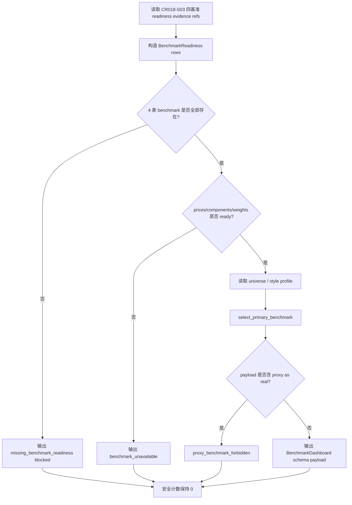

# LLD: CR019-S02 - 多基准看板与 primary benchmark policy

> 本文档是 CR019-S02 的低层设计。当前 `confirmed=true`，已通过 CP5 全量 LLD 统一确认；实现仍需 Story 卡片 `implementation_allowed=true`、依赖和文件所有权门控满足；不得改依赖、读取凭据、执行真实 provider fetch、lake write、publish 或 QMT 操作。

## 1. Goal

创建阶段六 admission 多基准看板与 primary benchmark policy 的实现蓝图：未来实现阶段创建 `engine/benchmark_policy.py` 和 `tests/test_cr019_primary_benchmark_policy.py`，并在 `reports/stage6_admission/benchmark_dashboard_schema.md` 增加 schema 占位，使 HS300、ZZ500、ZZ1000、中证全指四类 benchmark readiness、proxy 禁用和 primary benchmark 选择规则可被 S01 admission package、S09 deferred register 和 S10 文档消费。

## 2. Requirements（Functional / Non-Functional）

### 2.1 Functional

- HS300、ZZ500、ZZ1000、中证全指 4 类 benchmark 字段覆盖率为 100%，至少覆盖价格、成分、权重 readiness、source ref、as-of trade date 和 blocked reason。
- primary benchmark 选择规则必须依据 strategy universe / 风格暴露，输出 deterministic decision，不允许“默认 HS300”覆盖所有策略。
- proxy benchmark 不得写入真实 benchmark 字段；proxy 只允许进入 blocked / comparison-only 字段。
- benchmark unavailable 时 admission dashboard 必须输出 `unavailable` / `blocked`，不得触发 provider fetch、lake write 或 publish。
- 输出 schema 可被 S01 的 `AdmissionPackage.benchmark_ref` 引用，但 S02 不修改 S01 package 核心 gate 语义。

### 2.2 Non-Functional

- 安全：`provider_fetch`、`lake_write`、`publish`、`credential_read`、`qmt_api_call` 均为 0。
- 可追溯：每个 benchmark 字段追溯到 Story、HLD §33.4/§33.6、ADR-067 和 CR018-S03 benchmark readiness。
- 可测试：离线合同测试覆盖四基准完整性、primary 规则、proxy 禁用、unavailable blocked 和安全计数。
- 可维护：benchmark id、style bucket、reason code 使用 exact 常量；不使用模糊匹配决定 primary。
- 兼容性：共享 `reports/stage6_admission/**` 只追加 benchmark dashboard schema，不覆盖 S01 admission package schema。

## 3. 模块拆分与职责

| 模块 / 文件组 | 职责 | 说明 |
|---|---|---|
| Benchmark Policy / `engine/benchmark_policy.py` | 定义 benchmark id、readiness row、primary decision、dashboard schema 和 proxy guard | 当前 Story 独占 primary |
| Primary Selector / `engine/benchmark_policy.py` | 根据 universe / style profile 和 readiness 选择 primary benchmark | 选择规则必须 deterministic，并说明 blocked reason |
| Dashboard Serializer / `engine/benchmark_policy.py` | 输出 JSON-ready benchmark dashboard payload | 不写真实报告，不 publish |
| Report Schema Surface / `reports/stage6_admission/benchmark_dashboard_schema.md` | 记录 dashboard schema 占位 | 与 S01 共享目录；S02 只负责 benchmark schema |
| Test Contract / `tests/test_cr019_primary_benchmark_policy.py` | 验证四基准、primary、proxy 和安全计数 | fixture-only；不联网、不写 lake |

## 4. 代码结构与文件影响范围

| 动作 | 文件路径 | 变更内容 |
|---|---|---|
| 创建 | `engine/benchmark_policy.py` | 定义 `BenchmarkId`、`BenchmarkReadiness`、`BenchmarkDashboard`、`PrimaryBenchmarkDecision`、primary selection 和 proxy guard |
| 创建 | `tests/test_cr019_primary_benchmark_policy.py` | 新增离线合同测试，覆盖四基准字段、primary 选择、proxy 禁用、unavailable blocked 和安全计数 |
| 创建 | `reports/stage6_admission/benchmark_dashboard_schema.md` | 增加 benchmark dashboard schema 占位；不写真实 benchmark 报告 |

## 5. 数据模型与持久化设计

| 对象 / 字段 | 类型 | 约束 | 说明 |
|---|---|---|---|
| `BenchmarkId` | enum string | 固定 4 类 | `hs300`、`zz500`、`zz1000`、`csi_all` |
| `BenchmarkReadiness.benchmark_id` | string | 必须属于 `BenchmarkId` | 未知 benchmark 返回 blocked |
| `BenchmarkReadiness.prices_ready` | bool | 必填 | 指数日行情 readiness |
| `BenchmarkReadiness.components_ready` | bool | 必填 | 历史成分 readiness |
| `BenchmarkReadiness.weights_ready` | bool | 必填 | 历史权重 readiness |
| `BenchmarkReadiness.source_ref` | string | 必填；脱敏 evidence ref | 指向 CR018-S03 readiness evidence，不触发补数 |
| `BenchmarkReadiness.status` | enum | `ready` / `unavailable` / `blocked` | 任一 required 字段缺失则非 ready |
| `PrimaryBenchmarkDecision.primary_benchmark` | string | 仅允许 4 类 id 或 `unresolved` | 根据 universe / style profile 选择 |
| `PrimaryBenchmarkDecision.selection_basis` | list[string] | 必填 | 记录 universe、market-cap tilt、style exposure 等依据 |
| `BenchmarkDashboard.permission_counters` | map[string,int] | 默认全 0 | provider/lake/publish/credential/QMT 操作计数 |

持久化设计：本 Story 未来实现只创建 Python 合同模块、测试和 schema 占位，不新增数据库，不抓取 benchmark，不写真实 lake，不更新 catalog current pointer，不 publish。真实 benchmark readiness 由 CR018-S03 提供，S02 只消费脱敏 readiness 合同。

## 6. API / Interface 设计

| 接口 / 入口 | 输入 | 输出 | 调用方 | 说明 |
|---|---|---|---|---|
| `required_stage6_benchmarks` | 无 | `tuple[BenchmarkId, ...]` | tests、S01、S10 | 固定返回 4 类 benchmark |
| `build_benchmark_readiness` | readiness dict / CR018-S03 evidence refs | `list[BenchmarkReadiness]` | S02 tests、dashboard builder | 不触发 provider fetch；缺失输出 unavailable / blocked |
| `select_primary_benchmark` | `universe_profile`、`style_profile`、`readiness_rows` | `PrimaryBenchmarkDecision` | admission package、docs | 使用 exact 规则选择，无法判定时 `unresolved/blocked` |
| `build_benchmark_dashboard` | readiness rows、primary decision、permission counters | `BenchmarkDashboard` / JSON-ready dict | report schema、S01 reference | 输出四基准和 primary，不写真实文件 |
| `reject_proxy_as_real_benchmark` | `benchmark_payload` | `None` 或 structured error | tests、dashboard builder | proxy 写入 real benchmark 字段时返回 `proxy_benchmark_forbidden` |

错误模型：`missing_benchmark_readiness`、`benchmark_unavailable`、`primary_benchmark_unresolved`、`proxy_benchmark_forbidden`、`unknown_benchmark_id`、`real_operation_forbidden`。第 10 节必须覆盖关键错误路径。

## 7. 核心处理流程

1. 消费 CR018-S03 benchmark readiness 合同，只读取脱敏字段和 evidence ref。
2. 校验 4 类 benchmark exact id 全覆盖；缺失时 fail closed。
3. 校验 prices / components / weights readiness；缺失时输出 unavailable，不触发补数。
4. 根据 universe / style profile 选择 primary benchmark，并记录 selection basis。
5. 执行 proxy guard，禁止代理基准写入真实 benchmark 字段。
6. 输出 dashboard schema payload 和安全计数；不写真实报告，不 publish。

## 8. 技术设计细节

- primary 规则第一版按 deterministic policy：大盘 universe 默认 HS300，中盘 / 中证500增强默认 ZZ500，小盘 / 中证1000增强默认 ZZ1000，全市场 / mixed universe 默认中证全指；若 readiness 不满足则 `blocked` 并列出缺失项。
- `style_profile` 只能补充选择依据，不能覆盖 explicit universe；冲突时输出 `primary_benchmark_unresolved`。
- proxy 字段必须与 real 字段分离：`proxy_benchmark_ref` 只能进入 comparison / blocked note，不得填入 `real_benchmark_id`。
- S02 不拥有 CR018-S03 benchmark 补数逻辑；`benchmark_unavailable` 是正常 blocked path。
- 共享报告目录的 merge order：S01 创建 admission base schema，S02 追加 `benchmark_dashboard_schema.md`；开发阶段按 S01 -> S02 串行合并。
- 依赖选择：使用标准库 `dataclasses` / `enum` / `typing`；不改依赖。
- 图示类型选择：流程图；原因是存在 readiness、primary selection、proxy guard 和 unavailable 分支。

## 9. 安全与性能设计

| 维度 | 设计措施 | 验证方式 |
|---|---|---|
| 安全 | 不调用 provider、不写 lake、不 publish、不读 `.env` | 单测断言 permission counters 全为 0；静态扫描 |
| 安全 | proxy benchmark 禁止写入 real benchmark 字段 | 单测构造 proxy payload，断言 `proxy_benchmark_forbidden` |
| 安全 | benchmark unavailable fail closed | 单测缺 prices/components/weights，断言 dashboard blocked |
| 性能 | 4 类 benchmark 固定规模，O(1) 处理 | fixture-only 单测，目标运行小于 1 秒 |
| 可追溯 | dashboard 输出 source refs、selection basis、blocked reason | snapshot / 字段断言 |

## 10. 测试设计

| 测试场景 | 前置条件 | 操作 | 预期结果 | 验证方式 |
|---|---|---|---|---|
| 四基准字段覆盖率 100% | 构造 HS300/ZZ500/ZZ1000/中证全指 readiness fixture | 调用 `required_stage6_benchmarks` / `build_benchmark_readiness` | 4 类 exact id 和 prices/components/weights 字段齐全 | `tests/test_cr019_primary_benchmark_policy.py` |
| primary 规则 deterministic | 构造大盘/中盘/小盘/全市场 universe profile | 调用 `select_primary_benchmark` | 分别选择 HS300/ZZ500/ZZ1000/中证全指并记录 basis | pytest 参数化 |
| readiness 缺失 blocked | 删除 ZZ1000 weights 或 source ref | 构造 dashboard | 输出 `benchmark_unavailable`，不触发补数 | pytest 字段断言 |
| proxy 禁止写 real | 输入 proxy payload 写入 real benchmark 字段 | 调用 `reject_proxy_as_real_benchmark` | 返回 `proxy_benchmark_forbidden`，真实字段不接受 | pytest error assertion |
| primary 无法判定 | universe / style 冲突或 primary readiness unavailable | 调用 `select_primary_benchmark` | `primary_benchmark=unresolved` 或 blocked reason | pytest 字段断言 |
| 禁止真实操作 | 默认测试上下文 | 调用全部 public helpers | provider/lake/publish/credential/QMT counters 全为 0 | pytest counters + import scan |

## 11. 实施步骤

| TASK-ID | 动作 | 目标文件 | 详细描述 | 对应测试 |
|---|---|---|---|---|
| CR019-S02-T1 | 创建 | `engine/benchmark_policy.py` | 定义四基准常量、readiness row、primary decision、dashboard builder、proxy guard 和 safety counters | 四基准字段覆盖率；primary 规则 deterministic；readiness 缺失 blocked；proxy 禁止写 real |
| CR019-S02-T2 | 创建 | `tests/test_cr019_primary_benchmark_policy.py` | 编写 fixture-only 合同测试和静态禁区检查 | 全部 S02 测试场景 |
| CR019-S02-T3 | 创建 | `reports/stage6_admission/benchmark_dashboard_schema.md` | 增加 benchmark dashboard schema 占位，不写真实 report | schema 字段 review；禁止真实操作 |

## 12. 风险、难点与预研建议

### 12.1 实现灰区与取舍记录

| Clarification ID | 问题 | 选项与推荐 | 决策 / 答案 | 影响面 | 证据 | 重访条件 |
|---|---|---|---|---|---|---|
| 无 | 当前 S02 LLD 未发现阻断性实现灰区 | 推荐按 ADR-067 和 CR018-S03 readiness 合同消费四基准；备选为 CP5 修改 primary policy 或转 benchmark Spike | 默认决策已由 CP2 Q40、CP3 DQ-07 和 Story 卡片固化；CP5 approve 即接受本 LLD | 接口 / 文件 owner / 测试 / 安全 / 跨 Story 契约 | `process/HLD.md` §33.4/§33.6、ADR-067、CR018-S03 verified Story | 用户在 CP5 要求调整 primary benchmark 选择规则或 benchmark 列表 |

| 风险 / 难点 | 影响 | 缓解措施 / 预研建议 |
|---|---|---|
| 只用 HS300 作为默认 primary | 中小盘 / 全市场策略风格错配 | deterministic policy 按 universe / style 选择；测试覆盖四类 universe |
| proxy benchmark 冒充 real benchmark | 误导 admission pass/fail | proxy guard 和 reason code；测试断言 proxy 写 real 次数为 0 |
| CR018-S03 readiness 缺失时触发补数 | 越过本 Story 权限边界 | unavailable blocked，不 provider fetch / lake write |
| 与 S01 `reports/stage6_admission/**` 文件合并冲突 | schema 覆盖或漂移 | S01/S02 开发串行；S02 只创建 benchmark dashboard schema |
| primary 规则过拟合第一批策略 | 后续策略扩展困难 | selection basis 显式输出，CP5 后如需新 style bucket 另起 CR 或 Story |

### OPEN / Spike 跟踪

| ID | 类型（OPEN / Spike） | 问题 | 下一动作 | 责任方 |
|---|---|---|---|---|
| 无 | OPEN | 无阻断性 OPEN；CP5 已通过；实现仍需按 dev_gate 调度 | 等待 meta-po 收齐 CR019-S01..S10 LLD 和 CP5 自动预检 | meta-po / user |

## 13. 回滚与发布策略

- 发布方式：CP5 全量人工确认通过后才允许进入实现；实现只发布离线 benchmark policy、测试和 schema 占位，不抓取或发布真实 benchmark。
- 回滚触发条件：4 类 benchmark 字段覆盖不足、proxy 可写入 real 字段、primary 选择不 deterministic、benchmark unavailable 触发补数、安全计数非 0。
- 回滚动作：回退 `engine/benchmark_policy.py`、`tests/test_cr019_primary_benchmark_policy.py` 和 `reports/stage6_admission/benchmark_dashboard_schema.md`；不得回退或覆盖 S01 admission schema、CR018-S03 benchmark evidence。

## 14. Definition of Done

- [ ] 14 个章节全部填写完成。
- [ ] LLD frontmatter 为 `confirmed=true`、`status=approved`、`cp5_batch=CR019-STAGE6-QMT-BRIDGE-BATCH-A`。
- [ ] HS300、ZZ500、ZZ1000、中证全指 4 类 benchmark 字段覆盖率为 100%。
- [ ] primary benchmark 选择规则有 universe / 风格依据，并可 deterministic 验证。
- [ ] proxy benchmark 写入真实 benchmark 字段次数为 0。
- [ ] 接口设计中的每个入口均在第 10 节有对应测试场景。
- [ ] 异常路径 `missing_benchmark_readiness`、`benchmark_unavailable`、`primary_benchmark_unresolved`、`proxy_benchmark_forbidden` 有测试入口。
- [ ] `provider_fetch`、`lake_write`、`publish`、`credential_read`、`qmt_api_call` 均为 0。
- [ ] OPEN / Spike 已清点；无阻断项；CP5 已 approved；实现仍需按 dev_gate 调度。

## 人工确认区

> CP5 自动预检结果：`process/checks/CP5-CR019-S02-primary-benchmark-dashboard-LLD-IMPLEMENTABILITY.md`
> CP5 批次人工审查稿：由 meta-po 收齐 CR019-S01..S10 后生成。

**CP5 checklist 摘要**：

| # | 检查项 | 状态 | 证据 |
|---|---|---|---|
| 1 | LLD 覆盖 AC | 待检查 | 第 2 / 10 / 14 节 |
| 2 | 与 HLD / ADR 一致 | 待检查 | 第 3 / 8 / 12 节 |
| 3 | 文件影响范围明确 | 待检查 | 第 4 / 11 节 |
| 4 | 接口契约完整 | 待检查 | 第 6 节 |
| 5 | 测试与 dev_gate 可计算 | 待检查 | 第 10 / 14 节 |
| 6 | clarification queue 已收敛 | 待检查 | 第 12.1 节 |

**人工审查结果回填**：

- 结论：`approved | changes_requested | rejected`
- 审查人：
- 审查时间：
- 修改意见：
- 风险接受项：
