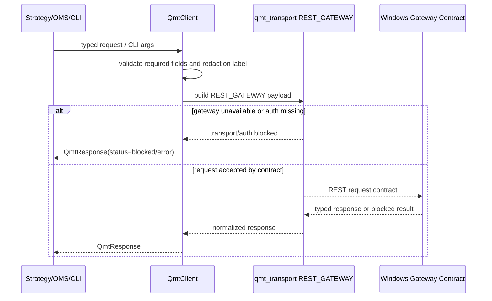

# LLD: CR019-S03 - QMT C 侧 Python client 与薄 CLI 合同

> 本文档是 CR019-S03 的低层设计。当前 `confirmed=true`，已通过 CP5 全量 LLD 统一确认；实现仍需 Story 卡片 `implementation_allowed=true`、依赖和文件所有权门控满足；不得改依赖、启动服务、读取凭据、导入 `xtquant`、执行真实 QMT / broker / simulation / live 操作。

## 1. Goal

创建 local_backtest C 侧 QMT Python client 与薄 CLI 的实现蓝图：未来实现阶段创建 `trading/qmt_client.py`、`trading/qmt_cli.py` 和 `tests/test_cr019_qmt_cside_client_cli.py`，并按受控范围扩展 `trading/qmt_transport.py` 的 REST gateway transport enum，使内部策略、OMS、admission 和测试通过类型化 Python client 消费 QMT gateway 合同，CLI 只复用同一 client 做人工 smoke / 运维检查 / 脚本包装。

## 2. Requirements（Functional / Non-Functional）

### 2.1 Functional

- C 侧不得导入或调用 `xtquant`；direct `xtquant` import 次数为 0。
- Python client 是默认主接口，覆盖 health、capabilities、intent validate、market query、account / positions / orders / trades query、simulation/live intent、reconciliation、kill-switch 等 endpoint 类别的 typed request / response / blocked result。
- CLI 100% 调用同一 client contract，不复制 endpoint gate、auth、transport 或 business logic。
- 所有 later-gated endpoint 在缺少 run gate / auth / per-run authorization 时返回 typed blocked result，真实 QMT / broker operation 计数为 0。
- `trading/qmt_transport.py` 只接入 REST gateway transport enum / payload contract，不启动服务、不绑定端口、不读取凭据。

### 2.2 Non-Functional

- 安全：`dependency_change`、`service_start`、`credential_read`、`qmt_operation`、`real_order`、`real_cancel`、`account_query` 均为 0。
- 可追溯：接口形态追溯到 HLD §33.4/§33.9、QMT companion HLD §17.1、ADR-068、ADR-069、CR015-S02 adapter 合同和 CR016-S04 runbook 合同。
- 可测试：离线合同测试覆盖 CLI delegate、typed blocked result、transport enum、forbidden import scan 和 safety counters。
- 可维护：请求 / 响应 / 错误枚举结构化；CLI 输出 JSON summary 和 exit code，不作为内部业务接口。
- 兼容性：不破坏 CR015 `trading/qmt_transport.py` 既有 transport payload / ack 合同。

## 3. 模块拆分与职责

| 模块 / 文件组 | 职责 | 说明 |
|---|---|---|
| C-side Client / `trading/qmt_client.py` | 定义 typed request、typed response、blocked result、client 方法和 endpoint category | 当前 Story primary；不导入 `xtquant` |
| Thin CLI / `trading/qmt_cli.py` | 参数解析、调用同一 client、格式化输出和退出码 | 不复制 client 业务逻辑 |
| Transport Contract / `trading/qmt_transport.py` | 增加 REST gateway transport kind / payload metadata / transport error enum | 共享文件；merge owner 为 S03 |
| Test Contract / `tests/test_cr019_qmt_cside_client_cli.py` | 验证 client / CLI / transport / forbidden import / blocked result | fixture-only；不启动服务 |

## 4. 代码结构与文件影响范围

| 动作 | 文件路径 | 变更内容 |
|---|---|---|
| 创建 | `trading/qmt_client.py` | 定义 `QmtClient`、request / response dataclass、`QmtBlockedResult`、endpoint methods、safety counters 和 redaction label 字段 |
| 创建 | `trading/qmt_cli.py` | 定义 thin CLI wrapper、参数解析、client 调用、JSON/text 输出和 exit code mapping |
| 修改 | `trading/qmt_transport.py` | 增加 `REST_GATEWAY` transport enum、REST payload metadata、transport error / timeout contract；不得导入 QMT 或启动服务 |
| 创建 | `tests/test_cr019_qmt_cside_client_cli.py` | 新增离线合同测试，覆盖 CLI 复用 client、C 侧无 xtquant、blocked result、transport enum 和安全计数 |

## 5. 数据模型与持久化设计

| 对象 / 字段 | 类型 | 约束 | 说明 |
|---|---|---|---|
| `QmtEndpointCategory` | enum string | 覆盖 HLD §33.11 类别 | health、capabilities、validate、dry_run、market_query、account_query、positions、orders、trades、simulation_submit、simulation_cancel、live_readonly、live_submit、live_cancel、reconciliation、kill_switch |
| `QmtRequest.run_id` | string | 必填 | 追踪请求来源，不含凭据 |
| `QmtRequest.intent_id` | string | endpoint 涉及 intent 时必填 | 幂等与审计 key |
| `QmtRequest.mode` | enum | shadow / dry_run / mock / simulation / live_readonly / small_live / scale_up | later-gated mode 默认 blocked |
| `QmtRequest.stage` | string | 必填 | 继承 CR016 stage gate 语义 |
| `QmtRequest.authorization_ref` | string | later-gated endpoint 必填 | 只传 reference，不读凭据 |
| `QmtRequest.redaction_label` | string | 必填 | 传递日志脱敏语义 |
| `QmtResponse.status` | enum | `ok` / `blocked` / `transport_error` / `auth_error` / `validation_error` | 所有错误结构化 |
| `QmtBlockedResult.reason_code` | string | blocked 时必填 | 如 `gateway_unavailable`、`auth_required`、`stage_gate_missing`、`per_run_authorization_missing` |
| `QmtClientSafetyCounters` | map[string,int] | 默认全 0 | dependency/service/credential/QMT/order/cancel/account counters |

持久化设计：本 Story 不新增数据库，不写配置文件，不保存 token / secret / pairing code，不写 broker lake。client 只接收配置对象或显式参数；任何 secret storage、pairing 领取和 HMAC scope 由 CR019-S05 设计。

## 6. API / Interface 设计

| 接口 / 入口 | 输入 | 输出 | 调用方 | 说明 |
|---|---|---|---|---|
| `QmtClient.health` | optional timeout / request context | `QmtResponse` | CLI、tests、ops smoke | 不触达真实 QMT；gateway 不可达时 typed transport blocked |
| `QmtClient.capabilities` | schema version / context | `QmtResponse` | admission、CLI、docs | endpoint 可见不等于授权 |
| `QmtClient.validate_intent` | `QmtRequest` with intent payload | `QmtResponse` | OMS、admission dry-run | 只做 schema / policy validation |
| `QmtClient.query_market` | market request | `QmtResponse` | research / ops | 不写 research lake，不 provider fetch |
| `QmtClient.query_account_like` | account / positions / orders / trades category | `QmtResponse` | later-gated consumers | 默认 blocked unless live_readonly+authorization |
| `QmtClient.submit_order_intent` | simulation / live intent request | `QmtResponse` | OMS / run gate | 缺 gate 或 authorization 时 blocked，real order=0 |
| `QmtClient.reconcile` | `run_id` / reconciliation context | `QmtResponse` | reconciliation workflow | 不写真实 broker lake |
| `QmtClient.kill_switch` | reason / operator ref | `QmtResponse` | ops workflow | 未授权仅 blocked incident candidate |
| `run_qmt_cli` | argv、client factory | process result / exit code | `trading/qmt_cli.py` tests / user shell | CLI 只解析参数并调用 client |

错误模型：`transport_unavailable`、`timeout`、`auth_required`、`auth_failed`、`stage_gate_missing`、`per_run_authorization_missing`、`endpoint_not_supported`、`invalid_request`、`redaction_required`、`real_operation_forbidden`。第 10 节必须覆盖关键错误路径。

## 7. 核心处理流程

1. 调用方构造 typed request 或 CLI args。
2. CLI 解析参数后调用相同 `QmtClient` 方法，不做业务判断。
3. Client 校验 run_id、stage、mode、redaction label、authorization ref 和 endpoint category。
4. Client 构造 REST gateway payload 并交给 transport contract。
5. transport unavailable、auth 缺失、gate 缺失或 later-gated endpoint 均返回 typed blocked result。
6. safety counters 保持真实操作为 0；不启动服务、不导入 `xtquant`。

## 8. 技术设计细节

- C 侧模块禁止 `xtquant` import；测试用 AST / text scan 验证 `trading/qmt_client.py`、`trading/qmt_cli.py` 和相关 transport 段。
- Client 方法可先以 endpoint category + generic request payload 组织，后续 S06 冻结完整 endpoint matrix 时细化每类 request schema；本 Story 先确保 typed blocked result 和 client / CLI 结构稳定。
- CLI exit code 建议：0 = ok / allowed dry-run result，2 = validation error，3 = blocked，4 = auth error，5 = transport error；CLI 输出 JSON 默认包含 `status`、`reason_code`、`endpoint`、`run_id`、`redaction_status`。
- `trading/qmt_transport.py` 增加 `REST_GATEWAY` 只是合同枚举和 payload metadata，不引入 HTTP 客户端依赖、不启动服务；真实网络调用如需启用，必须由后续 Story / 授权控制。
- S03 不拥有 pairing/HMAC secret 生成；仅保留 `client_id_ref`、timestamp、nonce、signature header slots，具体 HMAC 由 S05。
- S03 不拥有 gateway lifecycle；S04 定义 bind / firewall / command / heartbeat。
- 依赖选择：优先标准库；不得改 `pyproject.toml` / `uv.lock`。
- 图示类型选择：时序图；原因是 CLI / client / transport / gateway contract 存在跨模块调用链。

## 9. 安全与性能设计

| 维度 | 设计措施 | 验证方式 |
|---|---|---|
| 安全 | C 侧禁止 `xtquant`、凭据读取、服务启动、真实 QMT / broker 操作 | 静态 import scan；safety counters 全 0 |
| 安全 | CLI 只调用 client，不能复制业务逻辑或绕过 gate | fake client 注入测试，断言 CLI call path |
| 安全 | later-gated endpoint 默认 typed blocked | 单测覆盖 account / simulation / live blocked |
| 性能 | client 合同只做 dataclass / dict 校验，O(1) endpoint routing | fixture-only 单测，目标运行小于 1 秒 |
| 可观测 | 每个 response 含 endpoint、run_id、reason_code、redaction_status | snapshot / 字段断言 |

## 10. 测试设计

| 测试场景 | 前置条件 | 操作 | 预期结果 | 验证方式 |
|---|---|---|---|---|
| C 侧无 `xtquant` import | 目标文件存在 | 扫描 `trading/qmt_client.py`、`trading/qmt_cli.py`、`qmt_transport.py` 新增段 | import / call 次数为 0 | `tests/test_cr019_qmt_cside_client_cli.py` |
| CLI 100% 复用 client | 注入 fake client | 调用 `run_qmt_cli(["health"])` / `["capabilities"]` | fake client 被调用；CLI 不自行构造业务结果 | pytest monkeypatch / fake |
| typed blocked result 稳定 | 缺 gateway / auth / stage gate | 调用 health / capabilities / query / submit intent | 返回结构化 status/reason_code，不抛裸异常 | pytest 字段断言 |
| transport enum 接入 | `qmt_transport.py` 新增 REST_GATEWAY | 构造 transport payload | payload 含 endpoint/mode/stage/redaction label | pytest contract assertion |
| later-gated endpoint 默认 blocked | account / simulation / live 请求缺 authorization | 调用 client 方法 | account_query/real_order/real_cancel=0，reason=`per_run_authorization_missing` | pytest counters |
| 禁止真实操作 | 默认测试上下文 | 调用全部 public helpers 和 CLI | dependency/service/credential/QMT/order/cancel/account counters 全 0 | pytest counters + static scan |

## 11. 实施步骤

| TASK-ID | 动作 | 目标文件 | 详细描述 | 对应测试 |
|---|---|---|---|---|
| CR019-S03-T1 | 创建 | `trading/qmt_client.py` | 定义 typed request / response / blocked result、client 方法、error enum、safety counters 和 redaction fields | typed blocked result 稳定；later-gated endpoint 默认 blocked；禁止真实操作 |
| CR019-S03-T2 | 创建 | `trading/qmt_cli.py` | 定义 thin CLI wrapper、参数解析、输出格式和退出码，全部调用同一 client | CLI 100% 复用 client；禁止真实操作 |
| CR019-S03-T3 | 修改 | `trading/qmt_transport.py` | 增加 REST_GATEWAY transport enum / payload metadata / transport error contract，不接真实 QMT | transport enum 接入；C 侧无 `xtquant` import |
| CR019-S03-T4 | 创建 | `tests/test_cr019_qmt_cside_client_cli.py` | 编写 fixture-only 合同测试和静态禁区检查 | 全部 S03 测试场景 |

## 12. 风险、难点与预研建议

### 12.1 实现灰区与取舍记录

| Clarification ID | 问题 | 选项与推荐 | 决策 / 答案 | 影响面 | 证据 | 重访条件 |
|---|---|---|---|---|---|---|
| 无 | 当前 S03 LLD 未发现阻断性实现灰区 | 推荐按 ADR-068/069 冻结 Python client 主接口 + thin CLI；备选为 CP5 修改 CLI-first 或 Python-only | 默认决策已由 CP3 DQ-01/DQ-02 和 Story 卡片固化；CP5 approve 即接受本 LLD | 接口 / 文件 owner / 测试 / 安全 / 跨 Story 契约 | `process/HLD.md` §33.4/§33.9、`process/HLD-QMT-TRADING.md` §17.1、ADR-068/069 | 用户在 CP5 要求改 C 侧接口形态或 CLI 职责 |

| 风险 / 难点 | 影响 | 缓解措施 / 预研建议 |
|---|---|---|
| CLI 复制业务逻辑 | 内部调用与 CLI 分叉 | fake client 注入测试；CLI 只做 args / format / exit code |
| C 侧误导入 `xtquant` | WSL 直接触达 Windows QMT 能力 | 静态 import scan + forbidden counter |
| REST transport 被误实现为真实网络调用 | 可能触发服务连接或凭据需求 | S03 仅定义 transport enum / payload；真实网络行为由后续授权控制 |
| HMAC 字段被误当授权 | 绕过 S05/S07 | S03 只保留 header slots；auth pass 不等于 run gate pass |
| endpoint matrix 在 S03 与 S06 重复定义 | 合同漂移 | S03 定义 client 形态和 generic category；S06 拥有完整 endpoint matrix 明细 |

### OPEN / Spike 跟踪

| ID | 类型（OPEN / Spike） | 问题 | 下一动作 | 责任方 |
|---|---|---|---|---|
| 无 | OPEN | 无阻断性 OPEN；CP5 已通过；实现仍需按 dev_gate 调度 | 等待 meta-po 收齐 CR019-S01..S10 LLD 和 CP5 自动预检 | meta-po / user |

## 13. 回滚与发布策略

- 发布方式：CP5 全量人工确认通过后才允许进入实现；实现只发布 C 侧离线 client / CLI / transport contract 和测试，不启动 gateway，不真实调用 QMT。
- 回滚触发条件：出现 `xtquant` import、CLI 绕过 client、later-gated endpoint 未 blocked、真实操作计数非 0、`qmt_transport.py` 既有 CR015 合同被破坏、依赖文件被修改。
- 回滚动作：回退 `trading/qmt_client.py`、`trading/qmt_cli.py`、`trading/qmt_transport.py` 中 S03 变更和 `tests/test_cr019_qmt_cside_client_cli.py`；不得回退 CR015 adapter / transport 已验证合同。

## 14. Definition of Done

- [ ] 14 个章节全部填写完成。
- [ ] LLD frontmatter 为 `confirmed=true`、`status=approved`、`cp5_batch=CR019-STAGE6-QMT-BRIDGE-BATCH-A`。
- [ ] C 侧 `xtquant` import 次数为 0。
- [ ] CLI 业务逻辑复制次数为 0，100% 调用同一 client contract。
- [ ] health / capabilities / query / order intent / simulation-live 请求均有 typed blocked result。
- [ ] 接口设计中的每个入口均在第 10 节有对应测试场景。
- [ ] 异常路径 `transport_unavailable`、`auth_required`、`stage_gate_missing`、`per_run_authorization_missing` 有测试入口。
- [ ] `dependency_change`、`service_start`、`credential_read`、`qmt_operation`、`real_order`、`real_cancel`、`account_query` 均为 0。
- [ ] OPEN / Spike 已清点；无阻断项；CP5 已 approved；实现仍需按 dev_gate 调度。

## 人工确认区

> CP5 自动预检结果：`process/checks/CP5-CR019-S03-qmt-cside-client-cli-contract-LLD-IMPLEMENTABILITY.md`
> CP5 批次人工审查稿：由 meta-po 收齐 CR019-S01..S10 后生成。

**CP5 checklist 摘要**：

| # | 检查项 | 状态 | 证据 |
|---|---|---|---|
| 1 | LLD 覆盖 AC | 待检查 | 第 2 / 10 / 14 节 |
| 2 | 与 HLD / ADR 一致 | 待检查 | 第 3 / 8 / 12 节 |
| 3 | 文件影响范围明确 | 待检查 | 第 4 / 11 节 |
| 4 | 接口契约完整 | 待检查 | 第 6 节 |
| 5 | 测试与 dev_gate 可计算 | 待检查 | 第 10 / 14 节 |
| 6 | clarification queue 已收敛 | 待检查 | 第 12.1 节 |

**人工审查结果回填**：

- 结论：`approved | changes_requested | rejected`
- 审查人：
- 审查时间：
- 修改意见：
- 风险接受项：
