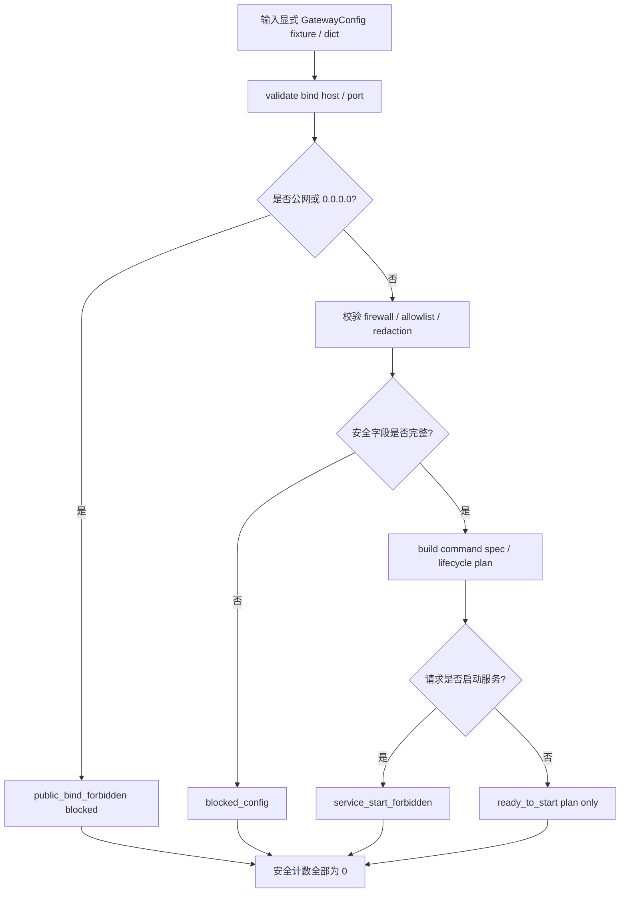

# LLD: CR019-S04 - Windows FastAPI gateway 生命周期与部署合同

> 本文档是 CR019-S04 的低层设计。当前 `confirmed=true`，已通过 CP5 全量 LLD 统一确认；实现仍需 Story 卡片 `implementation_allowed=true`、依赖和文件所有权门控满足；不得改依赖、安装服务、启动 FastAPI、绑定真实端口、读取 Windows 凭据或调用真实 QMT 服务。

## 1. Goal

创建 Windows QMT gateway 生命周期与部署合同的实现蓝图：未来实现阶段创建 `trading/qmt_gateway_config.py`、`trading/qmt_gateway_service.py` 和 `tests/test_cr019_qmt_gateway_lifecycle.py`，并在 `docs/QMT-GATEWAY-INSTALL.md` 写入安装 / 运行边界说明，使 Windows S 侧 gateway 的命令、配置、bind host / port、防火墙、allowlist、heartbeat、生命周期和 fail-closed 行为可被 S05 auth、S06 endpoint matrix、S08 fallback 和 S10 docs 消费。本 Story 仍不启动服务、不安装依赖、不绑定真实端口。

## 2. Requirements（Functional / Non-Functional）

### 2.1 Functional

- gateway command、配置路径、bind host、port、firewall、source allowlist、heartbeat、redaction 字段覆盖率为 100%。
- public exposure 默认 blocked；`public_exposure_allowed_count=0`。
- lifecycle contract 覆盖 `configured`、`blocked_config`、`ready_to_start`、`running_observed`、`unhealthy`、`stopped` 等状态，但本 Story 实现阶段不启动服务。
- 配置校验必须在 bind / firewall / allowlist 不安全时 fail closed，输出 typed blocked reason。
- `docs/QMT-GATEWAY-INSTALL.md` 只写安装 / 运行边界、命令样例和禁止真实凭据示例；不得包含 token、secret、账户号、交易密码或真实私有路径。

### 2.2 Non-Functional

- 安全：`dependency_change`、`service_start`、`port_bind`、`credential_read`、`qmt_api_call`、`real_order`、`real_cancel`、`account_query` 均为 0。
- 可追溯：gateway lifecycle 追溯到 HLD §33.4/§33.9/§33.10、QMT companion HLD §17.1/§17.3、ADR-068。
- 可测试：离线配置合同测试覆盖公网默认 fail、服务启动计数 0、配置字段完整、heartbeat blocked 和文档脱敏。
- 可维护：配置字段使用结构化 dataclass / enum；命令 spec 与实际启动分离。
- 兼容性：S04 消费 S03 client / REST contract，不复制 C 侧 client 业务逻辑；auth 细节由 S05 继续冻结。

## 3. 模块拆分与职责

| 模块 / 文件组 | 职责 | 说明 |
|---|---|---|
| Gateway Config Contract / `trading/qmt_gateway_config.py` | 定义 bind、port、firewall、allowlist、heartbeat、redaction、auth mode 引用和安全校验 | 当前 Story primary；不读取真实凭据 |
| Gateway Lifecycle Contract / `trading/qmt_gateway_service.py` | 定义 service command spec、lifecycle state、health summary、start plan 和 blocked reason | 不启动 FastAPI，不绑定端口 |
| Installation Boundary Doc / `docs/QMT-GATEWAY-INSTALL.md` | 写 Windows gateway 安装 / 运行边界、命令样例、no-real-credential 规则 | 共享文件；merge owner 为 S04 |
| Test Contract / `tests/test_cr019_qmt_gateway_lifecycle.py` | 验证配置字段、公网 fail、服务启动计数 0、文档脱敏和安全计数 | fixture-only；不启动服务 |

## 4. 代码结构与文件影响范围

| 动作 | 文件路径 | 变更内容 |
|---|---|---|
| 创建 | `trading/qmt_gateway_config.py` | 定义 `GatewayBindConfig`、`GatewayFirewallPolicy`、`GatewayAllowlist`、`HeartbeatPolicy`、`RedactionPolicy`、config validator 和 safety counters |
| 创建 | `trading/qmt_gateway_service.py` | 定义 gateway command spec、lifecycle state、health summary、start plan builder 和 blocked reason；不得调用 uvicorn / FastAPI run |
| 创建 | `tests/test_cr019_qmt_gateway_lifecycle.py` | 新增离线合同测试，覆盖 public exposure fail、service_start_count=0、port_bind_count=0、配置字段完整和文档脱敏 |
| 修改 | `docs/QMT-GATEWAY-INSTALL.md` | 增加 gateway 安装 / 运行边界、命令结构和禁止真实凭据声明；不包含真实 secret |

## 5. 数据模型与持久化设计

| 对象 / 字段 | 类型 | 约束 | 说明 |
|---|---|---|---|
| `GatewayBindConfig.bind_host` | string | 必填；默认不得为 `0.0.0.0` 或公网地址 | 公网暴露默认 blocked |
| `GatewayBindConfig.port` | int | 1..65535；默认建议非特权端口 | 仅配置字段，不绑定真实端口 |
| `GatewayBindConfig.public_exposure_allowed` | bool | 默认 false | true 必须另有人工风险接受；本 Story 仍 blocked |
| `GatewayFirewallPolicy.required` | bool | 默认 true | Windows 防火墙规则必须在运行前人工配置 |
| `GatewayAllowlist.sources` | list[string] | 必填；不得为空 | WSL / local subnet / explicit host cidr |
| `HeartbeatPolicy.interval_seconds` | int | >0 | 用于后续 health check 合同 |
| `RedactionPolicy.redacted_fields` | list[string] | 必须包含 secret/token/account/session/password/.env | 日志脱敏边界 |
| `GatewayLifecycleState` | enum string | `configured` / `blocked_config` / `ready_to_start` / `running_observed` / `unhealthy` / `stopped` | S04 只构造状态，不启动 |
| `GatewaySafetyCounters` | map[string,int] | 默认全 0 | dependency/service/port/credential/QMT/order/cancel/account counters |

持久化设计：本 Story 不新增数据库，不写 secret store，不保存 token / pairing code / Windows 凭据。配置读取在实现阶段只允许从显式 dict / sample path abstraction 构造，不读取真实 Windows credential 或 `.env`。文档只含占位变量，不含真实私有路径。

## 6. API / Interface 设计

| 接口 / 入口 | 输入 | 输出 | 调用方 | 说明 |
|---|---|---|---|---|
| `build_gateway_config` | dict / explicit parameters | `GatewayConfig` 或 structured validation error | S04 tests、S05 auth、S10 docs | 不读取真实文件或凭据 |
| `validate_gateway_security` | `GatewayConfig` | `GatewayConfigValidation` | service planner、tests | bind / firewall / allowlist / redaction 不满足时 blocked |
| `build_gateway_command_spec` | `GatewayConfig`、command name | `GatewayCommandSpec` | docs、ops smoke | 只返回命令结构，不执行命令 |
| `plan_gateway_lifecycle` | config validation、requested transition | `GatewayLifecyclePlan` | runbook、tests | 不启动服务；unsafe config 返回 blocked |
| `build_heartbeat_summary` | heartbeat observation fixture | `GatewayHealthSummary` | S08 fallback、tests | heartbeat fail 输出 fail-closed reason |
| `collect_gateway_safety_counters` | optional counters dict | normalized counters dict | tests、CP6/CP7 | 未传入时所有禁止操作计数为 0 |

错误模型：`public_bind_forbidden`、`firewall_policy_missing`、`allowlist_missing`、`invalid_port`、`redaction_policy_incomplete`、`heartbeat_failed`、`service_start_forbidden`、`credential_read_forbidden`、`qmt_call_forbidden`。第 10 节必须覆盖关键错误路径。

## 7. 核心处理流程

1. 从显式 fixture / dict 构造 gateway config，不读取真实凭据或 `.env`。
2. 校验 bind host / port；公网 / `0.0.0.0` 默认 blocked。
3. 校验 firewall required、allowlist 非空和 redaction 字段完整。
4. 生成 command spec 和 lifecycle plan；只返回计划，不执行命令。
5. 若调用方请求 start / bind / credential read，返回 `service_start_forbidden` 或对应 blocked reason。
6. 输出 heartbeat summary contract 和 safety counters，供 S08 fallback 和 S10 docs 消费。

## 8. 技术设计细节

- 本 Story 名称包含 FastAPI gateway，但当前范围是 lifecycle / deployment contract；不得新增 FastAPI / uvicorn 依赖，不在 module import 时依赖 FastAPI。
- `trading/qmt_gateway_service.py` 可以定义 app factory / command spec 的协议字段，但实现阶段不得调用 `uvicorn.run`、`app.run`、socket bind 或 subprocess service start。
- public exposure 判定使用 exact rules：`0.0.0.0`、空 allowlist、公网 CIDR 或 firewall disabled 均 blocked；本 Story 不做网络探测。
- S04 只记录 auth mode 引用位，例如 `auth_mode="pairing_hmac"`；pairing request / HMAC headers / secret lifecycle 由 S05 设计。
- heartbeat 只定义 contract：`last_seen_at`、`latency_ms`、`schema_version`、`redaction_status`、`gateway_version`、`blocked_reason`；不主动连接服务。
- 文档必须使用占位符如 `<windows-host>`、`<port>`、`<config-path>`，不得写真实 host、secret、账户或私有路径。
- 依赖选择：使用标准库 `dataclasses` / `enum` / `ipaddress` / `typing`；不改 `pyproject.toml` / `uv.lock`。
- 图示类型选择：流程图；原因是配置校验、lifecycle plan、启动阻断和安全计数存在多分支。

## 9. 安全与性能设计

| 维度 | 设计措施 | 验证方式 |
|---|---|---|
| 安全 | 公网 / `0.0.0.0` 默认 blocked，allowlist 必填，firewall required | 单测断言 public exposure allowed count 为 0 |
| 安全 | 不启动 FastAPI、不绑定端口、不读取 Windows credential、不调用 QMT | safety counters 全 0；静态扫描禁止启动 / bind / credential patterns |
| 安全 | 文档脱敏，不出现 secret/token/account/password/.env | 文档测试扫描真实凭据模式和占位符规则 |
| 性能 | config validation 为小规模 dataclass / ipaddress 校验 | fixture-only 单测，目标运行小于 1 秒 |
| 可观测 | lifecycle plan / heartbeat summary 输出 blocked reason 和 redaction status | snapshot / 字段断言 |

## 10. 测试设计

| 测试场景 | 前置条件 | 操作 | 预期结果 | 验证方式 |
|---|---|---|---|---|
| 配置字段覆盖率 100% | 构造完整 GatewayConfig fixture | 调用 `build_gateway_config` / `validate_gateway_security` | bind、port、firewall、allowlist、heartbeat、redaction 字段齐全 | `tests/test_cr019_qmt_gateway_lifecycle.py` |
| 公网默认 fail | bind_host=`0.0.0.0` 或 public cidr | 调用 `validate_gateway_security` | `public_bind_forbidden`，allowed count 0 | pytest 字段断言 |
| allowlist / firewall 缺失 blocked | allowlist 为空或 firewall disabled | 调用 validation | `allowlist_missing` / `firewall_policy_missing` | pytest 字段断言 |
| lifecycle 不启动服务 | 请求 start transition | 调用 `plan_gateway_lifecycle` | 返回 `service_start_forbidden`；service_start_count=0 | pytest counters |
| heartbeat fail closed | heartbeat fixture unhealthy | 调用 `build_heartbeat_summary` | status unhealthy / blocked reason，QMT call=0 | pytest字段断言 |
| 文档脱敏 | 生成 / 检查 docs 内容 | 扫描 `docs/QMT-GATEWAY-INSTALL.md` | 无 secret/token/account/password/.env，使用占位符 | pytest text scan |
| 禁止真实操作 | 默认测试上下文 | 调用全部 public helpers | dependency/service/port/credential/QMT/order/cancel/account counters 全 0 | pytest counters + static scan |

## 11. 实施步骤

| TASK-ID | 动作 | 目标文件 | 详细描述 | 对应测试 |
|---|---|---|---|---|
| CR019-S04-T1 | 创建 | `trading/qmt_gateway_config.py` | 定义 bind、firewall、allowlist、heartbeat、redaction config contract、validator 和 safety counters | 配置字段覆盖率；公网默认 fail；allowlist / firewall 缺失 blocked |
| CR019-S04-T2 | 创建 | `trading/qmt_gateway_service.py` | 定义 command spec、lifecycle state、health summary、plan builder 和 forbidden start guard | lifecycle 不启动服务；heartbeat fail closed；禁止真实操作 |
| CR019-S04-T3 | 创建 | `tests/test_cr019_qmt_gateway_lifecycle.py` | 编写 fixture-only 配置合同测试、文档脱敏测试和静态禁区检查 | 全部 S04 测试场景 |
| CR019-S04-T4 | 修改 | `docs/QMT-GATEWAY-INSTALL.md` | 输出安装 / 运行边界和命令占位说明，不包含真实凭据 | 文档脱敏；禁止真实操作 |

## 12. 风险、难点与预研建议

### 12.1 实现灰区与取舍记录

| Clarification ID | 问题 | 选项与推荐 | 决策 / 答案 | 影响面 | 证据 | 重访条件 |
|---|---|---|---|---|---|---|
| 无 | 当前 S04 LLD 未发现阻断性实现灰区 | 推荐按 ADR-068 和 HLD-QMT §17.3 冻结 Windows gateway lifecycle / config 合同；备选为 CP5 修改 bind / firewall / lifecycle 字段 | 默认决策已由 CP3 DQ-01/DQ-04 和 Story 卡片固化；CP5 approve 即接受本 LLD | 接口 / 文件 owner / 测试 / 安全 / 文档 / 跨 Story 契约 | `process/HLD.md` §33.10、`process/HLD-QMT-TRADING.md` §17.1/§17.3、ADR-068 | 用户在 CP5 要求调整 gateway 运行边界或文档职责 |

| 风险 / 难点 | 影响 | 缓解措施 / 预研建议 |
|---|---|---|
| 把 lifecycle contract 误当成已启动 gateway | 误报服务可用或触发真实连接 | `service_start_forbidden` guard；测试断言 start / bind count 为 0 |
| 公网暴露或空 allowlist | gateway 误暴露 | public bind / firewall / allowlist 校验 fail closed |
| 文档写入真实凭据或私有路径 | 泄露风险 | 文档只使用占位符；测试扫描敏感字段 |
| FastAPI 依赖未在当前 Story 授权安装 | 实现阶段不能创建真实运行服务 | 本 Story只定义合同和命令 spec；真实安装 / 启动需后续授权或平台安装 Story |
| S04 与 S05 auth 职责重叠 | pairing/HMAC 字段漂移 | S04 只保留 auth mode 引用；secret、pairing、HMAC 由 S05 |

### OPEN / Spike 跟踪

| ID | 类型（OPEN / Spike） | 问题 | 下一动作 | 责任方 |
|---|---|---|---|---|
| O-CR019-S04-01 | OPEN | 真实 FastAPI runtime 依赖、安装脚本和服务启动授权不在本 Story 范围；当前只能冻结 lifecycle / deployment contract | 在后续实现或单独 CR 中由 meta-po / user 明确授权依赖安装、服务启动 dry-run 或 Windows 节点验证；CP5 仅确认合同 | meta-po / user / 后续 Story |

## 13. 回滚与发布策略

- 发布方式：CP5 全量人工确认通过后才允许进入实现；实现只发布配置 / 生命周期合同、离线测试和文档边界，不启动服务、不绑定端口。
- 回滚触发条件：public exposure allowed、allowlist 空仍 pass、service start 或 port bind 计数非 0、读取凭据、调用 QMT、文档含 secret/token/account/password/.env、依赖文件被修改。
- 回滚动作：回退 `trading/qmt_gateway_config.py`、`trading/qmt_gateway_service.py`、`tests/test_cr019_qmt_gateway_lifecycle.py` 和 `docs/QMT-GATEWAY-INSTALL.md` 中 S04 变更；不得回退 S03 client 合同或后续 auth / endpoint Story 产物。

## 14. Definition of Done

- [ ] 14 个章节全部填写完成。
- [ ] LLD frontmatter 为 `confirmed=true`、`status=approved`、`cp5_batch=CR019-STAGE6-QMT-BRIDGE-BATCH-A`。
- [ ] gateway command、配置路径、bind、firewall、allowlist、heartbeat 字段覆盖率为 100%。
- [ ] public exposure allowed count 为 0。
- [ ] `service_start_count`、`port_bind_count`、`qmt_api_call` 均为 0。
- [ ] `dependency_change` 和 `credential_read` 均为 0。
- [ ] 接口设计中的每个入口均在第 10 节有对应测试场景。
- [ ] 异常路径 `public_bind_forbidden`、`firewall_policy_missing`、`allowlist_missing`、`service_start_forbidden` 有测试入口。
- [ ] OPEN / Spike 已清点；O-CR019-S04-01 为非阻断 OPEN；CP5 已 approved；实现仍需按 dev_gate 调度。

## 人工确认区

> CP5 自动预检结果：`process/checks/CP5-CR019-S04-windows-gateway-lifecycle-deployment-LLD-IMPLEMENTABILITY.md`
> CP5 批次人工审查稿：由 meta-po 收齐 CR019-S01..S10 后生成。

**CP5 checklist 摘要**：

| # | 检查项 | 状态 | 证据 |
|---|---|---|---|
| 1 | LLD 覆盖 AC | 待检查 | 第 2 / 10 / 14 节 |
| 2 | 与 HLD / ADR 一致 | 待检查 | 第 3 / 8 / 12 节 |
| 3 | 文件影响范围明确 | 待检查 | 第 4 / 11 节 |
| 4 | 接口契约完整 | 待检查 | 第 6 节 |
| 5 | 测试与 dev_gate 可计算 | 待检查 | 第 10 / 14 节 |
| 6 | clarification queue 已收敛 | 待检查 | 第 12.1 节 |

**人工审查结果回填**：

- 结论：`approved | changes_requested | rejected`
- 审查人：
- 审查时间：
- 修改意见：
- 风险接受项：
