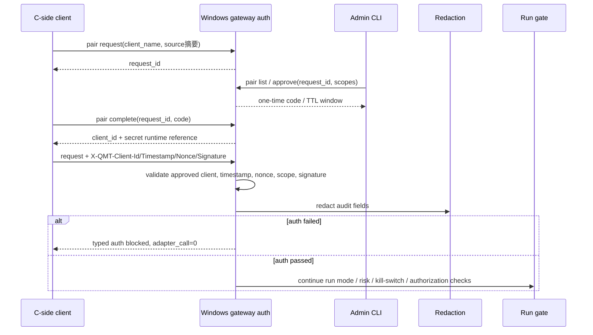

# LLD: CR019-S05 - 配对式 token/HMAC 与日志脱敏合同

本文档只冻结 QMT gateway pairing、HMAC 调用方识别和日志脱敏合同。`confirmed=true` 且 CP5 已统一确认；实现仍需 Story 卡片 implementation_allowed、依赖和文件所有权门控满足；HMAC 通过不授权 simulation / live / account / cancel。

## 1. Goal

创建 `trading/qmt_auth.py` 与 `trading/qmt_redaction.py`，并在 `trading/qmt_gateway_config.py` 接入 auth mode 配置合同，使 pairing request / list / approve / complete、HMAC header 校验、timestamp / nonce / scope 阻断和日志脱敏可被离线测试验证，同时保持真实 secret、凭据读取和真实 QMT 调用次数为 0。

## 2. Requirements（Functional / Non-Functional）

### 2.1 Functional

- pairing 合同必须覆盖 `request`、`list`、`approve`、`complete` 四步，字段覆盖率为 100%。
- HMAC 请求必须携带 `X-QMT-Client-Id`、`X-QMT-Timestamp`、`X-QMT-Nonce`、`X-QMT-Signature`；签名输入固定为 `method + path + body_hash + timestamp + nonce`。
- timestamp 偏移、nonce replay、scope 不足、signature mismatch、client 未批准、pairing code 过期均返回 typed auth blocked，adapter / gateway real operation 调用计数为 0。
- `no-auth` 仅允许本机 debug、fixture 测试或显式临时模式，且仍不能绕过 run gate。
- 日志脱敏必须覆盖 secret、pairing code、token、账户号、session、cookie、交易密码、`.env` 和真实私有路径。
- HMAC pass 直接授权 simulation / live / account / cancel 的次数必须为 0。

### 2.2 Non-Functional

- 安全：不读取 `.env`、凭据文件或真实 secret；不把 secret / pairing code / token 写入日志、测试快照、LLD 或检查点。
- 可审计：auth blocked reason 使用稳定枚举，日志只保留 run_id、intent_id、endpoint、client id hash、latency、blocked reason、redaction_status。
- 可测试：全部验证使用 fixture-only 合同测试，不启动服务、不绑定端口、不调用 QMT / MiniQMT / XtQuant。
- 性能：HMAC 验证按请求体大小线性计算 body hash；nonce replay store 使用 TTL 上限避免无限增长。
- 兼容：auth mode 配置由 CR019-S04 的 `trading/qmt_gateway_config.py` 提供，本 Story 只补充 auth 字段和 fail-closed 规则。

## 3. 模块拆分与职责

| 模块 / 文件组 | 职责 | 说明 |
|---|---|---|
| `trading/qmt_auth.py` | 定义 pairing 状态、HMAC header 校验、timestamp / nonce / scope 阻断、auth blocked result | 当前 Story primary；不读取真实 secret |
| `trading/qmt_redaction.py` | 定义敏感字段和文本脱敏规则、redaction status、日志扫描辅助 | 当前 Story primary |
| `trading/qmt_gateway_config.py` | 暴露 auth mode、debug / fixture no-auth 允许条件、TTL / clock skew / nonce TTL 配置 | shared；由 CR019-S04 创建，当前 Story 为 auth 字段 merge owner |
| `tests/test_cr019_qmt_pairing_hmac_auth.py` | 验证 pairing 四步、HMAC 失败路径、scope 分离、日志脱敏和真实操作计数为 0 | 当前 Story primary test |

## 4. 代码结构与文件影响范围

| 动作 | 文件路径 | 变更内容 |
|---|---|---|
| 创建 | `trading/qmt_auth.py` | 定义 `PairingRequest`、`PairingApproval`、`QmtAuthConfig`、`QmtAuthResult`、`QmtAuthBlockedReason`、HMAC 校验入口和 no-auth fail-closed 规则 |
| 创建 | `trading/qmt_redaction.py` | 定义 `redact_qmt_text()`、`redact_qmt_mapping()`、敏感字段 pattern、redaction report 和禁止泄露扫描 |
| 创建 | `tests/test_cr019_qmt_pairing_hmac_auth.py` | 覆盖 pairing request/list/approve/complete、timestamp skew、nonce replay、scope denied、signature mismatch、脱敏和 HMAC 不授权真实操作 |
| 修改 | `trading/qmt_gateway_config.py` | 增加 auth mode / TTL / nonce / clock skew / explicit temporary no-auth 配置字段；若 CR019-S04 尚未创建该文件，实现阶段必须等待 S04 合同冻结后合并 |

## 5. 数据模型与持久化设计

本 Story 不新增仓库内持久化 secret。pairing registry 在 gateway runtime 或 fixture storage 中表达；仓库只保留类型合同和测试 fixture，不保留真实 client secret、pairing code 或凭据。

| 对象 / 字段 | 类型 | 约束 | 说明 |
|---|---|---|---|
| `PairingRequest.request_id` | str | 唯一、不可含 secret | C 侧 request 后由 S 侧生成或登记 |
| `PairingRequest.client_name` | str | 非空、日志可见但需长度限制 | 人工识别客户端 |
| `PairingRequest.source_ip_hash` | str | 只保存摘要 | 不记录真实私有 IP 明文到审查材料 |
| `PairingRequest.machine_fingerprint_hash` | str | 只保存摘要 | 不记录机器指纹明文 |
| `PairingRequest.created_at/expires_at` | datetime | `expires_at > created_at` | pending request 过期后 hard block |
| `PairingApproval.client_id` | str | 可记录 hash；明文仅用于 header | 日志使用 `client_id_hash` |
| `PairingApproval.secret_ref` | str | 不等于真实 secret；仅运行态引用 | 真实 secret 不进入 repo、LLD、CP5 或日志 |
| `PairingApproval.scopes` | set[str] | endpoint scope 白名单 | HMAC 通过后仍只代表调用方与 scope |
| `QmtHmacHeaders` | mapping | 必含 4 个 `X-QMT-*` header | 缺字段返回 `auth_header_missing` |
| `QmtAuthResult` | dataclass | `allowed: bool`、`blocked_reason`、`client_id_hash`、`scopes`、`adapter_call_allowed=False` | auth 层不产生交易授权 |
| `RedactionReport` | dataclass | `leak_count`、`redaction_status`、`matched_categories` | `leak_count` 必须为 0 才可通过日志测试 |

默认配置作为可修改合同值冻结：`pairing_request_ttl_seconds=600`、`pairing_code_ttl_seconds=300`、`hmac_clock_skew_seconds=300`、`nonce_ttl_seconds=600`。若后续跨网段、多人访问或 live endpoint 默认启用，应通过新 CR 增强 scope、rotation、mTLS / VPN / Windows ACL。

## 6. API / Interface 设计

| 接口 / 入口 | 输入 | 输出 | 调用方 | 说明 |
|---|---|---|---|---|
| `create_pairing_request(client_name, source_context, now)` | client name、source IP / fingerprint 摘要、clock | `PairingRequest` | C 侧 pair request / S 侧 gateway | 测试 T-S05-01 覆盖 |
| `list_pending_pairing_requests(registry, now)` | registry、clock | pending request 摘要列表 | Windows 管理 CLI | 不展示 secret；测试 T-S05-02 覆盖 |
| `approve_pairing_request(request_id, scopes, now)` | request id、scope、clock | `PairingApproval` + 一次性 code 或领取窗口 | Windows 管理 CLI | code 不写日志；测试 T-S05-03 覆盖 |
| `complete_pairing(request_id, code, now)` | request id、一次性 code、clock | client id + secret runtime reference | C 侧 pair complete | secret 不入日志；测试 T-S05-04 覆盖 |
| `validate_hmac_request(method, path, body, headers, required_scope, now)` | HTTP method/path/body、4 个 HMAC header、required scope、clock | `QmtAuthResult` | S 侧 gateway endpoint 前置 | 测试 T-S05-05 至 T-S05-09 覆盖 |
| `validate_auth_mode(config, runtime_context)` | auth mode、debug / fixture / explicit temporary context | `pass|blocked` | gateway config loader | no-auth 默认 fail；测试 T-S05-10 覆盖 |
| `redact_qmt_text(text)` / `redact_qmt_mapping(mapping)` | 日志文本或结构化字段 | redacted payload + `RedactionReport` | gateway logging、tests | 测试 T-S05-11 / T-S05-12 覆盖 |

错误暴露使用稳定枚举：`auth_header_missing`、`auth_pairing_pending`、`auth_pairing_expired`、`auth_client_not_approved`、`auth_timestamp_skew`、`auth_nonce_replay`、`auth_scope_denied`、`auth_signature_mismatch`、`auth_no_auth_not_allowed`、`auth_secret_unavailable`、`redaction_failed`。

## 7. 核心处理流程



1. C 侧发起 pairing request，只提交客户端名和来源摘要，不读取 QMT 凭据。
2. S 侧登记 pending request，管理员通过 list / approve 显式批准。
3. approve 后生成 client id 与 runtime secret reference，并通过一次性 code 或短 TTL 领取窗口完成 complete。
4. 后续请求必须携带 4 个 HMAC header；S 侧先校验 client 状态、timestamp 偏移、nonce replay、scope 和 signature。
5. 任一 auth 检查失败时返回 typed auth blocked，`adapter_call_allowed=false`，真实 QMT / account / order / cancel 调用计数为 0。
6. HMAC 通过后只进入后续 run gate，不直接授权 simulation / live / account / cancel。
7. 所有日志字段先过 `qmt_redaction`，redaction fail 时请求保持 blocked 或审计失败，不输出敏感原文。

## 8. 技术设计细节

- 关键算法 / 规则：签名使用 `HMAC_SHA256(secret, method + path + body_hash + timestamp + nonce)`；比较使用 constant-time compare；body hash 对 canonical bytes 计算，不使用自由文本拼接。
- 依赖选择与复用点：使用 Python 标准库 `hmac`、`hashlib`、`secrets`、`time`；不新增依赖、不改 `pyproject.toml` / `uv.lock`。
- 兼容性处理：`no-auth` 只在 `runtime_context in {local_debug, fixture_test, explicit_temporary}` 且配置显式设置时允许；默认配置为 `pairing_hmac`。
- nonce 策略：按 `client_id_hash + nonce` 存 TTL；重复 nonce 返回 `auth_nonce_replay`；实现阶段可用内存 TTL store，后续多人 / 跨进程需新 CR 增强持久 nonce store。
- scope 策略：scope 只控制 endpoint 可调用类别，不替代 CR019-S07 run gate；`account`、`simulation`、`live`、`cancel` scope 即使存在也必须继续执行运行授权。
- redaction 策略：结构化字段优先按 key exact match；文本日志使用高风险 token / session / code / `.env` / account pattern 扫描；扫描失败时 fail closed。
- 图示类型选择：本 Story 跨 C 侧、S 侧、Admin、Redaction、Run gate 5 个模块，已在第 7 节提供时序图。

## 9. 安全与性能设计

| 维度 | 设计措施 | 验证方式 |
|---|---|---|
| 安全 | 默认 `pairing_hmac`；no-auth 默认 blocked；secret / code / token / account / session / `.env` 进入日志次数为 0；HMAC pass 不授权交易 | T-S05-09 至 T-S05-12 |
| 性能 | HMAC body hash 线性计算；nonce TTL store 有上限；redaction 按字段 exact match 优先 | fixture 单测覆盖 TTL 和扫描路径 |
| 可用性 | pairing 过期、code 过期、registry 缺失时返回 typed blocked，不抛未处理异常 | T-S05-04 / T-S05-08 |
| 可审计 | 日志只记录 client id hash、endpoint、latency、blocked reason、redaction status | T-S05-11 |

## 10. 测试设计

| 测试场景 | 前置条件 | 操作 | 预期结果 | 验证方式 |
|---|---|---|---|---|
| T-S05-01 pairing request 字段完整 | fixture clock/source context | 调用 `create_pairing_request` | request_id、client_name、source_ip_hash、machine_fingerprint_hash、created_at、expires_at 存在 | pytest |
| T-S05-02 pair list 不泄露 secret | pending request 存在 | 调用 `list_pending_pairing_requests` | 列表无 secret / code / token | pytest |
| T-S05-03 approve 生成 client 和 scope | pending request 未过期 | approve scope | 返回 client_id、secret_ref、code TTL；日志无 code 明文 | pytest |
| T-S05-04 complete 过期 hard block | pairing code 过期 | complete | `auth_pairing_expired`；adapter_call=0 | pytest |
| T-S05-05 signature mismatch hard block | approved client | 篡改 body 或 signature | `auth_signature_mismatch`；adapter_call=0 | pytest |
| T-S05-06 timestamp skew hard block | header timestamp 超过 300 秒 | validate | `auth_timestamp_skew`；adapter_call=0 | pytest |
| T-S05-07 nonce replay hard block | nonce 已使用 | 重放同 nonce | `auth_nonce_replay`；adapter_call=0 | pytest |
| T-S05-08 scope 不足 hard block | client 无 endpoint scope | 请求 account/simulation scope | `auth_scope_denied`；adapter_call=0 | pytest |
| T-S05-09 HMAC pass 不授权交易 | HMAC 校验通过 | 请求 simulation/live/account/cancel | auth result 只标识 caller；trade authorization=false | pytest |
| T-S05-10 no-auth 默认 blocked | config 未显式 debug/fixture/temporary | validate auth mode | `auth_no_auth_not_allowed` | pytest |
| T-S05-11 结构化日志脱敏 | mapping 含 secret/code/token/session/account | 调用 `redact_qmt_mapping` | leak_count=0，redaction_status=pass | pytest |
| T-S05-12 文本日志脱敏 | 文本含 `.env`、token、账户号 | 调用 `redact_qmt_text` | 敏感原文出现次数为 0 | pytest |

## 11. 实施步骤

| TASK-ID | 动作 | 目标文件 | 详细描述 | 对应测试 |
|---|---|---|---|---|
| CR019-S05-T1 | 创建 | `trading/qmt_auth.py` | 定义 pairing model、auth config、HMAC 校验、blocked reason、nonce / timestamp / scope fail-closed 语义 | T-S05-01 至 T-S05-10 |
| CR019-S05-T2 | 创建 | `trading/qmt_redaction.py` | 定义结构化与文本脱敏规则、redaction report、禁止泄露扫描 | T-S05-02 / T-S05-03 / T-S05-11 / T-S05-12 |
| CR019-S05-T3 | 创建 | `tests/test_cr019_qmt_pairing_hmac_auth.py` | 写 fixture-only pairing、HMAC、scope、no-auth、redaction 和 no-real-operation 测试 | T-S05-01 至 T-S05-12 |
| CR019-S05-T4 | 修改 | `trading/qmt_gateway_config.py` | 在 CR019-S04 gateway config 合同上接入 auth mode、TTL、clock skew、nonce TTL 和 no-auth 允许条件 | T-S05-10 |

## 12. 风险、难点与预研建议

### 12.1 实现灰区与取舍记录

| Clarification ID | 问题 | 选项与推荐 | 决策 / 答案 | 影响面 | 证据 | 重访条件 |
|---|---|---|---|---|---|---|
| 无 | 本 Story 未发现阻断 LLD 的实现灰区；TTL / skew / nonce 默认值可在 CP5 人工确认中作为 LLD 合同接受或要求修改 | 推荐采用 600/300/300/600 秒默认值；备选为更短 TTL 或后续增强轮换 | 非阻断；不写入 `STATE.md` clarification queue | 接口 / 安全 / 测试 | HLD §33.10.1、HLD-QMT §17.3、ADR-071 | 多人、跨网段或 live endpoint 默认启用时新 CR 增强 |

| 风险 / 难点 | 影响 | 缓解措施 / 预研建议 |
|---|---|---|
| HMAC 被误当作真实交易授权 | 可能绕过 run mode / stage / risk / kill-switch / per-run authorization | Auth result 明确 `trade_authorized=false`；S07 gate 必须二次判定；测试 HMAC pass 后 simulation/live/account/cancel 授权次数为 0 |
| secret / pairing code 泄露 | 凭据暴露和审计失败 | redaction 模块强制扫描，日志只保留 hash/ref；测试 leak_count=0 |
| no-auth 临时模式被误设为默认 | 局域网误调用风险 | 默认 auth mode 为 `pairing_hmac`；no-auth 必须显式 debug / fixture / temporary |
| nonce store 多进程一致性 | 后续真实 gateway 多进程时 replay 防护不足 | 当前第一版冻结接口和 fixture；多进程持久 nonce store 作为后续增强 CR |

### OPEN / Spike 跟踪

| ID | 类型（OPEN / Spike） | 问题 | 下一动作 | 责任方 |
|---|---|---|---|---|
| 无 | N/A | 无阻断 OPEN / Spike；scope rotation / mTLS / VPN / Windows ACL 是后续增强，不阻断本 Story LLD | CP5 统一确认后按本 LLD 实现；跨网段或多人访问时新 CR | meta-po / user |

## 13. 回滚与发布策略

- 发布方式：全量 CP5 人工确认后，按 CR019-W3 串行开发 S05 -> S06 -> S07；仅运行 fixture-only 测试。
- 回滚触发条件：发现 HMAC pass 被用作交易授权、日志泄露 secret / pairing code / token、no-auth 成为默认值、或需要读取真实凭据。
- 回滚动作：回退本 Story 对 `trading/qmt_auth.py`、`trading/qmt_redaction.py`、`trading/qmt_gateway_config.py`、测试文件的实现修改；Story 回到 LLD 修订态，由 meta-po 重新纳入 CP5。

## 14. Definition of Done

- [ ] 14 个章节全部填写完成。
- [ ] pair request / list / approve / complete 四步合同覆盖率为 100%。
- [ ] timestamp 偏移、nonce replay、scope 不足、signature mismatch 均 hard block。
- [ ] secret、pairing code、token、账户号、session、`.env` 日志泄露次数为 0。
- [ ] HMAC pass 直接授权 simulation/live/account/cancel 的次数为 0。
- [ ] `confirmed=true` 后仍需 Story 卡片 `implementation_allowed=true`、依赖和文件所有权门控满足后进入实现。
- [ ] OPEN / Spike 已清点为无阻断项。

## 人工确认区

> **CP5 - Story LLD 可实现性门**
> meta-dev 先写入 `process/checks/CP5-CR019-S05-pairing-hmac-auth-redaction-LLD-IMPLEMENTABILITY.md` 自动预检结果。
> meta-po 收齐 CR019-S01..S10 全部 LLD、CP4 自动预检摘要和 CP5 自动预检后，再生成并提示用户审查 `checkpoints/CP5-ALL-STORIES-LLD-BATCH.md` 或 CR019 对应批次审查稿。
> 用户统一确认全部目标 Story 的 LLD 后，仍需满足当前 Wave、依赖门控、文件所有权门控和 no-real-operation 边界方可进入实现。

**CP5 checklist 摘要**：

| # | 检查项 | 状态 | 证据 |
|---|---|---|---|
| 1 | LLD 覆盖 AC | 待检查 | 第 2 / 10 / 14 节 |
| 2 | 与 HLD / ADR 一致 | 待检查 | 第 3 / 8 / 12 节 |
| 3 | 文件影响范围明确 | 待检查 | 第 4 / 11 节 |
| 4 | 接口契约完整 | 待检查 | 第 6 节 |
| 5 | 测试与 dev_gate 可计算 | 待检查 | 第 10 / 14 节 |
| 6 | clarification queue 已收敛 | 待检查 | 第 12.1 节 |

**人工确认回复**：

请直接回复以下任一整行：

```text
approve
修改: <具体修改点>
reject
```

**人工审查结果回填**：

- 结论：`approved | changes_requested | rejected`
- 审查人：
- 审查时间：
- 修改意见：
- 风险接受项：
