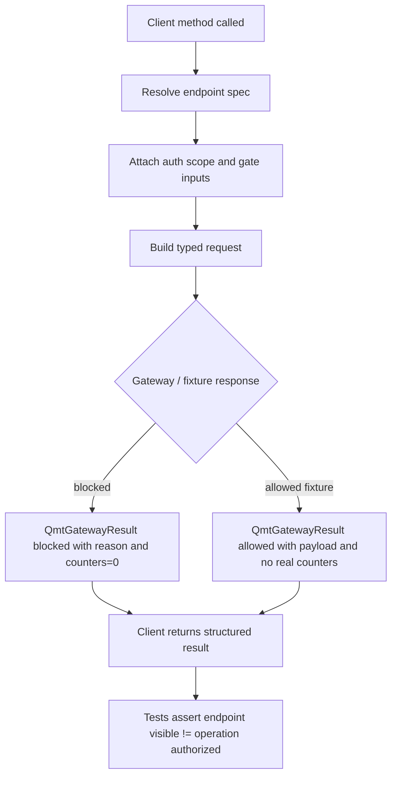

# LLD: CR019-S06 - 完整 QMT endpoint matrix 与 typed blocked result

本文档冻结完整 QMT endpoint matrix、typed allowed / blocked result 和 C 侧 client 消费合同。接口类别完整支持不等于真实 QMT 操作授权；`confirmed=true` 且 CP5 已统一确认；实现仍需 Story 卡片 implementation_allowed、依赖和文件所有权门控满足。

## 1. Goal

创建 `trading/qmt_endpoint_matrix.py` 与 `trading/qmt_gateway_contracts.py`，并在 `trading/qmt_client.py` 接入类型化 endpoint 方法合同，使 health / capabilities、validate / dry-run、行情、账户、持仓、委托、成交、simulation / live、reconciliation、kill-switch 等类别均有稳定 endpoint spec 与 typed blocked result，同时真实 QMT / MiniQMT / XtQuant 调用和 broker lake 写入计数为 0。

## 2. Requirements（Functional / Non-Functional）

### 2.1 Functional

- HLD §33.11 中 endpoint 类别覆盖率必须为 100%。
- 每类 endpoint 至少包含 1 个 typed blocked result case。
- `health` / `capabilities` 可见不提升为 account / order / cancel / simulation / live 授权。
- Endpoint spec 必须显式包含 method、path、client method、required scope、gate inputs、real operation kind、default visibility、blocked reason。
- Auth / HMAC 与 run gate 分离：auth pass 只进入后续 gate，不改变 endpoint 操作授权。
- 真实 QMT / MiniQMT / XtQuant 调用计数为 0，broker lake 写入计数为 0。

### 2.2 Non-Functional

- 安全：任何 later-gated endpoint 的默认结果必须可返回 blocked；capabilities 不输出敏感账户、secret、session 或真实私有路径。
- 可测试：endpoint matrix、blocked reason enum 和 client 方法使用 fixture-only 单元测试；不得启动 gateway。
- 可维护：endpoint spec 是单一矩阵，client 方法只引用矩阵，不复制 gate 业务逻辑。
- 兼容：与 CR019-S03 C 侧 client 请求 / 响应形状、CR019-S04 gateway lifecycle、CR019-S05 auth header / scope 合同对齐。

## 3. 模块拆分与职责

| 模块 / 文件组 | 职责 | 说明 |
|---|---|---|
| `trading/qmt_endpoint_matrix.py` | 定义 endpoint 类别、method/path、scope、gate inputs、real operation kind、default visibility 和 blocked case | 当前 Story primary |
| `trading/qmt_gateway_contracts.py` | 定义 `QmtGatewayResult`、`QmtBlockedReason`、`QmtAllowedPayload`、error payload、counter contract | 当前 Story primary |
| `trading/qmt_client.py` | 暴露类型化 client 方法并消费 endpoint matrix；不复制 gateway / gate 业务逻辑 | shared；CR019-S06 为 merge owner，需与 CR019-S03 串行合并 |
| `tests/test_cr019_qmt_endpoint_matrix.py` | 验证 endpoint 类别、blocked case、auth / gate 分离、真实调用计数为 0 | 当前 Story primary test |

## 4. 代码结构与文件影响范围

| 动作 | 文件路径 | 变更内容 |
|---|---|---|
| 创建 | `trading/qmt_endpoint_matrix.py` | 定义 endpoint registry、category enum、endpoint spec、required scopes、gate inputs、default blocked cases |
| 创建 | `trading/qmt_gateway_contracts.py` | 定义 typed allowed / blocked result、blocked reason enum、error payload、operation counter 字段 |
| 修改 | `trading/qmt_client.py` | 增加 `health()`、`capabilities()`、`validate_intent()`、`dry_run()`、query / submit / cancel / reconcile / kill_switch 等类型化方法；方法只构建请求并消费 matrix |
| 创建 | `tests/test_cr019_qmt_endpoint_matrix.py` | 覆盖 14 类 endpoint、blocked result、capabilities 不授权、HMAC 不授权和真实调用 / broker lake 写入计数为 0 |

## 5. 数据模型与持久化设计

本 Story 无新增持久化写入。endpoint matrix 和 result contract 均为代码级静态合同；broker lake、真实账户、真实委托和真实成交数据不在本 Story 写入。

| 对象 / 字段 | 类型 | 约束 | 说明 |
|---|---|---|---|
| `QmtEndpointCategory` | Enum | 覆盖 HLD §33.11 全类别 | 不允许 dry-run-only 作为目标基线 |
| `QmtEndpointSpec.endpoint_id` | str | 唯一、kebab-case 或 snake_case 稳定值 | client 与 gateway 共享 |
| `QmtEndpointSpec.method/path` | str | method 属于 `GET|POST`；path 不含凭据 | gateway route 合同 |
| `QmtEndpointSpec.client_method` | str | 对应 `qmt_client.py` 方法名 | CLI / tests 可定位 |
| `QmtEndpointSpec.required_scope` | str | auth scope，不等于交易授权 | 消费 CR019-S05 |
| `QmtEndpointSpec.gate_inputs` | set[str] | `run_mode`、`stage`、`risk`、`kill_switch`、`authorization`、`raw_policy` 等 | 消费 CR019-S07 |
| `QmtEndpointSpec.real_operation_kind` | Enum | `none|market_query|account_query|order_submit|order_cancel|reconciliation|kill_switch` | 用于计数和 blocked 语义 |
| `QmtGatewayResult.status` | Enum | `allowed|blocked` | `blocked` 必带 reason |
| `QmtGatewayResult.blocked_reason` | Enum | 必须为稳定枚举 | 供 docs、tests、client 统一消费 |
| `QmtGatewayResult.counters` | mapping | `qmt_api_call`、`real_order`、`real_cancel`、`account_query`、`broker_lake_write` | 未授权时均为 0 |
| `QmtErrorPayload` | dataclass | `code`、`message`、`endpoint_id`、`blocked_reason`、`redaction_status` | 错误暴露结构化 |

## 6. API / Interface 设计

| 接口 / 入口 | 输入 | 输出 | 调用方 | 说明 |
|---|---|---|---|---|
| `iter_endpoint_specs()` | 无 | endpoint spec 列表 | tests、client、gateway | 测试 T-S06-01 覆盖 |
| `get_endpoint_spec(endpoint_id)` | endpoint id | `QmtEndpointSpec` 或 typed error | client、gateway | 测试 T-S06-02 覆盖 |
| `build_blocked_result(endpoint_id, reason, detail, counters)` | endpoint、blocked reason、detail、counters | `QmtGatewayResult(status="blocked")` | gateway、client tests | 每类 endpoint 至少 1 个 blocked case；T-S06-03 覆盖 |
| `build_allowed_result(endpoint_id, payload, counters)` | endpoint、payload、counters | `QmtGatewayResult(status="allowed")` | gateway mock | allowed 不代表真实 QMT 已授权；T-S06-04 覆盖 |
| `QmtClient.health()` / `capabilities()` | optional request context | typed result | strategy / ops / tests | 可见但不授权；T-S06-05 覆盖 |
| `QmtClient.validate_intent()` / `dry_run()` | intent / run context | typed result | admission / OMS / tests | 不触达真实 QMT；T-S06-06 覆盖 |
| `QmtClient.query_market()` / `query_account()` / `query_positions()` / `query_orders()` / `query_trades()` | query request | typed result | OMS / operator | later-gated blocked cases；T-S06-07 覆盖 |
| `QmtClient.submit_simulation()` / `cancel_simulation()` / `live_readonly_snapshot()` / `submit_live()` / `cancel_live()` | intent/order ref/run context | typed result | OMS / operator | 真实操作必须由 S07 gate 放行；T-S06-08 覆盖 |
| `QmtClient.reconcile()` / `kill_switch()` | run_id / reason / operator label | typed result | runbook / incident | 不写 broker lake；T-S06-09 覆盖 |

错误暴露使用稳定枚举：`unknown_endpoint`、`validation_blocked`、`transport_blocked`、`auth_blocked`、`scope_denied`、`stage_gate_blocked`、`risk_gate_blocked`、`kill_switch_active`、`authorization_missing`、`raw_policy_blocked`、`qmt_operation_not_authorized`、`fallback_blocked`、`redaction_failed`、`broker_lake_write_forbidden`。

## 7. 核心处理流程



1. Client 方法通过 endpoint id 解析 `QmtEndpointSpec`，不存在时返回 `unknown_endpoint`。
2. Spec 提供 required scope 和 gate inputs；auth scope 只用于调用方识别，交易授权由 CR019-S07 run gate 判断。
3. Client 构造 typed request，不导入 `xtquant`，不启动 gateway，不读取凭据。
4. Gateway fixture 或 mock 返回 `QmtGatewayResult`。
5. Blocked result 必须包含 stable reason、redaction status 和 counters；未授权真实操作计数为 0。
6. Capabilities 可返回 endpoint 类别与 gate matrix，但不得返回账户敏感值或批准状态。

## 8. 技术设计细节

- 关键算法 / 规则：endpoint matrix 使用显式列表，不从运行时 QMT 文档或环境动态发现，确保 CP7 可静态验证。
- Endpoint 覆盖类别固定为 14 类：health / heartbeat、capabilities、intent validate、dry-run / mock、market query、account snapshot、positions、orders / trades、simulation submit、simulation cancel、live-readonly、live submit / cancel、reconciliation、kill-switch。测试按 HLD §33.11 逐项核对。
- 依赖选择与复用点：不新增依赖；复用 CR019-S03 `qmt_client.py` typed request/response 形态、CR019-S05 auth scope、CR019-S07 gate reason。
- 兼容性处理：`dry-run / mock` 是 required endpoint，但不作为完整目标基线替代；later-gated endpoint 可见但默认 blocked。
- Counter 合同：blocked 时 `qmt_api_call=0`、`real_order=0`、`real_cancel=0`、`account_query=0`、`broker_lake_write=0`；allowed fixture 也不得伪造真实调用。
- 图示类型选择：本 Story 跨 matrix、contracts、client、gateway fixture 和 tests 5 个模块，已在第 7 节提供流程图。

## 9. 安全与性能设计

| 维度 | 设计措施 | 验证方式 |
|---|---|---|
| 安全 | endpoint 可见性与真实转发门控分离；capabilities 不返回敏感账户 / secret / session；HMAC pass 不授权交易 | T-S06-05 / T-S06-08 / T-S06-10 |
| 性能 | 静态 matrix 用 dict 按 endpoint id O(1) 查询；测试不启动服务 | T-S06-01 / T-S06-02 |
| 可观测性 | blocked result 保留 endpoint、reason、redaction status、counter | T-S06-03 |
| 可维护性 | client 方法只引用 matrix 和 contracts，不复制 gate 业务逻辑 | T-S06-11 |

## 10. 测试设计

| 测试场景 | 前置条件 | 操作 | 预期结果 | 验证方式 |
|---|---|---|---|---|
| T-S06-01 endpoint 类别覆盖 HLD §33.11 | matrix 已定义 | 枚举 categories | 覆盖率 100% | pytest |
| T-S06-02 endpoint id 唯一且 path/method 完整 | matrix 已定义 | 扫描 spec | 无重复 id；method/path/client_method 均非空 | pytest |
| T-S06-03 每类 endpoint 有 blocked case | matrix 已定义 | 构造 blocked result | 每类至少 1 个 blocked reason | pytest |
| T-S06-04 typed result payload 稳定 | fixture payload | build allowed / blocked | status、endpoint_id、reason、counters 字段存在 | pytest |
| T-S06-05 capabilities 不授权真实操作 | capabilities endpoint | 调用 client capabilities | 返回 endpoint 类别但 operation_authorized=false | pytest |
| T-S06-06 validate / dry-run 不触达 QMT | intent fixture | 调用 validate / dry_run | qmt_api_call=0 | pytest |
| T-S06-07 account / position / order / trade later-gated | query fixtures | 调用 query methods | account_query=0 且 blocked reason 存在 | pytest |
| T-S06-08 simulation/live/cancel later-gated | run context 缺 gate | 调用 submit/cancel methods | real_order/real_cancel=0，blocked | pytest |
| T-S06-09 reconciliation / kill-switch 不写 broker lake | incident fixture | 调用 reconcile / kill_switch | broker_lake_write=0 | pytest |
| T-S06-10 HMAC pass 不等于 endpoint authorization | auth fixture pass | 调用 later-gated endpoint | 仍返回 gate blocked | pytest |
| T-S06-11 client 不复制 gate 逻辑 | static inspect | 扫描 `qmt_client.py` | client 只引用 matrix/contracts，不内嵌 stage/risk/kill-switch 判断 | pytest |
| T-S06-12 禁止真实 QMT import / call | repo fixture | static scan | `xtquant` import / QMT real call count=0 | pytest |

## 11. 实施步骤

| TASK-ID | 动作 | 目标文件 | 详细描述 | 对应测试 |
|---|---|---|---|---|
| CR019-S06-T1 | 创建 | `trading/qmt_endpoint_matrix.py` | 定义完整 endpoint matrix、category enum、endpoint spec、scope、gate inputs 和 blocked cases | T-S06-01 至 T-S06-03 |
| CR019-S06-T2 | 创建 | `trading/qmt_gateway_contracts.py` | 定义 typed allowed / blocked result、blocked reason enum、error payload 和 counter contract | T-S06-03 / T-S06-04 |
| CR019-S06-T3 | 修改 | `trading/qmt_client.py` | 接入 endpoint matrix 的类型化 client 方法，不复制 gateway 或 gate 业务逻辑 | T-S06-05 至 T-S06-11 |
| CR019-S06-T4 | 创建 | `tests/test_cr019_qmt_endpoint_matrix.py` | 覆盖 endpoint 类别、blocked case、auth / gate 分离和真实调用计数为 0 | T-S06-01 至 T-S06-12 |

## 12. 风险、难点与预研建议

### 12.1 实现灰区与取舍记录

| Clarification ID | 问题 | 选项与推荐 | 决策 / 答案 | 影响面 | 证据 | 重访条件 |
|---|---|---|---|---|---|---|
| 无 | 本 Story 未发现阻断 LLD 的 endpoint 范围灰区；完整类别已由 CP3 DQ-03 / ADR-070 接受 | 推荐按 HLD §33.11 全量冻结；备选 dry-run-only 不作为目标基线 | 非阻断；不写入 `STATE.md` clarification queue | 接口 / 测试 / 跨 Story 契约 / 安全 | CP3-CR019-DQ-03 approved、HLD §33.11、ADR-070 | 若用户后续要求删减 endpoint 类别，需新 CR 回退 ADR-070 |

| 风险 / 难点 | 影响 | 缓解措施 / 预研建议 |
|---|---|---|
| capabilities 被误读为真实授权 | 用户可能直接请求 later-gated endpoint | capabilities payload 明确 operation_authorized=false；测试覆盖 |
| client 复制 gate 逻辑 | C 侧和 S 侧逻辑漂移 | client 只消费 matrix/contracts，S07 拥有 gate 聚合 |
| endpoint matrix 与 S07 blocked reason 不一致 | later-gated result 无法统一解释 | `QmtBlockedReason` 作为 S06/S07 共享合同，S07 扩展只读消费 |
| dry-run-only 被当作目标基线 | 不满足用户完整 QMT 功能目标 | LLD 明确 dry-run 只是 endpoint 类别之一，不是目标范围缩减 |

### OPEN / Spike 跟踪

| ID | 类型（OPEN / Spike） | 问题 | 下一动作 | 责任方 |
|---|---|---|---|---|
| 无 | N/A | 无阻断 OPEN / Spike；真实 QMT endpoint 行为由后续 per-run authorization 和 S 侧 adapter 实现另行授权 | CP5 统一确认后按 fixture-only 合同实现 | meta-po / user |

## 13. 回滚与发布策略

- 发布方式：全量 CP5 人工确认后，按 CR019-W3 串行等待 S05 auth 合同稳定，再实现 S06 endpoint matrix；仅运行 fixture-only 测试。
- 回滚触发条件：endpoint matrix 退化为 dry-run-only、capabilities 被写成 operation approval、真实 QMT / MiniQMT / XtQuant 调用或 broker lake 写入被引入。
- 回滚动作：回退 `trading/qmt_endpoint_matrix.py`、`trading/qmt_gateway_contracts.py`、`trading/qmt_client.py` 和测试修改；Story 回到 LLD 修订态，由 meta-po 汇入 CP5 返工。

## 14. Definition of Done

- [ ] 14 个章节全部填写完成。
- [ ] HLD §33.11 endpoint 类别覆盖率为 100%。
- [ ] 每类 endpoint 至少包含 1 个 typed blocked result case。
- [ ] health / capabilities 可见不提升为 account / order / cancel / simulation / live 授权。
- [ ] 真实 QMT / MiniQMT / XtQuant 调用计数为 0，broker lake 写入计数为 0。
- [ ] `confirmed=true` 后仍需 Story 卡片 `implementation_allowed=true`、依赖和文件所有权门控满足后进入实现。
- [ ] OPEN / Spike 已清点为无阻断项。

## 人工确认区

> **CP5 - Story LLD 可实现性门**
> meta-dev 先写入 `process/checks/CP5-CR019-S06-qmt-endpoint-matrix-contract-LLD-IMPLEMENTABILITY.md` 自动预检结果。
> meta-po 收齐 CR019-S01..S10 全部 LLD、CP4 自动预检摘要和 CP5 自动预检后，再生成并提示用户审查 `checkpoints/CP5-ALL-STORIES-LLD-BATCH.md` 或 CR019 对应批次审查稿。
> 用户统一确认全部目标 Story 的 LLD 后，仍需满足 S05 auth 合同、S04 gateway 合同、当前 Wave、文件所有权门控和 no-real-operation 边界方可进入实现。

**CP5 checklist 摘要**：

| # | 检查项 | 状态 | 证据 |
|---|---|---|---|
| 1 | LLD 覆盖 AC | 待检查 | 第 2 / 10 / 14 节 |
| 2 | 与 HLD / ADR 一致 | 待检查 | 第 3 / 8 / 12 节 |
| 3 | 文件影响范围明确 | 待检查 | 第 4 / 11 节 |
| 4 | 接口契约完整 | 待检查 | 第 6 节 |
| 5 | 测试与 dev_gate 可计算 | 待检查 | 第 10 / 14 节 |
| 6 | clarification queue 已收敛 | 待检查 | 第 12.1 节 |

**人工确认回复**：

请直接回复以下任一整行：

```text
approve
修改: <具体修改点>
reject
```

**人工审查结果回填**：

- 结论：`approved | changes_requested | rejected`
- 审查人：
- 审查时间：
- 修改意见：
- 风险接受项：
