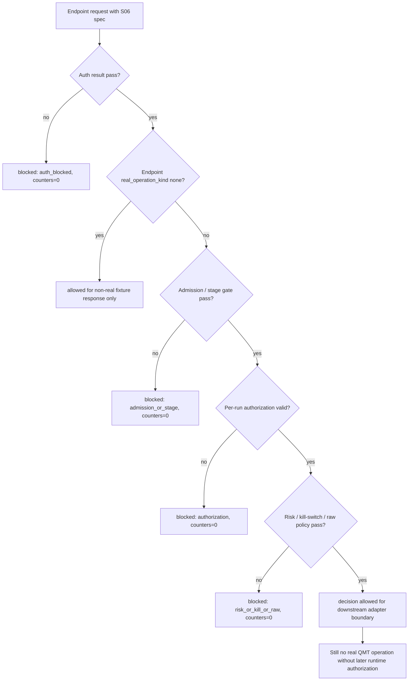

# LLD: CR019-S07 - 运行门控与 blocked reason 集成

本文档冻结 QMT gateway 运行门控聚合器、blocked reason priority 和 read-only 上游 gate 消费合同。Pairing / HMAC 只识别调用方，不替代 CR016 stage gate、pre-trade risk、kill switch、per-run authorization 或 raw execution policy；`confirmed=true` 且 CP5 已统一确认；实现仍需 Story 卡片 implementation_allowed、依赖和文件所有权门控满足。

## 1. Goal

创建 `trading/qmt_gateway_gates.py`，并在 `trading/stage_gate.py`、`trading/pretrade_risk.py`、`trading/kill_switch.py` 暴露 read-only gate result 适配入口，使 run mode、阶段六 admission、CR016 stage gate、pre-trade risk、kill switch、per-run authorization、raw execution policy 可汇总为 S06 typed blocked result；任一 gate 缺失或失败时 adapter_call / real_order / cancel_order / account_query 均为 0。

## 2. Requirements（Functional / Non-Functional）

### 2.1 Functional

- gate、auth、risk、kill-switch、per-run authorization blocked reason 覆盖率为 100%。
- 任一 gate 缺失或失败时 `adapter_call`、`real_order`、`cancel_order`、`account_query` 均为 0。
- HMAC pass 直接授权 simulation / live / account / cancel 的次数为 0。
- CR015/CR016 既有 gate 语义被覆盖或绕过次数为 0。
- S07 必须消费 S06 `QmtEndpointSpec` / `QmtGatewayResult` / `QmtBlockedReason`，不得定义第二套不兼容 error schema。
- Admission blocked 时不得进入 QMT adapter；真实 simulation/live 仍需 CR016 per-run authorization。

### 2.2 Non-Functional

- 安全：gate 聚合器默认 fail closed；缺上下文、缺授权、未知 endpoint、unknown stage、risk unavailable、kill-switch unknown 均 blocked。
- 可审计：blocked reason priority 固定，输出包含 gate name、reason、required evidence、counter 和 redaction status。
- 可测试：fixture-only 合同测试，不启动 gateway，不调用真实账户查询、发单、撤单、broker lake 写入或 simulation/live run。
- 兼容：对 `stage_gate.py`、`pretrade_risk.py`、`kill_switch.py` 只增加 read-only adapter，不改 CR015/CR016 已验证规则。

## 3. 模块拆分与职责

| 模块 / 文件组 | 职责 | 说明 |
|---|---|---|
| `trading/qmt_gateway_gates.py` | 定义 gateway gate context、gate 聚合器、blocked reason priority、counter fail-closed 输出 | 当前 Story primary |
| `trading/stage_gate.py` | 暴露 admission / stage gate read-only result 接口 | shared；不得改变既有 stage 语义 |
| `trading/pretrade_risk.py` | 暴露 pre-trade risk read-only result 接口 | shared；不得降低 hard block |
| `trading/kill_switch.py` | 暴露 heartbeat / kill-switch read-only result 接口 | shared；不得启动监控服务 |
| `tests/test_cr019_qmt_gateway_run_gates.py` | 验证 gate、auth、risk、kill-switch、authorization blocked reason 与 adapter_call=0 | 当前 Story primary test |

## 4. 代码结构与文件影响范围

| 动作 | 文件路径 | 变更内容 |
|---|---|---|
| 创建 | `trading/qmt_gateway_gates.py` | 定义 `QmtGateContext`、`QmtGateDecision`、`GatewayGateAggregator`、blocked reason priority、counter fail-closed contract |
| 创建 | `tests/test_cr019_qmt_gateway_run_gates.py` | 覆盖 admission、auth、stage、risk、kill-switch、authorization、raw policy blocked 和 HMAC 不授权 |
| 修改 | `trading/stage_gate.py` | 增加 read-only admission / stage gate result adapter；不改 stage progression 规则 |
| 修改 | `trading/pretrade_risk.py` | 增加 read-only risk result adapter；不新增真实 broker 操作 |
| 修改 | `trading/kill_switch.py` | 增加 read-only kill-switch / heartbeat result adapter；不启动监控服务 |

## 5. 数据模型与持久化设计

本 Story 无新增持久化写入，不写 broker lake、不写真实运行报告。所有 gate 输入均为调用方提供的 fixture / read-only contract object。

| 对象 / 字段 | 类型 | 约束 | 说明 |
|---|---|---|---|
| `QmtGateContext.endpoint_spec` | `QmtEndpointSpec` | 必填，来自 S06 | 决定真实操作类别和 gate inputs |
| `QmtGateContext.auth_result` | `QmtAuthResult` | 必填；auth failed 时 blocked | 来自 S05；auth pass 不代表交易授权 |
| `QmtGateContext.run_mode` | Enum | `shadow|dry_run|mock|simulation|live_readonly|small_live|scale_up` | 与 CR016 stage path 对齐 |
| `QmtGateContext.admission_result` | read-only result | missing/fail 均 blocked | 来自 CR019-S01 admission |
| `QmtGateContext.stage_gate_result` | read-only result | missing/fail 均 blocked | 来自 CR016 stage gate |
| `QmtGateContext.risk_result` | read-only result | order submit/cancel 类 endpoint 必需；fail 时 adapter_call=0 | 来自 CR015-S04 |
| `QmtGateContext.kill_switch_result` | read-only result | active/unknown 均 blocked | 来自 CR016-S03 |
| `QmtGateContext.authorization_ref` | str | later-gated endpoint 必填，且需 per-run valid | 来自 CR016-S04 |
| `QmtGateContext.execution_price_policy` | Enum | 真实执行相关 endpoint 必须为 raw / broker price | qfq/hfq 不得作为执行价 |
| `QmtGateDecision` | dataclass | `allowed`、`blocked_reason`、`blocked_by`、`required_evidence`、`counters` | 输出给 S06 typed result |

## 6. API / Interface 设计

| 接口 / 入口 | 输入 | 输出 | 调用方 | 说明 |
|---|---|---|---|---|
| `evaluate_qmt_gateway_gates(context)` | `QmtGateContext` | `QmtGateDecision` | gateway endpoint handler / tests | 主聚合入口；T-S07-01 至 T-S07-09 覆盖 |
| `to_qmt_gateway_result(endpoint_spec, decision)` | endpoint spec、gate decision | `QmtGatewayResult` | S06 contracts / gateway | 统一 typed blocked result；T-S07-10 覆盖 |
| `read_stage_gate_result(stage_context)` | read-only stage context | normalized gate result | gate aggregator | 只读适配；T-S07-02 覆盖 |
| `read_pretrade_risk_result(intent_context)` | read-only risk context | normalized risk result | gate aggregator | 只读适配；T-S07-03 覆盖 |
| `read_kill_switch_result(run_id)` | read-only heartbeat / kill-switch context | normalized kill result | gate aggregator | 不启动服务；T-S07-04 覆盖 |
| `validate_per_run_authorization(endpoint_spec, authorization_ref)` | endpoint、authorization label | pass / missing / invalid | gate aggregator | 不读取凭据；T-S07-05 覆盖 |
| `validate_raw_execution_policy(endpoint_spec, execution_price_policy)` | endpoint、price policy | pass / blocked | gate aggregator | qfq/hfq execution blocked；T-S07-06 覆盖 |

Blocked reason 复用并收敛到 S06 枚举：`auth_blocked`、`scope_denied`、`admission_blocked`、`stage_gate_blocked`、`risk_gate_blocked`、`kill_switch_active`、`authorization_missing`、`authorization_invalid`、`raw_policy_blocked`、`qmt_operation_not_authorized`、`endpoint_not_gateable`、`gate_context_missing`。

## 7. 核心处理流程



1. Gateway handler 取得 S06 endpoint spec 和 S05 auth result。
2. Auth failed、scope denied 或 auth context missing 时立即 blocked，adapter_call=0。
3. 对 non-real endpoint（health / capabilities / validate / dry-run / mock）返回非真实 allowed 或 blocked，不触达 QMT。
4. 对 later-gated endpoint，依次检查 admission / stage gate、per-run authorization、pre-trade risk、kill-switch、raw execution policy。
5. 任一 gate missing / fail / unknown 均 fail closed，输出 S06 typed blocked result 和 counters=0。
6. 所有 read-only adapter 只归一化上游 gate result，不改变 CR015/CR016 已验证语义。

## 8. 技术设计细节

- 关键算法 / 规则：blocked reason priority 固定为 `auth -> endpoint/schema -> admission/stage -> authorization -> risk -> kill_switch -> raw_policy -> operation_not_authorized`；先失败的最高优先级 reason 返回给 client，完整 detail 可列出 suppressed reasons。
- 依赖选择与复用点：复用 S06 `QmtEndpointSpec`、`QmtGatewayResult`、`QmtBlockedReason`，复用 S05 `QmtAuthResult`，只读消费 CR015-S04 / CR016-S03 / CR016-S04 gate 合同。
- 兼容性处理：`stage_gate.py`、`pretrade_risk.py`、`kill_switch.py` 只增加 read-only 适配函数或 dataclass，不重写已有逻辑，不改变已有测试期望。
- Counter fail-closed：blocked 时统一输出 `adapter_call=0`、`qmt_api_call=0`、`real_order=0`、`cancel_order=0`、`account_query=0`、`broker_lake_write=0`。
- Raw policy：真实执行相关 endpoint 的 `execution_price_policy` 必须为 raw / broker price；qfq/hfq 或 missing policy 返回 `raw_policy_blocked`。
- 图示类型选择：本 Story 跨 auth、endpoint matrix、stage gate、risk、kill-switch、authorization、raw policy 7 个模块且异常分支多，已在第 7 节提供流程图。

## 9. 安全与性能设计

| 维度 | 设计措施 | 验证方式 |
|---|---|---|
| 安全 | 默认 fail closed；HMAC pass 不授权交易；CR015/CR016 gate 只读消费；blocked counters 全为 0 | T-S07-01 至 T-S07-09 |
| 性能 | gate 聚合按固定 gate 列表顺序 O(n) 扫描；不启动服务、不访问网络 | fixture 单测 |
| 可审计 | blocked reason priority、blocked_by、required_evidence、suppressed reasons 可追踪 | T-S07-10 |
| 可维护性 | 不复制 CR015/CR016 gate 规则，只做适配和聚合 | T-S07-11 |

## 10. 测试设计

| 测试场景 | 前置条件 | 操作 | 预期结果 | 验证方式 |
|---|---|---|---|---|
| T-S07-01 auth failed 阻断 | auth result failed | evaluate gates | `auth_blocked`，adapter_call=0 | pytest |
| T-S07-02 admission / stage missing 阻断 | endpoint later-gated，stage missing | evaluate gates | `stage_gate_blocked` 或 `admission_blocked`，adapter_call=0 | pytest |
| T-S07-03 risk fail 阻断 order endpoint | order endpoint，risk fail | evaluate gates | `risk_gate_blocked`，real_order=0 | pytest |
| T-S07-04 kill switch active 阻断 | kill switch active | evaluate gates | `kill_switch_active`，adapter_call=0 | pytest |
| T-S07-05 authorization missing 阻断 later-gated endpoint | simulation/live/account endpoint | evaluate gates | `authorization_missing`，real_order/account_query=0 | pytest |
| T-S07-06 raw policy missing / qfq blocked | execution endpoint | evaluate gates | `raw_policy_blocked`，adapter_call=0 | pytest |
| T-S07-07 HMAC pass 不授权交易 | auth pass 但 gates missing | evaluate gates | gate blocked；simulation/live/account/cancel 授权次数为 0 | pytest |
| T-S07-08 non-real endpoint 不触达 QMT | health/capabilities/dry-run | evaluate gates | qmt_api_call=0；可返回 fixture allowed / blocked | pytest |
| T-S07-09 CR015/CR016 语义不被覆盖 | existing gate fixtures | read-only adapter | 不改变原始 gate result | pytest |
| T-S07-10 blocked result 与 S06 schema 一致 | gate decision blocked | to_qmt_gateway_result | `QmtGatewayResult(status=blocked)` 字段完整 | pytest |
| T-S07-11 shared files 仅新增 read-only adapter | static inspect | 扫描 stage/risk/kill-switch | 未删除/覆盖既有 gate 函数和常量 | pytest |
| T-S07-12 禁止真实操作 | fixture run | evaluate all blocked cases | account_query/order/cancel/simulation/live/broker_lake_write 均为 0 | pytest |

## 11. 实施步骤

| TASK-ID | 动作 | 目标文件 | 详细描述 | 对应测试 |
|---|---|---|---|---|
| CR019-S07-T1 | 创建 | `trading/qmt_gateway_gates.py` | 定义 gateway 运行门控聚合器、blocked reason priority、counter fail-closed 行为和 S06 result 转换 | T-S07-01 至 T-S07-10 |
| CR019-S07-T2 | 修改 | `trading/stage_gate.py` | 暴露 admission / stage gate read-only 输入，不改变既有 gate 语义 | T-S07-02 / T-S07-09 / T-S07-11 |
| CR019-S07-T3 | 修改 | `trading/pretrade_risk.py` / `trading/kill_switch.py` | 接入只读 risk / kill-switch result，不增加真实 broker 操作或监控服务启动 | T-S07-03 / T-S07-04 / T-S07-09 / T-S07-11 |
| CR019-S07-T4 | 创建 | `tests/test_cr019_qmt_gateway_run_gates.py` | 验证 gate、auth、risk、kill-switch、authorization blocked reason 与 adapter_call=0 | T-S07-01 至 T-S07-12 |

## 12. 风险、难点与预研建议

### 12.1 实现灰区与取舍记录

| Clarification ID | 问题 | 选项与推荐 | 决策 / 答案 | 影响面 | 证据 | 重访条件 |
|---|---|---|---|---|---|---|
| 无 | 本 Story 未发现阻断 LLD 的门控灰区；blocked reason priority 可由 LLD 冻结并在 CP5 统一确认 | 推荐 priority 为 auth -> endpoint/schema -> admission/stage -> authorization -> risk -> kill_switch -> raw_policy -> operation_not_authorized；备选为返回全部 reasons 不设主 reason | 非阻断；不写入 `STATE.md` clarification queue | 接口 / 测试 / 安全 / 跨 Story 契约 | HLD §33.11-33.13、ADR-070、ADR-071、CR015/CR016 verified gate 合同 | 若用户要求 UI 展示全部 reasons，可保留主 reason 同时扩展 detail，不改变 fail-closed |

| 风险 / 难点 | 影响 | 缓解措施 / 预研建议 |
|---|---|---|
| HMAC pass 被误认为 trade authorization | 可能绕过真实运行门控 | 测试 T-S07-07 强制 HMAC pass 后 gate missing 仍 blocked |
| 修改共享 gate 文件破坏 CR015/CR016 语义 | 回归风险高 | 只新增 read-only adapter；静态测试确保不删除既有对象 |
| blocked reason priority 与用户期望不一致 | 客户端只看到第一原因，排障信息不足 | 主 reason 固定，detail 可列出 suppressed reasons |
| raw execution policy 缺失 | qfq/hfq 可能误用为执行价 | execution endpoint 缺 raw policy 时 hard block |

### OPEN / Spike 跟踪

| ID | 类型（OPEN / Spike） | 问题 | 下一动作 | 责任方 |
|---|---|---|---|---|
| 无 | N/A | 无阻断 OPEN / Spike；真实 simulation/live/account/cancel 仍需后续 per-run authorization，不在本 Story 授权 | CP5 统一确认后按 fixture-only 合同实现 | meta-po / user |

## 13. 回滚与发布策略

- 发布方式：全量 CP5 人工确认后，等待 S06 endpoint matrix 合同稳定，再实现 S07；只运行 fixture-only 合同测试。
- 回滚触发条件：HMAC pass 被用于交易授权、CR015/CR016 gate 语义被覆盖、blocked 时 counters 非 0、或实现触发真实 QMT / account / order / cancel / broker lake / simulation/live 操作。
- 回滚动作：回退 `trading/qmt_gateway_gates.py`、`tests/test_cr019_qmt_gateway_run_gates.py` 及 `stage_gate.py` / `pretrade_risk.py` / `kill_switch.py` 的 read-only adapter 修改；Story 回到 LLD 修订态，由 meta-po 汇入 CP5 返工。

## 14. Definition of Done

- [ ] 14 个章节全部填写完成。
- [ ] gate、auth、risk、kill-switch、per-run authorization blocked reason 覆盖率为 100%。
- [ ] 任一 gate 缺失或失败时 adapter_call / real_order / cancel_order / account_query 均为 0。
- [ ] HMAC pass 直接授权 simulation/live/account/cancel 的次数为 0。
- [ ] CR015/CR016 既有 gate 语义被覆盖或绕过次数为 0。
- [ ] `confirmed=true` 后仍需 Story 卡片 `implementation_allowed=true`、依赖和文件所有权门控满足后进入实现。
- [ ] OPEN / Spike 已清点为无阻断项。

## 人工确认区

> **CP5 - Story LLD 可实现性门**
> meta-dev 先写入 `process/checks/CP5-CR019-S07-run-gate-blocked-reason-integration-LLD-IMPLEMENTABILITY.md` 自动预检结果。
> meta-po 收齐 CR019-S01..S10 全部 LLD、CP4 自动预检摘要和 CP5 自动预检后，再生成并提示用户审查 `checkpoints/CP5-ALL-STORIES-LLD-BATCH.md` 或 CR019 对应批次审查稿。
> 用户统一确认全部目标 Story 的 LLD 后，仍需满足 S01/S06/CR015/CR016 依赖、当前 Wave、文件所有权门控和 no-real-operation 边界方可进入实现。

**CP5 checklist 摘要**：

| # | 检查项 | 状态 | 证据 |
|---|---|---|---|
| 1 | LLD 覆盖 AC | 待检查 | 第 2 / 10 / 14 节 |
| 2 | 与 HLD / ADR 一致 | 待检查 | 第 3 / 8 / 12 节 |
| 3 | 文件影响范围明确 | 待检查 | 第 4 / 11 节 |
| 4 | 接口契约完整 | 待检查 | 第 6 节 |
| 5 | 测试与 dev_gate 可计算 | 待检查 | 第 10 / 14 节 |
| 6 | clarification queue 已收敛 | 待检查 | 第 12.1 节 |

**人工确认回复**：

请直接回复以下任一整行：

```text
approve
修改: <具体修改点>
reject
```

**人工审查结果回填**：

- 结论：`approved | changes_requested | rejected`
- 审查人：
- 审查时间：
- 修改意见：
- 风险接受项：
