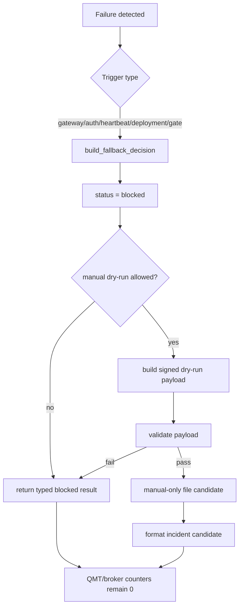

# LLD: CR019-S08 — fallback / incident / signed file fail-closed 边界

本文档只定义 CR019-S08 的实现设计。`confirmed=true` 且 CP5 已通过；实现仍需 Story 卡片 `implementation_allowed=true`、依赖和文件所有权门控满足；不得启动 gateway、读取凭据、调用真实 QMT / MiniQMT / XtQuant、写 broker lake、publish 或发起 simulation / live run。

## 1. Goal

创建 `trading/qmt_gateway_fallback.py` 的 fail-closed fallback 合同、`tests/test_cr019_qmt_gateway_fallback.py` 的 fixture-only 验证入口，并在后续实现阶段增量更新 `docs/QMT-INCIDENT-PLAYBOOK.md`，确保 gateway 不可达、auth fail、heartbeat fail、部署不满足和 run gate fail 时只返回 typed blocked result 或人工 dry-run / signed file drop payload，不自动触发真实 QMT / broker 操作。

## 2. Requirements（Functional / Non-Functional）

### 2.1 Functional

- 定义 `FallbackTrigger` 枚举，覆盖 `gateway_unreachable`、`auth_failed`、`heartbeat_failed`、`deployment_not_ready`、`run_gate_blocked` 五类触发。
- 定义 `FallbackDecision` 结构，固定 `status=blocked`，输出 `blocked_reason`、`incident_candidate`、`manual_dry_run_allowed`、`safety_counters` 和 `next_action`。
- 定义人工 dry-run / signed file drop payload 字段，明确 `auto_execute=false`、`real_qmt_allowed=false`、`manual_handling_required=true`。
- 对 signed file payload 执行过期、签名状态、敏感字段和自动执行字段校验；任一校验失败返回 blocked，不进入真实 adapter。
- 为 incident playbook 提供增量文档边界：fallback 是人工处置 / 演练入口，不是 gateway 或 run gate 的真实绕过通道。

### 2.2 Non-Functional

- 安全：真实 QMT API、真实发单、撤单、账户查询、broker lake 写入、simulation/live run 计数必须为 0。
- 可测试：所有路径使用 fixture-only 输入，测试不启动 FastAPI、不绑定端口、不读取 `.env`、不导入真实 `xtquant`。
- 可维护：复用上游 S06 typed blocked result 与 S07 run gate blocked reason；S08 不重新定义 endpoint matrix 或 run gate 规则。
- 可审计：payload 只记录脱敏 request / intent ref、trigger、blocked reason、签名状态和过期时间，不记录 secret、token、账户号、真实持仓或私有路径。

## 3. 模块拆分与职责

| 模块 / 文件组 | 职责 | 说明 |
|---|---|---|
| Fallback decision core | 根据 transport/auth/heartbeat/deployment/gate failure 生成 typed blocked decision | 落在 `trading/qmt_gateway_fallback.py`；消费 S04/S05/S06/S07 合同，不触达真实 QMT |
| Signed dry-run payload builder | 构造人工 dry-run / signed file drop payload，并强制标记 manual-only | 落在 `trading/qmt_gateway_fallback.py`；payload 不含自动执行字段 |
| Signed dry-run payload validator | 校验 payload schema、过期时间、签名状态、敏感字段和 no-real-operation counters | 落在 `trading/qmt_gateway_fallback.py`；失败时仍返回 blocked |
| Incident playbook delta | 记录人工 dry-run / signed file drop 的处置边界、停止条件和敏感信息禁区 | 后续实现阶段增量修改 `docs/QMT-INCIDENT-PLAYBOOK.md`，当前 LLD 不修改文档 |
| Fallback tests | 验证每类 failure、payload 字段、敏感值脱敏和真实操作计数为 0 | `tests/test_cr019_qmt_gateway_fallback.py`；fixture-only |

## 4. 代码结构与文件影响范围

| 动作 | 文件路径 | 变更内容 |
|---|---|---|
| 创建 | `trading/qmt_gateway_fallback.py` | 定义 fallback trigger、decision、signed dry-run payload、validation、safety counter 和错误枚举 |
| 创建 | `tests/test_cr019_qmt_gateway_fallback.py` | 覆盖 transport/auth/heartbeat/deployment/gate fail、payload manual-only、过期、敏感字段和真实操作计数 |
| 修改 | `docs/QMT-INCIDENT-PLAYBOOK.md` | 增量加入 CR019 fallback / signed file drop 处置边界；不得写成真实运行授权 |

## 5. 数据模型与持久化设计

本 Story 不新增真实持久化，不写 broker lake，不写 market-data lake，不持久化真实 incident。`signed file drop` 只定义人工 dry-run payload schema；后续实现如需要渲染文件，必须由调用方显式提供 dry-run 目标路径，且文件内容仍只包含脱敏引用和 manual-only 字段。

| 对象 / 字段 | 类型 | 约束 | 说明 |
|---|---|---|---|
| `FallbackTrigger` | enum | 五类固定枚举 | `gateway_unreachable`、`auth_failed`、`heartbeat_failed`、`deployment_not_ready`、`run_gate_blocked` |
| `FallbackDecision.status` | string | 固定为 `blocked` | fallback 不产生 `allowed` 或 `execute` 状态 |
| `FallbackDecision.blocked_reason` | string | 必填，来自 S06/S07 typed reason 或 S08 failure reason | 用于 client / incident / runbook 展示 |
| `FallbackDecision.manual_dry_run_allowed` | bool | 仅在 policy 允许人工 dry-run 时为 true | true 不表示真实 QMT 允许 |
| `FallbackDecision.safety_counters` | mapping | 所有真实操作 counter 固定为 0 | 至少含 `qmt_api_call`、`real_order_call`、`real_cancel_call`、`account_query_call`、`broker_lake_write` |
| `SignedDryRunPayload.schema_version` | string | 必填 | 第一版为 `cr019.signed-dry-run.v1` |
| `SignedDryRunPayload.mode` | string | 固定为 `manual_dry_run_only` | 禁止 `simulation`、`live`、`auto_execute` |
| `SignedDryRunPayload.signing_status` | enum | `unsigned`、`test_signed`、`signature_required`、`expired` | 不保存真实 secret，不输出签名密钥 |
| `SignedDryRunPayload.expires_at` | timestamp string | 必填，过期后 blocked | 防止人工文件长期复用 |
| `SignedDryRunPayload.manual_handling_required` | bool | 固定 true | 明确需要人工处置 |
| `SignedDryRunPayload.auto_execute` | bool | 固定 false | 自动执行字段若为 true 则 validation blocked |

## 6. API / Interface 设计

| 接口 / 入口 | 输入 | 输出 | 调用方 | 说明 |
|---|---|---|---|---|
| `build_fallback_decision(trigger, request_context, upstream_result=None, policy=None)` | `FallbackTrigger`、脱敏 request context、可选 S06/S07 blocked result、fallback policy | `FallbackDecision` | S03 client / S04 gateway / S07 gate 聚合器 | 始终 fail closed；测试 T-S08-01 至 T-S08-05 覆盖 |
| `build_signed_dry_run_payload(decision, intent_ref, now, ttl_seconds, signing_status)` | `FallbackDecision`、脱敏 intent ref、当前时间、TTL、签名状态 | `SignedDryRunPayload` dict | 人工 dry-run file renderer | 只构造 manual-only payload；测试 T-S08-06 覆盖 |
| `validate_signed_dry_run_payload(payload, now)` | payload dict、当前时间 | `ValidationResult` 或 typed blocked result | file drop handler / tests | 校验过期、自动执行字段、敏感字段、签名状态；测试 T-S08-07 至 T-S08-09 覆盖 |
| `format_incident_candidate(decision, payload=None)` | `FallbackDecision`、可选 payload ref | 脱敏 incident candidate dict | incident playbook / docs tests | 只返回候选记录，不持久化真实 incident；测试 T-S08-10 覆盖 |

## 7. 核心处理流程

1. 调用方捕获 gateway 不可达、auth fail、heartbeat fail、部署不满足或 run gate fail。
2. 调用方传入脱敏 request context 和上游 blocked result，调用 `build_fallback_decision`。
3. S08 根据 trigger 和 policy 生成 `status=blocked` 的 decision，并将所有真实操作 counter 固定为 0。
4. 若 policy 允许人工 dry-run，调用方显式调用 `build_signed_dry_run_payload` 生成 manual-only payload。
5. `validate_signed_dry_run_payload` 对 payload 进行 schema、过期、签名状态、敏感字段和自动执行字段检查。
6. 任一检查失败时返回 typed blocked result；不得进入真实 QMT adapter、broker lake、simulation 或 live。
7. incident candidate 仅作为脱敏候选记录交给人工处置，不在本 Story 中持久化。

## 8. 技术设计细节

- 关键规则：fallback output 只有 `blocked` 和 `manual_dry_run_only` 两类语义；不得产生 `allowed`、`execute`、`submit`、`cancel`、`query_account`、`write_broker_lake` 等执行语义。
- 依赖选择与复用点：复用 S06 typed blocked result shape 和 S07 blocked reason priority；S08 只补充 failure fallback policy、payload schema 和 incident candidate。
- 兼容性处理：若上游 S06/S07 尚未提供最终类名，S08 实现采用轻量 protocol / mapping 读取 `status`、`reason_code`、`message`、`counters`，不反向修改上游合同。
- 签名状态：LLD 定义 `signing_status` 表示人工文件的签名阶段，不定义真实私钥读取、真实签名密钥存储或 credential loading。
- 过期策略：默认 TTL 在实现时作为显式参数或配置常量，不从 `.env` 读取；过期 payload 必须返回 blocked。
- 图示类型选择：本 Story 存在五类 failure 与人工 dry-run 分支，使用流程图。

## 9. 安全与性能设计

| 维度 | 设计措施 | 验证方式 |
|---|---|---|
| 安全 | 所有 fallback decision 固定真实操作 counter 为 0；payload 固定 manual-only；敏感字段扫描命中即 blocked | `tests/test_cr019_qmt_gateway_fallback.py` 校验 counter、字段和值 |
| 安全 | 不读取 `.env`、token、secret、账户号、真实持仓、真实 broker root 或私有路径 | 静态测试搜索敏感 key；fixture 输入只使用脱敏 ref |
| 安全 | HMAC / auth fail 不进入 adapter；gateway 不可达不切换真实备用路径 | failure case 测试 adapter call count 为 0 |
| 性能 | fallback 为纯内存结构构造和字段校验，不做网络 I/O 和真实文件扫描 | 单元测试使用 fixture dict；无服务启动 |
| 可观测 | 输出 `fallback_id`、`run_id`、`intent_id`、`trigger`、`blocked_reason`、`redaction_status` | 文档和测试检查必填字段 |

## 10. 测试设计

| 测试场景 | 前置条件 | 操作 | 预期结果 | 验证方式 |
|---|---|---|---|---|
| T-S08-01 gateway 不可达 | fixture request context | 调用 `build_fallback_decision(gateway_unreachable, ...)` | status blocked；qmt/order/cancel/account/broker counters 均为 0 | pytest |
| T-S08-02 auth fail | fixture auth error | 调用 `build_fallback_decision(auth_failed, ...)` | auth blocked；不进入 adapter | pytest |
| T-S08-03 heartbeat fail | fixture heartbeat error | 调用 fallback decision | incident candidate 包含 heartbeat ref；真实操作 0 | pytest |
| T-S08-04 deployment not ready | bind / firewall / config fixture 不满足 | 调用 fallback decision | deployment blocked；manual dry-run 可选但不执行 | pytest |
| T-S08-05 run gate fail | S07 blocked result fixture | 调用 fallback decision | 复用 gate blocked reason；adapter_call=0 | pytest |
| T-S08-06 signed file payload | policy 允许人工 dry-run | 构造 payload | `manual_handling_required=true`、`auto_execute=false`、`real_qmt_allowed=false` | pytest |
| T-S08-07 payload 过期 | `expires_at < now` | validate payload | 返回 expired blocked | pytest |
| T-S08-08 payload 含自动执行字段 | payload 含 `auto_execute=true` 或真实 order command | validate payload | validation blocked | pytest |
| T-S08-09 payload / incident 含敏感字段 | fixture 含 secret/token/account/session/.env | validate / format | blocked 或 redacted；敏感原值输出次数 0 | pytest |
| T-S08-10 文档边界 | incident playbook 增量文本 fixture | 静态检查 | 不出现“runbook / Story verified 授权真实交易”语义 | pytest |

## 11. 实施步骤

| TASK-ID | 动作 | 目标文件 | 详细描述 | 对应测试 |
|---|---|---|---|---|
| CR019-S08-T1 | 创建 | `trading/qmt_gateway_fallback.py` | 定义 `FallbackTrigger`、`FallbackDecision`、safety counter 和 `build_fallback_decision` | T-S08-01 至 T-S08-05 |
| CR019-S08-T2 | 创建 | `tests/test_cr019_qmt_gateway_fallback.py` | 建立 fixture-only failure、counter、payload 和敏感字段测试 | T-S08-01 至 T-S08-10 |
| CR019-S08-T3 | 修改 | `docs/QMT-INCIDENT-PLAYBOOK.md` | 增量记录 CR019 fallback / incident / signed file drop manual-only 边界 | T-S08-10 |
| CR019-S08-T4 | 定义 | `trading/qmt_gateway_fallback.py` | 定义 `SignedDryRunPayload`、`build_signed_dry_run_payload`、`validate_signed_dry_run_payload` 和 `format_incident_candidate` | T-S08-06 至 T-S08-09 |

## 12. 风险、难点与预研建议

### 12.1 实现灰区与取舍记录

| Clarification ID | 问题 | 选项与推荐 | 决策 / 答案 | 影响面 | 证据 | 重访条件 |
|---|---|---|---|---|---|---|
| CP3-CR019-DQ-05 | gateway 失败时 fallback 是否可自动转真实 QMT | 推荐：blocked-only 或人工 dry-run / signed file drop；备选 A：仅 blocked-only；备选 B：自动真实 fallback | 已由 CP3 approve 接受推荐；S08 固化为 fail-closed，自动真实 fallback 禁止 | 接口 / 测试 / 安全 / 文档 / 跨 Story 契约 | `checkpoints/CP3-CR019-HLD-REVIEW.md`、ADR-072、HLD §33.12 | 若未来要求自动真实 fallback，必须新 CR + 风险接受 + CP5 重审 |

| 风险 / 难点 | 影响 | 缓解措施 / 预研建议 |
|---|---|---|
| signed file 被误读为交易指令 | 可能绕过 gateway / run gate | payload 固定 `manual_dry_run_only`，禁止自动执行字段，文档明确不授权真实交易 |
| 上游 blocked result 类名尚未冻结 | S08 与 S06/S07 实现耦合 | 使用最小 mapping/protocol 读取 `status`、`reason_code`、`counters`，在 CP5 全量确认后再对齐类名 |
| 敏感字段出现在人工 payload | 凭据或账户泄露 | validation 对 secret/token/account/session/.env/private path 关键词 fail closed |
| incident candidate 被持久化为真实 incident | 可能制造真实运行痕迹 | S08 只返回候选 dict，不写 broker lake 或 incident store |

### OPEN / Spike 跟踪

| ID | 类型（OPEN / Spike） | 问题 | 下一动作 | 责任方 |
|---|---|---|---|---|
| 无 | N/A | 无阻断 OPEN / Spike | N/A | N/A |

## 13. 回滚与发布策略

- 发布方式：仅在 CP5 全量人工确认、当前 Story 进入 dev-ready 且依赖 / 文件所有权门控满足后，按 TASK-ID 实现并提交给 CP6。
- 回滚触发条件：payload 出现自动执行语义、真实操作 counter 不为 0、敏感字段未脱敏、incident playbook 出现真实授权语义。
- 回滚动作：撤回 S08 代码和文档增量，恢复到无 fallback handler 状态；保留 CP5 / CP6 / CP7 证据说明未授权真实操作。

## 14. Definition of Done

- [ ] `trading/qmt_gateway_fallback.py` 创建并只实现 fail-closed / manual-only fallback。
- [ ] `tests/test_cr019_qmt_gateway_fallback.py` 覆盖五类 failure、payload validation、敏感字段和真实操作 counter。
- [ ] `docs/QMT-INCIDENT-PLAYBOOK.md` 增量说明 fallback 不授权真实 QMT / broker 操作。
- [ ] 自动真实 QMT fallback、真实 broker lake 写入、真实发单 / 撤单 / 账户查询、publish、simulation/live run 次数均为 0。
- [ ] 第 6 节接口均有第 10 节测试覆盖。
- [ ] 第 7 节异常路径均有错误路径测试覆盖。
- [ ] `confirmed=true` 后仍需 Story 卡片、依赖和文件所有权门控满足后进入实现。
- [ ] OPEN / Spike 已清点，当前无阻断项。

## 人工确认区

> CP5 自动预检文件：`process/checks/CP5-CR019-S08-fallback-incident-signed-file-boundary-LLD-IMPLEMENTABILITY.md`
>
> 本 LLD 已纳入 `CR019-STAGE6-QMT-BRIDGE-BATCH-A` 并通过 CP5 全量 LLD 统一确认。用户已回复 `approve`；实现仍需 Story 卡片、依赖和文件所有权门控满足。
