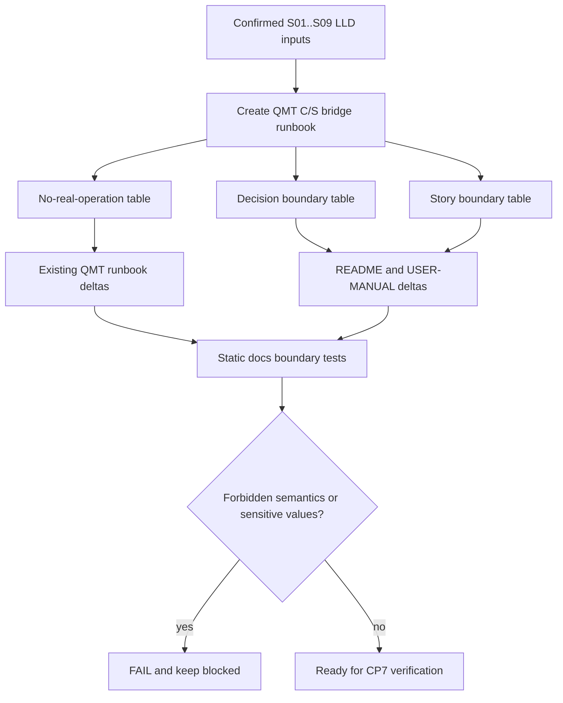

# LLD: CR019-S10 — CR-019 文档、runbook 与用户手册边界

本文档只定义 CR019-S10 的低层设计。`confirmed=true` 且 CP5 已通过；实现仍需 Story 卡片 `implementation_allowed=true`、依赖和文件所有权门控满足；不得发布 `delivery/**`，不得读取凭据、启动服务、调用真实 QMT / provider / lake / broker 操作或发起 simulation / live run。

## 1. Goal

创建 `docs/QMT-C-S-BRIDGE-RUNBOOK.md` 与 `tests/test_cr019_docs_runbook_boundary.py`，并在后续实现阶段增量更新 `README.md`、`docs/USER-MANUAL.md`、`docs/QMT-SIMULATION-LIVE-RUNBOOK.md` 和 `docs/QMT-INCIDENT-PLAYBOOK.md`，把 CR019 的 admission、QMT C/S bridge、pairing/HMAC、endpoint/gate/fallback、后置能力和 no-real-operation 边界收敛到用户可读文档；文档不得授权 simulation / live 或真实 broker 操作。

## 2. Requirements（Functional / Non-Functional）

### 2.1 Functional

- 新建 QMT C/S bridge runbook，覆盖 CR019-S01..S10 共 10 个 Story 边界。
- 文档必须列出 CP3-CR019-DQ-01..DQ-07 共 7 个已批准决策，并说明每项对用户操作边界的影响。
- 文档必须包含 no-real-operation 表，覆盖 dependency change、service start、credential read、QMT / MiniQMT / XtQuant、provider fetch、lake / broker lake、publish、simulation/live 共 8 类禁止项。
- 文档必须明确 runbook、README、USER-MANUAL、CP5、CP6、CP7、Story `verified` 或文档存在均不构成真实交易授权。
- 共享文档增量必须与 S08 incident 边界、S09 deferred register 串行合并，不覆盖既有 CR015/CR016/CR017 runbook 的授权边界。

### 2.2 Non-Functional

- 安全：真实凭据示例、真实账户号、token、secret、session、cookie、private key、真实 broker root 或私有路径出现次数为 0。
- 可验证：所有文档边界由 `tests/test_cr019_docs_runbook_boundary.py` 静态解析验证。
- 可维护：S10 是文档 merge owner，但不修改 `process/HLD.md`、`process/ARCHITECTURE-DECISION.md` 或 `delivery/**`。
- 可追溯：文档引用 CP3 Decision Brief、ADR-067..073、HLD §33、QMT companion §17 和 S01..S09 Story/LLD 合同。

## 3. 模块拆分与职责

| 模块 / 文件组 | 职责 | 说明 |
|---|---|---|
| QMT C/S bridge runbook | 汇总架构、Story 边界、操作禁区、pairing/HMAC、endpoint/gate/fallback 和后置能力 | `docs/QMT-C-S-BRIDGE-RUNBOOK.md`，S10 primary |
| README entry | 面向快速入口说明 CR019 可读边界和 no-real-operation | `README.md` 共享，S10 merge owner；需与 S09 README 增量串行合并 |
| USER-MANUAL entry | 面向用户操作说明 admission / gateway / run gate / fallback / deferred boundaries | `docs/USER-MANUAL.md` 共享，S10 merge owner |
| Existing QMT runbooks delta | 对齐 simulation/live runbook 与 incident playbook的 CR019 C/S bridge、fallback 和 no-real-operation 边界 | `docs/QMT-SIMULATION-LIVE-RUNBOOK.md`、`docs/QMT-INCIDENT-PLAYBOOK.md`；不授权真实运行 |
| Static docs tests | 验证 7 个 DQ、10 个 Story、8 类禁止项、敏感值和授权语义禁区 | `tests/test_cr019_docs_runbook_boundary.py` |

## 4. 代码结构与文件影响范围

| 动作 | 文件路径 | 变更内容 |
|---|---|---|
| 创建 | `docs/QMT-C-S-BRIDGE-RUNBOOK.md` | 创建 CR019 C/S bridge runbook，覆盖 DQ、Story、禁止项、pairing/HMAC、endpoint/gate/fallback 和 deferred register 引用 |
| 修改 | `README.md` | 增量加入阶段六 admission 与 QMT C/S bridge 用户入口边界 |
| 修改 | `docs/USER-MANUAL.md` | 增量加入用户操作边界、真实授权禁区和后续 CR / CP 入口 |
| 修改 | `docs/QMT-SIMULATION-LIVE-RUNBOOK.md` | 增量对齐 CR019 gateway / run gate / no-real-operation 说明；不得授权 simulation/live |
| 修改 | `docs/QMT-INCIDENT-PLAYBOOK.md` | 增量对齐 S08 fail-closed fallback、manual dry-run / signed file drop 边界 |
| 创建 | `tests/test_cr019_docs_runbook_boundary.py` | 创建静态文档边界测试 |

## 5. 数据模型与持久化设计

本 Story 不新增运行时数据模型，不新增持久化，不写 lake / broker lake。文档内使用静态表作为用户可读合同。

| 对象 / 字段 | 类型 | 约束 | 说明 |
|---|---|---|---|
| `DecisionBoundaryRow` | markdown table row | 7 行，覆盖 CP3-CR019-DQ-01..DQ-07 | 每行包含 decision、accepted recommendation、user impact、not authorization |
| `StoryBoundaryRow` | markdown table row | 10 行，覆盖 CR019-S01..S10 | 每行包含 scope、output surface、forbidden operation、verification entry |
| `NoRealOperationRow` | markdown table row | 8 行固定类别 | dependency change、service start、credential read、QMT/MiniQMT/XtQuant、provider fetch、lake/broker lake、publish、simulation/live |
| `DocumentAuthorizationBoundary` | markdown section | 必填 | 明确文档、runbook、Story verified、CP5/CP6/CP7 不授权真实交易 |
| `SensitiveValueBoundary` | markdown section | 必填 | 禁止真实凭据示例和敏感原值 |

## 6. API / Interface 设计

| 接口 / 入口 | 输入 | 输出 | 调用方 | 说明 |
|---|---|---|---|---|
| `docs/QMT-C-S-BRIDGE-RUNBOOK.md#Decision Boundary` | CP3 DQ-01..DQ-07 | 用户可读决策边界表 | 用户 / meta-doc / meta-qa | 测试 T-S10-01 覆盖 |
| `docs/QMT-C-S-BRIDGE-RUNBOOK.md#Story Boundary` | CR019-S01..S10 Story / LLD 合同 | 10 Story 边界表 | 用户 / meta-po / meta-qa | 测试 T-S10-02 覆盖 |
| `docs/QMT-C-S-BRIDGE-RUNBOOK.md#No Real Operation Boundary` | 8 类禁止项 | no-real-operation 表 | 用户 / meta-qa | 测试 T-S10-03 覆盖 |
| `README.md#QMT C/S Bridge` | runbook 摘要 | 快速入口和禁止声明 | 用户 | 测试 T-S10-04 覆盖 |
| `docs/USER-MANUAL.md#QMT C/S Bridge` | runbook 摘要 | 用户手册增量 | 用户 | 测试 T-S10-05 覆盖 |
| `docs/QMT-SIMULATION-LIVE-RUNBOOK.md` delta | CR019 C/S bridge boundary | 与既有 stage gate / authorization 对齐 | trading operator | 测试 T-S10-06 覆盖 |
| `docs/QMT-INCIDENT-PLAYBOOK.md` delta | S08 fallback boundary | fail-closed incident / fallback 说明 | trading operator | 测试 T-S10-07 覆盖 |
| `tests/test_cr019_docs_runbook_boundary.py` | Markdown 文件 | PASS / FAIL | meta-qa / CI | 测试自身执行静态校验 |

## 7. 核心处理流程

1. 实现阶段读取已确认的 CR019-S01..S09 LLD 与 Story 卡片，形成文档边界输入。
2. 创建 `docs/QMT-C-S-BRIDGE-RUNBOOK.md`，先写入 authorization boundary 和 no-real-operation 表。
3. 写入 CP3-CR019-DQ-01..DQ-07 决策表，逐项说明 accepted recommendation、用户影响、禁止误读。
4. 写入 CR019-S01..S10 Story boundary 表，逐项说明产物、验证入口和禁止操作。
5. 写入 pairing/HMAC、endpoint matrix、run gate、fallback、deferred capability 的用户可读摘要。
6. 增量更新 README、USER-MANUAL、simulation/live runbook 和 incident playbook。
7. 创建静态测试，解析所有目标文档，验证 DQ/Story/禁止项覆盖、敏感值为 0、真实授权语义为 0。

## 8. 技术设计细节

- 关键规则：文档只描述受控流程，不授权真实 simulation/live、账户查询、发单、撤单、broker lake 写入、provider fetch、lake write 或 publish。
- DQ 映射：DQ-01 C/S bridge、DQ-02 Python client + thin CLI、DQ-03 endpoint matrix + run gate、DQ-04 pairing/HMAC、DQ-05 fail-closed fallback、DQ-06 deferred capabilities、DQ-07 stage6 admission + primary benchmark。
- Story 映射：S01 admission、S02 benchmark、S03 C-side client/CLI、S04 Windows gateway、S05 pairing/HMAC/redaction、S06 endpoint matrix、S07 run gate、S08 fallback/incident、S09 deferred register、S10 docs/runbook。
- 禁止语义检测：测试应匹配“runbook/Story verified/文档存在/CP5/CP6/CP7 授权真实交易”等近义表达，并要求出现次数为 0。
- 敏感值检测：测试只允许示例占位如 `<client-id>`、`<redacted-ref>`、`<authorization-ref>`，禁止真实 token / secret / account / private path。
- 图示类型选择：本 Story 涉及多文档合并和失败检测路径，使用流程图。

## 9. 安全与性能设计

| 维度 | 设计措施 | 验证方式 |
|---|---|---|
| 安全 | 所有文档开头包含 authorization boundary，声明文档和 Story 状态不授权真实操作 | 静态测试检查段落和禁止语义 |
| 安全 | no-real-operation 表固定 8 类禁止项 | 静态测试检查类别集合 |
| 安全 | 禁止真实凭据、账户、token、secret、session、cookie、private key 和真实 broker root | 静态测试关键词和示例值规则 |
| 安全 | 不修改 `process/HLD.md`、`process/ARCHITECTURE-DECISION.md`、`delivery/**` | CP6 / git diff 验证文件范围 |
| 性能 | 文档静态测试只读 Markdown，不启动服务、不联网、不扫描真实 lake | pytest 静态解析 |

## 10. 测试设计

| 测试场景 | 前置条件 | 操作 | 预期结果 | 验证方式 |
|---|---|---|---|---|
| T-S10-01 DQ 决策覆盖 | runbook 存在 | 解析 Decision Boundary | CP3-CR019-DQ-01..DQ-07 共 7 项全部存在 | pytest |
| T-S10-02 Story 边界覆盖 | runbook 存在 | 解析 Story Boundary | CR019-S01..S10 共 10 项全部存在 | pytest |
| T-S10-03 no-real-operation 表 | runbook / README / manual 存在 | 检查 8 类禁止项 | dependency change、service start、credential read、QMT/MiniQMT/XtQuant、provider fetch、lake/broker lake、publish、simulation/live 均存在 | pytest |
| T-S10-04 README 边界 | README 增量存在 | 静态匹配 | README 不声明真实交易授权 | pytest |
| T-S10-05 USER-MANUAL 边界 | USER-MANUAL 增量存在 | 静态匹配 | 用户手册说明 per-run authorization 和 no-real-operation | pytest |
| T-S10-06 simulation/live runbook delta | runbook 增量存在 | 静态匹配 | 不把 CR019 C/S bridge 写成 simulation/live 授权 | pytest |
| T-S10-07 incident playbook delta | incident 增量存在 | 静态匹配 | fallback 为 fail-closed / manual-only；真实操作 0 | pytest |
| T-S10-08 敏感值禁区 | 所有目标文档存在 | 搜索敏感模式 | 真实凭据示例出现次数为 0 | pytest |
| T-S10-09 禁止授权语义 | 所有目标文档存在 | 搜索授权误读语义 | “runbook / Story verified 授权真实交易”语义匹配次数为 0 | pytest |

## 11. 实施步骤

| TASK-ID | 动作 | 目标文件 | 详细描述 | 对应测试 |
|---|---|---|---|---|
| CR019-S10-T1 | 创建 | `docs/QMT-C-S-BRIDGE-RUNBOOK.md` | 汇总 C/S bridge、gateway lifecycle、pairing/HMAC、endpoint matrix、run gate、fallback、deferred 和 no-real-operation 边界 | T-S10-01 至 T-S10-03 |
| CR019-S10-T2 | 修改 | `README.md` | 增量加入阶段六 admission 与 QMT C/S bridge 用户入口边界 | T-S10-04 |
| CR019-S10-T3 | 修改 | `docs/USER-MANUAL.md`、`docs/QMT-SIMULATION-LIVE-RUNBOOK.md`、`docs/QMT-INCIDENT-PLAYBOOK.md` | 对齐 no-real-operation、per-run authorization 和 incident fail-closed 说明 | T-S10-05 至 T-S10-07 |
| CR019-S10-T4 | 创建 | `tests/test_cr019_docs_runbook_boundary.py` | 验证 DQ 决策、10 Story 边界、禁止真实授权表和敏感值脱敏 | T-S10-01 至 T-S10-09 |

## 12. 风险、难点与预研建议

### 12.1 实现灰区与取舍记录

| Clarification ID | 问题 | 选项与推荐 | 决策 / 答案 | 影响面 | 证据 | 重访条件 |
|---|---|---|---|---|---|---|
| CP3-CR019-DQ-01..DQ-07 | CR019 用户可读文档采用哪些已批准边界 | 推荐：完整落地 DQ-01..DQ-07；备选：只写 C/S bridge 或只写 admission | 已由 CP3 approve 接受全部推荐；S10 必须全部映射到文档 | 文档 / 测试 / 跨 Story 契约 / 安全 | `checkpoints/CP3-CR019-HLD-REVIEW.md`、HLD §33、ADR-067..073 | 若任一 DQ 后续变更，必须新 CR 或 CP5 返工 |
| LCQ-CR019-S10-01 | S10 文档实现时是否只消费 Story 卡片，还是必须消费 S01..S09 confirmed LLD 的最终字段名和输出路径 | 推荐：LLD 起草阶段以 Story 卡片和 HLD/ADR 建模；实现阶段必须复核 S01..S09 confirmed LLD 后再落文档；备选 A：只按 Story 卡片实现；备选 B：等待所有上游 LLD 完成后重写 S10 LLD | 当前作为非阻断 OPEN，`blocks_lld=false`；CP5 统一确认前由 meta-po 汇总，用户 `approve` 表示接受推荐 | 文档 / 跨 Story 契约 / 测试 | S10 Story `depends_on` CR019-S01..S09；Development Plan W5 entry condition 为 S01..S09 contracts frozen | 若上游 confirmed LLD 改变接口名、路径或禁止项，S10 实现前必须同步调整文档测试 |

| 风险 / 难点 | 影响 | 缓解措施 / 预研建议 |
|---|---|---|
| 文档被误认为真实交易授权 | 高风险真实操作误触发 | 所有文档加入 authorization boundary；测试禁止相关语义 |
| S08/S09 与 S10 共享文档合并冲突 | 可能覆盖 incident 或 README 增量 | S10 作为文档 merge owner，在实现阶段串行合并 S08/S09 增量 |
| 上游 S01..S09 LLD 字段名变化 | 文档引用漂移 | S10 实现前消费 confirmed LLD；测试检查 Story ID 与输出路径 |
| 敏感示例误写入用户手册 | 凭据泄露 | 只使用 `<redacted-*>` 占位；测试敏感值模式 |

### OPEN / Spike 跟踪

| ID | 类型（OPEN / Spike） | 问题 | 下一动作 | 责任方 |
|---|---|---|---|---|
| LCQ-CR019-S10-01 | OPEN | S10 实现阶段必须复核 S01..S09 confirmed LLD 后再落文档，避免只按 Story 卡片导致字段漂移 | CP5 全量确认时由 meta-po 暴露；实现前按 confirmed LLD 复核 | meta-po / meta-dev |

## 13. 回滚与发布策略

- 发布方式：CP5 全量人工确认后，S10 在 S01..S09 合同冻结且文档共享文件可串行合并时实现；不发布 `delivery/**`。
- 回滚触发条件：文档出现真实交易授权语义、敏感凭据示例、缺少 7 个 DQ、缺少 10 个 Story 边界、缺少 8 类禁止项或覆盖既有 CR015/CR016/CR017 授权边界。
- 回滚动作：撤回 `docs/QMT-C-S-BRIDGE-RUNBOOK.md`、README / USER-MANUAL / QMT runbook 增量和 S10 测试，恢复到实现前文档状态；不修改 HLD / ADR。

## 14. Definition of Done

- [ ] `docs/QMT-C-S-BRIDGE-RUNBOOK.md` 创建并包含 authorization boundary。
- [ ] 文档覆盖 CP3-CR019-DQ-01..DQ-07 共 7 个决策。
- [ ] 文档覆盖 CR019-S01..S10 共 10 个 Story 边界。
- [ ] no-real-operation 表覆盖 8 类禁止项。
- [ ] README、USER-MANUAL、QMT-SIMULATION-LIVE-RUNBOOK、QMT-INCIDENT-PLAYBOOK 增量均不授权真实操作。
- [ ] `tests/test_cr019_docs_runbook_boundary.py` 覆盖第 6 节所有接口和第 7 节异常路径。
- [ ] “runbook / Story verified 授权真实交易”语义匹配次数为 0，真实凭据示例出现次数为 0。
- [ ] 不修改 `process/HLD.md`、`process/ARCHITECTURE-DECISION.md`、`delivery/**`。
- [ ] `confirmed=true` 后仍需 Story 卡片、依赖和文件所有权门控满足后进入实现。

## 人工确认区

> CP5 自动预检文件：`process/checks/CP5-CR019-S10-docs-runbook-user-manual-boundary-LLD-IMPLEMENTABILITY.md`
>
> 本 LLD 已纳入 `CR019-STAGE6-QMT-BRIDGE-BATCH-A` 并通过 CP5 全量 LLD 统一确认。用户已回复 `approve`；实现仍需 Story 卡片、依赖和文件所有权门控满足。
