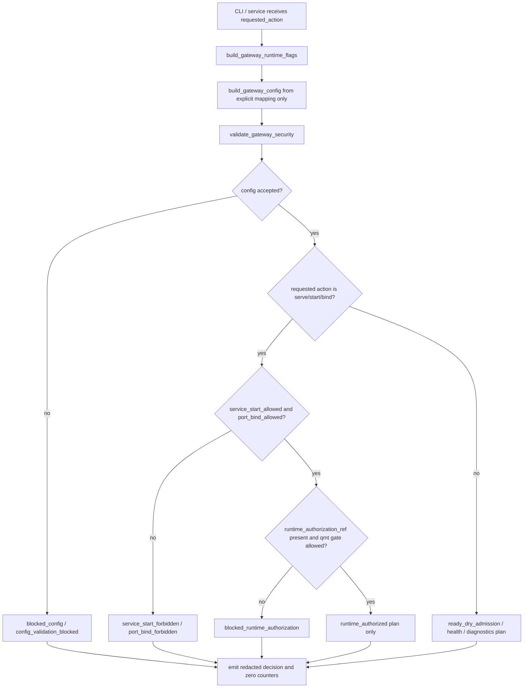

# LLD: CR020-S01 - Windows gateway runtime 与准入合同

> 本文档是 `CR020-S01-windows-gateway-runtime-admission` 的 Low-Level Design。当前仅允许 LLD 与 CP5 自动预检，不授权实现、依赖变更、gateway 启动、端口绑定、真实 `.env` 读取、QMT / MiniQMT / XtQuant 连接、交易、账户写入、simulation/live、provider/lake/publish 或凭据输出。

## 1. Goal

创建 Windows S 端 gateway runtime 与准入合同的实现蓝图：在后续 CP5 全量 LLD 人工确认通过后，创建 `trading/qmt_gateway_cli.py` 和 `tests/test_cr020_windows_gateway_runtime_admission.py`，并修改 `trading/qmt_gateway_service.py`、`trading/qmt_gateway_config.py`，使 gateway 的 Typer 命令面、配置准入、lifecycle、heartbeat、runtime authorization、bind gate、read-only admission 和 no-real-operation counters 可被 CR020-S02/S03/S04/S05/S06 消费。

本 Story 的核心效果是把 CR019-S04 的“离线 lifecycle / config 合同”升级为 CR020 的“授权后可运行的准入合同”。默认状态仍 fail-closed：CP5 前 `implementation_allowed=false`、`service_start_allowed=false`、`port_bind_allowed=false`、`credential_read_allowed=false`、`qmt_operation_allowed=false`。

## 2. Requirements（Functional / Non-Functional）

### 2.1 Functional

- 创建 S 端 Windows `uv run` Typer CLI 合同文件 `trading/qmt_gateway_cli.py`，定义 `admission`、`plan`、`serve`、`stop`、`health`、`diagnostics` 六类命令的参数、结构化输出、错误码和 fail-closed 行为。
- 修改 `trading/qmt_gateway_config.py`，新增 CR020 runtime admission 配置字段：`implementation_allowed`、`dependency_change_allowed`、`service_start_allowed`、`port_bind_allowed`、`credential_read_allowed`、`qmt_operation_allowed`、`runtime_authorization_ref`、`dry_run_only`、`public_bind_allowed_count`。
- 修改 `trading/qmt_gateway_service.py`，新增 runtime admission decision、lifecycle plan admission wrapper、heartbeat admission summary 和 start/bind/requested action guard；默认 start / serve / bind 均返回 blocked，不执行副作用。
- 创建 `tests/test_cr020_windows_gateway_runtime_admission.py`，覆盖 lifecycle/config/admission 字段 100%、public bind allowed 次数 0、CP5 前 start/bind/QMT/.env 计数 0、Typer command matrix、Typer 缺失 fail-closed、禁止导入网络 / XtQuant / 启动模块。
- 保持共享文件只读设计：`docs/QMT-GATEWAY-INSTALL.md` 由 CR020-S06 合并，`trading/qmt_gateway_contracts.py` 由 CR020-S05 合并；S01 只定义与这些文件的接口期望，不在本 Story 实现它们。
- 不读取 `.env`、不解析真实凭据、不绑定端口、不启动服务、不连接 QMT / MiniQMT / XtQuant、不调用 provider/lake/publish、不修改 `pyproject.toml` / `uv.lock`。

### 2.2 Non-Functional

- 安全：默认禁止操作计数全部为 0，特别是 `service_start_count`、`port_bind_count`、`credential_read`、`qmt_api_call`、`xtquant_import`、`real_order`、`account_write`、`provider_fetch`、`lake_write`、`publish`。
- 可验证：每个接口入口在第 10 节至少有 1 条 fixture-only / static-contract 测试；测试不得启动 gateway 或打开 socket。
- 兼容：保留 CR019-S04 既有 `build_gateway_config`、`validate_gateway_security`、`plan_gateway_lifecycle`、`build_heartbeat_summary` 行为；CR020 以新增字段和 wrapper 扩展，不破坏旧测试。
- 平台：S 端正式命令面是 `uv run` Python Typer CLI；PowerShell/CMD 仅为 shell 宿主，不作为业务 CLI 合同。
- 依赖隔离：S01 不修改依赖文件；Typer 依赖落地按 ADR-093 进入 CP5 批次或后续平台/依赖决策。Typer 不可用时 CLI adapter 必须输出 `typer_dependency_missing` 且保持 no-real-operation。
- 性能：admission / config / command matrix 为内存 dataclass / enum / mapping 计算，fixture 测试目标单文件小于 1 秒；不做网络探测。

## 3. 模块拆分与职责

| 模块 / 文件组 | 职责 | 说明 |
|---|---|---|
| S-side CLI Contract / `trading/qmt_gateway_cli.py` | 定义 Typer command matrix、CLI 参数、结构化输出和 Typer adapter | 创建；只构造 app / command contract，不启动服务 |
| Gateway Runtime Admission / `trading/qmt_gateway_service.py` | 定义 runtime admission decision、start/bind guard、heartbeat admission summary、lifecycle wrapper | 修改；复用 CR019 lifecycle plan，不触发真实运行 |
| Gateway Runtime Config / `trading/qmt_gateway_config.py` | 定义 runtime flags、authorization ref、no-real-operation counters 和 public bind policy | 修改；不读取文件或环境变量 |
| S01 Contract Tests / `tests/test_cr020_windows_gateway_runtime_admission.py` | 验证字段覆盖、默认 fail-closed、Typer adapter、静态禁止导入和 counters | 创建；fixture-only |
| Shared Contract / `trading/qmt_gateway_contracts.py` | 后续 S05 的 typed result 和 endpoint result 合同 | 本 Story 只声明消费期望，不修改 |
| Gateway Docs / `docs/QMT-GATEWAY-INSTALL.md` | 后续 S06 的运行手册和 CP7 证据说明 | 本 Story 只声明合并规则，不修改 |

## 4. 代码结构与文件影响范围

| 动作 | 文件路径 | 变更内容 |
|---|---|---|
| 创建 | `trading/qmt_gateway_cli.py` | 新增 S 端 Typer CLI 合同：command matrix、optional Typer app factory、CLI 参数、structured result、dependency-missing fail-closed path |
| 修改 | `trading/qmt_gateway_service.py` | 在 CR019 lifecycle 合同上新增 CR020 runtime admission dataclass / enum、`evaluate_gateway_runtime_admission`、`plan_gateway_runtime_action`、heartbeat admission wrapper 和 no-real-operation guards |
| 修改 | `trading/qmt_gateway_config.py` | 新增 `GatewayRuntimeAdmissionConfig` / `GatewayRuntimeFlags`、runtime authorization ref、dependency/service/bind/credential/QMT gate 字段和 counters 归一化 |
| 创建 | `tests/test_cr020_windows_gateway_runtime_admission.py` | 新增 fixture-only 测试，覆盖 Story AC、接口、异常路径和 forbidden import / operation counters |
| 不修改 | `docs/QMT-GATEWAY-INSTALL.md` | 由 CR020-S06 合并文档；S01 只在 LLD 中声明 S06 需消费的命令合同 |
| 不修改 | `trading/qmt_gateway_contracts.py` | 由 CR020-S05 合并 endpoint typed result；S01 只声明 admission result 可映射到 shared blocked reason |
| 禁止 | `pyproject.toml`、`uv.lock`、`.env`、`.env.*` | S01 不拥有这些文件；不得改依赖或读取真实凭据 |

## 5. 数据模型与持久化设计

| 对象 / 字段 | 类型 | 约束 | 说明 |
|---|---|---|---|
| `CR020_GATEWAY_RUNTIME_SCHEMA_VERSION` | string | 固定 `cr020-s01-gateway-runtime-admission-v1` | S01 schema 版本 |
| `GatewayRuntimeFlags.implementation_allowed` | bool | 默认 false | CP5 全量确认前不得实现；实现后仍需 runtime gate |
| `GatewayRuntimeFlags.dependency_change_allowed` | bool | 默认 false | S01 不改 `pyproject.toml` / `uv.lock` |
| `GatewayRuntimeFlags.service_start_allowed` | bool | 默认 false | start / serve 默认 blocked |
| `GatewayRuntimeFlags.port_bind_allowed` | bool | 默认 false | 不绑定端口；public bind 默认 blocked |
| `GatewayRuntimeFlags.credential_read_allowed` | bool | 默认 false | 不读取 `.env` 或真实 secret |
| `GatewayRuntimeFlags.qmt_operation_allowed` | bool | 默认 false | 不触达 QMT / MiniQMT / XtQuant |
| `GatewayRuntimeFlags.dry_run_only` | bool | 默认 true | 所有 CLI 默认只返回计划 / admission |
| `GatewayRuntimeFlags.runtime_authorization_ref` | string | 默认空或 `<runtime-authorization-ref>` | 仅允许脱敏引用，不存真实凭据 |
| `GatewayRuntimeAdmissionStatus` | enum string | `blocked_pre_cp5` / `blocked_dependency` / `blocked_config` / `blocked_runtime_authorization` / `ready_dry_admission` / `runtime_authorized` | 表达准入状态，不代表服务已运行 |
| `GatewayRuntimeAdmissionDecision` | dataclass | `accepted`、`blocked_reason`、`reasons`、`flags`、`config_validation`、`command_spec`、`counters` | CLI / service 共享结构化输出 |
| `GatewayCliCommandSpec` | dataclass | command、options、requires_runtime_authorization、dry_run_only、forbidden_side_effects | 可在无 Typer 依赖时被测试 |
| `GatewayRuntimeCounters` | map[string,int] | 默认所有禁止操作为 0 | 覆盖 service/bind/credential/QMT/order/account/provider/lake/publish |

持久化设计：本 Story 不新增数据库、文件持久化、secret store、credential cache、nonce store 或 session store。`runtime_authorization_ref` 仅为脱敏字符串引用，不保存真实 `.env` 值、账号、密码、token、session、交易密码、私钥或真实私有路径。真实 session / `.env` 读取由 CR020-S02 在独立 LLD 中设计。

## 6. API / Interface 设计

| 接口 / 入口 | 输入 | 输出 | 调用方 | 说明 |
|---|---|---|---|---|
| `build_gateway_runtime_flags` | mapping / explicit overrides | `GatewayRuntimeFlags` | CLI、service、tests | 不读环境；默认全部 gate 为 false |
| `collect_gateway_runtime_counters` | optional counters mapping | normalized counters dict | CLI、service、tests、CP6/CP7 | 默认 forbidden counters 全 0 |
| `evaluate_gateway_runtime_admission` | config、flags、requested_action | `GatewayRuntimeAdmissionDecision` | CLI、service planner、tests | 统一判断 CP5 前 / dependency / config / runtime authorization / start-bind guard |
| `plan_gateway_runtime_action` | requested action、config、flags | `GatewayLifecyclePlan` 或 admission decision dict | S 端 CLI、tests | 对 `serve` / `start` / `bind` 默认返回 blocked；不执行服务 |
| `build_gateway_cli_command_matrix` | optional flags | tuple[`GatewayCliCommandSpec`] | docs、tests、Typer app factory | 不依赖 Typer，可静态验证命令合同 |
| `create_gateway_typer_app` | command matrix、callbacks | Typer app 或 dependency blocked result | S 端 `uv run` CLI | Typer 缺失时返回 / 暴露 `typer_dependency_missing`，不得 import-time 崩溃 |
| CLI `admission` | `--config`、`--host`、`--port`、`--runtime-authorization-ref`、`--dry-run` | redacted admission JSON / dict | Windows operator、CP7 | 只输出准入状态 |
| CLI `serve` | 同上 | blocked 或 authorized plan | Windows operator | 默认 blocked；后续 runtime 授权后仍需由实现阶段另行处理真实启动 |
| CLI `stop` | `--runtime-authorization-ref`、`--dry-run` | stopped plan / blocked | Windows operator | CP5 前只返回 plan，不发送进程信号 |
| CLI `health` | optional observation fixture / redacted status | `GatewayHealthSummary` | Windows operator、CP7 | 本 Story 不主动探测网络 |
| CLI `diagnostics` | config、flags | redacted config/admission/counters | Windows operator、QA | 不输出 secret 或真实 `.env` |

错误模型：`implementation_not_allowed`、`dependency_change_not_allowed`、`service_start_forbidden`、`port_bind_forbidden`、`credential_read_forbidden`、`qmt_call_forbidden`、`runtime_authorization_missing`、`public_bind_forbidden`、`config_validation_blocked`、`typer_dependency_missing`、`redaction_policy_incomplete`。第 10 节为每个关键错误路径提供测试入口。

## 7. 核心处理流程



1. CLI 或 service helper 接收 requested action，不直接启动服务。
2. 从显式 mapping / 参数构造 runtime flags；默认 CP5 前全部 gate 为 false。
3. 从显式 mapping 构造 gateway config，复用 CR019 `validate_gateway_security`，不读取 `.env`、磁盘配置或环境变量。
4. 配置不安全时返回 `blocked_config`，并保留 forbidden counters 为 0。
5. requested action 为 `serve` / `start` / `bind` 时，先检查 `service_start_allowed` 与 `port_bind_allowed`；默认返回 blocked。
6. 即使后续 runtime gate 打开，也必须要求 `runtime_authorization_ref`，且不得在 S01 单测中执行真实 socket / QMT 调用。
7. `health`、`diagnostics`、`admission` 只返回 redacted structured result；Typer 缺失时返回 `typer_dependency_missing`。
8. 所有异常路径必须暴露 blocked reason、schema_version、redaction_status 和 zero counters。

## 8. 技术设计细节

- CR020 扩展必须保持 CR019-S04 向后兼容：既有 `build_gateway_config`、`validate_gateway_security`、`plan_gateway_lifecycle` 和 `service_start_forbidden` 不得改变默认行为；新增 CR020 wrapper 负责 runtime admission。
- `trading/qmt_gateway_cli.py` 分两层：`build_gateway_cli_command_matrix` 使用标准库 dataclass/enum，供无 Typer 环境测试；`create_gateway_typer_app` 在函数内部 optional import Typer，Typer 缺失时输出 `typer_dependency_missing`，不得在 module import 阶段失败。
- S01 不修改依赖文件。若 CP5 批次确认后仍未有 Typer 依赖落地，S01 实现必须保持 CLI dependency fail-closed；真实 Typer 运行由 meta-po 在 CP5 Decision Brief 或后续依赖 / 安装 Story 中明确授权。
- exact bind 规则沿用 CR019：`0.0.0.0`、公网 IP、公网 CIDR、`public_exposure_allowed=true`、firewall disabled、allowlist empty 均 blocked；`public_bind_allowed_count` 必须为 0。
- `runtime_authorization_ref` 只能是 `<runtime-authorization-ref>` 或脱敏标识，不得包含真实账号、密码、token、session、交易密码、私钥、真实 `.env` 路径。
- CLI 输出采用结构化 dict / JSON-friendly mapping：`schema_version`、`command`、`status`、`accepted`、`blocked_reason`、`reasons`、`redaction_status`、`counters`、`next_action`。
- `trading/qmt_gateway_service.py` 不导入 `fastapi`、`uvicorn`、`socket`、`subprocess`、`requests`、`httpx`、`xtquant`、`xttrader`；实际 REST gateway / QMT session / auth route 由后续 Story 在门控内设计。
- 与共享文件合并规则：S02/S04/S05 可在后续修改 `qmt_gateway_config.py` / `qmt_gateway_service.py` 的 shared 字段，但不得删除 S01 的 runtime admission fields；若字段名变化，S06 文档实现前必须复核 confirmed LLD。
- 图示类型选择：流程图；原因是 CP5 前 fail-closed、runtime authorization、start/bind、config blocked、Typer dependency missing 存在多分支。

## 9. 安全与性能设计

| 维度 | 设计措施 | 验证方式 |
|---|---|---|
| 安全 | `implementation_allowed=false`、`service_start_allowed=false`、`port_bind_allowed=false` 默认阻断 start / serve / bind | `test_default_runtime_flags_block_service_start_and_bind` |
| 安全 | 不读取 `.env`，不输出 credential 原文，只允许 `runtime_authorization_ref` 脱敏引用 | 静态扫描 `.env` read pattern；字段断言 |
| 安全 | 不导入网络、进程、QMT runtime 模块 | AST import scan 覆盖 CLI/service/config |
| 安全 | public bind 默认 blocked，`public_bind_allowed_count=0` | public bind fixture 测试 |
| 安全 | 所有 forbidden counters 默认为 0，异常路径不得增加真实操作计数 | counters snapshot |
| 可观测 | admission decision 输出 schema、status、reason、redaction_status、next_action | 结构化输出字段测试 |
| 性能 | dataclass / mapping / enum 计算，无 I/O、无 socket、无 subprocess | 单文件 pytest runtime 目标小于 1 秒 |
| 兼容 | CR019 既有 lifecycle/config 测试继续通过 | 后续回归执行 `tests/test_cr019_qmt_gateway_lifecycle.py` 与 S01 测试 |

## 10. 测试设计

| 测试场景 | 前置条件 | 操作 | 预期结果 | 验证方式 |
|---|---|---|---|---|
| runtime/config/admission 字段覆盖率 100% | 构造 safe fixture config 和默认 flags | 调用 `build_gateway_runtime_flags`、`evaluate_gateway_runtime_admission` | flags、decision、config validation、command spec、counters 字段齐全 | `tests/test_cr020_windows_gateway_runtime_admission.py` |
| CP5 前 start / serve / bind 阻断 | 默认 flags 全 false | 调用 `plan_gateway_runtime_action("serve")` / CLI command matrix | `service_start_forbidden` 或 `port_bind_forbidden`；`service_start_count=0`、`port_bind_count=0` | pytest 字段断言 |
| public bind 默认 allowed 次数为 0 | bind_host=`0.0.0.0`、public IP、`public_exposure_allowed=true` | 调用 config validation + admission | blocked；`public_bind_allowed_count=0` | pytest fixture |
| Typer command matrix 可静态验证 | 不要求安装 Typer | 调用 `build_gateway_cli_command_matrix` | 六类命令存在，command/option/requires_runtime_authorization/dry_run 字段完整 | pytest 字段断言 |
| Typer 缺失 fail-closed | monkeypatch import Typer 不可用 | 调用 `create_gateway_typer_app` 或 dependency probe | `typer_dependency_missing`，不启动服务、不改 counters | pytest monkeypatch |
| diagnostics / health 不探测网络 | 默认 observation fixture | 调用 health / diagnostics helper | 只返回 redacted summary；`gateway_socket_open=0`、`http_client_call=0` | pytest counters |
| forbidden import 静态扫描 | 读取 S01 三个源文件 AST | 扫描 import roots | 不存在 `fastapi`、`uvicorn`、`socket`、`subprocess`、`requests`、`httpx`、`xtquant`、`xttrader` | AST 测试 |
| 真实操作计数为 0 | 调用全部 public helpers | 收集 counters | dependency/service/bind/credential/QMT/order/account/provider/lake/publish 均为 0 | counters helper |
| CR019 兼容 | CR019 safe config fixture | 调用既有 `plan_gateway_lifecycle` / `service_start_forbidden` | 既有 blocked reason 和 schema 不回退 | 后续组合回归建议执行 CR019 测试 |

建议后续实现完成后执行：`uv run --python 3.11 pytest -q tests/test_cr020_windows_gateway_runtime_admission.py tests/test_cr019_qmt_gateway_lifecycle.py`。本 LLD 阶段不执行测试。

## 11. 实施步骤

| TASK-ID | 动作 | 目标文件 | 详细描述 | 对应测试 |
|---|---|---|---|---|
| CR020-S01-T1 | 创建 | `trading/qmt_gateway_cli.py` | 定义 CLI command matrix、optional Typer app factory、command callbacks、structured output 和 `typer_dependency_missing` fail-closed path | Typer command matrix；Typer 缺失 fail-closed；forbidden import scan |
| CR020-S01-T2 | 修改 | `trading/qmt_gateway_config.py` | 新增 runtime flags、runtime authorization ref、public bind admission counters、forbidden counters 扩展和 mapping builder | runtime/config/admission 字段覆盖率；public bind 默认 0 |
| CR020-S01-T3 | 修改 | `trading/qmt_gateway_service.py` | 新增 `GatewayRuntimeAdmissionDecision`、`evaluate_gateway_runtime_admission`、`plan_gateway_runtime_action`、health/diagnostics admission wrapper；保持 CR019 兼容 | CP5 前 start/serve/bind 阻断；diagnostics/health 不探测网络；CR019 兼容 |
| CR020-S01-T4 | 创建 | `tests/test_cr020_windows_gateway_runtime_admission.py` | 编写 fixture-only 测试、AST 禁止导入扫描、zero counters 回归和 Typer dependency fail-closed 测试 | 全部 S01 测试场景 |
| CR020-S01-T5 | 门控 | CP5 / CP6 / CP7 | CP5 前保持 implementation/service/bind/credential/QMT gate 为 false；CP6 自检记录无真实操作；CP7 由 meta-qa 在独立授权内验证 | CP6 / CP7 检查点 |

## 12. 风险、难点与预研建议

### 12.1 实现灰区与取舍记录

| Clarification ID | 问题 | 选项与推荐 | 决策 / 答案 | 影响面 | 证据 | 重访条件 |
|---|---|---|---|---|---|---|
| LCQ-CR020-S01-01 | S01 必须定义 Typer CLI，但 Story 禁止修改 `pyproject.toml` / `uv.lock`，当前仓库未检出 Typer 依赖；如何落地 CLI 依赖边界？ | 推荐：S01 创建可静态测试的 command matrix + optional Typer adapter，Typer 缺失时返回 `typer_dependency_missing` 并 fail-closed；备选 A：S01 直接修改依赖文件；备选 B：把 CLI 改为 argparse；备选 C：将真实 Typer app 延后到 S06 或独立依赖 Story | 当前作为非阻断 OPEN，`blocks_lld=false`。用户在 CP5 回复 `approve` 时接受推荐方案：S01 不改依赖，Typer 真实运行需由 CP5 批次或后续依赖/安装门控单独授权 | 接口 / 文件 owner / 测试 / 安全 / 文档 / 跨 Story 契约 | ADR-087 要求 S 端 Typer CLI；ADR-093 要求依赖隔离且 CP5 前不改依赖；Story forbidden 包含 `pyproject.toml` / `uv.lock` | CP5 批次确认、后续实现发现 Typer 不可用、或用户要求 CLI 必须在 S01 CP6 中真实可运行时重访 |

| 风险 / 难点 | 影响 | 缓解措施 / 预研建议 |
|---|---|---|
| Typer 依赖未落地导致 CLI 不能真实运行 | S 端运行命令无法 CP7 验证 | S01 先实现 command matrix 和 optional adapter；CP5 Decision Brief 暴露 LCQ-CR020-S01-01；后续由 meta-po 决定依赖 Story 或外部 Windows runtime |
| 把 admission plan 误当成 gateway 已启动 | 用户或文档误判 QMT ready | 输出字段必须区分 `ready_dry_admission`、`runtime_authorized` 与 `running_observed`；默认 no-real-operation counters 全 0 |
| S01 与 S02/S04/S05 共享 `qmt_gateway_service.py` 字段漂移 | 后续 session/auth/query Story 接口冲突 | S01 冻结 runtime admission 基础字段；后续 shared 修改不得删除字段；S06 实现前按 confirmed LLD 复核 |
| `runtime_authorization_ref` 泄露真实信息 | 凭据或账号暴露 | 只允许 placeholder / hash / ref；测试扫描敏感字面量；真实 `.env` 由 S02 单独门控 |
| public bind 或 allowlist 被误放开 | gateway 暴露风险 | exact rules fail-closed；public bind allowed count 始终 0，除非后续人工运行授权明确改变 |
| CR019 兼容性回退 | 已验证 lifecycle 合同破坏 | CR020 wrapper 不改变 CR019 默认函数；组合回归覆盖 CR019 测试 |

### OPEN / Spike 跟踪

| ID | 类型（OPEN / Spike） | 问题 | 下一动作 | 责任方 |
|---|---|---|---|---|
| LCQ-CR020-S01-01 | OPEN | Typer 真实依赖落地不归 S01 文件 owner；S01 推荐 optional adapter + dependency-missing fail-closed | meta-po 在 CP5 批次 Decision Brief 汇总；若用户 approve，即接受推荐并要求实现阶段不得改依赖文件 | meta-po / meta-dev / 后续依赖 owner |

## 13. 回滚与发布策略

- 发布方式：本 LLD 只进入 CR020 全量 CP5 LLD 批次；CP5 人工确认前不得实现。后续实现完成后仅发布代码合同和 fixture-only 测试，不启动服务、不绑定端口、不连接 QMT。
- 回滚触发条件：修改 `pyproject.toml` / `uv.lock`；读取 `.env`；导入 `xtquant` / `socket` / `uvicorn` 等真实 runtime；`serve` / `start` 默认 allowed；`public_bind_allowed_count>0`；任一 forbidden counter 非 0；真实凭据出现在日志、测试、文档或检查点。
- 回滚动作：回退 `trading/qmt_gateway_cli.py`、`trading/qmt_gateway_service.py`、`trading/qmt_gateway_config.py` 和 `tests/test_cr020_windows_gateway_runtime_admission.py` 中 S01 变更；不得回退 CR019 已验证合同或其他 CR020 Story 产物；若问题涉及依赖 / 凭据 / runtime 授权，交回 meta-po 发起 CR 或 CP5 修订。
- 切换策略：Typer 不可用时保持 `typer_dependency_missing` fail-closed；若用户在 CP5 要求真实 Typer runtime，则新增依赖/安装决策，不在 S01 私自改锁。

## 14. Definition of Done

- [ ] 14 个可见章节全部填写完成。
- [ ] LLD frontmatter `confirmed=false`、`status=ready-for-review`、`tier=M`、`cp5_batch=CR020-QMT-GATEWAY-READONLY-BATCH-A`。
- [ ] `trading/qmt_gateway_cli.py` 的 command matrix 覆盖 `admission`、`plan`、`serve`、`stop`、`health`、`diagnostics` 六类命令。
- [ ] `trading/qmt_gateway_config.py` 的 runtime flags 覆盖 implementation/dependency/service/bind/credential/QMT/public bind gate。
- [ ] `trading/qmt_gateway_service.py` 的 admission decision 对 start / serve / bind 默认 fail-closed。
- [ ] gateway lifecycle/config/admission 字段覆盖率为 100%。
- [ ] public bind 默认 allowed 次数为 0。
- [ ] CP5 前 `implementation_allowed=false`、`service_start_allowed=false`、`port_bind_allowed=false`。
- [ ] CP5 前 QMT / MiniQMT / XtQuant 调用次数为 0。
- [ ] 依赖变更次数为 0；`pyproject.toml` / `uv.lock` 不属于输出文件。
- [ ] 接口设计中的每个入口均在第 10 节有对应测试场景。
- [ ] 异常路径 `service_start_forbidden`、`port_bind_forbidden`、`runtime_authorization_missing`、`public_bind_forbidden`、`typer_dependency_missing` 有测试入口。
- [ ] 实现灰区与取舍记录已回填；`LCQ-CR020-S01-01` 为非阻断 OPEN，`blocks_lld=false`。
- [ ] 人工确认前不得进入实现；实现偏离本 LLD 时必须在 CP6 记录原因、影响和回归范围。

## 人工确认区

> **CP5 — Story LLD 可实现性门**
> meta-dev 先写入 `process/checks/CP5-CR020-S01-windows-gateway-runtime-admission-LLD-IMPLEMENTABILITY.md` 自动预检结果。meta-po 收齐 CR020-S01..S06 全部 LLD、CP4 摘要和 CP5 自动预检后，再生成批次人工审查稿并发起统一确认。

**CP5 checklist 摘要**：

| # | 检查项 | 状态 | 证据 |
|---|---|---|---|
| 1 | LLD 覆盖 AC | 待检查 | 第 2 / 10 / 14 节 |
| 2 | 与 HLD / ADR 一致 | 待检查 | 第 3 / 8 / 12 节 |
| 3 | 文件影响范围明确 | 待检查 | 第 4 / 11 节 |
| 4 | 接口契约完整 | 待检查 | 第 6 节 |
| 5 | 测试与 dev_gate 可计算 | 待检查 | 第 10 / 14 节 |
| 6 | clarification queue 已收敛 | 待检查 | 第 12.1 节；`LCQ-CR020-S01-01` 非阻断 |

**人工确认回复**：

```text
approve
修改: <具体修改点>
reject
```

**人工审查结果回填**：

- 结论：`approved | changes_requested | rejected`
- 审查人：
- 审查时间：
- 修改意见：
- 风险接受项：
