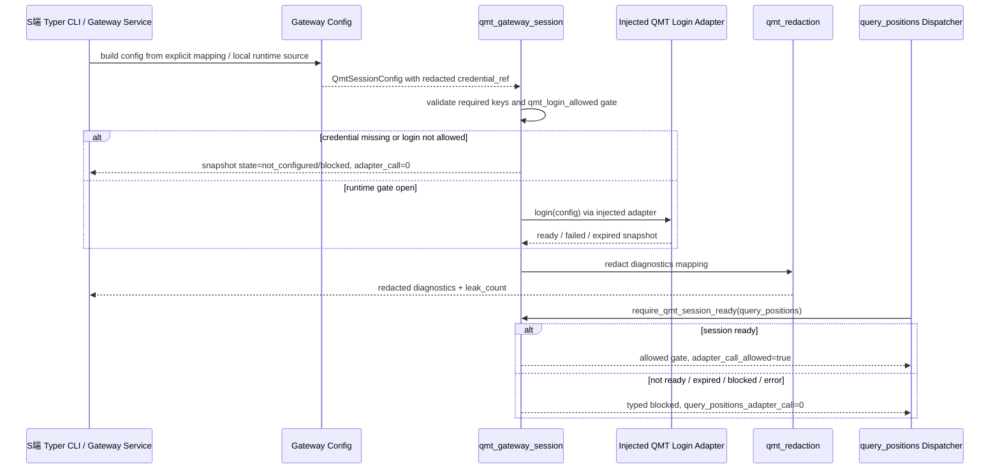

# LLD: CR020-S02 - Server QMT 登录与 session ready gate

本文档只冻结 CR020-S02 的低层设计和后续实现合同。当前 `confirmed=false`，且 CR-020 全量 CP5 LLD 批次尚未人工确认；因此本文档不授权实现、不授权读取真实 `.env`、不授权真实登录 QMT / MiniQMT / XtQuant、不授权启动 gateway、不授权连接端口、不授权输出任何真实凭据或账户敏感值。

## 1. Goal

创建 `trading/qmt_gateway_session.py` 的 QMT 登录 / session 状态合同，修改 `.env.example` 为 placeholder-only 凭据引用示例，并创建 `tests/test_cr020_server_qmt_login_session.py` 的 fixture-only 测试，使 Windows gateway 在后续获批实现后具备 `credential_ref` 脱敏、session ready gate、fail-closed blocked reason 和 `query_positions` 前置阻断能力。

完成效果是：`query_positions` 在 session 非 ready 时必须被阻断，endpoint adapter call 为 0；`.env.example` 不含真实值；日志、错误、诊断、CP7 evidence 只允许输出脱敏引用。

## 2. Requirements（Functional / Non-Functional）

### 2.1 Functional

- session 状态必须至少覆盖 `not_configured`、`login_pending`、`ready`、`expired`、`blocked`、`error` 六种稳定值。
- session ready gate 必须在 `query_positions` 调用真实 QMT adapter 之前执行；状态不是 `ready` 时返回 typed blocked result，`adapter_call_allowed=false`，`query_positions_adapter_call=0`。
- credential 只以 redacted `credential_ref`、hash/ref 或占位名进入结果；不得保存、返回、记录账号、登录密钥、token、session 原文、交易密码、私钥或真实私有路径。
- `.env.example` 只能新增 placeholder 与说明，变量值必须是占位符；真实 `.env` 和 `.env.*` 不属于交付物。
- `trading/qmt_gateway_session.py` 不在模块 import 阶段导入 XtQuant / MiniQMT / QMT SDK；真实 runtime adapter 只能在 CP5/CP6/CP7 门控满足后由 Windows S 端运行面注入。
- session diagnostics 必须包含 `state`、`ready`、`blocked_reason`、`credential_ref`、`redaction_status`、`leak_count`、forbidden counters，且不包含敏感原文。
- login fail、credential not configured、runtime unavailable、session expired、redaction failed、gateway runtime not ready 均必须 fail-closed。
- CR020-S05 只能消费本 Story 的 session ready gate；不得由 S05 自行绕过 gate 直接转发 `query_positions`。

### 2.2 Non-Functional

- 安全：真实凭据入库、日志、检查点、对话、memory、测试快照的次数必须为 0；CP5 前真实 `.env` 读取次数和真实 QMT login 次数必须为 0。
- 可靠性：session state transition 必须可预测；`expired`、`blocked`、`error` 与 heartbeat stale 均不能被解释为 ready。
- 可测试：CP5/CP6 阶段默认使用 fixture-only adapter 和显式 mapping；不依赖 Windows、QMT、MiniQMT、XtQuant、真实 `.env` 或网络。
- 平台兼容：S 端 QMT runtime 留在 Windows gateway 边界；Linux C 端不导入 XtQuant，不消费本模块的真实 adapter。
- 可维护：blocked reason 使用稳定枚举 / 字符串；接口与 `trading/qmt_gateway_contracts.py` 的 typed blocked result 可衔接。
- 性能：session ready 判定为常数时间状态检查；redaction 对 mapping 字段 exact match 优先，文本扫描只用于日志 / diagnostics 输出边界。

## 3. 模块拆分与职责

| 模块 / 文件组 | 职责 | 说明 |
|---|---|---|
| `trading/qmt_gateway_session.py` | 定义 session state、credential ref、login adapter protocol、session snapshot、ready gate、diagnostics 与 safety counters | 当前 Story primary；不读取文件、不读取环境、不执行真实登录；真实 adapter 运行注入 |
| `.env.example` | 提供 CR020-S02 placeholder-only 变量名和本地未跟踪 `.env` 说明 | 当前 Story primary；不得含真实值、真实私有路径或示例账号 |
| `tests/test_cr020_server_qmt_login_session.py` | 覆盖 session 状态、not ready 阻断、redaction、`.env.example` placeholder、no runtime import、zero counters | 当前 Story primary；fixture-only |
| `trading/qmt_gateway_service.py` | 后续 S01/S02 串行合并时消费 session diagnostics，将 health / capabilities 暴露为 redacted 状态 | shared；本 LLD 只定义合并规则，当前不实现 |
| `trading/qmt_gateway_config.py` | 后续接收 session ready timeout、session ttl、credential ref source 的配置字段 | shared；不得在 CP5 前读取真实 `.env` |
| `trading/qmt_redaction.py` | 复用并扩展敏感字段脱敏，至少覆盖 `credential_ref`、账号类、token、session、登录密钥、交易密码、私有路径 | shared；与 CR020-S04 的 redaction primary owner 串行合并 |

## 4. 代码结构与文件影响范围

| 动作 | 文件路径 | 变更内容 |
|---|---|---|
| 创建 | `trading/qmt_gateway_session.py` | 新增 `QMT_SESSION_SCHEMA_VERSION`、`QmtSessionState`、`QmtSessionBlockedReason`、`QmtCredentialRef`、`QmtSessionConfig`、`QmtSessionSnapshot`、`QmtSessionGateResult`、`QmtLoginAdapter` protocol、session planning / ready gate / diagnostics / counters 函数 |
| 修改 | `.env.example` | 新增 CR020-S02 placeholder-only 区块，声明本地未跟踪 `.env` 需要的变量名和 `credential_ref` 占位；不包含真实值、真实路径或可用账号样本 |
| 创建 | `tests/test_cr020_server_qmt_login_session.py` | 新增 fixture-only session 状态、not ready / expired / redaction / placeholder / forbidden import / zero counter 测试 |
| 修改 | `trading/qmt_gateway_service.py` | 串行合并 session diagnostics hook：health / diagnostics 可展示 redacted `session_state`，不得在 health 路径触发真实登录 |
| 修改 | `trading/qmt_gateway_config.py` | 串行合并 session 配置字段：`session_ready_timeout_seconds`、`session_ttl_seconds`、`credential_ref_source`；构造配置时仍不读取磁盘或环境 |
| 修改 | `trading/qmt_redaction.py` | 串行合并 `credential_ref`、`login_account`、`qmt_session` 等别名；redaction fail 时不得 fallback 到 raw |

共享文件的实际修改必须在 CP5 全量确认后，按 CR-020 dev gate、文件 owner 和 merge order 重新计算；当前任务只写本 LLD 和 CP5 自动预检。

## 5. 数据模型与持久化设计

本 Story 不新增持久化表、数据库、broker lake 或真实凭据存储。真实值只允许存在于本地未跟踪 `.env` 的运行环境中；本模块只处理显式传入的 placeholder / redacted ref / fixture mapping，不读取 `.env` 文件。

| 对象 / 字段 | 类型 | 约束 | 说明 |
|---|---|---|---|
| `QmtSessionState` | str enum | 取值固定为 `not_configured`、`login_pending`、`ready`、`expired`、`blocked`、`error` | session ready gate 的唯一状态输入 |
| `QmtSessionBlockedReason` | str enum | 包含 `credential_not_configured`、`credential_read_forbidden`、`login_not_allowed`、`login_failed`、`session_not_ready`、`session_expired`、`gateway_runtime_not_ready`、`qmt_runtime_unavailable`、`redaction_failed` | 错误暴露不含敏感原文 |
| `QmtCredentialRef.credential_ref` | str | 必须为 `<...>` placeholder、hash/ref 或 `[REDACTED]`；不得为真实值 | diagnostics / CP7 evidence 只输出该字段 |
| `QmtCredentialRef.required_keys` | tuple[str, ...] | 只保存变量名，不保存变量值 | 默认包含登录账号引用、登录密钥引用和 QMT runtime 引用的占位变量名 |
| `QmtCredentialRef.missing_keys` | tuple[str, ...] | 只保存缺失变量名 | 用于 `not_configured` blocked reason |
| `QmtSessionConfig` | dataclass | 包含 `credential_ref`、`ready_timeout_seconds`、`session_ttl_seconds`、`qmt_login_allowed`、`redaction_required` | `qmt_login_allowed=false` 时不得调用 adapter |
| `QmtSessionSnapshot` | dataclass | 包含 `state`、`ready`、`blocked_reason`、`credential_ref`、`started_at`、`ready_at`、`expires_at`、`runtime_status`、`counters` | health / diagnostics 和 gate 共享状态 |
| `QmtSessionGateResult` | dataclass | 包含 `allowed`、`blocked`、`state`、`blocked_reason`、`adapter_call_allowed`、`endpoint_id`、`counters` | `query_positions` 前置 gate 输出 |
| `QmtSessionSafetyCounters` | dict[str, int] | CP5/fixture 默认全部为 0；至少覆盖 `credential_read`、`qmt_login_call`、`qmt_api_call`、`xtquant_import`、`query_positions_adapter_call`、`credential_leak`、`account_write`、`real_order` | 用于量化验收和 CP7 evidence |

`.env.example` 只允许出现变量名和占位值，例如 `<qmt-login-account-placeholder>`、`<qmt-login-secret-placeholder>`、`<qmt-runtime-ref-placeholder>`；不得出现真实账号、真实登录密钥、真实 token、真实 session、真实交易密码、真实私钥或真实私有路径。

## 6. API / Interface 设计

| 接口 / 入口 | 输入 | 输出 | 调用方 | 说明 |
|---|---|---|---|---|
| `build_qmt_credential_ref(source, required_keys=...)` | 显式 mapping 或占位 source；只读取 key 存在性和 redaction 状态 | `QmtCredentialRef` | gateway config / tests | 不读取 `.env` 文件；测试 T-S02-02 / T-S02-08 覆盖 |
| `build_qmt_session_config(source=None, *, qmt_login_allowed=False)` | 显式 mapping、timeout、ttl、credential ref source、gate flags | `QmtSessionConfig` | S 端 CLI / gateway service / tests | 默认不允许 login；测试 T-S02-01 / T-S02-03 覆盖 |
| `plan_qmt_login_session(config, adapter=None, now=None)` | session config、可选 adapter、clock | `QmtSessionSnapshot` | gateway startup flow | `qmt_login_allowed=false` 或 adapter 缺失时 blocked，adapter call=0；测试 T-S02-03 / T-S02-04 覆盖 |
| `evaluate_qmt_session_ready(snapshot, now=None)` | session snapshot、clock | `QmtSessionSnapshot` | heartbeat / health / diagnostics | expired 或 stale 不得 ready；测试 T-S02-05 覆盖 |
| `require_qmt_session_ready(snapshot, endpoint_id="query_positions")` | session snapshot、endpoint id | `QmtSessionGateResult` 或可转为 `QmtGatewayResult` 的 blocked payload | CR020-S05 endpoint dispatcher | 非 ready 时 `adapter_call_allowed=false`；测试 T-S02-06 / T-S02-07 覆盖 |
| `build_qmt_session_diagnostics(snapshot)` | session snapshot | redacted mapping + redaction report | health / diagnostics / CP7 evidence | leak_count 必须为 0；测试 T-S02-08 覆盖 |
| `collect_qmt_session_safety_counters(counters=None)` | 可选 counters | 归一化 dict | tests / CP7 evidence | fixture 默认全部为 0；测试 T-S02-09 覆盖 |
| `QmtLoginAdapter` protocol | `login(config)`、`check_ready()`、`logout()` | `QmtSessionSnapshot` | Windows runtime adapter / fixture adapter | 真实 adapter 只能运行注入；测试 T-S02-10 覆盖无模块级 XtQuant import |

错误暴露使用 `QmtSessionBlockedReason` 的稳定 reason code；与 `trading/qmt_gateway_contracts.build_blocked_result()` 衔接时，`detail` 只能包含脱敏字段、状态、计数和 reason，不得包含敏感原文。

## 7. 核心处理流程



1. S 端 CLI / gateway service 在后续获批实现后构造配置；CP5/fixture 阶段只传显式 mapping，不读取真实 `.env`。
2. `build_qmt_credential_ref()` 只判断 required key 的存在性和 redaction 状态，生成 redacted `credential_ref`。
3. `build_qmt_session_config()` 默认 `qmt_login_allowed=false`；未获运行门控时 `plan_qmt_login_session()` 返回 `login_not_allowed`，adapter call 为 0。
4. 运行门控打开后，真实 Windows adapter 只能通过 `QmtLoginAdapter` 注入；模块 import 阶段不得导入 XtQuant / MiniQMT / QMT SDK。
5. adapter 返回的状态被归一化为 `QmtSessionSnapshot`；login fail、runtime unavailable、expired、redaction fail 均为 blocked。
6. `query_positions` dispatcher 必须先调用 `require_qmt_session_ready()`；非 ready 时立即返回 typed blocked，不调用 positions adapter。
7. diagnostics、health、CP7 evidence 只输出 redacted mapping；redaction fail 时 gate 继续 blocked。

## 8. 技术设计细节

- 状态机规则：`not_configured -> login_pending -> ready` 是唯一成功路径；`not_configured`、`blocked`、`error` 不自动恢复；`ready` 超过 `expires_at` 或 heartbeat stale 后转为 `expired`。
- Adapter 注入：`QmtLoginAdapter` 是 protocol，不在 `qmt_gateway_session.py` 顶层导入真实 SDK；Windows runtime factory 在后续 Story / CP7 gate 中单独创建 adapter。
- Credential ref：只保存 `credential_ref` 和 required key 名称；实现不得把 mapping value 写入 dataclass、日志或 exception message。
- Blocked result：S02 自身返回 `QmtSessionGateResult`；S05 gateway dispatcher 可把它映射为 `build_blocked_result("query_positions", "session_not_ready", ...)`。
- Redaction 复用：优先调用 `redact_qmt_mapping()`；若出现 `leak_count > 0` 或 `redaction_status != "pass"`，session diagnostics 和 query gate 都必须 blocked。
- `.env.example` 策略：新增占位变量名和注释，不写真实路径；`tests/test_cr020_server_qmt_login_session.py` 必须扫描该文件，确认真实值样本数为 0。
- 依赖策略：本 Story 不修改 `pyproject.toml` / `uv.lock`；Windows-only runtime 依赖仍由 ADR-093 和后续 CP5/CP7 门控处理。
- 兼容性处理：现有 CR019 模块仍是离线合同；S02 实现必须保持 fixture-only 单测在 Linux 可运行，真实 Windows 验证只进入 CP7。
- 图示类型选择：本 Story 跨 CLI/config/session/adapter/redaction/dispatcher 六个对象，并存在 fail-closed 分支，已在第 7 节提供 Mermaid 时序图。

## 9. 安全与性能设计

| 维度 | 设计措施 | 验证方式 |
|---|---|---|
| 安全 | `qmt_login_allowed=false` 默认阻断；真实 adapter 运行注入；credential ref / diagnostics 全部脱敏；redaction fail 保持 blocked | T-S02-03、T-S02-08、T-S02-10 |
| 凭据保护 | `.env.example` 只含 placeholder；本模块不读取 `.env`；dataclass 不保存 mapping value | T-S02-02、T-S02-11 |
| No-real-operation | CP5/fixture counters 中 `credential_read`、`qmt_login_call`、`qmt_api_call`、`query_positions_adapter_call`、`account_write`、`real_order` 全部为 0 | T-S02-03、T-S02-06、T-S02-09 |
| 可靠性 | `expired`、`blocked`、`error`、heartbeat stale 均不 ready；ready gate 在 dispatcher 前执行 | T-S02-05、T-S02-06、T-S02-07 |
| 性能 | ready gate 为常数时间状态判定；diagnostics redaction 对结构化字段 exact match 优先 | T-S02-08；后续 CP7 记录 latency |
| 平台兼容 | Linux fixture 测试不导入 XtQuant；Windows adapter 懒加载且受门控 | T-S02-10 |

## 10. 测试设计

后续实现阶段建议验证入口：`uv run --python 3.11 pytest -q tests/test_cr020_server_qmt_login_session.py`。本 LLD 阶段不执行测试、不启动 gateway、不连接 QMT。

| 测试场景 | 前置条件 | 操作 | 预期结果 | 验证方式 |
|---|---|---|---|---|
| T-S02-01 session model 字段覆盖 | fixture-only | 检查 dataclass / enum 字段 | 六种 state、blocked reason、snapshot、gate result 字段覆盖率 100% | pytest |
| T-S02-02 credential ref 不保存真实值 | 显式 fixture mapping | 调用 `build_qmt_credential_ref()` | 输出只有 `credential_ref`、required/missing key、redaction status；mapping value 不进入结果 | pytest |
| T-S02-03 CP5 前 login 不允许 | `qmt_login_allowed=false` | 调用 `plan_qmt_login_session()` | `blocked_reason=login_not_allowed`，adapter call=0，qmt_api_call=0 | pytest |
| T-S02-04 not configured fail-closed | 缺 required key | 调用 session config / plan | state=`not_configured`，missing key 只有变量名，adapter call=0 | pytest |
| T-S02-05 expired 不可 ready | snapshot ready 但 ttl 过期 | 调用 `evaluate_qmt_session_ready()` | state=`expired`，ready=false | pytest |
| T-S02-06 session not ready 阻断 positions | state=`login_pending` / `blocked` / `error` | 调用 `require_qmt_session_ready()` | typed blocked，`query_positions_adapter_call=0` | pytest |
| T-S02-07 ready gate 只放行 gate 不直接查 QMT | fixture snapshot ready | 调用 `require_qmt_session_ready()` | gate allowed；仍不产生 qmt_api_call；真正查询由 S05 负责 | pytest |
| T-S02-08 diagnostics 全部脱敏 | snapshot detail 含敏感 key 的 fixture 值 | 调用 `build_qmt_session_diagnostics()` | `leak_count=0`，敏感值不可见，`redaction_status=pass` | pytest |
| T-S02-09 safety counters 归一化 | 无 counters 或部分 counters | 调用 `collect_qmt_session_safety_counters()` | REQUIRED_ZERO_COUNTERS 默认全部为 0 | pytest |
| T-S02-10 源码不做模块级真实 SDK import | 读取 AST | 扫描 `qmt_gateway_session.py` import | 无 `xtquant`、`xttrader`、QMT SDK 模块级 import | pytest |
| T-S02-11 `.env.example` placeholder-only | 读取 `.env.example` | 扫描 CR020-S02 区块 | placeholder 存在；真实账号样本、真实密钥、真实 token、真实 session、真实私有路径数量为 0 | pytest |
| T-S02-12 shared redaction alias 覆盖 | `qmt_redaction.py` 已合并别名或现有规则满足 | 扫描 alias / 调用 redaction | `credential_ref`、账号类、token、session、登录密钥、交易密码、私有路径均不泄露 | pytest |

第 6 节每个接口在上表均有测试入口；第 7 节每个异常路径至少对应 T-S02-03、T-S02-04、T-S02-05、T-S02-06 或 T-S02-08。

## 11. 实施步骤

| TASK-ID | 动作 | 目标文件 | 详细描述 | 对应测试 |
|---|---|---|---|---|
| CR020-S02-T1 | 创建 | `trading/qmt_gateway_session.py` | 定义 session state、blocked reason、credential ref、session config、snapshot、gate result、adapter protocol、diagnostics、counters 与 ready gate | T-S02-01 至 T-S02-10 |
| CR020-S02-T2 | 修改 | `.env.example` | 新增 CR020-S02 placeholder-only 区块；只写变量名、占位值和本地未跟踪说明，不写真实路径或真实值 | T-S02-02、T-S02-11 |
| CR020-S02-T3 | 创建 | `tests/test_cr020_server_qmt_login_session.py` | 创建 fixture-only 测试，覆盖 model、credential ref、login blocked、expired、ready gate、redaction、counters、forbidden imports、`.env.example` 扫描 | T-S02-01 至 T-S02-12 |
| CR020-S02-T4 | 修改 | `trading/qmt_redaction.py` | 串行合并 `credential_ref` 等 alias；若 CR020-S04 已完成更完整 redaction，则 S02 实现需复用并在测试中验证，不重复扩展 | T-S02-08、T-S02-12 |
| CR020-S02-T5 | 修改 | `trading/qmt_gateway_service.py` / `trading/qmt_gateway_config.py` | 串行合并 session diagnostics hook 和 session timeout / ttl / credential ref source 配置字段；不得让 health 触发真实登录 | T-S02-03、T-S02-05、T-S02-06 |

每个 TASK-ID 至少覆盖一个文件影响项；共享文件必须等待 CP5 全量确认后由 meta-po 依据 file owner 和 dev_running 重新调度，不能在 LLD 阶段实现。

## 12. 风险、难点与预研建议

### 12.1 实现灰区与取舍记录

| Clarification ID | 问题 | 选项与推荐 | 决策 / 答案 | 影响面 | 证据 | 重访条件 |
|---|---|---|---|---|---|---|
| LCQ-CR020-S02-01 | QMT / MiniQMT / XtQuant 的真实登录 API、ready 判定信号和 session 过期信号尚未在本环境实测；当前又禁止真实登录和连接。 | 推荐 A：先冻结 `QmtLoginAdapter` protocol、fixture-only tests 和 fail-closed ready gate，真实 adapter 仅在 CP7 Windows 实机授权下接入。备选 B：在 LLD 中硬编码假定的 XtQuant API。备选 C：收窄为 health-only，不做 session ready。A 的优点是安全、可测试、与 ADR-090 一致；代价是 CP7 可能发现 adapter 细节需回修。B 交付快但基于未验证事实且可能污染依赖。C 风险最低但不满足 CR-020。 | 未回答；按推荐 A 作为默认设计并转为非阻断 OPEN。因本次用户限制“只写两个目标文件”，未写入 `STATE.md.parallel_execution.lld_clarification_queue`。`blocks_lld=false`。 | 接口 / 测试 / 安全 / 跨 Story 契约 / CP7 实机验证 | HLD §36.9、§36.10；ADR-088、ADR-090；Story dev_gate `qmt_login_allowed=false` | CP7 Windows 实机发现 ready 信号不可判定、登录 API 不稳定或必须扩大依赖 / 文件 owner 时，回到 CP5 或发起新 CR / Spike |

| 风险 / 难点 | 影响 | 缓解措施 / 预研建议 |
|---|---|---|
| 真实登录 API 未实测 | CP7 可能无法确认 session ready | Adapter protocol 隔离实现细节；CP5 只确认 gate 和失败路径；CP7 实机验证失败时回修 S02 |
| `.env` 或 diagnostics 泄露真实值 | 最高安全风险，必须停止推进 | `.env.example` placeholder-only；redaction fail closed；测试扫描泄露次数为 0 |
| session not ready 仍触发 `query_positions` | 可能触达真实账户敏感数据 | S05 dispatcher 必须先消费 `require_qmt_session_ready()`；测试断言 adapter call=0 |
| 共享文件与 S01/S04/S05 owner 冲突 | 开发阶段 file_conflict_free=false | CP5 后按 Story DAG 和 merge owner 串行合并；S02 不在 LLD 阶段写共享文件 |
| C 端误直连 QMT 或导入 XtQuant | 破坏 ADR-088 gateway 唯一触达点 | S02 不导出真实 SDK；S03/S05 只能经 REST / dispatcher 消费 gate |

### OPEN / Spike 跟踪

| ID | 类型（OPEN / Spike） | 问题 | 下一动作 | 责任方 |
|---|---|---|---|---|
| O-CR020-S02-01 | OPEN | 真实 QMT login / ready / expiry 信号需 Windows 实机确认；当前无法也不得在 LLD 阶段连接 QMT。 | CP5 人工确认时接受 adapter protocol 方案；CP7 实机验证时记录真实 ready 判定证据；若不可判定则回修或转 Spike。 | meta-po / meta-dev / meta-qa |

## 13. 回滚与发布策略

- 发布方式：等待 CR020-S01..S06 全量 LLD 与 CP5 自动预检收齐，由 meta-po 发起 `checkpoints/CP5-CR020-QMT-GATEWAY-READONLY-LLD-BATCH.md` 统一人工确认；确认后仍需按 Wave、依赖、file owner 和 dev_gate 开发。
- 实现发布顺序：开发阶段默认 S01 gateway runtime 合同先落地，S02 再合并 session manager；S05 必须等待 S02 session ready gate、S03 client transport、S04 auth/scope 合同稳定。
- 回滚触发条件：发现真实 `.env` 被读取或输出、`.env.example` 含真实值、redaction leak_count 大于 0、session 非 ready 仍允许 `query_positions`、模块级导入 XtQuant / QMT SDK、或 health 路径触发真实登录。
- 回滚动作：回退 S02 对 `trading/qmt_gateway_session.py`、`.env.example`、`tests/test_cr020_server_qmt_login_session.py` 及共享合并点的实现改动；将 Story 退回 LLD 修订或 CP7 回修队列；若涉及 API / owner 扩大，交回 meta-po 发起 CR / CP5 返工。
- 不授权项：本 LLD 和 CP5 自动预检不授权真实登录、真实账户查询、交易、账户写入、simulation/live、provider/lake/publish、broker lake 写入、依赖变更或 gateway 启动。

## 14. Definition of Done

- [ ] 14 个章节全部填写完成。
- [ ] `QmtSessionState` 覆盖 `not_configured`、`login_pending`、`ready`、`expired`、`blocked`、`error`。
- [ ] `credential_ref`、diagnostics、error、CP7 evidence 只输出 redacted ref / hash / placeholder；真实凭据和账户敏感值泄露次数为 0。
- [ ] session 非 ready 时 `query_positions` typed blocked，`query_positions_adapter_call=0`。
- [ ] CP5 前真实 `.env` 读取次数、真实 QMT login 次数、QMT API call 次数为 0。
- [ ] `.env.example` 只包含 placeholder，不包含真实私有路径或可用样本。
- [ ] `trading/qmt_gateway_session.py` 无模块级 XtQuant / QMT SDK import。
- [ ] 第 6 节接口在第 10 节均有测试入口；第 7 节异常路径在第 10 节均有错误路径验证。
- [ ] shared 文件合并顺序已在第 4 / 11 / 12 节明确，开发前重新计算 file owner 与 dev_running。
- [ ] `confirmed=false`、全量 CP5 未人工确认、dev_gate 未满足时不得进入实现。
- [ ] OPEN / clarification 已清点：1 个非阻断 OPEN，无 `blocks_lld=true` 项。

## 人工确认区

> **CP5 - Story LLD 可实现性门**
> meta-dev 先写入 `process/checks/CP5-CR020-S02-server-qmt-login-session-LLD-IMPLEMENTABILITY.md` 自动预检结果。
> meta-po 收齐 CR020-S01..S06 全部 LLD、CP4 自动预检摘要和 CP5 自动预检后，再生成并提示用户审查 `checkpoints/CP5-CR020-QMT-GATEWAY-READONLY-LLD-BATCH.md`。
> 用户统一确认全部目标 Story 的 LLD 后，仍需满足当前 Wave、依赖门控、文件所有权门控和运行授权方可进入实现或实机验证。

**CP5 checklist 摘要**：

| # | 检查项 | 状态 | 证据 |
|---|---|---|---|
| 1 | LLD 覆盖 AC | 待检查 | 第 2 / 10 / 14 节 |
| 2 | 与 HLD / ADR 一致 | 待检查 | 第 3 / 8 / 12 节 |
| 3 | 文件影响范围明确 | 待检查 | 第 4 / 11 节 |
| 4 | 接口契约完整 | 待检查 | 第 6 节 |
| 5 | 测试与 dev_gate 可计算 | 待检查 | 第 10 / 14 节 |
| 6 | clarification / OPEN 已暴露 | 待检查 | 第 12.1 节 |

**人工确认回复**：

请直接回复以下任一整行：

```text
approve
修改: <具体修改点>
reject
```

**人工审查结果回填**：

- 结论：`approved | changes_requested | rejected`
- 审查人：
- 审查时间：
- 修改意见：
- 风险接受项：
