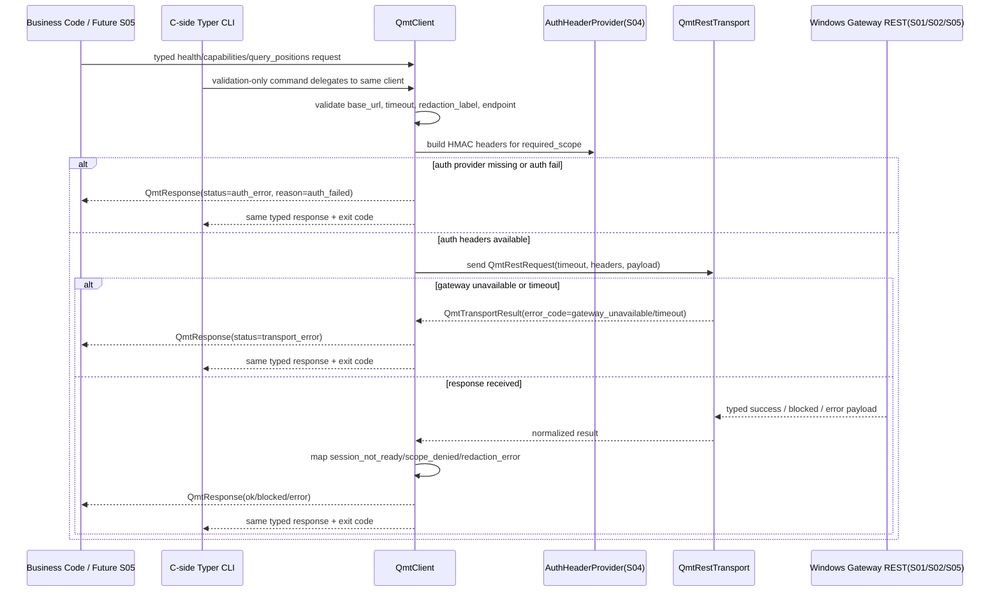

# LLD: CR020-S03 - Linux C 端 REST transport 与 Python client

> 本文档是 `CR020-S03-linux-client-rest-transport` 的低层设计。当前 `confirmed=false`，只允许进入 CR-020 全量 CP5 LLD 统一确认；不得实现代码、不得改依赖、不得在 Linux C 端导入 XtQuant、不得把 CLI 当业务 runtime、不得读取 `.env` / 凭据、不得启动 gateway、不得连接 QMT、不得执行真实请求。

## 1. Goal

修改 Linux C 端 `trading/qmt_client.py` 为 CR-020 的业务唯一 Python REST client 合同，创建 `trading/qmt_client_cli.py` 作为 Typer 配对 / 诊断 / smoke / CP7 验收入口，并创建 `tests/test_cr020_linux_client_rest_transport.py` 的 fixture-only 验证设计，使 C 端业务代码通过 typed REST client 调用 Windows gateway REST API，而不是通过 CLI、XtQuant、`.env` 或真实 QMT 直连。

## 2. Requirements（Functional / Non-Functional）

### 2.1 Functional

- Python REST client 是 Linux C 端业务调用唯一入口；策略、研究准入、后续只读查询调用不得经 shell CLI 或旧 `trading/qmt_cli.py` 作为 runtime。
- C 端 Typer CLI 只提供 pairing、diagnostics、health / capabilities smoke、blocked-path validation 和 CP7 验收命令；CLI 100% 复用 `QmtClient`，不复制 endpoint gate、auth、timeout、retry、response mapping 或业务判定。
- `QmtClient` 输出 typed success / blocked / error 结果，至少覆盖 `ok`、`blocked`、`transport_error`、`auth_error`、`validation_error` 五类状态。
- error contract 必须覆盖 gateway unavailable、auth fail / auth required、session not ready、scope insufficient / denied、timeout、redaction required / failed、real operation forbidden。
- timeout / retry 必须显式可配置且默认保守：默认 timeout 沿用 `REST_GATEWAY_DEFAULT_TIMEOUT_SECONDS=3`，最大 timeout 沿用 `REST_GATEWAY_MAX_TIMEOUT_SECONDS=30`；默认不对 `query_positions` 自动重试。
- REST transport 必须可注入，以便测试使用 fake transport；未提供授权 transport 或 gateway 不可达时 fail-closed 为 typed blocked / transport_error。
- Linux C 端不得导入、调用或依赖 XtQuant / MiniQMT / QMT SDK；相关 import / call 命中次数必须为 0。
- Linux C 端不得读取 `.env`、`.env.*`、账号、密码、token、session、交易密码、私钥或真实私有路径；client 只接受 redacted ref、显式参数或由 S04 提供的 auth header provider。
- 本 Story 不解锁 `query_positions` 的真实转发；S03 只冻结 client / transport 合同。`query_positions` 唯一只读 endpoint 的 gateway dispatcher 和真实 adapter call 由 CR020-S05 在 S02/S03/S04 合同冻结后实现。

### 2.2 Non-Functional

- 安全：`dependency_change`、`service_start`、`service_bind`、`credential_read`、`qmt_operation`、`qmt_api_call`、`xtquant_import`、`real_order`、`account_write`、`provider_fetch`、`lake_write`、`broker_lake_write`、`publish`、`simulation_or_live_run` 在 S03 默认合同和测试中均为 0。
- 兼容：保留 CR019 `trading/qmt_client.py` 的 typed request / response / blocked result 结构和 `trading/qmt_transport.py` REST metadata 白名单；CR020 只在其上追加真实 REST client 设计，不破坏 CR019 离线回归。
- 依赖：CP5 前不修改 `pyproject.toml` / `uv.lock`；后续实现优先使用标准库和可注入 transport，不新增主依赖。
- 平台：Windows-only / XtQuant 依赖仅允许 S 端 gateway 隔离；Linux C 端 runtime 保持轻依赖。
- 可测试：所有网络、auth、session、scope、timeout、CLI 复用和 forbidden import 场景均通过 fixture / monkeypatch / AST scan 验证，不启动 gateway、不打开真实 socket、不连接 QMT。
- 可观测：所有响应和 CLI 输出只包含 redacted metadata、reason code、request id、endpoint、timeout、attempts、counters；不得输出真实 secret、signature 原文、session 原文或账户敏感值。

## 3. 模块拆分与职责

| 模块 / 文件组 | 职责 | 说明 |
|---|---|---|
| C 端 REST Client / `trading/qmt_client.py` | 定义 `QmtClient`、client config、typed request / response、error mapping、timeout / retry、可注入 REST transport 和 query 方法 | 当前 Story primary；业务唯一 runtime；不得导入 XtQuant，不读取 `.env` |
| C 端 Typer CLI / `trading/qmt_client_cli.py` | 定义 Linux C 端 `uv run` Typer CLI 验收面，包含 health、capabilities、diagnostics、pairing status / validate、query-positions smoke 等命令 | 当前 Story primary；只调用 `QmtClient`；不复制业务逻辑；不作为业务 runtime |
| Fixture-only tests / `tests/test_cr020_linux_client_rest_transport.py` | 验证 client typed result、fake transport、timeout / retry、CLI delegate、forbidden import、no-env-read、no-real-call counters | 当前 Story primary；不启动 gateway，不执行真实请求 |
| Legacy / shared CLI / `trading/qmt_cli.py` | 旧 CR019 argparse thin CLI 的兼容边界与迁移说明 | shared；本 Story 只设计合并规则，后续实现不得把它继续宣称为 CR020 C 端正式 Typer CLI |
| Transport contract / `trading/qmt_transport.py` | 复用 REST gateway metadata、timeout bounds、auth header slots、structured transport error enum | shared；本 Story 只消费和规划必要扩展，不直接扩大真实网络行为 |
| Gateway typed contracts / `trading/qmt_gateway_contracts.py` | 复用 / 规划 blocked reason、gateway result、error payload 和 safety counters | shared；新增 reason enum 若需要，由 S03/S05 串行合并，不能破坏既有枚举值 |

## 4. 代码结构与文件影响范围

| 动作 | 文件路径 | 变更内容 |
|---|---|---|
| 修改 | `trading/qmt_client.py` | 保留 CR019 typed request / response；新增或收敛 `QmtClientConfig`、`QmtRestTransport` protocol、`QmtAuthHeaderProvider` protocol、`QmtRetryPolicy`、REST response normalization、`query_positions` client method 的 fail-closed transport path；默认不执行真实请求 |
| 创建 | `trading/qmt_client_cli.py` | 创建 Typer CLI，暴露 `health`、`capabilities`、`diagnostics`、`pairing-status`、`query-positions` / `validate-query-positions` 等验收命令；所有命令通过 injectable `QmtClient` 执行 |
| 创建 | `tests/test_cr020_linux_client_rest_transport.py` | 创建 fixture-only 单测，覆盖 client / CLI / transport / no-env / forbidden import / no-real-request / timeout / retry / error mapping |
| 设计合并规则 | `trading/qmt_cli.py` | shared；实现阶段只允许保留 CR019 兼容入口或转发到新 Typer CLI，不允许继续作为 CR020 业务 runtime |
| 设计合并规则 | `trading/qmt_transport.py` | shared；复用 REST metadata 白名单、timeout bounds 和 error enum；如需新增 `SESSION_NOT_READY` / `SCOPE_INSUFFICIENT` 映射，必须保持向后兼容 |
| 设计合并规则 | `trading/qmt_gateway_contracts.py` | shared；如需新增 gateway unavailable / session not ready typed reason，由 S03 先兼容 string detail，S05 统一 endpoint 合同时再固化 enum |

## 5. 数据模型与持久化设计

| 对象 / 字段 | 类型 | 约束 | 说明 |
|---|---|---|---|
| `QmtClientConfig.base_url` | string | 显式参数；不得从 `.env` 读取；默认空值时 client 返回 transport unavailable | Windows gateway base URL；日志中只输出 host hash/ref 或 redacted value |
| `QmtClientConfig.default_timeout_seconds` | int | 默认 3；最大 30；小于等于 0 或超过最大值返回 validation error | 复用 `trading/qmt_transport.py` 的 timeout bounds |
| `QmtRetryPolicy.max_attempts` | int | 默认 1；只允许 health / capabilities / diagnostics 显式提高；`query_positions` 默认不重试 | 防止只读真实请求被自动扩大 |
| `QmtRetryPolicy.retry_on` | tuple[str] | 默认只含 `transport_timeout` / `gateway_unavailable`，且不含 auth / session / scope / redaction 错误 | auth fail、session not ready、scope denied 不重试 |
| `QmtRestRequest` | dataclass / mapping | endpoint、path、method、run_id、request_id、headers_ref、payload、timeout、redaction_label 必填或显式默认 | 可由现有 `QmtRequest` 派生；不得包含 raw secret |
| `QmtRestTransport` | protocol | `send(request) -> QmtTransportResult`；实现必须可注入 | 默认测试实现返回 fake / blocked；真实 HTTP transport 后续需显式运行授权 |
| `QmtAuthHeaderProvider` | protocol | `build_headers(request) -> Mapping[str, str]` | S04 拥有 HMAC 生成和 secret 管理；S03 只消费 headers，不读取 secret |
| `QmtTransportResult` | dataclass | status、status_code、body、error_code、elapsed_ms、attempts、redaction_status | raw body 必须先经 typed normalization / redaction 后对外暴露 |
| `QmtResponse` | dataclass | status、endpoint、run_id、payload、blocked_result、reason_code、message、counters、transport_metadata | 沿用 CR019 响应形态，追加 CR020 transport evidence 字段 |
| `QmtClientSafetyCounters` | dataclass / mapping | 默认全部 0；测试断言禁止操作计数为 0 | 不表示真实操作授权 |

持久化设计：本 Story 不新增数据库、配置文件、缓存文件、token store、nonce store 或 credential store；不写 `.env`、不写本地 secret、不写 broker lake、不写 provider/lake/publish 产物。pairing secret、nonce store 和 scope registry 由 CR020-S04 设计；session ready 状态由 CR020-S02 设计；`query_positions` redacted payload schema 由 CR020-S05 设计。

## 6. API / Interface 设计

| 接口 / 入口 | 输入 | 输出 | 调用方 | 说明 |
|---|---|---|---|---|
| `QmtClient.__init__` | `QmtClientConfig`、`QmtRestTransport`、`QmtAuthHeaderProvider`、`QmtRetryPolicy` | client instance | 业务代码、CLI、tests | 依赖注入；默认 fail-closed；不读取环境 |
| `QmtClient.health` | run_id、timeout_seconds、request_id | `QmtResponse` | CLI、ops smoke、CP7 | gateway unavailable / timeout 返回 typed transport_error |
| `QmtClient.capabilities` | run_id、timeout_seconds、request_id | `QmtResponse` | CLI、docs、CP7 | capability 可见不等于 QMT operation 授权 |
| `QmtClient.diagnostics` | run_id、redaction_label、timeout、include_counters | `QmtResponse` / diagnostics payload | C 端 CLI、meta-qa | 汇总 base_url redacted ref、timeout、transport status、counters；不输出 secret |
| `QmtClient.query_positions` | typed request、scope ref、timeout、payload filter | `QmtResponse` | 后续 S05 / 业务代码 / CP7 | S03 只冻结 client method 和 fail-closed path；真实 endpoint 解锁由 S05 |
| `QmtClient.request` / internal `_send_rest_request` | endpoint spec、request payload、auth headers、timeout、retry policy | normalized `QmtResponse` | `QmtClient` public methods | 统一 error mapping 和 counters，不暴露 raw exception |
| `QmtRestTransport.send` | `QmtRestRequest` | `QmtTransportResult` | `QmtClient` | 可由 fake transport、blocked transport、后续授权 HTTP transport 实现 |
| `QmtAuthHeaderProvider.build_headers` | request metadata、required_scope | redacted-safe headers / auth result | `QmtClient` | S04 owns implementation；S03 tests 使用 fake provider |
| `run_qmt_client_cli` / Typer app | argv、client factory、output mode | exit code + JSON/text output | Linux C 端 reviewer / CP7 | CLI 只复用 client；不得形成业务 runtime |
| Typer command `health` | `--base-url`、`--run-id`、`--timeout-seconds` | redacted JSON / exit code | CP7 smoke | 不启动 gateway，不读取 `.env` |
| Typer command `capabilities` | `--base-url`、`--run-id`、`--timeout-seconds` | redacted JSON / exit code | CP7 smoke | 验证 client transport 和 capability contract |
| Typer command `diagnostics` | `--base-url`、`--run-id`、`--output` | diagnostics summary | QA / ops | 输出 redacted refs、zero counters 和 blocked reasons |
| Typer command `query-positions` | `--base-url`、`--run-id`、`--request-id`、`--timeout-seconds`、auth refs | typed response / blocked result | CP7 readonly validation | S03 只设计命令面；未满足 S02/S04/S05 时必须 blocked |

接口与测试配对：本节所有 public interface 在第 10 节 TS-CR020-S03-01 至 TS-CR020-S03-12 中至少有一条验证入口。异常路径 gateway unavailable、auth fail、session not ready、scope insufficient、timeout、redaction failure 在第 10 节均有对应错误路径测试。

## 7. 核心处理流程



1. 业务代码直接构造 typed client request；CLI 只接收人工验收参数并调用同一 `QmtClient` 方法。
2. Client 校验 `base_url`、endpoint、run_id、timeout、redaction label、request id 和 payload 白名单；校验失败返回 `validation_error`。
3. Client 从 S04 的 `QmtAuthHeaderProvider` 获取 headers；provider 缺失、auth fail、scope 不足或 header 缺失返回 `auth_error` / `blocked`，不调用 transport。
4. Client 构造 `QmtRestRequest` 并调用注入的 `QmtRestTransport`；默认 fake / blocked transport 不打开 socket。
5. Transport 返回 gateway unavailable、timeout、HTTP status 或 gateway payload；Client 将其归一化为 `QmtResponse`。
6. session not ready、scope insufficient、redaction failure、unknown endpoint 均 fail-closed；不得 fallback 到 raw payload。
7. CLI 将同一 `QmtResponse` 格式化为 JSON/text 并映射 exit code；CLI 不新增业务判定。

## 8. 技术设计细节

- 现有基线：`trading/qmt_client.py` 已有 CR019 typed `QmtRequest`、`QmtResponse`、`QmtBlockedResult`、`QmtResponseStatus`、`QmtClientSafetyCounters` 和 `query_positions` later-gated method；CR020 S03 在此基础上扩展真实 REST transport 合同，不重新定义 endpoint matrix。
- 新 CLI：`trading/qmt_client_cli.py` 使用 Typer，满足用户 CP2 修订与 ADR-087；旧 `trading/qmt_cli.py` 的 argparse 入口只作为 CR019 兼容共享文件，CR020 文档和测试不得把旧 CLI 当正式 C 端验收面。
- Transport 注入：定义 protocol 而不是在 client 内硬编码 HTTP 库。默认 `BlockedRestTransport` / fake transport 返回结构化 unavailable；后续授权 HTTP transport 可使用标准库实现，且必须由 CP5 / CP6 / CP7 与运行授权控制。
- 依赖策略：CP5 前不改锁；实现时若 Typer 已在项目依赖中存在则复用，若缺失则必须在 CP5 或后续门控重新判定，不得在本 Story LLD 阶段改依赖。
- Timeout：默认 3 秒，最大 30 秒；对无效 timeout 返回 `validation_error`，不启动请求。
- Retry：默认 `max_attempts=1`；health / capabilities 可显式配置最多 2 次保守 retry；`query_positions` 默认不 retry。auth fail、session not ready、scope denied、redaction failed、validation error 不 retry。
- Error mapping：transport exception、DNS / connection refused、HTTP 503 映射 `gateway_unavailable` 或 `transport_error`；client timeout 映射 `timeout`；HTTP 401/403 或 auth provider fail 映射 `auth_failed` / `scope_denied`；gateway payload `session_ready=false` 映射 `session_not_ready`；redaction missing 映射 `redaction_required` / `redaction_failed`。
- Redaction：CLI 和 client output 只输出 `client_id_ref`、`signature_ref`、`nonce_ref`、`credential_ref` 等 reference / hash，不输出 secret 原文、HMAC secret、signature raw value、session raw value或账户敏感字段。
- S03 / S04 / S05 分界：S03 只消费 auth header provider 和 endpoint scope 字段；S04 实现 pairing / HMAC / allowlist / nonce / scope；S05 实现 `query_positions` gateway route、redacted response schema 和唯一只读 endpoint whitelist。
- 图示类型选择：使用时序图；原因是本 Story 涉及 CLI、client、auth provider、transport、gateway 五个模块的同步调用和异常分支。

## 9. 安全与性能设计

| 维度 | 设计措施 | 验证方式 |
|---|---|---|
| 安全 | Linux C 端禁止 `xtquant` / `MiniQMT` / `QMT SDK` import 和调用 | AST import scan + forbidden broker import helper；期望 violation_count=0 |
| 安全 | Client 与 CLI 均不得读取 `.env`、`os.environ` 中的 QMT 凭据或任何 credential file | monkeypatch `os.environ` / `Path.read_text` / `open` guard；断言未访问 `.env` 和 secret key |
| 安全 | CLI 只委托 client；业务 runtime 只能是 `QmtClient` | fake client injection，断言 CLI 调用记录；静态扫描 CLI 中不得复制 transport / endpoint gate |
| 安全 | Auth/session/scope/redaction 失败全部 fail-closed，且 adapter_call / qmt_api_call=0 | fake transport / fake gateway payload 覆盖错误路径；检查 counters |
| 安全 | `query_positions` 以外 endpoint 不在 S03 默认白名单中放行 | client method 返回 blocked；S05 前真实转发次数为 0 |
| 性能 | 默认 timeout 3 秒、最大 30 秒；无效值 fail-fast | unit test 验证 timeout bounds；不等待真实网络 |
| 性能 | 默认不对 `query_positions` 自动 retry，避免扩大真实只读请求 | retry policy test，断言 attempts=1 |
| 可观测 | response / CLI 输出包含 endpoint、run_id、request_id、reason_code、attempts、elapsed_ms、redaction_status、counters | JSON 字段断言；敏感词扫描 |

## 10. 测试设计

| 测试场景 | 前置条件 | 操作 | 预期结果 | 验证方式 |
|---|---|---|---|---|
| TS-CR020-S03-01 client 是业务唯一 runtime | fake business caller 使用 `QmtClient` | 调用 `health` / `capabilities` / `query_positions` | 返回 `QmtResponse`；无需 CLI；CLI 调用次数为 0 | pytest 字段断言 |
| TS-CR020-S03-02 Typer CLI 复用 client | 注入 fake client factory | 调用 Typer `health` / `diagnostics` / `query-positions` 命令 | fake client 记录对应方法调用；CLI 不自行构造业务 payload | Typer CliRunner / monkeypatch |
| TS-CR020-S03-03 Linux C 端 forbidden import | 目标文件存在 | AST 扫描 `trading/qmt_client.py`、`trading/qmt_client_cli.py`、`trading/qmt_transport.py` | `xtquant` / `MiniQMT` / gateway server imports 命中次数为 0 | AST / existing forbidden import helper |
| TS-CR020-S03-04 no `.env` / credential read | monkeypatch 环境和文件读取 guard | 初始化 client、执行 CLI、执行 fake transport | `.env`、`.env.*`、password/token/session/private_key 读取次数为 0 | monkeypatch + call counter |
| TS-CR020-S03-05 gateway unavailable | fake transport 返回 unavailable | `QmtClient.health` / `query_positions` | `status=transport_error` 或 blocked；`reason_code=gateway_unavailable/transport_unavailable`；qmt_api_call=0 | pytest typed response |
| TS-CR020-S03-06 auth fail | fake auth provider 返回 denied / raises auth error | client 发送 request | `status=auth_error` 或 blocked；transport send 次数为 0 | fake provider + fake transport call count |
| TS-CR020-S03-07 session not ready | fake gateway payload 返回 `session_ready=false` | client 处理 response | `reason_code=session_not_ready`；payload redacted；qmt_api_call=0 in local counters | fake transport payload |
| TS-CR020-S03-08 scope insufficient | fake auth / gateway 返回 scope denied | `query_positions` request | `reason_code=scope_denied/scope_insufficient`；adapter_call=0 | fake auth provider / payload |
| TS-CR020-S03-09 timeout bounds | timeout=0、timeout=31、timeout=3 | 调用 client | invalid 返回 validation_error；valid timeout 进入 fake transport；真实 sleep / network 为 0 | unit test |
| TS-CR020-S03-10 retry policy conservative | retry max attempts unset / explicit health retry | 调用 `query_positions` 与 `health` | `query_positions.attempts=1`；health 可显式尝试 2 次；auth/session/scope 不重试 | fake transport attempt counter |
| TS-CR020-S03-11 typed response / output redaction | fake success / blocked payload 含敏感字段 | client normalize + CLI JSON 输出 | 敏感字段被替换为 `[REDACTED]` 或 ref；raw secret 不出现 | JSON assertion + sensitive literal scan |
| TS-CR020-S03-12 no real request / no gateway start | 默认测试环境 | 执行全部 S03 tests | socket open、http client real call、gateway start、QMT call 均为 0 | monkeypatch socket / counters / static scan |

建议后续验证命令：`uv run --python 3.11 pytest -q tests/test_cr020_linux_client_rest_transport.py`。本 LLD 阶段不执行该命令，不创建测试文件，不启动 gateway，不连接 QMT。

## 11. 实施步骤

| TASK-ID | 动作 | 目标文件 | 详细描述 | 对应测试 |
|---|---|---|---|---|
| CR020-S03-T1 | 修改 | `trading/qmt_client.py` | 增加 CR020 client config、transport protocol、auth header provider hook、timeout / retry、error mapping 和 no-env/no-XtQuant safety counters；保留 CR019 typed contract 兼容 | TS-CR020-S03-01、03、04、05、06、07、08、09、10、11、12 |
| CR020-S03-T2 | 创建 | `trading/qmt_client_cli.py` | 创建 Typer CLI 验收入口，命令只调用 `QmtClient` 并输出 redacted JSON/text 与 exit code | TS-CR020-S03-02、04、11、12 |
| CR020-S03-T3 | 创建 | `tests/test_cr020_linux_client_rest_transport.py` | 编写 fixture-only 测试，覆盖 fake transport、fake auth、CLI delegate、forbidden import、timeout/retry 和 no-real-operation counters | TS-CR020-S03-01..12 |
| CR020-S03-T4 | 设计合并 | `trading/qmt_transport.py` | 复用 REST metadata / timeout bounds / error enum；仅在实现阶段必要时追加向后兼容错误码，不加入真实网络副作用 | TS-CR020-S03-05、09、10、12 |
| CR020-S03-T5 | 门控 | CP5 / CP7 | CP5 前保持 `implementation_allowed=false`；CP7 前不得真实连接 gateway 或 QMT；所有真实运行授权由 meta-po / meta-qa 独立发起 | TS-CR020-S03-12 |

每个 primary 文件均被至少一个 TASK-ID 覆盖；每个第 6 节接口均在第 10 节有验证入口；第 7 节异常路径均在 TS-CR020-S03-05 至 TS-CR020-S03-11 中覆盖。

## 12. 风险、难点与预研建议

### 12.1 实现灰区与取舍记录

| Clarification ID | 问题 | 选项与推荐 | 决策 / 答案 | 影响面 | 证据 | 重访条件 |
|---|---|---|---|---|---|---|
| N/A-CR020-S03-01 | HTTP transport 采用新增依赖还是标准库 / 注入协议？ | 推荐：标准库 + `QmtRestTransport` 注入协议；备选 A：新增 `httpx` / `requests` 依赖；备选 B：只保留 offline transport，不设计真实 REST path | 决策：采用推荐方案。原因是 CP5 前依赖变更禁止，注入协议可 fixture-only 验证且保留真实 REST 扩展点 | 接口 / 测试 / 依赖 / 安全 | Story `dependency_change_allowed=false`；ADR-093；HLD §36.8 | CP5 人工确认要求新增依赖，或标准库 transport 无法满足 CP7 |
| N/A-CR020-S03-02 | C 端 Typer CLI 是否可作为业务 runtime？ | 推荐：CLI 仅 pairing / diagnostics / smoke / CP7 validation，业务 runtime 为 Python REST client；备选 A：CLI 作为 runtime wrapper；备选 B：取消 C 端 CLI | 决策：采用推荐方案。用户 CP2 修订要求 C 端也使用 Typer，但 ADR-087 明确 CLI 不作为业务 runtime | 接口 / 文档 / 测试 / 跨 Story 契约 | HLD §36.3 AGA-CR020-01；ADR-087；Story 目标 | 用户在 CP5 修改 runtime 形态 |
| N/A-CR020-S03-03 | HMAC header 由 S03 生成还是由 S04 provider 提供？ | 推荐：S03 只消费 `QmtAuthHeaderProvider`，S04 拥有 HMAC / pairing / nonce / scope；备选 A：S03 内置 HMAC；备选 B：S03 暂不包含 auth hook | 决策：采用推荐方案。减少 secret 处理面，保证 S04 安全 Story 拥有鉴权算法 | 安全 / 文件 owner / 跨 Story 契约 | ADR-091；CR020-S04 Story dependency；S03 file ownership | S04 LLD 改变 auth contract 或 CP5 批次要求合并 auth |
| N/A-CR020-S03-04 | `query_positions` 是否在 S03 真实解锁？ | 推荐：S03 只冻结 client method 和 fail-closed transport，真实 endpoint 解锁由 S05；备选 A：S03 直接解锁 positions；备选 B：S03 不暴露 method | 决策：采用推荐方案。S05 是唯一只读接口 Story，S03 作为 client contract 前置 | 接口 / 文件 owner / 安全 / 测试 | ADR-092；Development Plan S03 -> S05；Story S05 primary owns endpoint matrix / gateway route | S05 LLD 要求调整 client method signature |

当前无 `blocks_lld=true` 的未回答 clarification item；上述均为 LLD 内部非阻断设计取舍，CP5 回复 `approve` 即接受推荐方案。

| 风险 / 难点 | 影响 | 缓解措施 / 预研建议 |
|---|---|---|
| 旧 `trading/qmt_cli.py` 与新 Typer CLI 并存导致用户误用 | 可能把旧 argparse CLI 当 CR020 runtime | 新文件命名为 `qmt_client_cli.py`；文档和测试明确旧 CLI 非 CR020 business runtime；S06 文档汇总 |
| 真实 REST transport 在未授权测试中打开 socket | 违反 no-real-request 边界 | transport 必须可注入；默认 blocked/fake；测试 monkeypatch socket 并断言 open 次数为 0 |
| Auth header / signature 输出泄露敏感值 | 凭据泄露风险高 | S03 只消费 header provider；日志只输出 ref/hash；敏感字面量扫描 |
| S03 与 S05 同改 `trading/qmt_client.py` | 文件 owner 串行合并风险 | S03 先冻结 client transport contract；S05 后续只追加 query_positions success schema / endpoint mapping；meta-po 在开发阶段重新判定 merge order |
| Error enum 过早扩展破坏 CR019 回归 | 影响既有 QMT tests | 优先用 detail_code / string reason 兼容，必要 enum 追加必须向后兼容并覆盖 CR019 回归 |

### OPEN / Spike 跟踪

| ID | 类型（OPEN / Spike） | 问题 | 下一动作 | 责任方 |
|---|---|---|---|---|
| 无 | OPEN | 当前 S03 LLD 无阻断 OPEN；真实 Windows host、port、QMT 版本、`.env` 字段值属于 S01/S02/S06 与 CP7 环境输入，不阻塞 S03 LLD | 等待 CR020 全量 LLD 和 CP5 自动预检收敛 | meta-po / user |

## 13. 回滚与发布策略

- 发布方式：本 Story 只有 LLD 阶段产物；实现必须等待 CR020-S01..S06 全量 LLD、CP5 自动预检和批次人工确认通过，并由 meta-po 重新计算 Wave、依赖、文件 owner 和运行授权后才能开始。
- 实现发布边界：后续实现只发布 Linux C 端 Python REST client、C 端 Typer CLI 验收面和 fixture-only tests；不发布 `.env`、不启动 gateway、不真实连接 QMT、不写 broker lake、不发单、不账户写入。
- 回滚触发条件：出现 Linux XtQuant import、CLI 被写成业务 runtime、`.env` / credential read、真实 socket / gateway request 未经授权、timeout/retry 自动扩大 `query_positions` 请求、error payload 泄露敏感值、`pyproject.toml` / `uv.lock` 被本 Story 修改。
- 回滚动作：回退 `trading/qmt_client.py` 的 CR020 S03 变更、删除或回退 `trading/qmt_client_cli.py`、回退 `tests/test_cr020_linux_client_rest_transport.py`；shared 文件 `trading/qmt_transport.py` / `trading/qmt_gateway_contracts.py` 只能回退本 Story 引入的兼容扩展，不得破坏 CR019 已验证合同。
- 切换条件：若 CP5 / CP7 证明标准库或注入 transport 不足，回到 CP5 决策修改为依赖隔离 extras / external runtime；若 `query_positions` API 不稳定，回到 CP3 / CP5 按 ADR-092 切换 `query_account` 或 health-only。

## 14. Definition of Done

- [ ] 14 个章节全部填写完成。
- [ ] LLD frontmatter `tier=M`、`status=ready-for-review`、`confirmed=false`、`open_items=0` 已填写。
- [ ] 文件影响范围、接口、测试与 TASK-ID 一一对应。
- [ ] Python REST client 是业务唯一 runtime；CLI 业务运行次数为 0。
- [ ] C 端 Typer CLI 100% 复用 `QmtClient`，不复制业务逻辑。
- [ ] Linux C 端 XtQuant / MiniQMT / QMT SDK import 次数为 0。
- [ ] `.env` / credential read 次数为 0；真实 secret 输出次数为 0。
- [ ] gateway start、port bind、real QMT call、provider/lake/publish、broker lake write、simulation/live 次数为 0。
- [ ] gateway unavailable、auth fail、session not ready、scope insufficient、timeout、redaction failure 均有 typed error path 和测试入口。
- [ ] Timeout / retry 默认为保守配置，`query_positions` 默认 attempts=1。
- [ ] `confirmed=false`、CP5 批次未 approved、dev_gate 未满足前不进入实现。
- [ ] OPEN / Spike 已清点；当前无阻断项。

## 人工确认区

> **CP5 - Story LLD 可实现性门**
> meta-dev 已为本 Story 写入 `process/checks/CP5-CR020-S03-linux-client-rest-transport-LLD-IMPLEMENTABILITY.md` 自动预检结果。
> meta-po 需收齐 CR020-S01..S06 全部 LLD、clarification queue、CP4 摘要和 CP5 自动预检后，再发起统一人工确认。

**CP5 checklist 摘要**：

| # | 检查项 | 状态 | 证据 |
|---|---|---|---|
| 1 | LLD 覆盖 AC | 待检查 | 第 2 / 10 / 14 节 |
| 2 | 与 HLD / ADR 一致 | 待检查 | 第 3 / 8 / 12 节 |
| 3 | 文件影响范围明确 | 待检查 | 第 4 / 11 节 |
| 4 | 接口契约完整 | 待检查 | 第 6 节 |
| 5 | 测试与 dev_gate 可计算 | 待检查 | 第 10 / 14 节 |
| 6 | clarification queue 已收敛 | 待检查 | 第 12.1 节 |

**人工确认回复**：

请直接回复以下任一整行：

```text
approve
修改: <具体修改点>
reject
```

- `approve`：接受本 LLD 的推荐设计；仍不授权实现、依赖变更、gateway 启动、真实请求或 QMT 连接。
- `修改: <具体修改点>`：指出具体修改点后由 meta-dev 更新重提。
- `reject`：设计方向有根本问题，需重新设计。

**人工审查结果回填**：

- 结论：`approved | changes_requested | rejected`
- 审查人：
- 审查时间：
- 修改意见：
- 风险接受项：
