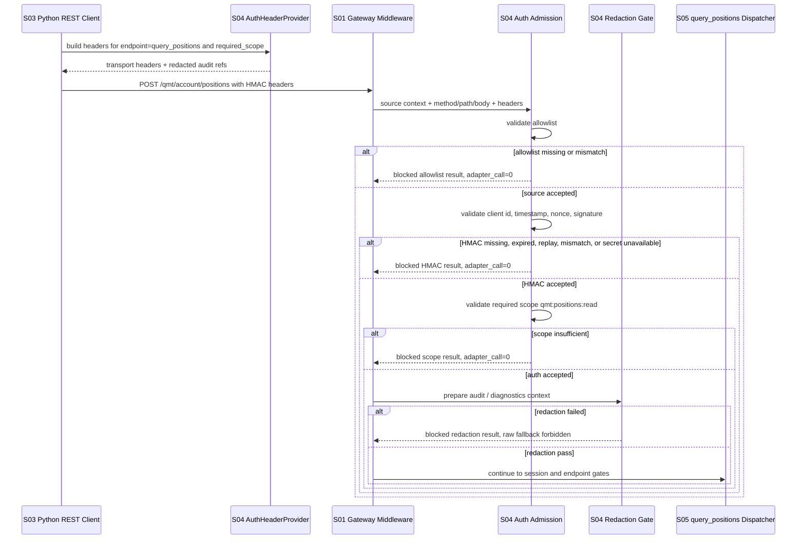

# LLD: CR020-S04 - HMAC pairing / allowlist / scope / nonce fail-closed

> 本文档是 `CR020-S04-hmac-pairing-allowlist-scope` 的 Low-Level Design。当前只允许进入 CR-020 全量 CP5 LLD 统一确认；不授权实现、依赖变更、gateway 启动、端口绑定、真实 `.env` 读取、真实 secret 生成或记录、pairing code / token / session / 私钥 / 账号输出、QMT / MiniQMT / XtQuant 连接、交易、账户写入、simulation/live、provider/lake/publish 或报告覆盖。

## 1. Goal

修改 `trading/qmt_auth.py` 与 `trading/qmt_redaction.py`，创建 `tests/test_cr020_hmac_pairing_allowlist_scope.py`，并为共享文件 `trading/qmt_gateway_config.py`、`trading/qmt_client.py`、`trading/qmt_endpoint_matrix.py` 定义串行合并规则，使 CR-020 Windows gateway 的 pairing、HMAC header、timestamp、nonce replay、allowlist、endpoint scope 和 redaction 全部 fail-closed。

本 Story 的完成效果是：`query_positions` 只在调用方通过 pairing_hmac、来源 allowlist 命中、scope 精确包含 `qmt:positions:read`、timestamp / nonce / signature 校验通过、session / endpoint 后续门控满足且响应可脱敏时才可进入后续 dispatcher；任一安全门失败时 adapter_call、qmt_api_call、real_order、account_write 和 raw fallback 均为 0。

## 2. Requirements（Functional / Non-Functional）

### 2.1 Functional

- 在 `trading/qmt_auth.py` 上扩展 CR019 pairing / HMAC 离线合同，冻结 CR020 runtime auth admission：pairing request / list / approve / complete 仍不输出 secret 或 pairing code 原文，HMAC request 必须校验 client id、timestamp、nonce、signature 和 required scope。
- 新增 allowlist 请求来源判定合同：来源上下文必须由 S01 gateway config / gateway runtime 显式传入，未提供、未匹配或命中公网来源时返回 typed blocked，且不得进入 endpoint dispatcher。
- 新增 scope registry / endpoint scope 校验合同：`query_positions` 唯一接受 `qmt:positions:read`；其他 account/orders/trades/simulation/live scope 不得在 CR020-S04 中默认放行。
- 新增 nonce replay fail-closed 合同：同一 client id hash 下重复 nonce 必须返回 `auth_nonce_replay`，adapter_call 为 0；默认使用进程内 TTL store 作为第一版实现边界。
- 为 S03 的 `QmtAuthHeaderProvider` 消费合同提供 S04 侧 header builder 设计：C 端 client 只能消费可注入 provider，不读取 `.env` 或真实 credential file，不把 raw signature 或 secret 写入 diagnostics。
- 在 `trading/qmt_redaction.py` 上扩展 CR020 response / error / audit / diagnostics redaction：结构化响应、错误 payload、日志字段和 diagnostics 输出均必须先脱敏；redaction 失败时返回 blocked，不 fallback 到 raw。
- 失败路径必须覆盖 HMAC missing、signature mismatch、timestamp expired、nonce replay、allowlist mismatch、scope insufficient、redaction failed、no-auth default attempted、secret unavailable。
- HMAC pass 只表示调用方识别与 endpoint scope 通过，不代表交易、账户写入、simulation/live 或任何 QMT 扩大授权。
- 本 Story 不实现 gateway route、QMT login/session ready、`query_positions` dispatcher 或真实 QMT adapter call；这些由 S02/S05 在后续合同冻结后处理。

### 2.2 Non-Functional

- 安全：no-auth 默认启用次数为 0；secret、pairing code、token、session、账号、交易密码、私钥、`.env`、真实私有路径进入日志 / LLD / CP5 / 测试快照的次数为 0。
- 安全：HMAC / allowlist / scope / redaction 任一失败时，adapter_call、qmt_api_call、account_query、account_write、real_order、real_cancel、broker_lake_write、provider_fetch、lake_write、publish、simulation_or_live_run 均保持 0。
- 可验证：所有验证使用 fixture-only / static-contract / monkeypatch，不启动 gateway、不绑定端口、不打开 socket、不连接 QMT / MiniQMT / XtQuant、不读取 `.env`。
- 可维护：沿用 CR019 `QmtAuthResult`、`QmtAuthBlockedReason`、`redact_qmt_mapping` / `redact_qmt_text` 语义；CR020 只追加 runtime admission、allowlist、scope 和 redaction fail-closed 扩展，不破坏 CR019 回归。
- 性能：HMAC body hash 按请求体大小线性计算；nonce TTL store 必须有容量或 TTL 清理边界；allowlist 和 scope 校验使用内存映射 / exact match，不做网络探测。
- 可观测：auth / redaction 输出只包含 reason code、client id hash、scope、endpoint、redaction_status、zero counters 和 redacted refs，不输出敏感原文。

## 3. 模块拆分与职责

| 模块 / 文件组 | 职责 | 说明 |
|---|---|---|
| Auth Runtime Admission / `trading/qmt_auth.py` | 扩展 pairing_hmac、allowlist、scope、nonce TTL store、HMAC header provider、auth admission decision 和 zero counters | 当前 Story primary；基于 CR019-S05 已有离线合同修改 |
| Redaction Gate / `trading/qmt_redaction.py` | 扩展响应、错误、日志、diagnostics 的结构化脱敏和 fail-closed 扫描 | 当前 Story primary；禁止 raw fallback |
| S04 Fixture Tests / `tests/test_cr020_hmac_pairing_allowlist_scope.py` | 覆盖 auth fail、replay、scope、allowlist、redaction、no-auth、no-real-operation 和 S03 provider contract | 当前 Story primary；fixture-only |
| Gateway Config Contract / `trading/qmt_gateway_config.py` | 提供 S01 冻结的 auth mode、allowlist、redaction 和 runtime config 输入 | shared；S04 只设计消费 / 兼容扩展，不删除 S01 字段 |
| Linux Client Contract / `trading/qmt_client.py` | 消费 S03 冻结的 `QmtAuthHeaderProvider` 协议和 typed blocked result | shared；S04 提供 provider-compatible builder，S03 保持 client runtime owner |
| Endpoint Matrix / `trading/qmt_endpoint_matrix.py` | 提供 `query_positions` path、method、required_scope=`qmt:positions:read` 和 later-gated 默认 | shared；S04 只消费 / 校验 scope，不解锁 endpoint |
| S05 Query Dispatcher | 后续真实 `query_positions` route、session ready 和 QMT adapter call | out of scope；必须等待 S02/S03/S04 合同冻结 |

## 4. 代码结构与文件影响范围

| 动作 | 文件路径 | 变更内容 |
|---|---|---|
| 修改 | `trading/qmt_auth.py` | 追加 CR020 schema version、allowlist decision、scope decision、nonce TTL store、auth admission result、S03-compatible HMAC header builder、`evaluate_qmt_auth_admission` 和 zero counter helpers；保留 CR019 public API 兼容 |
| 修改 | `trading/qmt_redaction.py` | 追加 response / error / diagnostics redaction helpers、redaction failure blocked report、敏感字段类别扩展和 raw fallback 禁止扫描；保留 CR019 text / mapping helpers 兼容 |
| 创建 | `tests/test_cr020_hmac_pairing_allowlist_scope.py` | 新增 fixture-only 单测，覆盖 HMAC missing/mismatch/expired、nonce replay、allowlist mismatch、scope insufficient、redaction failed、no-auth default blocked、S03 provider no-env 和 zero counters |
| 设计合并 | `trading/qmt_gateway_config.py` | 消费 S01 `GatewayAuthConfig` / `GatewayAllowlist` / `RedactionPolicy`；如需追加 CR020 auth admission 字段，必须串行合并且不得删除 S01 runtime fields |
| 设计合并 | `trading/qmt_client.py` | 消费 S03 `QmtAuthHeaderProvider` 协议；S04 只提供 provider builder，不把 HMAC secret 管理写入 client |
| 设计合并 | `trading/qmt_endpoint_matrix.py` | 校验 `query_positions` 的 method/path/scope；只允许 `qmt:positions:read` 进入 CR020-S04 tests，不改变 endpoint 解锁状态 |
| 禁止 | `pyproject.toml`、`uv.lock`、`.env`、`.env.*`、`docs/**`、`trading/qmt_gateway_service.py` | 本 Story LLD 不设计依赖变更、真实凭据读取、gateway route 实现、gateway 启动或文档实现 |

## 5. 数据模型与持久化设计

本 Story 不新增仓库持久化数据，不保存真实 secret、pairing code、token、session、账号、交易密码、私钥或 `.env`。pairing registry、approved client、nonce replay store 和 secret material 均为运行态输入 / fixture 输入；跟踪证据只允许保存 hash/ref 和 redacted metadata。

| 对象 / 字段 | 类型 | 约束 | 说明 |
|---|---|---|---|
| `CR020_QMT_AUTH_SCHEMA_VERSION` | string | 固定 `cr020-s04-hmac-pairing-allowlist-scope-v1` | S04 auth/redaction contract version |
| `QmtPairingRuntimeRecord` | dataclass / mapping | request_id、client_id_hash、source_hash、scope、status、timestamps；无 secret 原文 | 可由 CR019 `PairingRequest` / `PairingApproval` 兼容映射 |
| `QmtRequestSourceContext` | dataclass / mapping | source_ip 或 source_ref 由 gateway 传入；审计输出只使用 hash/ref | S01 gateway config / middleware 输入 |
| `QmtAllowlistDecision` | dataclass | `allowed`、`blocked_reason`、`source_ref`、`matched_source_ref`、`counters` | 来源未匹配时 fail-closed |
| `QmtScopeDecision` | dataclass | `allowed`、`required_scope`、`granted_scopes`、`endpoint_id`、`blocked_reason` | `query_positions` required_scope 固定 `qmt:positions:read` |
| `QmtNonceReplayStore` | protocol / class | `check_and_remember(client_id_hash, nonce, now) -> decision`；TTL 默认 600 秒 | 默认进程内；多进程持久化为非阻断 OPEN |
| `QmtHmacHeaderBuildResult` | dataclass | header mapping for transport、redacted audit refs、required_scope、nonce_ref、signature_ref | raw signature 和 secret 不进入 diagnostics |
| `QmtAuthAdmissionDecision` | dataclass | allowlist、hmac、scope、nonce、redaction、accepted、blocked_reason、adapter_call_allowed=false、counters | S05 dispatcher 前置安全结果 |
| `QmtRedactionDecision` | dataclass | redacted_payload、redaction_status、leak_count、matched_categories、blocked_reason | redaction failed 时不返回 raw payload |
| `QmtAuthSafetyCounters` | mapping[str,int] | forbidden counters 默认全 0 | 覆盖 adapter/QMT/order/account/provider/lake/publish/gateway/network |

持久化边界：第一版不把 nonce store、pairing registry 或 secret store 写入仓库文件。若后续 CP7 要求多进程 gateway、防重放跨进程一致性或 secret rotation，应另起 CR 或在 CP5 修改 LLD 后再实现，不得在 S04 实现阶段私自扩大持久化范围。

## 6. API / Interface 设计

| 接口 / 入口 | 输入 | 输出 | 调用方 | 说明 |
|---|---|---|---|---|
| `build_qmt_request_source_context` | gateway request metadata、optional source ref | `QmtRequestSourceContext` | S01 gateway middleware、tests | 不做网络探测；审计输出只保留 hash/ref |
| `validate_qmt_allowlist` | source context、S01 `GatewayAllowlist` | `QmtAllowlistDecision` | auth middleware、tests | allowlist missing/mismatch/public source 均 blocked |
| `resolve_required_scope` | endpoint id / method / path、endpoint matrix | `QmtScopeDecision` seed | auth middleware、tests | `query_positions` 必须解析为 `qmt:positions:read` |
| `build_qmt_hmac_request_headers` | request metadata、client runtime auth context、required_scope、clock、nonce provider | `QmtHmacHeaderBuildResult` | S03 `QmtAuthHeaderProvider` adapter、tests | 只供 transport 使用 raw headers；diagnostics 输出 redacted refs |
| `validate_hmac_request` | method、path、body、headers、required_scope、auth config、clock、nonce store | `QmtAuthResult` | S side auth middleware、tests | 复用 CR019 API，CR020 tests 覆盖 missing/mismatch/expired/replay/scope |
| `evaluate_qmt_auth_admission` | request source、method/path/body、headers、required endpoint、gateway auth config、allowlist、nonce store、clock | `QmtAuthAdmissionDecision` | gateway middleware、S05 dispatcher前置、tests | 统一执行 allowlist -> HMAC -> scope -> nonce -> redaction gate；失败不触达 QMT |
| `validate_no_auth_runtime_mode` | auth config、runtime context | typed auth decision | config loader、tests | no-auth 默认 blocked；fixture/local_debug 也不得连接真实 QMT readonly |
| `redact_qmt_response_payload` | typed payload、redaction policy | `QmtRedactionDecision` | gateway response path、tests | leak_count 必须为 0；失败时 blocked |
| `redact_qmt_error_payload` | error context、redaction policy | `QmtRedactionDecision` | gateway error path、diagnostics、tests | 错误输出不得包含敏感原文 |
| `scan_qmt_auth_redaction_leaks` | text / mapping / diagnostics payload | `QmtRedactionDecision` 或 `RedactionReport` | tests、CP7 evidence scan | 用于禁止 raw fallback 和 sensitive literal scan |
| `collect_qmt_auth_safety_counters` | optional counters | normalized counters dict | auth/redaction/tests/CP6/CP7 | 默认 forbidden counters 全 0 |

接口与测试配对：本节每个 public interface 在第 10 节 TS-CR020-S04-01 至 TS-CR020-S04-16 中至少有一条验证入口。异常路径 HMAC missing、signature mismatch、timestamp expired、nonce replay、allowlist mismatch、scope insufficient、redaction failed、no-auth default attempted 均有错误路径测试。

## 7. 核心处理流程



1. S03 `QmtClient` 通过注入的 auth header provider 为 `query_positions` 请求构造 HMAC headers；client 不读取 `.env` 或 credential files。
2. Gateway middleware 从 S01 runtime context 构造 source context，并先执行 allowlist 校验；来源缺失或不匹配时立即返回 blocked。
3. Auth admission 校验 HMAC headers、timestamp skew、nonce replay、client approval、signature 和 required scope；任一失败都设置 adapter_call_allowed=false。
4. Required scope 只能从 endpoint matrix exact 解析，`query_positions` 固定为 `qmt:positions:read`；scope 不足优先于后续 session / run gate。
5. Auth pass 后仍只进入 redaction gate 和后续 session / endpoint gate，不直接调用 QMT。
6. Redaction gate 处理 audit、error、diagnostics 和 response payload；任何 leak_count 大于 0 或 redaction policy incomplete 都 blocked，且禁止 raw fallback。
7. S05 dispatcher 只有在 S02 session ready、S03 transport、S04 auth/redaction 和 S05 endpoint whitelist 全部通过后，才可在后续授权内处理 `query_positions`。

## 8. 技术设计细节

- HMAC canonical input 采用 method、path、body hash、timestamp、nonce 的稳定顺序；实现使用标准库 `hmac` / `hashlib` 和 constant-time compare，不新增依赖、不改 `pyproject.toml` / `uv.lock`。
- Header 名称沿用 CR019 合同的 `X-QMT-Client-Id`、`X-QMT-Timestamp`、`X-QMT-Nonce`、`X-QMT-Signature`；日志和 diagnostics 只输出 hash/ref，不输出 raw header sensitive value。
- Timestamp skew 默认沿用 300 秒；nonce TTL 默认沿用 600 秒；pairing request/code TTL 沿用 CR019 600/300 秒默认值。TTL 是合同值，CP5 approve 后进入实现；用户要求调整时回到 CP5 修改。
- Nonce replay store 第一版采用进程内 TTL store，并按 `client_id_hash + nonce_hash` 建键；跨进程 / 多实例持久防重放为非阻断 OPEN，不在 S04 私自引入数据库或文件持久化。
- Allowlist 校验必须消费 S01 `GatewayAllowlist` exact CIDR / source ref；未配置、空列表、公网来源或 source context 缺失均 fail-closed。
- Scope 校验必须消费 endpoint matrix 的 `required_scope`；S04 不解锁 endpoint，只验证 `query_positions` 的 required scope 为 `qmt:positions:read`。
- S03 provider 分界：S04 在 `qmt_auth.py` 提供 provider-compatible builder；S03 `qmt_client.py` 只消费 provider protocol，不拥有 secret lookup、nonce store 或 pairing registry。
- Redaction 优先 exact key match，再做文本 pattern scan；结构化 response、error、diagnostics 和 audit context 均必须经过 redaction decision。扫描失败、字段缺失或仍有敏感原文时 blocked。
- no-auth 仅可作为 fixture/local_debug/explicit temporary 的离线测试路径；不得作为真实 readonly gateway 默认值，且不得绕过 scope、session、run gate 或 redaction。
- 与 S01 合同对齐：S01 的 runtime admission、config validation、public bind、service start、credential read 和 qmt operation gate 仍独立存在；S04 auth pass 不改变 S01 gate。
- 与 S03 合同对齐：S03 typed response 必须承接 auth_error、scope_denied、redaction_failed 和 gateway unavailable；CLI 只做 pairing/diagnostics/CP7 validation，不作为业务 runtime。
- 图示类型选择：使用时序图；原因是本 Story 涉及 client provider、gateway middleware、auth admission、redaction gate 和后续 dispatcher 五个模块，且异常分支决定是否触达 adapter。

## 9. 安全与性能设计

| 维度 | 设计措施 | 验证方式 |
|---|---|---|
| 安全 | no-auth 默认 blocked，真实 readonly 不允许 no-auth；fixture/local_debug 也不得连接 QMT | TS-CR020-S04-12、TS-CR020-S04-16 |
| 安全 | HMAC missing/mismatch/expired、nonce replay、allowlist mismatch、scope insufficient 全部 blocked，adapter_call=0 | TS-CR020-S04-03 至 TS-CR020-S04-09 |
| 安全 | HMAC pass 不授权交易、账户写入、simulation/live、provider/lake/publish | TS-CR020-S04-10、TS-CR020-S04-16 |
| 安全 | redaction 失败不得 fallback 到 raw；日志、错误、diagnostics 和 response 均扫描 leak_count | TS-CR020-S04-11、TS-CR020-S04-13 |
| 安全 | S03 provider 不读取 `.env` / credential files，不输出 raw signature 或 secret | TS-CR020-S04-14 |
| 安全 | `query_positions` 以外 endpoint scope 不进入本轮默认白名单 | TS-CR020-S04-09、TS-CR020-S04-15 |
| 性能 | HMAC 和 body hash 为 O(n)，n 为 body bytes；allowlist/scope 为内存 exact match | 单文件 pytest 目标小于 1 秒；无 sleep / network |
| 性能 | Nonce TTL store 有清理边界，避免无限增长 | TS-CR020-S04-08 覆盖 TTL / replay |
| 可观测 | auth/redaction 输出 reason code、redaction_status、client id hash、scope 和 zero counters | TS-CR020-S04-01、TS-CR020-S04-11、TS-CR020-S04-16 |

## 10. 测试设计

| 测试场景 | 前置条件 | 操作 | 预期结果 | 验证方式 |
|---|---|---|---|---|
| TS-CR020-S04-01 pairing/runtime 字段覆盖 | fixture clock、source hash/ref、approved scope | 构造 pairing request / approval / completion public view | 字段齐全；公开视图无 secret、pairing code 原文或 credential value | pytest dataclass fields + sensitive scan |
| TS-CR020-S04-02 allowlist pass | source context 命中 S01 allowlist fixture | 调用 `validate_qmt_allowlist` | `allowed=true`，source 只以 ref/hash 输出，counters 全 0 | pytest |
| TS-CR020-S04-03 allowlist mismatch hard block | source context 未匹配 / 缺失 | 调用 allowlist + auth admission | `blocked_reason=allowlist_mismatch/source_missing`；adapter_call=0 | pytest |
| TS-CR020-S04-04 HMAC headers missing | 缺任一 `X-QMT-*` header | 调用 `evaluate_qmt_auth_admission` | `auth_header_missing`；transport / adapter / QMT call 次数为 0 | pytest |
| TS-CR020-S04-05 signature mismatch | approved client，body 或 signature 不匹配 | 调用 HMAC 校验 | `auth_signature_mismatch`；adapter_call=0 | pytest |
| TS-CR020-S04-06 timestamp expired | timestamp 超出 skew | 调用 HMAC 校验 | `auth_timestamp_skew`；adapter_call=0 | pytest |
| TS-CR020-S04-07 secret unavailable | approved client 但运行态 secret ref 不可解析 | 调用 HMAC 校验 | `auth_secret_unavailable`；不输出 secret；adapter_call=0 | pytest |
| TS-CR020-S04-08 nonce replay | 同 client id hash 重放 nonce | 第一次通过记忆，第二次校验 | 第二次 `auth_nonce_replay`；adapter_call=0；TTL store 有容量 / 清理测试 | pytest |
| TS-CR020-S04-09 scope insufficient | required_scope=`qmt:positions:read`，client scopes 不包含该值 | 调用 scope decision / admission | `auth_scope_denied` 或 typed `scope_insufficient`；adapter_call=0 | pytest |
| TS-CR020-S04-10 HMAC pass 不授权交易 | HMAC 和 scope 通过 | 检查 auth result 和 downstream flags | trade/account/simulation/live authorization 均 false；仍需 S02/S05 gates | pytest |
| TS-CR020-S04-11 response/error/diagnostics redaction | payload 含敏感字段类别 | 调用 response/error/diagnostics redaction | redacted payload leak_count=0；raw sensitive value output=0 | pytest + scan |
| TS-CR020-S04-12 no-auth 默认 blocked | config 未显式 debug/fixture/temporary | 调用 auth mode validation | `auth_no_auth_not_allowed`；真实 readonly path 不可进入 | pytest |
| TS-CR020-S04-13 redaction failure blocks raw fallback | monkeypatch redaction scanner 返回 leak_count>0 | 调用 redaction gate | blocked；raw payload 不出现在 result / diagnostics | pytest |
| TS-CR020-S04-14 S03 provider no env read | monkeypatch `open`、`Path.read_text`、`os.environ` 访问 guard | 构造 auth header provider + fake request | `.env` / credential reads=0；diagnostics 无 raw signature / secret | pytest monkeypatch |
| TS-CR020-S04-15 endpoint matrix scope exact | 读取 `query_positions` spec | 校验 method/path/client_method/required_scope | required_scope 固定 `qmt:positions:read`；其他 endpoint later-gated | pytest |
| TS-CR020-S04-16 no real operation counters | 执行全部 S04 public helpers | 收集 counters | gateway start、socket、HTTP、QMT、order、account_write、provider/lake/publish 均为 0 | pytest counters + AST scan |

建议后续实现完成后执行：`uv run --python 3.11 pytest -q tests/test_cr020_hmac_pairing_allowlist_scope.py tests/test_cr019_qmt_pairing_hmac_auth.py tests/test_cr019_qmt_gateway_run_gates.py`。本 LLD 阶段不执行该命令，不创建测试文件，不启动 gateway，不连接 QMT。

## 11. 实施步骤

| TASK-ID | 动作 | 目标文件 | 详细描述 | 对应测试 |
|---|---|---|---|---|
| CR020-S04-T1 | 修改 | `trading/qmt_auth.py` | 追加 CR020 auth schema、allowlist decision、scope decision、nonce TTL store、HMAC header provider、auth admission decision 和 zero counters；保留 CR019 API 兼容 | TS-CR020-S04-01..10、12、14..16 |
| CR020-S04-T2 | 修改 | `trading/qmt_redaction.py` | 追加 response/error/diagnostics redaction、redaction failure blocked report、sensitive category scan 和 raw fallback 禁止策略 | TS-CR020-S04-11、13、16 |
| CR020-S04-T3 | 创建 | `tests/test_cr020_hmac_pairing_allowlist_scope.py` | 编写 fixture-only tests，覆盖 HMAC fail、allowlist、scope、nonce、redaction、provider no-env、no-auth default 和 no-real-operation counters | TS-CR020-S04-01..16 |
| CR020-S04-T4 | 修改（共享串行合并） | `trading/qmt_endpoint_matrix.py` | 在实现阶段只校验/必要时兼容暴露 `query_positions` required_scope，不解锁其他 endpoint，不改变 S05 route owner | TS-CR020-S04-09、15 |
| CR020-S04-T5 | 修改（共享串行合并） | `trading/qmt_client.py`、`trading/qmt_gateway_config.py` | S03 client 只消费 provider protocol；S01 config 只提供 allowlist/auth/redaction config。若实现需要微调接口，必须保持 S01/S03 confirmed LLD 兼容并在 CP6 记录 | TS-CR020-S04-02、03、12、14 |
| CR020-S04-T6 | 门控 | CP5 / CP6 / CP7 | CP5 前保持 implementation_allowed=false；CP6 记录无真实操作；CP7 wrong-scope/replay/allowlist/redaction fail 由 meta-qa 验证 | TS-CR020-S04-16 |

每个 primary 文件均被至少一个 TASK-ID 覆盖；每个第 6 节接口均在第 10 节有验证入口；第 7 节异常路径均在 TS-CR020-S04-03 至 TS-CR020-S04-13 中覆盖。

## 12. 风险、难点与预研建议

### 12.1 实现灰区与取舍记录

| Clarification ID | 问题 | 选项与推荐 | 决策 / 答案 | 影响面 | 证据 | 重访条件 |
|---|---|---|---|---|---|---|
| OPEN-CR020-S04-01 | nonce replay store 是否需要跨进程持久化？ | 推荐：第一版使用进程内 TTL store，满足单 gateway 进程与 fixture-only 验证；备选 A：引入持久 store；备选 B：只校验 timestamp 不记 nonce | 非阻断 OPEN，`blocks_lld=false`。用户在 CP5 回复 `approve` 时接受推荐方案：S04 不引入持久化，不改依赖；多进程 / 多实例时另起 CR | 接口 / 安全 / 测试 / 文件 owner / 依赖 | HLD §36.3 AGA-CR020-03 写明 nonce 存储不可持久时先用进程内 TTL 并在 CP5 暴露风险；ADR-091 要求 nonce fail-closed | CP7 要求多进程 gateway、跨网段多人访问、live endpoint 默认启用或 replay 测试证明进程内 TTL 不足时重访 |
| N/A-CR020-S04-02 | HMAC header provider 由 S03 还是 S04 拥有？ | 推荐：S03 定义/消费 provider protocol，S04 在 `qmt_auth.py` 提供 provider-compatible builder；备选 A：S03 内置 HMAC；备选 B：S05 route 现场构造 headers | 决策：采用推荐方案。S03 LLD 已冻结 client 只消费 provider，S04 拥有 pairing/HMAC/nonce/scope 安全面 | 安全 / 文件 owner / 跨 Story 契约 / 测试 | S03 LLD §6 / §12；ADR-091；S04 Story dependency_type=`client-auth-contract` | S03 confirmed LLD 修改 provider signature，或 CP5 要求合并 auth 到 client 时重访 |
| N/A-CR020-S04-03 | redaction 失败时是否允许 best-effort masking 后继续？ | 推荐：redaction failed 即 blocked，禁止 raw fallback；备选 A：best-effort masking 后继续；备选 B：仅记录 redaction warning | 决策：采用推荐方案。ADR-091 明确 redaction 失败不得降级为原文输出 | 安全 / 测试 / CP7 / 文档 | ADR-091 不接受影响；Story forbidden 包含 `redaction fallback-to-raw` | CP5 用户显式降低 redaction 要求时回退 CP3/CP5，不在实现阶段改变 |

当前无 `blocks_lld=true` 的未回答 clarification item。受本轮“只写两个目标文件”约束，未修改 `process/STATE.md.parallel_execution.lld_clarification_queue`；上述非阻断 OPEN 必须由 meta-po 在 CP5 Decision Brief 中汇总。

| 风险 / 难点 | 影响 | 缓解措施 / 预研建议 |
|---|---|---|
| nonce store 仅进程内导致多进程 replay 防护不完整 | 多实例 gateway 可能出现 replay gap | 第一版限制为单 gateway 进程；CP7 如需多进程必须转 CR 或 CP5 修订；测试覆盖同进程 replay |
| S01/S03/S04 共享接口字段漂移 | 后续实现合并冲突或 client auth 对不上 | S04 只追加 provider-compatible builder 和 auth decision；不删除 S01/S03 字段；CP6 记录偏差 |
| redaction pattern 误判或漏判 | 误阻断或泄露敏感字段 | exact key match + text scan 双层；测试覆盖 response/error/diagnostics；失败时 blocked |
| HMAC pass 被误解释为运行授权 | 可能绕过 session/risk/run gate | Auth result 明确 operation authorization=false；S05/S06/CP7 必须声明 HMAC pass 不授权交易或账户写入 |
| allowlist source context 由 gateway 传入不稳定 | 来源判断可能被伪造或缺失 | 来源缺失 fail-closed；S01 gateway config / middleware 是 source context owner；S04 不从 client 自报来源放行 |

### OPEN / Spike 跟踪

| ID | 类型（OPEN / Spike） | 问题 | 下一动作 | 责任方 |
|---|---|---|---|---|
| OPEN-CR020-S04-01 | OPEN | nonce replay store 第一版采用进程内 TTL，不覆盖多进程持久防重放 | meta-po 在 CP5 Decision Brief 暴露；用户 approve 即接受单进程 TTL 边界；多进程需求另起 CR | meta-po / meta-dev / user |

## 13. 回滚与发布策略

- 发布方式：本 LLD 只进入 CR020 全量 CP5 LLD 批次；CP5 人工确认前不得实现。后续实现完成后只发布 auth/redaction 合同和 fixture-only 测试；不启动 gateway、不读取 `.env`、不连接 QMT。
- 回滚触发条件：出现 no-auth 默认放行、scope bypass、nonce replay accepted、allowlist mismatch 仍进入 dispatcher、redaction failed 后 raw fallback、HMAC pass 被当作交易 / 账户写入 / simulation/live 授权、真实 secret / pairing code / token / session / 私钥 / 账号输出、`.env` 被读取、QMT / MiniQMT / XtQuant 被连接、依赖文件被本 Story 修改。
- 回滚动作：回退 `trading/qmt_auth.py`、`trading/qmt_redaction.py`、`tests/test_cr020_hmac_pairing_allowlist_scope.py` 中 S04 变更；共享文件只回退本 Story 引入的兼容扩展，不得破坏 S01/S03/CR019 已验证合同；若问题涉及持久 nonce store、secret store、真实运行授权或 endpoint 扩大，停止并交回 meta-po 发起 CP5 修订或新 CR。
- 切换策略：nonce 进程内 TTL 不足时切换到后续持久 store CR；Typer / client provider signature 变化时回到 S03/S04 CP5 合同重签；redaction schema 过窄时先扩展 redaction tests，再实现。

## 14. Definition of Done

- [ ] 14 个可见章节全部填写完成。
- [ ] LLD frontmatter `tier=M`、`status=ready-for-review`、`confirmed=false`、`open_items=1` 已填写。
- [ ] S01/S03 LLD 已作为上游合同输入读取并映射到 S04 接口。
- [ ] `trading/qmt_auth.py` 的 pairing、HMAC、allowlist、scope、nonce、provider builder 和 zero counters 均有设计。
- [ ] `trading/qmt_redaction.py` 的 response/error/log/diagnostics redaction 和 raw fallback 禁止均有设计。
- [ ] HMAC missing/mismatch/expired、nonce replay、allowlist mismatch、scope insufficient 时 adapter_call=0。
- [ ] no-auth 默认启用次数为 0。
- [ ] secret、pairing code、token、session、账号、交易密码、私钥、`.env` 泄露次数为 0。
- [ ] redaction fallback-to-raw 次数为 0。
- [ ] HMAC pass 被解释为交易 / 账户写入 / simulation/live 授权的次数为 0。
- [ ] 第 6 节每个接口均在第 10 节有对应测试入口。
- [ ] 第 7 节每条异常路径均在第 10 节有错误路径测试。
- [ ] 第 11 节 TASK-ID 与文件影响范围一一对应。
- [ ] OPEN / Spike 已清点；当前仅 `OPEN-CR020-S04-01` 为非阻断 OPEN，`blocks_lld=false`。
- [ ] `confirmed=false`、CP5 全量人工确认未通过、dev_gate 未满足前不进入实现。

## 人工确认区

> **CP5 - Story LLD 可实现性门**
> meta-dev 已为本 Story 写入 `process/checks/CP5-CR020-S04-hmac-pairing-allowlist-scope-LLD-IMPLEMENTABILITY.md` 自动预检结果。
> meta-po 需收齐 CR020-S01..S06 全部 LLD、clarification queue、CP4 摘要和 CP5 自动预检后，再发起统一人工确认。

**CP5 checklist 摘要**：

| # | 检查项 | 状态 | 证据 |
|---|---|---|---|
| 1 | LLD 覆盖 AC | 待检查 | 第 2 / 10 / 14 节 |
| 2 | 与 HLD / ADR 一致 | 待检查 | 第 3 / 8 / 12 节 |
| 3 | 文件影响范围明确 | 待检查 | 第 4 / 11 节 |
| 4 | 接口契约完整 | 待检查 | 第 6 节 |
| 5 | 测试与 dev_gate 可计算 | 待检查 | 第 10 / 14 节 |
| 6 | clarification queue 已收敛 | 待检查 | 第 12.1 节；`OPEN-CR020-S04-01` 非阻断 |

**人工确认回复**：

请直接回复以下任一整行：

```text
approve
修改: <具体修改点>
reject
```

- `approve`：接受本 LLD 的推荐设计；仍不授权实现、依赖变更、gateway 启动、真实请求、QMT 连接、`.env` 读取、凭据输出或任何交易 / 账户 / 数据写入。
- `修改: <具体修改点>`：指出具体修改点后由 meta-dev 更新重提。
- `reject`：设计方向有根本问题，需重新设计。

**人工审查结果回填**：

- 结论：`approved | changes_requested | rejected`
- 审查人：
- 审查时间：
- 修改意见：
- 风险接受项：
