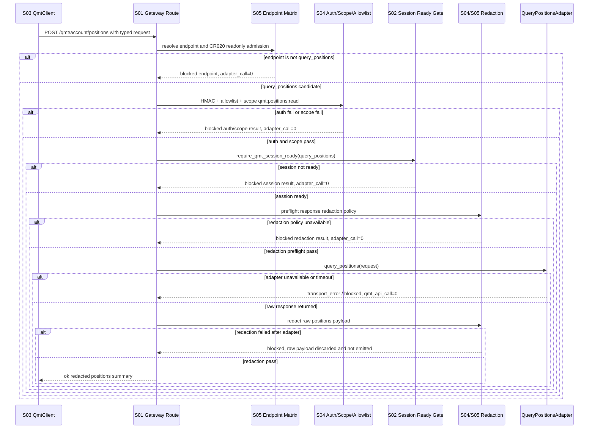

# LLD: CR020-S05 - `query_positions` 单接口只读准入

本文档只冻结 `CR020-S05-query-positions-readonly` 的 Low-Level Design。当前 `confirmed=false`，只允许进入 CR-020 全量 CP5 LLD 统一确认；CP5 全量人工确认、当前 Story LLD confirmed、Wave / 依赖 / 文件 owner / dev_gate 重新判定全部满足前，不得实现代码、不得改依赖、不得启动 gateway、不得绑定端口、不得读取 `.env`、不得连接 QMT / MiniQMT / XtQuant、不得执行真实查询、不得输出账号 / 密码 / token / session / 交易密码 / 私钥 / 未脱敏持仓。

## 1. Goal

修改 CR019 离线 QMT endpoint / client / gateway 合同，使 CR-020 只在 `query_positions` 这一个真实只读 endpoint 上形成可实现设计：endpoint scope 固定为 `qmt:positions:read`，gateway dispatcher 必须串联 S02 session ready gate、S03 Python REST client transport、S04 HMAC / allowlist / scope / redaction 合同，且只在全部 gate 通过后才允许后续 `query_positions` 只读 adapter。

完成效果是：`query_positions` 成为 CR-020 唯一可进入真实只读准入的 endpoint；除 `query_positions` 外的 account / orders / trades / simulation / live / submit / cancel / modify / reconciliation / broker lake / provider / lake / publish 均保持 blocked / later-gated；session not ready、auth fail、scope fail、redaction fail、blocked endpoint、adapter unavailable 均 fail-closed，失败路径中的 adapter / QMT / order / cancel / account write / broker lake / provider / lake / publish 计数为 0；成功路径也只能输出脱敏持仓摘要。

## 2. Requirements（Functional / Non-Functional）

### 2.1 Functional

- `query_positions` 是 CR-020 唯一真实只读 endpoint；REST 路径固定为 `POST /qmt/account/positions`，client method 固定为 `QmtClient.query_positions`。
- `query_positions` required scope 固定为 `qmt:positions:read`；scope 必须 exact match，不能用 `qmt:account:read`、`qmt:*`、orders / trades / simulation / live scope 替代。
- `trading/qmt_endpoint_matrix.py` 必须提供 CR020 readonly admission overlay：只允许 `endpoint_id="query_positions"` 在 `session_ready && auth_pass && scope_pass && redaction_pass && adapter_available` 后进入只读 dispatcher；其他真实 endpoint 全部 blocked。
- `trading/qmt_gateway_contracts.py` 必须定义 `query_positions` request / response / blocked / counter 合同；blocked result 必须使用 stable reason code，detail 只能包含脱敏字段。
- `trading/qmt_gateway_service.py` 必须按顺序消费 endpoint matrix、S04 auth admission、S02 session ready、adapter availability 和 redaction preflight；任一失败立即返回 typed blocked，不触达 positions adapter。
- `trading/qmt_client.py` 必须将 `query_positions` 从 CR019 later-gated account-like 阻断升级为 CR020 typed REST client 方法，但真实请求仍依赖 S03 transport、S04 auth provider、S02/S05 gateway gate 和 CP5 后运行授权。
- 持仓响应必须脱敏：不得输出账号、资金账号、真实 session、token、交易密码、私钥、原始持仓 payload、未脱敏证券代码 / 数量 / 市值组合或可还原账户身份的字段。
- health / capabilities / diagnostics 可作为 gateway 支撑面存在，但它们不是 CR-020 的“真实 QMT 只读 endpoint”，不得被写成账户查询授权。
- blocked endpoint 包括但不限于 `query_account`、`query_orders`、`query_trades`、`submit_simulation`、`cancel_simulation`、`live_readonly_snapshot`、`submit_live`、`cancel_live`、`reconcile`、`kill_switch` 和任何未知 endpoint。
- 本 Story 不实现 S02 session manager、S03 transport 真实 HTTP 实现或 S04 HMAC / redaction 算法；只消费其 confirmed 合同和 typed result。

### 2.2 Non-Functional

- 安全：CP5 前实现次数、依赖变更次数、gateway start、port bind、`.env` read、QMT / MiniQMT / XtQuant connect、真实 query、凭据输出、未脱敏持仓输出次数均为 0。
- 安全：失败路径中 `adapter_call`、`qmt_api_call`、`order_submit`、`order_cancel`、`order_modify`、`account_write`、`broker_lake_write`、`provider_fetch`、`lake_write`、`publish`、`simulation_or_live_run` 均必须为 0。
- 安全：成功只读路径只允许 `query_positions_read_attempt` / `readonly_adapter_call` 这类显式只读证据；交易、账户写入、lake/publish 类 forbidden counters 仍为 0。
- 可测试：CP6 前所有测试使用 fixture-only / fake adapter / fake auth / fake session / fake redaction，不启动 gateway、不打开 socket、不执行真实 QMT 查询。
- 可维护：endpoint matrix 是唯一 endpoint scope 来源；client、gateway route、auth scope 和测试必须从该矩阵对齐，禁止散落硬编码扩大白名单。
- 可靠性：session not ready、auth fail、scope fail、redaction fail、adapter unavailable、transport timeout、unknown endpoint 均返回 typed blocked / error，不 fallback 到 raw payload。
- 可观测：blocked reason、endpoint id、request id、run id、redaction status、scope、zero counters 可审计；账号、secret、session、token、交易密码、私钥和未脱敏持仓不可审计输出。
- 性能：endpoint / scope / allowlist / session gate 均为内存常数时间判断；`query_positions` 默认不自动 retry，避免扩大真实只读请求。

## 3. 模块拆分与职责

| 模块 / 文件组 | 职责 | 说明 |
|---|---|---|
| Endpoint Matrix / `trading/qmt_endpoint_matrix.py` | 定义 CR020 readonly admission overlay、`query_positions` 唯一 allowed endpoint、blocked endpoint matrix、required scope 和 blocked reason | 当前 Story primary；保留 CR019 默认 later-gated 语义，只在 CR020 gate 全部通过后暴露 readonly admission |
| Gateway Contracts / `trading/qmt_gateway_contracts.py` | 定义 `QmtQueryPositionsRequest`、`QmtRedactedPosition`、`QmtQueryPositionsResponse`、blocked reason alias、success / blocked counters | 当前 Story primary；不保存原始持仓 |
| Gateway Service / `trading/qmt_gateway_service.py` | 定义 `dispatch_qmt_gateway_endpoint` / `handle_query_positions` 的 gate chain 和 adapter protocol 消费点 | 当前 Story primary；不拥有 session / auth / redaction 具体算法 |
| Python REST Client / `trading/qmt_client.py` | 修改 `QmtClient.query_positions` 为 CR020 typed REST method，消费 S03 transport 和 S04 auth provider，承接 gateway typed result | 当前 Story primary；业务 runtime 仍是 Python REST client，不是 CLI |
| S05 Fixture Tests / `tests/test_cr020_query_positions_readonly.py` | 覆盖唯一 endpoint、scope、gate chain、blocked endpoints、redacted response、no-real-operation counters、client method | 当前 Story primary；fixture-only |
| Session Ready Gate / `trading/qmt_gateway_session.py` | 提供 `require_qmt_session_ready(query_positions)` 和 session diagnostics | shared；由 S02 owner 实现，S05 只消费 |
| Auth / Scope / Redaction / `trading/qmt_auth.py`、`trading/qmt_redaction.py` | 提供 HMAC / allowlist / scope / nonce admission 与 redaction decision | shared；由 S04 owner 实现，S05 只消费 |

## 4. 代码结构与文件影响范围

| 动作 | 文件路径 | 变更内容 |
|---|---|---|
| 修改 | `trading/qmt_endpoint_matrix.py` | 追加 CR020 schema / overlay 常量，提供 `CR020_READONLY_ENDPOINT_ID="query_positions"`、`CR020_QUERY_POSITIONS_SCOPE="qmt:positions:read"`、`is_cr020_query_positions_allowed()`、`build_cr020_blocked_endpoint_matrix()`；保证除 `query_positions` 外真实 endpoint allowed 次数为 0 |
| 修改 | `trading/qmt_gateway_contracts.py` | 追加 `QmtQueryPositionsRequest`、`QmtRedactedPositionRecord`、`QmtQueryPositionsPayload`、`QmtQueryPositionsResult`、`QmtQueryPositionsSafetyCounters`、blocked reason 映射和 `build_query_positions_blocked_result()` |
| 修改 | `trading/qmt_gateway_service.py` | 追加 query dispatcher 设计：endpoint gate -> S04 auth/scope -> S02 session -> adapter availability -> redaction preflight -> readonly adapter -> response redaction -> typed result |
| 修改 | `trading/qmt_client.py` | 将 `query_positions` 设计为 CR020 REST client method，使用 S03 transport / S04 auth provider / timeout / typed result；保留其他 account-like endpoint blocked |
| 创建 | `tests/test_cr020_query_positions_readonly.py` | 新增 fixture-only 单测，覆盖唯一 endpoint、scope exact、所有 fail-closed path、redaction、blocked endpoint 和 forbidden counters |
| 设计消费 | `trading/qmt_auth.py`、`trading/qmt_redaction.py`、`trading/qmt_gateway_session.py` | S05 不修改这些 shared 文件；实现阶段若需要兼容 hook，只能在 CP5 后按 file owner 串行合并并记录 CP6 偏差 |

共享文件实际修改必须等待 CR020-S01..S06 全量 CP5 人工确认和 dev gate 重新计算；当前任务只写本 LLD 与 CP5 自动预检。

## 5. 数据模型与持久化设计

本 Story 不新增数据库、磁盘持久化、broker lake、provider cache、lake 文件、publish 产物、secret store、session store 或 raw positions store。`query_positions` 的真实原始响应只能在运行内存中进入 redaction gate；任何日志、检查点、测试快照、文档、CLI 输出和 CP7 evidence 只能保存脱敏摘要。

| 对象 / 字段 | 类型 | 约束 | 说明 |
|---|---|---|---|
| `CR020_QUERY_POSITIONS_ENDPOINT_ID` | str | 固定 `query_positions` | 唯一真实只读 endpoint id |
| `CR020_QUERY_POSITIONS_PATH` | str | 固定 `/qmt/account/positions` | Gateway route / client request 对齐 |
| `CR020_QUERY_POSITIONS_SCOPE` | str | 固定 `qmt:positions:read` | exact scope，不能扩大 |
| `QmtQueryPositionsRequest` | dataclass / mapping | `run_id`、`request_id`、`redaction_label`、`include_empty`、`max_positions`、`filter_ref`；不含账号原文或 secret | Gateway 和 client 共享 typed request |
| `QmtQueryPositionsAdapter` | protocol | `query_positions(request, session_snapshot) -> Mapping[str, object]` | 仅 Windows runtime 注入；CP5/fixture 使用 fake adapter |
| `QmtRedactedPositionRecord.position_ref` | str | hash/ref 或 `[REDACTED]`；不得为真实账号或可还原持仓原文 | 单条持仓的脱敏引用 |
| `QmtRedactedPositionRecord.instrument_ref` | str | hash/ref 或 redacted bucket；不输出未脱敏证券代码 | 防止持仓组合泄露 |
| `QmtRedactedPositionRecord.quantity_bucket` | str | bucket / masked value；不输出精确数量 | 兼顾验证结构和隐私 |
| `QmtQueryPositionsPayload` | mapping | `position_count`、`positions_digest`、`items_redacted`、`redaction_status`、`schema_version` | 不包含 raw positions |
| `QmtQueryPositionsResult` | typed result | `status` in `ok/blocked/transport_error/auth_error/validation_error`，含 `blocked_reason`、`payload`、`counters` | 与 `QmtResponse` / `QmtGatewayResult` 衔接 |
| `QmtQueryPositionsSafetyCounters` | mapping[str, int] | 失败路径默认全部为 0；成功只读路径只允许 readonly evidence counter；forbidden counters 永远为 0 | 覆盖 adapter/QMT/order/cancel/account_write/broker_lake/provider/lake/publish |

`adapter_call` / `qmt_api_call` 命名在本 Story 中只用于 fail-closed 和 CP5 fixture 断言，值必须为 0。后续 CP7 成功只读证据若需要记录真实触达，只能使用更窄的 `query_positions_read_attempt` / `readonly_positions_adapter_call`，并继续保持 order / cancel / modify / account_write / broker_lake / provider / lake / publish / simulation_live counters 为 0。

## 6. API / Interface 设计

| 接口 / 入口 | 输入 | 输出 | 调用方 | 说明 |
|---|---|---|---|---|
| `get_cr020_query_positions_spec()` | 无或 endpoint matrix | `QmtEndpointSpec` | client / gateway / tests | 返回 `endpoint_id=query_positions`、method/path/scope；测试 T-S05-01 / T-S05-02 覆盖 |
| `is_cr020_readonly_endpoint_allowed(endpoint_id, required_scope)` | endpoint id、scope | bool / decision | gateway dispatcher、tests | 只有 `query_positions` + `qmt:positions:read` 为 true；测试 T-S05-01 / T-S05-09 覆盖 |
| `build_cr020_blocked_endpoint_matrix()` | endpoint specs | blocked matrix | tests / capabilities | 除 `query_positions` 外真实 endpoint 全 blocked；测试 T-S05-09 覆盖 |
| `build_query_positions_request()` | run id、request id、redaction label、filters | `QmtQueryPositionsRequest` | `QmtClient.query_positions`、gateway tests | 不含账号原文 / secret；测试 T-S05-03 / T-S05-11 覆盖 |
| `build_query_positions_blocked_result()` | endpoint id、reason、redacted detail、counters | `QmtGatewayResult` / `QmtQueryPositionsResult` | gateway / client | counters 默认全部为 0；测试 T-S05-04..T-S05-09 覆盖 |
| `dispatch_qmt_gateway_endpoint()` | endpoint id、request、source context、session snapshot、auth context、adapter registry | typed gateway result | gateway route | 只允许 query_positions 继续；blocked endpoint adapter_call=0；测试 T-S05-09 覆盖 |
| `handle_query_positions()` | `QmtQueryPositionsRequest`、S02 session gate、S04 auth admission、redaction decision、adapter | `QmtQueryPositionsResult` | gateway route / tests | 串联所有 gate；测试 T-S05-03..T-S05-08 覆盖 |
| `QmtQueryPositionsAdapter.query_positions()` | request、session snapshot | raw positions mapping | Windows runtime adapter / fake adapter | 仅在所有 gate 通过且 CP5 后运行授权满足时调用；测试用 fake adapter |
| `redact_query_positions_payload()` | raw positions mapping、redaction policy | `QmtQueryPositionsPayload` / redaction decision | gateway response path | redaction fail 不输出 raw；测试 T-S05-07 / T-S05-11 覆盖 |
| `QmtClient.query_positions()` | typed request、scope ref、timeout、auth provider | `QmtResponse` | Linux C 端业务代码 / C 端 CLI 验收 | 业务唯一 runtime；测试 T-S05-10 覆盖 |
| `collect_query_positions_safety_counters()` | optional counters | normalized counters | tests / CP7 evidence | forbidden counters 默认 0；测试 T-S05-12 覆盖 |

接口与测试配对：本节每个接口均在第 10 节有至少一个验证入口。第 7 节的 session not ready、auth fail、scope fail、redaction fail、blocked endpoint、adapter unavailable 和 transport timeout 均有错误路径测试。

## 7. 核心处理流程



1. Linux C 端业务代码通过 S03 `QmtClient.query_positions()` 构造 typed request；C 端 CLI 只能作为 CP7 验收面调用同一 client。
2. Gateway 先解析 endpoint matrix；未知 endpoint 或非 `query_positions` 的真实 endpoint 立即 blocked，adapter / QMT call 为 0。
3. S04 auth admission 校验 HMAC、allowlist、timestamp、nonce 和 required scope；scope 必须为 `qmt:positions:read`。
4. S02 session ready gate 校验 session snapshot；`not_configured`、`login_pending`、`expired`、`blocked`、`error` 或 redaction failed 均阻断。
5. Redaction preflight gate 确认 positions response schema、policy 和 sensitive categories 可用；preflight 失败时不调用 adapter。
6. Adapter availability gate 确认 Windows runtime 注入了 positions readonly adapter；adapter 缺失、不可用或 timeout 返回 typed blocked / transport_error。
7. 只有上述全部通过后，后续获批实现才可调用 `QmtQueryPositionsAdapter.query_positions()`；返回 raw payload 后必须立即脱敏，raw payload 不进入日志、测试快照、CP7 evidence 或 user-facing output。
8. 如果 post-adapter redaction 失败，result 必须 blocked，raw payload 必须丢弃且不输出；CP7 应判 FAIL 并路由回修。

## 8. 技术设计细节

- Endpoint overlay：现有 `QmtEndpointSpec(query_positions)` 已有 path 和 `qmt:positions:read`，CR020-S05 不应把所有 account-like endpoint 改为 visible；应追加 CR020 readonly overlay，仅在 CR020 gate 全部通过时允许 `query_positions`。
- Scope exact：`resolve_required_scope("query_positions")` 必须返回 `qmt:positions:read`；任何 wildcard、account read、orders read、trades read、simulation / live scope 都不能替代。
- Gate 顺序：endpoint matrix -> S04 auth/scope -> S02 session -> redaction preflight -> adapter availability -> readonly adapter -> response redaction。该顺序保证大多数失败路径 adapter_call=0。
- Blocked result：统一复用 `build_blocked_result()`，必要时追加兼容 reason code：`session_not_ready`、`auth_failed`、`scope_denied`、`redaction_failed`、`endpoint_not_supported`、`adapter_unavailable`、`transport_timeout`。
- Counter 策略：`collect_query_positions_safety_counters()` 默认包含 `adapter_call`、`qmt_api_call`、`order_submit`、`order_cancel`、`order_modify`、`account_write`、`broker_lake_write`、`provider_fetch`、`lake_write`、`publish`、`simulation_or_live_run`，失败路径全部为 0。成功只读证据单独记录 `readonly_positions_adapter_call`，不复用 forbidden counter。
- Client 分界：`QmtClient.query_positions()` 负责 typed REST request、timeout、auth provider 消费和 response mapping；不读取 `.env`，不导入 XtQuant，不启动 gateway，不直接调用 QMT。
- Gateway 分界：`trading/qmt_gateway_service.py` 只编排 gate 和 adapter protocol；S02 拥有 session manager，S04 拥有 auth/redaction，S05 拥有 endpoint / dispatcher / response schema。
- Redaction schema：第一版输出结构为 `position_count`、`positions_digest`、`items_redacted`、`redaction_status`、`schema_version`，单条 item 只含 `position_ref`、`instrument_ref`、`side_ref`、`quantity_bucket`、`value_bucket` 等不可逆引用 / 分桶字段。
- Retry：`query_positions` 默认 attempts=1；session/auth/scope/redaction failure 不 retry；adapter unavailable / timeout 是否 retry 由 CP7 或后续 CR 决定，本 Story默认不 retry。
- Existing CR019 compatibility：health、capabilities、validate_intent、dry_run 等离线合同不变；orders/trades/simulation/live/reconcile/kill-switch 仍 later-gated 或 blocked。
- 图示类型选择：本 Story 跨 client、gateway、endpoint matrix、auth、session、redaction、adapter 七个模块，且异常分支决定是否触达 QMT，已在第 7 节提供 Mermaid 时序图。

## 9. 安全与性能设计

| 维度 | 设计措施 | 验证方式 |
|---|---|---|
| 安全 | 只允许 `query_positions` + `qmt:positions:read` 进入 readonly admission；其他真实 endpoint 全 blocked | T-S05-01、T-S05-02、T-S05-09 |
| 安全 | session not ready、auth fail、scope fail、redaction preflight fail、blocked endpoint、adapter unavailable 全部 fail-closed，adapter_call / qmt_api_call=0 | T-S05-04..T-S05-09 |
| 安全 | 持仓响应只输出 redacted summary，不输出 raw positions、账号、secret、token、session、交易密码、私钥 | T-S05-07、T-S05-11 |
| 安全 | order / cancel / modify / account_write / broker_lake / provider / lake / publish / simulation/live counters 永远为 0 | T-S05-09、T-S05-12 |
| 安全 | CP5 前不实现、不启动 gateway、不读 `.env`、不连接 QMT、不真实查询 | CP5 No-Real-Operation 声明；T-S05-13 后续实现测试 |
| 平台 | Linux C 端只走 Python REST client；Windows-only adapter 只由 gateway runtime 注入 | T-S05-10、T-S05-13 |
| 性能 | endpoint/scope/session/auth decision 使用内存判断；默认 timeout 继承 S03，query_positions 不自动 retry | T-S05-13 |
| 可观测 | blocked reason、request id、run id、redaction status、scope、zero counters 可审计 | T-S05-03..T-S05-12 |

## 10. 测试设计

后续实现阶段建议验证入口：`uv run --python 3.11 pytest -q tests/test_cr020_query_positions_readonly.py`。本 LLD 阶段不执行测试、不创建测试文件、不启动 gateway、不连接 QMT。

| 测试场景 | 前置条件 | 操作 | 预期结果 | 验证方式 |
|---|---|---|---|---|
| T-S05-01 唯一真实只读 endpoint | fixture endpoint matrix | 构造 CR020 readonly matrix | 只有 `query_positions` 为 CR020 readonly candidate；其他真实 endpoint allowed=false | pytest |
| T-S05-02 scope exact | endpoint id=`query_positions` | 解析 required scope | scope 固定 `qmt:positions:read`；wildcard/account/orders/trades/simulation/live scope 均失败 | pytest |
| T-S05-03 query_positions 成功 fixture | fake session ready、fake auth pass、fake redaction pass、fake adapter 返回结构化 payload | 调用 `handle_query_positions()` | status=ok；payload redacted；forbidden counters=0；raw payload 不出现 | pytest |
| T-S05-04 session not ready fail-closed | fake session state=`login_pending/expired/blocked/error` | 调用 dispatcher | typed blocked；reason=`session_not_ready/session_expired`；adapter_call=0；qmt_api_call=0 | pytest |
| T-S05-05 auth fail fail-closed | fake S04 auth admission denied | 调用 dispatcher | typed blocked / auth_error；transport / adapter / qmt_api_call=0 | pytest |
| T-S05-06 scope fail fail-closed | granted scopes 缺 `qmt:positions:read` | 调用 dispatcher | reason=`scope_denied/scope_insufficient`；adapter_call=0 | pytest |
| T-S05-07 redaction fail fail-closed | redaction preflight fail 或 post-adapter scan fail | 调用 dispatcher | preflight fail 时 adapter_call=0；post-adapter fail 时 raw payload 不输出且 CP7 应 FAIL | pytest + sensitive scan |
| T-S05-08 adapter unavailable fail-closed | all gates pass but adapter registry missing / unavailable | 调用 dispatcher | reason=`adapter_unavailable/transport_unavailable`；qmt_api_call=0；raw payload=0 | pytest |
| T-S05-09 blocked endpoints | endpoints 包含 query_account/orders/trades/cancel/simulation/live/reconcile/unknown | 调用 dispatcher / matrix decision | 全部 blocked；adapter_call=0；order/cancel/account_write/broker_lake/provider/lake/publish counters=0 | pytest |
| T-S05-10 client method contract | fake S03 transport/auth provider | 调用 `QmtClient.query_positions()` | 使用 Python REST client typed request；不经 CLI runtime；不读取 `.env`；不导入 XtQuant | pytest / AST / monkeypatch |
| T-S05-11 sensitive payload scan | fake raw positions 含账号、session、token、证券代码、数量、市值 | 调用 redaction helper / result serialization | 输出只含 redacted refs / buckets / digest；未脱敏持仓和凭据命中数=0 | pytest + literal scan |
| T-S05-12 forbidden counters | 执行所有 fail-closed fixture | 收集 counters | adapter_call/qmt_api_call 在失败路径为 0；order/cancel/modify/account_write/broker_lake/provider/lake/publish/simulation_live 全部为 0 | pytest |
| T-S05-13 no real operation guard | 默认测试环境 | 执行 S05 tests | gateway start、port bind、socket open、QMT / MiniQMT / XtQuant call、`.env` read、provider/lake/publish 均为 0 | monkeypatch + AST scan |

第 6 节每个接口均在上表有测试入口；第 7 节每个异常路径均有错误路径验证。

## 11. 实施步骤

| TASK-ID | 动作 | 目标文件 | 详细描述 | 对应测试 |
|---|---|---|---|---|
| CR020-S05-T1 | 修改 | `trading/qmt_endpoint_matrix.py` | 追加 CR020 readonly overlay、唯一 endpoint helper、scope exact helper、blocked endpoint matrix；保持除 `query_positions` 外真实 endpoint blocked | T-S05-01、T-S05-02、T-S05-09 |
| CR020-S05-T2 | 修改 | `trading/qmt_gateway_contracts.py` | 定义 query positions request / redacted payload / result / blocked reason / counters；blocked result 默认 counters=0 | T-S05-03..T-S05-12 |
| CR020-S05-T3 | 修改 | `trading/qmt_gateway_service.py` | 编排 endpoint -> auth/scope -> session -> redaction preflight -> adapter availability -> readonly adapter -> redaction 的 dispatcher；所有失败路径 fail-closed | T-S05-03..T-S05-09、T-S05-12、T-S05-13 |
| CR020-S05-T4 | 修改 | `trading/qmt_client.py` | 将 `query_positions` 收敛为 CR020 typed REST client method，消费 S03 transport 和 S04 auth provider；其他 account-like endpoint 继续 blocked | T-S05-10、T-S05-13 |
| CR020-S05-T5 | 创建 | `tests/test_cr020_query_positions_readonly.py` | 编写 fixture-only tests，覆盖唯一 endpoint、scope exact、成功脱敏、所有 fail-closed path、blocked endpoint、no real operation 和 counters | T-S05-01..T-S05-13 |

每个 primary 文件均被至少一个 TASK-ID 覆盖；每个文件影响项均可追溯到测试场景。shared 文件 `qmt_auth.py`、`qmt_redaction.py`、`qmt_gateway_session.py` 只消费，不在 S05 私自改写。

## 12. 风险、难点与预研建议

### 12.1 实现灰区与取舍记录

| Clarification ID | 问题 | 选项与推荐 | 决策 / 答案 | 影响面 | 证据 | 重访条件 |
|---|---|---|---|---|---|---|
| OPEN-CR020-S05-01 | QMT / XtQuant 真实 `query_positions` raw payload 字段和敏感字段形态尚未在本 LLD 阶段实机确认；当前又禁止连接 QMT 和真实查询。 | 推荐 A：先冻结 adapter protocol + redacted summary schema，CP6 fixture 使用 fake raw payload，CP7 实机只验证脱敏后的 count/digest/ref，不输出 raw positions。备选 B：在 LLD 中假定 XtQuant 字段并设计精确 mapping。备选 C：收窄为 health/login only，取消真实 query_positions。A 安全且可测试，代价是 CP7 可能发现字段 mapping 需回修；B 速度快但基于未验证事实；C 风险低但不满足 CR-020。 | 非阻断 OPEN，`blocks_lld=false`。用户在 CP5 回复 `approve` 时接受推荐 A；若 CP7 发现 schema 不兼容，则在 S05 范围内回修 redaction / adapter mapping。 | 接口 / 测试 / 安全 / CP7 / 跨 Story 契约 | HLD §36.9、§36.11；ADR-092；S02/S03/S04 LLD 均禁止 LLD 阶段真实连接 | CP7 Windows 实机返回字段无法脱敏、需要扩大文件 owner、需要改 endpoint 或需要输出更多敏感信息时重访 |

当前无 `blocks_lld=true` 的未回答 clarification item。受本轮“只写两个目标文件”约束，本线程不修改 `process/STATE.md.parallel_execution.lld_clarification_queue`；上述非阻断 OPEN 需由 meta-po 在 CP5 Decision Brief 中汇总。

| 风险 / 难点 | 影响 | 缓解措施 / 预研建议 |
|---|---|---|
| response schema 未实机确认 | CP7 可能需要调整 redaction mapping | adapter protocol 隔离 raw schema；测试使用 fake raw payload；CP7 失败后仅在 S05 范围回修 |
| `query_positions` 被误扩展为 account / orders / trades | 触达未授权数据或交易边界 | endpoint overlay 只允许 `query_positions`；blocked endpoint tests 覆盖所有 account-like / order-like endpoint |
| redaction 后业务可验证性不足 | CP7 难证明真实查询成功 | 输出 count、digest、redacted item refs 和 redaction report，不输出 raw positions |
| S03/S05 同改 `trading/qmt_client.py` | 开发阶段 merge 冲突 | S03 先冻结 transport；S05 只收敛 `query_positions` method 和 response schema；CP5 后重新判定 merge order |
| Post-adapter redaction failure 已触达 readonly adapter | 虽然不泄露 raw payload，但 CP7 应失败 | redaction preflight 尽量前置；post-adapter fail 必须丢弃 raw、返回 blocked、路由回修 |

### OPEN / Spike 跟踪

| ID | 类型（OPEN / Spike） | 问题 | 下一动作 | 责任方 |
|---|---|---|---|---|
| OPEN-CR020-S05-01 | OPEN | 真实 `query_positions` raw payload 字段需 CP7 Windows 实机确认；LLD 阶段只冻结 redacted summary schema 和 adapter protocol | meta-po 在 CP5 Decision Brief 暴露；用户 approve 即接受推荐 A；CP7 发现不兼容则回修 S05 | meta-po / meta-dev / meta-qa |

## 13. 回滚与发布策略

- 发布方式：本 LLD 只进入 CR020 全量 CP5 LLD 批次；CP5 人工确认前不得实现。实现完成后仍需 CP6 自检和 CP7 验证，不得把 CP5 通过解释为真实查询授权。
- 实现发布顺序：S05 必须等待 S02 session ready gate、S03 client transport、S04 auth/scope/redaction 合同在 CP5 批次中统一确认；开发阶段先合并 endpoint matrix / contracts，再合并 gateway dispatcher / client method，最后创建 fixture tests。
- 回滚触发条件：除 `query_positions` 外任何真实 endpoint 被放行；scope 不等于 `qmt:positions:read`；session/auth/scope/redaction fail 后仍调用 adapter；adapter unavailable 仍返回 success；raw positions、账号、secret、token、session、交易密码、私钥进入输出；order/cancel/account_write/broker_lake/provider/lake/publish counter 非 0；CP5 前出现实现、依赖变更、gateway start、真实 QMT 查询或 `.env` read。
- 回滚动作：回退 `trading/qmt_endpoint_matrix.py`、`trading/qmt_gateway_contracts.py`、`trading/qmt_gateway_service.py`、`trading/qmt_client.py` 和 `tests/test_cr020_query_positions_readonly.py` 中 S05 变更；若问题涉及 S02/S03/S04 接口改动或文件 owner 扩大，停止并交回 meta-po 发起 CP5 修订或新 CR。
- 不授权项：本 LLD 和 CP5 自动预检不授权发单、撤单、改单、账户写入、simulation/live、provider/lake/publish、broker lake、真实 QMT 连接、真实 `.env` 读取、凭据输出或未脱敏持仓输出。

## 14. Definition of Done

- [ ] 14 个可见章节全部填写完成。
- [ ] LLD frontmatter `tier=M`、`status=ready-for-review`、`confirmed=false`、`open_items=1` 已填写。
- [ ] `query_positions` 是 CR-020 唯一真实只读 endpoint，REST path 为 `POST /qmt/account/positions`。
- [ ] `query_positions` scope 固定为 `qmt:positions:read`，scope exact 测试存在。
- [ ] S02 session ready gate、S03 Python REST client transport、S04 HMAC / allowlist / scope / redaction 合同均被消费，不被 S05 重写。
- [ ] session not ready、auth fail、scope fail、redaction fail、blocked endpoint、adapter unavailable 均 fail-closed。
- [ ] 失败路径中 `adapter_call`、`qmt_api_call`、order、cancel、modify、account_write、broker_lake、provider、lake、publish、simulation/live 计数均为 0。
- [ ] 成功只读路径只输出 redacted positions summary；未脱敏持仓、账号、密码、token、session、交易密码、私钥输出次数为 0。
- [ ] 除 `query_positions` 外真实 endpoint allowed 次数为 0。
- [ ] 第 6 节每个接口均在第 10 节有对应测试入口。
- [ ] 第 7 节每条异常路径均在第 10 节有错误路径测试。
- [ ] 第 11 节 TASK-ID 与文件影响范围一一对应。
- [ ] OPEN / Spike 已清点；当前仅 `OPEN-CR020-S05-01` 为非阻断 OPEN，`blocks_lld=false`。
- [ ] `confirmed=false`、CP5 全量人工确认未通过、dev_gate 未满足前不进入实现。

## 人工确认区

> **CP5 - Story LLD 可实现性门**
> meta-dev 已为本 Story 写入 `process/checks/CP5-CR020-S05-query-positions-readonly-LLD-IMPLEMENTABILITY.md` 自动预检结果。
> meta-po 需收齐 CR020-S01..S06 全部 LLD、clarification queue、CP4 摘要和 CP5 自动预检后，再发起统一人工确认。
> 用户统一确认全部目标 Story 的 LLD 后，仍需满足当前 Wave、依赖门控、文件所有权门控和运行授权方可进入实现或实机验证。

**CP5 checklist 摘要**：

| # | 检查项 | 状态 | 证据 |
|---|---|---|---|
| 1 | LLD 覆盖 AC | 待检查 | 第 2 / 10 / 14 节 |
| 2 | 与 HLD / ADR 一致 | 待检查 | 第 3 / 8 / 12 节 |
| 3 | 文件影响范围明确 | 待检查 | 第 4 / 11 节 |
| 4 | 接口契约完整 | 待检查 | 第 6 节 |
| 5 | 测试与 dev_gate 可计算 | 待检查 | 第 10 / 14 节 |
| 6 | clarification / OPEN 已暴露 | 待检查 | 第 12.1 节；`OPEN-CR020-S05-01` 非阻断 |

**人工确认回复**：

请直接回复以下任一整行：

```text
approve
修改: <具体修改点>
reject
```

- `approve`：接受本 LLD 的推荐设计；仍不授权实现、依赖变更、gateway 启动、真实请求、QMT 连接、`.env` 读取、凭据输出或任何交易 / 账户 / 数据写入。
- `修改: <具体修改点>`：指出具体修改点后由 meta-dev 更新重提。
- `reject`：设计方向有根本问题，需重新设计。

**人工审查结果回填**：

- 结论：`approved | changes_requested | rejected`
- 审查人：
- 审查时间：
- 修改意见：
- 风险接受项：
