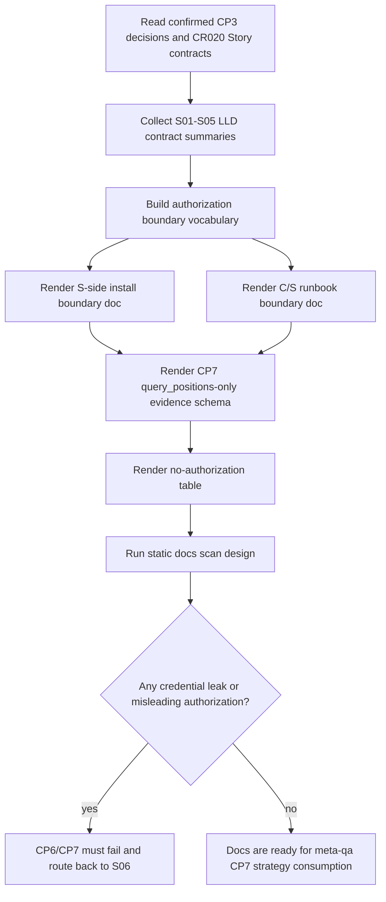

# LLD: CR020-S06 - 文档、runbook 与 CP7 实机只读验收边界

本文档只冻结 `CR020-S06-docs-runbook-cp7-real-machine-validation` 的 Low-Level Design。当前 `confirmed=false`，只能进入 CR-020 全量 CP5 LLD 统一确认。CP5 自动预检 PASS 只表示本 LLD 可实现，不表示授权实现文档、执行测试、启动 gateway、绑定端口、读取真实 `.env`、连接 QMT / MiniQMT / XtQuant、执行真实 `query_positions`、输出凭据、输出未脱敏持仓或授权任何交易。

## 1. Goal

创建 CR-020 文档、runbook 和 CP7 实机只读验收边界的实现蓝图：后续在全量 CP5 人工确认、当前 Story LLD confirmed、Wave / 依赖 / 文件 owner / dev_gate 均满足后，创建或修改 `docs/QMT-GATEWAY-INSTALL.md`、`docs/QMT-C-S-BRIDGE-RUNBOOK.md`，并创建 `tests/test_cr020_docs_runbook_no_authorization.py`，用于汇总 S01 Windows gateway runtime、S02 QMT login/session、S03 Linux Python REST client + Typer validation CLI、S04 HMAC / allowlist / scope / redaction、S05 `query_positions` 唯一只读 endpoint 的合同。

完成效果是：文档明确区分设计通过、CP5 LLD 通过、实现通过、CP7 实机验证运行授权和交易授权；CP7 evidence 只能覆盖 `query_positions` 只读持仓查询链路；真实运行授权必须由 meta-po / meta-qa 在后续独立发起；交易、账户写入、simulation/live、provider/lake/publish、未脱敏持仓和凭据输出均保持未授权。

## 2. Requirements（Functional / Non-Functional）

### 2.1 Functional

- `docs/QMT-GATEWAY-INSTALL.md` 必须汇总 Windows S 端 gateway 安装 / 启停前置、runtime admission、配置 placeholder、依赖隔离、credential redaction、rollback 和 incident 边界，但不得写真实凭据示例，不得把 CP3 / CP4 / CP5 设计确认写成运行授权。
- `docs/QMT-C-S-BRIDGE-RUNBOOK.md` 必须汇总 Linux C 端 Python REST client 业务 runtime、C 端 Typer CLI pairing / diagnostics / smoke / CP7 validation 角色、HMAC pairing、allowlist、scope、nonce、redaction、session ready gate 和 `query_positions` 只读链路。
- 文档必须覆盖 7 个 CP3 DQ：CR20-A 分层架构、S/C Typer CLI 分工、`.env` 本地未跟踪 + redacted credential_ref、fail-closed 安全门、`query_positions` 唯一只读接口、依赖隔离、CP3/CP4/CP5 不授权运行。
- 文档必须覆盖 6 个 Story 边界：S01 gateway runtime admission、S02 QMT login/session ready、S03 Linux REST client + Typer validation CLI、S04 HMAC / allowlist / scope / redaction、S05 `query_positions` only、S06 docs / runbook / CP7 boundary。
- 文档必须包含 no-real-operation / no-authorization 表，明确交易、发单、撤单、改单、账户写入、simulation/live、provider/lake/publish、broker lake、reports overwrite、未脱敏持仓和真实凭据输出均未授权。
- CP7 evidence schema 必须只允许 `query_positions` 只读持仓查询链路证据，且 evidence 只能包含 redacted credential_ref、run_id、request_id、endpoint_id、scope、session/auth/redaction 状态、redacted count/digest/ref、zero forbidden counters 和 meta-qa 运行授权引用。
- CP7 evidence 不得包含账号、密码、token、session、交易密码、私钥、真实 `.env` 路径、未脱敏证券代码 / 数量 / 市值组合、raw positions payload、raw signature、raw HMAC secret 或 adapter 原始响应。
- `tests/test_cr020_docs_runbook_no_authorization.py` 必须设计为静态扫描 / fixture-only 测试，验证文档中的真实凭据样本数量为 0、设计确认即运行授权声明次数为 0、交易 / simulation/live / provider/lake/publish 作为授权指令出现次数为 0、CP7 evidence 只覆盖 `query_positions`。
- 本 Story 不修改 `README.md`、`docs/USER-MANUAL.md`、`docs/QMT-INCIDENT-PLAYBOOK.md` 或 `process/TEST-STRATEGY.md`；这些 shared 文件只作为后续 meta-doc / meta-qa 串行消费对象。

### 2.2 Non-Functional

- 安全：真实账号、密码、token、session、交易密码、私钥、真实 `.env` 路径、未脱敏持仓样本和 raw response 输出次数必须为 0。
- 安全：文档把 CP3 / CP4 / CP5 通过解释为 gateway 启动授权、QMT 连接授权、真实查询授权、交易授权、账户写入授权、simulation/live ready 或 provider/lake/publish 授权的次数必须为 0。
- 可验证：第 6 节每个文档接口 / 证据接口在第 10 节都有静态扫描或 schema 测试入口；不依赖真实 Windows 机器、端口、`.env`、QMT、MiniQMT、XtQuant 或网络。
- 可维护：文档只消费 S01-S05 confirmed LLD 合同；若后续 S01-S05 LLD 在 CP5 前修改，S06 实现前必须重新对照 contracts table。
- 可审计：所有不授权项、运行授权边界和 CP7 evidence 字段必须有固定标题或表格，便于 meta-qa / meta-doc / 静态测试 exact 定位。
- 平台：S 端正式命令面是 `uv run` Python Typer CLI，C 端 Typer CLI 只做 pairing / diagnostics / validation，业务 runtime 是 Python REST client。文档不得把 PowerShell / CMD、C 端 CLI 或旧 CLI 写成业务 runtime。
- 运行授权：真实运行、gateway 启动、端口绑定、QMT 登录、真实 `query_positions`、Windows 实机验证只能由 meta-po / meta-qa 后续独立发起；本 LLD 和 CP5 不发起。

## 3. 模块拆分与职责

| 模块 / 文件组 | 职责 | 说明 |
|---|---|---|
| Windows gateway install doc / `docs/QMT-GATEWAY-INSTALL.md` | 记录 S 端 gateway runtime 分层、配置占位符、依赖隔离、启动前置、rollback、incident 和 no-authorization 边界 | 当前 Story primary；实现后仍不得包含真实凭据或直接运行授权 |
| C/S bridge runbook / `docs/QMT-C-S-BRIDGE-RUNBOOK.md` | 记录 C 端 Python REST client 业务 runtime、C 端 Typer validation CLI、pairing/HMAC、session/auth/scope/redaction 和 `query_positions` 只读 CP7 证据链 | 当前 Story primary；区分 validation CLI 和 business runtime |
| No-authorization static tests / `tests/test_cr020_docs_runbook_no_authorization.py` | 扫描两个文档的凭据泄露、误授权语句、simulation/live/provider/lake/publish 指令、CP7 evidence schema 和 `query_positions` only 声明 | 当前 Story primary；fixture-only，不启动 gateway，不执行真实查询 |
| S01 contract summary | 汇总 `qmt_gateway_cli.py` / `qmt_gateway_service.py` / `qmt_gateway_config.py` 的 runtime admission、Typer CLI、service/bind/env/QMT gate | 只读消费 S01 LLD；不修改 S01 文件 |
| S02 contract summary | 汇总 credential_ref、`.env.example` placeholder、session ready gate、not ready blocked、diagnostics redaction | 只读消费 S02 LLD；不读取 `.env` |
| S03 contract summary | 汇总 Linux Python REST client、C 端 Typer validation CLI、timeout/retry、transport/auth/session/scope error mapping | 只读消费 S03 LLD；不把 CLI 写成 runtime |
| S04 contract summary | 汇总 pairing_hmac、allowlist、scope、nonce replay、redaction fail-closed 和 wrong-scope/replay evidence | 只读消费 S04 LLD；HMAC pass 不等于交易授权 |
| S05 contract summary | 汇总 `query_positions` 唯一只读 endpoint、scope=`qmt:positions:read`、redacted positions summary、blocked endpoints 和 forbidden counters | 只读消费 S05 LLD；CP7 evidence 只覆盖该链路 |
| Shared docs / README、USER-MANUAL、QMT-INCIDENT-PLAYBOOK、TEST-STRATEGY | 后续文档和 QA 策略消费 S06 输出 | 本 Story LLD 不修改；CP5 后按 owner 串行合并 |

## 4. 代码结构与文件影响范围

| 动作 | 文件路径 | 变更内容 |
|---|---|---|
| 创建 / 修改 | `docs/QMT-GATEWAY-INSTALL.md` | 新增 CR020 S 端文档设计：runtime 分层、安装前置、配置占位符、credential_ref、gateway admission、rollback、incident、no-real-operation 表、运行授权边界和 CP7 前置 |
| 创建 / 修改 | `docs/QMT-C-S-BRIDGE-RUNBOOK.md` | 新增 CR020 C/S runbook 设计：S/C 分工、C 端 Python REST client runtime、C 端 Typer validation CLI、pairing/HMAC、allowlist、session/scope/redaction、`query_positions` evidence schema 和不授权声明 |
| 创建 | `tests/test_cr020_docs_runbook_no_authorization.py` | 新增文档静态扫描测试，覆盖 credential placeholder、误授权声明、forbidden command / endpoint、CP7 evidence schema、`query_positions` only、zero forbidden counters |
| 不修改 | `README.md` | shared；后续 meta-doc 可消费 S06 文档摘要，不在本 Story 实现 |
| 不修改 | `docs/USER-MANUAL.md` | shared；后续 meta-doc 更新用户手册，不在本 Story 实现 |
| 不修改 | `docs/QMT-INCIDENT-PLAYBOOK.md` | shared；后续按 owner 串行合并，不在本 Story 实现 |
| 不修改 | `process/TEST-STRATEGY.md` | shared；meta-qa 输出 / 更新 CP7 策略，不由 S06 LLD 修改 |
| 禁止 | `.env`、`.env.*`、`pyproject.toml`、`uv.lock`、`trading/**` | 本 Story 不读凭据、不改依赖、不实现 runtime、不启动 gateway、不连接 QMT |

## 5. 数据模型与持久化设计

本 Story 不新增数据库、配置持久化、credential store、session store、nonce store、broker lake、provider cache、lake 文件、publish 产物或 raw positions 存储。文档和测试只定义可审计的 Markdown section contract 与 CP7 evidence schema。真实凭据只允许存在于本地未跟踪 `.env`，且不进入本 Story 产物。

| 对象 / 字段 | 类型 | 约束 | 说明 |
|---|---|---|---|
| `CR020_DOCS_SCHEMA_VERSION` | string | 固定 `cr020-s06-docs-runbook-cp7-boundary-v1` | 文档 / 测试识别本 Story 合同版本 |
| `AuthorizationBoundaryRow.gate` | string | 枚举：`design-approved`、`cp5-lld-pass`、`implementation-pass`、`cp7-runtime-authorization`、`trading-authorization` | 用于区分不同门禁含义 |
| `AuthorizationBoundaryRow.allowed_effect` | string | 只能写明确授权的后续动作；CP3/CP4/CP5 必须为设计 / 评审层 | 防止文档误授权 |
| `NoAuthorizationRow.category` | string | trade/order/account-write/simulation-live/provider-lake-publish/credential/raw-position 等 | 文档必须列出并标记 `not-authorized` |
| `NoAuthorizationRow.status` | string | 固定 `not-authorized` 或 `requires-separate-meta-po-meta-qa-authorization` | 不允许写 `authorized` |
| `Cp7EvidenceSchema.endpoint_id` | string | 固定 `query_positions` | CP7 evidence 唯一允许 endpoint |
| `Cp7EvidenceSchema.scope` | string | 固定 `qmt:positions:read` | scope exact |
| `Cp7EvidenceSchema.chain_status` | mapping | 包含 S01 runtime、S02 session、S03 client、S04 auth/redaction、S05 endpoint 的 redacted status | 不含 raw secret / raw positions |
| `Cp7EvidenceSchema.redacted_payload` | mapping | 只允许 `position_count`、`positions_digest`、`items_redacted`、`redaction_status`、`schema_version` | 不输出未脱敏持仓 |
| `Cp7EvidenceSchema.forbidden_counters` | mapping[str,int] | order/cancel/modify/account_write/broker_lake/provider/lake/publish/simulation_live 必须为 0 | CP7 evidence 不能构成交易授权 |
| `DocScanFinding` | dataclass / mapping | file、rule_id、match_count、status、message | 静态测试输出，不含敏感原文 |

Markdown 文档是交付态说明，不是运行态授权记录。CP7 实机验证记录应由 meta-qa 在后续 CP7 检查点中写入；S06 文档只定义 evidence 字段边界和脱敏要求。

## 6. API / Interface 设计

| 接口 / 入口 | 输入 | 输出 | 调用方 | 说明 |
|---|---|---|---|---|
| `render_s_side_install_boundary_section` | S01 runtime flags、S02 credential/session 摘要、ADR-087/088/089/090/093 | Markdown section | `docs/QMT-GATEWAY-INSTALL.md` | 只写占位符、redacted refs 和门禁说明；不写真实启动授权 |
| `render_c_side_runbook_boundary_section` | S03 client/CLI 摘要、S04 auth/redaction 摘要、S05 endpoint 摘要 | Markdown section | `docs/QMT-C-S-BRIDGE-RUNBOOK.md` | 区分 Python REST runtime 与 Typer validation CLI |
| `render_authorization_boundary_table` | CP2/CP3 DQ、ADR-087..093、Story gates | Markdown table | 两个文档 | 固定区分设计通过、CP5 LLD 通过、实现通过、CP7 运行授权、交易授权 |
| `render_no_authorization_table` | forbidden categories、Story forbidden、Development Plan no_real_operation_boundary | Markdown table | 两个文档、静态测试 | 交易、写账户、simulation/live、provider/lake/publish、凭据、raw positions 均为 not-authorized |
| `render_cp7_readonly_evidence_schema` | S01-S05 contract summary、S05 `query_positions` schema | Markdown schema table | runbook、meta-qa CP7 strategy input | 只允许 `query_positions` / `qmt:positions:read` / redacted payload |
| `render_rollback_and_incident_boundary` | S01 rollback、S02 session fail、S04 auth/redaction fail、S05 endpoint fail | Markdown section | install doc / runbook | 只描述 fail-closed 与回退门禁，不启动服务 |
| `scan_docs_for_real_credentials` | `docs/QMT-GATEWAY-INSTALL.md`、`docs/QMT-C-S-BRIDGE-RUNBOOK.md` | `DocScanFinding[]` | `tests/test_cr020_docs_runbook_no_authorization.py` | 真实账号、密码、token、session、私钥、真实路径、未脱敏持仓命中数必须为 0 |
| `scan_docs_for_authorization_confusion` | 两个文档 | `DocScanFinding[]` | 静态测试 | 设计/CP5/实现通过不得被写成运行授权或交易授权 |
| `scan_docs_for_forbidden_runtime_claims` | 两个文档 | `DocScanFinding[]` | 静态测试 | simulation/live、provider/lake/publish、order/cancel/account_write 只能在 no-authorization 表作为禁止项出现 |
| `scan_cp7_evidence_schema` | runbook CP7 evidence section | `DocScanFinding[]` | 静态测试 / meta-qa | endpoint 必须固定 `query_positions`，scope 必须固定 `qmt:positions:read`，raw payload 字段数量为 0 |

本节每个接口均在第 10 节有对应测试入口。所有接口只设计文档渲染和静态检查，不读取 `.env`，不启动 gateway，不绑定端口，不连接 QMT。

## 7. 核心处理流程



1. 读取 CP3 DQ、HLD §36.14 / §36.15 / §36.17、ADR-087..093、Development Plan `cr020_increment` 与 S01-S05 LLD。
2. 抽取 S01 runtime admission、S02 session ready、S03 REST client / Typer validation CLI、S04 auth / redaction、S05 `query_positions` only 的稳定合同。
3. 构建固定授权词汇表：设计通过、CP5 LLD 通过、实现通过、CP7 实机验证授权、交易授权。前四者均不等于交易授权；前三者也不等于真实运行授权。
4. 渲染 S 端安装文档与 C/S runbook 的章节骨架，所有配置值使用 placeholder / redacted ref，不出现真实值。
5. 渲染 CP7 evidence schema，只允许 `query_positions` / `qmt:positions:read` / redacted positions summary / zero forbidden counters。
6. 渲染 no-authorization 表，明确交易、写账户、simulation/live、provider/lake/publish、raw positions、凭据输出均未授权。
7. 后续实现阶段创建静态扫描测试；若扫描发现凭据泄露、误授权声明、forbidden 指令或 CP7 schema 扩大，CP6 不得通过。
8. CP7 实机验证由 meta-qa 在独立运行授权下执行；S06 文档本身不得发起真实运行。

## 8. 技术设计细节

- 文档结构必须采用固定章节，便于静态测试 exact 定位：`CR020 Contract Summary`、`Authorization Boundary`、`No-Authorization Table`、`Credential Placeholder Policy`、`CP7 Readonly Evidence Schema`、`Rollback / Incident Boundary`。
- `Authorization Boundary` 必须把五类门禁写成表格：`design-approved` 只允许进入下游设计；`cp5-lld-pass` 只允许进入批次人工确认；`implementation-pass` 只表示代码 / 文档自检完成；`cp7-runtime-authorization` 只由 meta-po / meta-qa 后续单独发起且仅限只读链路；`trading-authorization` 在 CR-020 中固定为 not-authorized。
- `No-Authorization Table` 必须同时列出 forbidden operation 和 reason，避免读者把禁止项误读为使用说明。simulation/live、provider/lake/publish 只能作为“不授权项”出现，不得提供执行步骤。
- `Credential Placeholder Policy` 只能使用 `<credential-ref-placeholder>`、`[REDACTED]`、hash/ref 这类占位表达，不写账号格式、手机号样例、token 样例、真实 Windows 路径或真实 `.env` 路径。
- `CP7 Readonly Evidence Schema` 必须表达 evidence 字段，不表达可直接执行的实机命令。真实 Windows host、端口、`.env`、MiniQMT / XtQuant 版本、启动命令和运行时间由 meta-qa 在授权后记录到 CP7。
- 文档中可以描述 S 端命令面和 C 端命令面的职责，但不得提供绕过门禁的启动 / 连接 / 查询操作说明。若后续实现需要示例，示例必须是 placeholder-only 且带有“需独立运行授权”标识。
- 静态测试采用 exact section heading 和敏感词 / 误授权 phrase 扫描组合；允许 forbidden terms 出现在 no-authorization 表，不允许出现在 authorized action / CP7 evidence allowlist 中。
- 上游 OPEN 消费策略：S01 Typer optional adapter、S02 real session signal、S04 in-process nonce TTL、S05 raw positions schema 均作为非阻断 OPEN 写入文档风险表，并声明 CP5 approve 接受推荐边界，不得在 S06 私自扩展实现。
- 图示类型选择：流程图；本 Story 汇总 5 个上游合同和文档 / 测试 / CP7 三个输出面，存在误授权与敏感输出失败分支。

## 9. 安全与性能设计

| 维度 | 设计措施 | 验证方式 |
|---|---|---|
| 凭据安全 | 文档只允许 placeholder、redacted credential_ref、hash/ref；真实凭据样本数量必须为 0 | T-S06-02、T-S06-03 |
| 授权边界 | 固定五类授权表，CP3/CP4/CP5 不等于运行授权，运行授权不等于交易授权 | T-S06-04、T-S06-05 |
| 只读范围 | CP7 evidence endpoint 固定 `query_positions`，scope 固定 `qmt:positions:read` | T-S06-07 |
| 禁止交易 / 写入 | no-authorization 表列出 order/cancel/modify/account_write/simulation/live/provider/lake/publish 等 not-authorized | T-S06-06、T-S06-09 |
| 脱敏持仓 | evidence 只允许 count/digest/ref/redaction_status，raw positions 和未脱敏组合输出为 0 | T-S06-08 |
| 运行隔离 | 文档不授权 gateway 启动、端口绑定、`.env` 读取、QMT 连接；真实运行由 meta-po / meta-qa 后续发起 | T-S06-05、T-S06-10 |
| 可维护 | 固定章节 heading 和 schema version，方便 meta-doc / meta-qa 复用 | T-S06-01、T-S06-11 |
| 性能 | 静态扫描只读两个 Markdown 文件，按文本长度线性运行；无网络、无 socket、无 subprocess、无 QMT | T-S06-12 |

## 10. 测试设计

后续实现阶段建议验证入口：`uv run --python 3.11 pytest -q tests/test_cr020_docs_runbook_no_authorization.py`。本 LLD 阶段不执行测试、不创建测试文件、不实现文档、不启动 gateway、不连接 QMT。

| 测试场景 | 前置条件 | 操作 | 预期结果 | 验证方式 |
|---|---|---|---|---|
| T-S06-01 文档章节合同完整 | 两个目标文档存在 | 扫描固定 heading | `CR020 Contract Summary`、`Authorization Boundary`、`No-Authorization Table`、`CP7 Readonly Evidence Schema` 均存在 | pytest 文本断言 |
| T-S06-02 credential placeholder policy | 文档含 credential 章节 | 扫描 placeholder / redacted refs | 只出现 placeholder / `[REDACTED]` / ref；真实账号、密码、token、session、交易密码、私钥样本为 0 | 敏感字面量扫描 |
| T-S06-03 `.env` 边界 | 文档提及 `.env` | 扫描 `.env` 上下文 | 只允许“本地未跟踪”和占位说明；真实路径 / 读取指令 / 值样本为 0 | 文本上下文扫描 |
| T-S06-04 设计确认不等于运行授权 | 文档含 CP3/CP4/CP5 章节 | 扫描误授权短语 | “CP3/CP4/CP5 通过即启动/连接/查询/交易”等声明次数为 0 | phrase scan |
| T-S06-05 运行授权独立发起 | 文档含 CP7 章节 | 扫描 CP7 authorization 文案 | CP7 实机验证必须由 meta-po / meta-qa 后续独立发起；文档不自授权 | exact assertion |
| T-S06-06 禁止交易和写入 | no-authorization 表存在 | 扫描 order/cancel/modify/account_write/simulation/live/provider/lake/publish | 这些类别只以 `not-authorized` 出现，不作为执行步骤或授权动作出现 | section-aware scan |
| T-S06-07 CP7 evidence 只允许 query_positions | runbook CP7 schema 存在 | 解析 evidence schema | endpoint_id 固定 `query_positions`，scope 固定 `qmt:positions:read`；其他 endpoint allowed=0 | schema text scan |
| T-S06-08 未脱敏持仓输出为 0 | CP7 schema 和示例存在 | 扫描 raw payload / account / instrument / quantity / value 原文样例 | 只允许 digest/ref/bucket/count；raw positions 和可还原组合命中数为 0 | sensitive positions scan |
| T-S06-09 forbidden counters 为 0 | CP7 schema 存在 | 扫描 counters 表 | order/cancel/modify/account_write/broker_lake/provider/lake/publish/simulation_live 均要求 0 | exact field assertion |
| T-S06-10 不提供真实运行步骤 | 文档含 S/C 命令面说明 | 扫描启动 / 绑定 / 连接 / 查询上下文 | 不存在绕过 meta-po/meta-qa 授权的直接运行说明；命令面只描述职责和门禁 | phrase + section scan |
| T-S06-11 上游 OPEN 风险暴露 | 风险章节存在 | 扫描 S01/S02/S04/S05 OPEN IDs | `LCQ-CR020-S01-01`、`OPEN-CR020-S02-01`、`OPEN-CR020-S04-01`、`OPEN-CR020-S05-01` 均被列为非阻断 OPEN | text assertion |
| T-S06-12 无真实操作测试 | 执行 S06 静态测试 | monkeypatch 防止 socket / env / QMT import | gateway start、port bind、`.env` read、socket open、QMT import / call、provider/lake/publish 均为 0 | monkeypatch / AST scan |

第 6 节每个接口均在上表有测试入口；第 7 节误授权、凭据泄露、CP7 evidence 扩大、forbidden 指令出现等异常路径均有错误路径验证。

## 11. 实施步骤

| TASK-ID | 动作 | 目标文件 | 详细描述 | 对应测试 |
|---|---|---|---|---|
| CR020-S06-T1 | 创建 / 修改 | `docs/QMT-GATEWAY-INSTALL.md` | 写入 S 端 gateway install / runtime admission / credential placeholder / rollback / incident / no-authorization 边界；消费 S01/S02/S04 合同，不写真实凭据或运行授权 | T-S06-01、02、03、04、05、06、10、11 |
| CR020-S06-T2 | 创建 / 修改 | `docs/QMT-C-S-BRIDGE-RUNBOOK.md` | 写入 C/S runbook、Python REST client runtime、C 端 Typer validation CLI、HMAC / allowlist / scope / redaction、`query_positions` CP7 evidence schema；消费 S03/S04/S05 合同 | T-S06-01、04、05、06、07、08、09、10、11 |
| CR020-S06-T3 | 创建 | `tests/test_cr020_docs_runbook_no_authorization.py` | 创建 fixture-only 文档扫描测试，覆盖 credentials、authorization confusion、forbidden runtime claims、CP7 evidence schema、upstream OPEN 暴露和 no-real-operation counters | T-S06-01..12 |
| CR020-S06-T4 | 设计消费 | `process/TEST-STRATEGY.md` | 不修改文件；向 meta-qa 暴露 CP7 只读 evidence schema 和禁止范围，供后续 TEST-STRATEGY / CP7 使用 | T-S06-07、08、09、10 |
| CR020-S06-T5 | 门控 | CP5 / CP6 / CP7 | CP5 前不实现；CP6 只允许文档 / 静态测试自检；CP7 实机验证必须由 meta-po / meta-qa 独立授权，且只验证 `query_positions` 只读链路 | T-S06-04、05、07、12 |

每个 primary 文件均被至少一个 TASK-ID 覆盖；shared 文件只被设计消费，不在本 Story 私自修改。

## 12. 风险、难点与预研建议

### 12.1 实现灰区与取舍记录

| Clarification ID | 问题 | 选项与推荐 | 决策 / 答案 | 影响面 | 证据 | 重访条件 |
|---|---|---|---|---|---|---|
| LCQ-CR020-S01-01 | S01 定义 Typer CLI，但依赖落地不归 S01；文档是否写真实 Typer 运行命令？ | 推荐：S06 只写 S 端 Typer CLI 职责、门禁和占位命令面，不写绕过运行授权的真实启动说明；备选 A：写完整启动命令；备选 B：完全不提 CLI。 | 消费上游非阻断 OPEN，`blocks_lld=false`。推荐方案随 CP5 approve 接受。 | 文档 / 依赖 / 安全 / CP7 | S01 LLD §12.1；ADR-087、ADR-093 | CP5 决定 Typer 依赖落地或 meta-qa 发起实机运行授权时重访 |
| OPEN-CR020-S02-01 | 真实 QMT login / ready / expiry 信号需 CP7 Windows 实机确认。 | 推荐：文档只写 session ready gate 和 fail-closed evidence 字段，不写具体未实测 API 信号；备选 A：假定 XtQuant 字段；备选 B：仅写 health。 | 消费上游非阻断 OPEN，`blocks_lld=false`。推荐方案随 CP5 approve 接受。 | 文档 / CP7 / 安全 / 跨 Story 契约 | S02 LLD §12.1；ADR-090 | CP7 发现 ready 信号不可判定或需扩大 S02 接口时重访 |
| OPEN-CR020-S04-01 | nonce replay store 第一版为进程内 TTL，不覆盖多进程持久防重放。 | 推荐：runbook 风险表写明单 gateway 进程 TTL 边界，多进程另起 CR；备选 A：文档承诺多进程防重放；备选 B：不写 nonce 边界。 | 消费上游非阻断 OPEN，`blocks_lld=false`。推荐方案随 CP5 approve 接受。 | 文档 / 安全 / CP7 / 后续 CR | S04 LLD §12.1；ADR-091 | CP7 或用户要求多进程 gateway 时重访 |
| OPEN-CR020-S05-01 | 真实 `query_positions` raw payload 字段需 CP7 Windows 实机确认。 | 推荐：CP7 evidence 只验证 redacted count/digest/ref，不输出 raw positions；备选 A：假定 XtQuant raw 字段；备选 B：取消 positions evidence。 | 消费上游非阻断 OPEN，`blocks_lld=false`。推荐方案随 CP5 approve 接受。 | 文档 / 测试 / CP7 / 安全 | S05 LLD §12.1；ADR-092 | CP7 返回字段无法脱敏或需要改 evidence schema 时重访 |

当前 S06 无新增 `blocks_lld=true` clarification item；受本轮“只写两个目标文件”约束，本线程不修改 `process/STATE.md.parallel_execution.lld_clarification_queue`。上述 4 项均为上游非阻断 OPEN，需由 meta-po 汇入 CR020 CP5 Decision Brief。

| 风险 / 难点 | 影响 | 缓解措施 / 预研建议 |
|---|---|---|
| 文档被读者误解为运行授权 | 可能绕过 meta-po / meta-qa 真实运行门禁 | 固定授权边界表；静态测试扫描误授权语句；CP7 运行授权必须单独引用 |
| 文档泄露真实凭据或未脱敏持仓 | 最高安全风险 | placeholder-only；敏感字面量扫描；CP6 / CP7 发现即 FAIL 并回修 |
| CP7 evidence 过宽 | 可能把 account/orders/trades 或交易写入纳入验证 | evidence schema 固定 endpoint/scope；forbidden counters 必须为 0 |
| 文档与上游 LLD 漂移 | CP7 验证入口和实际实现不一致 | 实现前重读 S01-S05 confirmed LLD；文档 summary 使用合同表，不臆测未确认实现 |
| static scan 误报 forbidden terms | no-authorization 表需要列出禁止项 | 测试采用 section-aware scan：禁止项可在 no-authorization 表出现，不可在 authorized action / evidence allowlist 出现 |

### OPEN / Spike 跟踪

| ID | 类型（OPEN / Spike） | 问题 | 下一动作 | 责任方 |
|---|---|---|---|---|
| LCQ-CR020-S01-01 | OPEN | Typer 依赖 / adapter 采用命令矩阵 + optional Typer adapter；S06 文档不得写成已具备真实启动能力 | meta-po 在 CP5 Decision Brief 汇总；S06 实现时按 confirmed S01 LLD 更新文档 | meta-po / meta-dev |
| OPEN-CR020-S02-01 | OPEN | 真实 QMT login / ready / expiry 信号需 CP7 实机确认 | CP7 后如信号不兼容，回修 S02/S06 文档和 evidence schema | meta-qa / meta-dev |
| OPEN-CR020-S04-01 | OPEN | nonce replay store 第一版进程内 TTL，不覆盖多进程持久防重放 | 多进程需求另起 CR；当前 runbook 暴露边界 | meta-po / user |
| OPEN-CR020-S05-01 | OPEN | `query_positions` raw payload 字段需 CP7 实机确认 | CP7 发现 schema 不兼容时在 S05/S06 范围回修 | meta-qa / meta-dev |

## 13. 回滚与发布策略

- 发布方式：本 LLD 只进入 CR020 全量 CP5 LLD 批次；CP5 人工确认前不得实现文档或测试。CP5 approved 后仍需当前 Story LLD confirmed、依赖满足、文件 owner 无冲突和 dev_gate 重新计算后才能进入实现。
- 实现发布边界：后续实现只发布两个文档和一个静态扫描测试；不发布真实凭据、不启动 gateway、不绑定端口、不连接 QMT、不执行真实查询、不改依赖。
- CP7 运行边界：CP7 实机只读验证必须由 meta-po / meta-qa 独立授权；验证范围只限 `query_positions` 只读持仓查询链路和脱敏 evidence，不构成交易、账户写入、simulation/live、provider/lake/publish 或扩大 endpoint 授权。
- 回滚触发条件：文档出现真实凭据、真实 `.env` 路径、未脱敏持仓、raw payload、CP3/CP4/CP5 即运行授权、运行授权即交易授权、simulation/live 执行说明、provider/lake/publish 指令、`query_positions` 以外 endpoint 被写成 CP7 allowlist。
- 回滚动作：回退 `docs/QMT-GATEWAY-INSTALL.md`、`docs/QMT-C-S-BRIDGE-RUNBOOK.md` 和 `tests/test_cr020_docs_runbook_no_authorization.py` 中 S06 变更；若问题来自 S01-S05 接口或 evidence schema 扩大，停止并交回 meta-po 发起 CP5 修订或新 CR。
- 切换策略：若 `query_positions` 无法 CP7 验证，按 ADR-092 回退 CP3 改接口或收窄 health-only；若凭据策略不可接受，按 ADR-089 回退 security redesign；若运行授权边界需扩大，必须由 meta-po 重新发起人工决策。

## 14. Definition of Done

- [ ] 14 个可见章节全部填写完成。
- [ ] LLD frontmatter `tier=M`、`status=ready-for-review`、`confirmed=false`、`open_items=4`、`blocking_open_items=0` 已填写。
- [ ] `docs/QMT-GATEWAY-INSTALL.md` 设计覆盖 S01/S02/S04/S05 的 S 端 runtime、credential placeholder、auth/redaction、rollback 和 no-authorization 边界。
- [ ] `docs/QMT-C-S-BRIDGE-RUNBOOK.md` 设计覆盖 S03 Python REST client runtime、C 端 Typer validation CLI、S04 HMAC/allowlist/scope/redaction、S05 `query_positions` only 和 CP7 evidence schema。
- [ ] 文档覆盖 7 个 CP3 DQ、6 个 Story 边界和 no-real-operation / no-authorization 表。
- [ ] CP7 evidence schema 仅允许 `endpoint_id=query_positions` 和 `scope=qmt:positions:read`。
- [ ] 真实凭据、账号、token、session、私钥、真实 `.env` 路径和未脱敏持仓样本数量为 0。
- [ ] “设计确认即运行授权 / 交易授权 / simulation-ready / live-ready”声明次数为 0。
- [ ] provider/lake/publish、交易、账户写入、simulation/live 指令次数为 0，除非位于 no-authorization 表并标记 `not-authorized`。
- [ ] 第 6 节每个接口均在第 10 节有对应测试入口。
- [ ] 第 7 节每条异常路径均在第 10 节有错误路径验证。
- [ ] 第 11 节 TASK-ID 与文件影响范围一一对应。
- [ ] 上游 OPEN 已清点；当前 S06 无新增阻断 clarification，`blocks_lld=true` 项为 0。
- [ ] `confirmed=false`、全量 CP5 人工确认未通过、dev_gate 未满足前不进入实现。

## 人工确认区

> **CP5 - Story LLD 可实现性门**
> meta-dev 已为本 Story 写入 `process/checks/CP5-CR020-S06-docs-runbook-cp7-real-machine-validation-LLD-IMPLEMENTABILITY.md` 自动预检结果。
> meta-po 需收齐 CR020-S01..S06 全部 LLD、clarification / OPEN、CP4 摘要和 CP5 自动预检后，再发起统一人工确认。
> 用户统一确认全部目标 Story 的 LLD 后，仍需满足当前 Wave、依赖门控、文件所有权门控和运行授权方可进入实现或实机验证。

**CP5 checklist 摘要**：

| # | 检查项 | 状态 | 证据 |
|---|---|---|---|
| 1 | LLD 覆盖 AC | 待检查 | 第 2 / 10 / 14 节 |
| 2 | 与 HLD / ADR 一致 | 待检查 | 第 3 / 8 / 12 节 |
| 3 | 文件影响范围明确 | 待检查 | 第 4 / 11 节 |
| 4 | 接口契约完整 | 待检查 | 第 6 节 |
| 5 | 测试与 dev_gate 可计算 | 待检查 | 第 10 / 14 节 |
| 6 | clarification / OPEN 已暴露 | 待检查 | 第 12.1 节；4 个上游非阻断 OPEN，S06 无新增阻断项 |

**人工确认回复**：

请直接回复以下任一整行：

```text
approve
修改: <具体修改点>
reject
```

- `approve`：接受本 LLD 的推荐设计；仍不授权实现、依赖变更、gateway 启动、真实请求、QMT 连接、`.env` 读取、凭据输出、未脱敏持仓输出或任何交易 / 账户 / 数据写入。
- `修改: <具体修改点>`：指出具体修改点后由 meta-dev 更新重提。
- `reject`：设计方向有根本问题，需重新设计。

**人工审查结果回填**：

- 结论：`approved | changes_requested | rejected`
- 审查人：
- 审查时间：
- 修改意见：
- 风险接受项：
