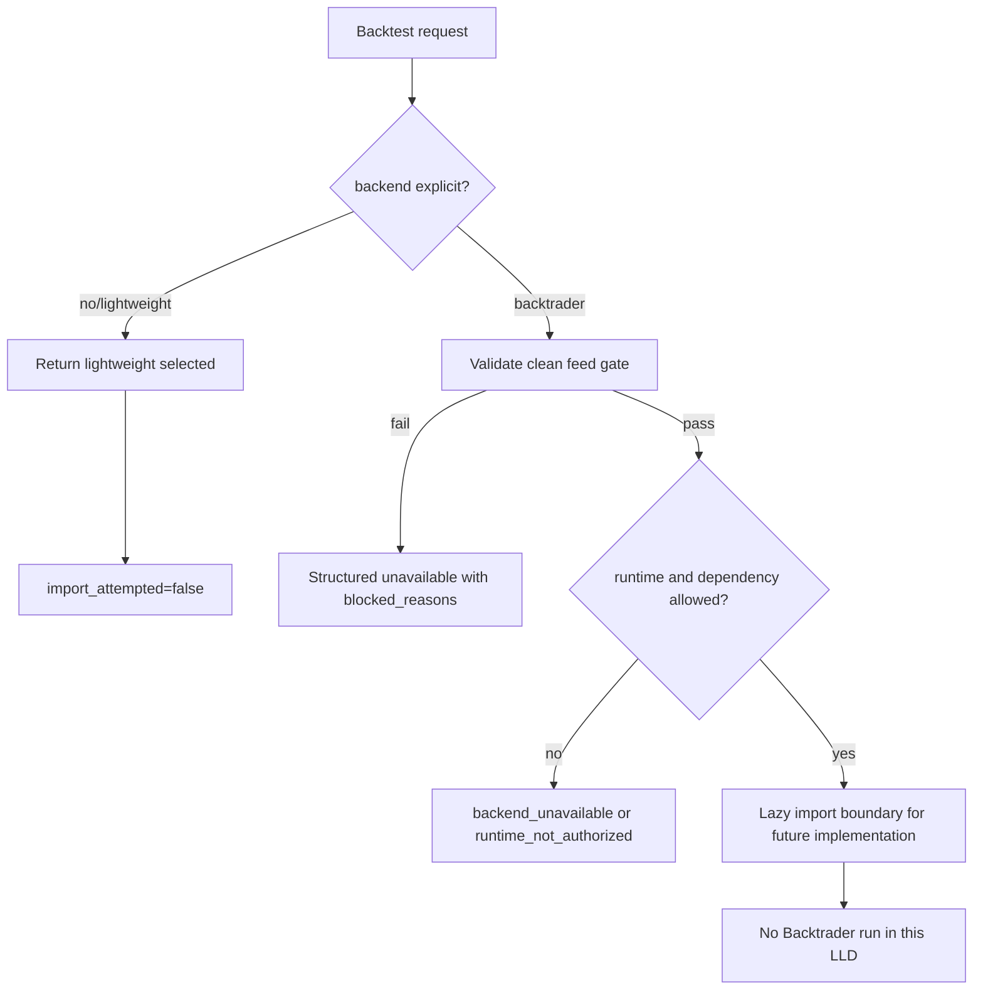

# LLD: CR025-S01-clean-feed-gate-backend-selector - clean feed gate 与 backend selector

> 本 LLD 已纳入 `CR025-RESEARCH-EXECUTION-SEMANTIC-ALIGNMENT-BATCH-A` 并于 2026-06-02 CP5 人工确认通过。后续实现仅限受控离线 / fixture / 静态合同范围；仍不得改依赖、运行 Backtrader、复制源码或触发真实外部操作。

## 1. Goal

冻结 clean feed gate、lightweight 默认后端、Backtrader optional selector、structured unavailable 与 lazy import 边界，使后续实现能够在默认路径 Backtrader import 次数为 0 的前提下，把显式选择 Backtrader 的场景安全地阻断或返回结构化不可用结果。

## 2. Requirements（Functional / Non-Functional）

### 2.1 Functional

- 定义 `BackendSelectionRequest` 与 `BackendSelectionResult`，覆盖 backend 名称、clean feed evidence、lineage、limitations、blocked reasons 和 `import_attempted`。
- 定义 clean feed gate，100% 覆盖 PIT / `available_at`、单一复权口径、OHLCV / calendar、benchmark、tradability / cost、quality / lineage。
- 保持 lightweight engine 为默认 baseline；用户未显式选择 Backtrader 时不得 import、运行或依赖 Backtrader。
- 显式选择 Backtrader 但依赖缺失、clean feed 不满足、CP5 / runtime gate 不满足时，返回 structured unavailable，不抛裸异常。
- 禁止在 adapter 中生成 PIT、复权、benchmark、tradability 或 quality truth；禁止 provider fetch、lake write、credential read、QMT 调用和 Backtrader run。
- `pyproject.toml` / `uv.lock` 修改次数必须为 0；本 Story 不新增依赖。

### 2.2 Non-Functional

- 安全性：真实 broker、QMT、provider、lake、publish、simulation / live、credential 操作计数均为 0。
- 可维护性：selector 与 clean feed gate 使用显式枚举和结构化结果，避免字符串异常扩散。
- 可测试性：每个接口均有 fixture-only 测试入口；默认路径能静态验证 `import_attempted=false`。
- 性能：默认 lightweight 路径只做常量级 selector 判断，不扫描 Backtrader 包、不触发 importlib 导入。

## 3. 模块拆分与职责

| 模块 / 文件组 | 职责 | 说明 |
|---|---|---|
| `engine/backtrader_adapter.py` | 承载 optional selector、clean feed gate、structured unavailable 数据结构和 lazy import 边界 | 后续实现只能 clean-room 定义接口；不得复制 Backtrader 源码。 |
| `engine/backtest.py` | 保持 lightweight 默认路径，并在显式配置时调用 selector 合同 | 默认路径不得 import Backtrader；不改变现有 baseline 结果含义。 |
| `tests/test_cr025_clean_feed_gate.py` | 验证 selector schema、gate fail-closed、lazy import 默认 0、依赖 diff 0 和禁止操作计数 | fixture-only；不运行 Backtrader。 |
| `market_data/readers.py` | 只读 clean feed / quality / lineage 既有合同 | shared，只消费既有接口；本 Story 不拥有修改。 |
| `engine/research_dataset.py` | 只读 ResearchDataset clean feed evidence | shared，只消费既有字段；修改需 meta-po 串行调度。 |

## 4. 代码结构与文件影响范围

| 动作 | 文件路径 | 变更内容 |
|---|---|---|
| 修改 | `engine/backtrader_adapter.py` | 后续实现增加 `BackendSelectionRequest`、`BackendSelectionResult`、`CleanFeedGateResult`、`select_research_backend()`、`validate_clean_feed_gate()` 和 lazy import guard；不新增依赖。 |
| 修改 | `engine/backtest.py` | 后续实现把默认 lightweight baseline 与 selector 调用边界显式化；默认配置不进入 Backtrader 分支。 |
| 创建 | `tests/test_cr025_clean_feed_gate.py` | 后续实现添加 fixture-only 合同测试，覆盖默认路径、unavailable、gate blocked、dependency diff 和 forbidden operation count。 |
| 不修改 | `market_data/readers.py` | 仅作为 clean feed / lineage / quality 只读输入；若后续需要修改必须重新经 meta-po 调度。 |
| 不修改 | `engine/research_dataset.py` | 仅作为 ResearchDataset evidence 只读输入；本 Story 不扩大 owner。 |
| 禁止 | `pyproject.toml`、`uv.lock`、`.env`、`market_data/connectors/**`、`market_data/runtime.py`、`market_data/storage.py` | 不得修改、读取凭据、接 provider、写 lake 或触发真实运行。 |

## 5. 数据模型与持久化设计

无新增持久化存储。后续实现只新增内存结构或轻量 dataclass / TypedDict；不写数据库、不写 lake、不写 report artifact。

| 对象 / 字段 | 类型 | 约束 | 说明 |
|---|---|---|---|
| `BackendSelectionRequest.backend` | enum/string | `lightweight` 默认；`backtrader` 仅显式选择 | 未指定时固定 lightweight。 |
| `BackendSelectionRequest.clean_feed_evidence` | mapping/object | 必须含 PIT、available_at、adjustment、calendar、benchmark、tradability、quality、lineage、limitations evidence | 缺失字段进入 blocked reasons。 |
| `BackendSelectionRequest.feature_flags` | mapping | 不得隐式启用 Backtrader | 仅用于显式 gating。 |
| `BackendSelectionResult.selected_backend` | enum | `lightweight` / `backtrader` / `none` | gate fail 时为 `none` 或保持 lightweight fallback。 |
| `BackendSelectionResult.availability_status` | enum | `available`、`not_selected`、`backend_unavailable`、`blocked_clean_feed_pit`、`blocked_adjustment_policy_mixed`、`data_required_missing`、`quality_fail`、`runtime_not_authorized` | 状态必须可测试。 |
| `BackendSelectionResult.blocked_reasons` | list[string] | 可为空；blocked/unavailable 时至少 1 项 | 不泄露凭据或私有路径。 |
| `BackendSelectionResult.import_attempted` | bool | 默认 false | 默认 lightweight 路径必须 false。 |
| `BackendSelectionResult.lineage` / `limitations` | list/object | 必填 | 下游 semantic diff 和 order intent draft 依赖。 |

## 6. API / Interface 设计

| 接口 / 入口 | 输入 | 输出 | 调用方 | 说明 |
|---|---|---|---|---|
| `select_research_backend(request)` | `BackendSelectionRequest` | `BackendSelectionResult` | `engine/backtest.py`、后续 semantic diff builder | 测试：默认 lightweight、显式 Backtrader unavailable、runtime_not_authorized。 |
| `validate_clean_feed_gate(evidence)` | clean feed evidence mapping | `CleanFeedGateResult` | `select_research_backend()` | 测试：PIT 缺失、复权混用、benchmark 缺失、quality fail。 |
| `try_resolve_backtrader_runtime(selection)` | selection result + explicit flag | import status / unavailable reason | optional Backtrader 分支 | 测试：默认不调用；显式但未安装返回 `backend_unavailable`，不抛裸异常。 |
| `run_backtest(..., backend="lightweight")` 边界 | 现有 backtest 输入 + backend selector 参数 | lightweight result 或 structured unavailable | research experiment / tests | 测试：默认路径 Backtrader import count = 0；不改变 baseline。 |

## 7. 核心处理流程

1. 调用方未传 backend 或传入 `lightweight` 时，`select_research_backend()` 直接返回 `selected_backend=lightweight`、`availability_status=available`、`import_attempted=false`。
2. 调用方显式选择 `backtrader` 时，先执行 `validate_clean_feed_gate()`；任一 P0 gate 失败即返回 structured unavailable / blocked reason，不 import Backtrader。
3. gate 通过后检查 runtime authorization、feature flag 和依赖状态；未授权或未安装时返回 `runtime_not_authorized` / `backend_unavailable`，不抛裸异常。
4. 只有显式选择、gate 通过、runtime gate 通过且依赖可用时，后续实现才可进入 lazy import 分支；本 Story LLD 不授权运行 Backtrader。
5. 任何 provider fetch、lake write、credential read、QMT operation、Backtrader live store 需求均 fail closed 并返回 blocked reason。



## 8. 技术设计细节

- 关键算法 / 规则：gate 采用 fail-fast 枚举，PIT / `available_at`、复权混用、benchmark required missing、quality fail 为 hard block；warn 只能进入 `limitations`。
- 依赖选择与复用点：复用 CR006 clean feed contract 与 CR005 optional backend unavailable 语义；不新增依赖，不改 `pyproject.toml` / `uv.lock`。
- 兼容性处理：未安装 Backtrader 是合法环境；默认路径保持 existing lightweight behavior。
- 错误暴露：所有失败通过 `availability_status` 和 `blocked_reasons[]` 暴露；禁止裸 ImportError、traceback 或凭据 / 私有路径泄露。
- 图示类型选择：本 LLD 使用流程图，因为 selector、gate、lazy import、blocked path 存在多分支。

## 9. 安全与性能设计

| 维度 | 设计措施 | 验证方式 |
|---|---|---|
| 安全 | provider fetch、lake write、credential read、QMT / broker、publish、simulation / live、Backtrader run 均在 selector 前 fail closed | `tests/test_cr025_clean_feed_gate.py` 中检查 forbidden operation counters = 0。 |
| 合规 | selector 不复制、裁剪或改写 Backtrader GPLv3 源码；只允许 optional dependency lazy import 边界 | 与 S04 no-copy guardrail 测试交叉验证。 |
| 性能 | 默认 lightweight 路径不做 Backtrader import 和包扫描 | 测试 import spy / sentinel，默认 import count = 0。 |
| 可观测 | structured unavailable 包含 status、blocked reasons、lineage、limitations | schema contract 测试。 |

## 10. 测试设计

| 测试场景 | 前置条件 | 操作 | 预期结果 | 验证方式 |
|---|---|---|---|---|
| 默认 lightweight 路径 | 未传 backend；clean feed 可用 | 调用 `select_research_backend()` | `selected_backend=lightweight`、`import_attempted=false` | fixture unit test。 |
| 未安装 / 未选择 Backtrader | backend 未选或显式选择但依赖不可用 | 调用 selector | `not_selected` 或 `backend_unavailable`，无裸异常 | monkeypatch importlib / fixture。 |
| PIT / available_at 缺失 | clean feed evidence 缺 `available_at` | 调用 gate | `blocked_clean_feed_pit`，不进入 import | gate contract test。 |
| 复权口径混用 | 同一 run 同时出现 qfq/raw 执行输入 | 调用 gate | `blocked_adjustment_policy_mixed` | fixture。 |
| benchmark / tradability / quality fail | required benchmark missing 或 quality fail | 调用 gate | blocked reason 可审计，provider fetch = 0 | fixture + counter assert。 |
| CP5 / runtime 未授权 | `implementation_allowed=false` 或 runtime flag false | 显式选择 Backtrader | `runtime_not_authorized`，Backtrader run count = 0 | fixture。 |
| 依赖与禁区 | 本 Story 实现后 | 检查 git diff 或 file snapshot | `pyproject.toml` / `uv.lock` 修改次数 = 0 | static assertion / meta-qa diff check。 |

## 11. 实施步骤

> 以下步骤仅在全量 CP5 人工确认通过、Story dev_gate 满足后执行；本 LLD 本身不实现。

| TASK-ID | 动作 | 目标文件 | 详细描述 | 对应测试 |
|---|---|---|---|---|
| CR025-S01-T1 | 修改 | `engine/backtrader_adapter.py` | 创建 selector / gate 结构化模型与 status enum，覆盖 clean feed evidence 和 unavailable schema。 | schema contract、unavailable tests。 |
| CR025-S01-T2 | 修改 | `engine/backtrader_adapter.py` | 实现 `validate_clean_feed_gate()` fail-fast 规则，不生成数据真相。 | PIT、复权、benchmark、quality gate tests。 |
| CR025-S01-T3 | 修改 | `engine/backtest.py` | 接入 selector 边界，保持 lightweight 默认，不进入 Backtrader import。 | default import count test。 |
| CR025-S01-T4 | 创建 | `tests/test_cr025_clean_feed_gate.py` | 增加 fixture-only 测试覆盖 selector、gate、lazy import、dependency diff 和 forbidden counters。 | 全部 S01 测试。 |
| CR025-S01-T5 | 约束 | `pyproject.toml`、`uv.lock`、Backtrader runtime | 不修改依赖、不运行 Backtrader；用静态 / diff 检查证明修改次数为 0。 | dependency diff / run counter tests。 |

## 12. 风险、难点与预研建议

### 12.1 实现灰区与取舍记录

| Clarification ID | 问题 | 选项与推荐 | 决策 / 答案 | 影响面 | 证据 | 重访条件 |
|---|---|---|---|---|---|---|
| N/A-CR025-S01 | 本 Story 是否需要新增 LLD clarification item | 推荐：不新增。Story、HLD §34.6、ADR-074、CP3 DQ 和 handoff 已冻结 selector / gate / no-real-op 边界。 | 已按 CP3 approved 与 CP4 PASS 作为输入；未回答阻断问题为 0。 | 接口 / 测试 / 安全 / 跨 Story 契约 | `checkpoints/CP3-CR025-HLD-REVIEW.md` approved；`process/checks/CP4-CR025-STORY-DAG-PARALLEL-SAFETY.md` PASS。 | 若用户要求真实 Backtrader runtime、依赖变更或源码迁移，另起 CR 或回退 CP5。 |

| 风险 / 难点 | 影响 | 缓解措施 / 预研建议 |
|---|---|---|
| selector 被写成默认 Backtrader | 破坏 lightweight baseline，扩大依赖 | 默认 backend 固定 lightweight；测试 import count = 0。 |
| clean feed gate 过度推断数据真相 | PIT / quality 责任漂移 | gate 只消费 evidence；缺失返回 blocked，不补数。 |
| ImportError 泄露为裸异常 | 用户体验和自动验证不稳定 | 统一 structured unavailable。 |
| shared 文件被并行 Story 同时修改 | 文件 owner 冲突 | 实现阶段由 meta-po 按 S01 merge owner 串行调度。 |

### OPEN / Spike 跟踪

| ID | 类型（OPEN / Spike） | 问题 | 下一动作 | 责任方 |
|---|---|---|---|---|
| N/A | OPEN | 无阻断 OPEN；无 Spike。 | CP5 批次人工确认后再进入实现调度。 | meta-po |

## 13. 回滚与发布策略

- 发布方式：CP5 approved 后作为受控离线代码增量进入 Story execution；默认不安装依赖、不运行 Backtrader。
- 回滚触发条件：默认路径出现 Backtrader import、`pyproject.toml` / `uv.lock` 被修改、provider/lake/QMT/credential 任一计数非 0、structured unavailable 退化为裸异常。
- 回滚动作：回滚 `engine/backtrader_adapter.py`、`engine/backtest.py` 与 `tests/test_cr025_clean_feed_gate.py` 中本 Story 增量；保留 LLD / CP5 审计记录；若涉及接口变更，回退 CP5 重新确认。

## 14. Definition of Done

- [ ] 14 个章节全部填写完成。
- [ ] 文件影响范围、接口、测试与实施步骤可直接指导编码。
- [ ] clean feed gate 覆盖 PIT / available_at / 复权 / benchmark / tradability / quality / lineage / limitations。
- [ ] 默认 lightweight 路径 Backtrader import 次数为 0。
- [ ] 未安装或未选择 Backtrader 时返回 structured unavailable，裸异常泄漏次数为 0。
- [ ] `pyproject.toml` / `uv.lock` 修改次数为 0。
- [ ] provider fetch、lake write、credential read、QMT 调用、Backtrader run 均为 0。
- [ ] 实现灰区与取舍记录已显式写“无阻断 clarification item”。
- [ ] `confirmed=false` 时不进入实现。
- [ ] OPEN / Spike 已清点为 0。

## 人工确认区

> **CP5 - Story LLD 可实现性门**
> meta-dev 已写入 `process/checks/CP5-CR025-S01-clean-feed-gate-backend-selector-LLD-IMPLEMENTABILITY.md` 自动预检结果。meta-po 收齐 CR025 全量 LLD 与 CP5 自动预检后，统一发起 `checkpoints/CP5-CR025-RESEARCH-EXECUTION-SEMANTIC-ALIGNMENT-BATCH-A-LLD-BATCH.md` 人工确认。

**CP5 checklist 摘要**：

| # | 检查项 | 状态 | 证据 |
|---|---|---|---|
| 1 | LLD 覆盖 AC | 待人工确认 | 第 2 / 10 / 14 节 |
| 2 | 与 HLD / ADR 一致 | 待人工确认 | 第 3 / 8 / 12 节 |
| 3 | 文件影响范围明确 | 待人工确认 | 第 4 / 11 节 |
| 4 | 接口契约完整 | 待人工确认 | 第 6 节 |
| 5 | 测试与 dev_gate 可计算 | 待人工确认 | 第 10 / 14 节 |
| 6 | clarification queue 已收敛 | 待人工确认 | 第 12.1 节 |

**人工确认回复**：

```text
approve
修改: <具体修改点>
reject
```

**人工审查结果回填**：

- 结论：`approved | changes_requested | rejected`
- 审查人：
- 审查时间：
- 修改意见：
- 风险接受项：
