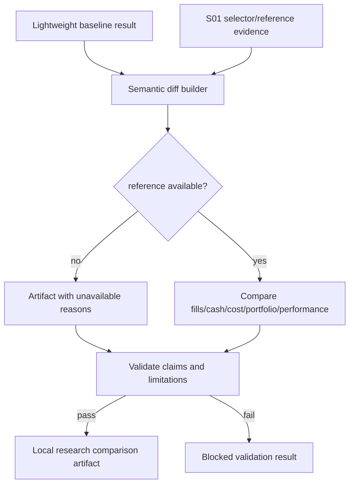

# LLD: CR025-S02-semantic-diff-schema-artifact - semantic diff schema 与 artifact

> 本 LLD 只冻结 semantic diff schema 与 artifact 合同。它不运行 Backtrader，不生成真实报告，不把 reference 覆盖 lightweight baseline，也不声明 production truth、simulation-ready、QMT admission pass、factor tear sheet、IC / RankIC report 或 strategy admission package。

## 1. Goal

创建 semantic diff 的数据模型、生成接口、落盘 artifact 合同和禁用声明规则，使 lightweight baseline 与 Backtrader-style semantic reference 的成交、现金、成本、滑点、净值、仓位、差异原因和 unavailable 语义可解释、可验证、可被后续 order intent draft 安全消费。按 ADR-078，本 Story 不设计或验收 FactorSpec、FactorRunSpec、IC / RankIC、分层收益、多因子组合、实验追踪、策略准入包、Qlib / Alphalens / vnpy.alpha 集成或任何多因子研究闭环主框架能力。

## 2. Requirements（Functional / Non-Functional）

### 2.1 Functional

- 定义 `SemanticDiffArtifact` schema，字段不少于 10 类，覆盖 metadata、availability、fill、cash/cost、portfolio、performance、timeline、diff reason、qmt relevance、limitations。
- semantic diff 必须保留 baseline 与 reference 双轨；Backtrader reference 不得覆盖 lightweight baseline。
- reference unavailable 是合法结果，必须保留 `blocked_reasons[]` 与 `limitations[]`。
- artifact 必须标记 `research_comparison`，不得出现 production truth、simulation-ready、QMT admission pass 等误导性声明。
- artifact 路径、文件命名、schema version 和 limitations 必须稳定，供 S03 order intent draft 只读消费。
- semantic diff 只比较执行语义差异，不得扩展为 factor tear sheet、IC / RankIC report、分层收益报告、多因子组合结果、experiment tracker 或 strategy admission package。
- 不运行 Backtrader、不触发 provider fetch / lake write / credential read / QMT / publish / simulation / live。

### 2.2 Non-Functional

- 可追溯：每个 artifact 带 `schema_version`、`source_run_id`、`lineage`、`generated_at` 和 limitations。
- 可测试：所有字段可用 fixture-only 测试验证，不依赖 Backtrader runtime。
- 安全：禁用声明由 schema validator 和 report claim scan 双重验证。
- 兼容：reference unavailable 时仍输出完整 artifact，不中断 baseline 使用。

## 3. 模块拆分与职责

| 模块 / 文件组 | 职责 | 说明 |
|---|---|---|
| `engine/semantic_diff.py` | 定义 semantic diff schema、builder、validator、reason / severity 枚举和 artifact writer 接口 | clean-room 自有实现，不迁移 Backtrader internals。 |
| `reports/semantic_diff/**` | 后续运行时 artifact 输出根目录和 schema 文档位置 | 本 LLD 不创建真实报告；仅定义路径合同。 |
| `tests/test_cr025_semantic_diff_contract.py` | 验证 schema、unavailable、双轨 baseline/reference、禁止声明和 forbidden operation count | fixture-only，不运行 Backtrader。 |
| `engine/backtest.py` | shared：提供 baseline result 输入 | S02 不拥有修改；实现需与 S01 串行合并。 |
| `engine/backtrader_adapter.py` | shared：提供 selector / unavailable evidence 输入 | S02 只消费 S01 输出合同。 |

## 4. 代码结构与文件影响范围

| 动作 | 文件路径 | 变更内容 |
|---|---|---|
| 创建 | `engine/semantic_diff.py` | 后续实现新增 schema、builder、validator、artifact path resolver 和 claim guard。 |
| 创建 | `reports/semantic_diff/` | 后续运行时输出 semantic diff artifact；本 Story 实现可只创建 schema/README 或由测试 fixture 指定路径，不生成真实 run 报告。 |
| 创建 | `tests/test_cr025_semantic_diff_contract.py` | 后续实现添加 schema contract、unavailable、baseline/reference 双轨、claim scan 和 forbidden counters 测试。 |
| 不修改 | `engine/backtest.py` | shared baseline input；仅通过 S01 / meta-po 串行调度修改。 |
| 不修改 | `engine/backtrader_adapter.py` | shared reference / unavailable input；仅消费 selector result。 |
| 禁止 | report claims、provider fetch、lake write、Backtrader run、QMT / broker / publish / simulation / live、credential read、多因子研究框架声明 | 禁止 production truth、simulation-ready、QMT admission pass、factor tear sheet、IC / RankIC report 和 strategy admission package 声明。 |

## 5. 数据模型与持久化设计

后续实现可写本地 `reports/semantic_diff/**` artifact；该 artifact 是研究对照证据，不是生产事实源、broker lake、catalog current truth 或交易授权。

| 对象 / 字段 | 类型 | 约束 | 说明 |
|---|---|---|---|
| `SemanticDiffArtifact.schema_version` | string | 固定初版 `semantic_diff_v1` | 下游按 exact version 解析。 |
| `metadata.baseline_backend` | string | 必填，默认 `lightweight` | 不可被 reference 覆盖。 |
| `metadata.reference_backend` | string | 必填，可为 `backtrader_optional_reference` 或 `unavailable` | 未安装 / 未选择是合法状态。 |
| `metadata.generated_at` / `source_run_id` / `lineage` | string/object | 必填 | 审计追溯。 |
| `availability.baseline_available` / `reference_available` | bool | 必填 | reference false 时 artifact 仍有效。 |
| `availability.blocked_reasons` / `limitations` | list[string] | 必填 | 不得为空字符串，不泄露凭据。 |
| `fills` | object/list | 至少覆盖 fill count、timing、partial flag、price source、rounding policy | 差异需 reason。 |
| `cash_cost` | object | starting/ending cash、commission、tax、slippage、cash reconciliation | 成本差异进入 severity。 |
| `portfolio` | object | holdings delta、position sizing delta、turnover delta、net value delta | 不输出交易授权。 |
| `performance` | object | nav、returns、drawdown 或 unavailable | 指标差异只作 research comparison。 |
| `timeline` | list[object] | 可为空；有事件时含 date/event/reason | 不复制 Backtrader observer line 体系。 |
| `explanation.diff_reason` | list[string] | 必填；每类差异有 reason 或 unavailable | 支持下游 limitations 摘要。 |
| `qmt_relevance` | object | 只标记 draft relevance，不标 simulation-ready | S03 只读消费。 |

不新增 `factor_spec`、`factor_run_spec`、`ic`、`rank_ic`、`quantile_return`、`factor_combination`、`experiment_tracker` 或 `strategy_admission_package` 等字段；若后续需要这些研究评价对象，必须由 meta-po 启动后续多因子研究 CR。

## 6. API / Interface 设计

| 接口 / 入口 | 输入 | 输出 | 调用方 | 说明 |
|---|---|---|---|---|
| `build_semantic_diff(baseline_result, reference_result, selection_result, config)` | lightweight result、optional reference result 或 unavailable evidence、selector result、cost / policy config | `SemanticDiffArtifact` | research report / S03 order intent draft | 测试：字段覆盖、reference unavailable、baseline 不覆盖。 |
| `validate_semantic_diff_artifact(artifact)` | artifact object | validation result / blocked reasons | tests、artifact writer | 测试：缺 reason、缺 limitations、误导性 claim blocked。 |
| `resolve_semantic_diff_path(source_run_id, schema_version, output_root)` | run id、schema version、output root | normalized artifact path | artifact writer | 测试：路径在 `reports/semantic_diff/**`，不写 lake。 |
| `write_semantic_diff_artifact(artifact, path)` | validated artifact、本地 report path | write result | CLI / report layer 后续调用 | 测试：本地 fixture path；不得 publish 或写 broker lake。 |
| `scan_semantic_diff_claims(text_or_artifact)` | artifact / rendered report | claim violations | tests / QA | 测试：production truth、simulation-ready、QMT admission pass、factor tear sheet、IC / RankIC report、strategy admission package 命中为 fail。 |

## 7. 核心处理流程

1. 接收 lightweight baseline result；baseline 缺失时返回 schema validation fail，不用 reference 替代。
2. 接收 S01 selector result；若 reference unavailable，artifact 写入 `reference_available=false`、blocked reasons 和 limitations。
3. 对 fill、cash/cost、portfolio、performance、timeline 逐类比较；每类差异必须写入 reason 或 unavailable。
4. 生成 `research_comparison` artifact，附带 lineage、limitations 和 qmt relevance 摘要。
5. 运行 claim / scope guard，阻断 production truth、simulation-ready、QMT admission pass、factor tear sheet、IC / RankIC report、strategy admission package 和“已实现多因子研究主框架”等误导声明。
6. 写入本地 `reports/semantic_diff/**` 指定路径；禁止写 lake、broker lake、catalog publish 或声明 simulation-ready。



## 8. 技术设计细节

- 关键算法 / 规则：按字段族逐类比较，缺少 reference 时不失败为异常，而是输出 unavailable；缺少 baseline 时 fail，因为 baseline 是主路径事实。
- severity 规则：默认 `info` / `warn` / `blocker`；影响 order intent raw policy、lineage、limitations 缺失时为 `blocker`。
- 依赖选择与复用点：消费 S01 selector schema、S04 no-copy guardrail 和 ADR-078 多因子研究边界；不导入 Backtrader，不复制源码，不把 Qlib / Alphalens / vnpy.alpha 作为 CR-025 依赖或 runner。
- 兼容性处理：初版 schema 使用 JSON-compatible primitives；后续可扩展字段但不得删除必填字段。
- 错误暴露：validator 返回 structured violations；不抛裸 traceback 给用户报告。
- 图示类型选择：本 LLD 使用流程图，因为 builder、unavailable、claim validation 分支需要可视化。

## 9. 安全与性能设计

| 维度 | 设计措施 | 验证方式 |
|---|---|---|
| 安全 | artifact 标记 research comparison；禁止 production truth、simulation-ready、QMT admission pass | claim scan tests。 |
| 范围 | semantic diff 不是 factor tear sheet、IC / RankIC report 或 strategy admission package | forbidden scope scan tests。 |
| 合规 | 不复制 Backtrader 源码、samples、tests、datas；只消费 S04 分类合同 | S04 guardrail + S02 tests 交叉验证。 |
| 性能 | diff 对 fixture / result object 做线性字段比较，不运行外部引擎 | unit test 使用小型 fixture。 |
| 可追溯 | 每个 artifact 带 lineage、source_run_id、schema_version、limitations | schema validation tests。 |

## 10. 测试设计

| 测试场景 | 前置条件 | 操作 | 预期结果 | 验证方式 |
|---|---|---|---|---|
| schema 字段覆盖 | baseline 和 reference fixture | 调用 builder | 字段族不少于 10 类；必填字段存在 | schema contract test。 |
| reference unavailable | selector result 为 `backend_unavailable` | 调用 builder | artifact 保留 baseline，reference_available=false，blocked reasons 可审计 | fixture unit test。 |
| fill / cash / cost / portfolio 差异 | 两组 result 有差异 | 调用 builder | 每类差异有 reason 或 unavailable | diff reason test。 |
| baseline 不可覆盖 | reference result 存在但 baseline 为主 | 调用 builder | baseline 字段保留，reference 不覆盖 baseline | object equality / field assertion。 |
| 禁用声明扫描 | artifact 或 report 文本含 forbidden claim | 调用 claim scan | production truth、simulation-ready、QMT admission pass 命中 fail | static claim scan test。 |
| 多因子研究范围扫描 | artifact 或 report 文本含 factor tear sheet / IC / RankIC / 分层收益 / 多因子组合 / experiment tracker / strategy admission package 实现声明 | 调用 scope scan | 命中 fail；CR-025 多因子研究实现项为 0 | forbidden scope scan test。 |
| 禁止真实操作 | fixture-only 环境 | 运行 S02 tests | Backtrader run、provider fetch、lake write、credential read 均为 0 | counter / monkeypatch assertion。 |

## 11. 实施步骤

> 以下步骤仅在全量 CP5 人工确认通过、Story dev_gate 满足后执行；本 LLD 本身不实现。

| TASK-ID | 动作 | 目标文件 | 详细描述 | 对应测试 |
|---|---|---|---|---|
| CR025-S02-T1 | 创建 | `engine/semantic_diff.py` | 定义 `SemanticDiffArtifact`、字段族、reason/severity enum 和 validator。 | schema 字段覆盖、缺 reason tests。 |
| CR025-S02-T2 | 创建 | `engine/semantic_diff.py` | 实现 builder，保留 baseline/reference 双轨并支持 reference unavailable。 | unavailable、baseline 不覆盖 tests。 |
| CR025-S02-T3 | 创建 | `reports/semantic_diff/**` | 定义 artifact 路径、schema version、limitations 和 local-only research comparison 输出约束。 | path resolver / local report tests。 |
| CR025-S02-T4 | 创建 | `tests/test_cr025_semantic_diff_contract.py` | 增加 schema、diff reason、forbidden claim、forbidden operation counter 测试。 | 全部 S02 测试。 |
| CR025-S02-T5 | 约束 | docs / reports claims | 禁止 production truth、simulation-ready、QMT admission pass、factor tear sheet、IC / RankIC report、strategy admission package 和“已实现多因子研究主框架”；不运行 Backtrader。 | claim / scope scan tests。 |

## 12. 风险、难点与预研建议

### 12.1 实现灰区与取舍记录

| Clarification ID | 问题 | 选项与推荐 | 决策 / 答案 | 影响面 | 证据 | 重访条件 |
|---|---|---|---|---|---|---|
| N/A-CR025-S02 | 本 Story 是否需要新增 LLD clarification item | 推荐：不新增。Story 已冻结字段族最低要求，HLD §34.6 已给出 diff 字段，ADR-074..078 已冻结 reference / no-copy / 多因子研究边界。 | 已按 CP3 approved、CP4 PASS 和 2026-06-02 ADR-078 定位澄清作为输入；未回答阻断问题为 0。 | 接口 / 测试 / 安全 / 跨 Story 契约 / CP5 Decision Brief | `process/HLD.md` §34.6、§34.14；`process/ARCHITECTURE-DECISION.md` ADR-078；`process/checks/CP4-CR025-STORY-DAG-PARALLEL-SAFETY.md` PASS。 | 若用户要求真实 Backtrader run 生成 reference result，需全量 CP5 后另行 runtime 授权或独立 CR；若要求 FactorSpec / IC / RankIC 等研究闭环，启动后续多因子研究 CR。 |

| 风险 / 难点 | 影响 | 缓解措施 / 预研建议 |
|---|---|---|
| reference 被误当 production truth | 后续 QMT 或研究决策误用 | artifact 固定 `research_comparison`，claim scan fail。 |
| baseline 被 reference 覆盖 | 破坏 lightweight 主路径 | schema 双轨，baseline required，覆盖测试。 |
| diff 字段膨胀为交易授权 | 越过 CR020..CR024 | qmt_relevance 只描述 draft relevance，不授权操作。 |
| artifact 路径被写到 lake / broker lake | 触发未授权写入 | path resolver 限定 `reports/semantic_diff/**` 本地 report。 |
| semantic diff 被扩展成多因子研究报告 | 扩大 CR-025 范围并混淆 Backtrader 角色 | ADR-078 固定 FactorSpec、IC / RankIC、分层收益、多因子组合、实验追踪和策略准入包均为后续 CR。 |

### OPEN / Spike 跟踪

| ID | 类型（OPEN / Spike） | 问题 | 下一动作 | 责任方 |
|---|---|---|---|---|
| N/A | OPEN | 无阻断 OPEN；无 Spike。 | CP5 批次人工确认后再进入实现调度。 | meta-po |

## 13. 回滚与发布策略

- 发布方式：CP5 approved 后作为受控离线 schema / report 合同增量进入 Story execution；不触发真实 Backtrader 或 QMT。
- 回滚触发条件：artifact 声明 production truth / simulation-ready / QMT admission pass、reference 覆盖 baseline、写入 lake / broker lake、Backtrader run 或 provider fetch 计数非 0。
- 范围回滚触发条件：artifact 或报告声明已实现 factor tear sheet、IC / RankIC report、分层收益、多因子组合、experiment tracker、strategy admission package 或多因子研究主框架。
- 回滚动作：回滚 `engine/semantic_diff.py`、`reports/semantic_diff/**`、`tests/test_cr025_semantic_diff_contract.py` 中本 Story 增量；保留 LLD / CP5 审计记录；需要字段变更时回退 CP5。

## 14. Definition of Done

- [ ] 14 个章节全部填写完成。
- [ ] semantic diff 字段不少于 10 类，覆盖成交、现金、成本、滑点、净值、仓位和 diff reason。
- [ ] 每类差异均有 `reason` 或 `unavailable`。
- [ ] Backtrader reference 覆盖 lightweight baseline 次数为 0。
- [ ] 报告声称 production truth、simulation-ready、QMT admission pass 的次数为 0。
- [ ] 报告声称 factor tear sheet、IC / RankIC report、strategy admission package 或已实现多因子研究主框架的次数为 0。
- [ ] FactorSpec、FactorRunSpec、IC / RankIC、分层收益、多因子组合、实验追踪和策略准入包实现项为 0。
- [ ] provider fetch、lake write、credential read、Backtrader run 均为 0。
- [ ] 实现灰区与取舍记录已显式写“无阻断 clarification item”。
- [ ] `confirmed=false` 时不进入实现。
- [ ] OPEN / Spike 已清点为 0。

## 人工确认区

> **CP5 - Story LLD 可实现性门**
> meta-dev 已写入 `process/checks/CP5-CR025-S02-semantic-diff-schema-artifact-LLD-IMPLEMENTABILITY.md` 自动预检结果。meta-po 收齐 CR025 全量 LLD 与 CP5 自动预检后，统一发起 `checkpoints/CP5-CR025-RESEARCH-EXECUTION-SEMANTIC-ALIGNMENT-BATCH-A-LLD-BATCH.md` 人工确认。

**CP5 checklist 摘要**：

| # | 检查项 | 状态 | 证据 |
|---|---|---|---|
| 1 | LLD 覆盖 AC | 待人工确认 | 第 2 / 10 / 14 节 |
| 2 | 与 HLD / ADR 一致 | 待人工确认 | 第 3 / 8 / 12 节 |
| 3 | 文件影响范围明确 | 待人工确认 | 第 4 / 11 节 |
| 4 | 接口契约完整 | 待人工确认 | 第 6 节 |
| 5 | 测试与 dev_gate 可计算 | 待人工确认 | 第 10 / 14 节 |
| 6 | clarification queue 已收敛 | 待人工确认 | 第 12.1 节 |

**人工确认回复**：

```text
approve
修改: <具体修改点>
reject
```

**人工审查结果回填**：

- 结论：`approved | changes_requested | rejected`
- 审查人：
- 审查时间：
- 修改意见：
- 风险接受项：
