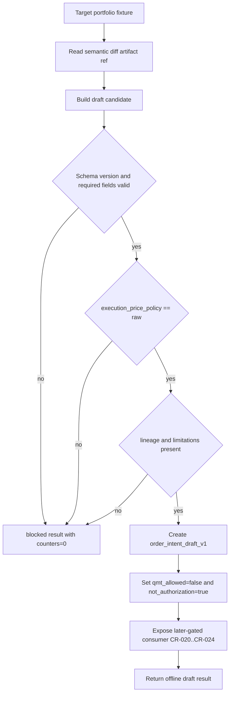

# LLD: CR025-S03 - order_intent_draft_v1 与 QMT 后续边界

本文档冻结 `order_intent_draft_v1` 的离线草案合同、失败路径、lineage、limitations 与 QMT later-gated 消费边界。CR025 全量 CP5 已人工确认通过；后续实现仅限受控离线 / fixture / 静态合同范围，不授权依赖变更、Backtrader 运行、QMT / MiniQMT / XtQuant 调用、broker lake 写入、服务启动或凭据读取。

## 1. Goal

创建 `engine/order_intent_draft.py` 的离线合同设计与 `tests/test_cr025_order_intent_draft_contract.py` 的 fixture-only 验证设计，把 target portfolio、semantic diff evidence、lineage、limitations 和 raw execution policy 转为 `order_intent_draft_v1` 草案。完成后，CR-020..CR-024 只能 later-gated 消费该 draft；draft 不是订单，不代表 QMT adapter 可提交，不触发任何真实 QMT 操作。

## 2. Requirements（Functional / Non-Functional）

### 2.1 Functional

- `order_intent_draft_v1` 必填字段覆盖率必须为 100%。
- `schema_version` 固定为 `order_intent_draft_v1`；未知版本必须 blocked。
- draft identity 必须包含 `draft_id`、`source_run_id`、`created_at`，且不得包含凭据、账户号、session 或真实私有路径。
- source 字段必须引用 target portfolio id、semantic diff artifact id、lineage 和 limitations。
- order intent 字段必须覆盖 `symbol`、`side`、`target_qty` / `target_weight`、`estimated_price_policy`、`execution_price_policy` 和 `reason`。
- `execution_price_policy != raw` 必须 hard block，不能进入 QMT handoff。
- `data_lineage_ref` 或 `limitations` 缺失时必须 fail closed，不生成 handoff。
- gates 字段必须包含 `raw_execution_policy_status`、`pretrade_required`、`qmt_allowed=false`、`blocked_reasons[]`。
- handoff 字段必须包含 `consumer=CR-020..CR-024 later-gated` 与 `not_authorization=true`。
- QMT API、MiniQMT、XtQuant、order submit、order cancel、account query、broker lake write、service start 计数均为 0。

### 2.2 Non-Functional

- 安全：draft 永远标记为 `not_authorization=true`，且默认 `qmt_allowed=false`。
- 可测试：所有校验使用本地 fixture；不得连接 QMT、启动 gateway、读取凭据或写 broker lake。
- 可维护：draft schema 与 HLD §34.7、HLD-QMT §18、ADR-077 保持字段级对应。
- 可审计：每个 draft 必须保留 source run、semantic diff artifact、lineage、limitations、blocked reason。
- 边界：本 Story 不修改 `trading/oms.py` 或 `trading/pretrade_risk.py`；二者仅作为后续 consumer 合同的只读输入。

## 3. 模块拆分与职责

| 模块 / 文件组 | 职责 | 说明 |
|---|---|---|
| `engine/order_intent_draft.py` | 定义 draft 数据模型、校验器、blocked result、QMT handoff 边界字段 | 当前 Story primary；仅离线合同，不导入 QMT |
| `tests/test_cr025_order_intent_draft_contract.py` | 验证字段覆盖、raw policy hard block、缺 lineage / limitations fail closed、真实操作计数为 0 | 当前 Story primary test；fixture-only |
| `trading/oms.py` | 后续 OMS 可只读消费 draft 字段 | shared；本 Story 不修改，CR-020..CR-024 另行授权后再消费 |
| `trading/pretrade_risk.py` | 后续 risk 可使用 raw execution policy 与 limitations 做 hard block | shared；本 Story不修改真实交易流程 |
| `process/stories/CR025-S02-semantic-diff-schema-artifact.md` | 提供 semantic diff artifact id 与 limitations 来源合同 | 同批次待统一确认输入；开发前需 CP5 全量确认 |
| `process/HLD-QMT-TRADING.md#18` | 定义 QMT route 对 draft 的消费失败路径 | 明确 CR-025 不启动 gateway 或真实操作 |

## 4. 代码结构与文件影响范围

| 动作 | 文件路径 | 变更内容 |
|---|---|---|
| 创建 | `engine/order_intent_draft.py` | 定义 `OrderIntentDraftV1`、`OrderIntentDraftResult`、blocked reason、schema validator、counter contract 和 draft builder |
| 创建 | `tests/test_cr025_order_intent_draft_contract.py` | 设计完整 schema、非 raw policy hard block、缺 lineage / limitations fail closed、QMT forbidden counter 为 0 的测试 |
| 不修改 | `trading/oms.py` | 作为只读消费合同引用；本 Story 不改 OMS 状态机或真实交易行为 |
| 不修改 | `trading/pretrade_risk.py` | 作为只读 raw execution policy gate 引用；本 Story 不改 pre-trade risk |

## 5. 数据模型与持久化设计

本 Story 无新增持久化写入。`order_intent_draft_v1` 是内存对象 / 可序列化 artifact 合同；是否落盘由后续 Story 或文档路线另行确认，当前不写 broker lake、不写真实 lake、不 publish。

| 对象 / 字段 | 类型 | 约束 | 说明 |
|---|---|---|---|
| `schema_version` | str | 必填；固定 `order_intent_draft_v1` | 未知版本 blocked |
| `draft_id` | str | 必填；稳定、可追溯、不得含凭据 | draft identity |
| `source_run_id` | str | 必填 | 指向 research / semantic diff run |
| `created_at` | str / datetime | 必填；ISO-8601 | 生成时间 |
| `target_portfolio_id` | str | 必填 | target portfolio 来源 |
| `semantic_diff_artifact_id` | str | 必填 | 引用 S02 semantic diff artifact |
| `data_lineage_ref` | str / mapping | 必填 | release / source run / quality evidence；缺失 blocked |
| `limitations` | list[str] | 必填；可为空但字段不可缺失 | unavailable、blocked claims、proxy / degradation 原因 |
| `symbol` | str | 必填 | 证券代码；后续 risk 校验 |
| `side` | str | 条件必填；`buy|sell|hold|rebalance` | 若由 target 推导，推导规则必须可审计 |
| `target_qty` | int / decimal / null | 与 `target_weight` 至少一个存在 | 数量转换由后续 OMS / risk 处理 |
| `target_weight` | decimal / null | 与 `target_qty` 至少一个存在 | 目标权重 |
| `estimated_price_policy` | str | 必填 | 研究估算价口径；不可作为 broker 执行价 |
| `execution_price_policy` | str | 必填；必须为 `raw` 或后续批准的 raw / broker reference | 非 raw hard block |
| `research_adjustment_policy` | str | 必填 | 只作为 metadata，不作为执行价 |
| `cost_config_ref` | str | 必填 | 手续费、税费、滑点配置引用 |
| `reason` | str | 必填 | 生成 intent 的研究原因 |
| `raw_execution_policy_status` | str | 必填；`pass|blocked` | 非 pass 时不进入 handoff |
| `pretrade_required` | bool | 必填；默认 true | 后续 OMS / risk 必须重新校验 |
| `qmt_allowed` | bool | 必填；固定 false | CR-025 不授权 QMT |
| `blocked_reasons` | list[str] | 必填 | fail closed 证据 |
| `consumer` | str | 必填；`CR-020..CR-024 later-gated` | 后续路线引用 |
| `not_authorization` | bool | 必填；固定 true | 防止 draft 被误用为订单授权 |
| `operation_counters` | mapping | 必填 | QMT / broker / service start 等计数均为 0 |

## 6. API / Interface 设计

| 接口 / 入口 | 输入 | 输出 | 调用方 | 说明 |
|---|---|---|---|---|
| `build_order_intent_draft(target_portfolio, semantic_diff, policy_context)` | target portfolio fixture、semantic diff artifact ref、policy context | `OrderIntentDraftResult` | research output / tests | 测试 T-S03-01 / T-S03-02 覆盖 |
| `validate_order_intent_draft(payload)` | mapping / dataclass | `OrderIntentDraftValidation` | tests、后续 docs / consumer | 字段覆盖与版本校验；T-S03-03 覆盖 |
| `block_order_intent(reason, source_ref, counters)` | blocked reason、source ref、counter mapping | `OrderIntentDraftResult(status="blocked")` | validator、tests | fail closed；T-S03-04 覆盖 |
| `to_later_gated_handoff(draft)` | valid draft | mapping with `consumer` / `not_authorization` | docs、CR-020 后续路线 | 只生成离线 handoff，不启动服务；T-S03-05 覆盖 |
| `assert_no_qmt_side_effects(result)` | draft result | counters audit | tests | QMT / order / cancel / account / broker lake / service 计数为 0；T-S03-06 覆盖 |

错误暴露使用稳定 blocked reason：`unknown_schema_version`、`missing_source_run_id`、`missing_semantic_diff_artifact`、`missing_target_portfolio`、`missing_target_quantity_or_weight`、`missing_lineage`、`missing_limitations`、`non_raw_execution_price_policy`、`qmt_not_authorized`、`broker_lake_write_forbidden`、`service_start_forbidden`、`credential_read_forbidden`。

## 7. 核心处理流程



1. 调用方传入 target portfolio、semantic diff artifact ref 和 policy context。
2. builder 生成 draft candidate，先检查 `schema_version`、identity、source、target 字段。
3. `execution_price_policy` 不是 `raw` 时立即 hard block。
4. `data_lineage_ref` 或 `limitations` 缺失时 fail closed。
5. valid draft 必须写入 `qmt_allowed=false` 与 `not_authorization=true`。
6. result 返回离线 draft / blocked result；不会导入 `xtquant`、不会调用 QMT、不会启动 gateway、不会写 broker lake。

## 8. 技术设计细节

- 关键规则：`target_qty` 与 `target_weight` 至少存在一个；若二者都存在，后续 OMS/risk 再处理冲突，本 Story 只保留可审计字段。
- 关键规则：`research_adjustment_policy` 只作为 metadata；`execution_price_policy` 必须为 raw，qfq / hfq / returns_adjusted 不能作为执行价进入 draft handoff。
- lineage：`data_lineage_ref` 至少能引用 release/source run/quality evidence 中的一类稳定标识；真实私有路径、凭据和账户号不得进入 lineage。
- limitations：必须显式携带 unavailable、blocked claims、proxy / degradation 原因；空列表表示已显式确认无 limitation，不等于字段缺失。
- QMT 边界：draft consumer 固定为 `CR-020..CR-024 later-gated`，并在 result 中暴露 `not_authorization=true`；任何 `qmt_allowed=true` 输入都被重写为 blocked。
- 依赖选择与复用点：复用 S02 semantic diff artifact 合同、CR015 OMS / shadow intent 只读术语、CR017 raw execution policy gate，不导入或修改 `trading/**`。
- 兼容性处理：后续 CR-020 可把 draft 作为输入候选，但必须重新执行 OMS、risk、stage gate 和 per-run authorization；CR-025 CP5 不传递授权。
- 图示类型选择：本 Story 跨 semantic diff、draft builder、policy gate、QMT route consumer 4 个边界，已在第 7 节提供流程图。

## 9. 安全与性能设计

| 维度 | 设计措施 | 验证方式 |
|---|---|---|
| 安全 | `qmt_allowed=false`、`not_authorization=true` 固定写入；禁止 QMT / MiniQMT / XtQuant import / call | T-S03-05 / T-S03-06 |
| 安全 | 非 raw execution policy hard block；lineage / limitations 缺失 fail closed | T-S03-02 / T-S03-04 |
| 安全 | operation counters 覆盖 QMT API、order、cancel、account query、broker lake write、service start 且均为 0 | T-S03-06 |
| 合规 | draft 不复制 Backtrader 源码、不引用 GPLv3 实现片段 | S05 forbidden source-copy scan |
| 性能 | schema validation 为字段级 O(n) 检查；不启动外部服务，不访问网络 | T-S03-01 / fixture-only test |
| 可维护 | 数据模型、blocked reason、handoff 字段集中定义，避免 docs / tests 重复发散 | T-S03-03 |

## 10. 测试设计

| 测试场景 | 前置条件 | 操作 | 预期结果 | 验证方式 |
|---|---|---|---|---|
| T-S03-01 完整 semantic diff + target portfolio 生成 draft | target portfolio 和 semantic diff fixture 完整 | 调用 `build_order_intent_draft()` | 返回 `schema_version=order_intent_draft_v1`，`qmt_allowed=false` | pytest fixture |
| T-S03-02 非 raw execution policy hard block | fixture 中 `execution_price_policy=qfq` | 调用 builder | status blocked，reason=`non_raw_execution_price_policy` | pytest fixture |
| T-S03-03 必填字段覆盖率 100% | valid draft | 调用 `validate_order_intent_draft()` | identity/source/order/gates/handoff 字段全存在 | pytest fixture |
| T-S03-04 缺 lineage / limitations fail closed | 删除 `data_lineage_ref` 或 `limitations` | 调用 validator | blocked，不生成 handoff | pytest fixture |
| T-S03-05 CR-020..CR-024 later-gated handoff | valid draft | 调用 `to_later_gated_handoff()` | `consumer=CR-020..CR-024 later-gated`，`not_authorization=true` | pytest fixture |
| T-S03-06 QMT / broker / service forbidden counters | valid 与 blocked result | 检查 counters | QMT API、order、cancel、account query、broker lake write、service start 均为 0 | pytest fixture / static counter |
| T-S03-07 不导入真实 QMT provider | repo static scan | 扫描目标模块 | 无 `xtquant` / QMT / MiniQMT import | static pytest |
| T-S03-08 draft 不包含凭据或账户号 | draft fixture | 扫描 payload keys / values | 无 token、secret、session、password、account id 字段 | static pytest |

## 11. 实施步骤

| TASK-ID | 动作 | 目标文件 | 详细描述 | 对应测试 |
|---|---|---|---|---|
| CR025-S03-T1 | 创建 | `engine/order_intent_draft.py` | 定义 `OrderIntentDraftV1`、result、blocked reason、operation counter 和 schema validator | T-S03-01 至 T-S03-04 |
| CR025-S03-T2 | 创建 | `engine/order_intent_draft.py` | 实现 `build_order_intent_draft()`、`block_order_intent()`、`to_later_gated_handoff()` 的离线合同逻辑 | T-S03-01 / T-S03-02 / T-S03-05 / T-S03-06 |
| CR025-S03-T3 | 创建 | `tests/test_cr025_order_intent_draft_contract.py` | 覆盖字段完整性、raw policy hard block、lineage / limitations fail closed、forbidden counters、凭据字段扫描 | T-S03-01 至 T-S03-08 |
| CR025-S03-T4 | 不修改 | `trading/oms.py`、`trading/pretrade_risk.py` | 仅在 LLD / docs 中声明只读消费边界；实现阶段不得修改真实交易流程，除非 meta-po 后续单独串行调度 | T-S03-05 / T-S03-06 |

## 12. 风险、难点与预研建议

### 12.1 实现灰区与取舍记录

| Clarification ID | 问题 | 选项与推荐 | 决策 / 答案 | 影响面 | 证据 | 重访条件 |
|---|---|---|---|---|---|---|
| 无 | 本 Story 未发现阻断 LLD 的实现灰区；draft 字段和 QMT 边界已由 CP3 / HLD / ADR 冻结 | 推荐按 `order_intent_draft_v1` 字段和 CR-020..CR-024 later-gated 边界执行；备选“只输出 diff 不输出 draft”已在 ADR-077 中列为不推荐 | 非阻断；不写入 `STATE.md` clarification queue | 接口 / 安全 / 测试 / 跨 Story 契约 | HLD §34.7、HLD-QMT §18、ADR-077、Story 卡片 | 若用户要求 CR-025 直接调用 QMT validate/dry-run，必须另起 CR 或回退 CP3/CP5 |

| 风险 / 难点 | 影响 | 缓解措施 / 预研建议 |
|---|---|---|
| draft 被误用为真实订单 | 可能绕过 QMT OMS / risk / stage gate | 固定 `qmt_allowed=false`、`not_authorization=true`，测试扫描 `order submit` / `account query` 计数 |
| 非 raw 执行价进入 handoff | qfq/hfq 被误作 broker 执行价 | `execution_price_policy != raw` hard block |
| lineage 或 limitations 缺失 | 后续 OMS 无法追溯研究事实源 | 缺字段 fail closed，不生成 handoff |
| S02 semantic diff LLD 尚未在本线程落盘 | S03 不能单独进入实现 | 在 CP5 自动预检中标记为同批次待统一确认输入；开发前必须等待全量 CP5 |

### OPEN / Spike 跟踪

| ID | 类型（OPEN / Spike） | 问题 | 下一动作 | 责任方 |
|---|---|---|---|---|
| 无 | N/A | 无阻断 OPEN / Spike；S02 / S01 / S04 的同批次 LLD 与 CP5 仍需由 meta-po 收齐后统一确认 | 等待 CR025 全量 CP5 人工确认 | meta-po / user |

## 13. 回滚与发布策略

- 发布方式：仅在 CR025-S01..S06 全量 LLD、CP5 自动预检和 CP5 人工确认通过后，按 Wave 与 dev_gate 调度离线实现；本 LLD 不直接发布或运行。
- 回滚触发条件：draft 被写成订单、`qmt_allowed=true`、`execution_price_policy` 允许 qfq/hfq、lineage / limitations 可缺省、出现 QMT / MiniQMT / XtQuant import / call、broker lake write 或 service start。
- 回滚动作：回退 `engine/order_intent_draft.py` 和 `tests/test_cr025_order_intent_draft_contract.py` 的实现修改；Story 回到 LLD 修订态，由 meta-po 重新纳入 CP5 批次。
- 禁止回滚方式：不得通过删除 HLD / ADR / Story 基线来规避 QMT 边界；如需扩大 CR-025 到 QMT validate/dry-run，必须另起 CR。

## 14. Definition of Done

- [ ] 14 个章节全部填写完成。
- [ ] `order_intent_draft_v1` 必填字段覆盖率为 100%。
- [ ] `execution_price_policy != raw` hard block 覆盖率为 100%。
- [ ] lineage 与 limitations 缺失时 fail closed。
- [ ] draft result 固定 `qmt_allowed=false` 与 `not_authorization=true`。
- [ ] CR-020..CR-024 不继承 CR-025 授权声明可验证。
- [ ] QMT API、MiniQMT、XtQuant、order submit、order cancel、account query、broker lake write、service start 计数均为 0。
- [ ] `confirmed=false`、全量 CP5 未 approved 和 dev_gate 未满足前不进入实现。
- [ ] OPEN / Spike 已清点为无阻断项。

## 人工确认区

> **CP5 - Story LLD 可实现性门**
> meta-dev 先写入 `process/checks/CP5-CR025-S03-order-intent-draft-qmt-boundary-LLD-IMPLEMENTABILITY.md` 自动预检结果。
> meta-po 收齐 CR025-S01..S06 全部 LLD、CP4 自动预检摘要和 CP5 自动预检后，再生成并提示用户审查 `checkpoints/CP5-CR025-RESEARCH-EXECUTION-SEMANTIC-ALIGNMENT-BATCH-A-LLD-BATCH.md`。
> 用户统一确认全部目标 Story 的 LLD 后，仍需满足 Wave、依赖门控、文件所有权门控和 no-real-operation 边界方可进入实现。

**CP5 checklist 摘要**：

| # | 检查项 | 状态 | 证据 |
|---|---|---|---|
| 1 | LLD 覆盖 AC | 待检查 | 第 2 / 10 / 14 节 |
| 2 | 与 HLD / ADR 一致 | 待检查 | 第 3 / 8 / 12 节 |
| 3 | 文件影响范围明确 | 待检查 | 第 4 / 11 节 |
| 4 | 接口契约完整 | 待检查 | 第 5 / 6 节 |
| 5 | 测试与 dev_gate 可计算 | 待检查 | 第 10 / 14 节 |
| 6 | clarification queue 已收敛 | 待检查 | 第 12.1 节 |

**人工确认回复**：

请直接回复以下任一整行：

```text
approve
修改: <具体修改点>
reject
```

**人工审查结果回填**：

- 结论：`approved | changes_requested | rejected`
- 审查人：
- 审查时间：
- 修改意见：
- 风险接受项：
