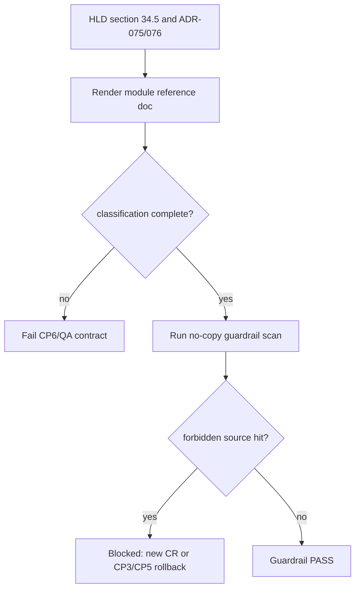

# LLD: CR025-S04-backtrader-module-reference-no-copy-guardrail - Backtrader 模块 reference / no-copy guardrail

> 本 LLD 把 HLD §34.5 与 ADR-075 / ADR-076 / ADR-078 的模块分类、GPLv3 no-copy 治理和多因子研究边界落为可实现合同。它不读取、复制、裁剪、改写或源码级移植 `/home/hyde/download/backtrader/**`，也不运行 Backtrader；Backtrader 仅作为 lightweight execution engine 的 feed / broker / order / position / commission / slippage / analyzer 等执行语义参考。

## 1. Goal

创建 Backtrader module reference 文档和 no-copy guardrail 测试设计，冻结 `reference_only`、`adapt_interface`、`migration_candidate=[]`、`exclude` 四类边界，确保任何源码级移植例外必须另起 CR 或回退 CP3/CP5 重新确认。按 ADR-078，模块矩阵只用于执行语义参考与 no-copy 治理，不作为多因子研究框架评估、迁移依据或 FactorSpec / IC / RankIC 能力来源。

## 2. Requirements（Functional / Non-Functional）

### 2.1 Functional

- 输出 `docs/CR025-BACKTRADER-MODULE-REFERENCE.md`，记录模块分类、可借鉴行为、不可复制边界、license 风险和后续切换条件。
- 输出 `tests/test_cr025_backtrader_no_copy_guardrail.py`，验证 forbidden source-copy / migration scan、`migration_candidate=[]` 和 live store / line runtime 排除。
- 固定 `migration_candidate` 当前为空；任何候选必须另起 CR / legal review / CP3 决策 / CP5 授权。
- 禁止复制、裁剪、改写或源码级移植 Backtrader GPLv3 源码、samples、tests、datas、live store、line/metaclass runtime。
- 只允许 clean-room interface adaptation：clean feed、semantic diff、commission/sizer/fill assumption、target order 概念可在本项目自有接口中重新定义。
- 模块矩阵只覆盖 execution semantic reference：feed、broker、order、trade、position、commission、sizer、slippage/filler、analyzer、observer、writer 和 strategy lifecycle 术语；不评估或迁移 Backtrader indicators / Strategy / analyzer 体系为多因子研究主框架。
- 文档必须声明 FactorSpec、FactorRunSpec、IC / RankIC、分层收益、多因子组合、实验追踪、策略准入包、Qlib / Alphalens / vnpy.alpha 集成均不属于 CR-025。

### 2.2 Non-Functional

- 合规性：GPLv3 源码复制 / 源码级移植项为 0。
- 可审计：模块分类必须可追溯到 HLD §34.5 与 ADR-075 / ADR-076 / ADR-078。
- 可测试：guardrail 使用仓库静态扫描和文档合同测试；不读取 Backtrader 源码内容。
- 安全性：真实 broker、QMT、provider、lake、publish、simulation / live、credential 操作计数均为 0。

## 3. 模块拆分与职责

| 模块 / 文件组 | 职责 | 说明 |
|---|---|---|
| `docs/CR025-BACKTRADER-MODULE-REFERENCE.md` | 记录 Backtrader 模块分类矩阵、reference/adapt/exclude 边界、no-copy 规则和例外流程 | 后续实现只引用 HLD 摘要，不复制 Backtrader 源码。 |
| `tests/test_cr025_backtrader_no_copy_guardrail.py` | 静态验证 forbidden paths、`migration_candidate=[]`、exclude 分类和 no-source-migration 声明 | 不运行 Backtrader，不读取凭据。 |
| `process/HLD.md` | shared 只读输入 | Story 执行中不得修改 HLD；本轮也不修改。 |
| `process/ARCHITECTURE-DECISION.md` | ADR-075 / ADR-076 / ADR-078 只读输入 | 作为 CP5 证据，不在本 Story 修改。 |

## 4. 代码结构与文件影响范围

| 动作 | 文件路径 | 变更内容 |
|---|---|---|
| 创建 | `docs/CR025-BACKTRADER-MODULE-REFERENCE.md` | 后续实现写入模块分类、license 风险、no-copy guardrail、例外需另起 CR / CP3 / CP5 的流程。 |
| 创建 | `tests/test_cr025_backtrader_no_copy_guardrail.py` | 后续实现添加静态扫描和文档合同测试，覆盖源码、samples、tests、datas、live store、line/metaclass runtime。 |
| 不修改 | `process/HLD.md` | 只读引用 §34.5 / §34.14；Story 执行不得 mutation。 |
| 禁止 | `/home/hyde/download/backtrader/**`、`backtrader/**` vendored source、Backtrader samples/tests/datas、live store、line/metaclass runtime | 不复制、不裁剪、不改写、不源码级移植。 |

## 5. 数据模型与持久化设计

无新增运行时持久化。后续仅创建文档和静态测试。

| 对象 / 字段 | 类型 | 约束 | 说明 |
|---|---|---|---|
| `ModuleReferenceEntry.module` | string | 来自 HLD §34.5 的模块族名称，不从源码复制内容 | 例如 feed、broker/order、position、commission/sizer/slippage、analyzer、observer、store。 |
| `ModuleReferenceEntry.category` | enum | `reference_only`、`adapt_interface`、`migration_candidate`、`exclude` | `migration_candidate` 初始为空。 |
| `ModuleReferenceEntry.execution_semantic_scope` | list[string] | 只允许 feed / broker / order / position / commission / slippage / analyzer 等执行层语义 | 不包含因子定义、因子评价、组合构建或实验追踪。 |
| `ModuleReferenceEntry.allowed_use` | string/list | 只描述行为参考或 clean-room interface adaptation | 不包含源码片段。 |
| `ModuleReferenceEntry.forbidden_use` | string/list | 源码复制、samples/tests/datas 复制、live store、line runtime 等 | 测试覆盖。 |
| `NoCopyGuardrailResult.migration_candidate` | list | 必须为 `[]` | 任一非空需 fail 并回退 CR。 |
| `NoCopyGuardrailResult.forbidden_hits` | list | 必须为空 | 命中 vendored source / copied fixture 时 fail。 |

## 6. API / Interface 设计

| 接口 / 入口 | 输入 | 输出 | 调用方 | 说明 |
|---|---|---|---|---|
| `docs/CR025-BACKTRADER-MODULE-REFERENCE.md` 文档合同 | HLD §34.5 module matrix、ADR-075、ADR-076、ADR-078 | 模块分类、execution semantic scope、allowed / forbidden use、例外流程 | meta-dev / meta-qa / 后续 CR | 测试：文档包含四类分类、`migration_candidate=[]` 和多因子研究排除边界。 |
| `scan_no_copy_guardrail(project_root)` | 仓库根目录 | `NoCopyGuardrailResult` | `tests/test_cr025_backtrader_no_copy_guardrail.py` | 测试：仓库不出现 vendored Backtrader source / samples / tests / datas。 |
| `validate_module_classification(doc)` | 文档内容 | validation result | tests / QA | 测试：live store、line/metaclass runtime、indicator migration、samples/tests/datas 均在 exclude 或 forbidden；feed / broker / order / position / commission / slippage / analyzer 等仅为执行语义参考。 |
| `validate_multifactor_boundary(doc)` | 文档内容 | validation result | tests / QA | 测试：FactorSpec、FactorRunSpec、IC / RankIC、分层收益、多因子组合、实验追踪、策略准入包和 Qlib / Alphalens / vnpy.alpha 集成均被标为后续 CR / not in CR-025。 |
| `validate_migration_exception_policy(doc)` | 文档内容 | validation result | tests / QA | 测试：源码级移植例外必须要求另起 CR 或回退 CP3/CP5。 |

## 7. 核心处理流程

1. 从 HLD §34.5 / §34.14 与 ADR-075 / ADR-076 / ADR-078 读取模块分类输入；不读取 Backtrader 源码树。
2. 渲染文档分类：`reference_only`、`adapt_interface`、`migration_candidate=[]`、`exclude`。
3. 明确 allowed use 只包含 feed / broker / order / position / commission / slippage / analyzer 等执行语义 reference 与 clean-room interface adaptation；forbidden use 覆盖源码、samples、tests、datas、live store、line/metaclass runtime。
4. 渲染多因子研究边界：Backtrader 模块矩阵不是多因子研究框架评估或迁移依据；FactorSpec、IC / RankIC、分层收益、多因子组合、实验追踪和策略准入包均为后续 CR。
5. 测试扫描仓库文件和文档内容；发现 vendored source、复制 fixture、migration_candidate 非空、例外流程缺失或 Backtrader 被声明为多因子研究主框架即 fail。
6. 任一源码级移植或多因子研究框架实现需求出现时停止当前 Story，交回 meta-po 发起 CR 或回退 CP3/CP5。



## 8. 技术设计细节

- 关键算法 / 规则：文档合同以 exact 分类验证；`migration_candidate` 必须为 `[]`；forbidden path 命中即 fail。
- 扫描范围：仓库内 `backtrader/**` vendored source、Backtrader samples/tests/datas 复制痕迹、live store wrapper、line/metaclass runtime migration 关键声明；不扫描或读取 `/home/hyde/download/backtrader/**` 内容。
- 依赖选择与复用点：仅复用 HLD / ADR 已记录的模块矩阵、license 事实和 ADR-078 研究边界；不引入新依赖，不接入 Qlib / Alphalens / vnpy.alpha。
- 兼容性处理：后续若用户批准 optional dependency runtime，仍不把源码纳入仓库；需另行 CP5 / CR 说明 package / license 策略。
- 错误暴露：测试失败输出 forbidden category 和路径 / 文档段落；不输出外部源码内容。
- 图示类型选择：本 LLD 使用流程图，因为文档渲染、分类检查、扫描和阻断路径需要清晰表达。

## 9. 安全与性能设计

| 维度 | 设计措施 | 验证方式 |
|---|---|---|
| 合规 | GPLv3 源码 no-copy；源码级移植例外需新 CR / CP3 / CP5 / 合规确认 | no-copy guardrail test。 |
| 安全 | live broker/store、真实 broker、QMT、provider、lake、publish、simulation/live、credential 均不触发 | forbidden operation counter test。 |
| 范围 | Backtrader 模块矩阵只用于执行语义参考，不承接多因子研究框架能力 | multifactor boundary doc test。 |
| 性能 | 只做仓库静态扫描和文档 contract 检查 | pytest fixture，不运行外部工具。 |
| 可维护 | 模块分类从 HLD / ADR 派生，避免重复读取 Backtrader 源码树 | 文档 traceability test。 |

## 10. 测试设计

| 测试场景 | 前置条件 | 操作 | 预期结果 | 验证方式 |
|---|---|---|---|---|
| `migration_candidate=[]` | 文档存在 | 解析分类段落 | migration candidate 为空 | doc contract test。 |
| forbidden path 覆盖 6 类 | 文档存在 | 检查 forbidden 列表 | 覆盖源码、samples、tests、datas、live store、line/metaclass runtime | doc contract test。 |
| vendored source 不存在 | 仓库根目录 | 运行 guardrail scan | 不出现 Backtrader vendored source | static path scan。 |
| live store / line runtime 排除 | 文档存在 | 检查分类 | live store 与 line/metaclass runtime 均为 exclude/forbidden | classification test。 |
| execution semantic scope | 文档存在 | 检查 allowed use | feed / broker / order / position / commission / slippage / analyzer 等只作为执行语义参考，不作为研究框架迁移依据 | doc contract test。 |
| 多因子研究边界 | 文档存在 | 检查 forbidden / follow-up 边界 | FactorSpec、FactorRunSpec、IC / RankIC、分层收益、多因子组合、实验追踪、策略准入包均不进入 CR-025 | multifactor boundary test。 |
| 例外流程 | 文档存在 | 检查 migration exception policy | 源码级移植必须另起 CR 或回退 CP3/CP5 | policy test。 |
| 禁止真实操作 | fixture-only 环境 | 运行 S04 tests | Backtrader run、provider fetch、lake write、credential read、QMT 调用均为 0 | counter assertion。 |

## 11. 实施步骤

> 以下步骤仅在全量 CP5 人工确认通过、Story dev_gate 满足后执行；本 LLD 本身不实现。

| TASK-ID | 动作 | 目标文件 | 详细描述 | 对应测试 |
|---|---|---|---|---|
| CR025-S04-T1 | 创建 | `docs/CR025-BACKTRADER-MODULE-REFERENCE.md` | 写入 module classification：reference_only、adapt_interface、migration_candidate=[]、exclude；标注 feed / broker / order / position / commission / slippage / analyzer 等仅作为执行语义参考。 | classification / execution semantic doc test。 |
| CR025-S04-T2 | 创建 | `docs/CR025-BACKTRADER-MODULE-REFERENCE.md` | 写入 no-copy、GPLv3 风险、allowed/forbidden use、例外需新 CR / CP3 / CP5。 | migration exception policy test。 |
| CR025-S04-T3 | 创建 | `tests/test_cr025_backtrader_no_copy_guardrail.py` | 实现静态扫描，验证 forbidden source-copy / migration categories、operation counters 和多因子研究边界声明。 | no-copy / multifactor boundary guardrail tests。 |
| CR025-S04-T4 | 约束 | Backtrader reference | 不读取 / 复制 `/home/hyde/download/backtrader/**`，不运行 Backtrader，不创建 vendored source，不把 Backtrader 写成多因子研究主框架。 | forbidden path / counter / scope tests。 |

## 12. 风险、难点与预研建议

### 12.1 实现灰区与取舍记录

| Clarification ID | 问题 | 选项与推荐 | 决策 / 答案 | 影响面 | 证据 | 重访条件 |
|---|---|---|---|---|---|---|
| N/A-CR025-S04 | 本 Story 是否需要新增 LLD clarification item | 推荐：不新增。HLD §34.5 与 ADR-075 / ADR-076 / ADR-078 已冻结模块分类、`migration_candidate=[]`、no-copy 默认和多因子研究排除边界。 | 已按 CP3 approved、CP4 PASS 和 2026-06-02 ADR-078 定位澄清作为输入；未回答阻断问题为 0。 | 文件 owner / 测试 / 安全 / 合规 / 跨 Story 契约 / CP5 Decision Brief | `process/HLD.md` §34.5、§34.14；`process/ARCHITECTURE-DECISION.md` ADR-075 / ADR-076 / ADR-078；CP4 PASS。 | 若用户要求源码级移植、fork 或 vendor 子集，另起 CR 或回退 CP3/CP5；若要求多因子研究框架能力，启动后续多因子研究 CR。 |

| 风险 / 难点 | 影响 | 缓解措施 / 预研建议 |
|---|---|---|
| “参考”被误写成复制实现 | GPLv3 / 维护风险 | 文档 allowed/forbidden use 分离；测试扫描 source-copy。 |
| `migration_candidate` 被悄悄加入 | 扩大 Story 范围 | 测试要求当前为空；非空必须 fail。 |
| samples/tests/datas 被作为 fixture 复制 | 许可证和数据来源风险 | 后续测试自建 fixture，不使用 Backtrader 测试数据。 |
| live store wrapper 被包装进项目 | 真实 broker 风险 | live store 分类为 exclude；真实接入另起 CR。 |
| Backtrader 模块矩阵被误读为多因子研究框架评估 | CR-025 范围膨胀，后续 Qlib / Alphalens / vnpy.alpha 路线被混淆 | ADR-078 固定本矩阵只服务执行语义参考；多因子研究闭环另起 CR。 |

### OPEN / Spike 跟踪

| ID | 类型（OPEN / Spike） | 问题 | 下一动作 | 责任方 |
|---|---|---|---|---|
| N/A | OPEN | 无阻断 OPEN；无 Spike。 | CP5 批次人工确认后再进入实现调度。 | meta-po |

## 13. 回滚与发布策略

- 发布方式：CP5 approved 后作为文档 / 静态 guardrail 增量进入 Story execution；不新增依赖、不运行 Backtrader。
- 回滚触发条件：文档出现源码级移植默认推荐、`migration_candidate` 非空、Backtrader vendored source / samples / tests / datas 进入仓库、live store / line runtime 被适配，或 Backtrader 被声明为多因子研究主框架 / FactorSpec / IC / RankIC 能力来源。
- 回滚动作：回滚 `docs/CR025-BACKTRADER-MODULE-REFERENCE.md` 与 `tests/test_cr025_backtrader_no_copy_guardrail.py` 中本 Story 增量；保留 LLD / CP5 审计记录；源码级例外需求交回 meta-po。

## 14. Definition of Done

- [ ] 14 个章节全部填写完成。
- [ ] `migration_candidate` 当前为空。
- [ ] forbidden path 覆盖源码、samples、tests、datas、live store、line/metaclass runtime 共 6 类。
- [ ] Backtrader 模块矩阵仅用于 feed / broker / order / position / commission / slippage / analyzer 等执行语义参考，不作为多因子研究框架评估或迁移依据。
- [ ] Backtrader GPLv3 源码复制 / 裁剪 / 改写 / 源码级移植项为 0。
- [ ] Backtrader 承接 FactorSpec、FactorRunSpec、IC / RankIC、分层收益、多因子组合、实验追踪或策略准入包的次数为 0。
- [ ] Backtrader run、provider fetch、lake write、credential read、QMT 调用均为 0。
- [ ] 实现灰区与取舍记录已显式写“无阻断 clarification item”。
- [ ] `confirmed=false` 时不进入实现。
- [ ] OPEN / Spike 已清点为 0。

## 人工确认区

> **CP5 - Story LLD 可实现性门**
> meta-dev 已写入 `process/checks/CP5-CR025-S04-backtrader-module-reference-no-copy-guardrail-LLD-IMPLEMENTABILITY.md` 自动预检结果。meta-po 收齐 CR025 全量 LLD 与 CP5 自动预检后，统一发起 `checkpoints/CP5-CR025-RESEARCH-EXECUTION-SEMANTIC-ALIGNMENT-BATCH-A-LLD-BATCH.md` 人工确认。

**CP5 checklist 摘要**：

| # | 检查项 | 状态 | 证据 |
|---|---|---|---|
| 1 | LLD 覆盖 AC | 待人工确认 | 第 2 / 10 / 14 节 |
| 2 | 与 HLD / ADR 一致 | 待人工确认 | 第 3 / 8 / 12 节 |
| 3 | 文件影响范围明确 | 待人工确认 | 第 4 / 11 节 |
| 4 | 接口契约完整 | 待人工确认 | 第 6 节 |
| 5 | 测试与 dev_gate 可计算 | 待人工确认 | 第 10 / 14 节 |
| 6 | clarification queue 已收敛 | 待人工确认 | 第 12.1 节 |

**人工确认回复**：

```text
approve
修改: <具体修改点>
reject
```

**人工审查结果回填**：

- 结论：`approved | changes_requested | rejected`
- 审查人：
- 审查时间：
- 修改意见：
- 风险接受项：
