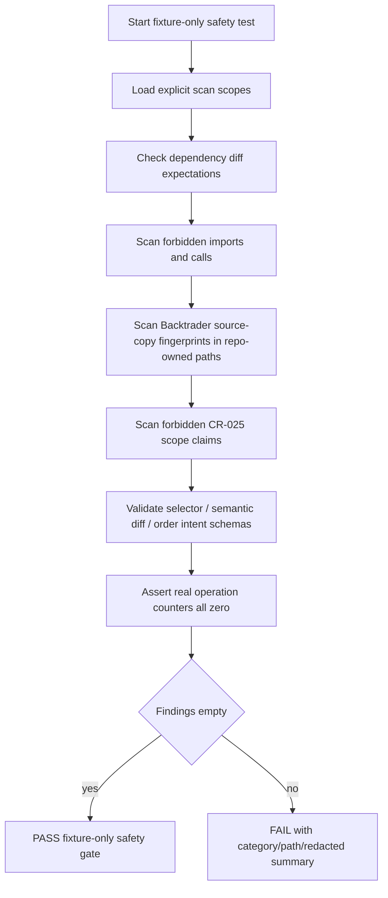

# LLD: CR025-S05 - no-real-operation safety 与验证策略

本文档冻结 CR-025 的 fixture-only 验证矩阵、安全扫描策略、schema contract 检查、forbidden-claim / scope scan 和真实操作计数口径。CR025 全量 CP5 已人工确认通过；后续验证与实现仅限 fixture-only / 静态扫描，不授权运行 Backtrader、读取凭据或触发真实 broker / QMT / provider / lake / publish / simulation / live。

## 1. Goal

创建 `tests/test_cr025_no_real_operation_safety.py`、`tests/test_cr025_forbidden_source_copy.py` 和 `tests/test_cr025_schema_contracts.py` 的验证设计，覆盖 forbidden import、forbidden source copy、forbidden claim / scope scan、dependency diff、schema contract、semantic diff contract、order intent draft contract 与真实操作计数。完成后，CR-025 的安全证明只能来自本地 fixture 和静态扫描，不依赖真实 Backtrader、QMT、provider、lake 或凭据环境，也不得声明已实现多因子研究主框架。

## 2. Requirements（Functional / Non-Functional）

### 2.1 Functional

- fixture-only 验证必须覆盖 TS-025-01 至 TS-025-11 共 11 个测试场景。
- real broker、QMT、MiniQMT、XtQuant、provider fetch、lake write、broker lake write、publish、simulation/live、credential read 计数均为 0。
- `pyproject.toml` / `uv.lock` 修改次数为 0；Backtrader 不作为默认依赖。
- Backtrader GPLv3 source copy、source migration、vendored source、samples、tests、datas、live store、line/metaclass runtime 命中为 0。
- 默认 Backtrader import count 为 0；未安装 Backtrader 必须是合法环境。
- schema contract 覆盖 selector / clean feed gate、semantic diff、`order_intent_draft_v1`、blocked reason 和 limitations。
- forbidden-claim / scope scan 必须验证 CR-025 文档、报告或 artifact 声称“已实现多因子研究主框架”、FactorSpec、FactorRunSpec、IC / RankIC、分层收益、多因子组合、实验追踪、策略准入包或 Qlib / Alphalens / vnpy.alpha 集成的匹配次数为 0。
- 测试不得要求真实 Backtrader 安装、真实 QMT 环境、真实 provider、真实 lake、真实交易账户或真实凭据。

### 2.2 Non-Functional

- 安全：所有测试必须 fail closed；发现真实操作路径、凭据读取、源码复制或 dependency diff 时失败。
- 可重复：测试只使用仓库内自建 fixture；不得读取 `/home/hyde/download/backtrader/**`、`.env`、真实数据湖、broker lake 或私有路径。
- 可维护：扫描目标和禁止项以显式列表表达，避免模糊匹配误放行。
- 可诊断：每个失败必须暴露命中类别、文件路径、匹配摘要和修复建议，不输出凭据原文。
- 边界：本 Story 只拥有测试文件；`engine/backtrader_adapter.py`、`engine/semantic_diff.py`、`engine/order_intent_draft.py` 作为只读合同验证目标。

## 3. 模块拆分与职责

| 模块 / 文件组 | 职责 | 说明 |
|---|---|---|
| `tests/test_cr025_no_real_operation_safety.py` | 验证真实操作计数、dependency diff、no credential read、forbidden import / call | 当前 Story primary |
| `tests/test_cr025_forbidden_source_copy.py` | 扫描 Backtrader source copy、vendoring、samples/tests/datas/live store/line runtime 迁移风险 | 当前 Story primary；不得读取 `/home/hyde/download/backtrader/**` |
| `tests/test_cr025_schema_contracts.py` | 验证 selector、semantic diff、`order_intent_draft_v1` schema、blocked reason 与 forbidden-claim / scope scan | 当前 Story primary |
| `engine/backtrader_adapter.py` | S01 后续实现输出，只读验证 clean feed / optional selector 合同 | shared；S05 不修改 |
| `engine/semantic_diff.py` | S02 后续实现输出，只读验证 semantic diff schema | shared；S05 不修改 |
| `engine/order_intent_draft.py` | S03 后续实现输出，只读验证 draft schema / QMT boundary | shared；S05 不修改 |
| CR025-S01..S04 LLD / Story | 提供安全输入合同 | 同批次待统一确认；开发前必须 CP5 全量确认 |

## 4. 代码结构与文件影响范围

| 动作 | 文件路径 | 变更内容 |
|---|---|---|
| 创建 | `tests/test_cr025_no_real_operation_safety.py` | 定义 no-real-operation counters、forbidden import / call、dependency diff、credential read 禁止测试 |
| 创建 | `tests/test_cr025_forbidden_source_copy.py` | 定义 Backtrader forbidden source-copy / migration scan；检查仓库目标路径不含 vendored GPLv3 源码、samples、tests、datas |
| 创建 | `tests/test_cr025_schema_contracts.py` | 定义 selector、semantic diff、`order_intent_draft_v1`、blocked reason、limitations schema 合同测试和 forbidden-claim / scope scan |
| 不修改 | `engine/backtrader_adapter.py` | 作为 S01 后续实现的只读验证目标 |
| 不修改 | `engine/semantic_diff.py` | 作为 S02 后续实现的只读验证目标 |
| 不修改 | `engine/order_intent_draft.py` | 作为 S03 后续实现的只读验证目标 |

## 5. 数据模型与持久化设计

本 Story 无新增持久化变更。测试 fixture、扫描规则和 counter expectation 均为测试代码内合同；不得写真实 lake、broker lake、reports/semantic_diff 真实输出、catalog current pointer 或 publish artifact。

| 对象 / 字段 | 类型 | 约束 | 说明 |
|---|---|---|---|
| `ForbiddenOperationCounter` | mapping[str, int] | 每个禁止操作类别必须存在且为 0 | broker、QMT、provider、lake、publish、simulation/live、credential |
| `DependencyDiffExpectation` | mapping[str, int] | `pyproject.toml`、`uv.lock` diff count 为 0 | CP5 前和默认路径不改依赖 |
| `ForbiddenImportRule` | dataclass / mapping | pattern、scope、expected_count=0、reason | 例如 `xtquant`、QMT、provider SDK、credential loader |
| `ForbiddenSourceCopyRule` | dataclass / mapping | source_family、forbidden_paths、expected_count=0 | Backtrader GPLv3 source / samples / tests / datas / live store / line runtime |
| `ForbiddenClaimRule` | dataclass / mapping | phrase / semantic pattern、scope、expected_count=0、reason | “已实现多因子研究主框架”、FactorSpec、IC / RankIC、strategy admission package 等 |
| `SchemaContractExpectation` | mapping | required fields、blocked reasons、limitations field | selector / semantic diff / order intent |
| `ScanFinding` | mapping | category、path、summary、severity | 不输出秘密值；只输出脱敏摘要 |

## 6. API / Interface 设计

| 接口 / 入口 | 输入 | 输出 | 调用方 | 说明 |
|---|---|---|---|---|
| `collect_forbidden_operation_counters(repo_root)` | repo root fixture | counter mapping | tests | T-S05-01 覆盖 |
| `assert_dependency_diff_clean(repo_root)` | repo root | pass / finding | tests | T-S05-02 覆盖 |
| `scan_forbidden_imports(paths, rules)` | path list、rules | findings | tests | T-S05-03 覆盖 |
| `scan_forbidden_source_copy(paths, rules)` | path list、rules | findings | tests | T-S05-04 覆盖 |
| `assert_schema_contracts(selector, diff, draft)` | fixture / module contracts | pass / finding | tests | T-S05-05 至 T-S05-07 覆盖 |
| `scan_forbidden_scope_claims(paths, rules)` | CR-025 docs / reports / artifact paths、rules | findings | tests | T-S05-12 覆盖 |
| `assert_no_credentials_accessed(scan_result)` | scan result | pass / finding | tests | T-S05-08 覆盖 |
| `assert_fixture_only_test_plan(test_files)` | test files | pass / finding | tests | T-S05-09 覆盖 |

错误暴露使用稳定 finding category：`forbidden_import`、`forbidden_call`、`forbidden_source_copy`、`forbidden_scope_claim`、`dependency_diff`、`credential_read_path`、`backtrader_run_required`、`qmt_environment_required`、`provider_fetch_required`、`lake_write_required`、`schema_contract_missing`、`missing_blocked_reason`、`missing_limitations`。

## 7. 核心处理流程



1. 测试入口加载显式扫描范围，默认包括 `engine/**`、`trading/**`、`tests/**`、`docs/**`、`README.md`、`pyproject.toml`、`uv.lock` 中与 CR-025 相关的路径。
2. dependency diff 检查确认 `pyproject.toml` / `uv.lock` 在 CR-025 默认路径中没有 Backtrader 依赖变更。
3. forbidden import / call 扫描查找 QMT / MiniQMT / XtQuant、provider fetch、lake write、broker lake write、publish、simulation/live、credential read 入口。
4. source-copy 扫描只检查仓库内目标路径，不读取或复制 `/home/hyde/download/backtrader/**`；发现 vendored GPLv3 source、samples、tests、datas、live store、line runtime 迁移迹象即失败。
5. forbidden-claim / scope scan 检查 CR-025 docs / reports / artifacts 是否声称已实现多因子研究主框架、FactorSpec、IC / RankIC、分层收益、多因子组合、实验追踪、策略准入包或 Qlib / Alphalens / vnpy.alpha 集成；命中即失败。
6. schema contract 测试以自建 fixture 验证 S01/S02/S03 输出字段和 blocked reason。
7. 所有真实操作计数必须为 0；发现任一非 0 值即失败。

## 8. 技术设计细节

- 关键规则：fixture-only 是测试前置条件；不得使用真实 Backtrader、QMT、provider、lake、broker lake 或凭据环境作为测试前置。
- 关键规则：forbidden source-copy scan 不读取 `/home/hyde/download/backtrader/**`，只扫描本仓库是否出现禁止复制 / vendoring / migration 迹象。
- 关键规则：dependency diff 只判定 `pyproject.toml` / `uv.lock` 的 CR-025 默认路径是否新增 Backtrader 依赖；本 LLD 不运行 `uv sync` 或安装依赖。
- 关键规则：forbidden-claim / scope scan 只验证 CR-025 当前文档、报告或 artifact 不越界声明；它不扫描用户私有研究目录，不读取真实 lake，也不尝试解析 Qlib / Alphalens / vnpy.alpha 运行环境。
- schema 合同：S01 selector 必须可表达 `not_selected` / `backend_unavailable`；S02 semantic diff 必须保留 baseline/reference/limitations；S03 draft 必须保留 `qmt_allowed=false` / `not_authorization=true`。
- finding 输出：输出路径、类别和脱敏摘要，不打印 token、account、session、cookie、password 或真实私有路径内容。
- 兼容性处理：CR025-S01..S04 的实现尚未在本线程落盘；S05 测试设计以 Story / LLD 合同为强输入，开发前必须等待全量 CP5 确认。
- 图示类型选择：本 Story 跨测试矩阵、静态扫描、schema 验证、dependency diff 和 forbidden counter 多个分支，已在第 7 节提供流程图。

## 9. 安全与性能设计

| 维度 | 设计措施 | 验证方式 |
|---|---|---|
| 安全 | forbidden operation counters 明确列出并要求全为 0 | T-S05-01 / T-S05-10 |
| 安全 | 禁止读取 `.env`、token、secret、账户、session、cookie、交易密码或私钥 | T-S05-08 |
| 合规 | Backtrader source / samples / tests / datas / live store / line runtime 复制命中为 0 | T-S05-04 |
| 范围 | CR-025 文档、报告或 artifact 不声明已实现多因子研究主框架或 FactorSpec / IC / RankIC 等后续能力 | T-S05-12 |
| 依赖安全 | `pyproject.toml` / `uv.lock` diff 为 0，不安装 Backtrader | T-S05-02 |
| 可测试 | 使用本地 fixture 和静态扫描，不启动服务、不访问网络 | T-S05-09 |
| 性能 | 扫描范围限定在 CR-025 相关路径，按文件大小和扩展名过滤，避免全仓库无界扫描 | T-S05-11 |

## 10. 测试设计

| 测试场景 | 前置条件 | 操作 | 预期结果 | 验证方式 |
|---|---|---|---|---|
| T-S05-01 no-real-operation counter 全覆盖 | counter expectation 已定义 | 枚举 counter keys | broker / QMT / provider / lake / publish / simulation/live / credential 类别存在 | pytest fixture |
| T-S05-02 dependency diff clean | repo fixture | 检查 `pyproject.toml` / `uv.lock` | CR-025 默认路径新增依赖次数为 0 | pytest / static diff |
| T-S05-03 forbidden import / call | CR-025 target paths | 扫描 `xtquant`、QMT、provider、lake write、publish、credential access | 命中为 0 | pytest static scan |
| T-S05-04 Backtrader forbidden source copy | repo-owned paths | 扫描 vendored source / samples / tests / datas / live store / line runtime 迹象 | 命中为 0 | pytest static scan |
| T-S05-05 selector schema contract | S01 fixture | 验证 default lightweight、not_selected、backend_unavailable、lazy import | 字段完整，默认 Backtrader import count=0 | pytest fixture |
| T-S05-06 semantic diff schema contract | S02 fixture | 验证 baseline/reference/diff_reason/limitations | 至少 10 类 diff 字段或 unavailable reason | pytest fixture |
| T-S05-07 order intent draft schema contract | S03 fixture | 验证 `order_intent_draft_v1`、lineage、limitations、QMT boundary | `qmt_allowed=false`、`not_authorization=true` | pytest fixture |
| T-S05-08 credential read 禁止 | scan fixture | 扫描 `.env` read、token、secret、password、session、account 输出 | 命中为 0；不打印秘密值 | pytest static scan |
| T-S05-09 fixture-only test plan | test files | 扫描真实环境依赖 | 不要求真实 Backtrader、QMT、provider、lake、credentials | pytest static scan |
| T-S05-10 CP3 / CP4 禁止项计数 | HLD / Story / CP4 boundary | 比对禁止类别 | 执行计数为 0，类别覆盖完整 | pytest fixture |
| T-S05-11 scan scope bounded | scan config | 检查扫描范围 | 不无界扫描 `/home/hyde/download/backtrader/**` 或真实 lake | pytest static scan |
| T-S05-12 forbidden-claim / scope scan | CR-025 docs / reports / artifact paths | 扫描“已实现多因子研究主框架”、FactorSpec、FactorRunSpec、IC / RankIC、分层收益、多因子组合、实验追踪、策略准入包、Qlib / Alphalens / vnpy.alpha 集成等越界声明 | 匹配次数为 0；后续能力只能标注 follow-up CR / not authorized | pytest static scan |

## 11. 实施步骤

| TASK-ID | 动作 | 目标文件 | 详细描述 | 对应测试 |
|---|---|---|---|---|
| CR025-S05-T1 | 创建 | `tests/test_cr025_no_real_operation_safety.py` | 定义 forbidden operation counters、dependency diff、forbidden import/call、credential read 禁止测试 | T-S05-01 / T-S05-02 / T-S05-03 / T-S05-08 / T-S05-10 |
| CR025-S05-T2 | 创建 | `tests/test_cr025_forbidden_source_copy.py` | 定义 Backtrader source-copy / vendoring / samples / tests / datas / live store / line runtime 禁止扫描 | T-S05-04 / T-S05-11 |
| CR025-S05-T3 | 创建 | `tests/test_cr025_schema_contracts.py` | 定义 selector、semantic diff、order intent draft schema 合同测试和 forbidden-claim / scope scan | T-S05-05 / T-S05-06 / T-S05-07 / T-S05-12 |
| CR025-S05-T4 | 创建 | `tests/test_cr025_schema_contracts.py` | 建立 TS-025-01..11 到测试场景的覆盖表，确保 fixture-only 验证入口可追踪，并标明 ADR-078 后续能力不授权 | T-S05-09 / T-S05-10 / T-S05-12 |

## 12. 风险、难点与预研建议

### 12.1 实现灰区与取舍记录

| Clarification ID | 问题 | 选项与推荐 | 决策 / 答案 | 影响面 | 证据 | 重访条件 |
|---|---|---|---|---|---|---|
| 无 | 本 Story 未发现阻断 LLD 的验证灰区；fixture-only、dependency diff、forbidden import/source-copy、forbidden-claim/scope scan、schema contract 和真实操作计数已由 Story / HLD / ADR 明确 | 推荐按 fixture-only 静态扫描 + schema contract 实现；备选真实 Backtrader/QMT 环境验证或多因子研究框架验收不在 CR-025 授权范围 | 非阻断；不写入 `STATE.md` clarification queue | 测试 / 安全 / 依赖 / 合规 / CP5 Decision Brief | HLD §34.13、§34.14、ADR-074..078、Story 卡片 | 若用户要求真实运行验证，必须另起 CR 或在后续 CP5 / runtime authorization 中单独审批；若要求 FactorSpec / IC / RankIC 等研究闭环验收，启动后续多因子研究 CR |

| 风险 / 难点 | 影响 | 缓解措施 / 预研建议 |
|---|---|---|
| 扫描误读文档里的禁止描述为真实调用 | 产生误报 | finding 输出区分 code import / call 与 boundary prose；必要时维护允许的禁止说明上下文 |
| source-copy 扫描过宽读取 Backtrader 原目录 | 违反 handoff 禁止边界 | 只扫描本仓库 repo-owned paths，不读取 `/home/hyde/download/backtrader/**` |
| schema 合同早于 S01/S02/S03 实现 | 测试实现时字段可能漂移 | 等全量 CP5 确认后，按 S01/S02/S03 LLD 强输入实现 |
| dependency diff 检查被误解为禁止后续 optional extra | 后续可选 runtime 被永久阻断 | LLD 明确本 Story只验证 CR-025 当前默认路径；optional dependency 需后续 CP5 单独授权 |
| forbidden-claim scan 误把“后续 CR 不授权”说明当作实现声明 | 产生误报 | scan 规则区分 not-authorized / follow-up CR 上下文与实现声明；命中输出脱敏上下文，人工复核后修正规则 |

### OPEN / Spike 跟踪

| ID | 类型（OPEN / Spike） | 问题 | 下一动作 | 责任方 |
|---|---|---|---|---|
| 无 | N/A | 无阻断 OPEN / Spike；S01..S04 合同需在 CR025 全量 CP5 中统一确认后再实现 S05 | 等待 CR025 全量 CP5 人工确认 | meta-po / user |

## 13. 回滚与发布策略

- 发布方式：仅在 CR025-S01..S06 全量 LLD、CP5 自动预检和 CP5 人工确认通过后，按 Wave 与 dev_gate 调度 fixture-only 测试实现；本 LLD 不执行测试。
- 回滚触发条件：测试要求真实 Backtrader / QMT / provider / lake / credentials；测试读取 `/home/hyde/download/backtrader/**`；dependency diff 不为 0；forbidden source-copy 扫描允许 vendored GPLv3 source；forbidden-claim / scope scan 放行“已实现多因子研究主框架”或 FactorSpec / IC / RankIC 等越界声明；真实操作计数非 0。
- 回滚动作：回退 `tests/test_cr025_no_real_operation_safety.py`、`tests/test_cr025_forbidden_source_copy.py`、`tests/test_cr025_schema_contracts.py` 的实现修改；Story 回到 LLD 修订态，由 meta-po 重新纳入 CP5 批次。
- 禁止回滚方式：不得删除 HLD / ADR 中的 no-real-operation、no-copy 或 QMT 禁止边界来让测试通过。

## 14. Definition of Done

- [ ] 14 个章节全部填写完成。
- [ ] fixture-only 验证覆盖 TS-025-01 至 TS-025-11 共 11 个测试场景。
- [ ] real broker、QMT、MiniQMT、XtQuant、provider、lake、broker lake、publish、simulation/live、credential read 计数均为 0。
- [ ] Backtrader GPLv3 source copy / source migration / vendored source 命中为 0。
- [ ] CR-025 文档、报告或 artifact 声称已实现多因子研究主框架、FactorSpec、FactorRunSpec、IC / RankIC、分层收益、多因子组合、实验追踪、策略准入包或 Qlib / Alphalens / vnpy.alpha 集成的匹配次数为 0。
- [ ] `pyproject.toml` / `uv.lock` 修改次数为 0。
- [ ] 测试不要求真实 Backtrader 安装、真实 QMT 环境、真实 provider、真实 lake 或真实凭据。
- [ ] `confirmed=false`、全量 CP5 未 approved 和 dev_gate 未满足前不进入实现或执行验证。
- [ ] OPEN / Spike 已清点为无阻断项。

## 人工确认区

> **CP5 - Story LLD 可实现性门**
> meta-dev 先写入 `process/checks/CP5-CR025-S05-no-real-operation-safety-verification-LLD-IMPLEMENTABILITY.md` 自动预检结果。
> meta-po 收齐 CR025-S01..S06 全部 LLD、CP4 自动预检摘要和 CP5 自动预检后，再生成并提示用户审查 `checkpoints/CP5-CR025-RESEARCH-EXECUTION-SEMANTIC-ALIGNMENT-BATCH-A-LLD-BATCH.md`。
> 用户统一确认全部目标 Story 的 LLD 后，仍需满足 Wave、依赖门控、文件所有权门控和 no-real-operation 边界方可进入实现。

**CP5 checklist 摘要**：

| # | 检查项 | 状态 | 证据 |
|---|---|---|---|
| 1 | LLD 覆盖 AC | 待检查 | 第 2 / 10 / 14 节 |
| 2 | 与 HLD / ADR 一致 | 待检查 | 第 3 / 8 / 12 节 |
| 3 | 文件影响范围明确 | 待检查 | 第 4 / 11 节 |
| 4 | 接口契约完整 | 待检查 | 第 5 / 6 节 |
| 5 | 测试与 dev_gate 可计算 | 待检查 | 第 10 / 14 节 |
| 6 | clarification queue 已收敛 | 待检查 | 第 12.1 节 |

**人工确认回复**：

请直接回复以下任一整行：

```text
approve
修改: <具体修改点>
reject
```

**人工审查结果回填**：

- 结论：`approved | changes_requested | rejected`
- 审查人：
- 审查时间：
- 修改意见：
- 风险接受项：
