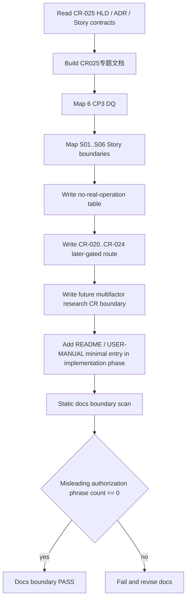

# LLD: CR025-S06 - QMT 后续路线衔接与用户文档边界

本文档冻结 CR-025 用户可读文档和 follow-up handoff 的边界：semantic diff、`order_intent_draft_v1`、Backtrader reference/no-copy、optional runtime boundary、no-real-operation safety、CR-020..CR-024 QMT 后续路线和 CR-030 多因子研究框架借鉴候选边界必须可追溯，但不得被解释为真实交易、gateway 启动、dependency install、Backtrader run、simulation/live、publish 或多因子研究主框架实现授权。CR025 全量 CP5 已人工确认通过；后续文档实现仍不得发布真实运行授权。

## 1. Goal

创建 `docs/CR025-RESEARCH-EXECUTION-SEMANTIC-ALIGNMENT.md` 的文档设计，并定义 README / USER-MANUAL 的最小共享更新边界，使用户能理解 CR-025 的 research execution semantic alignment、artifact、draft、no-copy、no-real-operation、QMT 后续路线和多因子研究后续 CR 边界。完成后，CR-020..CR-024 只可把 CR-025 输出作为 later-gated 输入，不继承 CR-025 的任何运行授权；FactorSpec、FactorRunSpec、IC / RankIC、分层收益、多因子组合、实验追踪和策略准入包只进入后续 CR，参考 Qlib / Alphalens / vnpy.alpha，但不在 CR-025 集成。

## 2. Requirements（Functional / Non-Functional）

### 2.1 Functional

- 文档必须覆盖 6 个 CP3 DQ：Backtrader 定位、模块矩阵/no-copy、GPLv3 治理、clean feed / semantic diff、order intent draft / QMT 边界、no-real-operation。
- 文档必须覆盖 6 个 CR-025 Story 边界：S01 clean feed / selector、S02 semantic diff、S03 order intent draft、S04 module reference/no-copy、S05 safety verification、S06 route docs。
- semantic diff 必须声明 baseline / reference 双轨、unavailable、limitations、非 production truth、非 simulation-ready。
- order intent draft 必须声明 `order_intent_draft_v1`、not order、not authorization、later-gated consumer。
- Backtrader boundary 必须声明 optional dependency、lazy import、no-copy、`migration_candidate=[]`。
- QMT route 必须声明 CR-020..CR-024 需独立 CR / CP / stage gate / per-run authorization。
- multifactor research route 必须声明 FactorSpec、FactorRunSpec、IC / RankIC、分层收益、多因子组合、实验追踪和策略准入包另起后续 CR；Qlib / Alphalens / vnpy.alpha 只作为后续 CR 参考方向，不作为 CR-025 依赖、runner 或集成产物。
- no-real-operation 表必须覆盖 LLD、实现、依赖变更、Backtrader run、Backtrader source copy、broker、QMT / MiniQMT / XtQuant、provider、lake、broker lake、publish、simulation/live、credential read。
- “CR-025 verified 授权真实操作”语义匹配次数必须为 0。
- “CR-025 implements / 已实现多因子研究主框架”及 FactorSpec / IC / RankIC / strategy admission package 等越界实现声明匹配次数必须为 0。

### 2.2 Non-Functional

- 安全：文档不得包含真实凭据示例、账户号、session、cookie、token、交易密码或真实私有路径。
- 可读性：文档面向研究者和后续 QMT route owner，使用“允许 / 不授权 / later-gated / failure mode”分区。
- 可维护：README 和 USER-MANUAL 只做最小入口说明；CR-025 专题文档承载完整边界。
- 可验证：文档内容必须能被静态扫描验证，不依赖对话上下文。
- 边界：不得新增 gateway service start、dependency install、Backtrader run as default、simulation/live、publish 操作步骤。

## 3. 模块拆分与职责

| 模块 / 文件组 | 职责 | 说明 |
|---|---|---|
| `docs/CR025-RESEARCH-EXECUTION-SEMANTIC-ALIGNMENT.md` | 汇总 CR-025 架构、artifact、draft、Backtrader no-copy、no-real-operation 和 follow-up route | 当前 Story primary |
| `README.md` | 提供 CR-025 专题文档入口和不授权摘要 | shared；实现需 CP5 后由 meta-po 串行合并 |
| `docs/USER-MANUAL.md` | 提供用户视角边界、故障说明和后续 CR 路线 | shared；实现需 CP5 后由 meta-po 串行合并 |
| `process/HLD.md#34` | 提供 CR-025 总体架构、module matrix、semantic diff、order intent 边界 | 强输入 |
| `process/HLD-QMT-TRADING.md#18` | 提供 QMT 消费边界和失败路径 | 强输入 |
| `process/ARCHITECTURE-DECISION.md#ADR-074..ADR-078` | 提供 Backtrader 定位、no-copy、QMT draft 决策和多因子研究后续 CR 边界 | 强输入 |
| `process/stories/CR019-S09-deferred-capability-register.md` | 提供后续能力台账与 CR route 输入 | 只读 follow-up contract |

## 4. 代码结构与文件影响范围

| 动作 | 文件路径 | 变更内容 |
|---|---|---|
| 创建 | `docs/CR025-RESEARCH-EXECUTION-SEMANTIC-ALIGNMENT.md` | 定义 CR-025 用户可读专题文档，覆盖 artifact、draft、Backtrader boundary、QMT later-gated route、no-real-operation 表 |
| 修改 | `README.md` | 后续实现时添加最小入口和不授权摘要；本 LLD 阶段不修改 |
| 修改 | `docs/USER-MANUAL.md` | 后续实现时添加用户手册增量边界和故障说明；本 LLD 阶段不修改 |

## 5. 数据模型与持久化设计

本 Story 无新增运行时数据模型或持久化写入。文档只描述已冻结合同和后续路线，不生成 semantic diff artifact、不生成 order intent draft、不写 reports、不写 lake、不写 broker lake、不 publish。

| 对象 / 字段 | 类型 | 约束 | 说明 |
|---|---|---|---|
| `CR025DocSection` | 文档章节 | 必须覆盖 overview、allowed、not-authorized、artifacts、QMT route、failure handling | 文档结构合同 |
| `StoryBoundaryRow` | 表格行 | 6 个 CR025 Story 各 1 行以上 | Story 边界可追溯 |
| `DecisionTraceRow` | 表格行 | 6 个 CP3 DQ 各 1 行以上 | CP3 决策可追溯 |
| `NoRealOperationRow` | 表格行 | 覆盖至少 16 类不授权事项 | 与 CP4 no-real-operation boundary 对齐 |
| `FollowUpRouteRow` | 表格行 | CR-020..CR-024 均标注 later-gated / independent authorization | 不继承授权 |
| `FutureMultiFactorResearchRouteRow` | 表格行 | 包含 FactorSpec、FactorRunSpec、IC / RankIC、分层收益、多因子组合、实验追踪、策略准入包和 Qlib / Alphalens / vnpy.alpha 参考方向 | follow-up CR only；不继承 CR-025 授权 |
| `ForbiddenPhraseFinding` | 静态扫描结果 | “verified 授权真实操作”等误导语义命中为 0 | S05 / docs scan 消费 |

## 6. API / Interface 设计

| 接口 / 入口 | 输入 | 输出 | 调用方 | 说明 |
|---|---|---|---|---|
| `docs/CR025-RESEARCH-EXECUTION-SEMANTIC-ALIGNMENT.md` | HLD §34、HLD-QMT §18、ADR-074..078、S01..S06 Story | 用户可读专题文档 | user、meta-doc、meta-qa | T-S06-01 至 T-S06-05 / T-S06-12 覆盖 |
| README CR-025 entry | 专题文档路径和不授权摘要 | README 最小入口 | user | T-S06-06 覆盖 |
| USER-MANUAL CR-025 boundary | 专题文档路径、failure handling、后续 CR route | 用户手册说明 | user | T-S06-07 覆盖 |
| QMT follow-up route table | CR-020..CR-024 route metadata | later-gated handoff table | meta-po / future CR | T-S06-08 覆盖 |
| Future multifactor research route table | ADR-078、CR-026+ 候选路线、后续用户启动输入 | follow-up CR boundary table | meta-po / future CR | T-S06-12 覆盖 |
| no-real-operation table | CP3 / CP4 禁止项 | 不授权计数与类别 | meta-qa / S05 tests | T-S06-09 覆盖 |

错误暴露 / 禁止语义使用稳定文档标签：`not_authorized`、`later_gated`、`independent_cr_required`、`not_order`、`not_simulation_ready`、`not_production_truth`、`not_multifactor_framework`、`follow_up_multifactor_cr_required`、`no_dependency_install`、`no_gateway_start`、`no_credential_example`、`no_publish`。

## 7. 核心处理流程



1. 专题文档以 HLD §34、HLD-QMT §18、ADR-074..078 和 S01..S06 Story 为唯一设计输入。
2. 文档先说明 CR-025 是 research semantic alignment，不是 QMT route activation。
3. 文档建立 6 个 CP3 DQ 到章节的追溯表。
4. 文档建立 6 个 Story 到 artifact / 禁止项 / 后续验证的追溯表。
5. 文档写 no-real-operation 表，明确不授权实现、依赖、Backtrader run/source copy、QMT/provider/lake/publish/simulation/live/credential。
6. 文档写 CR-020..CR-024 后续路线：每项独立 CR / CP / stage gate / per-run authorization。
7. 文档写多因子研究后续 CR 边界：FactorSpec、FactorRunSpec、IC / RankIC、分层收益、多因子组合、实验追踪和策略准入包另起 CR，Qlib / Alphalens / vnpy.alpha 仅作为参考方向，不在 CR-025 集成。
8. README / USER-MANUAL 只放入口和短边界；不得写运行步骤、安装依赖步骤或多因子研究框架启用步骤。

## 8. 技术设计细节

- 文档章节建议：Overview、What CR-025 Produces、What CR-025 Does Not Authorize、Artifact Contracts、Backtrader Boundary、QMT Later-Gated Route、Future Multi-factor Research CR Boundary、Failure Handling、Traceability、No-Real-Operation Table。
- CP3 DQ 追溯：DQ-01 对应 Backtrader optional semantic reference；DQ-02 对应 module matrix / no-copy；DQ-03 对应 GPLv3 governance；DQ-04 对应 clean feed / semantic diff；DQ-05 对应 order intent / QMT boundary；DQ-06 对应 no-real-operation。
- Story 追溯：S01/S02/S03/S04/S05/S06 每个 Story 必须至少出现一次，且标出 artifact、禁止项和验证入口。
- QMT route：CR-020 gateway health、CR-021 simulation、CR-022 live-readonly、CR-023 small-live、CR-024 scale-up 均必须标注 independent authorization；CR-025 CP5 / CP8 通过不授予运行权。
- 多因子研究 route：FactorSpec、FactorRunSpec、IC / RankIC、分层收益、多因子组合、实验追踪和策略准入包均标注 follow-up CR only；Qlib / Alphalens / vnpy.alpha 只能出现在“后续参考方向”上下文，不能出现安装、运行、provider fetch、lake write、publish、simulation/live 或凭据读取步骤。
- README / USER-MANUAL：只添加专题文档链接、摘要和 “not authorized” 提醒，不添加 `pip install`、`uv add backtrader`、`uv add qlib`、gateway start、publish 或 live run 步骤。
- 兼容性处理：CR019-S09 只作为 deferred route 参考，CR-019 不被重开，CR-025 文档不扩大 CR-019 已关闭范围。
- 图示类型选择：本 Story 跨专题文档、README、USER-MANUAL、follow-up route 和验证扫描，已在第 7 节提供流程图。

## 9. 安全与性能设计

| 维度 | 设计措施 | 验证方式 |
|---|---|---|
| 安全 | 文档不包含真实凭据示例、账户号、session、cookie、token 或交易密码 | T-S06-10 |
| 安全 | CR-020..CR-024 全部标注 independent authorization，不继承 CR-025 | T-S06-08 |
| 安全 | no-real-operation 表覆盖至少 16 类禁止事项 | T-S06-09 |
| 合规 | Backtrader no-copy、`migration_candidate=[]` 和 optional dependency boundary 可见 | T-S06-04 |
| 范围 | 多因子研究闭环标注 follow-up CR only，不被写成 CR-025 已实现或已授权 | T-S06-12 |
| 可测试 | 文档边界可通过静态扫描验证，误导授权语义命中为 0 | T-S06-11 |
| 性能 | 文档静态扫描只读 Markdown 文件，不启动外部服务 | T-S06-11 |

## 10. 测试设计

| 测试场景 | 前置条件 | 操作 | 预期结果 | 验证方式 |
|---|---|---|---|---|
| T-S06-01 专题文档存在且章节完整 | CP5 后文档实现 | 扫描章节标题 | Overview / artifacts / not-authorized / route / traceability 存在 | docs static scan |
| T-S06-02 覆盖 6 个 CP3 DQ | 专题文档 | 扫描 DQ-CP3-CR025-01..06 或等价表 | 6/6 可追溯 | docs static scan |
| T-S06-03 覆盖 6 个 Story 边界 | 专题文档 | 扫描 CR025-S01..S06 | 6/6 可追溯 | docs static scan |
| T-S06-04 Backtrader boundary 可见 | 专题文档 | 扫描 optional dependency、lazy import、no-copy、migration_candidate=[] | 均存在且不作为默认运行 | docs static scan |
| T-S06-05 semantic diff / order intent 边界可见 | 专题文档 | 扫描 research comparison、not production truth、not order、not authorization | 均存在 | docs static scan |
| T-S06-06 README 最小入口不授权 | README | 扫描 CR-025 entry | 只含入口和不授权摘要，无运行步骤 | docs static scan |
| T-S06-07 USER-MANUAL 边界和故障说明 | USER-MANUAL | 扫描 boundary / failure handling | 未安装 Backtrader、QMT 未授权、lineage 缺失等失败路径可见 | docs static scan |
| T-S06-08 CR-020..CR-024 不继承授权 | 专题文档 | 扫描 route table | 每项标注 later-gated / independent authorization | docs static scan |
| T-S06-09 no-real-operation 表覆盖 | 专题文档 | 扫描禁止类别 | 至少 16 类不授权事项存在 | docs static scan |
| T-S06-10 无凭据示例 | docs | 扫描 token/secret/session/account/password 示例 | 真实凭据示例命中为 0 | docs static scan |
| T-S06-11 误导授权语义为 0 | docs | 扫描 “CR-025 verified 授权真实操作” 等语义 | 命中为 0 | docs static scan |
| T-S06-12 多因子研究后续 CR 边界 | 专题文档 / README / USER-MANUAL | 扫描 FactorSpec、FactorRunSpec、IC / RankIC、分层收益、多因子组合、实验追踪、策略准入包、Qlib / Alphalens / vnpy.alpha 上下文 | 均标注 follow-up CR / not authorized；CR-025 集成或已实现声明命中为 0 | docs static scan |

## 11. 实施步骤

| TASK-ID | 动作 | 目标文件 | 详细描述 | 对应测试 |
|---|---|---|---|---|
| CR025-S06-T1 | 创建 | `docs/CR025-RESEARCH-EXECUTION-SEMANTIC-ALIGNMENT.md` | 编写专题文档，覆盖 artifact、draft、Backtrader boundary、QMT route、多因子研究后续 CR、no-real-operation 表和 traceability | T-S06-01 至 T-S06-05 / T-S06-08 / T-S06-09 / T-S06-12 |
| CR025-S06-T2 | 修改 | `README.md` | 添加 CR-025 专题文档入口和不授权摘要，不添加依赖安装、运行步骤或多因子研究框架启用说明 | T-S06-06 / T-S06-11 / T-S06-12 |
| CR025-S06-T3 | 修改 | `docs/USER-MANUAL.md` | 添加用户手册增量边界、失败路径、后续 QMT route 和后续多因子研究 CR 提醒，不写真实凭据示例 | T-S06-07 / T-S06-10 / T-S06-11 / T-S06-12 |
| CR025-S06-T4 | 创建 | `docs/CR025-RESEARCH-EXECUTION-SEMANTIC-ALIGNMENT.md` | 写 CR-020..CR-024 independent authorization table、多因子研究 follow-up CR table 与 follow-up handoff 文本 | T-S06-08 / T-S06-12 |

## 12. 风险、难点与预研建议

### 12.1 实现灰区与取舍记录

| Clarification ID | 问题 | 选项与推荐 | 决策 / 答案 | 影响面 | 证据 | 重访条件 |
|---|---|---|---|---|---|---|
| 无 | 本 Story 未发现阻断 LLD 的文档灰区；文档边界、QMT 后续路线和多因子研究后续 CR 边界已由 Story、HLD-QMT §18、ADR-077 与 ADR-078 明确 | 推荐创建专题文档并在 README / USER-MANUAL 放最小入口；备选把全部内容并入 README 不推荐，因会扩大共享文档冲突 | 非阻断；不写入 `STATE.md` clarification queue | 文档 / 安全 / 跨 Story 契约 / follow-up route / CP5 Decision Brief | HLD §34、HLD-QMT §18、ADR-074..078、Story 卡片 | 若用户要求 CR-025 文档包含真实 gateway 启动、QMT 操作步骤或多因子研究框架实现步骤，必须另起 CR 或回退 CP5 |

| 风险 / 难点 | 影响 | 缓解措施 / 预研建议 |
|---|---|---|
| 文档被误读为真实运行授权 | 用户可能尝试启动 gateway 或 live route | no-real-operation 表和 CR-020..CR-024 independent authorization 表必须靠前可见 |
| README / USER-MANUAL 共享文件冲突 | 与其他 CR 文档合并冲突 | 专题文档承载详情；共享文件只放最小入口，CP5 后串行合并 |
| 文档包含 dependency install 或 Backtrader run 默认步骤 | 误导用户越过 CP5 / runtime authorization | 静态扫描禁止 install/run/publish/live 授权语义 |
| CR019 follow-up 被误解为重开 CR-019 | 范围混乱 | 明确 CR019-S09 仅作 deferred route 输入，CR-020..CR-024 需独立启动 |
| 多因子研究路线被误写成本轮交付 | CR-025 范围膨胀，并可能误导用户认为 FactorSpec / IC / RankIC 已可用 | ADR-078 边界和 T-S06-12 扫描要求后续 CR / not authorized 上下文 |

### OPEN / Spike 跟踪

| ID | 类型（OPEN / Spike） | 问题 | 下一动作 | 责任方 |
|---|---|---|---|---|
| 无 | N/A | 无阻断 OPEN / Spike；文档实现需等待 CR025 全量 CP5 人工确认和共享文件 owner 调度 | 等待 CR025 全量 CP5 人工确认 | meta-po / user |

## 13. 回滚与发布策略

- 发布方式：仅在 CR025-S01..S06 全量 LLD、CP5 自动预检和 CP5 人工确认通过后，按 Wave 与 dev_gate 调度文档实现；README / USER-MANUAL 共享更新需由 meta-po 串行合并。
- 回滚触发条件：文档声明 CR-025 授权真实操作、包含 gateway start / dependency install / Backtrader run 默认步骤、包含真实凭据示例、声明 semantic diff 为 production truth 或 simulation-ready、声明 CR-020..CR-024 继承授权，或声明 CR-025 已实现 / 授权 FactorSpec、IC / RankIC、分层收益、多因子组合、实验追踪、策略准入包、Qlib / Alphalens / vnpy.alpha 集成。
- 回滚动作：回退 `docs/CR025-RESEARCH-EXECUTION-SEMANTIC-ALIGNMENT.md`、`README.md`、`docs/USER-MANUAL.md` 的实现修改；Story 回到 LLD 修订态，由 meta-po 重新纳入 CP5 批次。
- 禁止回滚方式：不得删除 CR-020..CR-024 later-gated 声明或 no-real-operation 表来缩短文档。

## 14. Definition of Done

- [ ] 14 个章节全部填写完成。
- [ ] 文档覆盖 6 个 CP3 DQ 和 6 个 CR-025 Story 边界。
- [ ] CR-020..CR-024 不继承 CR-025 授权声明至少出现 1 处且位置可追溯。
- [ ] 多因子研究闭环另起后续 CR 的声明至少出现 1 处，且包含 FactorSpec、FactorRunSpec、IC / RankIC、分层收益、多因子组合、实验追踪、策略准入包和 Qlib / Alphalens / vnpy.alpha 参考方向。
- [ ] no-real-operation 表覆盖 LLD、实现、依赖变更、Backtrader run、Backtrader source copy、broker、QMT / MiniQMT / XtQuant、provider、lake、broker lake、publish、simulation/live、credential read。
- [ ] “CR-025 verified 授权真实操作”语义匹配次数为 0。
- [ ] “CR-025 implements / 已实现多因子研究主框架”及 FactorSpec / IC / RankIC / strategy admission package 等越界实现声明匹配次数为 0。
- [ ] README / USER-MANUAL 只包含最小入口和不授权摘要，不包含真实运行步骤。
- [ ] `confirmed=false`、全量 CP5 未 approved 和 dev_gate 未满足前不进入实现或文档发布。
- [ ] OPEN / Spike 已清点为无阻断项。

## 人工确认区

> **CP5 - Story LLD 可实现性门**
> meta-dev 先写入 `process/checks/CP5-CR025-S06-route-docs-and-follow-up-handoff-LLD-IMPLEMENTABILITY.md` 自动预检结果。
> meta-po 收齐 CR025-S01..S06 全部 LLD、CP4 自动预检摘要和 CP5 自动预检后，再生成并提示用户审查 `checkpoints/CP5-CR025-RESEARCH-EXECUTION-SEMANTIC-ALIGNMENT-BATCH-A-LLD-BATCH.md`。
> 用户统一确认全部目标 Story 的 LLD 后，仍需满足 Wave、依赖门控、文件所有权门控和 no-real-operation 边界方可进入实现。

**CP5 checklist 摘要**：

| # | 检查项 | 状态 | 证据 |
|---|---|---|---|
| 1 | LLD 覆盖 AC | 待检查 | 第 2 / 10 / 14 节 |
| 2 | 与 HLD / ADR 一致 | 待检查 | 第 3 / 8 / 12 节 |
| 3 | 文件影响范围明确 | 待检查 | 第 4 / 11 节 |
| 4 | 接口契约完整 | 待检查 | 第 5 / 6 节 |
| 5 | 测试与 dev_gate 可计算 | 待检查 | 第 10 / 14 节 |
| 6 | clarification queue 已收敛 | 待检查 | 第 12.1 节 |

**人工确认回复**：

请直接回复以下任一整行：

```text
approve
修改: <具体修改点>
reject
```

**人工审查结果回填**：

- 结论：`approved | changes_requested | rejected`
- 审查人：
- 审查时间：
- 修改意见：
- 风险接受项：
